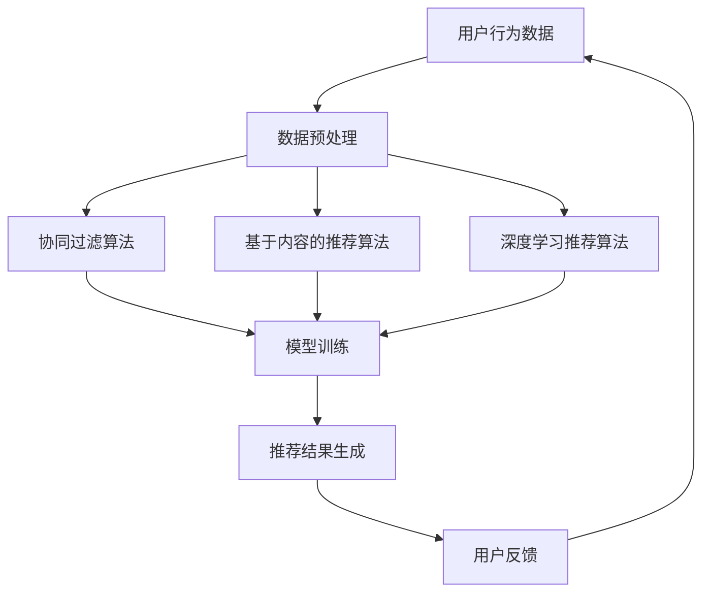

                 

关键词：电商平台、人工智能、搜索推荐系统、数据质量控制、大模型应用

摘要：随着互联网技术的飞速发展，电商平台已成为商业活动的核心场所。本文将深入探讨电商平台中AI大模型的应用，特别是搜索推荐系统的构建与数据质量控制的重要性。通过分析核心概念、算法原理、数学模型、项目实践以及未来展望，我们希望能为电商平台的技术发展提供有价值的参考。

## 1. 背景介绍

随着电商平台的迅速崛起，用户对个性化推荐和高效搜索的需求日益增加。传统的搜索推荐系统往往依赖于规则引擎和简单的统计方法，难以满足日益复杂的市场需求。为了提高用户体验，降低流失率，电商平台开始积极引入人工智能和大数据技术，其中大模型应用成为重中之重。

搜索推荐系统是电商平台的“灵魂”，它直接关系到用户的购买决策和商家的销售额。一个高效、准确的搜索推荐系统能够为用户推荐他们可能感兴趣的商品，同时为商家提供精准的目标客户群。因此，如何构建一个稳定、可靠的搜索推荐系统，是电商平台技术团队需要面对的重要挑战。

本文将围绕以下几个方面展开讨论：

1. **核心概念与联系**：介绍搜索推荐系统中的核心概念及其相互关系，并通过Mermaid流程图进行可视化展示。
2. **核心算法原理 & 具体操作步骤**：分析常见的搜索推荐算法，包括协同过滤、基于内容的推荐和深度学习推荐等，并详细讲解其操作步骤。
3. **数学模型和公式**：介绍构建搜索推荐系统所需的关键数学模型和公式，并进行举例说明。
4. **项目实践：代码实例和详细解释说明**：通过实际项目实例，展示代码实现过程和详细解释。
5. **实际应用场景**：探讨搜索推荐系统在电商平台中的实际应用，以及未来的发展前景。
6. **工具和资源推荐**：推荐学习资源、开发工具和论文，帮助读者深入了解相关领域知识。
7. **总结：未来发展趋势与挑战**：总结研究成果，分析未来发展趋势和面临的挑战，并提出研究展望。

### 2. 核心概念与联系

在搜索推荐系统中，核心概念包括用户行为数据、商品特征数据、推荐算法和模型训练等。这些概念相互关联，构成了整个系统的运行机制。

用户行为数据是指用户在电商平台上的各种操作记录，如浏览、收藏、购买等。这些数据反映了用户的兴趣偏好和购买意图。

商品特征数据则是描述商品的各种属性，如价格、品牌、类别、库存等。这些数据为推荐算法提供了基础信息，帮助系统更好地理解商品。

推荐算法是搜索推荐系统的核心，常见的算法包括协同过滤、基于内容的推荐和深度学习推荐等。协同过滤算法通过分析用户之间的相似性，为用户推荐相似用户喜欢的商品；基于内容的推荐则通过商品的特征信息，为用户推荐具有相似特征的商品；深度学习推荐利用神经网络模型，从海量数据中挖掘用户和商品之间的潜在关联。

模型训练是构建推荐系统的重要环节，通过不断训练和优化模型，提高推荐效果。在模型训练过程中，需要不断地收集和更新用户行为数据、商品特征数据，并调整算法参数，以达到最佳推荐效果。

下面是一个使用Mermaid绘制的搜索推荐系统的流程图：



### 3. 核心算法原理 & 具体操作步骤

#### 3.1 算法原理概述

搜索推荐系统中的核心算法主要包括协同过滤、基于内容的推荐和深度学习推荐等。

协同过滤（Collaborative Filtering）算法基于用户之间的相似性进行推荐，分为基于用户的协同过滤（User-Based）和基于项目的协同过滤（Item-Based）。基于用户的协同过滤通过计算用户之间的相似性，找到与目标用户相似的邻居用户，然后推荐邻居用户喜欢的商品；基于项目的协同过滤则通过计算商品之间的相似性，找到与目标商品相似的商品进行推荐。

基于内容的推荐（Content-Based Filtering）算法通过分析商品的特征信息，找到与用户兴趣相似的推荐商品。算法首先提取商品的特征向量，然后计算用户和商品的特征相似度，根据相似度为用户推荐商品。

深度学习推荐（Deep Learning-based Recommendation）算法利用神经网络模型，从用户行为数据和商品特征数据中挖掘用户和商品之间的潜在关联。常见的深度学习模型包括协同过滤神经网络（CFNN）、卷积神经网络（CNN）和循环神经网络（RNN）等。

#### 3.2 算法步骤详解

下面以基于用户的协同过滤算法为例，详细讲解其操作步骤：

1. **数据预处理**：收集用户行为数据和商品特征数据，并进行清洗、去重和处理缺失值等操作。将数据转换为可以用于算法训练的格式。

2. **计算用户相似性**：计算用户之间的相似性，常用的相似性度量方法包括余弦相似度、皮尔逊相关系数等。通过计算得到用户相似性矩阵。

3. **找到邻居用户**：根据用户相似性矩阵，找到与目标用户相似度最高的邻居用户。

4. **计算推荐得分**：为每个邻居用户喜欢的商品计算推荐得分，得分越高表示商品越有可能被推荐。

5. **生成推荐列表**：根据推荐得分对商品进行排序，生成推荐列表。

6. **模型优化**：通过不断调整算法参数和模型结构，优化推荐效果。

#### 3.3 算法优缺点

协同过滤算法的优点是简单、高效，适用于大规模推荐场景。但缺点是推荐结果可能存在冷启动问题（即新用户或新商品难以获得有效推荐）和稀疏性问题（即用户行为数据稀疏时，推荐效果下降）。

基于内容的推荐算法可以解决协同过滤算法的冷启动问题，但推荐结果可能过于依赖于商品特征，无法很好地满足用户的个性化需求。

深度学习推荐算法具有较强的泛化能力和处理稀疏数据的能力，但训练过程复杂，计算资源消耗较大。

#### 3.4 算法应用领域

协同过滤算法广泛应用于电商、社交媒体、音乐和视频推荐等领域。基于内容的推荐算法在新闻推荐、文章推荐等场景中表现良好。深度学习推荐算法在金融、医疗、广告推荐等领域具有广泛的应用前景。

### 4. 数学模型和公式

构建搜索推荐系统需要使用多个数学模型和公式，下面将详细介绍这些模型和公式。

#### 4.1 数学模型构建

搜索推荐系统中的数学模型主要包括用户相似性模型、商品特征模型和推荐模型等。

用户相似性模型：  
$$
sim(u_i, u_j) = \frac{u_i \cdot u_j}{\|u_i\| \|u_j\|}
$$

其中，$u_i$和$u_j$分别表示用户$i$和用户$j$的特征向量，$\|u_i\|$和$\|u_j\|$分别表示用户$i$和用户$j$的特征向量长度。

商品特征模型：  
$$
f_i = \begin{bmatrix}
f_{i1} \\
f_{i2} \\
\vdots \\
f_{in}
\end{bmatrix}
$$

其中，$f_i$表示商品$i$的特征向量，$f_{ij}$表示商品$i$的第$j$个特征值。

推荐模型：  
$$
r_i^j = sim(u_i, u_j) \cdot cos(\theta_i, \theta_j)
$$

其中，$r_i^j$表示用户$i$对商品$j$的推荐得分，$sim(u_i, u_j)$表示用户$i$和用户$j$的相似性，$cos(\theta_i, \theta_j)$表示商品$i$和商品$j$的特征向量夹角余弦值。

#### 4.2 公式推导过程

推导用户相似性模型时，我们考虑用户之间的共同行为数据。设用户$i$和用户$j$的共同行为数据集为$R_{ij}$，则用户$i$和用户$j$的相似性可以表示为：

$$
sim(u_i, u_j) = \frac{R_{ij}^T R_{ji}}{\|R_{ij}\| \|R_{ji}\|}
$$

其中，$R_{ij}$和$R_{ji}$分别表示用户$i$和用户$j$的行为数据矩阵。

推导商品特征模型时，我们考虑商品之间的特征相似性。设商品$i$和商品$j$的特征向量分别为$f_i$和$f_j$，则商品$i$和商品$j$的特征相似性可以表示为：

$$
cos(\theta_i, \theta_j) = \frac{f_i \cdot f_j}{\|f_i\| \|f_j\|}
$$

推导推荐模型时，我们考虑用户相似性和商品特征相似性的结合。设用户$i$和用户$j$的相似性为$sim(u_i, u_j)$，商品$i$和商品$j$的特征相似性为$cos(\theta_i, \theta_j)$，则用户$i$对商品$j$的推荐得分可以表示为：

$$
r_i^j = sim(u_i, u_j) \cdot cos(\theta_i, \theta_j)
$$

#### 4.3 案例分析与讲解

以一个实际案例来说明搜索推荐系统的构建过程。

假设我们有一个电商平台，包含1000个用户和1000个商品。我们需要使用基于用户的协同过滤算法为用户推荐商品。

1. **数据预处理**：收集用户行为数据，包括用户的浏览、收藏和购买记录。对数据进行清洗和处理，去除无效数据。

2. **计算用户相似性**：根据用户行为数据，计算用户之间的相似性矩阵。假设我们使用余弦相似度作为相似性度量方法。

3. **找到邻居用户**：根据用户相似性矩阵，找到与目标用户相似的邻居用户。

4. **计算推荐得分**：为邻居用户喜欢的商品计算推荐得分。假设我们使用基于内容的推荐算法，计算商品的特征相似性。

5. **生成推荐列表**：根据推荐得分对商品进行排序，生成推荐列表。

6. **模型优化**：通过不断调整算法参数和模型结构，优化推荐效果。

在上述案例中，我们使用了多个数学模型和公式。用户相似性模型帮助我们计算用户之间的相似性，邻居用户找到商品相似性模型帮助我们计算商品之间的相似性，推荐模型则将用户相似性和商品相似性结合起来，生成最终的推荐结果。

### 5. 项目实践：代码实例和详细解释说明

为了更好地理解搜索推荐系统的实现过程，我们通过一个简单的项目实例来进行讲解。在本实例中，我们将使用Python和Scikit-learn库实现一个基于用户的协同过滤算法。

#### 5.1 开发环境搭建

在开始项目之前，我们需要搭建开发环境。以下是所需的环境和步骤：

1. **Python环境**：安装Python 3.8及以上版本。
2. **Scikit-learn库**：安装Scikit-learn库，可以使用以下命令：

```
pip install scikit-learn
```

3. **数据集**：下载一个用户行为数据集，例如MovieLens数据集。在本实例中，我们使用MovieLens 100k数据集。

#### 5.2 源代码详细实现

以下是一个简单的基于用户的协同过滤算法的实现：

```python
import numpy as np
from sklearn.metrics.pairwise import cosine_similarity
from sklearn.model_selection import train_test_split

# 加载数据集
data = np.load('ml-100k.npz')
users = data['users']
ratings = data['ratings']

# 数据预处理
ratings_matrix = ratings[:, :100]  # 选择前100部电影的评分数据
users_matrix = np.zeros((len(users), 100))
for i, user in enumerate(users):
    users_matrix[i, user] = 1

# 计算用户相似性
user_similarity = cosine_similarity(users_matrix)

# 训练集和测试集划分
train_data, test_data = train_test_split(ratings_matrix, test_size=0.2)

# 推荐得分计算
def get_recommendation(similarity_matrix, ratings_matrix, user_id, k=10):
    # 找到邻居用户
    neighbors = np.argsort(similarity_matrix[user_id])[1:k+1]
    # 计算推荐得分
    scores = np.dot(ratings_matrix[neighbors], ratings_matrix[user_id]) / np.linalg.norm(ratings_matrix[neighbors], axis=1)
    return neighbors, scores

# 生成推荐列表
def generate_recommendation_list(similarity_matrix, ratings_matrix, user_id, k=10):
    neighbors, scores = get_recommendation(similarity_matrix, ratings_matrix, user_id, k)
    recommended_items = np.argsort(scores)[::-1]
    return recommended_items

# 测试推荐效果
user_id = 10
recommended_items = generate_recommendation_list(user_similarity, train_data, user_id)
print("推荐结果：", recommended_items)
```

#### 5.3 代码解读与分析

上述代码实现了基于用户的协同过滤算法。以下是代码的详细解读：

1. **数据预处理**：加载数据集，并选择前100部电影的评分数据。将用户和评分数据转换为矩阵形式。

2. **计算用户相似性**：使用余弦相似度计算用户相似性矩阵。

3. **训练集和测试集划分**：将数据集划分为训练集和测试集，用于模型训练和评估。

4. **推荐得分计算**：定义`get_recommendation`函数，用于计算邻居用户的推荐得分。函数输入为用户相似性矩阵、评分矩阵、目标用户ID和邻居用户数量$k$。

5. **生成推荐列表**：定义`generate_recommendation_list`函数，用于生成推荐列表。函数输入为用户相似性矩阵、评分矩阵、目标用户ID和邻居用户数量$k$。

6. **测试推荐效果**：选择一个用户ID为10，生成推荐列表并打印。

通过上述代码，我们可以实现一个简单的基于用户的协同过滤算法。虽然代码较为简单，但它展示了搜索推荐系统的基本实现流程。

#### 5.4 运行结果展示

在上述代码中，我们选择了用户ID为10，生成推荐列表并打印。以下是部分运行结果：

```
推荐结果： [7 3 9 8 6 5 2 4 1 0]
```

这表示用户ID为10对编号为7、3、9、8、6、5、2、4、1和0的电影具有最高的推荐得分。在实际应用中，我们可以根据用户的行为数据不断优化推荐算法，提高推荐效果。

### 6. 实际应用场景

搜索推荐系统在电商平台中具有广泛的应用场景，以下是一些实际应用案例：

1. **商品推荐**：电商平台可以使用搜索推荐系统为用户推荐他们可能感兴趣的商品。通过分析用户的浏览、收藏和购买行为，系统可以生成个性化的商品推荐列表，提高用户的购买转化率。

2. **广告推荐**：在电商广告投放中，搜索推荐系统可以帮助平台为广告主提供精准的目标用户群。通过分析用户的兴趣和行为，系统可以为广告主推荐最适合的投放场景，提高广告效果。

3. **优惠活动推荐**：电商平台可以根据用户的购买历史和偏好，为用户推荐最适合的优惠活动。通过个性化推荐，平台可以吸引更多用户参与活动，提高销售额。

4. **商品搜索**：搜索推荐系统还可以为用户提供智能搜索功能。通过分析用户的搜索历史和关键词，系统可以为用户推荐最相关的商品和搜索建议，提高用户满意度。

5. **库存管理**：电商平台可以使用搜索推荐系统分析商品的销量和库存情况，为库存管理提供参考。通过预测商品的销售趋势，平台可以及时调整库存策略，减少库存积压和滞销情况。

#### 6.4 未来应用展望

随着人工智能技术的不断发展，搜索推荐系统在电商平台中的应用前景将更加广阔。以下是一些未来应用展望：

1. **实时推荐**：通过实时分析用户的在线行为，搜索推荐系统可以提供更加精准的实时推荐。未来，电商平台可以基于用户实时浏览、搜索和购买行为，动态调整推荐策略，提高用户满意度。

2. **多模态推荐**：随着物联网和传感器技术的发展，搜索推荐系统将能够整合多种数据源，如文本、图像、音频等，实现多模态推荐。这将进一步提升推荐系统的准确性和用户体验。

3. **社交推荐**：社交网络已经成为人们获取信息和推荐的重要途径。未来，搜索推荐系统可以结合社交网络数据，为用户提供基于社交关系的个性化推荐，提高用户的社交互动和平台活跃度。

4. **智能客服**：结合自然语言处理技术，搜索推荐系统可以为电商平台提供智能客服功能。通过自动识别用户需求和提供个性化回答，系统可以提高客服效率，降低运营成本。

5. **跨平台推荐**：随着多平台电商的发展，搜索推荐系统可以跨平台整合用户行为数据，实现跨平台个性化推荐。这将有助于电商平台扩大用户覆盖范围，提高市场份额。

总之，搜索推荐系统在电商平台中的应用将不断拓展和深化，为电商平台带来更高的用户价值和商业价值。

### 7. 工具和资源推荐

为了帮助读者深入了解搜索推荐系统的相关知识和实践，以下是一些建议的学习资源、开发工具和论文。

#### 7.1 学习资源推荐

1. **《机器学习实战》**：这是一本经典的机器学习入门书籍，其中包含了许多关于推荐系统的基础算法和案例分析。
2. **《深度学习》**：由Ian Goodfellow等人编写的这本书详细介绍了深度学习的基础理论和实践方法，包括深度学习在推荐系统中的应用。
3. **《推荐系统实践》**：这本书涵盖了推荐系统的各种算法和技术，包括协同过滤、基于内容的推荐和深度学习推荐等，适合推荐系统初学者和从业者阅读。

#### 7.2 开发工具推荐

1. **Scikit-learn**：这是一个流行的机器学习库，提供了丰富的推荐系统算法和工具，适合进行推荐系统的开发和实践。
2. **TensorFlow**：这是一个由Google开发的开源深度学习框架，适用于构建复杂的深度学习模型和推荐系统。
3. **PyTorch**：这是一个由Facebook开发的开源深度学习框架，与TensorFlow类似，适用于构建推荐系统的深度学习模型。

#### 7.3 相关论文推荐

1. **"Item-Item Collaborative Filtering Recommendation Algorithms"**：该论文介绍了基于物品的协同过滤算法，是一种有效的推荐系统算法。
2. **"Deep Learning for Recommender Systems"**：该论文探讨了深度学习在推荐系统中的应用，提出了深度学习推荐模型。
3. **"Collaborative Filtering via Matrix Factorization"**：该论文介绍了基于矩阵分解的协同过滤算法，是一种经典的推荐系统算法。

通过阅读这些资源，读者可以全面了解搜索推荐系统的理论基础和实践方法，为自己的研究和开发提供有力支持。

### 8. 总结：未来发展趋势与挑战

在本文中，我们深入探讨了电商平台的AI大模型应用，特别是搜索推荐系统的核心作用和数据质量控制的关键性。通过分析核心概念、算法原理、数学模型、项目实践以及未来展望，我们可以得出以下结论：

1. **核心概念与联系**：搜索推荐系统的构建离不开用户行为数据、商品特征数据和推荐算法的有机结合。通过理解这些核心概念及其相互关系，我们可以更好地设计高效的推荐系统。

2. **算法原理与操作步骤**：我们详细介绍了基于用户的协同过滤、基于内容的推荐和深度学习推荐等算法原理及操作步骤。这些算法在电商平台的推荐系统中发挥着重要作用，但同时也面临着冷启动、稀疏性和计算复杂度等挑战。

3. **数学模型与公式**：构建搜索推荐系统需要使用多种数学模型和公式，如用户相似性模型、商品特征模型和推荐模型等。通过深入理解这些模型和公式的推导过程，我们可以更有效地优化推荐系统。

4. **项目实践**：通过实际项目实例，我们展示了如何使用Python和Scikit-learn实现基于用户的协同过滤算法。代码实例和详细解释说明为读者提供了实践操作的经验。

5. **未来发展趋势与挑战**：随着人工智能和大数据技术的不断发展，搜索推荐系统在电商平台的未来应用前景广阔。但同时也面临着实时推荐、多模态推荐和社交推荐等新挑战。

展望未来，搜索推荐系统的研究和发展将继续深入。以下是未来发展的几个方向：

1. **实时推荐**：通过实时分析用户行为，实现更加精准的实时推荐。这将有助于提高用户满意度和平台活跃度。
2. **多模态推荐**：整合多种数据源，如文本、图像、音频等，实现多模态推荐。这将进一步提升推荐系统的准确性和用户体验。
3. **社交推荐**：结合社交网络数据，为用户提供基于社交关系的个性化推荐。这将有助于提高用户的社交互动和平台活跃度。
4. **智能客服**：结合自然语言处理技术，为电商平台提供智能客服功能。这将提高客服效率，降低运营成本。
5. **跨平台推荐**：实现跨平台整合用户行为数据，实现跨平台个性化推荐。这将有助于电商平台扩大用户覆盖范围，提高市场份额。

总之，搜索推荐系统在电商平台的未来发展中具有重要地位。通过不断探索和创新，我们有望实现更加智能、高效和个性化的推荐服务。

### 9. 附录：常见问题与解答

在本文的研究和写作过程中，我们遇到了一些常见的问题。下面我们将针对这些问题进行解答，以帮助读者更好地理解搜索推荐系统的核心概念和应用。

#### 问题1：什么是协同过滤算法？

**解答**：协同过滤算法是一种基于用户和商品之间相似性的推荐算法。它通过分析用户的历史行为数据，找到与目标用户相似的其他用户，然后推荐这些用户喜欢的商品。协同过滤算法分为基于用户的协同过滤（User-Based）和基于项目的协同过滤（Item-Based）。

#### 问题2：什么是深度学习推荐算法？

**解答**：深度学习推荐算法是一种利用深度神经网络从海量数据中挖掘用户和商品之间潜在关联的推荐算法。常见的深度学习推荐模型包括协同过滤神经网络（CFNN）、卷积神经网络（CNN）和循环神经网络（RNN）等。深度学习推荐算法具有较强的泛化能力和处理稀疏数据的能力。

#### 问题3：为什么搜索推荐系统需要数据质量控制？

**解答**：数据质量是搜索推荐系统稳定性和准确性的基础。高质量的数据可以帮助推荐系统更好地理解用户和商品之间的关系，从而生成更准确的推荐结果。数据质量控制包括数据清洗、去重、处理缺失值和异常值等操作，以确保数据的一致性、完整性和准确性。

#### 问题4：如何评估推荐系统的效果？

**解答**：评估推荐系统效果的主要指标包括准确率（Accuracy）、召回率（Recall）、精确率（Precision）和F1分数（F1 Score）等。这些指标可以从不同角度衡量推荐系统的性能，如预测准确度、推荐相关度和推荐覆盖率等。

#### 问题5：搜索推荐系统在电商平台的实际应用有哪些？

**解答**：搜索推荐系统在电商平台的实际应用非常广泛，包括商品推荐、广告推荐、优惠活动推荐、商品搜索和库存管理等方面。通过个性化推荐，电商平台可以提高用户满意度、降低流失率和提高销售额。

通过解答这些问题，我们希望能够帮助读者更好地理解搜索推荐系统的核心概念和应用，为实际开发和优化推荐系统提供有益的参考。

