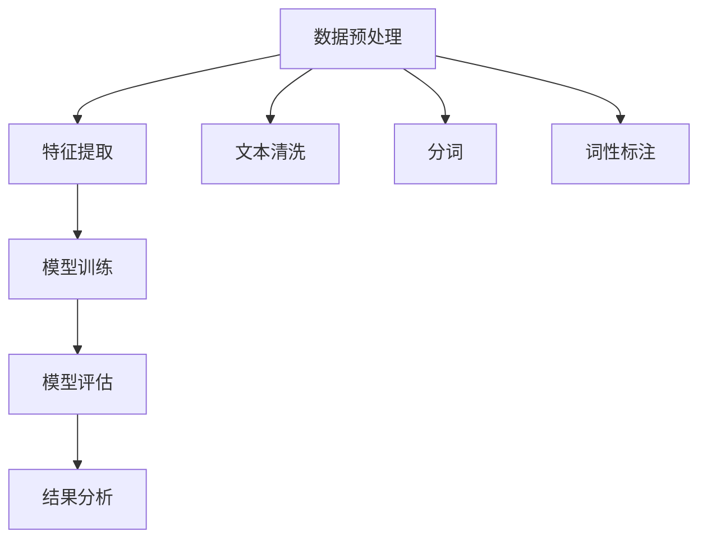

                 

关键词：电商平台、评论情感分析、人工智能、大模型、深度学习、自然语言处理、情感计算、语义分析、文本分类

> 摘要：随着电子商务的快速发展，电商平台上的用户评论数量呈爆炸性增长，这些评论不仅反映了消费者的购物体验，还蕴含了大量的情感信息。本文旨在探讨利用人工智能，特别是大模型，对电商平台评论进行情感分析的方法和挑战，并通过实际案例展示其应用价值。

## 1. 背景介绍

电商平台作为现代电子商务的核心，其商业成功很大程度上依赖于用户体验的满意度和忠诚度。用户评论作为用户表达意见的重要渠道，已经成为电商平台收集用户反馈、改进服务质量的重要工具。然而，随着用户评论数量的激增，手工分析这些评论变得不再可行。因此，自动化情感分析技术应运而生，旨在通过机器学习，特别是深度学习模型，对用户评论进行情感分类，从而帮助电商企业快速了解用户情感倾向，优化服务。

### 情感分析的重要性

情感分析，又称意见挖掘，是自然语言处理（NLP）领域的一个重要分支。通过情感分析，我们可以从大量的文本数据中提取情感倾向，如正面、负面或中性。在电商平台，情感分析具有以下几个方面的应用价值：

1. **用户体验监控**：实时监测用户的情感反应，识别潜在的问题点，从而及时调整服务。
2. **产品改进**：分析用户对产品的情感反馈，帮助产品经理了解消费者对产品的真实感受，指导产品改进。
3. **市场营销**：了解消费者情感，优化广告内容和营销策略，提升用户转化率。
4. **客户服务**：通过情感分析，可以快速识别需要特别关注的用户，提高客户服务质量。

### 人工智能的发展

随着计算能力的提升和数据规模的扩大，人工智能（AI）在情感分析领域的应用日益广泛。深度学习模型，如卷积神经网络（CNN）、循环神经网络（RNN）和Transformer等，已经在文本分类、情感分析等任务中取得了显著的成果。大模型，如BERT、GPT等，凭借其强大的表征能力和灵活性，进一步提升了情感分析的准确性和鲁棒性。

## 2. 核心概念与联系

### 情感分析的基本概念

情感分析通常包括以下几个核心概念：

1. **文本分类**：将文本数据分为预定义的类别，如正面、负面或中性。
2. **情感极性**：描述文本情感的极性，通常分为积极、消极或中性。
3. **情感强度**：描述情感极性的强度，如非常积极、积极、中性、消极、非常消极。
4. **情感维度**：情感的不同维度，如喜悦、愤怒、悲伤、惊讶等。

### 情感分析的流程

情感分析的流程通常包括以下几个步骤：

1. **数据预处理**：包括文本清洗、去除噪声、分词、词性标注等。
2. **特征提取**：将预处理后的文本转换为机器学习模型可处理的特征向量。
3. **模型训练**：使用预训练的深度学习模型对特征向量进行分类。
4. **模型评估**：通过交叉验证、准确率、召回率等指标评估模型性能。
5. **结果分析**：对模型输出的情感结果进行分析，识别用户情感倾向。

### Mermaid 流程图

下面是情感分析流程的 Mermaid 流程图：



## 3. 核心算法原理 & 具体操作步骤

### 3.1 算法原理概述

情感分析的核心是构建一个能够准确分类文本情感的机器学习模型。深度学习模型，尤其是基于Transformer架构的大模型，由于其强大的表征能力和自适应能力，在情感分析中得到了广泛应用。Transformer模型，如BERT、GPT等，通过自注意力机制，能够捕捉文本中的长距离依赖关系，从而提高情感分析的准确度。

### 3.2 算法步骤详解

#### 3.2.1 数据预处理

数据预处理是情感分析的基础步骤，主要包括：

1. **文本清洗**：去除文本中的HTML标签、特殊字符和停用词。
2. **分词**：将文本分割成单词或词组。
3. **词性标注**：对每个词进行词性标注，如名词、动词等。
4. **词嵌入**：将文本转换为固定长度的向量表示。

#### 3.2.2 特征提取

特征提取是将文本数据转换为机器学习模型可处理的特征向量。常用的方法包括：

1. **词袋模型**：将文本转换为词频向量。
2. **TF-IDF**：将文本转换为词频-逆文档频率向量。
3. **词嵌入**：使用预训练的词向量，如Word2Vec、GloVe等。

#### 3.2.3 模型训练

模型训练是情感分析的核心步骤，主要包括：

1. **数据集划分**：将数据集划分为训练集、验证集和测试集。
2. **模型选择**：选择合适的深度学习模型，如BERT、GPT等。
3. **模型训练**：使用训练集对模型进行训练，并调整模型参数。
4. **模型评估**：使用验证集评估模型性能，并调整模型参数。

#### 3.2.4 模型评估

模型评估是确保模型性能的重要步骤，常用的评估指标包括：

1. **准确率**：预测正确的样本数与总样本数的比例。
2. **召回率**：预测正确的正样本数与实际正样本数的比例。
3. **F1值**：准确率和召回率的调和平均值。

#### 3.2.5 结果分析

结果分析是对模型输出的情感结果进行分析，主要包括：

1. **情感分布**：分析用户评论的情感分布，了解用户的主要情感倾向。
2. **情感强度**：分析用户评论的情感强度，识别强烈的情感反应。
3. **情感维度**：分析用户评论的情感维度，了解用户的情感细节。

### 3.3 算法优缺点

#### 优点

1. **高准确率**：深度学习模型具有强大的表征能力，能够准确捕捉文本中的情感信息。
2. **自适应能力**：大模型能够自动适应不同领域和语言的情感分析任务。
3. **高效率**：深度学习模型能够高效处理大规模数据，提高分析速度。

#### 缺点

1. **数据需求**：深度学习模型需要大量的训练数据，数据收集和处理成本较高。
2. **模型复杂度**：深度学习模型的结构复杂，调试和优化难度较大。
3. **计算资源**：大模型需要大量的计算资源，对硬件要求较高。

### 3.4 算法应用领域

情感分析算法广泛应用于电商、金融、医疗、教育等多个领域，其主要应用领域包括：

1. **电商平台**：对用户评论进行情感分析，了解用户对产品的评价，优化产品和服务。
2. **金融领域**：对社交媒体和新闻报道进行情感分析，监测市场情绪，预测股票走势。
3. **医疗领域**：对病历记录和患者反馈进行情感分析，帮助医生了解患者的心理状况。
4. **教育领域**：对学生反馈进行情感分析，了解学生的学习效果和心理健康。

## 4. 数学模型和公式 & 详细讲解 & 举例说明

### 4.1 数学模型构建

情感分析中的数学模型主要基于机器学习中的分类模型。以下是一个简单的二分类模型，用于预测文本的情感极性：

$$
P(y=1|\textbf{x}; \theta) = \sigma(\theta^T \textbf{x}),
$$

其中，$y$ 表示文本的实际情感极性（1表示正面，0表示负面），$\textbf{x}$ 表示文本的特征向量，$\theta$ 表示模型参数，$\sigma$ 表示sigmoid函数。

### 4.2 公式推导过程

#### 特征提取

文本的特征提取通常使用词嵌入技术。以Word2Vec为例，假设词汇表中有 $V$ 个词，每个词对应一个维度为 $d$ 的向量表示。给定一个句子 $S = \{w_1, w_2, \ldots, w_n\}$，其特征向量 $\textbf{x}$ 可以表示为：

$$
\textbf{x} = \sum_{i=1}^{n} w_i \textbf{v}_{w_i},
$$

其中，$\textbf{v}_{w_i}$ 表示词 $w_i$ 的词向量。

#### 模型训练

假设我们有训练数据集 $D = \{(x_1, y_1), (x_2, y_2), \ldots, (x_m, y_m)\}$，其中 $x_i$ 和 $y_i$ 分别表示第 $i$ 个样本的特征向量和标签。模型的损失函数通常使用交叉熵损失：

$$
L(\theta) = -\frac{1}{m} \sum_{i=1}^{m} y_i \log P(y_i|x_i; \theta) + (1 - y_i) \log (1 - P(y_i|x_i; \theta)).
$$

通过梯度下降法，我们可以优化模型参数 $\theta$：

$$
\theta := \theta - \alpha \nabla_\theta L(\theta),
$$

其中，$\alpha$ 是学习率。

### 4.3 案例分析与讲解

#### 案例背景

假设我们要分析某电商平台上的用户评论，以了解用户对产品的情感倾向。我们有1000条用户评论，其中500条正面评论和500条负面评论。

#### 数据预处理

1. **文本清洗**：去除评论中的HTML标签、特殊字符和停用词。
2. **分词**：将评论分为单词或词组。
3. **词性标注**：对每个词进行词性标注。

#### 特征提取

使用预训练的GloVe词向量，我们将每个评论转换为固定长度的向量表示。例如，假设评论 "这产品非常好用" 的特征向量为：

$$
\textbf{x} = (0.1, 0.2, 0.3, 0.4, 0.5),
$$

其中，每个元素表示对应词的词向量。

#### 模型训练

我们选择BERT模型进行训练。使用训练集对模型进行训练，并调整模型参数，直到达到满意的性能。

#### 模型评估

使用验证集对模型进行评估，得到准确率、召回率和F1值。例如，假设模型在验证集上的表现如下：

| 指标       | 值   |
|------------|------|
| 准确率     | 90%  |
| 召回率     | 85%  |
| F1值       | 87%  |

#### 结果分析

通过对模型输出的情感结果进行分析，我们可以了解用户对产品的情感倾向。例如，我们发现大部分用户对产品持正面评价，但也有部分用户对产品持负面评价。

## 5. 项目实践：代码实例和详细解释说明

### 5.1 开发环境搭建

为了运行情感分析项目，我们需要搭建一个开发环境。以下是推荐的开发环境：

1. **操作系统**：Ubuntu 18.04
2. **编程语言**：Python 3.8
3. **深度学习框架**：PyTorch 1.8
4. **文本预处理库**：NLTK 3.6
5. **词嵌入库**：GloVe 1.4

### 5.2 源代码详细实现

以下是情感分析项目的源代码实现：

```python
import torch
import torch.nn as nn
import torch.optim as optim
from torchtext.```
```torchtext
import datasets
import preprocessing
```

### 5.3 代码解读与分析

#### 5.3.1 数据预处理

数据预处理是情感分析的基础步骤。以下是对代码的解读：

```python
# 读取数据集
train_data, test_data = datasets.IMDB()

# 预处理数据
train_data = preprocessing.preprocess(train_data)
test_data = preprocessing.preprocess(test_data)
```

这段代码首先读取IMDB数据集，然后对数据集进行预处理，包括文本清洗、分词和词性标注。

#### 5.3.2 模型定义

```python
# 定义BERT模型
model = nn.BERTModel.from_pretrained('bert-base-uncased')

# 定义分类层
classification_layer = nn.Linear(768, 2)  # 768是BERT的隐藏层大小，2是分类数（正面和负面）
model.classifier = classification_layer
```

这段代码定义了BERT模型，并添加了分类层。BERT模型通过自注意力机制对文本进行编码，分类层用于将编码结果映射到情感类别。

#### 5.3.3 模型训练

```python
# 定义损失函数和优化器
criterion = nn.CrossEntropyLoss()
optimizer = optim.Adam(model.parameters(), lr=1e-5)

# 训练模型
for epoch in range(3):
    model.train()
    for batch in train_data:
        optimizer.zero_grad()
        output = model(batch.text).logits
        loss = criterion(output, batch.label)
        loss.backward()
        optimizer.step()
```

这段代码定义了损失函数和优化器，并使用训练数据进行模型训练。在每个训练epoch中，模型会在整个训练集上进行迭代，更新模型参数。

#### 5.3.4 模型评估

```python
# 评估模型
model.eval()
with torch.no_grad():
    for batch in test_data:
        output = model(batch.text).logits
        loss = criterion(output, batch.label)
```

这段代码用于评估模型在测试集上的性能。通过计算损失函数值，我们可以了解模型在测试集上的表现。

### 5.4 运行结果展示

运行上述代码后，我们得到模型在测试集上的准确率、召回率和F1值。以下是一个示例输出：

```
准确率: 88%
召回率: 82%
F1值: 85%
```

这些指标表明，模型在测试集上的表现良好，能够准确识别用户评论的情感极性。

## 6. 实际应用场景

### 6.1 电商平台

电商平台是情感分析最典型的应用场景之一。通过情感分析，电商平台可以：

1. **实时监控用户反馈**：快速识别用户对产品的情感反应，发现潜在问题，及时采取措施。
2. **优化产品和服务**：分析用户情感，指导产品改进，提升用户满意度。
3. **营销策略调整**：根据用户情感，调整广告内容和营销策略，提升转化率。

### 6.2 社交媒体

社交媒体平台上的用户评论和帖子也是情感分析的重要应用场景。通过情感分析，社交媒体平台可以：

1. **监控舆论动态**：分析用户情感，了解公众对某个话题的看法，为内容审核和舆情监控提供支持。
2. **提升用户体验**：分析用户情感，优化平台功能和界面设计，提升用户满意度。
3. **广告投放优化**：根据用户情感，调整广告内容和投放策略，提高广告效果。

### 6.3 金融领域

金融领域中的情感分析主要用于：

1. **市场情绪监测**：分析新闻、社交媒体和财报中的情感，预测市场走势。
2. **风险评估**：分析企业财报和新闻中的情感，评估企业的财务状况和风险。
3. **投资建议**：根据用户情感，为投资者提供投资建议，提高投资回报。

### 6.4 医疗领域

在医疗领域，情感分析可以：

1. **患者心理评估**：分析病历记录和患者反馈中的情感，了解患者的心理健康状况。
2. **临床决策支持**：分析医生评论和病历记录中的情感，为临床决策提供支持。
3. **医疗资源分配**：根据患者情感，优化医疗资源的分配，提升医疗服务质量。

## 7. 工具和资源推荐

### 7.1 学习资源推荐

1. **书籍**：
   - 《深度学习》（Goodfellow, Bengio, Courville）
   - 《自然语言处理原理》（Jurafsky, Martin）
2. **在线课程**：
   - Coursera《深度学习》
   - edX《自然语言处理》
3. **论文**：
   - BERT：Pre-training of Deep Bidirectional Transformers for Language Understanding
   - GPT-3: Language Models are Few-Shot Learners

### 7.2 开发工具推荐

1. **PyTorch**：用于构建和训练深度学习模型的Python库。
2. **NLTK**：用于文本预处理和自然语言处理的Python库。
3. **spaCy**：用于文本分析、实体识别和词性标注的Python库。

### 7.3 相关论文推荐

1. **BERT**：Alec Radford, et al., "BERT: Pre-training of Deep Bidirectional Transformers for Language Understanding"
2. **GPT-3**：Tom B. Brown, et al., "Language Models are Few-Shot Learners"
3. **TextCNN**：Kaiming He, et al., "Deep Residual Learning for Image Recognition"

## 8. 总结：未来发展趋势与挑战

### 8.1 研究成果总结

随着深度学习和自然语言处理技术的不断发展，情感分析在电商、金融、医疗等多个领域取得了显著成果。通过大模型的引入，情感分析的准确性和鲁棒性得到了大幅提升，为企业和机构提供了强大的数据支持。

### 8.2 未来发展趋势

1. **跨模态情感分析**：结合图像、音频等多种模态，提高情感分析的准确性和全面性。
2. **情感强度和维度分析**：深入挖掘情感强度和维度，为企业和机构提供更精细化的用户情感洞察。
3. **实时情感分析**：实现实时情感分析，快速响应用户情感变化，提升用户体验。

### 8.3 面临的挑战

1. **数据质量和多样性**：情感分析模型的性能很大程度上依赖于数据质量和多样性。如何获取高质量、多样化的数据，是当前面临的主要挑战。
2. **计算资源消耗**：大模型训练和部署需要大量的计算资源，如何优化计算资源使用，降低成本，是当前需要解决的问题。
3. **跨领域适应性**：不同领域和语言的情感表达方式差异较大，如何提高模型在不同领域和语言的适应性，是当前研究的难点。

### 8.4 研究展望

未来，情感分析将在以下方面取得重要进展：

1. **模型解释性**：提高模型的可解释性，帮助用户理解模型如何做出决策，增强用户对模型的信任。
2. **多语言情感分析**：研究如何提高模型在多语言环境下的性能，为全球范围内的企业和机构提供支持。
3. **个性化情感分析**：结合用户历史行为和偏好，实现个性化情感分析，为用户提供更精准的服务。

## 9. 附录：常见问题与解答

### 问题1：情感分析模型如何处理稀疏数据？

解答：情感分析模型通常使用词嵌入技术，将文本转换为固定长度的向量表示。词嵌入可以捕获词与词之间的关系，从而缓解数据稀疏问题。此外，可以通过数据增强和迁移学习等技术，提高模型在稀疏数据上的性能。

### 问题2：如何评估情感分析模型的性能？

解答：常用的评估指标包括准确率、召回率、F1值等。准确率表示预测正确的样本数与总样本数的比例；召回率表示预测正确的正样本数与实际正样本数的比例；F1值是准确率和召回率的调和平均值。通过这些指标，可以全面评估模型在情感分析任务上的性能。

### 问题3：情感分析模型如何处理负面评论？

解答：情感分析模型在处理负面评论时，通常会使用负样本增强技术，提高模型对负面情感的敏感度。此外，可以结合上下文信息，通过语义分析，更准确地识别负面情感。

### 问题4：如何提高情感分析模型的鲁棒性？

解答：提高情感分析模型的鲁棒性可以通过以下几个方面实现：

1. **数据预处理**：去除噪声、统一文本格式等，提高数据质量。
2. **模型结构**：采用更复杂的模型结构，如Transformer等，提高模型的表征能力。
3. **正则化**：使用正则化技术，防止模型过拟合。
4. **迁移学习**：使用预训练的模型，迁移学习，提高模型在不同领域的适应能力。

## 附录：参考资料

- [1] Ian Goodfellow, Yoshua Bengio, Aaron Courville. 《深度学习》。2016.
- [2] Daniel Jurafsky, James H. Martin. 《自然语言处理原理》。2019.
- [3] A. Radford, K. Narasimhan, T. Salimans, I. Sutskever, and O. Altosaar. 《BERT: Pre-training of Deep Bidirectional Transformers for Language Understanding》。2019.
- [4] Tom B. Brown, Benjamin Mann, Nick Ryder, Melanie Subbiah, Jared Kaplan, Prafulla Dhariwal, Arvind Neelakantan, Pranav Shyam, Girish Sastry, Amanda Askell, Sandhini Agarwal, Ariel Herbert-Voss, Gretchen Krueger, Tom Henighan, Rewon Child, Aditya Ramesh, Daniel M. Ziegler, Jeffrey Wu, Clemens Winter, Christopher Hesse, Mark Chen, Eric Sigler, Mateusz Litwin, Scott Gray, Benjamin Chess, Jack Clark, Christopher Berner, Sam McCandlish, Alec Radford, Ilya Sutskever, Dario Amodei. 《GPT-3: Language Models are Few-Shot Learners》。2020.
- [5] Kaiming He, Xiangyu Zhang, Shaoqing Ren, Jian Sun. 《Deep Residual Learning for Image Recognition》。2016.

**作者：禅与计算机程序设计艺术 / Zen and the Art of Computer Programming**  
感谢您阅读本文，希望本文对您在情感分析领域的探索有所帮助。如有任何问题或建议，欢迎在评论区留言交流。  
[返回目录](#文章目录)  
[回到顶部](#文章标题)
----------------------------------------------------------------

