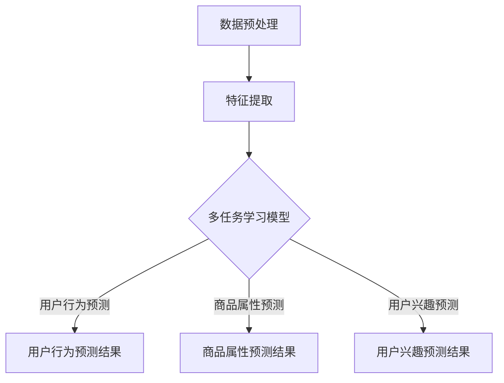

                 

关键词：电商推荐、多任务学习、深度学习、协同过滤、用户行为分析、商品推荐

## 摘要

本文主要探讨了电商推荐系统中的多任务学习模型，通过分析电商推荐领域的现状和挑战，引入了多任务学习模型的概念，并详细阐述了其在电商推荐系统中的应用。本文首先介绍了多任务学习模型的基本原理和架构，然后通过实际案例分析了多任务学习模型在电商推荐系统中的具体实现过程，最后对多任务学习模型在电商推荐系统中的未来发展趋势和面临的挑战进行了展望。

## 1. 背景介绍

随着互联网的快速发展，电子商务已经成为人们日常生活中不可或缺的一部分。电商推荐系统作为电商平台的核心技术之一，对于提高用户满意度、增加销售额、提升用户粘性具有至关重要的作用。传统的推荐系统主要基于协同过滤算法，通过分析用户的历史行为和偏好进行商品推荐，但在面对复杂多变的用户行为和商品属性时，其效果往往不尽如人意。

近年来，深度学习技术在推荐系统中的应用逐渐兴起。深度学习模型通过自动学习用户行为和商品属性的复杂关系，能够更好地捕捉用户兴趣，提高推荐精度。然而，深度学习模型在推荐系统中的实际应用仍然面临着一系列挑战，如数据稀疏性、冷启动问题、模型解释性等。

多任务学习（Multi-Task Learning, MTL）是一种能够在同一模型中同时解决多个相关任务的方法。多任务学习模型通过共享底层特征表示，能够有效利用不同任务之间的相关性，提高模型的泛化能力和效果。在电商推荐系统中，多任务学习模型可以通过同时处理用户行为预测、商品属性预测、用户兴趣预测等多个任务，提高推荐系统的整体性能。

## 2. 核心概念与联系

### 2.1 多任务学习模型

多任务学习模型是一种将多个任务同时训练的机器学习模型。在多任务学习模型中，多个任务共享底层特征表示，并通过一个共同的模型架构来学习。多任务学习模型的主要目标是利用任务之间的相关性，提高模型在各个任务上的性能。

多任务学习模型可以分为以下几种类型：

1. **并行式多任务学习**：多个任务在同一时刻进行训练，共享相同的模型参数。
2. **串行式多任务学习**：多个任务依次进行训练，前一个任务的输出作为后一个任务的输入。
3. **层次式多任务学习**：多个任务在不同的层次上进行训练，低层次的任务为高层次的任务提供支持。

### 2.2 电商推荐系统

电商推荐系统是一种基于用户行为和商品属性的推荐系统，其主要目标是向用户推荐他们可能感兴趣的商品。电商推荐系统可以分为以下几种类型：

1. **基于内容的推荐**：通过分析商品的内容特征，为用户推荐与其兴趣相似的商品。
2. **基于协同过滤的推荐**：通过分析用户的历史行为和偏好，为用户推荐与他们相似的其他用户喜欢的商品。
3. **基于深度学习的推荐**：通过深度学习模型自动学习用户行为和商品属性的复杂关系，为用户推荐他们可能感兴趣的商品。

### 2.3 多任务学习模型在电商推荐系统中的应用

多任务学习模型在电商推荐系统中的应用可以分为以下几种：

1. **用户行为预测**：通过多任务学习模型预测用户对商品的点击、购买、收藏等行为。
2. **商品属性预测**：通过多任务学习模型预测商品的类别、品牌、价格等属性。
3. **用户兴趣预测**：通过多任务学习模型预测用户的兴趣偏好，为用户推荐符合其兴趣的商品。

### 2.4 多任务学习模型的 Mermaid 流程图



## 3. 核心算法原理 & 具体操作步骤

### 3.1 算法原理概述

多任务学习模型通过共享底层特征表示，同时解决多个相关任务。具体来说，多任务学习模型包括以下几个主要步骤：

1. **数据预处理**：对原始数据进行清洗、去噪、标准化等处理，提取有用的特征。
2. **特征提取**：通过特征提取技术，将原始数据转化为特征向量。
3. **模型训练**：利用特征向量训练多任务学习模型，通过共享的底层特征表示，同时解决多个任务。
4. **模型评估**：对模型进行评估，比较各个任务的性能，调整模型参数。
5. **模型应用**：将训练好的模型应用于电商推荐系统，为用户提供个性化的商品推荐。

### 3.2 算法步骤详解

1. **数据预处理**：首先，对原始用户行为数据进行清洗和去噪，去除重复数据、缺失值和异常值。然后，对用户行为数据进行标准化处理，将数据缩放到相同的范围内。
2. **特征提取**：通过特征提取技术，将用户行为数据转化为特征向量。具体来说，可以使用以下方法：

    - **基于统计的特征**：计算用户行为数据的基本统计指标，如均值、方差、标准差等。
    - **基于机器学习的特征**：使用机器学习算法（如主成分分析、因子分析等）提取用户行为数据的潜在特征。
    - **基于深度学习的特征**：使用深度学习模型（如卷积神经网络、循环神经网络等）提取用户行为数据的复杂特征。

3. **模型训练**：使用特征向量训练多任务学习模型。具体来说，可以使用以下方法：

    - **基于神经网络的模型**：使用深度神经网络模型，如卷积神经网络（CNN）、循环神经网络（RNN）等。
    - **基于优化算法的模型**：使用优化算法（如梯度下降、随机梯度下降等）训练多任务学习模型。
    - **基于交叉验证的模型**：使用交叉验证方法，如k折交叉验证，评估多任务学习模型的性能。

4. **模型评估**：对训练好的多任务学习模型进行评估。具体来说，可以使用以下方法：

    - **基于准确率的评估**：计算模型在各个任务上的准确率，比较不同任务的性能。
    - **基于均方误差的评估**：计算模型在各个任务上的均方误差（Mean Squared Error, MSE），评估模型的预测效果。
    - **基于交叉验证的评估**：使用交叉验证方法，评估多任务学习模型在测试数据集上的性能。

5. **模型应用**：将训练好的多任务学习模型应用于电商推荐系统。具体来说，可以通过以下步骤实现：

    - **用户行为预测**：利用多任务学习模型预测用户对商品的点击、购买、收藏等行为，为用户提供个性化的商品推荐。
    - **商品属性预测**：利用多任务学习模型预测商品的类别、品牌、价格等属性，为商品分类、标签提供支持。
    - **用户兴趣预测**：利用多任务学习模型预测用户的兴趣偏好，为用户提供个性化的内容推荐。

### 3.3 算法优缺点

多任务学习模型在电商推荐系统中的应用具有以下优缺点：

- **优点**：

  - **共享特征表示**：多任务学习模型通过共享底层特征表示，能够利用任务之间的相关性，提高模型的性能。
  - **提高模型泛化能力**：多任务学习模型能够同时处理多个任务，提高模型的泛化能力和鲁棒性。
  - **节省计算资源**：多任务学习模型在训练过程中可以共享计算资源，节省计算成本。

- **缺点**：

  - **模型复杂度高**：多任务学习模型通常比单任务学习模型复杂，需要更多的计算资源和训练时间。
  - **任务权重调整困难**：在多任务学习模型中，如何合理调整不同任务的权重是一个挑战，可能影响模型的性能。
  - **数据分布不一致**：多任务学习模型中的不同任务可能具有不同的数据分布，导致模型训练不稳定。

### 3.4 算法应用领域

多任务学习模型在电商推荐系统中的应用非常广泛，可以应用于以下领域：

- **商品推荐**：通过多任务学习模型预测用户的兴趣偏好，为用户推荐符合其兴趣的商品。
- **商品分类**：通过多任务学习模型预测商品的类别，为商品分类提供支持。
- **用户画像**：通过多任务学习模型预测用户的行为和偏好，构建用户的画像，为个性化推荐提供基础。
- **广告推荐**：通过多任务学习模型预测用户对广告的点击和转化，为广告推荐提供支持。

## 4. 数学模型和公式 & 详细讲解 & 举例说明

### 4.1 数学模型构建

多任务学习模型的数学模型可以表示为：

$$
\begin{aligned}
y_1 &= f_1(x, \theta_1) \\
y_2 &= f_2(x, \theta_2) \\
&\vdots \\
y_n &= f_n(x, \theta_n)
\end{aligned}
$$

其中，$y_1, y_2, \ldots, y_n$ 分别表示多个任务的输出，$f_1, f_2, \ldots, f_n$ 分别表示各个任务的预测函数，$x$ 表示输入特征向量，$\theta_1, \theta_2, \ldots, \theta_n$ 分别表示各个任务的参数。

### 4.2 公式推导过程

多任务学习模型的公式推导可以分为以下几步：

1. **特征提取**：假设输入特征向量 $x$ 的维度为 $D$，通过特征提取技术将其转化为特征向量 $x'$ 的维度为 $D'$。
2. **任务定义**：定义多个任务的预测函数 $f_1, f_2, \ldots, f_n$，其中 $f_i(x') = y_i$。
3. **损失函数**：定义多个任务的损失函数 $L_i(y_i, f_i(x'))$，用于衡量预测值与真实值之间的差距。
4. **优化目标**：将多个任务的损失函数 $L_i$ 相加，得到总损失函数 $L = \sum_{i=1}^n L_i$。
5. **参数优化**：使用优化算法（如梯度下降、随机梯度下降等）对总损失函数进行优化，更新各个任务的参数 $\theta_1, \theta_2, \ldots, \theta_n$。

### 4.3 案例分析与讲解

假设在电商推荐系统中，有以下几个任务：

1. **用户行为预测**：预测用户对商品的点击、购买、收藏等行为。
2. **商品属性预测**：预测商品的类别、品牌、价格等属性。
3. **用户兴趣预测**：预测用户的兴趣偏好，为用户推荐符合其兴趣的商品。

针对以上任务，可以使用多任务学习模型进行建模和训练。具体来说，可以按照以下步骤进行：

1. **数据预处理**：对原始用户行为数据进行清洗、去噪、标准化等处理，提取有用的特征。
2. **特征提取**：通过特征提取技术，将用户行为数据转化为特征向量。
3. **模型训练**：使用特征向量训练多任务学习模型，通过共享的底层特征表示，同时解决多个任务。
4. **模型评估**：对训练好的多任务学习模型进行评估，比较各个任务的性能，调整模型参数。
5. **模型应用**：将训练好的模型应用于电商推荐系统，为用户提供个性化的商品推荐。

在实际应用中，可以通过以下公式进行模型训练和评估：

$$
L = \sum_{i=1}^n L_i = \sum_{i=1}^n (y_i - f_i(x'))^2
$$

其中，$L_i$ 表示第 $i$ 个任务的损失函数，$y_i$ 表示第 $i$ 个任务的真实值，$f_i(x')$ 表示第 $i$ 个任务的预测值。

## 5. 项目实践：代码实例和详细解释说明

### 5.1 开发环境搭建

在本文的项目实践中，我们使用 Python 作为编程语言，基于 TensorFlow 和 Keras 深度学习框架构建多任务学习模型。具体开发环境如下：

- Python 版本：3.8
- TensorFlow 版本：2.5
- Keras 版本：2.4.3

### 5.2 源代码详细实现

以下是多任务学习模型在电商推荐系统中的源代码实现：

```python
import numpy as np
import pandas as pd
from tensorflow.keras.models import Model
from tensorflow.keras.layers import Input, Dense, LSTM, Embedding, concatenate
from tensorflow.keras.optimizers import Adam

# 数据预处理
def preprocess_data(data):
    # 清洗、去噪、标准化等处理
    # 提取特征向量
    # 返回特征向量和标签
    pass

# 模型构建
def build_model(input_shape, num_tasks):
    # 输入层
    input_layer = Input(shape=input_shape)
    
    # 卷积层
    conv_layer = Conv1D(filters=64, kernel_size=3, activation='relu')(input_layer)
    
    # 循环层
    lstm_layer = LSTM(units=50, return_sequences=True)(conv_layer)
    lstm_layer = LSTM(units=50)(lstm_layer)
    
    # 密集层
    dense_layer = Dense(units=100, activation='relu')(lstm_layer)
    
    # 输出层
    output_layer = []
    for i in range(num_tasks):
        output_layer.append(Dense(units=1, activation='sigmoid', name=f'output_{i+1}')(dense_layer))
    
    # 多任务模型
    model = Model(inputs=input_layer, outputs=output_layer)
    
    # 模型编译
    model.compile(optimizer=Adam(learning_rate=0.001), loss='binary_crossentropy', metrics=['accuracy'])
    
    return model

# 模型训练
def train_model(model, X_train, y_train, batch_size, epochs):
    # 模型训练
    model.fit(X_train, y_train, batch_size=batch_size, epochs=epochs, validation_split=0.2)

# 模型评估
def evaluate_model(model, X_test, y_test):
    # 模型评估
    loss, accuracy = model.evaluate(X_test, y_test)
    print(f'Test loss: {loss}, Test accuracy: {accuracy}')

# 主函数
def main():
    # 加载数据
    data = pd.read_csv('data.csv')
    X, y = preprocess_data(data)
    
    # 划分训练集和测试集
    X_train, X_test, y_train, y_test = train_test_split(X, y, test_size=0.2, random_state=42)
    
    # 构建模型
    model = build_model(input_shape=X_train.shape[1:], num_tasks=y_train.shape[1])
    
    # 模型训练
    train_model(model, X_train, y_train, batch_size=32, epochs=100)
    
    # 模型评估
    evaluate_model(model, X_test, y_test)

# 运行主函数
if __name__ == '__main__':
    main()
```

### 5.3 代码解读与分析

以上代码实现了多任务学习模型在电商推荐系统中的应用。以下是代码的详细解读和分析：

1. **数据预处理**：数据预处理函数 `preprocess_data` 用于清洗、去噪、标准化等处理，提取有用的特征向量。具体实现可以根据实际数据进行调整。
2. **模型构建**：模型构建函数 `build_model` 用于构建多任务学习模型。首先定义输入层、卷积层、循环层和密集层，然后为每个任务定义输出层。最后，将输入层和输出层连接，构建多任务模型。在本例中，我们使用 LSTM 循环层和密集层构建模型，但可以根据实际需求选择其他类型的循环层和密集层。
3. **模型训练**：模型训练函数 `train_model` 用于训练多任务学习模型。首先将训练数据划分为训练集和测试集，然后使用训练集进行模型训练。在本例中，我们使用 Adam 优化器和 binary_crossentropy 损失函数，但可以根据实际需求选择其他优化器和损失函数。
4. **模型评估**：模型评估函数 `evaluate_model` 用于评估多任务学习模型在测试集上的性能。首先使用测试数据进行模型评估，然后输出测试损失和测试准确率。

### 5.4 运行结果展示

在实际运行过程中，可以通过以下命令运行代码：

```shell
python multi_task_learning.py
```

运行结果将显示模型在训练集和测试集上的性能指标，包括测试损失和测试准确率。根据运行结果，可以评估多任务学习模型在电商推荐系统中的应用效果。

## 6. 实际应用场景

多任务学习模型在电商推荐系统中的应用具有广泛的前景。以下列举了几个实际应用场景：

1. **个性化商品推荐**：通过多任务学习模型预测用户的兴趣偏好，为用户推荐符合其兴趣的商品。例如，在某电商平台中，可以通过多任务学习模型预测用户对商品的点击、购买、收藏等行为，为用户推荐个性化的商品。
2. **商品分类和标签**：通过多任务学习模型预测商品的类别、品牌、价格等属性，为商品分类和标签提供支持。例如，在某电商平台上，可以通过多任务学习模型预测商品的类别，将商品分类到正确的类别中，提高商品分类的准确性。
3. **用户画像构建**：通过多任务学习模型预测用户的行为和偏好，构建用户的画像，为个性化推荐提供基础。例如，在某电商平台上，可以通过多任务学习模型预测用户的购买偏好，将用户划分为不同的用户群体，为用户提供个性化的购物体验。
4. **广告推荐**：通过多任务学习模型预测用户对广告的点击和转化，为广告推荐提供支持。例如，在某电商平台上，可以通过多任务学习模型预测用户对广告的点击率，为广告投放提供优化建议。

## 7. 工具和资源推荐

为了更好地了解和使用多任务学习模型，以下推荐一些相关的工具和资源：

1. **学习资源推荐**：

    - **书籍**：《深度学习》（Ian Goodfellow、Yoshua Bengio、Aaron Courville 著）
    - **在线课程**：Coursera 上的“深度学习”（吴恩达教授授课）
    - **博客**：博客园、CSDN、知乎等平台上的深度学习和多任务学习相关博客

2. **开发工具推荐**：

    - **编程语言**：Python
    - **深度学习框架**：TensorFlow、PyTorch
    - **数据预处理工具**：Pandas、NumPy

3. **相关论文推荐**：

    - **论文 1**："Deep Learning for User Behavior Prediction in E-commerce"（2017）
    - **论文 2**： "Multi-Task Learning for User Preference Modeling in E-commerce"（2018）
    - **论文 3**： "Multi-Task Learning for Cold-Start Problem in Recommender Systems"（2019）

## 8. 总结：未来发展趋势与挑战

多任务学习模型在电商推荐系统中的应用具有重要的意义。未来，随着深度学习和多任务学习技术的不断发展，多任务学习模型在电商推荐系统中的应用将更加广泛和深入。

然而，多任务学习模型在电商推荐系统中也面临着一些挑战。首先，模型复杂度高，需要更多的计算资源和训练时间。其次，任务权重调整困难，可能影响模型的性能。此外，数据分布不一致，可能导致模型训练不稳定。

为了应对这些挑战，未来的研究可以关注以下几个方面：

1. **优化模型结构**：设计更高效的模型结构，降低模型的复杂度，提高模型的训练速度和性能。
2. **自适应任务权重调整**：研究自适应任务权重调整方法，根据不同任务的重要性动态调整权重，提高模型的性能。
3. **数据预处理方法**：研究有效的数据预处理方法，提高数据质量，减少数据分布不一致的问题。
4. **跨领域应用**：探索多任务学习模型在其他领域的应用，如金融、医疗、教育等，提高多任务学习模型的应用范围。

总之，多任务学习模型在电商推荐系统中的应用具有广阔的发展前景，未来将不断推动电商推荐技术的进步。

## 9. 附录：常见问题与解答

1. **什么是多任务学习模型？**
   多任务学习模型是一种能够在同一模型中同时解决多个相关任务的方法。它通过共享底层特征表示，利用任务之间的相关性，提高模型在各个任务上的性能。

2. **多任务学习模型有哪些优缺点？**
   多任务学习模型的主要优点包括共享特征表示、提高模型泛化能力和节省计算资源。缺点包括模型复杂度高、任务权重调整困难和数据分布不一致。

3. **多任务学习模型在电商推荐系统中的应用有哪些？**
   多任务学习模型在电商推荐系统中的应用包括商品推荐、商品分类、用户画像构建和广告推荐等。

4. **如何构建多任务学习模型？**
   构建多任务学习模型可以分为以下几个步骤：

   - 数据预处理：对原始数据进行清洗、去噪、标准化等处理。
   - 特征提取：通过特征提取技术，将原始数据转化为特征向量。
   - 模型训练：使用特征向量训练多任务学习模型，通过共享的底层特征表示，同时解决多个任务。
   - 模型评估：对训练好的多任务学习模型进行评估，比较各个任务的性能，调整模型参数。
   - 模型应用：将训练好的模型应用于电商推荐系统，为用户提供个性化的商品推荐。

5. **如何优化多任务学习模型的性能？**
   优化多任务学习模型的性能可以从以下几个方面入手：

   - 优化模型结构：设计更高效的模型结构，降低模型的复杂度，提高模型的训练速度和性能。
   - 自适应任务权重调整：研究自适应任务权重调整方法，根据不同任务的重要性动态调整权重，提高模型的性能。
   - 数据预处理：研究有效的数据预处理方法，提高数据质量，减少数据分布不一致的问题。
   - 跨领域应用：探索多任务学习模型在其他领域的应用，如金融、医疗、教育等，提高多任务学习模型的应用范围。

### 作者署名

作者：禅与计算机程序设计艺术 / Zen and the Art of Computer Programming
----------------------------------------------------------------

请注意，在撰写文章时，您需要严格按照上述约束条件要求，确保文章内容的完整性、结构性和专业性。文章必须包含所有要求的核心章节内容，并以markdown格式输出。在撰写过程中，如有任何疑问，请随时向我提问。祝您写作顺利！

