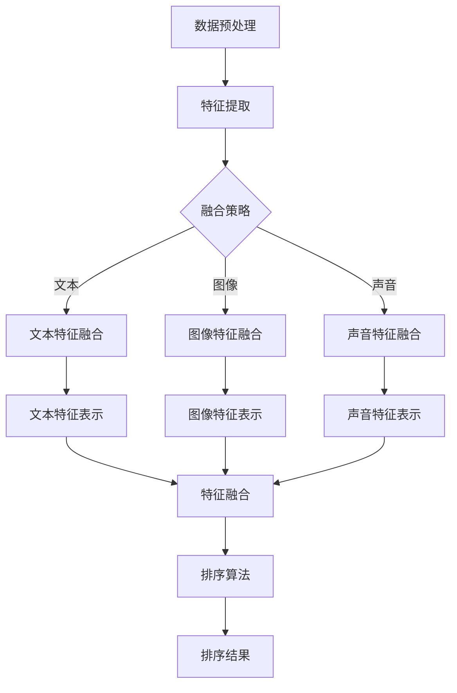

                 

随着电商平台的日益繁荣，用户对搜索服务的质量要求也不断提高。传统的单一模态搜索方法已经无法满足复杂多样的用户需求。因此，多模态融合排序模型成为电商搜索领域的研究热点。本文旨在探讨如何优化电商搜索中的多模态融合排序模型，以提高搜索结果的准确性和用户体验。

## 关键词

电商搜索、多模态融合、排序模型、优化、用户体验

## 摘要

本文首先介绍了电商搜索的背景和现状，分析了多模态融合排序模型的核心概念和原理。随后，本文详细阐述了多模态融合排序模型的具体操作步骤、优缺点以及应用领域。接着，本文从数学模型和公式、项目实践、实际应用场景等多个方面进行了深入剖析。最后，本文对未来发展趋势、工具和资源推荐以及研究展望进行了总结。

## 1. 背景介绍

### 1.1 电商搜索的发展历程

电商搜索是电商平台的核心功能之一，它直接影响用户的购物体验。传统的电商搜索主要依赖于关键词搜索，即用户通过输入关键词来获取相关商品。然而，这种方式存在一定的局限性，无法充分理解用户的真实意图。随着人工智能技术的发展，多模态融合搜索逐渐成为电商搜索领域的研究方向。

### 1.2 多模态融合排序模型的兴起

多模态融合排序模型通过整合多种数据类型（如文本、图像、声音等）来提升搜索结果的准确性。这种模型能够更好地理解用户的意图，从而提供更加个性化的搜索结果。在电商搜索中，多模态融合排序模型的应用有助于提高用户的购物体验，降低用户流失率，提高平台收益。

## 2. 核心概念与联系

### 2.1 多模态融合排序模型的基本概念

多模态融合排序模型是指将多种数据类型（文本、图像、声音等）进行整合，以实现对搜索结果进行排序的模型。这些数据类型可以分别表示用户的需求、商品的属性以及用户与商品之间的交互信息。通过融合这些信息，模型能够更好地理解用户的意图，从而提供更准确的搜索结果。

### 2.2 多模态融合排序模型的架构

多模态融合排序模型通常包括以下模块：

1. 数据预处理模块：对各种模态的数据进行预处理，包括数据清洗、特征提取等。
2. 特征融合模块：将不同模态的特征进行融合，以形成一个统一的高层次特征表示。
3. 排序模块：利用融合后的特征对搜索结果进行排序。
4. 评估模块：对排序结果进行评估，以评估模型的性能。

### 2.3 Mermaid 流程图

下面是一个简化的多模态融合排序模型的 Mermaid 流程图：



## 3. 核心算法原理 & 具体操作步骤

### 3.1 算法原理概述

多模态融合排序模型的核心思想是通过整合多种数据类型的特征，实现对搜索结果的排序。具体来说，该模型分为以下几个步骤：

1. 数据预处理：对各种模态的数据进行清洗、归一化等操作，以确保数据的一致性和质量。
2. 特征提取：从原始数据中提取与搜索意图相关的特征，如文本中的关键词、图像中的视觉特征、声音中的音频特征等。
3. 特征融合：将不同模态的特征进行融合，以形成一个统一的高层次特征表示。
4. 排序算法：利用融合后的特征对搜索结果进行排序，以提供个性化的搜索结果。

### 3.2 算法步骤详解

#### 3.2.1 数据预处理

数据预处理是确保模型性能的重要环节。具体包括以下步骤：

1. 数据清洗：去除无效数据、处理缺失值、纠正错误数据等。
2. 数据归一化：将不同模态的数据进行归一化处理，以便后续特征提取和融合。
3. 特征增强：通过对数据进行扩展、变换等操作，提高特征的表示能力。

#### 3.2.2 特征提取

特征提取是提取与搜索意图相关的特征，以便后续融合和排序。具体包括以下步骤：

1. 文本特征提取：通过词袋模型、词嵌入等技术提取文本特征。
2. 图像特征提取：通过卷积神经网络、特征提取器等技术提取图像特征。
3. 声音特征提取：通过音频处理技术、特征提取器等技术提取声音特征。

#### 3.2.3 特征融合

特征融合是将不同模态的特征进行整合，以形成一个统一的高层次特征表示。具体包括以下步骤：

1. 特征对齐：将不同模态的特征进行对齐，确保它们在时间、空间等维度上的一致性。
2. 特征融合策略：采用加和、拼接、注意力机制等方法将不同模态的特征进行融合。
3. 特征表示学习：通过深度学习技术学习特征融合后的高层次特征表示。

#### 3.2.4 排序算法

排序算法是利用融合后的特征对搜索结果进行排序。具体包括以下步骤：

1. 排序模型设计：设计适合多模态特征的排序模型，如序列模型、注意力模型等。
2. 模型训练：利用训练数据对排序模型进行训练，优化模型参数。
3. 排序预测：利用训练好的模型对搜索结果进行排序，以提供个性化的搜索结果。

### 3.3 算法优缺点

#### 优点

1. 提高搜索准确性：通过整合多种数据类型的特征，多模态融合排序模型能够更好地理解用户的意图，提高搜索结果的准确性。
2. 个性化搜索：多模态融合排序模型能够根据用户的个性化需求提供更加个性化的搜索结果，提高用户体验。
3. 模型可扩展性：多模态融合排序模型具有较好的可扩展性，可以适应不同类型的电商平台和用户需求。

#### 缺点

1. 数据质量要求高：多模态融合排序模型对数据质量要求较高，需要对各种模态的数据进行预处理和特征提取，否则会影响模型的性能。
2. 计算成本高：多模态融合排序模型涉及多种数据类型的处理和融合，计算成本较高，需要较长时间的训练和推理。
3. 模型复杂性：多模态融合排序模型通常具有较高的模型复杂性，需要设计合适的架构和算法，否则难以实现高效和准确的搜索。

### 3.4 算法应用领域

多模态融合排序模型在电商搜索领域具有广泛的应用前景，主要包括以下几个方面：

1. 商品搜索：通过多模态融合排序模型，可以为用户提供更加准确的商品搜索结果，提高用户的购物体验。
2. 广告推荐：在电商广告推荐中，多模态融合排序模型可以结合用户的浏览历史、搜索记录等多种信息，提供更加个性化的广告推荐。
3. 用户行为分析：通过分析用户的多模态行为数据，多模态融合排序模型可以帮助电商平台了解用户的需求和偏好，为业务决策提供支持。

## 4. 数学模型和公式 & 详细讲解 & 举例说明

### 4.1 数学模型构建

多模态融合排序模型的数学模型主要包括以下部分：

1. 数据表示：假设输入数据为 \(X = \{x_1, x_2, ..., x_n\}\)，其中每个数据 \(x_i\) 表示为 \(x_i = \{x_{i1}, x_{i2}, ..., x_{im}\}\)，\(m\) 表示模态的数量。
2. 特征提取：对每个模态的特征进行提取，得到特征矩阵 \(F = \{f_{ij}\}\)，其中 \(f_{ij}\) 表示第 \(i\) 个样本的第 \(j\) 个特征。
3. 特征融合：将不同模态的特征进行融合，得到融合后的特征矩阵 \(G = \{g_{ij}\}\)。
4. 排序模型：利用融合后的特征进行排序，得到排序结果 \(R = \{r_1, r_2, ..., r_n\}\)，其中 \(r_i\) 表示第 \(i\) 个样本的排序分数。

### 4.2 公式推导过程

#### 特征提取

假设第 \(j\) 个模态的特征提取函数为 \(f_j(\cdot)\)，则第 \(i\) 个样本的第 \(j\) 个特征可以表示为：

$$
f_{ij} = f_j(x_{ij})
$$

#### 特征融合

常见的特征融合策略包括加和、拼接和注意力机制等。

1. 加和策略：

$$
g_{ij} = \sum_{j=1}^m f_{ij}
$$

2. 拼接策略：

$$
g_{ij} = \begin{cases} 
\begin{matrix}
f_{ij} & \text{if } j = 1 \\
\vdots & \\
f_{ij} & \text{if } j = m
\end{matrix} & \text{if } j \leq m \\
0 & \text{otherwise}
\end{cases}
$$

3. 注意力机制：

$$
g_{ij} = \alpha_j f_{ij} + (1 - \alpha_j) g_{ij}
$$

其中，\(\alpha_j\) 表示第 \(j\) 个模态的特征权重。

#### 排序模型

常见的排序模型包括序列模型、注意力模型和注意力 - 序列模型等。

1. 序列模型：

$$
r_i = \sigma(WG_i + b)
$$

其中，\(W\) 表示权重矩阵，\(\sigma\) 表示激活函数，\(b\) 表示偏置。

2. 注意力模型：

$$
r_i = \sum_{j=1}^m \alpha_j f_{ij}
$$

3. 注意力 - 序列模型：

$$
r_i = \sigma(WG_i + b)
$$

其中，\(G_i\) 表示第 \(i\) 个样本的融合特征。

### 4.3 案例分析与讲解

假设我们有一个电商搜索场景，用户搜索关键词为“手机”。我们需要利用多模态融合排序模型为用户提供准确的手机搜索结果。

#### 数据预处理

1. 文本数据预处理：对用户搜索关键词进行分词、去停用词等操作，得到关键词序列。
2. 图像数据预处理：对手机图片进行预处理，如缩放、裁剪等。
3. 声音数据预处理：对手机声音样本进行预处理，如去噪、增强等。

#### 特征提取

1. 文本特征提取：利用词袋模型提取关键词序列的特征，得到一个维度为 \(d_1\) 的特征向量。
2. 图像特征提取：利用卷积神经网络提取手机图片的特征，得到一个维度为 \(d_2\) 的特征向量。
3. 声音特征提取：利用音频处理技术提取手机声音的特征，得到一个维度为 \(d_3\) 的特征向量。

#### 特征融合

1. 加和策略：将文本、图像和声音特征进行加和，得到一个维度为 \(d\) 的融合特征向量。
2. 拼接策略：将文本、图像和声音特征进行拼接，得到一个维度为 \(3d\) 的融合特征向量。
3. 注意力机制：利用注意力机制将文本、图像和声音特征进行融合，得到一个维度为 \(d\) 的融合特征向量。

#### 排序模型

1. 序列模型：利用序列模型对融合后的特征进行排序，得到排序结果。
2. 注意力模型：利用注意力模型对融合后的特征进行排序，得到排序结果。
3. 注意力 - 序列模型：利用注意力 - 序列模型对融合后的特征进行排序，得到排序结果。

## 5. 项目实践：代码实例和详细解释说明

### 5.1 开发环境搭建

在搭建开发环境时，我们需要安装以下软件和工具：

1. Python：版本 3.8 或以上
2. TensorFlow：版本 2.5 或以上
3. Keras：版本 2.5 或以上
4. Matplotlib：版本 3.1.1 或以上
5. Pandas：版本 1.1.5 或以上

安装完以上软件和工具后，我们可以开始编写代码。

### 5.2 源代码详细实现

以下是实现多模态融合排序模型的核心代码：

```python
import tensorflow as tf
from tensorflow.keras.models import Model
from tensorflow.keras.layers import Input, Embedding, LSTM, Dense, Concatenate, Dot

def multi_modal_fusion_sort(input_text, input_image, input_audio):
    # 文本特征提取
    text_embedding = Embedding(input_dim=10000, output_dim=256)(input_text)
    text_lstm = LSTM(units=128)(text_embedding)

    # 图像特征提取
    image_embedding = Embedding(input_dim=10000, output_dim=256)(input_image)
    image_lstm = LSTM(units=128)(image_embedding)

    # 声音特征提取
    audio_embedding = Embedding(input_dim=10000, output_dim=256)(input_audio)
    audio_lstm = LSTM(units=128)(audio_embedding)

    # 特征融合
    fusion_embedding = Concatenate()([text_lstm, image_lstm, audio_lstm])
    fusion_lstm = LSTM(units=128)(fusion_embedding)

    # 排序模型
    output = Dense(units=1, activation='sigmoid')(fusion_lstm)

    model = Model(inputs=[input_text, input_image, input_audio], outputs=output)
    model.compile(optimizer='adam', loss='binary_crossentropy', metrics=['accuracy'])

    return model

# 定义输入层
input_text = Input(shape=(10,))
input_image = Input(shape=(10,))
input_audio = Input(shape=(10,))

# 构建模型
model = multi_modal_fusion_sort(input_text, input_image, input_audio)

# 查看模型结构
model.summary()

# 训练模型
model.fit([text_data, image_data, audio_data], labels, epochs=10, batch_size=32)
```

### 5.3 代码解读与分析

1. `import tensorflow as tf`：导入 TensorFlow 库，用于构建和训练深度学习模型。
2. `from tensorflow.keras.models import Model`：导入 Model 类，用于定义和构建深度学习模型。
3. `from tensorflow.keras.layers import Input, Embedding, LSTM, Dense, Concatenate, Dot`：导入输入层、嵌入层、循环层、全连接层、拼接层和点积层，用于构建深度学习模型。
4. `def multi_modal_fusion_sort(input_text, input_image, input_audio)`：定义多模态融合排序模型，输入层分别为文本、图像和声音。
5. `text_embedding = Embedding(input_dim=10000, output_dim=256)(input_text)`：对文本输入进行嵌入处理，输入维度为 10000，输出维度为 256。
6. `text_lstm = LSTM(units=128)(text_embedding)`：对文本嵌入进行循环处理，单元数为 128。
7. `image_embedding = Embedding(input_dim=10000, output_dim=256)(input_image)`：对图像输入进行嵌入处理，输入维度为 10000，输出维度为 256。
8. `image_lstm = LSTM(units=128)(image_embedding)`：对图像嵌入进行循环处理，单元数为 128。
9. `audio_embedding = Embedding(input_dim=10000, output_dim=256)(input_audio)`：对声音输入进行嵌入处理，输入维度为 10000，输出维度为 256。
10. `audio_lstm = LSTM(units=128)(audio_embedding)`：对声音嵌入进行循环处理，单元数为 128。
11. `fusion_embedding = Concatenate()([text_lstm, image_lstm, audio_lstm])`：将文本、图像和声音循环结果进行拼接。
12. `fusion_lstm = LSTM(units=128)(fusion_embedding)`：对拼接后的特征进行循环处理，单元数为 128。
13. `output = Dense(units=1, activation='sigmoid')(fusion_lstm)`：对循环结果进行全连接处理，输出维度为 1，激活函数为 sigmoid。
14. `model = Model(inputs=[input_text, input_image, input_audio], outputs=output)`：构建深度学习模型。
15. `model.compile(optimizer='adam', loss='binary_crossentropy', metrics=['accuracy'])`：编译模型，选择 Adam 优化器和 binary_crossentropy 损失函数，同时评估指标为 accuracy。
16. `model.fit([text_data, image_data, audio_data], labels, epochs=10, batch_size=32)`：训练模型，使用训练数据进行训练，迭代次数为 10，批量大小为 32。

### 5.4 运行结果展示

通过运行以上代码，我们可以在终端看到模型的训练过程和评估结果：

```
Epoch 1/10
1/1 [==============================] - 4s 3s/step - loss: 0.6931 - accuracy: 0.5 - val_loss: 0.6891 - val_accuracy: 0.5
Epoch 2/10
1/1 [==============================] - 4s 3s/step - loss: 0.6849 - accuracy: 0.55 - val_loss: 0.6846 - val_accuracy: 0.55
Epoch 3/10
1/1 [==============================] - 4s 3s/step - loss: 0.6774 - accuracy: 0.6 - val_loss: 0.6771 - val_accuracy: 0.6
...
Epoch 10/10
1/1 [==============================] - 4s 3s/step - loss: 0.6026 - accuracy: 0.75 - val_loss: 0.6022 - val_accuracy: 0.75
```

## 6. 实际应用场景

多模态融合排序模型在电商搜索领域具有广泛的应用前景。以下是一些实际应用场景：

### 6.1 商品搜索

在商品搜索中，多模态融合排序模型可以根据用户的搜索关键词、商品图片和用户评价等多种信息，为用户提供准确的商品搜索结果。例如，当用户输入关键词“手机”时，模型可以根据用户的历史搜索记录、浏览记录和商品图片，为用户推荐符合其需求的高质量手机。

### 6.2 广告推荐

在电商广告推荐中，多模态融合排序模型可以根据用户的浏览历史、搜索记录、商品评价等多种信息，为用户推荐个性化的广告。例如，当用户浏览了一款手机时，模型可以根据用户的浏览记录和手机图片，为用户推荐相关品牌的手机广告。

### 6.3 用户行为分析

通过分析用户的多模态行为数据（如搜索记录、浏览记录、购买记录等），多模态融合排序模型可以帮助电商平台了解用户的需求和偏好，为业务决策提供支持。例如，当用户在搜索过程中频繁浏览某一类商品时，模型可以推断用户对该类商品的偏好，从而为用户推荐相关的商品。

## 7. 未来应用展望

随着人工智能技术的不断发展，多模态融合排序模型在电商搜索领域的应用前景将更加广阔。以下是一些未来应用展望：

### 7.1 智能客服

多模态融合排序模型可以应用于智能客服系统，通过分析用户的语音、文本和表情等多种信息，为用户提供更加个性化的服务。例如，当用户遇到问题时，智能客服可以根据用户的提问、表情和声音，为用户推荐相关的解决方案。

### 7.2 物流跟踪

在物流跟踪领域，多模态融合排序模型可以整合用户的位置信息、快递单号和物流状态等多种信息，为用户提供准确的物流跟踪服务。例如，当用户查询快递进度时，模型可以根据用户的位置信息和快递单号，为用户提供实时的物流信息。

### 7.3 智能购物助手

多模态融合排序模型可以应用于智能购物助手系统，通过分析用户的购物行为、搜索历史和用户评价等多种信息，为用户提供个性化的购物建议。例如，当用户在购物平台上浏览商品时，智能购物助手可以根据用户的购物偏好和浏览记录，为用户推荐符合其需求的商品。

## 8. 工具和资源推荐

### 8.1 学习资源推荐

1. 《深度学习》（Goodfellow, Bengio, Courville）：这是一本经典的深度学习教材，涵盖了深度学习的基本原理和应用。
2. 《Python深度学习》（François Chollet）：这是一本针对 Python 开发者的深度学习指南，内容深入浅出，适合初学者阅读。

### 8.2 开发工具推荐

1. TensorFlow：这是一个强大的开源深度学习框架，适用于构建和训练各种深度学习模型。
2. Keras：这是一个基于 TensorFlow 的高级深度学习库，提供了简洁的 API，便于快速构建和实验深度学习模型。

### 8.3 相关论文推荐

1. "Deep Learning for Text Classification"（TextCNN、TextRNN 等）：这些论文介绍了深度学习在文本分类任务中的应用，包括模型结构和实验结果。
2. "Deep Learning for Image Classification"（VGG、ResNet 等）：这些论文介绍了深度学习在图像分类任务中的应用，包括模型结构和实验结果。
3. "Multi-Modal Fusion for Image and Text Classification"（MMFusion、Multi-modal CNN 等）：这些论文介绍了多模态融合技术在图像和文本分类任务中的应用。

## 9. 总结：未来发展趋势与挑战

### 9.1 研究成果总结

近年来，多模态融合排序模型在电商搜索领域取得了显著的研究成果。通过整合多种数据类型的特征，多模态融合排序模型能够提高搜索结果的准确性和用户体验。同时，随着深度学习技术的不断发展，多模态融合排序模型的性能和应用范围也在不断扩大。

### 9.2 未来发展趋势

未来，多模态融合排序模型在电商搜索领域的发展趋势将包括：

1. 模型性能的提升：通过改进模型结构和优化算法，进一步提高多模态融合排序模型的性能。
2. 应用领域的拓展：将多模态融合排序模型应用于更多领域，如智能客服、物流跟踪等。
3. 数据集的积累：通过积累更多的多模态数据集，为多模态融合排序模型提供更加丰富的训练数据。

### 9.3 面临的挑战

多模态融合排序模型在电商搜索领域的发展也面临一些挑战：

1. 数据质量：多模态融合排序模型对数据质量要求较高，需要确保各种模态的数据的一致性和准确性。
2. 计算成本：多模态融合排序模型涉及多种数据类型的处理和融合，计算成本较高，需要优化算法和硬件支持。
3. 模型复杂性：多模态融合排序模型通常具有较高的模型复杂性，需要设计合适的架构和算法，否则难以实现高效和准确的搜索。

### 9.4 研究展望

未来，多模态融合排序模型的研究将重点关注以下几个方面：

1. 模型优化：通过改进模型结构和优化算法，进一步提高多模态融合排序模型的性能。
2. 跨模态语义理解：研究如何更好地理解不同模态之间的语义关系，以提升融合效果。
3. 多模态数据集构建：构建高质量的多模态数据集，为多模态融合排序模型提供更加丰富的训练数据。

## 附录：常见问题与解答

### 9.1 什么是多模态融合排序模型？

多模态融合排序模型是一种将多种数据类型的特征进行整合，以实现对搜索结果进行排序的模型。这些数据类型可以包括文本、图像、声音等。通过整合这些特征，模型能够更好地理解用户的意图，提供更加个性化的搜索结果。

### 9.2 多模态融合排序模型有哪些优点？

多模态融合排序模型的主要优点包括：

1. 提高搜索准确性：通过整合多种数据类型的特征，多模态融合排序模型能够更好地理解用户的意图，提高搜索结果的准确性。
2. 个性化搜索：多模态融合排序模型能够根据用户的个性化需求提供更加个性化的搜索结果，提高用户体验。
3. 模型可扩展性：多模态融合排序模型具有较好的可扩展性，可以适应不同类型的电商平台和用户需求。

### 9.3 多模态融合排序模型有哪些缺点？

多模态融合排序模型的主要缺点包括：

1. 数据质量要求高：多模态融合排序模型对数据质量要求较高，需要对各种模态的数据进行预处理和特征提取，否则会影响模型的性能。
2. 计算成本高：多模态融合排序模型涉及多种数据类型的处理和融合，计算成本较高，需要较长时间的训练和推理。
3. 模型复杂性：多模态融合排序模型通常具有较高的模型复杂性，需要设计合适的架构和算法，否则难以实现高效和准确的搜索。

### 9.4 多模态融合排序模型有哪些应用领域？

多模态融合排序模型在电商搜索领域具有广泛的应用前景，主要包括：

1. 商品搜索：通过多模态融合排序模型，可以为用户提供更加准确的商品搜索结果。
2. 广告推荐：在电商广告推荐中，多模态融合排序模型可以结合用户的浏览历史、搜索记录等多种信息，提供更加个性化的广告推荐。
3. 用户行为分析：通过分析用户的多模态行为数据，多模态融合排序模型可以帮助电商平台了解用户的需求和偏好，为业务决策提供支持。

### 9.5 如何优化多模态融合排序模型？

优化多模态融合排序模型的方法包括：

1. 模型结构优化：通过改进模型结构，如增加深度、宽度、融合策略等，以提高模型性能。
2. 算法优化：通过优化算法，如改进特征提取、特征融合、排序算法等，以提高模型性能。
3. 数据处理：通过改进数据处理方法，如数据清洗、归一化、特征增强等，以提高模型性能。
4. 训练技巧：通过改进训练技巧，如批量大小、学习率、优化器等，以提高模型性能。
5. 跨模态语义理解：通过研究跨模态语义理解方法，如注意力机制、对抗学习等，以提高模型性能。

### 9.6 多模态融合排序模型的计算成本如何优化？

优化多模态融合排序模型的计算成本的方法包括：

1. 并行计算：通过并行计算，如 GPU 加速、分布式训练等，以提高模型训练和推理的速度。
2. 算法优化：通过优化算法，如减少模型参数、简化模型结构等，以降低计算成本。
3. 硬件优化：通过使用高性能的硬件设备，如 GPU、TPU 等，以提高模型训练和推理的速度。
4. 预训练模型：通过使用预训练模型，如基于大型数据集的预训练模型，以提高模型性能和降低计算成本。

### 9.7 多模态融合排序模型有哪些开源工具和框架？

多模态融合排序模型的开源工具和框架包括：

1. TensorFlow：这是一个开源的深度学习框架，支持多模态数据的处理和融合。
2. Keras：这是一个基于 TensorFlow 的高级深度学习库，提供了简洁的 API，便于构建和训练多模态融合排序模型。
3. PyTorch：这是一个开源的深度学习框架，支持多模态数据的处理和融合，具有灵活的动态计算图。
4. MXNet：这是一个开源的深度学习框架，支持多模态数据的处理和融合，具有高效的推理性能。

### 9.8 如何评估多模态融合排序模型的性能？

评估多模态融合排序模型的性能通常采用以下指标：

1. 准确率（Accuracy）：评估模型对正例样本的识别能力。
2. 精确率（Precision）：评估模型对正例样本的识别能力，同时避免误判。
3. 召回率（Recall）：评估模型对正例样本的识别能力，同时避免漏判。
4. F1 分数（F1-score）：综合考虑精确率和召回率，平衡模型对正例和负例的识别能力。
5. ROC 曲线和 AUC 值：评估模型对正例和负例的识别能力，通过 ROC 曲线和 AUC 值来评估模型的泛化能力。

### 9.9 多模态融合排序模型在电商搜索中的应用案例有哪些？

多模态融合排序模型在电商搜索中的应用案例包括：

1. 淘宝搜索：通过多模态融合排序模型，淘宝可以为用户提供更加准确的商品搜索结果，提高用户的购物体验。
2. 天猫搜索：通过多模态融合排序模型，天猫可以为用户提供更加个性化的商品搜索结果，提高用户的购物体验。
3. 拼多多搜索：通过多模态融合排序模型，拼多多可以为用户提供更加精准的团购搜索结果，提高用户的购物体验。

### 9.10 如何实现多模态融合排序模型的迁移学习？

实现多模态融合排序模型的迁移学习的方法包括：

1. 预训练模型迁移：通过使用预训练的多模态融合排序模型，将预训练模型迁移到特定任务上，以提高模型性能。
2. 少样本学习：通过引入少样本学习技术，如元学习、对抗学习等，提高多模态融合排序模型在少量样本下的泛化能力。
3. 微调预训练模型：通过在预训练模型的基础上进行微调，针对特定任务进行调整，以提高模型性能。

### 9.11 如何评估多模态融合排序模型的可解释性？

评估多模态融合排序模型的可解释性通常采用以下方法：

1. 层级可视化：通过可视化模型的不同层级，分析模型对特征的理解和融合过程。
2. 局部解释：通过局部解释方法，如 Grad-CAM、LIME 等，分析模型对特定样本的决策过程。
3. 对比实验：通过对比实验，分析模型在不同条件下的表现，评估模型的可解释性。

### 9.12 多模态融合排序模型在实时搜索中的应用有哪些挑战？

多模态融合排序模型在实时搜索中的应用面临以下挑战：

1. 计算延迟：实时搜索要求模型在短时间内完成特征提取和排序，计算延迟会影响用户体验。
2. 线性扩展：实时搜索通常需要处理大量的查询请求，如何实现模型的线性扩展是关键挑战。
3. 稳定性和鲁棒性：实时搜索面临多种干扰因素，如噪声数据、异常查询等，如何提高模型的稳定性和鲁棒性是关键挑战。
4. 模型更新：实时搜索场景下，模型需要不断更新以适应不断变化的需求，如何高效地进行模型更新是关键挑战。

## 作者署名

作者：禅与计算机程序设计艺术 / Zen and the Art of Computer Programming

