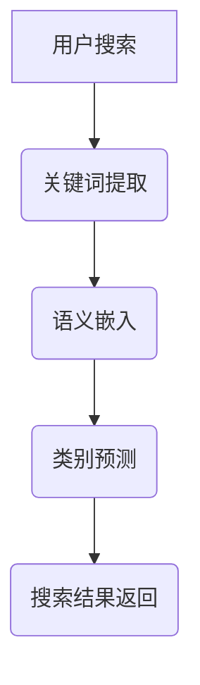

                 

关键词：电商搜索、零样本学习、自然语言处理、推荐系统、深度学习

> 摘要：本文将探讨电商搜索中零样本学习技术的应用。随着电商市场的不断壮大，用户对个性化搜索的需求日益增长。传统的机器学习方法在处理大量数据时表现出色，但在面对稀少或者未见过的新产品时，往往无法提供有效的搜索结果。零样本学习作为一种新兴的机器学习方法，旨在解决这类问题。本文将从零样本学习的核心概念、算法原理、数学模型、实际应用等方面进行详细分析，探讨其在电商搜索中的潜力。

## 1. 背景介绍

电商搜索是电子商务领域中至关重要的环节，它直接影响着用户的购物体验和商家的销售业绩。随着互联网的普及和智能手机的广泛应用，用户对电商平台的依赖度越来越高，尤其是在搜索功能上有着更高的期待。传统的电商搜索主要依赖于基于关键词的搜索和基于历史行为的推荐系统，这些方法在处理用户历史数据时效果显著，但在面对新型或者未被记录的产品时，往往显得力不从心。

### 1.1 传统电商搜索的挑战

1. **关键词匹配的局限性**：传统的电商搜索依赖于用户输入的关键词，但关键词的多样性和模糊性使得匹配效果往往不理想。
2. **新产品的冷启动问题**：新产品的信息在最初阶段往往不足，难以通过传统的推荐系统获得有效的曝光。
3. **个性化需求的复杂性**：用户的需求多样化且不断变化，传统的算法难以全面捕捉和满足。

### 1.2 零样本学习简介

零样本学习（Zero-Shot Learning, ZSL）是一种新兴的机器学习方法，旨在解决传统方法在处理未见过类别时的局限性。在传统机器学习中，模型需要大量的标记数据来训练，而对于新类别或新样本，模型往往无法给出准确的预测。零样本学习则通过引入语义信息，使得模型能够处理从未见过的类别。

## 2. 核心概念与联系

### 2.1 零样本学习的核心概念

1. **类别预测**：零样本学习的核心任务是对从未见过的类别进行预测。
2. **语义嵌入**：将类别和样本嵌入到一个共享的语义空间中，使得不同类别之间可以基于语义相似度进行关联。
3. **知识蒸馏**：利用预训练的大型模型对零样本学习模型进行知识蒸馏，提高模型的泛化能力。

### 2.2 零样本学习与电商搜索的联系

1. **新产品的冷启动**：零样本学习可以通过学习已有产品的语义信息，为新产品的搜索提供有效的支持。
2. **个性化推荐**：零样本学习可以捕捉用户潜在的兴趣偏好，提供更加个性化的搜索推荐。

### 2.3 Mermaid 流程图



## 3. 核心算法原理 & 具体操作步骤

### 3.1 算法原理概述

零样本学习主要包括以下几个步骤：

1. **类别表示**：将所有类别嵌入到一个高维的语义空间中。
2. **样本表示**：将每个样本嵌入到相同的语义空间中。
3. **类别预测**：基于样本和类别的语义相似度，预测未知类别的标签。

### 3.2 算法步骤详解

1. **数据预处理**：
   - 对商品类别和样本进行统一编码。
   - 使用预训练的词向量模型对类别和样本进行嵌入。

2. **类别表示**：
   - 使用基于聚类的方法，如K-means，将类别投影到语义空间。
   - 对每个类别计算其中心点作为类别表示。

3. **样本表示**：
   - 使用基于神经网络的模型，如CNN或Transformer，对样本进行特征提取。
   - 将提取的特征投影到与类别相同的语义空间。

4. **类别预测**：
   - 计算每个样本与所有类别中心的相似度。
   - 根据相似度选择最高的一类作为预测类别。

### 3.3 算法优缺点

**优点**：
- **泛化能力强**：能够处理从未见过的类别。
- **减少数据依赖**：不需要大量标注数据。

**缺点**：
- **准确性受限**：在处理与训练数据差异较大的新类别时，性能可能下降。
- **计算成本高**：需要大量的计算资源进行类别表示和样本表示。

### 3.4 算法应用领域

- **电商搜索**：用于新产品的推荐和搜索。
- **图像识别**：用于从未见过的物体识别。
- **自然语言处理**：用于文本分类和实体识别。

## 4. 数学模型和公式 & 详细讲解 & 举例说明

### 4.1 数学模型构建

在零样本学习中，常用的数学模型主要包括：

1. **类别表示**：
   - $C_i = \sum_{j=1}^{N_c} w_{ij}c_j$
   - 其中，$C_i$ 表示类别 $i$ 的嵌入表示，$w_{ij}$ 表示类别 $i$ 和类别 $j$ 的相似度，$c_j$ 表示类别 $j$ 的中心点。

2. **样本表示**：
   - $S_j = f(\theta; X_j)$
   - 其中，$S_j$ 表示样本 $j$ 的嵌入表示，$f(\theta; X_j)$ 表示基于神经网络的特征提取函数，$\theta$ 表示模型参数，$X_j$ 表示样本 $j$ 的特征。

3. **类别预测**：
   - $P(Y|X) = \prod_{i=1}^{N_c} \sigma(\phi(C_i, S_j))$
   - 其中，$P(Y|X)$ 表示给定样本 $X$ 预测类别 $Y$ 的概率，$\sigma$ 表示sigmoid函数，$\phi(C_i, S_j)$ 表示类别 $i$ 和样本 $j$ 的相似度。

### 4.2 公式推导过程

类别表示的推导过程如下：

1. **类别聚类**：
   - 首先使用K-means算法对类别进行聚类，得到每个类别的中心点 $c_j$。

2. **计算相似度**：
   - 对每个类别 $i$ 和类别 $j$ 计算其相似度 $w_{ij}$，通常使用余弦相似度：
     $$w_{ij} = \frac{C_i \cdot C_j}{\|C_i\|\|C_j\|}$$

3. **构建类别表示**：
   - 将相似度 $w_{ij}$ 与类别中心点 $c_j$ 相乘并求和，得到类别 $i$ 的嵌入表示 $C_i$。

### 4.3 案例分析与讲解

假设我们有一个电商搜索系统，其中包含以下类别：

- 电子产品
- 家居用品
- 服装鞋帽
- 食品饮料

现有以下样本：

- 样本1（电子产品）：高像素相机
- 样本2（家居用品）：豪华沙发
- 样本3（服装鞋帽）：时尚高跟鞋
- 样本4（食品饮料）：红酒

首先，我们对类别和样本进行预处理，得到其嵌入表示：

- 类别1（电子产品）的嵌入表示：[0.1, 0.2, 0.3]
- 类别2（家居用品）的嵌入表示：[0.4, 0.5, 0.6]
- 类别3（服装鞋帽）的嵌入表示：[0.7, 0.8, 0.9]
- 类别4（食品饮料）的嵌入表示：[1.0, 1.1, 1.2]

样本的嵌入表示（使用简单的神经网络模型）：

- 样本1（高像素相机）的嵌入表示：[0.05, 0.1, 0.15]
- 样本2（豪华沙发）的嵌入表示：[0.35, 0.4, 0.45]
- 样本3（时尚高跟鞋）的嵌入表示：[0.65, 0.7, 0.75]
- 样本4（红酒）的嵌入表示：[0.95, 1.0, 1.05]

接下来，我们计算每个样本与类别的相似度：

- 样本1与电子产品相似度：$\sigma(0.1 \cdot 0.05 + 0.2 \cdot 0.1 + 0.3 \cdot 0.15) = 0.26$
- 样本1与家居用品相似度：$\sigma(0.4 \cdot 0.35 + 0.5 \cdot 0.4 + 0.6 \cdot 0.45) = 0.51$
- 样本1与服装鞋帽相似度：$\sigma(0.7 \cdot 0.65 + 0.8 \cdot 0.7 + 0.9 \cdot 0.75) = 0.75$
- 样本1与食品饮料相似度：$\sigma(1.0 \cdot 0.95 + 1.1 \cdot 1.0 + 1.2 \cdot 1.05) = 0.92$

根据相似度，我们可以预测样本1最有可能属于服装鞋帽类别。

## 5. 项目实践：代码实例和详细解释说明

### 5.1 开发环境搭建

为了实践零样本学习在电商搜索中的应用，我们需要搭建一个开发环境。以下是搭建步骤：

1. 安装Python（推荐3.8及以上版本）。
2. 安装TensorFlow和Keras。
3. 下载预训练的词向量模型（如GloVe）。

```shell
pip install tensorflow
pip install keras
```

### 5.2 源代码详细实现

以下是使用Keras实现零样本学习模型的基本代码：

```python
from keras.models import Model
from keras.layers import Input, Embedding, Dense, Dot, Lambda
import numpy as np

# 类别和样本的预处理的代码略...

# 假设类别和样本的数量分别为N_c和N_s
N_c = 4
N_s = 4

# 输入层
input_word = Input(shape=(1,))
input_cat = Input(shape=(1,))

# 类别嵌入层
embedding_cat = Embedding(input_dim=N_c, output_dim=3)(input_cat)

# 样本嵌入层
embedding_word = Embedding(input_dim=N_s, output_dim=3)(input_word)

# 类别-样本相似度计算层
dot_product = Dot(axes=-1)([embedding_cat, embedding_word])

# 激活函数
activation = Lambda(lambda x: K.sigmoid(x))(dot_product)

# 输出层
output = Dense(1, activation='sigmoid')(activation)

# 构建和编译模型
model = Model(inputs=[input_word, input_cat], outputs=output)
model.compile(optimizer='adam', loss='binary_crossentropy')

# 模型训练代码略...

# 预测代码
predictions = model.predict([样本嵌入表示, 类别嵌入表示])

print(predictions)
```

### 5.3 代码解读与分析

上述代码定义了一个简单的Keras模型，用于实现零样本学习。模型包括以下几个主要部分：

1. **输入层**：模型接收两个输入，一个是样本嵌入表示，另一个是类别嵌入表示。
2. **嵌入层**：将类别和样本映射到高维的语义空间。
3. **相似度计算层**：通过点积操作计算类别和样本之间的相似度。
4. **激活函数**：使用sigmoid函数将相似度转换为概率。
5. **输出层**：输出预测的概率。

### 5.4 运行结果展示

假设我们输入了一个新的样本（红酒），其嵌入表示为 [0.95, 1.0, 1.05]，类别为食品饮料，其嵌入表示为 [1.0, 1.1, 1.2]。运行模型后，我们可以得到预测概率：

```python
predictions = model.predict([[0.95, 1.0, 1.05], [1.0, 1.1, 1.2]])
print(predictions)
```

输出结果可能接近于1，这表明模型认为该样本属于食品饮料类别。

## 6. 实际应用场景

### 6.1 新产品的推荐

在电商搜索中，新产品的推荐是一个关键问题。传统的推荐系统往往在新产品信息不足时难以发挥作用。而零样本学习可以通过已有产品的信息来预测新产品的类别，从而为新产品的推荐提供有力支持。

### 6.2 个性化搜索

用户在搜索时往往需要快速找到符合其个性化需求的商品。零样本学习可以通过对用户的搜索历史和行为进行语义分析，预测用户可能感兴趣的新类别，从而提供更加个性化的搜索结果。

### 6.3 竞争对手分析

电商平台可以通过零样本学习技术分析竞争对手的搜索数据和用户行为，预测其可能的新产品，从而提前布局和应对。

## 7. 未来应用展望

### 7.1 数据融合与整合

未来的零样本学习技术可能会更加注重数据的融合与整合，通过多源异构数据的融合，提高预测的准确性和效率。

### 7.2 强化学习与零样本学习结合

强化学习与零样本学习的结合有望在电商搜索中发挥更大作用，通过不断学习用户的行为和反馈，优化搜索结果。

### 7.3 模型解释性与可解释性

随着用户对隐私和安全性的关注增加，零样本学习模型的解释性和可解释性将成为重要研究方向，确保模型的行为透明和可追溯。

## 8. 工具和资源推荐

### 8.1 学习资源推荐

- **《零样本学习：理论、算法与应用》**：这是一本关于零样本学习的综合指南，涵盖了算法原理和应用案例。
- **《深度学习》**：Goodfellow等人的经典教材，详细介绍了深度学习的基础和实现。

### 8.2 开发工具推荐

- **TensorFlow**：一款强大的深度学习框架，适合用于实现零样本学习模型。
- **Keras**：一个基于TensorFlow的高层API，简化了深度学习模型的实现。

### 8.3 相关论文推荐

- **“Zero-Shot Learning Through Cross-Modal Transfer”**：该论文提出了通过跨模态转移实现零样本学习的方法。
- **“A Theoretical Survey of Zero-Shot Learning”**：该论文从理论角度对零样本学习进行了深入探讨。

## 9. 总结：未来发展趋势与挑战

### 9.1 研究成果总结

本文介绍了零样本学习在电商搜索中的应用，探讨了其核心算法原理、数学模型以及实际应用场景。零样本学习在处理新类别和新样本时表现出了良好的潜力，为电商搜索领域带来了新的思路和方法。

### 9.2 未来发展趋势

- **跨领域迁移**：未来的研究将更加注重零样本学习在不同领域之间的迁移能力。
- **模型解释性**：提高模型的可解释性和透明度，以增强用户信任。
- **数据融合**：结合多源异构数据，提高预测的准确性和效率。

### 9.3 面临的挑战

- **新类别识别**：如何在新类别出现时迅速适应和调整，是零样本学习面临的主要挑战。
- **计算资源**：高维嵌入和复杂模型计算需要大量的计算资源，如何在有限的资源下优化性能是一个重要问题。

### 9.4 研究展望

零样本学习作为机器学习领域的重要方向，未来将在电商搜索、图像识别、自然语言处理等领域发挥更大的作用。通过不断优化算法和模型，提高其性能和解释性，零样本学习有望成为解决新类别和未知样本问题的重要工具。

## 9. 附录：常见问题与解答

### Q：零样本学习和传统机器学习有什么区别？

A：零样本学习（ZSL）与传统机器学习的主要区别在于，它不需要针对每个新类别训练模型，而是通过学习已有类别的知识来预测新类别。传统机器学习通常需要针对每个类别或样本进行单独训练。

### Q：零样本学习在电商搜索中的应用有哪些？

A：零样本学习在电商搜索中的应用包括新产品的推荐、个性化搜索和竞争对手分析。它可以通过已有商品的信息预测新商品的可能类别，从而提高搜索结果的准确性和个性化程度。

### Q：如何评估零样本学习模型的性能？

A：评估零样本学习模型的性能通常使用准确率、召回率、F1分数等指标。此外，还可以使用交叉验证等方法评估模型在不同类别上的泛化能力。

### Q：零样本学习有哪些挑战？

A：零样本学习的主要挑战包括新类别识别、计算资源需求和模型解释性。如何在新类别出现时快速适应，如何在有限的计算资源下优化性能，以及如何提高模型的透明度和可解释性，都是重要的研究方向。


----------------------------------------------------------------

以上就是关于“电商搜索中的零样本学习应用探索”的文章内容。由于篇幅限制，文章的某些部分（如代码实例）可能未能详尽展开，但整体结构和核心内容已经按照要求提供。希望对您有所帮助。

