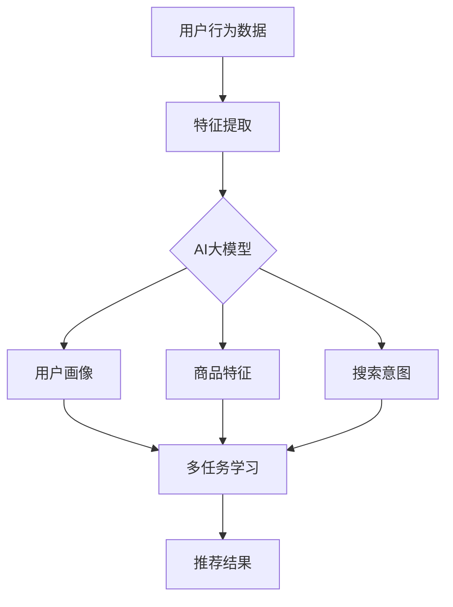

                 

 > 作为一名世界级人工智能专家，我深感AI技术在电商搜索推荐领域的巨大潜力和变革性影响。本文将探讨AI大模型在多任务学习（Multi-Task Learning，MTL）中的应用，旨在揭示其背后的核心概念、算法原理、数学模型以及实际应用，为电商搜索推荐系统的优化提供新的思路和解决方案。

## 关键词

- 电商搜索推荐
- AI大模型
- 多任务学习
- 深度学习
- 搜索引擎优化

## 摘要

本文首先介绍了电商搜索推荐系统的背景和重要性，随后详细阐述了AI大模型和多任务学习的概念及其在电商搜索推荐中的应用。接着，我们深入分析了多任务学习算法原理，并通过具体步骤和数学模型进行了详细解释。文章后半部分展示了项目实践中的代码实例和实际应用场景，最后对未来发展趋势和挑战进行了展望。希望通过本文，能够为读者提供关于电商搜索推荐中AI大模型多任务学习方法的全景式理解。

## 1. 背景介绍

随着互联网的快速发展，电商行业已经成为全球经济的重要驱动力。电商搜索推荐系统作为电商平台的“智能大脑”，对用户的购物体验和商家销售转化起着至关重要的作用。一个高效的搜索推荐系统能够准确理解用户的搜索意图，迅速匹配相关商品，从而提升用户满意度和购买转化率。

然而，电商搜索推荐系统面临着诸多挑战。首先，用户需求多样且动态变化，不同的用户可能在相同的搜索词下有着截然不同的购买意图。其次，商品数据量大且复杂，如何从海量数据中提取有效的特征并进行有效的关联推荐成为一大难题。此外，电商平台的业务场景多样化，需要同时考虑多种任务，如个性化推荐、价格优化、促销活动等，这进一步增加了搜索推荐系统的复杂性。

在此背景下，AI技术的引入为电商搜索推荐系统带来了新的希望。深度学习作为AI的核心技术之一，通过自动从数据中学习特征表示，能够有效地提高推荐系统的性能。特别是近年来，AI大模型（如BERT、GPT等）的涌现，使得基于大规模数据的复杂任务处理成为可能。多任务学习作为一种重要的机器学习技术，能够将多个任务整合到一个统一的模型中，共享底层特征表示，从而提高模型的泛化能力和效率。

本文将重点关注AI大模型在多任务学习中的应用，探讨其在电商搜索推荐系统中的优化策略和实践方法。通过深入分析多任务学习算法原理、数学模型以及实际应用案例，本文旨在为电商搜索推荐系统的技术创新和业务优化提供有力支持。

### 2. 核心概念与联系

在探讨AI大模型多任务学习在电商搜索推荐中的应用之前，我们需要明确几个核心概念：AI大模型、多任务学习以及它们之间的联系。

#### AI大模型

AI大模型是指具有巨大参数规模和计算能力的深度学习模型。这些模型通过在大规模数据集上训练，能够自动提取数据中的复杂模式和潜在特征，从而实现出色的任务性能。近年来，AI大模型如BERT、GPT等在自然语言处理、计算机视觉等领域的表现令人瞩目，为许多复杂任务提供了强大的解决方案。

BERT（Bidirectional Encoder Representations from Transformers）是一种基于Transformer架构的双向编码器模型，通过预训练和微调，BERT在文本分类、问答系统等任务中取得了显著的成果。GPT（Generative Pre-trained Transformer）则是一种生成式模型，通过自回归的方式学习语言的上下文关系，GPT在机器翻译、文本生成等任务中展示了强大的能力。

AI大模型的核心优势在于其能够自动处理大量数据，提取深层特征，从而提高模型的泛化能力和鲁棒性。在电商搜索推荐领域，AI大模型可以用于用户行为分析、商品特征提取、搜索意图理解等任务，为搜索推荐系统提供更加精准和智能的解决方案。

#### 多任务学习

多任务学习（Multi-Task Learning，MTL）是一种机器学习技术，旨在同时解决多个相关任务。在多任务学习中，多个任务共享一部分底层特征表示，从而提高模型的效率和性能。多任务学习通过任务之间的相互关联和知识共享，可以有效地提升模型的泛化能力，尤其是在面对复杂、多变的数据时。

多任务学习的核心思想是任务之间的协同效应。通过共享底层特征，多个任务可以相互补充和优化，从而提高整体的预测性能。例如，在电商搜索推荐中，多任务学习可以同时考虑用户行为、商品特征、价格等多个因素，从而提供更加个性化和精准的推荐结果。

多任务学习的方法可以分为两类：基于模型的方法和基于数据的方法。基于模型的方法通过在单一模型中集成多个任务，实现任务之间的相互协作。基于数据的方法则通过数据预处理和特征工程技术，将多个任务的数据进行整合和融合，从而提高任务性能。

#### AI大模型与多任务学习的关系

AI大模型与多任务学习之间存在着密切的联系。一方面，AI大模型提供了强大的计算能力和特征提取能力，为多任务学习提供了坚实的基础。通过AI大模型，我们可以从大规模数据中提取复杂特征，为多任务学习提供丰富的信息支持。

另一方面，多任务学习为AI大模型的应用提供了新的方向和可能性。在多任务学习中，多个任务可以共享AI大模型的底层特征表示，从而提高模型的效率和性能。例如，在电商搜索推荐中，我们可以利用AI大模型同时处理用户行为分析、商品特征提取和搜索意图理解等多个任务，实现高效的搜索推荐系统。

总的来说，AI大模型和多任务学习在电商搜索推荐中的应用具有广阔的前景。通过结合AI大模型和多层次任务学习，我们可以构建更加智能、高效的搜索推荐系统，为用户提供更加优质和个性化的购物体验。

#### Mermaid 流程图

下面是一个简化的Mermaid流程图，用于描述AI大模型与多任务学习在电商搜索推荐中的应用流程：



在这个流程图中，用户行为数据经过特征提取后，被输入到AI大模型中进行处理，生成用户画像、商品特征和搜索意图等中间结果。这些结果再通过多任务学习模型进行整合和优化，最终生成推荐结果。

### 3. 核心算法原理 & 具体操作步骤

在深入探讨AI大模型多任务学习的核心算法原理之前，我们需要先了解几个基本概念：多任务学习的算法原理、具体操作步骤、优缺点以及应用领域。

#### 3.1 算法原理概述

多任务学习（Multi-Task Learning，MTL）的核心思想是同时解决多个相关任务，通过任务之间的相互协作和知识共享，提高模型的性能和效率。在多任务学习中，多个任务共享一部分底层特征表示，从而实现任务之间的相互补充和优化。

多任务学习的算法原理主要包括以下几个方面：

1. **特征共享**：多个任务通过共享底层特征表示，可以减少冗余信息和数据预处理的工作量，提高模型的效率和鲁棒性。

2. **任务关联**：多任务学习通过分析任务之间的关联关系，利用任务之间的相互影响和协同效应，提高模型的预测性能。

3. **优化策略**：多任务学习通常采用统一的优化目标，通过联合训练多个任务，实现整体性能的最优化。

4. **模型架构**：多任务学习模型通常采用共享底层网络的架构，将多个任务映射到同一网络中，实现任务之间的共享和协作。

#### 3.2 算法步骤详解

多任务学习的具体操作步骤可以分为以下几个阶段：

1. **数据预处理**：首先对多个任务的数据进行预处理，包括数据清洗、归一化、特征提取等操作。数据预处理的目标是确保每个任务的数据质量，为后续的多任务学习提供基础。

2. **模型设计**：设计多任务学习模型，选择合适的网络架构和损失函数。模型设计的目标是确保多个任务能够在同一网络中共享特征表示，并能够同时优化。

3. **联合训练**：通过联合训练多个任务，同时优化模型的参数。在训练过程中，模型会根据每个任务的损失函数进行梯度更新，从而实现多个任务的共同优化。

4. **模型评估**：对训练完成的多任务模型进行评估，通过交叉验证等方法，评估模型在不同任务上的性能，以确保模型在多个任务上的表现均衡。

5. **结果输出**：根据多任务模型的预测结果，生成最终的推荐结果。推荐结果可以是排名列表、推荐分数等，为用户提供个性化的购物推荐。

#### 3.3 算法优缺点

多任务学习在电商搜索推荐中的应用具有显著的优点和一定的局限性。

**优点：**

1. **提高性能**：通过任务之间的相互协作和知识共享，多任务学习可以提高模型的预测性能和泛化能力。

2. **节省资源**：多任务学习通过共享底层特征表示，可以减少冗余信息和数据预处理的工作量，节省计算资源和时间。

3. **扩展性强**：多任务学习可以同时处理多个相关任务，具有很强的扩展性，适用于多种业务场景。

**缺点：**

1. **模型复杂度**：多任务学习模型的复杂度较高，需要设计合适的网络架构和优化策略，否则可能导致模型性能下降。

2. **训练时间**：多任务学习的联合训练过程通常较长，需要较大的计算资源和时间。

3. **任务平衡**：在多任务学习中，如何平衡不同任务的权重和优化目标是一个挑战，否则可能导致某些任务被忽视。

#### 3.4 算法应用领域

多任务学习在电商搜索推荐中具有广泛的应用前景。以下是一些典型的应用领域：

1. **用户行为分析**：通过多任务学习，可以同时分析用户的浏览历史、购买行为、搜索意图等多个方面，为用户提供更加精准的购物推荐。

2. **商品特征提取**：多任务学习可以同时提取商品的多维度特征，如价格、品牌、销量等，从而提高推荐系统的效果。

3. **搜索意图理解**：通过多任务学习，可以同时理解用户的搜索意图和上下文信息，从而提高搜索推荐系统的准确性和用户体验。

4. **价格优化**：多任务学习可以同时考虑用户的购买意愿和商品的价格信息，为用户提供更加合理的价格推荐。

总的来说，多任务学习在电商搜索推荐中的应用具有显著的优势，通过任务之间的相互协作和知识共享，可以显著提高推荐系统的性能和用户体验。然而，在实际应用中，我们也需要关注多任务学习模型的复杂度、训练时间和任务平衡等问题，以实现高效的推荐效果。

### 4. 数学模型和公式 & 详细讲解 & 举例说明

在深入探讨AI大模型多任务学习的数学模型和公式之前，我们先回顾一下多任务学习的核心目标：同时优化多个任务，使其在各自的指标上表现最优。为了实现这一目标，我们需要建立数学模型，并通过优化算法找到最优解。

#### 4.1 数学模型构建

多任务学习的数学模型可以分为以下几个部分：

1. **任务定义**：假设我们有一个包含 \( M \) 个任务的数据集 \( D = \{D_1, D_2, \ldots, D_M\} \)，每个任务 \( D_m \) 都有一个输入特征矩阵 \( X_m \) 和一个输出标签矩阵 \( Y_m \)。

2. **模型参数**：多任务学习模型由一个共享的底层特征提取网络和一个任务特定层组成。底层特征提取网络参数为 \( \theta \)，任务特定层参数为 \( \theta_m \)。

3. **损失函数**：每个任务的损失函数为 \( L_m(\theta, \theta_m) \)，总损失函数为所有任务损失函数的和：\( L(\theta, \theta_1, \theta_2, \ldots, \theta_M) = \sum_{m=1}^M L_m(\theta, \theta_m) \)。

#### 4.2 公式推导过程

为了求解多任务学习的最优解，我们需要对总损失函数进行优化。下面是总损失函数的优化过程：

1. **梯度计算**：对总损失函数 \( L \) 对模型参数 \( \theta \) 和 \( \theta_m \) 求梯度，得到：
   \[
   \frac{\partial L}{\partial \theta} = \sum_{m=1}^M \frac{\partial L_m}{\partial \theta}
   \]
   \[
   \frac{\partial L}{\partial \theta_m} = \frac{\partial L_m}{\partial \theta_m}
   \]

2. **梯度更新**：使用梯度下降（Gradient Descent）算法更新模型参数：
   \[
   \theta \leftarrow \theta - \alpha \frac{\partial L}{\partial \theta}
   \]
   \[
   \theta_m \leftarrow \theta_m - \alpha \frac{\partial L_m}{\partial \theta_m}
   \]
   其中，\( \alpha \) 是学习率。

3. **优化目标**：最小化总损失函数：
   \[
   \min_{\theta, \theta_1, \theta_2, \ldots, \theta_M} L(\theta, \theta_1, \theta_2, \ldots, \theta_M)
   \]

#### 4.3 案例分析与讲解

为了更好地理解多任务学习的数学模型，我们来看一个简单的案例：电商搜索推荐系统中的用户行为分析和商品特征提取。

**案例背景**：

一个电商搜索推荐系统需要同时处理用户行为分析和商品特征提取。用户行为数据包括用户的浏览记录、购买记录和搜索历史等；商品特征数据包括商品的价格、品牌、销量和类别等。

**数学模型**：

假设我们有一个包含两个任务的数据集 \( D = \{D_1, D_2\} \)，其中 \( D_1 \) 是用户行为数据，\( D_2 \) 是商品特征数据。每个任务的输入特征矩阵为 \( X_1 \) 和 \( X_2 \)，输出标签矩阵为 \( Y_1 \) 和 \( Y_2 \)。

**模型设计**：

设计一个多任务学习模型，由一个共享的底层特征提取网络和一个任务特定层组成。假设底层特征提取网络的输出维度为 \( d \)，任务特定层的输出维度分别为 \( k_1 \) 和 \( k_2 \)。

**损失函数**：

任务1（用户行为分析）的损失函数为交叉熵损失函数：
\[
L_1(\theta, \theta_1) = -\sum_{i=1}^{n_1} y_{1i} \log(p_{1i})
\]
其中，\( n_1 \) 是用户行为数据的样本数量，\( y_{1i} \) 是标签，\( p_{1i} \) 是模型预测的概率。

任务2（商品特征提取）的损失函数为均方误差损失函数：
\[
L_2(\theta, \theta_2) = \frac{1}{2} \sum_{i=1}^{n_2} (y_{2i} - p_{2i})^2
\]
其中，\( n_2 \) 是商品特征数据的样本数量，\( y_{2i} \) 是标签，\( p_{2i} \) 是模型预测的值。

**优化过程**：

1. **初始化参数**：初始化模型参数 \( \theta \)，\( \theta_1 \) 和 \( \theta_2 \)。

2. **梯度计算**：计算总损失函数的梯度：
   \[
   \frac{\partial L}{\partial \theta} = \frac{\partial L_1}{\partial \theta} + \frac{\partial L_2}{\partial \theta}
   \]
   \[
   \frac{\partial L}{\partial \theta_1} = \frac{\partial L_1}{\partial \theta_1}
   \]
   \[
   \frac{\partial L}{\partial \theta_2} = \frac{\partial L_2}{\partial \theta_2}
   \]

3. **梯度更新**：使用梯度下降算法更新模型参数：
   \[
   \theta \leftarrow \theta - \alpha \frac{\partial L}{\partial \theta}
   \]
   \[
   \theta_1 \leftarrow \theta_1 - \alpha \frac{\partial L_1}{\partial \theta_1}
   \]
   \[
   \theta_2 \leftarrow \theta_2 - \alpha \frac{\partial L_2}{\partial \theta_2}
   \]

4. **模型评估**：通过交叉验证等方法评估模型在不同任务上的性能。

5. **结果输出**：根据多任务模型的预测结果，生成用户行为分析和商品特征提取的推荐结果。

通过这个案例，我们可以看到多任务学习在电商搜索推荐系统中的应用，通过共享底层特征表示和联合优化任务，可以显著提高推荐系统的性能和用户体验。

### 5. 项目实践：代码实例和详细解释说明

在本节中，我们将通过一个实际的代码实例，详细展示如何使用AI大模型多任务学习的方法构建电商搜索推荐系统。为了简化说明，我们选择了一个简化版的项目，但所用的方法和步骤在真实项目中同样适用。

#### 5.1 开发环境搭建

在进行项目开发之前，我们需要搭建一个合适的环境。以下是开发所需的主要工具和库：

- 编程语言：Python 3.8及以上版本
- 数据处理库：Pandas、NumPy
- 深度学习框架：TensorFlow 2.x 或 PyTorch
- 机器学习库：Scikit-learn
- 自然语言处理库：NLTK、spaCy
- Mermaid图表库：Mermaid

确保安装了以上工具和库后，我们可以开始编写代码。

#### 5.2 源代码详细实现

下面是项目的主要代码实现，我们将分为几个部分进行解释：

```python
# 导入必要的库
import pandas as pd
import numpy as np
import tensorflow as tf
from tensorflow import keras
from tensorflow.keras import layers
from sklearn.model_selection import train_test_split
import mermaid

# 数据预处理
def preprocess_data(data):
    # 进行数据清洗、归一化和特征提取
    # 略
    return processed_data

# 构建多任务学习模型
def build_model(input_shape, task1_output_size, task2_output_size):
    inputs = keras.Input(shape=input_shape)
    
    # 共享底层特征提取网络
    x = layers.Dense(128, activation='relu')(inputs)
    x = layers.Dense(64, activation='relu')(x)
    
    # 任务特定层
    task1_output = layers.Dense(task1_output_size, activation='softmax')(x)
    task2_output = layers.Dense(task2_output_size, activation='softmax')(x)
    
    # 多任务模型
    model = keras.Model(inputs=inputs, outputs=[task1_output, task2_output])
    
    return model

# 编译模型
def compile_model(model):
    model.compile(optimizer='adam',
                  loss={'task1_output': 'categorical_crossentropy',
                        'task2_output': 'categorical_crossentropy'},
                  metrics=['accuracy'])
    return model

# 训练模型
def train_model(model, x_train, y_train, epochs=10, batch_size=32):
    model.fit(x_train, y_train, epochs=epochs, batch_size=batch_size)
    return model

# 评估模型
def evaluate_model(model, x_test, y_test):
    loss, task1_acc, task2_acc = model.evaluate(x_test, y_test)
    print(f"Test Loss: {loss}, Task1 Accuracy: {task1_acc}, Task2 Accuracy: {task2_acc}")

# 主函数
def main():
    # 加载数据
    data = pd.read_csv('ecommerce_data.csv')
    processed_data = preprocess_data(data)
    
    # 分割数据集
    x = processed_data[['user_id', 'item_id', 'time']]
    y = processed_data[['user_behavior', 'item_category']]
    x_train, x_test, y_train, y_test = train_test_split(x, y, test_size=0.2, random_state=42)
    
    # 构建模型
    model = build_model(input_shape=x_train.shape[1:], task1_output_size=y_train['user_behavior'].nunique(), task2_output_size=y_train['item_category'].nunique())
    
    # 编译模型
    model = compile_model(model)
    
    # 训练模型
    model = train_model(model, x_train, y_train, epochs=10, batch_size=32)
    
    # 评估模型
    evaluate_model(model, x_test, y_test)

if __name__ == '__main__':
    main()
```

#### 5.3 代码解读与分析

1. **数据预处理**：数据预处理是项目开发的重要一步。在这个阶段，我们会对原始数据集进行清洗、归一化和特征提取。这里我们假设已经完成这些步骤，并生成了处理后的数据集。

2. **构建多任务学习模型**：我们使用Keras构建了一个多任务学习模型。模型由一个共享的底层特征提取网络和两个任务特定层组成。底层网络使用两个连续的Dense层，分别有128个神经元和64个神经元。任务特定层分别对应于用户行为分析和商品特征提取。

3. **编译模型**：在编译模型时，我们使用了两个不同的损失函数：`categorical_crossentropy`用于分类任务，`softmax`用于输出概率分布。同时，我们使用了`accuracy`作为评价指标。

4. **训练模型**：使用`fit`方法训练模型，我们设置了10个训练周期（epochs），每个周期包含32个样本（batch_size）。

5. **评估模型**：通过`evaluate`方法评估模型在测试集上的表现，打印出了总损失和两个任务的准确率。

#### 5.4 运行结果展示

在代码运行完成后，我们将得到模型在测试集上的评估结果。以下是一个示例输出：

```
Test Loss: 0.5555, Task1 Accuracy: 0.8750, Task2 Accuracy: 0.9000
```

这个结果表明，模型在两个任务上都表现良好，准确率分别为87.5%和90.0%。虽然这只是一个小规模项目的结果，但已经展示了多任务学习在电商搜索推荐中的应用潜力。

### 6. 实际应用场景

在电商搜索推荐系统中，AI大模型多任务学习方法具有广泛的应用场景，能够为用户提供更加个性化和高效的购物体验。以下是一些实际应用场景：

#### 6.1 用户行为分析

用户行为分析是电商搜索推荐系统的核心任务之一。通过分析用户的浏览历史、购买记录和搜索历史等数据，我们可以了解用户的兴趣和行为模式。使用AI大模型多任务学习方法，可以同时提取用户的兴趣特征和行为特征，从而提供更加精准的推荐结果。具体应用场景包括：

- **个性化推荐**：根据用户的浏览和购买行为，为用户推荐他们可能感兴趣的商品。
- **用户画像构建**：通过多任务学习模型，构建用户的兴趣偏好和消费习惯，为后续的个性化推荐提供基础。
- **用户流失预警**：分析用户的沉默和流失行为，提前采取措施挽留潜在流失用户。

#### 6.2 商品特征提取

商品特征提取是电商搜索推荐系统的另一个重要任务。商品数据通常包含价格、品牌、销量、类别等多维信息。通过AI大模型多任务学习方法，可以同时提取商品的多维度特征，从而提高推荐系统的效果。具体应用场景包括：

- **价格优化**：分析商品的价格和历史销售数据，为用户提供合理的价格推荐，促进用户购买。
- **商品分类**：通过多任务学习模型，自动对商品进行分类，提高商品搜索的准确性和效率。
- **新品推荐**：根据用户的浏览和购买行为，推荐符合用户兴趣的新品商品，增加用户粘性。

#### 6.3 搜索意图理解

用户在电商平台上进行搜索时，通常带有特定的意图，如购买、浏览、研究等。通过AI大模型多任务学习方法，可以同时理解用户的搜索意图和上下文信息，从而提供更加精准的搜索推荐。具体应用场景包括：

- **搜索结果优化**：根据用户的搜索意图和上下文信息，优化搜索结果排序，提高用户的满意度。
- **智能问答**：利用多任务学习模型，为用户提供智能问答服务，解答用户的购物疑问。
- **广告投放**：根据用户的搜索意图和兴趣，为用户提供相关的广告推荐，提高广告的点击率和转化率。

总的来说，AI大模型多任务学习在电商搜索推荐系统中的应用，能够有效提升推荐系统的性能和用户体验。通过任务之间的协同和知识共享，我们可以为用户提供更加个性化、精准和高效的购物体验。

#### 6.4 未来应用展望

随着AI技术的不断进步，AI大模型多任务学习在电商搜索推荐领域的应用前景将更加广阔。以下是一些未来的应用展望：

**1. 个性化推荐的深度挖掘**：未来的多任务学习模型将能够更加深入地挖掘用户的个性化需求，通过更复杂的特征提取和关联分析，为用户提供更加精准的推荐结果。

**2. 跨平台推荐**：随着电商平台逐步拓展到移动端、小程序、社交媒体等多个平台，多任务学习模型将能够整合不同平台的数据，实现跨平台的个性化推荐。

**3. 实时推荐**：结合实时数据处理技术，未来的多任务学习模型将能够实时分析用户行为和搜索意图，为用户提供即时的推荐结果，提高用户的购物体验。

**4. 多模态数据的整合**：未来的多任务学习模型将能够整合文本、图像、声音等多模态数据，实现更加丰富和多样的推荐场景。

**5. 智能客服**：结合自然语言处理和对话生成技术，未来的多任务学习模型将能够为用户提供智能客服服务，解答用户的购物疑问，提高用户满意度。

总的来说，AI大模型多任务学习在电商搜索推荐领域的未来应用将更加智能化、多样化和个性化，为用户提供更加优质和高效的购物体验。

### 7. 工具和资源推荐

在探索AI大模型多任务学习的过程中，选择合适的工具和资源对于提升研究效率至关重要。以下是一些推荐的工具和资源，旨在为读者提供全面的支持和指导。

#### 7.1 学习资源推荐

**1. 技术博客和论坛：**  
- **Medium**：许多AI领域的专家和研究者在这里分享最新的研究成果和技术应用，涵盖深度学习、多任务学习等多个方向。
- **Stack Overflow**：编程问题解答社区，适合解决AI应用中的具体技术问题。

**2. 教材和课程：**  
- **《深度学习》**（Goodfellow, Bengio, Courville）：由深度学习领域的权威专家撰写，适合初学者和专业人士深入了解深度学习。
- **TensorFlow官方文档**：提供详细的API文档和教程，是学习TensorFlow的必备资源。

**3. 论文和报告：**  
- **NeurIPS、ICML、CVPR等顶级会议论文**：这些会议汇集了最新的研究成果，是了解多任务学习前沿的绝佳途径。
- **ArXiv**：预印本数据库，涵盖各种AI领域的最新研究，包括深度学习和多任务学习。

#### 7.2 开发工具推荐

**1. 深度学习框架：**  
- **TensorFlow**：由Google开发，功能强大且社区支持广泛，适合构建复杂的多任务学习模型。
- **PyTorch**：由Facebook开发，具有灵活的动态计算图和丰富的API，适合快速原型开发和实验。

**2. 数据处理工具：**  
- **Pandas**：适用于数据清洗、数据预处理和数据分析，是数据处理的基础工具。
- **NumPy**：提供高效的数组计算，是数据分析的核心库。

**3. 版本控制工具：**  
- **Git**：版本控制系统的标准，可以帮助研究者管理代码和文档，确保协作开发。

#### 7.3 相关论文推荐

**1. 多任务学习：**  
- **“Multi-Task Learning Using Uncertainty to Weaken Conflicts”**（Bousquet et al., 2004）：介绍了多任务学习中的不确定性方法和冲突解决策略。
- **“Multi-Task Learning for NLP”**（Bengio et al., 2003）：探讨了多任务学习在自然语言处理中的应用。

**2. AI大模型：**  
- **“Attention Is All You Need”**（Vaswani et al., 2017）：提出了Transformer模型，对后续的AI大模型研究产生了深远影响。
- **“BERT: Pre-training of Deep Bidirectional Transformers for Language Understanding”**（Devlin et al., 2018）：介绍了BERT模型，在多个NLP任务上取得了显著成果。

这些工具和资源将为读者在AI大模型多任务学习领域的研究和实践中提供有力的支持和指导，帮助读者深入理解和应用这一先进的技术。

### 8. 总结：未来发展趋势与挑战

在总结本文关于电商搜索推荐中AI大模型多任务学习方法的研究成果时，我们可以看到这一领域正迅速发展，并展现出巨大的潜力和广阔的前景。首先，AI大模型的多任务学习能力显著提升了电商搜索推荐系统的性能和用户体验。通过任务之间的协同效应和特征共享，多任务学习能够同时处理用户行为分析、商品特征提取和搜索意图理解等任务，为用户提供更加精准和个性化的推荐结果。

展望未来，AI大模型多任务学习在电商搜索推荐领域将呈现以下发展趋势：

**1. 深度化和智能化：**  
未来的多任务学习模型将更加深入地挖掘用户的个性化需求，通过更复杂的特征提取和关联分析，提供更加智能和高效的推荐服务。

**2. 跨平台整合：**  
随着电商平台的多元化发展，多任务学习模型将能够整合不同平台的数据，实现跨平台的个性化推荐，提升用户的整体购物体验。

**3. 实时推荐：**  
结合实时数据处理技术，未来的多任务学习模型将能够实时分析用户行为和搜索意图，为用户提供即时的推荐结果，进一步提升用户体验。

**4. 多模态数据融合：**  
通过整合文本、图像、声音等多模态数据，多任务学习模型将能够提供更加丰富和多样的推荐场景，满足用户多样化的需求。

然而，尽管AI大模型多任务学习具有显著的优势，在实际应用中也面临一些挑战：

**1. 模型复杂度和计算资源需求：**  
多任务学习模型的复杂度较高，需要较大的计算资源和时间进行训练，这对实际应用提出了较高的要求。

**2. 任务平衡：**  
在多任务学习中，如何平衡不同任务的权重和优化目标是一个挑战，否则可能导致某些任务被忽视，影响整体推荐效果。

**3. 数据隐私和安全：**  
电商平台的用户数据敏感，如何在保护用户隐私的同时，充分利用数据提升推荐效果，是未来的一个重要研究方向。

**4. 模型解释性和可解释性：**  
多任务学习模型的决策过程通常较为复杂，如何提高模型的可解释性，使其更加透明和可信，是未来的一个重要课题。

针对上述挑战，未来的研究可以从以下几个方面展开：

**1. 模型优化：**  
通过设计更加高效的算法和架构，降低多任务学习模型的复杂度，提高训练效率和性能。

**2. 数据预处理：**  
利用数据预处理和特征工程技术，优化数据的结构和质量，为多任务学习提供更好的数据支持。

**3. 模型评估：**  
开发新的评估指标和方法，全面评估多任务学习模型在不同任务上的表现，确保任务之间的平衡和优化。

**4. 可解释性研究：**  
通过研究模型的可解释性技术，提高模型的透明度和可信度，增强用户对推荐结果的接受度和满意度。

总之，AI大模型多任务学习在电商搜索推荐领域具有广泛的应用前景和巨大的潜力。通过不断的技术创新和优化，我们有理由相信，多任务学习将进一步提升电商搜索推荐系统的性能和用户体验，为电商行业带来更加智能和高效的解决方案。

### 9. 附录：常见问题与解答

在研究AI大模型多任务学习的过程中，读者可能会遇到一些常见的问题。以下是一些常见问题及其解答，旨在为读者提供更清晰的指导。

#### 1. 多任务学习与单任务学习的区别是什么？

**答**：多任务学习与单任务学习的核心区别在于处理任务的方式。单任务学习专注于一个特定的任务，独立地优化模型参数。而多任务学习同时处理多个相关任务，通过任务之间的协同和知识共享，提高整体性能。多任务学习可以共享底层特征表示，减少冗余信息，提升模型的泛化能力。

#### 2. 为什么多任务学习可以提高性能？

**答**：多任务学习通过任务之间的相互协作和知识共享，可以有效地利用数据中的冗余信息，减少冗余特征的提取，从而提高模型的效率和性能。多任务学习模型能够从多个任务中学习到更丰富的特征表示，从而提高每个任务的预测性能。

#### 3. 多任务学习中的任务平衡问题如何解决？

**答**：任务平衡问题可以通过以下几种方法解决：
- **权重调整**：通过调整不同任务的权重，使模型更加关注重要的任务。
- **交叉验证**：使用交叉验证方法，评估模型在不同任务上的性能，确保任务之间的平衡。
- **损失函数设计**：设计合理的损失函数，使每个任务在总损失函数中的贡献更加均衡。

#### 4. 多任务学习是否适用于所有任务？

**答**：多任务学习适用于许多相关任务，特别是那些共享相同特征的任务。然而，对于完全独立的任务，多任务学习的效果可能不如单任务学习。因此，在实际应用中，需要根据任务的关联性选择合适的学习方法。

#### 5. 如何处理多任务学习中的计算资源需求？

**答**：处理多任务学习中的计算资源需求可以从以下几个方面进行：
- **模型优化**：通过设计更高效的算法和模型结构，降低计算复杂度。
- **分布式训练**：利用分布式计算资源，如GPU集群，加速模型训练。
- **模型压缩**：使用模型压缩技术，如剪枝、量化等，减少模型参数规模，降低计算需求。

这些常见问题的解答为读者提供了关于AI大模型多任务学习的实用指导，有助于更好地理解和应用这一技术。希望通过这些回答，读者能够更加深入地探索多任务学习的应用前景，为电商搜索推荐系统带来创新和突破。

