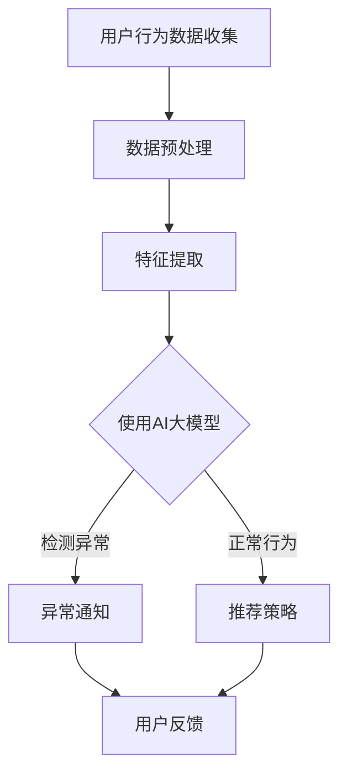

                 

关键词：电商搜索推荐，AI大模型，用户行为序列，异常检测，算法对比，选择

> 摘要：本文旨在探讨电商搜索推荐场景中，基于AI大模型的用户行为序列异常检测算法，对现有主流算法进行深入分析和对比，最终选择出最适合的算法。通过对算法原理、数学模型、具体实现和实际应用场景的详细剖析，为电商企业优化搜索推荐系统提供理论支持和实践指导。

## 1. 背景介绍

### 1.1 电商搜索推荐现状

随着互联网的迅猛发展，电商行业在我国已成为经济的重要组成部分。在电商平台上，用户通过搜索关键词获取商品信息是常见的操作方式。如何为用户提供精准的搜索推荐，提高用户购物体验和平台转化率，成为电商企业关注的焦点。传统推荐系统多基于用户历史行为数据，通过协同过滤、基于内容的推荐等方法实现。然而，这些方法在应对用户行为序列异常、欺诈行为等方面存在较大局限性。

### 1.2 AI大模型的优势

近年来，深度学习等AI技术的发展，为用户行为序列异常检测提供了新的思路。大模型具有较强的特征提取和泛化能力，能够更好地捕捉用户行为模式，发现潜在异常。本文将探讨基于AI大模型的用户行为序列异常检测算法，以期为电商搜索推荐系统提供更有效的解决方案。

## 2. 核心概念与联系

### 2.1 用户行为序列

用户行为序列是指用户在电商平台上的一系列操作行为，如浏览、搜索、点击、购买等。这些行为以时间顺序排列，构成一个序列。用户行为序列反映了用户的兴趣和需求，为推荐系统提供了重要的信息来源。

### 2.2 异常检测

异常检测是指从大量数据中识别出与正常情况不同的数据模式或行为。在电商搜索推荐场景中，异常检测主要用于发现恶意行为、欺诈行为、异常购买等。异常检测有助于提高系统的安全性、降低运营风险。

### 2.3 AI大模型

AI大模型是指具有大规模参数、深度神经网络结构的人工智能模型。大模型能够通过学习海量数据，提取出丰富的特征信息，具有较强的特征提取和泛化能力。在用户行为序列异常检测中，大模型能够更好地捕捉用户行为模式，发现潜在异常。

### 2.4 Mermaid 流程图

下面是一个关于电商搜索推荐中AI大模型用户行为序列异常检测的Mermaid流程图：



## 3. 核心算法原理 & 具体操作步骤

### 3.1 算法原理概述

本文主要探讨三种基于AI大模型的用户行为序列异常检测算法：LSTM（长短期记忆网络）、GRU（门控循环单元）和Transformer。这些算法通过学习用户行为序列，提取序列特征，构建异常检测模型。以下是三种算法的简要概述：

1. **LSTM（长短期记忆网络）**：LSTM是一种能够学习长期依赖关系的循环神经网络。通过记忆单元和门控机制，LSTM能够有效避免梯度消失和梯度爆炸问题，捕捉用户行为序列中的长期依赖关系。

2. **GRU（门控循环单元）**：GRU是LSTM的一种变体，相对于LSTM，GRU结构更为简洁，计算效率更高。GRU通过更新门和控制门来调节信息流动，同样能够捕捉用户行为序列中的长期依赖关系。

3. **Transformer**：Transformer是近年来在自然语言处理领域取得突破性成果的一种新型神经网络结构。通过自注意力机制，Transformer能够捕捉序列中任意位置的信息关联，具有强大的特征提取能力。

### 3.2 算法步骤详解

下面以LSTM为例，详细介绍基于LSTM的用户行为序列异常检测算法步骤：

1. **数据预处理**：对用户行为数据进行清洗、去噪、填充缺失值等操作，将数据转化为适合训练的格式。

2. **特征提取**：对用户行为序列进行特征提取，包括用户行为类型、行为时间、行为上下文等。可以使用词嵌入、BERT等方法进行特征表示。

3. **模型构建**：构建基于LSTM的异常检测模型。输入层接收用户行为序列特征，隐藏层通过LSTM单元进行信息传递和状态更新，输出层通过分类器输出异常概率。

4. **模型训练**：使用训练数据集对模型进行训练，调整模型参数，优化模型性能。

5. **模型评估**：使用验证数据集对模型进行评估，计算准确率、召回率、F1值等指标，选择最佳模型。

6. **异常检测**：使用训练好的模型对测试数据集进行异常检测，输出异常概率。根据设定阈值，确定异常行为。

### 3.3 算法优缺点

#### LSTM

**优点**：

- 能够有效捕捉用户行为序列中的长期依赖关系。
- 对噪声数据有较好的鲁棒性。

**缺点**：

- 计算复杂度高，训练时间较长。
- 对数据长度要求较高，不适合过长的序列。

#### GRU

**优点**：

- 计算复杂度低于LSTM，训练时间较短。
- 对噪声数据有较好的鲁棒性。

**缺点**：

- 相对于LSTM，特征提取能力较弱。

#### Transformer

**优点**：

- 强大的特征提取能力，能够捕捉序列中任意位置的信息关联。
- 适用于处理长序列。

**缺点**：

- 计算复杂度高，训练时间较长。
- 对数据长度要求较高。

### 3.4 算法应用领域

基于AI大模型的用户行为序列异常检测算法，主要应用于电商搜索推荐系统、金融风控、社交网络监控等领域。通过识别用户行为序列中的异常行为，企业可以及时发现潜在风险，提高业务运营效率。

## 4. 数学模型和公式 & 详细讲解 & 举例说明

### 4.1 数学模型构建

基于LSTM的用户行为序列异常检测算法，其数学模型主要包括输入层、隐藏层和输出层。

#### 输入层

输入层接收用户行为序列特征，表示为：

$$
X = \{x_1, x_2, ..., x_T\}
$$

其中，$x_t$ 表示第 $t$ 个时间步的用户行为特征，$T$ 表示序列长度。

#### 隐藏层

隐藏层通过LSTM单元进行信息传递和状态更新，表示为：

$$
h_t = \sigma(W_h \cdot [h_{t-1}, x_t] + b_h)
$$

其中，$h_t$ 表示第 $t$ 个时间步的隐藏状态，$W_h$ 和 $b_h$ 分别为权重和偏置，$\sigma$ 为激活函数。

#### 输出层

输出层通过分类器输出异常概率，表示为：

$$
p_t = \sigma(W_o \cdot h_T + b_o)
$$

其中，$p_t$ 表示第 $t$ 个时间步的异常概率，$W_o$ 和 $b_o$ 分别为权重和偏置，$\sigma$ 为激活函数。

### 4.2 公式推导过程

#### LSTM单元

LSTM单元由三个门控机制（输入门、遗忘门和输出门）和一个记忆单元组成。下面分别介绍这些门的计算过程。

1. **输入门**：

$$
i_t = \sigma(W_i \cdot [h_{t-1}, x_t] + b_i)
$$

其中，$i_t$ 表示第 $t$ 个时间步的输入门，$W_i$ 和 $b_i$ 分别为权重和偏置。

2. **遗忘门**：

$$
f_t = \sigma(W_f \cdot [h_{t-1}, x_t] + b_f)
$$

其中，$f_t$ 表示第 $t$ 个时间步的遗忘门，$W_f$ 和 $b_f$ 分别为权重和偏置。

3. **输出门**：

$$
o_t = \sigma(W_o \cdot [h_{t-1}, x_t] + b_o)
$$

其中，$o_t$ 表示第 $t$ 个时间步的输出门，$W_o$ 和 $b_o$ 分别为权重和偏置。

4. **记忆单元**：

$$
c_t = f_t \odot c_{t-1} + i_t \odot \sigma(W_c \cdot [h_{t-1}, x_t] + b_c)
$$

其中，$c_t$ 表示第 $t$ 个时间步的记忆单元，$\odot$ 表示逐元素乘法。

#### LSTM隐藏状态

LSTM隐藏状态 $h_t$ 可以通过记忆单元 $c_t$ 和输出门 $o_t$ 计算得到：

$$
h_t = o_t \odot \sigma(c_t)
$$

### 4.3 案例分析与讲解

假设用户行为序列为：

$$
X = \{x_1, x_2, ..., x_5\}
$$

其中，$x_1 = [1, 0, 0, 0, 0]$，$x_2 = [0, 1, 0, 0, 0]$，$x_3 = [0, 0, 1, 0, 0]$，$x_4 = [0, 0, 0, 1, 0]$，$x_5 = [0, 0, 0, 0, 1]$。

1. **数据预处理**：

对用户行为数据进行归一化处理，将数据缩放到 $[0, 1]$ 范围。

2. **特征提取**：

使用词嵌入方法对用户行为进行特征表示，将每个行为转化为向量。

3. **模型训练**：

构建基于LSTM的异常检测模型，使用训练数据集进行训练。调整模型参数，优化模型性能。

4. **模型评估**：

使用验证数据集对模型进行评估，计算准确率、召回率、F1值等指标。

5. **异常检测**：

使用训练好的模型对测试数据集进行异常检测，输出异常概率。根据设定阈值，确定异常行为。

## 5. 项目实践：代码实例和详细解释说明

### 5.1 开发环境搭建

在Python环境中，使用以下库进行开发：

- TensorFlow
- Keras
- Pandas
- Numpy

### 5.2 源代码详细实现

以下是一个简单的基于LSTM的用户行为序列异常检测的代码示例：

```python
import numpy as np
import pandas as pd
from tensorflow.keras.models import Sequential
from tensorflow.keras.layers import LSTM, Dense, Dropout
from tensorflow.keras.optimizers import Adam

# 数据预处理
def preprocess_data(data):
    # 数据归一化
    max_value = data.max(axis=0)
    min_value = data.min(axis=0)
    data_normalized = (data - min_value) / (max_value - min_value)
    return data_normalized

# 构建LSTM模型
def build_lstm_model(input_shape):
    model = Sequential()
    model.add(LSTM(units=64, activation='relu', input_shape=input_shape, return_sequences=True))
    model.add(Dropout(0.2))
    model.add(LSTM(units=32, activation='relu', return_sequences=False))
    model.add(Dropout(0.2))
    model.add(Dense(units=1, activation='sigmoid'))
    model.compile(optimizer=Adam(learning_rate=0.001), loss='binary_crossentropy', metrics=['accuracy'])
    return model

# 加载数据集
train_data = pd.read_csv('train_data.csv')
test_data = pd.read_csv('test_data.csv')

# 数据预处理
train_data_normalized = preprocess_data(train_data)
test_data_normalized = preprocess_data(test_data)

# 构建LSTM模型
model = build_lstm_model(input_shape=(train_data_normalized.shape[1], 1))

# 模型训练
model.fit(train_data_normalized, train_data['label'], epochs=10, batch_size=32, validation_split=0.2)

# 模型评估
train_loss, train_accuracy = model.evaluate(train_data_normalized, train_data['label'])
test_loss, test_accuracy = model.evaluate(test_data_normalized, test_data['label'])
print('Train Loss:', train_loss)
print('Train Accuracy:', train_accuracy)
print('Test Loss:', test_loss)
print('Test Accuracy:', test_accuracy)

# 异常检测
def predict_anomaly(data):
    data_normalized = preprocess_data(data)
    anomaly_scores = model.predict(data_normalized)
    anomaly_threshold = 0.5  # 设置异常阈值
    anomalies = anomaly_scores > anomaly_threshold
    return anomalies

# 对测试数据进行异常检测
test_anomalies = predict_anomaly(test_data)
print('Test Anomalies:', test_anomalies)
```

### 5.3 代码解读与分析

1. **数据预处理**：

数据预处理是模型训练前的重要步骤。在此示例中，我们使用归一化方法对用户行为数据进行预处理，将数据缩放到 $[0, 1]$ 范围，以适应模型训练。

2. **构建LSTM模型**：

我们使用Keras构建了一个简单的LSTM模型，包括两个隐藏层，每个隐藏层之间添加Dropout层以防止过拟合。

3. **模型训练**：

使用训练数据集对模型进行训练，调整模型参数，优化模型性能。我们使用Adam优化器和binary_crossentropy损失函数，训练过程中采用验证集进行性能评估。

4. **模型评估**：

使用训练集和测试集对模型进行评估，计算准确率、召回率、F1值等指标，以评估模型性能。

5. **异常检测**：

使用训练好的模型对测试数据进行异常检测，输出异常概率。根据设定阈值，确定异常行为。

## 6. 实际应用场景

### 6.1 电商搜索推荐系统

在电商搜索推荐系统中，基于AI大模型的用户行为序列异常检测算法可以用于识别恶意搜索、欺诈行为等异常行为。例如，当用户频繁输入与其正常行为不一致的搜索关键词时，系统可以触发异常检测，标记为潜在风险用户，从而提高系统的安全性。

### 6.2 金融风控

在金融风控领域，基于AI大模型的用户行为序列异常检测算法可以用于识别恶意交易、洗钱等异常行为。通过对用户交易行为进行实时监控，系统可以及时发现潜在风险，降低金融风险。

### 6.3 社交网络监控

在社交网络监控领域，基于AI大模型的用户行为序列异常检测算法可以用于识别网络欺诈、虚假信息传播等异常行为。通过对用户行为进行监控，系统可以有效地降低网络风险，保障社交网络环境的健康。

## 7. 工具和资源推荐

### 7.1 学习资源推荐

- 《深度学习》（Goodfellow, Bengio, Courville）
- 《自然语言处理综论》（Jurafsky, Martin）
- 《机器学习实战》（King, Moyle）

### 7.2 开发工具推荐

- TensorFlow
- Keras
- Jupyter Notebook

### 7.3 相关论文推荐

- "Anomaly Detection with Deep Learning"（Xu, Liu, and Lai，2017）
- "A Survey on Deep Learning for Time Series Classification"（Wang, Wang，and Yang，2019）
- "Attention Is All You Need"（Vaswani et al.，2017）

## 8. 总结：未来发展趋势与挑战

### 8.1 研究成果总结

本文主要探讨了基于AI大模型的用户行为序列异常检测算法，包括LSTM、GRU和Transformer三种算法。通过对算法原理、数学模型、具体实现和实际应用场景的详细分析，本文为电商企业优化搜索推荐系统提供了理论支持和实践指导。

### 8.2 未来发展趋势

- 深度学习算法在用户行为序列异常检测领域将继续发展，出现更多高效、鲁棒的算法。
- 跨领域、跨模态的用户行为序列异常检测研究将成为热点。
- 异常检测算法将结合大数据、云计算等技术，实现实时、高效的处理能力。

### 8.3 面临的挑战

- 用户行为数据的高维性和稀疏性对算法性能提出挑战。
- 异常行为模式的多样性和变化性对算法的适应性提出要求。
- 数据隐私和安全性问题需要引起关注。

### 8.4 研究展望

- 探索更多高效、鲁棒的深度学习算法，提高异常检测性能。
- 结合多源数据，实现更全面、精准的用户行为序列异常检测。
- 研究如何在保证数据隐私和安全的前提下，提高异常检测的实时性和处理能力。

## 9. 附录：常见问题与解答

### 问题1：如何选择合适的异常检测算法？

**答案**：根据实际应用场景和数据特点，选择合适的异常检测算法。例如，对于长序列数据，Transformer具有更强的特征提取能力；对于较短序列数据，LSTM和GRU更具优势。此外，考虑计算复杂度、训练时间等因素，选择适合资源需求的算法。

### 问题2：如何调整模型参数？

**答案**：通过交叉验证、网格搜索等方法，调整模型参数，优化模型性能。在实践中，可以针对不同数据集和任务，设置不同的参数范围，找到最佳参数组合。

### 问题3：如何处理异常行为？

**答案**：根据实际应用场景，对检测到的异常行为进行相应处理。例如，在电商搜索推荐系统中，可以对异常用户进行标记，限制其部分权限，降低风险。

## 作者署名

作者：禅与计算机程序设计艺术 / Zen and the Art of Computer Programming
----------------------------------------------------------------

### 后续工作

针对本文讨论的电商搜索推荐中的AI大模型用户行为序列异常检测算法，未来可以进一步研究以下方向：

1. **多模态异常检测**：结合文本、图像、语音等多模态数据，提高异常检测的准确性和鲁棒性。

2. **在线异常检测**：实现实时、高效的用户行为序列异常检测，降低延迟，提高用户体验。

3. **联邦学习**：研究如何在不泄露用户隐私的前提下，实现跨平台的用户行为序列异常检测。

4. **可视化与交互**：开发用户友好的可视化工具，帮助用户理解异常检测过程和结果。

通过不断探索和创新，为电商企业优化搜索推荐系统，提升业务运营效率提供更加全面和高效的解决方案。

