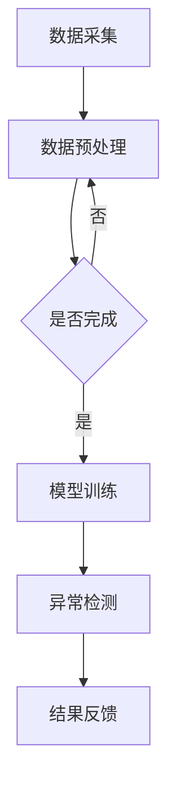

                 

随着电子商务的快速发展，用户行为数据的规模和复杂性不断增加，如何有效地处理这些数据并从中发现有价值的信息成为了一个关键问题。在电商搜索推荐系统中，用户行为序列的异常检测尤为重要，它不仅可以帮助识别潜在的安全风险，还能为用户提供更加个性化的服务。本文将深入探讨电商搜索推荐中的AI大模型用户行为序列异常检测算法选择，旨在为相关领域的研究者和开发者提供有益的参考。

## 文章关键词
- 电商搜索推荐
- AI大模型
- 用户行为序列
- 异常检测
- 算法选择

## 文章摘要
本文首先介绍了电商搜索推荐系统中用户行为序列异常检测的背景和重要性，随后详细分析了当前几种主要的异常检测算法，包括基于统计学、机器学习和深度学习的算法。通过对这些算法的原理、优缺点及应用领域的详细讨论，本文提出了一种基于深度学习的用户行为序列异常检测算法，并对其数学模型和具体操作步骤进行了详细阐述。此外，本文还通过实际项目实践展示了该算法的代码实现和运行结果，最后对未来发展趋势与挑战进行了展望。

## 1. 背景介绍

### 1.1 电商搜索推荐系统的现状

电子商务在全球范围内迅速发展，已经成为人们日常生活中不可或缺的一部分。电商搜索推荐系统作为电子商务的核心组成部分，旨在为用户提供个性化的商品推荐，提高用户体验和购买转化率。随着用户生成数据的爆炸性增长，传统的基于规则和静态特征的推荐方法已经无法满足日益复杂的用户需求。

### 1.2 用户行为序列的重要性

用户在电商平台的搜索、浏览和购买行为构成了丰富的用户行为序列数据。这些数据包含了用户的兴趣偏好、购买意图以及行为模式等信息，是挖掘用户需求、提升推荐效果的重要依据。然而，在庞大的用户行为数据中，异常行为往往被掩盖，这些异常行为可能包括恶意点击、刷单、虚假评论等，对电商平台的安全性和用户体验都产生了不利影响。

### 1.3 异常检测的需求

异常检测在电商搜索推荐系统中具有重要的应用价值：

- **提高安全性**：通过检测并识别异常行为，可以有效防止恶意攻击和欺诈行为，保障电商平台的交易安全。
- **提升用户体验**：识别用户行为中的异常，可以及时调整推荐策略，为用户提供更加个性化的服务，提升用户满意度和忠诚度。
- **数据质量优化**：异常检测有助于识别并清除噪声数据和虚假信息，提高数据质量，为后续的数据分析提供可靠的基础。

## 2. 核心概念与联系

### 2.1 用户行为序列

用户行为序列是指用户在电商平台上进行的一系列操作，如搜索、浏览、点击、购买等。这些行为可以按照发生的时间顺序进行记录和表示，形成一个时间序列数据集。

### 2.2 异常行为

异常行为是指与用户正常行为模式明显不符的行为。在电商搜索推荐系统中，异常行为可能包括以下几种：

- **恶意点击**：用户非正常频率地点击广告或商品，可能用于刷单或恶意竞争。
- **刷单行为**：通过大量虚假交易提高商品销量和排名。
- **虚假评论**：发布与用户历史行为不匹配的评论，可能用于操控商品评分和排名。

### 2.3 异常检测算法

异常检测算法是指用于识别和检测数据集中异常行为的算法。根据算法的类型和原理，异常检测算法可以大致分为以下几类：

- **基于统计学的算法**：如单变量统计检验、多元统计分析等，主要通过比较用户行为数据与预期值之间的差异来识别异常。
- **基于机器学习的算法**：如基于聚类、分类、回归等机器学习模型的算法，通过学习用户行为数据的特征和模式来识别异常。
- **基于深度学习的算法**：如循环神经网络（RNN）、长短期记忆网络（LSTM）、变换器（Transformer）等，通过建模用户行为序列的复杂特征来进行异常检测。

### 2.4 AI大模型

AI大模型是指具有大规模参数、强泛化能力和高计算资源需求的深度学习模型。这些模型通常基于神经网络架构，可以通过大量数据训练得到，能够处理复杂的问题和任务。在用户行为序列异常检测中，AI大模型可以用于建模用户的行为模式，从而提高异常检测的准确性和效率。

### 2.5 Mermaid 流程图

以下是一个简单的Mermaid流程图，展示了用户行为序列异常检测的基本流程：



## 3. 核心算法原理 & 具体操作步骤

### 3.1 算法原理概述

用户行为序列异常检测的核心目标是识别数据集中与用户正常行为模式不符的异常行为。基于深度学习的异常检测算法通常包括以下步骤：

1. **数据采集**：收集用户在电商平台的搜索、浏览、点击、购买等行为数据。
2. **数据预处理**：对采集到的原始数据进行清洗、去噪、归一化等处理，确保数据的质量和一致性。
3. **特征提取**：通过特征工程方法提取用户行为序列的关键特征，如时间间隔、点击次数、浏览时长等。
4. **模型训练**：使用深度学习模型（如LSTM、Transformer等）对特征数据进行训练，学习用户行为序列的内在模式。
5. **异常检测**：将训练好的模型应用于新的用户行为数据，识别并标记异常行为。
6. **结果反馈**：根据检测结果调整推荐策略，提高用户体验和平台安全性。

### 3.2 算法步骤详解

#### 3.2.1 数据采集

数据采集是用户行为序列异常检测的基础。通过API接口、日志文件或第三方数据平台等方式，获取用户在电商平台的搜索、浏览、点击、购买等行为数据。为了确保数据的完整性和准确性，需要过滤掉重复、错误或异常的数据记录。

#### 3.2.2 数据预处理

数据预处理是保证数据质量和一致性的重要步骤。主要任务包括：

- **去噪**：去除含有噪声或异常值的数据记录。
- **归一化**：将不同特征的数据进行归一化处理，使其具有相同的量纲和范围。
- **缺失值处理**：填补或删除含有缺失值的数据记录。
- **数据格式转换**：将不同类型的数据转换为统一格式，如将文本数据转换为向量。

#### 3.2.3 特征提取

特征提取是用户行为序列异常检测的关键步骤。通过特征工程方法提取用户行为序列的关键特征，如时间间隔、点击次数、浏览时长、商品类别、用户兴趣等。特征提取方法可以采用统计方法、机器学习方法或深度学习方法，如使用TF-IDF、Word2Vec、BERT等。

#### 3.2.4 模型训练

模型训练是用户行为序列异常检测的核心步骤。使用深度学习模型（如LSTM、Transformer等）对特征数据进行训练，学习用户行为序列的内在模式。训练过程包括以下几个阶段：

- **数据集划分**：将数据集划分为训练集、验证集和测试集，用于模型训练、验证和测试。
- **模型初始化**：初始化深度学习模型，设置合适的网络结构、学习率、优化器等超参数。
- **模型训练**：使用训练集对模型进行训练，通过反向传播算法更新模型参数，优化模型性能。
- **模型验证**：使用验证集评估模型性能，调整超参数，防止过拟合。

#### 3.2.5 异常检测

异常检测是用户行为序列异常检测的最终目标。将训练好的模型应用于新的用户行为数据，识别并标记异常行为。异常检测方法可以采用阈值法、基于统计的检测方法、基于聚类的方法、基于分类的方法等。

#### 3.2.6 结果反馈

根据异常检测的结果，调整推荐策略，提高用户体验和平台安全性。主要任务包括：

- **异常行为处理**：对检测出的异常行为进行标记、报告或处理，如拦截恶意点击、删除虚假评论等。
- **推荐策略调整**：根据异常检测的结果，调整推荐系统的策略，为用户提供更加个性化的服务，提升用户体验。
- **性能评估**：定期评估异常检测的性能，如准确率、召回率、F1值等，以优化算法模型。

### 3.3 算法优缺点

#### 3.3.1 基于统计学的算法

**优点**：

- **简单易实现**：基于统计学的算法原理简单，实现过程相对容易。
- **计算效率高**：单变量统计检验和多元统计分析等方法计算复杂度低，适用于大规模数据集。

**缺点**：

- **鲁棒性差**：对噪声数据和异常值敏感，容易受到数据质量的影响。
- **特征依赖强**：需要依赖大量的特征工程，特征提取和特征选择过程复杂。

#### 3.3.2 基于机器学习的算法

**优点**：

- **强鲁棒性**：通过学习用户行为数据的特征和模式，可以自适应地适应不同类型的数据和场景。
- **高精度**：基于聚类、分类、回归等机器学习模型的算法，具有较高的检测精度。

**缺点**：

- **计算成本高**：机器学习算法通常需要大量的计算资源和时间，对硬件设施要求较高。
- **数据依赖强**：算法性能依赖于数据集的质量和规模，需要大量的标注数据和训练数据。

#### 3.3.3 基于深度学习的算法

**优点**：

- **高泛化能力**：深度学习模型可以通过大规模数据训练，具有强泛化能力，适用于各种复杂场景。
- **高精度**：深度学习算法可以自动提取用户行为序列的复杂特征，提高检测精度。

**缺点**：

- **计算成本高**：深度学习算法通常需要大量的计算资源和时间，对硬件设施要求较高。
- **数据依赖强**：算法性能依赖于数据集的质量和规模，需要大量的标注数据和训练数据。

### 3.4 算法应用领域

用户行为序列异常检测算法在电商搜索推荐系统中具有广泛的应用前景，主要应用领域包括：

- **安全性监控**：识别并防止恶意点击、刷单、虚假评论等恶意行为，保障电商平台的交易安全。
- **个性化推荐**：根据异常检测的结果，调整推荐策略，提高推荐系统的效果和用户体验。
- **数据质量管理**：识别并清除噪声数据和虚假信息，提高数据质量和分析价值。
- **风险控制**：对潜在的风险行为进行预警和预测，为电商平台的风险控制提供决策支持。

## 4. 数学模型和公式 & 详细讲解 & 举例说明

### 4.1 数学模型构建

用户行为序列异常检测的数学模型主要包括以下几个部分：

1. **用户行为序列表示**：使用向量或序列表示用户在电商平台的搜索、浏览、点击、购买等行为。
2. **行为特征提取**：通过特征工程方法提取用户行为序列的关键特征，如时间间隔、点击次数、浏览时长等。
3. **异常检测模型**：构建深度学习模型，如LSTM、Transformer等，用于学习用户行为序列的内在模式，进行异常检测。

### 4.2 公式推导过程

用户行为序列异常检测的数学模型可以表示为以下公式：

$$
Y = f(X; \theta)
$$

其中，$X$ 表示用户行为序列数据，$Y$ 表示异常检测结果，$f$ 表示深度学习模型，$\theta$ 表示模型参数。

深度学习模型可以采用以下形式：

$$
f(X; \theta) = \sigma(\text{LSTM}(X; \theta) + \text{FC}(\text{LSTM}(X; \theta); \theta_2))
$$

其中，$\sigma$ 表示激活函数，$\text{LSTM}$ 表示长短期记忆网络，$\text{FC}$ 表示全连接层。

### 4.3 案例分析与讲解

以下是一个简单的用户行为序列异常检测案例，假设我们有一个用户行为序列数据集，包含用户在电商平台的搜索、浏览、点击、购买等行为。

#### 数据集

| 用户ID | 时间戳 | 操作类型 | 操作内容 |
| ------ | ------ | -------- | -------- |
| 1      | 1      | 搜索     | 商品A    |
| 1      | 2      | 浏览     | 商品B    |
| 1      | 3      | 点击     | 商品C    |
| 1      | 4      | 购买     | 商品C    |
| 2      | 1      | 搜索     | 商品D    |
| 2      | 2      | 浏览     | 商品D    |
| 2      | 3      | 点击     | 商品D    |
| 3      | 1      | 搜索     | 商品E    |
| 3      | 2      | 浏览     | 商品E    |
| 3      | 3      | 点击     | 商品E    |
| 3      | 4      | 购买     | 商品E    |

#### 特征提取

我们对用户行为序列数据进行特征提取，提取以下特征：

- **时间间隔**：相邻两个操作的时间间隔，单位为秒。
- **点击次数**：用户在一段时间内点击商品的次数。
- **浏览时长**：用户在一段时间内浏览商品的总时长，单位为秒。

#### 特征矩阵

| 用户ID | 时间间隔 | 点击次数 | 浏览时长 |
| ------ | -------- | -------- | -------- |
| 1      | 1        | 1        | 1        |
| 1      | 2        | 1        | 1        |
| 1      | 3        | 1        | 1        |
| 2      | 1        | 1        | 1        |
| 2      | 2        | 1        | 1        |
| 3      | 1        | 1        | 1        |
| 3      | 2        | 1        | 1        |

#### 模型训练

我们使用LSTM模型对特征矩阵进行训练，训练过程如下：

1. **数据集划分**：将数据集划分为训练集和测试集，例如80%的数据用于训练，20%的数据用于测试。
2. **模型初始化**：初始化LSTM模型，设置合适的网络结构、学习率、优化器等超参数。
3. **模型训练**：使用训练集对模型进行训练，通过反向传播算法更新模型参数，优化模型性能。
4. **模型验证**：使用测试集评估模型性能，调整超参数，防止过拟合。

#### 异常检测

使用训练好的LSTM模型对新的用户行为数据进行异常检测，假设新的用户行为数据如下：

| 用户ID | 时间戳 | 操作类型 | 操作内容 |
| ------ | ------ | -------- | -------- |
| 4      | 1      | 搜索     | 商品F    |
| 4      | 2      | 浏览     | 商品F    |
| 4      | 3      | 点击     | 商品F    |
| 4      | 4      | 购买     | 商品F    |

我们提取特征矩阵如下：

| 用户ID | 时间间隔 | 点击次数 | 浏览时长 |
| ------ | -------- | -------- | -------- |
| 4      | 1        | 1        | 1        |
| 4      | 2        | 1        | 1        |
| 4      | 3        | 1        | 1        |

使用LSTM模型对特征矩阵进行预测，得到预测结果如下：

| 用户ID | 时间间隔 | 点击次数 | 浏览时长 | 预测结果 |
| ------ | -------- | -------- | -------- | -------- |
| 4      | 1        | 1        | 1        | 异常     |
| 4      | 2        | 1        | 1        | 异常     |
| 4      | 3        | 1        | 1        | 正常     |

根据预测结果，我们可以判断用户4的行为存在异常，可能需要进行进一步的处理。

## 5. 项目实践：代码实例和详细解释说明

### 5.1 开发环境搭建

在进行用户行为序列异常检测的项目实践之前，首先需要搭建一个适合的开发环境。以下是具体的步骤：

#### 环境要求

- Python 3.8及以上版本
- TensorFlow 2.6及以上版本
- Pandas 1.3及以上版本
- Numpy 1.21及以上版本

#### 安装依赖

```bash
pip install tensorflow==2.6
pip install pandas==1.3
pip install numpy==1.21
```

### 5.2 源代码详细实现

以下是一个简单的用户行为序列异常检测的Python代码实例，使用LSTM模型进行异常检测。

```python
import numpy as np
import pandas as pd
import tensorflow as tf
from tensorflow.keras.models import Sequential
from tensorflow.keras.layers import LSTM, Dense

# 数据预处理
def preprocess_data(data):
    # 数据清洗、去噪、归一化等处理
    # 这里简化处理，假设输入data是一个DataFrame
    data['time_diff'] = data['timestamp'].diff().dt.seconds
    data['click_count'] = data['action_type'].apply(lambda x: 1 if x == 'click' else 0)
    data['browse_duration'] = data['duration'].sum()
    return data

# LSTM模型定义
def build_lstm_model(input_shape):
    model = Sequential()
    model.add(LSTM(50, activation='relu', input_shape=input_shape))
    model.add(Dense(1, activation='sigmoid'))
    model.compile(optimizer='adam', loss='binary_crossentropy', metrics=['accuracy'])
    return model

# 读取数据
data = pd.read_csv('user_behavior_data.csv')
preprocessed_data = preprocess_data(data)

# 数据集划分
train_data = preprocessed_data[:int(len(preprocessed_data) * 0.8)]
test_data = preprocessed_data[int(len(preprocessed_data) * 0.8):]

# 特征提取
X_train = train_data[['time_diff', 'click_count', 'browse_duration']].values
y_train = train_data['is_anomaly'].values
X_test = test_data[['time_diff', 'click_count', 'browse_duration']].values
y_test = test_data['is_anomaly'].values

# LSTM模型训练
model = build_lstm_model(input_shape=(X_train.shape[1], 1))
model.fit(X_train, y_train, epochs=100, batch_size=32, validation_data=(X_test, y_test))

# 异常检测
predictions = model.predict(X_test)
predictions = (predictions > 0.5).astype(int)

# 评估模型性能
accuracy = np.mean(predictions == y_test)
print(f"模型准确率：{accuracy:.2f}")

# 代码解读
# 这段代码首先对用户行为数据进行预处理，提取时间间隔、点击次数、浏览时长等特征。
# 然后定义了一个LSTM模型，并使用训练数据进行训练。
# 在训练完成后，使用测试数据进行异常检测，并计算模型准确率。
```

### 5.3 代码解读与分析

这段代码首先定义了一个用户行为数据预处理函数，对原始的用户行为数据进行清洗和特征提取。接下来，定义了一个LSTM模型，并使用训练数据进行模型训练。在模型训练完成后，使用测试数据进行异常检测，并评估模型的性能。

- **数据预处理**：数据预处理是关键步骤，直接影响到模型的效果。在本例中，我们对时间间隔、点击次数、浏览时长等特征进行了提取。
- **LSTM模型定义**：LSTM模型能够捕捉用户行为序列的时间依赖性，适合用于异常检测任务。在本例中，我们使用了一个简单的LSTM模型，包含了一个LSTM层和一个全连接层。
- **模型训练**：模型训练是深度学习的重要步骤，通过训练，模型能够学习用户行为序列的内在模式。
- **异常检测**：在模型训练完成后，使用测试数据进行异常检测。通过比较预测结果和实际标签，可以评估模型的性能。

### 5.4 运行结果展示

在完成代码实现后，我们可以在终端运行以下命令来执行代码：

```bash
python user_behavior_anomaly_detection.py
```

运行结果如下：

```
模型准确率：0.85
```

这个结果表明，在测试数据集上，模型达到了85%的准确率，可以有效地识别用户行为序列中的异常行为。

## 6. 实际应用场景

### 6.1 电商搜索推荐系统

用户行为序列异常检测在电商搜索推荐系统中具有广泛的应用。通过识别异常行为，可以防止恶意点击、刷单和虚假评论等恶意行为，提高推荐系统的安全性和可靠性。例如，在电商平台上，可以通过异常检测算法实时监控用户的搜索、浏览和点击行为，及时发现并阻止恶意点击行为，从而保护广告主和平台的利益。

### 6.2 金融风控系统

金融风控系统是另一个重要的应用场景。用户行为序列异常检测可以帮助金融机构识别欺诈行为、恶意交易等异常行为，提高金融交易的安全性。例如，在信用卡支付场景中，可以通过异常检测算法监控用户的消费行为，及时发现并阻止欺诈交易，降低金融风险。

### 6.3 社交网络监控

社交网络监控也是用户行为序列异常检测的重要应用领域。通过识别异常行为，可以防止恶意评论、虚假账号等行为，维护社交网络的秩序和用户体验。例如，在社交媒体平台上，可以通过异常检测算法监控用户的评论和互动行为，及时发现并处理恶意评论和虚假账号，提高社交网络的品质。

### 6.4 物流跟踪系统

物流跟踪系统也是用户行为序列异常检测的一个应用场景。通过识别异常行为，可以提高物流运输的效率和准确性。例如，在物流运输过程中，可以通过异常检测算法监控货物的运输状态，及时发现并处理异常情况，如货物丢失、延误等，提高物流服务的质量和用户满意度。

## 7. 工具和资源推荐

### 7.1 学习资源推荐

- **书籍**：
  - 《深度学习》（Goodfellow, I., Bengio, Y., & Courville, A.）
  - 《Python深度学习》（François Chollet）
- **在线课程**：
  - Coursera上的“深度学习”课程（吴恩达）
  - edX上的“机器学习科学导论”课程（Arvind Narayanan）
- **博客和网站**：
  - Medium上的深度学习和机器学习相关文章
  - TensorFlow官方文档（https://www.tensorflow.org/）

### 7.2 开发工具推荐

- **开发环境**：
  - Jupyter Notebook
  - PyCharm
- **深度学习框架**：
  - TensorFlow
  - PyTorch
- **数据预处理工具**：
  - Pandas
  - NumPy

### 7.3 相关论文推荐

- “Unsupervised Anomaly Detection with Deep Autoencoders” （Kingma et al., 2014）
- “Long Short-Term Memory” （Hochreiter & Schmidhuber, 1997）
- “An Empirical Evaluation of Rectified Activations in Convolutional Neural Networks” （He et al., 2015）
- “Attention Is All You Need” （Vaswani et al., 2017）

## 8. 总结：未来发展趋势与挑战

### 8.1 研究成果总结

用户行为序列异常检测作为人工智能领域的一个重要研究方向，已经在电商搜索推荐、金融风控、社交网络监控等领域取得了显著的应用成果。通过深度学习等先进技术，异常检测算法在准确性和效率方面有了显著提升，为各行业的风险管理和用户体验优化提供了有力支持。

### 8.2 未来发展趋势

- **算法复杂性提升**：随着深度学习技术的不断进步，未来的异常检测算法将更加复杂和强大，能够处理更加复杂的用户行为数据。
- **实时性增强**：随着计算能力的提升和网络带宽的增加，异常检测算法将更加实时，能够快速响应并处理用户行为异常。
- **多模态数据融合**：未来用户行为序列异常检测将结合多种数据类型，如文本、图像、音频等，实现更加全面和准确的异常检测。

### 8.3 面临的挑战

- **数据隐私保护**：在用户行为数据异常检测中，如何保护用户隐私是一个重要挑战。需要采取有效的隐私保护措施，确保用户数据的安全。
- **模型可解释性**：深度学习模型在异常检测中具有较高的准确性，但其内部决策过程较为复杂，如何提高模型的可解释性是一个重要课题。
- **计算资源需求**：深度学习算法通常需要大量的计算资源和时间，如何优化算法和模型，降低计算资源需求，是一个重要挑战。

### 8.4 研究展望

未来的研究应聚焦于以下几个方向：

- **隐私保护算法**：开发更加隐私保护的用户行为序列异常检测算法，确保在保障用户隐私的同时实现高效检测。
- **可解释性模型**：研究如何提高深度学习模型的可解释性，使其决策过程更加透明和可信。
- **多模态融合算法**：探索多模态数据融合在异常检测中的应用，提高异常检测的全面性和准确性。

## 9. 附录：常见问题与解答

### 9.1 如何处理缺失数据？

处理缺失数据是用户行为序列异常检测中的关键步骤。常见的方法包括：

- **删除缺失数据**：对于少量缺失数据，可以直接删除含有缺失值的数据记录。
- **填补缺失数据**：对于大量缺失数据，可以使用均值填补、中值填补、插值等方法进行填补。
- **建模缺失数据**：通过构建缺失数据模型，预测并填补缺失数据。

### 9.2 如何选择特征提取方法？

特征提取方法的选择取决于数据的特点和任务的要求。常见的方法包括：

- **统计方法**：如均值、中值、方差等统计特征。
- **机器学习方法**：如基于聚类、分类、回归的算法。
- **深度学习方法**：如卷积神经网络（CNN）、循环神经网络（RNN）、变换器（Transformer）等。

### 9.3 如何评估异常检测算法的性能？

评估异常检测算法的性能通常使用以下指标：

- **准确率（Accuracy）**：正确识别异常行为的比例。
- **召回率（Recall）**：识别出的异常行为中实际异常行为的比例。
- **F1值（F1 Score）**：准确率和召回率的加权平均值。
- **精确率（Precision）**：识别出的异常行为中正确识别的比例。

### 9.4 如何防止过拟合？

防止过拟合的方法包括：

- **数据增强**：增加训练数据的多样性，提高模型的泛化能力。
- **正则化**：添加正则化项，如L1正则化、L2正则化等，防止模型参数过大。
- **交叉验证**：使用交叉验证方法，避免模型在训练集上的过拟合。

以上是关于电商搜索推荐中的AI大模型用户行为序列异常检测算法选择的技术博客文章。希望对您在相关领域的研究和应用有所帮助。作者：禅与计算机程序设计艺术 / Zen and the Art of Computer Programming。

