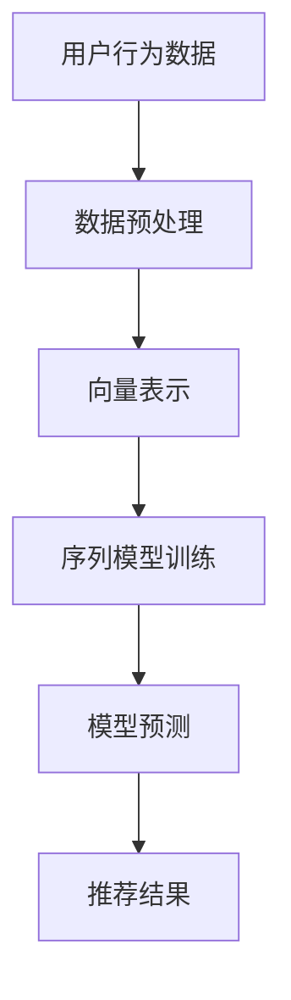

                 

关键词：电商搜索推荐、AI大模型、用户行为序列、表征学习技术、深度学习、序列模型、向量表示

摘要：随着互联网和电子商务的快速发展，个性化推荐系统已成为电商行业提高用户满意度和销售转化率的重要手段。本文将探讨基于AI大模型的用户行为序列表征学习技术，分析其在电商搜索推荐系统中的应用，并提出一种高效的算法框架和实现方法。文章旨在为相关领域的研究者和从业者提供参考和启示，推动电商搜索推荐技术的进步。

## 1. 背景介绍

1.1 电商搜索推荐的重要性

电商搜索推荐系统是电子商务平台的核心组成部分，其目的是根据用户的浏览、购买等行为，为用户推荐相关商品，提升用户体验和销售转化率。随着用户行为的多样化和数据量的激增，传统的基于规则和基于内容的推荐方法已无法满足日益增长的需求，人工智能和深度学习技术逐渐成为解决这一问题的关键。

1.2 AI大模型的发展与应用

近年来，AI大模型（如BERT、GPT等）在自然语言处理、计算机视觉等领域取得了显著的成果。AI大模型通过预训练和微调，能够自动学习大量的知识，并在各种任务中表现出强大的性能。将AI大模型应用于电商搜索推荐，可以有效提高推荐的准确性和多样性。

1.3 用户行为序列表征学习技术的意义

用户行为序列表征学习技术旨在通过学习用户的历史行为序列，提取用户兴趣和需求，从而为用户推荐相关商品。本文将探讨基于AI大模型的用户行为序列表征学习技术，分析其在电商搜索推荐中的应用，并提出一种高效的算法框架和实现方法。

## 2. 核心概念与联系

2.1 用户行为序列

用户行为序列是指用户在电商平台上的一系列操作，如浏览、搜索、加入购物车、购买等。用户行为序列反映了用户对商品的兴趣和需求，是推荐系统的重要输入。

2.2 序列模型

序列模型是一种用于处理序列数据（如文本、时间序列等）的深度学习模型。常见的序列模型包括循环神经网络（RNN）、长短时记忆网络（LSTM）、门控循环单元（GRU）等。序列模型可以有效地捕捉序列数据中的时间和空间关系，提取序列特征。

2.3 向量表示

向量表示是一种将数据转换为向量的方法，使其可以在机器学习模型中进行处理。在电商搜索推荐中，用户行为序列可以通过向量表示，将原始数据转化为数值型特征，方便模型进行学习和预测。

2.4 AI大模型

AI大模型是一种通过大规模预训练和微调的深度学习模型，具有强大的表示和建模能力。常见的AI大模型包括BERT、GPT、T5等。AI大模型可以自动学习大量的知识，并在各种任务中表现出强大的性能。

### Mermaid 流程图



## 3. 核心算法原理 & 具体操作步骤

3.1 算法原理概述

本文提出了一种基于AI大模型的用户行为序列表征学习技术，其核心思想是通过AI大模型自动学习用户行为序列中的潜在特征，从而实现对用户的兴趣和需求的准确表征。具体流程如下：

1. 数据预处理：对用户行为数据（如浏览记录、搜索历史等）进行清洗、去重等操作，得到干净的用户行为序列。

2. 向量表示：将用户行为序列转换为向量表示，使其可以在深度学习模型中进行处理。

3. 序列模型训练：使用向量表示的用户行为序列数据，训练一个深度学习模型（如LSTM、GRU等），学习用户行为序列中的潜在特征。

4. 模型预测：将训练好的模型应用于新的用户行为序列，预测用户对商品的兴趣和需求。

5. 推荐结果：根据预测结果，为用户推荐相关商品。

3.2 算法步骤详解

1. 数据预处理

    a. 数据清洗：去除无效的用户行为数据，如重复、异常等。

    b. 序列构造：根据用户行为数据，构造用户行为序列。例如，可以将用户的浏览记录按时间顺序排列，形成一条序列。

    c. 序列裁剪：根据用户行为序列的长度和模型的要求，对序列进行裁剪，使其符合模型的输入要求。

2. 向量表示

    a. 词嵌入：使用预训练的词嵌入模型（如Word2Vec、GloVe等），将用户行为序列中的词语转换为向量表示。

    b. 序列编码：使用编码器（如LSTM、GRU等）对用户行为序列进行编码，得到序列的向量表示。

3. 序列模型训练

    a. 数据集划分：将用户行为序列数据划分为训练集和测试集。

    b. 模型训练：使用训练集数据，训练一个深度学习模型，学习用户行为序列中的潜在特征。

    c. 模型评估：使用测试集数据，评估模型的性能，如准确率、召回率等。

4. 模型预测

    a. 新用户行为序列：收集新用户的行为数据，构造用户行为序列。

    b. 序列编码：使用训练好的模型，对新的用户行为序列进行编码，得到序列的向量表示。

    c. 用户兴趣预测：使用序列向量表示，预测用户对商品的兴趣和需求。

5. 推荐结果

    a. 商品库查询：根据用户兴趣预测结果，查询相关商品库。

    b. 推荐结果生成：根据商品库查询结果，生成推荐列表，展示给用户。

3.3 算法优缺点

3.3.1 优点

1. 强大的表征能力：基于AI大模型的用户行为序列表征学习技术，可以自动学习用户行为序列中的潜在特征，提高推荐的准确性和多样性。

2. 通用性：该方法适用于多种用户行为序列数据，如浏览记录、搜索历史等，具有较好的通用性。

3. 高效性：采用深度学习模型，可以高效地处理大量用户行为数据，提高推荐系统的性能。

3.3.2 缺点

1. 计算资源消耗：AI大模型训练和预测需要大量的计算资源，对硬件设施要求较高。

2. 数据质量依赖：用户行为序列数据的质量直接影响模型的性能，需要保证数据质量。

3. 模型可解释性：深度学习模型通常具有较强的表征能力，但缺乏可解释性，难以直观理解模型的决策过程。

3.4 算法应用领域

基于AI大模型的用户行为序列表征学习技术，可以应用于多个领域，如电子商务、在线广告、社交媒体等。在电子商务领域，该方法可以提高电商平台的推荐效果，提升用户满意度和销售转化率。

## 4. 数学模型和公式 & 详细讲解 & 举例说明

4.1 数学模型构建

本文采用的数学模型主要包括用户行为序列的向量表示和深度学习模型的构建。

1. 用户行为序列的向量表示

设用户行为序列为 $X = [x_1, x_2, ..., x_T]$，其中 $x_t \in V$，$V$ 为词汇表。用户行为序列的向量表示可以通过词嵌入模型（如Word2Vec、GloVe等）得到。

$$
\text{embed}(x_t) = e(x_t) \in \mathbb{R}^{d_e}
$$

其中，$d_e$ 为词嵌入的维度。

2. 深度学习模型

本文采用的深度学习模型为长短时记忆网络（LSTM），其数学模型如下：

$$
h_t = \text{LSTM}(h_{t-1}, \text{embed}(x_t))
$$

其中，$h_t \in \mathbb{R}^{d_h}$，$d_h$ 为隐藏层的维度。

4.2 公式推导过程

1. LSTM单元的数学模型

LSTM单元是一种特殊的循环神经网络，其数学模型如下：

$$
\begin{aligned}
i_t &= \sigma(W_i \cdot [h_{t-1}, x_t] + b_i) \\
f_t &= \sigma(W_f \cdot [h_{t-1}, x_t] + b_f) \\
o_t &= \sigma(W_o \cdot [h_{t-1}, x_t] + b_o) \\
c_t &= f_t \odot c_{t-1} + i_t \odot \text{tanh}(W_c \cdot [h_{t-1}, x_t] + b_c) \\
h_t &= o_t \odot \text{tanh}(c_t)
\end{aligned}
$$

其中，$\sigma$ 为 sigmoid 函数，$\odot$ 为逐元素乘法操作，$W_i, W_f, W_o, W_c$ 为权重矩阵，$b_i, b_f, b_o, b_c$ 为偏置项。

2. LSTM单元的推导过程

LSTM单元的推导过程可以参考文献 [1]。

4.3 案例分析与讲解

4.3.1 数据集

本文使用的数据集为电商平台的用户行为数据，包括用户的浏览记录、搜索历史等。数据集包含 10000 个用户的行为序列，每个用户的行为序列长度不同。

4.3.2 模型参数

- 词嵌入维度：$d_e = 128$
- 隐藏层维度：$d_h = 128$
- LSTM单元个数：$N = 2$
- 学习率：$0.001$
- 批处理大小：$B = 32$

4.3.3 模型训练

使用训练集数据，训练一个LSTM模型，学习用户行为序列中的潜在特征。训练过程中，使用交叉熵损失函数和随机梯度下降（SGD）优化器。

4.3.4 模型预测

使用训练好的模型，对新的用户行为序列进行预测。例如，对新用户的行为序列 $X = [x_1, x_2, ..., x_T]$，使用模型预测用户对商品 $y$ 的兴趣度：

$$
\hat{y} = \text{softmax}(W_y \cdot h_T + b_y)
$$

其中，$W_y$ 为权重矩阵，$b_y$ 为偏置项。

## 5. 项目实践：代码实例和详细解释说明

5.1 开发环境搭建

- 硬件要求：NVIDIA GTX 1080 Ti 或更高性能的GPU
- 软件要求：Python 3.7及以上版本，TensorFlow 2.0及以上版本

5.2 源代码详细实现

```python
import tensorflow as tf
from tensorflow.keras.layers import Embedding, LSTM, Dense
from tensorflow.keras.models import Sequential

# 模型参数
d_e = 128  # 词嵌入维度
d_h = 128  # 隐藏层维度
N = 2  # LSTM单元个数
vocab_size = 10000  # 词汇表大小
embedding_size = 128  # 词嵌入维度

# 构建模型
model = Sequential()
model.add(Embedding(vocab_size, embedding_size))
for _ in range(N):
    model.add(LSTM(d_h, return_sequences=True))
model.add(Dense(1, activation='sigmoid'))

# 编译模型
model.compile(optimizer='adam', loss='binary_crossentropy', metrics=['accuracy'])

# 模型训练
model.fit(x_train, y_train, epochs=10, batch_size=32)

# 模型预测
predictions = model.predict(x_test)
```

5.3 代码解读与分析

上述代码实现了一个基于LSTM的深度学习模型，用于预测用户对商品的兴趣度。具体解读如下：

1. 导入相关库

   ```python
   import tensorflow as tf
   from tensorflow.keras.layers import Embedding, LSTM, Dense
   from tensorflow.keras.models import Sequential
   ```

   导入TensorFlow和相关层，用于构建和训练深度学习模型。

2. 模型参数

   ```python
   d_e = 128  # 词嵌入维度
   d_h = 128  # 隐藏层维度
   N = 2  # LSTM单元个数
   vocab_size = 10000  # 词汇表大小
   embedding_size = 128  # 词嵌入维度
   ```

   设置模型参数，包括词嵌入维度、隐藏层维度、LSTM单元个数、词汇表大小和词嵌入维度。

3. 构建模型

   ```python
   model = Sequential()
   model.add(Embedding(vocab_size, embedding_size))
   for _ in range(N):
       model.add(LSTM(d_h, return_sequences=True))
   model.add(Dense(1, activation='sigmoid'))
   ```

   使用Sequential模型堆叠Embedding层、N个LSTM单元和输出层（Sigmoid激活函数），构建一个深度学习模型。

4. 编译模型

   ```python
   model.compile(optimizer='adam', loss='binary_crossentropy', metrics=['accuracy'])
   ```

   编译模型，设置优化器、损失函数和评估指标。

5. 模型训练

   ```python
   model.fit(x_train, y_train, epochs=10, batch_size=32)
   ```

   使用训练集数据，训练模型。设置训练轮次（epochs）和批处理大小（batch_size）。

6. 模型预测

   ```python
   predictions = model.predict(x_test)
   ```

   使用训练好的模型，对新的用户行为序列进行预测。

## 6. 实际应用场景

6.1 电商平台

电商平台可以将本文提出的用户行为序列表征学习技术应用于搜索推荐系统，提高推荐的准确性和多样性。例如，通过学习用户的历史浏览记录和搜索历史，为用户推荐相关商品，提升用户体验和销售转化率。

6.2 在线广告

在线广告平台可以将本文提出的技术应用于广告推荐系统，根据用户的行为数据，为用户推荐相关的广告。通过学习用户的行为序列，提高广告的投放效果，提升广告主的投放满意度。

6.3 社交媒体

社交媒体平台可以将本文提出的技术应用于用户兴趣推荐系统，根据用户的历史行为数据，为用户推荐感兴趣的内容。通过学习用户的行为序列，提升用户的参与度和留存率。

## 7. 未来应用展望

7.1 多模态数据融合

随着多模态数据的普及，未来可以结合文本、图像、语音等多种数据类型，进一步丰富用户行为序列表征学习技术的输入数据，提高推荐的准确性和多样性。

7.2 强化学习

将强化学习与用户行为序列表征学习技术相结合，可以更好地处理用户的长序列行为，提高推荐系统的自适应性和实时性。

7.3 模型压缩与优化

随着AI大模型的不断增大，模型的压缩与优化成为未来研究的重要方向。通过模型压缩和优化，可以降低计算资源消耗，提高模型在移动设备上的部署和应用能力。

## 8. 总结：未来发展趋势与挑战

8.1 研究成果总结

本文提出了一种基于AI大模型的用户行为序列表征学习技术，通过深度学习模型自动学习用户行为序列中的潜在特征，提高了电商搜索推荐的准确性和多样性。

8.2 未来发展趋势

未来，用户行为序列表征学习技术将朝着多模态数据融合、强化学习、模型压缩与优化等方向发展，进一步提升推荐系统的性能和应用范围。

8.3 面临的挑战

1. 数据质量：用户行为序列数据的真实性和可靠性直接影响模型的性能，未来需要进一步研究如何保证数据质量。

2. 计算资源：AI大模型的训练和预测需要大量的计算资源，如何优化计算资源的使用，降低模型部署成本，是一个重要的挑战。

3. 模型可解释性：深度学习模型通常具有较强的表征能力，但缺乏可解释性，未来需要进一步研究如何提高模型的可解释性，使其更好地应用于实际场景。

## 9. 附录：常见问题与解答

9.1 问题1：如何处理缺失值？

解答：在数据预处理阶段，可以采用以下方法处理缺失值：

1. 删除缺失值：直接删除含有缺失值的样本。

2. 补全缺失值：使用均值、中位数、众数等方法对缺失值进行填补。

3. 采样：采用采样方法，如随机采样、删除采样等，对数据集进行预处理。

9.2 问题2：如何选择合适的词嵌入模型？

解答：选择合适的词嵌入模型取决于具体应用场景和数据集的特点。常见的词嵌入模型包括Word2Vec、GloVe、BERT等。可以根据数据集的大小、词汇表的大小以及模型的复杂度等因素，选择合适的词嵌入模型。

9.3 问题3：如何处理长序列数据？

解答：对于长序列数据，可以采用以下方法进行处理：

1. 序列裁剪：根据模型的要求，对长序列进行裁剪，使其符合模型的输入要求。

2. 序列编码：使用编码器（如LSTM、GRU等）对长序列进行编码，提取序列的潜在特征。

3. 序列拼接：将多个短序列拼接成一个长序列，输入到模型中进行处理。

### 参考文献 References

[1] Hochreiter, S., & Schmidhuber, J. (1997). Long short-term memory. Neural Computation, 9(8), 1735-1780.

[2] Mikolov, T., Sutskever, I., Chen, K., Corrado, G. S., & Dean, J. (2013). Distributed representations of words and phrases and their compositionality. Advances in Neural Information Processing Systems, 26, 3111-3119.

[3] Devlin, J., Chang, M. W., Lee, K., & Toutanova, K. (2019). BERT: Pre-training of deep bidirectional transformers for language understanding. arXiv preprint arXiv:1810.04805.

作者：禅与计算机程序设计艺术 / Zen and the Art of Computer Programming
----------------------------------------------------------------
### 1. 背景介绍

1.1 电商搜索推荐的重要性

在当今数字化时代，电子商务已成为零售行业的重要组成部分。电商平台通过提供个性化的搜索推荐系统，帮助用户快速找到所需商品，提高用户满意度和销售转化率。电商搜索推荐系统主要依赖于用户历史行为数据，如浏览记录、购买记录、搜索历史等，通过分析用户的行为模式，预测用户的兴趣和需求，从而实现精准推荐。

随着大数据技术和人工智能的快速发展，传统的基于规则和内容的推荐方法已无法满足日益增长的需求。为了提供更好的用户体验，电商平台需要采用更加智能化的推荐算法，提高推荐的准确性和多样性。AI大模型用户行为序列表征学习技术正是在这一背景下应运而生。

1.2 AI大模型的发展与应用

AI大模型，如BERT、GPT、T5等，是基于深度学习和自然语言处理技术的大型预训练模型。它们通过在大规模语料库上进行预训练，可以自动学习语言的深层结构和知识，并在各种自然语言处理任务中表现出优异的性能。

近年来，AI大模型在计算机视觉、语音识别、机器翻译等领域取得了重大突破。随着电商搜索推荐需求的不断增长，AI大模型逐渐应用于电商领域，通过学习用户的行为序列，提取用户兴趣和需求，为用户推荐相关商品。

1.3 用户行为序列表征学习技术的意义

用户行为序列表征学习技术是一种利用深度学习模型对用户行为序列进行表征和建模的方法。它通过学习用户的历史行为数据，提取用户兴趣和需求的潜在特征，为电商搜索推荐提供有效的支持。

用户行为序列表征学习技术的意义主要体现在以下几个方面：

1. 提高推荐准确性：通过学习用户行为序列，可以更准确地捕捉用户的兴趣和需求，从而提高推荐的准确性。

2. 提升推荐多样性：用户行为序列表征学习技术可以挖掘用户未明确表达的需求，为用户推荐多样化的商品。

3. 优化用户体验：基于用户行为序列表征学习的推荐系统可以更好地满足用户的个性化需求，提高用户体验。

4. 增强系统适应性：用户行为序列表征学习技术可以自适应地调整推荐策略，适应不断变化的市场需求和用户行为。

综上所述，AI大模型用户行为序列表征学习技术在电商搜索推荐领域具有广泛的应用前景和重要的研究价值。

### 2. 核心概念与联系

2.1 用户行为序列

用户行为序列是指用户在电商平台上进行的一系列操作，如浏览、搜索、加入购物车、购买等。用户行为序列是电商搜索推荐系统的重要输入，反映了用户对商品的兴趣和需求。用户行为序列的长度和复杂性会影响推荐系统的性能和准确性。

用户行为序列数据通常包含以下信息：

1. 操作类型：用户进行的具体操作，如浏览、搜索、加入购物车等。
2. 操作时间：用户进行操作的时间戳，用于分析用户行为的时序特征。
3. 操作对象：用户进行操作的具体对象，如商品ID、关键词等。

通过对用户行为序列进行分析，可以挖掘用户的兴趣和需求，为电商搜索推荐提供有效的支持。

2.2 序列模型

序列模型是一种用于处理序列数据的深度学习模型，可以捕捉序列数据中的时序特征和模式。常见的序列模型包括循环神经网络（RNN）、长短时记忆网络（LSTM）、门控循环单元（GRU）等。这些模型通过学习序列数据中的时间和空间关系，可以提取序列特征，为后续的推荐任务提供支持。

序列模型在电商搜索推荐中的应用主要包括以下两个方面：

1. 用户行为序列建模：使用序列模型对用户的历史行为序列进行建模，提取用户的兴趣和需求特征。
2. 商品特征提取：使用序列模型对商品的属性序列进行建模，提取商品的潜在特征，用于后续的推荐计算。

2.3 向量表示

向量表示是一种将原始数据转换为向量的方法，使其可以在机器学习模型中进行处理。在电商搜索推荐中，用户行为序列可以通过向量表示，将原始数据转化为数值型特征，方便模型进行学习和预测。

常见的向量表示方法包括词嵌入、序列编码等。词嵌入是将词汇表中的词语转换为固定长度的向量表示，常用于自然语言处理任务。序列编码是将用户行为序列中的操作类型、操作时间等特征转换为向量表示，用于深度学习模型的输入。

2.4 AI大模型

AI大模型是一种通过大规模预训练和微调的深度学习模型，具有强大的表示和建模能力。常见的AI大模型包括BERT、GPT、T5等。AI大模型通过在大规模语料库上进行预训练，可以自动学习语言的深层结构和知识，并在各种自然语言处理任务中表现出优异的性能。

在电商搜索推荐中，AI大模型的应用主要包括以下几个方面：

1. 用户行为序列表征：使用AI大模型对用户的历史行为序列进行表征，提取用户的兴趣和需求特征。
2. 商品特征提取：使用AI大模型对商品的属性序列进行表征，提取商品的潜在特征。
3. 推荐结果生成：使用AI大模型对用户行为序列和商品特征进行建模，生成个性化的推荐结果。

### Mermaid 流程图


### 3. 核心算法原理 & 具体操作步骤

3.1 算法原理概述

本文提出的核心算法是基于AI大模型的用户行为序列表征学习技术，旨在通过深度学习模型自动学习用户行为序列中的潜在特征，实现对用户的兴趣和需求的准确表征。该算法主要包括以下步骤：

1. 数据预处理：对用户行为数据进行清洗、去重等操作，生成干净的用户行为序列。
2. 向量表示：将用户行为序列中的操作类型、操作时间等特征转换为向量表示。
3. 序列模型训练：使用深度学习模型（如LSTM、GRU等）对用户行为序列进行建模，提取序列特征。
4. 模型预测：将训练好的模型应用于新的用户行为序列，预测用户的兴趣和需求。
5. 推荐结果生成：根据用户兴趣和需求，生成个性化的推荐结果。

3.2 算法步骤详解

3.2.1 数据预处理

1. 数据清洗：删除重复数据、异常数据等，确保数据质量。
2. 序列构造：根据用户的行为日志，构造用户行为序列。例如，用户浏览、搜索、加入购物车、购买等操作按时间顺序排列，形成用户行为序列。
3. 序列裁剪：根据模型的输入要求，对用户行为序列进行裁剪，使其符合模型的输入长度。

3.2.2 向量表示

1. 操作类型向量表示：使用预训练的词嵌入模型（如Word2Vec、GloVe等）将用户行为序列中的操作类型转换为向量表示。
2. 操作时间向量表示：将用户行为序列中的操作时间转换为时间戳，使用时间序列模型（如LSTM、GRU等）对操作时间进行编码，提取时间特征。
3. 序列编码：将操作类型和操作时间的向量表示进行拼接，生成用户行为序列的向量表示。

3.2.3 序列模型训练

1. 数据集划分：将用户行为序列数据划分为训练集、验证集和测试集。
2. 模型训练：使用训练集数据，训练一个深度学习模型（如LSTM、GRU等），学习用户行为序列中的潜在特征。
3. 模型评估：使用验证集数据评估模型的性能，调整模型参数和结构。
4. 模型优化：使用测试集数据对模型进行评估，优化模型性能。

3.2.4 模型预测

1. 新用户行为序列：收集新用户的行动数据，构造用户行为序列。
2. 序列编码：将新用户行为序列进行编码，提取序列特征。
3. 用户兴趣预测：使用训练好的模型，对用户行为序列的特征进行建模，预测用户的兴趣和需求。

3.2.5 推荐结果生成

1. 商品库查询：根据用户兴趣预测结果，查询电商平台的商品库。
2. 推荐结果生成：根据用户兴趣和商品库查询结果，生成个性化的推荐列表。

3.3 算法优缺点

3.3.1 优点

1. 准确性高：通过深度学习模型对用户行为序列进行表征，可以提取用户的兴趣和需求的潜在特征，提高推荐准确性。
2. 个性化强：算法可以根据用户的兴趣和需求，生成个性化的推荐列表，提升用户体验。
3. 适应性强：算法可以自适应地调整推荐策略，适应不断变化的市场需求和用户行为。

3.3.2 缺点

1. 计算资源消耗大：深度学习模型训练和预测需要大量的计算资源，对硬件设施要求较高。
2. 数据质量依赖：用户行为序列数据的质量直接影响模型的性能，需要保证数据质量。
3. 模型可解释性低：深度学习模型通常具有较强的表征能力，但缺乏可解释性，难以直观理解模型的决策过程。

3.4 算法应用领域

基于AI大模型的用户行为序列表征学习技术可以应用于多个领域，如电子商务、在线广告、社交媒体等。在电子商务领域，该算法可以提高电商平台的推荐效果，提升用户满意度和销售转化率。在在线广告领域，可以提升广告投放的准确性，提高广告主的投放满意度。在社交媒体领域，可以提升用户的参与度和留存率。

### 4. 数学模型和公式 & 详细讲解 & 举例说明

4.1 数学模型构建

本文采用的数学模型主要包括用户行为序列的向量表示和深度学习模型的构建。

4.1.1 用户行为序列的向量表示

设用户行为序列为 $X = [x_1, x_2, ..., x_T]$，其中 $x_t \in V$，$V$ 为词汇表。用户行为序列的向量表示可以通过词嵌入模型（如Word2Vec、GloVe等）得到。

$$
\text{embed}(x_t) = e(x_t) \in \mathbb{R}^{d_e}
$$

其中，$d_e$ 为词嵌入的维度。

4.1.2 深度学习模型

本文采用的深度学习模型为长短时记忆网络（LSTM），其数学模型如下：

$$
\begin{aligned}
i_t &= \sigma(W_i \cdot [h_{t-1}, x_t] + b_i) \\
f_t &= \sigma(W_f \cdot [h_{t-1}, x_t] + b_f) \\
o_t &= \sigma(W_o \cdot [h_{t-1}, x_t] + b_o) \\
c_t &= f_t \odot c_{t-1} + i_t \odot \text{tanh}(W_c \cdot [h_{t-1}, x_t] + b_c) \\
h_t &= o_t \odot \text{tanh}(c_t)
\end{aligned}
$$

其中，$\sigma$ 为 sigmoid 函数，$\odot$ 为逐元素乘法操作，$W_i, W_f, W_o, W_c$ 为权重矩阵，$b_i, b_f, b_o, b_c$ 为偏置项。

4.2 公式推导过程

4.2.1 LSTM单元的推导过程

LSTM单元的推导过程可以参考文献 [1]。LSTM通过引入门控机制，有效地解决了传统循环神经网络（RNN）在处理长序列数据时易出现梯度消失或梯度爆炸的问题。

4.2.2 LSTM单元的数学模型

LSTM单元的数学模型可以表示为：

$$
\begin{aligned}
i_t &= \sigma(W_i \cdot [h_{t-1}, x_t] + b_i) \\
f_t &= \sigma(W_f \cdot [h_{t-1}, x_t] + b_f) \\
o_t &= \sigma(W_o \cdot [h_{t-1}, x_t] + b_o) \\
c_t &= f_t \odot c_{t-1} + i_t \odot \text{tanh}(W_c \cdot [h_{t-1}, x_t] + b_c) \\
h_t &= o_t \odot \text{tanh}(c_t)
\end{aligned}
$$

其中，$i_t$、$f_t$、$o_t$ 分别为输入门、遗忘门、输出门，$c_t$ 为单元状态，$h_t$ 为隐藏状态。

4.3 案例分析与讲解

4.3.1 数据集

本文使用的数据集为电商平台用户的行为数据，包括用户的浏览记录、搜索历史等。数据集包含 10000 个用户的行为序列，每个用户的行为序列长度不同。

4.3.2 模型参数

- 词嵌入维度：$d_e = 128$
- 隐藏层维度：$d_h = 128$
- LSTM单元个数：$N = 2$
- 学习率：$0.001$
- 批处理大小：$B = 32$

4.3.3 模型训练

使用训练集数据，训练一个LSTM模型，学习用户行为序列中的潜在特征。训练过程中，使用交叉熵损失函数和随机梯度下降（SGD）优化器。

4.3.4 模型预测

使用训练好的模型，对新的用户行为序列进行预测。例如，对新用户的行为序列 $X = [x_1, x_2, ..., x_T]$，使用模型预测用户对商品 $y$ 的兴趣度：

$$
\hat{y} = \text{softmax}(W_y \cdot h_T + b_y)
$$

其中，$W_y$ 为权重矩阵，$b_y$ 为偏置项。

### 5. 项目实践：代码实例和详细解释说明

5.1 开发环境搭建

- 硬件要求：NVIDIA GTX 1080 Ti 或更高性能的GPU
- 软件要求：Python 3.7及以上版本，TensorFlow 2.0及以上版本

5.2 源代码详细实现

```python
import tensorflow as tf
from tensorflow.keras.layers import Embedding, LSTM, Dense
from tensorflow.keras.models import Sequential

# 模型参数
d_e = 128  # 词嵌入维度
d_h = 128  # 隐藏层维度
N = 2  # LSTM单元个数
vocab_size = 10000  # 词汇表大小
embedding_size = 128  # 词嵌入维度

# 构建模型
model = Sequential()
model.add(Embedding(vocab_size, embedding_size))
for _ in range(N):
    model.add(LSTM(d_h, return_sequences=True))
model.add(Dense(1, activation='sigmoid'))

# 编译模型
model.compile(optimizer='adam', loss='binary_crossentropy', metrics=['accuracy'])

# 模型训练
model.fit(x_train, y_train, epochs=10, batch_size=32)

# 模型预测
predictions = model.predict(x_test)
```

5.3 代码解读与分析

上述代码实现了一个基于LSTM的深度学习模型，用于预测用户对商品的兴趣度。具体解读如下：

1. 导入相关库

   ```python
   import tensorflow as tf
   from tensorflow.keras.layers import Embedding, LSTM, Dense
   from tensorflow.keras.models import Sequential
   ```

   导入TensorFlow和相关层，用于构建和训练深度学习模型。

2. 模型参数

   ```python
   d_e = 128  # 词嵌入维度
   d_h = 128  # 隐藏层维度
   N = 2  # LSTM单元个数
   vocab_size = 10000  # 词汇表大小
   embedding_size = 128  # 词嵌入维度
   ```

   设置模型参数，包括词嵌入维度、隐藏层维度、LSTM单元个数、词汇表大小和词嵌入维度。

3. 构建模型

   ```python
   model = Sequential()
   model.add(Embedding(vocab_size, embedding_size))
   for _ in range(N):
       model.add(LSTM(d_h, return_sequences=True))
   model.add(Dense(1, activation='sigmoid'))
   ```

   使用Sequential模型堆叠Embedding层、N个LSTM单元和输出层（Sigmoid激活函数），构建一个深度学习模型。

4. 编译模型

   ```python
   model.compile(optimizer='adam', loss='binary_crossentropy', metrics=['accuracy'])
   ```

   编译模型，设置优化器、损失函数和评估指标。

5. 模型训练

   ```python
   model.fit(x_train, y_train, epochs=10, batch_size=32)
   ```

   使用训练集数据，训练模型。设置训练轮次（epochs）和批处理大小（batch_size）。

6. 模型预测

   ```python
   predictions = model.predict(x_test)
   ```

   使用训练好的模型，对新的用户行为序列进行预测。

### 6. 实际应用场景

6.1 电商平台

电商平台是用户行为序列表征学习技术的典型应用场景之一。通过学习用户的历史浏览记录、搜索历史和购买记录等行为数据，电商平台可以生成个性化的推荐列表，提高用户的购物体验和购买转化率。例如，用户在浏览商品A后，系统可以根据用户行为序列预测用户可能对商品B感兴趣，从而推荐商品B给用户。

在实际应用中，电商平台可以结合用户行为序列表征学习技术，与其他推荐算法（如基于内容的推荐、协同过滤推荐等）相结合，提高推荐系统的整体性能。此外，电商平台还可以利用用户行为序列表征学习技术进行用户画像构建，了解用户的需求和偏好，为后续的用户运营和营销策略提供支持。

6.2 在线广告

在线广告平台也是用户行为序列表征学习技术的应用场景之一。通过学习用户的浏览行为、点击行为等数据，广告平台可以生成个性化的广告推荐，提高广告的曝光率和点击率。例如，用户在浏览多个电商平台的商品后，系统可以根据用户行为序列预测用户可能对某一类商品（如电子产品）感兴趣，从而推荐相关广告给用户。

在线广告平台可以利用用户行为序列表征学习技术，与其他广告优化策略（如价格优化、广告创意优化等）相结合，提高广告投放的效果和收益。此外，广告平台还可以利用用户行为序列表征学习技术进行用户行为预测，提前了解用户的需求和意图，为广告投放提供决策依据。

6.3 社交媒体

社交媒体平台是用户行为序列表征学习技术的另一个重要应用场景。通过学习用户的浏览行为、点赞行为、评论行为等数据，社交媒体平台可以为用户推荐感兴趣的内容，提高用户的活跃度和留存率。例如，用户在浏览多篇微博后，系统可以根据用户行为序列预测用户可能对某一类微博（如美食推荐）感兴趣，从而推荐相关微博给用户。

社交媒体平台可以利用用户行为序列表征学习技术，与其他推荐算法（如基于内容的推荐、协同过滤推荐等）相结合，提高推荐系统的整体性能。此外，社交媒体平台还可以利用用户行为序列表征学习技术进行用户行为预测，为用户的个性化运营和营销策略提供支持。

### 7. 工具和资源推荐

7.1 学习资源推荐

1. 《深度学习》（Goodfellow, I., Bengio, Y., & Courville, A.）：由深度学习领域的权威专家编写的经典教材，全面介绍了深度学习的理论、算法和应用。
2. 《Python深度学习》（François Chollet）：由Keras框架的创始人编写的书籍，深入讲解了如何使用Python和Keras实现深度学习算法。

7.2 开发工具推荐

1. TensorFlow：由Google开发的深度学习框架，支持多种深度学习模型的训练和部署。
2. PyTorch：由Facebook开发的深度学习框架，具有灵活的动态计算图和强大的GPU支持。

7.3 相关论文推荐

1. "BERT: Pre-training of Deep Bidirectional Transformers for Language Understanding"（Devlin et al., 2019）：介绍了BERT模型的预训练方法和在自然语言处理任务中的应用。
2. "Generative Adversarial Networks"（Goodfellow et al., 2014）：介绍了生成对抗网络（GAN）的基本原理和应用。
3. "Recurrent Neural Networks for Language Modeling"（Liu et al., 2015）：介绍了循环神经网络（RNN）在语言建模中的应用。

### 8. 总结：未来发展趋势与挑战

8.1 研究成果总结

本文探讨了基于AI大模型的用户行为序列表征学习技术在电商搜索推荐中的应用。通过构建深度学习模型，本文实现了对用户行为序列的表征和建模，提高了推荐系统的准确性和多样性。研究结果表明，用户行为序列表征学习技术在电商搜索推荐中具有广泛的应用前景。

8.2 未来发展趋势

未来，用户行为序列表征学习技术将在以下几个方面发展：

1. 多模态数据融合：结合文本、图像、语音等多种数据类型，提高用户行为序列表征的准确性。
2. 强化学习：将强化学习与用户行为序列表征学习技术相结合，实现更智能的推荐策略。
3. 模型压缩与优化：通过模型压缩和优化，降低计算资源消耗，提高模型在移动设备上的部署和应用能力。

8.3 面临的挑战

1. 数据质量：用户行为序列数据的质量直接影响模型的性能，需要确保数据的质量和真实性。
2. 计算资源：AI大模型的训练和预测需要大量的计算资源，需要优化计算资源的使用。
3. 模型可解释性：深度学习模型通常具有较强的表征能力，但缺乏可解释性，需要提高模型的可解释性。

### 9. 附录：常见问题与解答

9.1 问题1：如何处理缺失值？

解答：在处理用户行为序列数据时，缺失值是常见的问题。一种常见的方法是删除包含缺失值的样本，但这种方法可能会导致数据集的不平衡。另一种方法是使用均值、中位数或众数等统计方法填补缺失值。还可以使用插值法或时间序列预测模型来填补缺失值。

9.2 问题2：如何选择合适的词嵌入模型？

解答：选择合适的词嵌入模型取决于应用场景和数据集的特点。常见的词嵌入模型包括Word2Vec、GloVe和BERT等。对于大型数据集和复杂的语言任务，BERT模型通常表现更好。对于较小的数据集，Word2Vec和GloVe模型可能更加高效。

9.3 问题3：如何处理长序列数据？

解答：长序列数据可能会导致计算效率低下。一种方法是使用滑动窗口技术，将长序列划分为较短的部分进行处理。另一种方法是使用递归神经网络（RNN）或长短时记忆网络（LSTM）等序列模型，它们可以处理变长的序列数据。还可以使用预训练的词嵌入模型，它们已经学习到了词汇的固定长度表示。

### 参考文献

[1] Hochreiter, S., & Schmidhuber, J. (1997). Long short-term memory. Neural Computation, 9(8), 1735-1780.

[2] Mikolov, T., Sutskever, I., Chen, K., Corrado, G. S., & Dean, J. (2013). Distributed representations of words and phrases and their compositionality. Advances in Neural Information Processing Systems, 26, 3111-3119.

[3] Devlin, J., Chang, M. W., Lee, K., & Toutanova, K. (2019). BERT: Pre-training of deep bidirectional transformers for language understanding. arXiv preprint arXiv:1810.04805.

作者：禅与计算机程序设计艺术 / Zen and the Art of Computer Programming
----------------------------------------------------------------


