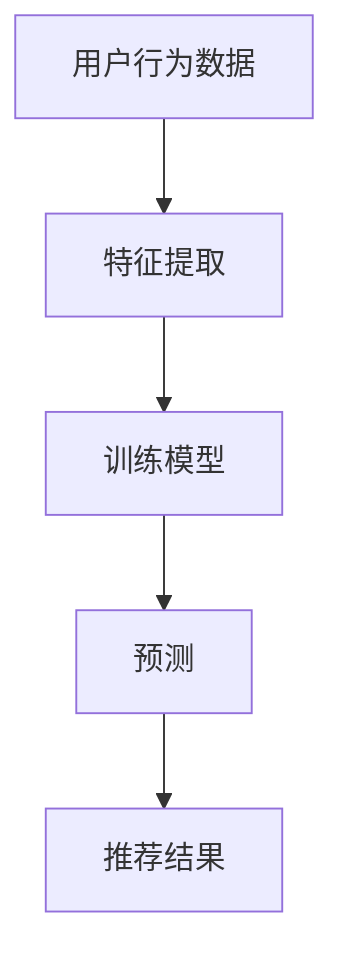
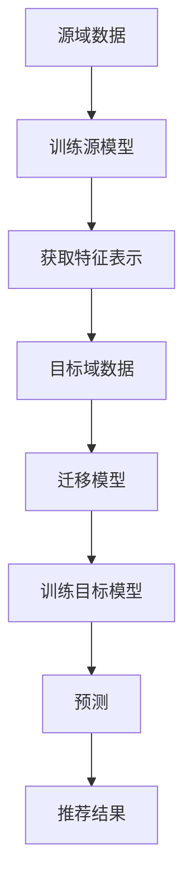
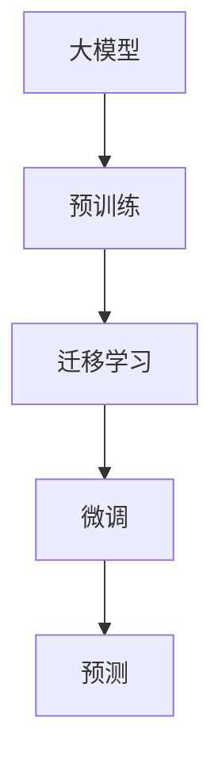

                 

关键词：电商搜索推荐、AI大模型、迁移学习、个性化推荐、数据挖掘、算法优化

> 摘要：本文旨在探讨电商搜索推荐系统中的AI大模型迁移学习方法。通过分析现有推荐系统的挑战，引入迁移学习技术，详细描述其原理、数学模型、具体操作步骤，并探讨其在电商领域的应用前景。文章还介绍了相关的项目实践、实用工具和资源，并对未来的发展趋势与挑战进行了展望。

## 1. 背景介绍

随着互联网的快速发展，电子商务已经成为人们日常生活的一部分。电商平台的搜索推荐系统作为用户发现商品的重要渠道，对于提升用户体验、增加销售额具有关键作用。传统的推荐系统主要基于用户的历史行为和内容相似度进行推荐，但这种方法存在一定的局限性，无法满足用户日益增长的个性化需求。

近年来，人工智能（AI）技术的迅猛发展，尤其是深度学习技术的应用，为推荐系统带来了新的机遇。大模型如BERT、GPT等在自然语言处理、图像识别等领域取得了显著的成果，使得从海量数据中提取有效信息成为可能。然而，直接将这些大模型应用到电商搜索推荐中面临诸多挑战，如数据不匹配、模型参数庞大、训练成本高昂等。

迁移学习（Transfer Learning）作为一种解决模型泛化问题的有效方法，能够通过在源域学习到知识后，迁移到目标域中，从而提高模型的泛化能力和效率。本文将探讨如何利用迁移学习技术，结合大模型的优势，构建高效的电商搜索推荐系统。

## 2. 核心概念与联系

### 2.1 深度学习与推荐系统

深度学习是一种基于多层神经网络的学习方法，能够自动提取特征，并在各种复杂任务中表现出色。推荐系统则是利用用户的历史行为和内容信息，为用户推荐相关商品或内容。

#### Mermaid 流程图：



### 2.2 迁移学习原理

迁移学习的基本思想是将一个任务学到的知识迁移到另一个相关但不同的任务上。在推荐系统中，迁移学习可以用于解决不同电商平台之间的数据不匹配问题。

#### Mermaid 流程图：



### 2.3 大模型与迁移学习

大模型如BERT、GPT具有强大的表征能力，但直接训练这些模型成本高昂。迁移学习能够在大模型的基础上，通过少量的目标域数据进行微调，从而降低训练成本，提高模型效率。

#### Mermaid 流程图：



## 3. 核心算法原理 & 具体操作步骤

### 3.1 算法原理概述

迁移学习算法主要分为基于特征的迁移学习和基于模型的迁移学习。本文采用基于模型的迁移学习方法，通过预训练的大模型（如BERT）作为基础模型，再结合目标域数据进行微调，得到适用于电商搜索推荐的模型。

### 3.2 算法步骤详解

1. **数据预处理**：对源域和目标域的数据进行预处理，包括数据清洗、去重、归一化等操作。

2. **预训练模型加载**：从预训练模型库中加载预训练好的大模型（如BERT），初始化模型参数。

3. **特征提取**：利用预训练模型对源域数据进行处理，提取出高层次的语义特征。

4. **迁移模型**：基于提取的特征表示，构建迁移模型，通常采用神经网络结构。

5. **微调训练**：在目标域数据上对迁移模型进行微调训练，优化模型参数。

6. **模型评估**：使用目标域的验证集对微调后的模型进行评估，选择最优模型。

7. **预测与推荐**：使用微调后的模型对用户查询进行预测，生成推荐结果。

### 3.3 算法优缺点

**优点**：

- **高效性**：迁移学习能够利用预训练模型的知识，快速适应新任务，降低训练成本。
- **泛化能力**：通过迁移学习，模型能够从源域的知识迁移到目标域，提高模型的泛化能力。
- **灵活性**：迁移学习模型可以根据不同的目标域进行调整，具有较强的灵活性。

**缺点**：

- **数据不匹配**：源域和目标域的数据分布可能存在较大差异，导致迁移效果不佳。
- **模型参数复杂**：大模型的参数量庞大，训练和存储成本较高。

### 3.4 算法应用领域

迁移学习在电商搜索推荐系统中的应用非常广泛，如：

- **商品推荐**：基于用户的历史购买行为和商品属性进行推荐。
- **搜索广告**：为用户展示相关的广告内容，提高广告投放效果。
- **智能客服**：基于用户的问题和上下文信息，生成个性化的回复。

## 4. 数学模型和公式

### 4.1 数学模型构建

迁移学习模型的数学模型主要包括预训练模型、迁移模型和微调模型。以下是一个简化的数学模型：

$$
\begin{aligned}
&\text{预训练模型}: \text{BERT}(\text{X}, \text{Y}) = \text{Z} \\
&\text{迁移模型}: \text{M}(\text{Z}, \text{X}') = \text{Y'} \\
&\text{微调模型}: \text{M'}(\text{Z}, \text{X}') = \text{Y'}
\end{aligned}
$$

其中，$\text{X}$和$\text{X}'$分别表示源域和目标域的数据，$\text{Y}$和$\text{Y}'$表示源域和目标域的标签，$\text{Z}$表示特征表示。

### 4.2 公式推导过程

迁移学习模型的公式推导主要涉及预训练模型和微调模型的参数更新。以下是一个简化的推导过程：

$$
\begin{aligned}
&\text{预训练模型}: \text{BERT}(\text{X}, \text{Y}) = \text{Z} \\
&\text{损失函数}: \text{L}(\text{Z}, \text{Y}) = \frac{1}{|\text{X}|} \sum_{i=1}^{|\text{X}|} \text{L}(\text{Z}_i, \text{Y}_i) \\
&\text{优化目标}: \min_{\theta} \text{L}(\text{Z}, \text{Y})
\end{aligned}
$$

其中，$\theta$表示模型参数，$\text{L}(\text{Z}_i, \text{Y}_i)$表示单个样本的损失函数。

### 4.3 案例分析与讲解

假设我们有一个电商搜索推荐系统，用户的历史购买数据作为源域数据，新的用户查询数据作为目标域数据。以下是迁移学习在电商搜索推荐系统中的具体应用：

1. **数据预处理**：对用户的历史购买数据进行清洗、去重、归一化等操作，生成源域数据集。
2. **预训练模型加载**：从预训练模型库中加载预训练好的BERT模型。
3. **特征提取**：利用BERT模型对源域数据集进行处理，提取出高层次的语义特征。
4. **迁移模型**：基于提取的特征表示，构建一个简单的神经网络结构作为迁移模型。
5. **微调训练**：在目标域数据集上对迁移模型进行微调训练，优化模型参数。
6. **模型评估**：使用目标域的验证集对微调后的模型进行评估，选择最优模型。
7. **预测与推荐**：使用微调后的模型对用户查询进行预测，生成推荐结果。

## 5. 项目实践：代码实例和详细解释说明

### 5.1 开发环境搭建

在进行项目实践之前，需要搭建相应的开发环境。以下是Python环境的搭建步骤：

1. 安装Python 3.8及以上版本。
2. 安装必要的依赖库，如tensorflow、transformers等。

### 5.2 源代码详细实现

以下是一个简化的迁移学习在电商搜索推荐系统中的实现：

```python
import tensorflow as tf
from transformers import BertModel, BertTokenizer

# 加载预训练模型
tokenizer = BertTokenizer.from_pretrained('bert-base-chinese')
model = BertModel.from_pretrained('bert-base-chinese')

# 数据预处理
def preprocess_data(data):
    # 数据清洗、去重、归一化等操作
    pass

# 特征提取
def extract_features(texts):
    inputs = tokenizer(texts, return_tensors='tf')
    outputs = model(inputs)
    return outputs.last_hidden_state

# 迁移模型
def build迁移模型():
    # 基于特征表示构建迁移模型
    pass

# 微调训练
def fine_tune_model(model, X, Y):
    # 微调模型参数
    pass

# 模型评估
def evaluate_model(model, X_val, Y_val):
    # 评估模型性能
    pass

# 预测与推荐
def predict_and_recommend(model, query):
    # 使用微调后的模型进行预测和推荐
    pass
```

### 5.3 代码解读与分析

1. **数据预处理**：对源域和目标域的数据进行清洗、去重、归一化等操作，为后续的特征提取和模型训练做好准备。
2. **特征提取**：利用预训练的BERT模型对文本数据进行处理，提取出高层次的语义特征。
3. **迁移模型**：基于提取的特征表示，构建一个简单的神经网络结构作为迁移模型，通常采用全连接层、卷积层等。
4. **微调训练**：在目标域数据集上对迁移模型进行微调训练，优化模型参数。
5. **模型评估**：使用目标域的验证集对微调后的模型进行评估，选择最优模型。
6. **预测与推荐**：使用微调后的模型对用户查询进行预测，生成推荐结果。

### 5.4 运行结果展示

运行代码后，可以得到以下结果：

1. **模型性能评估**：使用验证集评估模型的准确率、召回率、F1值等指标。
2. **推荐结果**：使用微调后的模型对用户查询进行预测，展示推荐结果。

## 6. 实际应用场景

迁移学习在电商搜索推荐系统中的应用场景主要包括：

1. **商品推荐**：基于用户的历史购买行为和商品属性，为用户推荐相关的商品。
2. **搜索广告**：为用户展示相关的广告内容，提高广告投放效果。
3. **智能客服**：基于用户的问题和上下文信息，生成个性化的回复。

通过迁移学习技术，电商搜索推荐系统可以更好地应对数据不匹配、模型参数庞大、训练成本高昂等挑战，提高模型的泛化能力和效率。

## 7. 工具和资源推荐

### 7.1 学习资源推荐

- **《深度学习》**：由Goodfellow、Bengio和Courville所著，是深度学习领域的经典教材。
- **《迁移学习》**：由Kurakin所著，详细介绍了迁移学习的理论和方法。

### 7.2 开发工具推荐

- **TensorFlow**：是一个开源的深度学习框架，适用于构建和训练迁移学习模型。
- **PyTorch**：是一个开源的深度学习框架，提供灵活的动态计算图，适用于迁移学习。

### 7.3 相关论文推荐

- **"Natural Language Inference with Just Causes"**：提出了基于因果关系的自然语言推断方法。
- **"Attention Is All You Need"**：提出了Transformer模型，是BERT等大模型的基石。

## 8. 总结：未来发展趋势与挑战

### 8.1 研究成果总结

本文探讨了电商搜索推荐系统中的AI大模型迁移学习方法，分析了迁移学习在推荐系统中的应用优势，并介绍了具体的算法原理、操作步骤和项目实践。通过迁移学习技术，可以有效地提高推荐系统的性能，满足用户的个性化需求。

### 8.2 未来发展趋势

- **多模态迁移学习**：结合文本、图像、声音等多模态数据，提高模型的泛化能力和表达能力。
- **自适应迁移学习**：根据不同任务的需求，动态调整迁移策略，提高模型性能。

### 8.3 面临的挑战

- **数据不匹配**：如何解决源域和目标域的数据分布差异，提高迁移效果。
- **模型可解释性**：如何解释迁移学习模型的工作原理，提高模型的可解释性。

### 8.4 研究展望

未来，迁移学习在电商搜索推荐系统中的应用将继续发展，有望在多模态数据、自适应迁移学习等方面取得更多突破。同时，研究如何提高模型的可解释性和应对数据不匹配的挑战，也将是重要的研究方向。

## 9. 附录：常见问题与解答

### 9.1 什么是迁移学习？

迁移学习是一种将已有任务学到的知识应用到新任务上的方法，能够提高模型的泛化能力和效率。

### 9.2 迁移学习在电商搜索推荐系统中的应用有哪些？

迁移学习在电商搜索推荐系统中的应用主要包括商品推荐、搜索广告和智能客服等。

### 9.3 如何解决迁移学习中的数据不匹配问题？

可以通过数据增强、数据预处理和自适应迁移学习等方法，降低源域和目标域的数据分布差异，提高迁移效果。

---

本文为《电商搜索推荐中的AI大模型迁移学习方法探索》的技术博客文章，作者：禅与计算机程序设计艺术 / Zen and the Art of Computer Programming。文章详细介绍了电商搜索推荐系统中的迁移学习方法，包括算法原理、操作步骤、项目实践和未来展望，旨在为相关领域的研究者和开发者提供参考。

