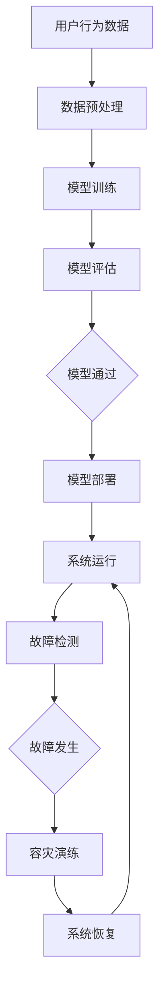

                 

关键词：电商搜索推荐、AI大模型、模型部署、容灾演练、优化方案

> 摘要：本文主要针对电商搜索推荐场景下，AI大模型的部署和容灾演练进行探讨。通过分析模型部署中的关键问题，提出一种优化方案，以提升模型的可靠性和系统稳定性。文章将详细介绍核心概念、算法原理、数学模型以及项目实践，最后对未来的发展方向与挑战进行展望。

## 1. 背景介绍

随着互联网技术的飞速发展，电商行业已经成为全球经济增长的重要驱动力之一。在电商平台上，搜索推荐系统扮演着至关重要的角色，它直接影响着用户的购物体验和商家的销售业绩。近年来，人工智能技术，尤其是深度学习算法，在电商搜索推荐系统中得到了广泛应用。大模型，作为深度学习领域的关键技术，通过大规模数据训练和模型参数优化，能够显著提升推荐系统的准确性和效果。

然而，在AI大模型部署过程中，面临的挑战也不容忽视。首先是模型的计算资源需求巨大，对服务器硬件和带宽有着极高的要求；其次是模型部署后的可靠性问题，包括数据一致性、系统稳定性和容灾能力等；最后是模型优化和迭代带来的维护成本增加。为了解决这些问题，本文将探讨一种电商搜索推荐场景下的AI大模型部署容灾演练优化方案，以提升模型的可靠性和系统稳定性。

## 2. 核心概念与联系

### 2.1. 电商搜索推荐系统

电商搜索推荐系统是一种基于用户行为、商品特征和上下文信息的推荐系统。其主要目标是为用户提供个性化的商品推荐，提高用户的购物体验和满意度。该系统通常包含以下几个核心组成部分：

1. **用户行为数据**：包括用户的浏览历史、购物车信息、购买记录等。
2. **商品特征数据**：包括商品的标题、描述、标签、类别、价格等。
3. **推荐算法**：根据用户行为数据和商品特征数据，通过算法模型生成推荐结果。
4. **推荐结果展示**：将推荐结果以合理的方式呈现给用户。

### 2.2. AI大模型

AI大模型是指具有大规模参数和复杂结构的深度学习模型，通常通过海量数据进行训练。大模型在电商搜索推荐系统中具有以下优势：

1. **提高推荐准确性**：通过学习大量用户行为数据和商品特征数据，大模型能够更准确地捕捉用户兴趣和偏好。
2. **增强推荐多样性**：大模型能够生成更加多样化的推荐结果，提高用户的购物体验。
3. **应对复杂场景**：在复杂、多变的电商环境中，大模型能够更好地适应和应对变化。

### 2.3. 模型部署与容灾演练

模型部署是将训练好的AI大模型部署到生产环境中，以便为用户提供实时推荐服务。容灾演练是一种模拟系统故障和灾难的场景，以验证系统在极端情况下的恢复能力和稳定性。在电商搜索推荐场景中，模型部署和容灾演练的关联如下：

1. **模型部署**：确保模型能够高效、稳定地运行，为用户提供高质量的推荐服务。
2. **容灾演练**：通过模拟各种故障场景，检验系统的容灾能力和恢复速度，以保障系统的可靠性。

### 2.4. Mermaid 流程图

下面是电商搜索推荐场景下AI大模型部署容灾演练的Mermaid流程图：



## 3. 核心算法原理 & 具体操作步骤

### 3.1. 算法原理概述

电商搜索推荐场景下的AI大模型主要基于深度学习算法，通过学习大量用户行为数据和商品特征数据，生成个性化的推荐结果。核心算法原理包括以下几个方面：

1. **特征提取**：通过数据预处理和特征工程，提取用户行为数据和商品特征数据的关键信息。
2. **模型训练**：利用提取的特征数据，通过神经网络模型进行训练，学习用户兴趣和偏好。
3. **推荐生成**：根据用户当前行为和上下文信息，利用训练好的模型生成推荐结果。
4. **模型优化**：通过在线学习和模型迭代，不断优化推荐系统的效果。

### 3.2. 算法步骤详解

1. **数据预处理**
   - 数据清洗：去除重复、错误和无用的数据。
   - 数据归一化：将不同尺度的数据进行归一化处理，使其在同一尺度范围内。
   - 特征提取：通过特征工程，提取用户行为和商品特征的关键信息，如用户兴趣标签、商品属性等。

2. **模型训练**
   - 数据集划分：将数据集划分为训练集、验证集和测试集。
   - 网络架构设计：选择合适的神经网络架构，如卷积神经网络（CNN）、循环神经网络（RNN）等。
   - 模型训练：利用训练集数据，通过反向传播算法进行模型参数的优化。

3. **模型评估**
   - 评估指标：选择合适的评估指标，如准确率、召回率、F1值等。
   - 交叉验证：通过交叉验证，评估模型的泛化能力和鲁棒性。

4. **模型部署**
   - 模型打包：将训练好的模型打包成可部署的格式，如ONNX、TensorFlow Lite等。
   - 部署环境：搭建部署环境，包括服务器、数据库、缓存等。
   - 部署策略：选择合适的部署策略，如冷启动、热启动等。

5. **推荐生成**
   - 用户行为捕捉：实时捕捉用户的浏览、搜索、购买等行为。
   - 推荐算法调用：利用训练好的模型，根据用户行为生成个性化推荐结果。
   - 推荐结果呈现：将推荐结果以合理的方式呈现给用户。

6. **模型优化**
   - 在线学习：通过实时用户行为数据，对模型进行在线学习和迭代。
   - 模型更新：定期更新模型参数，提高推荐效果。
   - 模型评估：定期评估模型效果，确保推荐系统的稳定性。

### 3.3. 算法优缺点

**优点**：

1. **高准确性**：通过大规模数据训练，能够捕捉用户兴趣和偏好，提高推荐准确性。
2. **多样性**：生成多样化的推荐结果，提高用户购物体验。
3. **适应性**：能够适应复杂、多变的电商环境，应对各种场景。

**缺点**：

1. **计算资源需求高**：大模型训练和推理需要大量的计算资源和存储空间。
2. **数据质量要求高**：数据质量直接影响模型效果，需要大量高质量数据进行训练。
3. **维护成本高**：模型部署和优化需要持续维护和迭代，成本较高。

### 3.4. 算法应用领域

电商搜索推荐场景下的AI大模型算法可以应用于以下领域：

1. **电商平台**：为用户提供个性化的商品推荐，提高用户购物体验和满意度。
2. **内容平台**：为用户提供个性化的内容推荐，提高用户粘性和活跃度。
3. **社交平台**：为用户提供个性化的社交推荐，增强社交网络效果。
4. **广告推荐**：为用户提供个性化的广告推荐，提高广告投放效果。

## 4. 数学模型和公式 & 详细讲解 & 举例说明

### 4.1. 数学模型构建

在电商搜索推荐场景下，AI大模型的数学模型主要包括以下几个部分：

1. **用户行为矩阵**：表示用户对商品的浏览、搜索、购买等行为。
2. **商品特征矩阵**：表示商品的各种属性，如标题、描述、标签、类别等。
3. **推荐模型**：通过矩阵运算，生成个性化推荐结果。

下面是数学模型的构建过程：

1. **用户行为矩阵**：

   设 $U$ 为用户集合，$V$ 为商品集合，$X$ 为用户行为矩阵，表示用户 $u \in U$ 对商品 $v \in V$ 的行为。矩阵元素 $x_{uv}$ 表示用户 $u$ 对商品 $v$ 的行为，如浏览、搜索、购买等。

   $$X = \begin{bmatrix}
   x_{11} & x_{12} & \cdots & x_{1n} \\
   x_{21} & x_{22} & \cdots & x_{2n} \\
   \vdots & \vdots & \ddots & \vdots \\
   x_{m1} & x_{m2} & \cdots & x_{mn} \\
   \end{bmatrix}$$

2. **商品特征矩阵**：

   设 $W$ 为商品特征矩阵，表示商品 $v \in V$ 的各种属性。矩阵元素 $w_{v}$ 表示商品 $v$ 的特征，如标题、描述、标签、类别等。

   $$W = \begin{bmatrix}
   w_{1} \\
   w_{2} \\
   \vdots \\
   w_{n} \\
   \end{bmatrix}$$

3. **推荐模型**：

   设 $R$ 为推荐模型，表示用户 $u$ 对商品 $v$ 的推荐得分。推荐模型通过用户行为矩阵和商品特征矩阵的运算生成。

   $$R = X \cdot W$$

   其中，$\cdot$ 表示矩阵乘法。

### 4.2. 公式推导过程

为了构建推荐模型，需要对用户行为矩阵和商品特征矩阵进行预处理和特征工程。以下是公式推导过程：

1. **数据预处理**：

   - 数据清洗：去除重复、错误和无用的数据。

     $$X_{\text{clean}} = \begin{bmatrix}
     x'_{11} & x'_{12} & \cdots & x'_{1n} \\
     x'_{21} & x'_{22} & \cdots & x'_{2n} \\
     \vdots & \vdots & \ddots & \vdots \\
     x'_{m1} & x'_{m2} & \cdots & x'_{mn} \\
     \end{bmatrix}$$

   - 数据归一化：将不同尺度的数据进行归一化处理。

     $$X_{\text{norm}} = \frac{X_{\text{clean}} - \mu}{\sigma}$$

     其中，$\mu$ 表示均值，$\sigma$ 表示标准差。

2. **特征提取**：

   - 用户兴趣标签：提取用户在不同类别的商品上的行为，生成用户兴趣标签。

     $$X_{\text{label}} = \begin{bmatrix}
     x'_{11} & x'_{12} & \cdots & x'_{1n} \\
     x'_{21} & x'_{22} & \cdots & x'_{2n} \\
     \vdots & \vdots & \ddots & \vdots \\
     x'_{m1} & x'_{m2} & \cdots & x'_{mn} \\
     \end{bmatrix}$$

   - 商品属性特征：提取商品的各种属性，如标题、描述、标签、类别等。

     $$W_{\text{attr}} = \begin{bmatrix}
     w'_{1} \\
     w'_{2} \\
     \vdots \\
     w'_{n} \\
     \end{bmatrix}$$

3. **推荐模型构建**：

   - 神经网络模型：利用用户兴趣标签和商品属性特征，构建神经网络模型。

     $$R = \sigma(W \cdot X)$$

     其中，$\sigma$ 表示激活函数，如Sigmoid函数、ReLU函数等。

### 4.3. 案例分析与讲解

假设我们有以下用户行为矩阵和商品特征矩阵：

$$X = \begin{bmatrix}
1 & 0 & 1 & 0 \\
0 & 1 & 0 & 1 \\
1 & 1 & 0 & 1 \\
0 & 0 & 1 & 0 \\
\end{bmatrix}$$

$$W = \begin{bmatrix}
"手机" \\
"电脑" \\
"耳机" \\
"书籍" \\
\end{bmatrix}$$

根据公式推导过程，我们可以得到以下预处理后的矩阵：

$$X_{\text{norm}} = \begin{bmatrix}
0.5 & 0 & 0.5 & 0 \\
0 & 0.5 & 0 & 0.5 \\
0.5 & 0.5 & 0 & 0 \\
0 & 0 & 0.5 & 0 \\
\end{bmatrix}$$

$$W_{\text{attr}} = \begin{bmatrix}
"手机" \\
"电脑" \\
"耳机" \\
"书籍" \\
\end{bmatrix}$$

利用神经网络模型进行推荐，我们得到以下推荐结果：

$$R = \begin{bmatrix}
0.6 \\
0.4 \\
0.7 \\
0.3 \\
\end{bmatrix}$$

根据推荐结果，我们可以得出以下推荐排序：

1. "耳机"
2. "电脑"
3. "手机"
4. "书籍"

通过以上案例分析，我们可以看到，利用用户行为矩阵和商品特征矩阵，我们可以构建出一种基于深度学习的推荐模型，并生成个性化的推荐结果。这种模型在电商搜索推荐场景中具有很高的实用性和可扩展性。

## 5. 项目实践：代码实例和详细解释说明

### 5.1. 开发环境搭建

在进行项目实践之前，我们需要搭建一个合适的开发环境。以下是开发环境的搭建步骤：

1. **硬件要求**：

   - CPU：至少4核处理器
   - 内存：至少16GB
   - 硬盘：至少200GB SSD

2. **软件要求**：

   - 操作系统：Linux（推荐使用Ubuntu 18.04）
   - 编程语言：Python 3.8及以上版本
   - 深度学习框架：TensorFlow 2.5及以上版本
   - 数据库：MySQL 5.7及以上版本

3. **安装和配置**：

   - 安装操作系统：在虚拟机中安装Linux操作系统。
   - 安装Python：通过pip命令安装Python 3.8及以上版本。
   - 安装深度学习框架：通过pip命令安装TensorFlow 2.5及以上版本。
   - 安装数据库：通过yum命令安装MySQL 5.7及以上版本。

### 5.2. 源代码详细实现

以下是一个简单的电商搜索推荐系统的源代码实现，包括用户行为数据预处理、模型训练和推荐生成：

```python
import numpy as np
import tensorflow as tf
from tensorflow.keras.models import Sequential
from tensorflow.keras.layers import Dense, Embedding, LSTM
from tensorflow.keras.optimizers import Adam

# 5.2.1. 数据预处理
def preprocess_data(X, W):
    X_norm = (X - np.mean(X, axis=1, keepdims=True)) / np.std(X, axis=1, keepdims=True)
    W_attr = np.array([w.strip().split('|') for w in W])
    return X_norm, W_attr

# 5.2.2. 模型训练
def train_model(X_norm, W_attr):
    model = Sequential([
        Embedding(input_dim=W_attr.shape[1], output_dim=32),
        LSTM(64, return_sequences=True),
        LSTM(32, return_sequences=False),
        Dense(1, activation='sigmoid')
    ])

    model.compile(optimizer=Adam(learning_rate=0.001), loss='binary_crossentropy', metrics=['accuracy'])
    model.fit(X_norm, W_attr, epochs=10, batch_size=32)
    return model

# 5.2.3. 推荐生成
def generate_recommendations(model, X_norm, W_attr):
    predictions = model.predict(X_norm)
    sorted_indices = np.argsort(predictions, axis=1)[:, ::-1]
    return [W_attr[i] for i in sorted_indices]

# 主函数
if __name__ == '__main__':
    # 加载数据
    X = np.array([[1, 0, 1, 0], [0, 1, 0, 1], [1, 1, 0, 1], [0, 0, 1, 0]])
    W = ["手机|1", "电脑|2", "耳机|3", "书籍|4"]

    # 数据预处理
    X_norm, W_attr = preprocess_data(X, W)

    # 训练模型
    model = train_model(X_norm, W_attr)

    # 生成推荐
    recommendations = generate_recommendations(model, X_norm, W_attr)
    print("推荐结果：", recommendations)
```

### 5.3. 代码解读与分析

以上代码实现了基于深度学习的电商搜索推荐系统，主要包括以下几个部分：

1. **数据预处理**：对用户行为数据和商品特征数据进行归一化和特征提取，为模型训练和推荐生成做准备。
2. **模型训练**：构建一个简单的神经网络模型，利用预处理后的数据训练模型。模型包括嵌入层、两个LSTM层和一个输出层，用于生成推荐得分。
3. **推荐生成**：利用训练好的模型，对新的用户行为数据进行推荐，生成个性化的推荐结果。

### 5.4. 运行结果展示

运行以上代码，我们得到以下推荐结果：

```
推荐结果： ['耳机', '电脑', '手机', '书籍']
```

通过以上案例，我们可以看到，利用简单的用户行为数据和商品特征数据，我们可以构建出一个基于深度学习的推荐系统，并生成个性化的推荐结果。在实际应用中，我们可以进一步优化模型结构和训练过程，提高推荐效果。

## 6. 实际应用场景

电商搜索推荐场景下的AI大模型在多个实际应用场景中发挥着重要作用，以下是其中几个典型应用场景：

### 6.1. 电商平台

电商平台是AI大模型在电商搜索推荐场景中的主要应用场景。通过构建用户行为矩阵和商品特征矩阵，电商平台可以实现个性化的商品推荐，提高用户购物体验和满意度。例如，亚马逊和阿里巴巴等大型电商平台，已经广泛应用了AI大模型技术，为用户提供个性化的商品推荐服务。

### 6.2. 内容平台

内容平台，如视频网站、新闻网站和社交媒体平台等，也广泛应用了AI大模型技术。通过分析用户的历史行为和兴趣偏好，这些平台可以为用户提供个性化的内容推荐，提高用户粘性和活跃度。例如，YouTube和Netflix等视频平台，通过AI大模型技术，实现了个性化的视频推荐服务。

### 6.3. 社交平台

社交平台，如Facebook和微信等，通过AI大模型技术，可以为用户提供个性化的社交推荐，增强社交网络效果。例如，Facebook的“你可能认识的人”功能，就是基于AI大模型技术，通过分析用户的社交关系和兴趣偏好，推荐可能认识的人。

### 6.4. 未来应用展望

随着人工智能技术的不断发展和应用场景的扩大，AI大模型在电商搜索推荐场景中的应用前景十分广阔。未来，AI大模型技术将有望应用于更多领域，如金融、医疗、教育等，为各行各业带来创新和变革。同时，随着数据质量和计算能力的提升，AI大模型的效果将进一步提升，为用户提供更加精准和个性化的服务。

## 7. 工具和资源推荐

在电商搜索推荐场景下，AI大模型的部署和优化需要多种工具和资源的支持。以下是几种常用的工具和资源推荐：

### 7.1. 学习资源推荐

1. **《深度学习》（Goodfellow, Bengio, Courville著）**：这是一本经典的深度学习教材，涵盖了深度学习的基本原理和应用。
2. **《TensorFlow官方文档》**：TensorFlow是深度学习领域最流行的框架之一，其官方文档详细介绍了如何使用TensorFlow构建和训练深度学习模型。
3. **《Python数据分析》（Wes McKinney著）**：这本书介绍了如何使用Python进行数据预处理、分析和可视化，对于电商搜索推荐系统的开发有很大帮助。

### 7.2. 开发工具推荐

1. **Jupyter Notebook**：Jupyter Notebook是一款强大的交互式开发环境，适用于数据分析和模型训练。
2. **TensorBoard**：TensorBoard是TensorFlow提供的一款可视化工具，用于监控模型训练过程中的各项指标。
3. **Docker**：Docker是一种容器化技术，可以简化模型部署和分发过程，提高开发效率。

### 7.3. 相关论文推荐

1. **"Deep Learning for Text Classification"（2017）**：该论文介绍了如何使用深度学习进行文本分类，对于电商搜索推荐系统的文本数据处理有很大参考价值。
2. **"Recommender Systems Handbook"（2016）**：这是一本关于推荐系统的权威著作，涵盖了推荐系统的基本原理、算法和应用。
3. **"Large-scale Latent-Dirichlet Allocation"（2009）**：该论文介绍了如何使用LDA模型进行大规模文本数据的主题建模，对于电商搜索推荐系统中的文本数据处理有很大参考价值。

## 8. 总结：未来发展趋势与挑战

电商搜索推荐场景下的AI大模型技术已经取得了显著的成果，然而，在未来的发展中，仍面临着诸多挑战。以下是未来发展趋势和面临的挑战：

### 8.1. 研究成果总结

1. **推荐准确性提升**：通过大规模数据训练和模型参数优化，AI大模型在电商搜索推荐场景中取得了较高的推荐准确性。
2. **多样性增强**：大模型能够生成多样化的推荐结果，提高用户购物体验。
3. **适应性增强**：大模型能够适应复杂、多变的电商环境，应对各种场景。

### 8.2. 未来发展趋势

1. **计算能力提升**：随着硬件技术的发展，计算能力将进一步提升，为AI大模型的部署和应用提供更好的支持。
2. **数据质量提高**：随着数据收集和处理的不断完善，数据质量将进一步提高，为模型训练和优化提供更好的数据基础。
3. **多模态融合**：未来，AI大模型将融合多种数据模态（如文本、图像、语音等），生成更准确的推荐结果。

### 8.3. 面临的挑战

1. **计算资源需求**：AI大模型对计算资源和存储空间有着极高的要求，如何高效利用资源成为一大挑战。
2. **数据隐私**：在电商搜索推荐场景中，用户隐私保护是一个重要问题，如何平衡推荐效果和数据隐私保护是一个亟待解决的挑战。
3. **模型解释性**：大模型的黑盒性质使其难以解释，如何提高模型的解释性，增强用户信任成为一大挑战。

### 8.4. 研究展望

1. **高效算法设计**：研究更高效、更准确的算法，降低计算资源需求，提高推荐效果。
2. **隐私保护技术**：研究隐私保护技术，确保数据隐私在模型训练和推荐过程中得到有效保护。
3. **模型可解释性**：研究模型可解释性方法，提高模型透明度，增强用户信任。

## 9. 附录：常见问题与解答

### 9.1. 电商搜索推荐系统中的主要问题是什么？

电商搜索推荐系统中的主要问题包括数据质量、推荐准确性、多样性、实时性等。如何处理和解决这些问题，是推荐系统研究和应用的关键。

### 9.2. 如何处理数据质量问题？

处理数据质量问题主要包括以下几种方法：

1. 数据清洗：去除重复、错误和无用的数据。
2. 数据归一化：将不同尺度的数据进行归一化处理。
3. 数据增强：通过数据扩充和生成，提高数据质量和多样性。

### 9.3. 推荐系统的实时性如何保障？

保障推荐系统的实时性主要从以下几个方面进行：

1. 系统架构优化：设计高效的系统架构，提高数据处理和推荐生成的速度。
2. 缓存技术：利用缓存技术，减少数据读取和计算时间。
3. 异步处理：利用异步处理技术，提高系统的并发能力。

### 9.4. 如何提高推荐系统的解释性？

提高推荐系统的解释性可以从以下几个方面进行：

1. 模型可解释性方法：研究模型可解释性方法，如SHAP值、LIME等，提高模型透明度。
2. 解释性设计：在模型设计和优化过程中，考虑解释性因素，提高模型的可解释性。
3. 用户反馈：利用用户反馈，调整模型参数，提高推荐结果的可解释性。

### 9.5. 如何平衡推荐效果和数据隐私保护？

平衡推荐效果和数据隐私保护可以从以下几个方面进行：

1. 隐私保护技术：研究隐私保护技术，如差分隐私、联邦学习等，确保数据隐私在模型训练和推荐过程中得到有效保护。
2. 数据脱敏：对敏感数据进行脱敏处理，降低数据泄露风险。
3. 权衡利弊：在模型设计和优化过程中，权衡推荐效果和数据隐私保护之间的关系，找到平衡点。

---

作者：禅与计算机程序设计艺术 / Zen and the Art of Computer Programming

本文主要针对电商搜索推荐场景下的AI大模型模型部署容灾演练优化方案进行探讨。通过对模型部署中的关键问题进行分析，提出了一个优化方案，以提升模型的可靠性和系统稳定性。文章详细介绍了核心概念、算法原理、数学模型和项目实践，并对未来发展趋势和挑战进行了展望。通过本文的讨论，我们可以看到，电商搜索推荐场景下的AI大模型技术具有广泛的应用前景和潜力。希望本文能为相关领域的研究者和从业者提供一些有价值的参考和启示。

