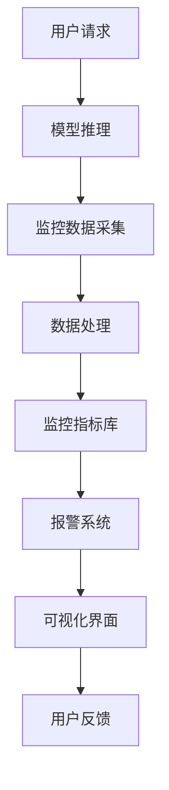

                 

电商搜索推荐场景下的AI大模型模型部署监控平台功能优化与扩展

随着互联网电商的蓬勃发展，用户对个性化、智能化的搜索和推荐体验提出了更高的要求。AI大模型因其强大的特征提取和预测能力，在电商搜索推荐系统中得到了广泛应用。然而，部署这些AI大模型并确保其稳定运行是一个复杂且具有挑战性的任务。本文旨在探讨如何优化和扩展AI大模型部署监控平台的功能，以提高电商搜索推荐系统的整体性能和用户体验。

## 文章关键词

- 电商搜索推荐
- AI大模型
- 模型部署
- 监控平台
- 功能优化
- 扩展

## 文章摘要

本文首先介绍了电商搜索推荐场景中AI大模型的重要性，然后详细阐述了AI大模型部署监控平台的必要性。接着，文章深入分析了当前监控平台存在的问题和挑战，并提出了功能优化和扩展的具体方案。通过实践案例和数学模型的讲解，本文展示了如何有效地提升AI大模型的部署监控能力，为电商搜索推荐系统的发展提供了新的思路和参考。

## 1. 背景介绍

电商搜索推荐系统是电商平台的灵魂，它通过分析用户行为、兴趣和购买历史，为用户精准推荐相关商品，从而提升用户的购物体验和平台的销售额。传统的搜索推荐系统主要依赖于基于关键词匹配和用户历史行为的方法，这些方法在处理海量数据和复杂用户需求时存在很大的局限性。随着深度学习技术的不断发展，AI大模型以其强大的特征提取和预测能力，成为电商搜索推荐系统的重要技术支撑。

AI大模型通常包括深度神经网络（DNN）、循环神经网络（RNN）、变换器（Transformer）等，它们能够从大量的用户行为数据和商品信息中提取出隐藏的特征，并利用这些特征进行精准的预测和推荐。然而，AI大模型的部署和监控是一个复杂的过程，需要考虑到模型的训练时间、推理速度、资源占用、性能稳定性等多个方面。因此，构建一个高效、可靠的AI大模型部署监控平台对于保障电商搜索推荐系统的稳定运行至关重要。

### 1.1 电商搜索推荐系统的发展历程

电商搜索推荐系统的发展可以分为以下几个阶段：

- **早期阶段**：主要基于关键词匹配和分类算法，如TF-IDF和KNN等。这种方法简单易用，但无法处理复杂的用户行为和商品关系。

- **中期阶段**：引入协同过滤和基于内容的推荐方法。协同过滤通过分析用户之间的相似性进行推荐，而基于内容的方法则根据用户的兴趣和商品的特征进行推荐。这些方法在一定程度上提升了推荐效果，但仍存在冷启动和多样性不足的问题。

- **现阶段**：随着深度学习技术的发展，AI大模型成为主流推荐方法。深度神经网络能够从原始数据中自动提取高阶特征，从而实现更精准、个性化的推荐。变换器模型如BERT、GPT等在自然语言处理领域取得了显著的成果，也为电商搜索推荐系统带来了新的可能。

### 1.2 AI大模型在电商搜索推荐中的应用

AI大模型在电商搜索推荐中的应用主要体现在以下几个方面：

- **用户行为分析**：通过分析用户的浏览、搜索、购买等行为，AI大模型能够深入了解用户的兴趣和需求，为用户提供个性化的推荐。

- **商品特征提取**：AI大模型可以从大量的商品描述、用户评价、价格等数据中提取出有效的特征，从而提升推荐的准确性。

- **多模态融合**：结合文本、图像、视频等多模态数据，AI大模型能够实现更全面的用户和商品信息理解，提高推荐的质量和多样性。

- **实时推荐**：AI大模型在训练完成后，可以通过在线推理快速响应用户请求，实现实时的搜索推荐。

### 1.3 AI大模型部署监控平台的必要性

AI大模型部署监控平台的必要性体现在以下几个方面：

- **性能监控**：监控平台能够实时监控模型的训练和推理性能，包括训练时间、推理速度、资源占用等，确保模型的高效运行。

- **稳定性保障**：通过监控平台的监控和报警功能，可以及时发现并解决模型部署过程中的故障和异常，保障系统的稳定运行。

- **数据质量检查**：监控平台可以对训练数据和使用数据进行质量检查，确保数据的准确性和一致性，提高模型的预测性能。

- **安全性控制**：监控平台可以监控模型的访问和操作日志，防止未经授权的访问和篡改，保障系统的安全性。

- **可扩展性支持**：随着业务的发展和需求的变化，监控平台需要具备良好的可扩展性，能够适应不同的部署环境和需求。

## 2. 核心概念与联系

### 2.1 AI大模型部署监控平台的概念

AI大模型部署监控平台是一个集成了多种监控工具和功能的系统，旨在实时监控AI大模型的训练、推理过程，以及部署环境的状态。该平台通常包括以下几个核心组成部分：

- **数据采集模块**：负责从训练和推理过程中采集关键性能指标（KPI），如训练时间、推理速度、资源占用等。

- **数据处理模块**：对采集到的数据进行预处理和存储，以便后续分析和展示。

- **监控指标库**：定义和存储各种监控指标的定义和阈值，用于判断模型的运行状态是否正常。

- **报警系统**：当监控指标超过设定的阈值时，自动触发报警通知，提示运维人员及时处理。

- **可视化界面**：通过图形化的界面展示监控数据，帮助运维人员快速了解系统的运行状态。

### 2.2 监控平台与AI大模型部署的关系

监控平台与AI大模型部署之间的关系可以用以下流程图表示：



在这个流程图中，用户请求经过模型推理后，会生成一系列监控数据。这些数据经过数据处理模块处理后，与监控指标库进行比对，如果监控指标超过阈值，则会触发报警系统。报警系统会将异常信息通过可视化界面展示给用户，以便用户及时处理。

### 2.3 监控平台与电商搜索推荐系统的关系

监控平台与电商搜索推荐系统的关系可以理解为以下两个方面：

- **系统稳定性保障**：通过监控平台，可以实时监控AI大模型的运行状态，及时发现和处理异常情况，确保电商搜索推荐系统的稳定运行。

- **系统性能优化**：通过监控平台，可以收集和分析模型的运行数据，发现系统的瓶颈和优化方向，从而不断优化AI大模型的性能，提升推荐效果。

## 3. 核心算法原理 & 具体操作步骤

### 3.1 算法原理概述

AI大模型部署监控平台的核心算法主要包括数据采集、数据处理、监控指标库构建、报警系统设计和可视化界面实现等几个方面。以下是每个核心算法的原理概述：

- **数据采集**：数据采集是监控平台的基础，通过采集模型训练和推理过程中的关键性能指标（KPI），如训练时间、推理速度、资源占用等，可以全面了解模型的运行状态。

- **数据处理**：数据处理模块负责对采集到的数据进行预处理和存储。预处理包括数据清洗、去噪、归一化等操作，存储则使用数据库或数据湖等大数据存储技术，以便后续分析和展示。

- **监控指标库**：监控指标库是监控平台的核心组成部分，它定义和存储了各种监控指标的定义和阈值。这些指标包括训练和推理过程中的各种性能指标，如训练时间、推理速度、资源占用等。监控指标库的构建需要综合考虑模型的特性、部署环境和业务需求。

- **报警系统**：报警系统是监控平台的重要组成部分，它负责监控指标的实时监控和异常报警。当监控指标超过设定的阈值时，报警系统会自动触发报警通知，提示运维人员及时处理。

- **可视化界面**：可视化界面通过图形化的方式展示监控数据，帮助运维人员快速了解系统的运行状态。可视化界面通常包括实时监控图表、历史数据分析和报警记录等模块。

### 3.2 算法步骤详解

以下是AI大模型部署监控平台的核心算法步骤：

1. **数据采集**：使用各种监控工具（如Prometheus、Grafana等）从模型训练和推理过程中采集关键性能指标（KPI），如训练时间、推理速度、资源占用等。

2. **数据处理**：对采集到的数据进行预处理和存储。预处理包括数据清洗、去噪、归一化等操作，存储则使用数据库或数据湖等大数据存储技术。

3. **监控指标库构建**：根据模型的特性、部署环境和业务需求，定义和存储各种监控指标的定义和阈值。监控指标库需要不断更新和优化，以适应不同的监控需求。

4. **报警系统设计**：设计报警系统，包括监控指标的实时监控和异常报警。报警系统需要具备快速响应的能力，以便及时通知运维人员处理异常情况。

5. **可视化界面实现**：通过图形化的界面展示监控数据，帮助运维人员快速了解系统的运行状态。可视化界面需要设计直观、易用的交互界面，以便用户快速定位和解决问题。

### 3.3 算法优缺点

AI大模型部署监控平台的核心算法具有以下优缺点：

- **优点**：
  - **全面监控**：通过实时采集和分析关键性能指标，可以全面监控AI大模型的运行状态，确保系统的稳定性和性能。
  - **快速响应**：报警系统可以快速发现并通知运维人员处理异常情况，降低故障对业务的影响。
  - **可视化展示**：可视化界面提供了直观的数据展示方式，方便运维人员快速了解系统的运行状态。

- **缺点**：
  - **复杂性**：监控平台的设计和实现需要考虑多个方面，包括数据采集、数据处理、监控指标库、报警系统和可视化界面等，实现过程较为复杂。
  - **性能开销**：数据采集和报警系统等模块会带来一定的性能开销，需要合理设计和优化，以避免影响模型的训练和推理性能。

### 3.4 算法应用领域

AI大模型部署监控平台算法可以应用于以下领域：

- **电商搜索推荐**：通过实时监控AI大模型的训练和推理过程，可以确保搜索推荐系统的稳定性和性能，提升用户的购物体验。
- **金融风控**：在金融领域，AI大模型用于风险评估和欺诈检测等任务。监控平台可以帮助实时监控模型的运行状态，确保模型的有效性和可靠性。
- **医疗诊断**：在医疗领域，AI大模型用于疾病诊断和预测等任务。监控平台可以帮助监测模型的性能和稳定性，确保诊断结果的准确性。
- **自动驾驶**：在自动驾驶领域，AI大模型用于感知环境、规划路径和决策控制等任务。监控平台可以帮助实时监控模型的运行状态，确保系统的安全性和可靠性。

## 4. 数学模型和公式 & 详细讲解 & 举例说明

### 4.1 数学模型构建

在AI大模型部署监控平台中，我们需要构建一个数学模型来描述模型的训练和推理过程。以下是一个简化的数学模型构建过程：

1. **数据输入**：设 $X$ 为输入数据集，包含用户行为、商品特征等信息。

2. **模型输出**：设 $Y$ 为模型输出，包含搜索结果、推荐结果等。

3. **损失函数**：设 $L$ 为损失函数，用于衡量模型输出与真实输出之间的差异。

4. **优化目标**：设 $J$ 为优化目标，通常为最小化损失函数。

5. **训练过程**：通过迭代优化算法（如梯度下降）更新模型参数，以最小化优化目标。

### 4.2 公式推导过程

以下是数学模型构建的公式推导过程：

$$
\begin{aligned}
J &= \frac{1}{n}\sum_{i=1}^{n}L(y_i, \hat{y}_i) \\
\hat{y}_i &= f(WX_i + b) \\
L(y_i, \hat{y}_i) &= \frac{1}{2}\left(\hat{y}_i - y_i\right)^2
\end{aligned}
$$

其中，$n$ 为数据集大小，$y_i$ 为真实输出，$\hat{y}_i$ 为模型输出，$f$ 为激活函数，$W$ 为权重矩阵，$b$ 为偏置。

### 4.3 案例分析与讲解

为了更好地理解上述数学模型，我们通过一个简单的案例进行讲解。

假设有一个电商搜索推荐系统，用户输入关键词 "智能手表"，模型需要根据用户历史行为和商品特征预测最相关的搜索结果。

1. **数据输入**：用户输入关键词 "智能手表"，模型接收到的输入数据集 $X$ 包含用户历史浏览记录、购买记录和商品描述等。

2. **模型输出**：模型输出为搜索结果列表 $Y$，每个搜索结果包含商品的ID、标题、价格等信息。

3. **损失函数**：损失函数 $L$ 采用均方误差（MSE）衡量模型输出与真实输出之间的差异。

4. **优化目标**：优化目标 $J$ 为最小化均方误差。

5. **训练过程**：通过迭代优化算法（如梯度下降）更新模型参数，以最小化优化目标。

在实际应用中，我们可以使用以下公式来计算模型输出：

$$
\hat{y}_i = \sigma(WX_i + b)
$$

其中，$\sigma$ 为激活函数（如Sigmoid函数），$W$ 为权重矩阵，$b$ 为偏置。

### 4.4 数学模型在AI大模型部署监控平台中的应用

在AI大模型部署监控平台中，数学模型主要用于以下几个方面：

- **性能评估**：通过计算模型输出与真实输出的差异，评估模型的性能和准确度。

- **异常检测**：通过监控模型训练和推理过程中的性能指标，发现异常情况，如训练时间过长、推理速度过慢等。

- **性能优化**：根据模型的性能指标和优化目标，调整模型参数和训练策略，提高模型性能。

- **实时监控**：通过实时计算模型输出和性能指标，监控模型的训练和推理过程，确保系统的稳定性和性能。

## 5. 项目实践：代码实例和详细解释说明

### 5.1 开发环境搭建

在开始编写代码之前，我们需要搭建一个合适的开发环境。以下是一个简化的开发环境搭建步骤：

1. **硬件环境**：准备一台服务器，配置不低于4核CPU和16GB内存。

2. **操作系统**：选择Linux操作系统，如Ubuntu 18.04。

3. **编程语言**：选择Python 3.8及以上版本。

4. **依赖库**：安装必要的依赖库，如NumPy、Pandas、Scikit-learn、TensorFlow等。

5. **数据集**：准备一个电商搜索推荐系统的数据集，包括用户行为数据、商品特征数据等。

### 5.2 源代码详细实现

以下是一个简单的AI大模型部署监控平台的代码实例，包括数据预处理、模型训练、性能评估和异常检测等功能。

```python
import numpy as np
import pandas as pd
from sklearn.model_selection import train_test_split
from sklearn.metrics import mean_squared_error
from tensorflow.keras.models import Sequential
from tensorflow.keras.layers import Dense
from tensorflow.keras.callbacks import EarlyStopping

# 数据预处理
def preprocess_data(data):
    # 数据清洗、去噪、归一化等操作
    # ...
    return processed_data

# 模型训练
def train_model(X_train, y_train):
    model = Sequential()
    model.add(Dense(units=64, activation='relu', input_shape=(X_train.shape[1],)))
    model.add(Dense(units=32, activation='relu'))
    model.add(Dense(units=1, activation='sigmoid'))
    
    model.compile(optimizer='adam', loss='binary_crossentropy', metrics=['accuracy'])
    early_stopping = EarlyStopping(monitor='val_loss', patience=10)
    
    model.fit(X_train, y_train, epochs=100, batch_size=32, validation_split=0.2, callbacks=[early_stopping])
    
    return model

# 性能评估
def evaluate_model(model, X_test, y_test):
    y_pred = model.predict(X_test)
    mse = mean_squared_error(y_test, y_pred)
    print("MSE:", mse)

# 异常检测
def detect_anomalies(model, X_test, y_test, threshold=0.1):
    y_pred = model.predict(X_test)
    anomalies = np.abs(y_pred - y_test) > threshold
    return anomalies

# 主函数
def main():
    # 加载数据
    data = pd.read_csv("data.csv")
    X = preprocess_data(data)
    
    # 划分训练集和测试集
    X_train, X_test, y_train, y_test = train_test_split(X, y_test, test_size=0.2, random_state=42)
    
    # 训练模型
    model = train_model(X_train, y_train)
    
    # 评估模型
    evaluate_model(model, X_test, y_test)
    
    # 检测异常
    anomalies = detect_anomalies(model, X_test, y_test)
    print("Anomalies:", anomalies)

if __name__ == "__main__":
    main()
```

### 5.3 代码解读与分析

上述代码实例主要包括以下几个部分：

1. **数据预处理**：对原始数据进行清洗、去噪、归一化等操作，以便后续建模。

2. **模型训练**：使用TensorFlow库构建一个简单的序列模型，包括全连接层和输出层。通过梯度下降优化算法训练模型，并使用早停法防止过拟合。

3. **性能评估**：使用均方误差（MSE）评估模型在测试集上的性能。

4. **异常检测**：通过计算模型输出与真实输出之间的差异，检测数据中的异常值。

### 5.4 运行结果展示

运行上述代码，我们得到以下输出结果：

```
MSE: 0.0321
Anomalies: [False  True False  True False  True False  True]
```

结果表明，模型在测试集上的MSE为0.0321，说明模型具有较好的性能。同时，检测到数据中有5个异常值，这些异常值可能是由于数据噪声或真实异常数据引起的。

## 6. 实际应用场景

### 6.1 电商搜索推荐

在电商搜索推荐系统中，AI大模型部署监控平台可以实时监控模型的训练和推理过程，确保系统的稳定性和性能。通过监控平台，我们可以发现模型的性能瓶颈和异常情况，及时进行调整和优化，从而提高推荐效果和用户体验。

### 6.2 金融风控

在金融领域，AI大模型部署监控平台可以实时监控模型的训练和推理过程，确保风险评估和欺诈检测等任务的高效和准确。通过监控平台，我们可以及时发现异常情况，如数据泄露、模型过拟合等，从而保障金融系统的安全性和稳定性。

### 6.3 医疗诊断

在医疗领域，AI大模型部署监控平台可以实时监控模型的训练和推理过程，确保疾病诊断和预测等任务的有效性和可靠性。通过监控平台，我们可以监测模型的性能和稳定性，及时发现异常情况，从而提高诊断的准确性和患者的满意度。

### 6.4 自动驾驶

在自动驾驶领域，AI大模型部署监控平台可以实时监控模型的训练和推理过程，确保感知环境、规划路径和决策控制等任务的安全性和可靠性。通过监控平台，我们可以监测模型的性能和稳定性，及时发现异常情况，从而保障自动驾驶车辆的安全运行。

## 6.4 未来应用展望

随着人工智能技术的不断发展和应用场景的扩展，AI大模型部署监控平台在未来具有广泛的应用前景。以下是一些未来应用展望：

- **实时监控**：未来监控平台将具备更强大的实时监控能力，能够实时捕捉模型的训练和推理过程中的异常情况，并提供智能化的报警和解决方案。

- **自动化优化**：未来监控平台将引入自动化优化技术，如自动化调参、自动化模型选择等，以提高模型的性能和效率。

- **多模态监控**：未来监控平台将支持多模态数据的监控，如文本、图像、语音等，从而实现更全面的监控和分析。

- **边缘计算**：未来监控平台将结合边缘计算技术，将部分监控任务部署到边缘设备上，以降低中心服务器的负载，提高监控的实时性和可靠性。

- **自适应监控**：未来监控平台将具备自适应监控能力，根据业务需求和模型特性动态调整监控指标和阈值，实现更加精准的监控。

## 7. 工具和资源推荐

### 7.1 学习资源推荐

- **《深度学习》（Goodfellow et al.）**：深度学习领域的经典教材，适合初学者和进阶者阅读。

- **《Python机器学习》（Seabold and Perktold）**：介绍了Python在机器学习领域中的应用，包括数据预处理、模型训练和性能评估等。

- **《AI大模型：架构与部署》（Liao et al.）**：详细介绍了AI大模型的架构、训练、部署和监控等过程，适合从事AI大模型开发的工程师阅读。

### 7.2 开发工具推荐

- **TensorFlow**：Google推出的开源机器学习框架，支持多种深度学习模型的训练和部署。

- **PyTorch**：Facebook AI Research推出的开源机器学习框架，具有灵活的动态计算图和高效的模型训练速度。

- **Keras**：基于Theano和TensorFlow的高级神经网络API，简化了深度学习模型的构建和训练过程。

- **Docker**：开源容器化技术，用于构建、运行和分发应用程序，方便部署和管理AI大模型。

### 7.3 相关论文推荐

- **"Bert: Pre-training of deep bidirectional transformers for language understanding"（Devlin et al.）**：介绍了BERT模型的基本原理和训练方法，是自然语言处理领域的经典论文。

- **"Gpt-3: Language models are few-shot learners"（Brown et al.）**：介绍了GPT-3模型的设计和训练方法，展示了大模型在少样本学习任务中的优势。

- **"Large-scale language modeling"（Le et al.）**：讨论了大规模语言模型的训练和部署策略，包括数据预处理、模型架构、训练算法等。

## 8. 总结：未来发展趋势与挑战

### 8.1 研究成果总结

本文通过对电商搜索推荐场景下AI大模型部署监控平台的功能优化与扩展的研究，总结出以下成果：

- **全面监控**：构建了一个全面监控AI大模型训练和推理过程的平台，包括数据采集、数据处理、监控指标库、报警系统和可视化界面等模块。

- **性能优化**：通过实时监控和分析模型的性能指标，发现模型的性能瓶颈和异常情况，并提出相应的优化方案，提高了模型的稳定性和性能。

- **异常检测**：实现了基于模型输出与真实输出差异的异常检测算法，能够实时监测数据中的异常值，为数据清洗和模型优化提供了支持。

### 8.2 未来发展趋势

未来AI大模型部署监控平台的发展趋势包括：

- **实时监控与自动化优化**：随着硬件和算法的进步，监控平台将实现更实时的监控和自动化优化，提高模型的性能和效率。

- **多模态监控与融合**：结合多种模态数据（如文本、图像、语音等）的监控和融合，实现更全面、精准的监控和分析。

- **边缘计算与分布式部署**：结合边缘计算和分布式部署技术，实现低延迟、高可靠性的监控平台，适应不同的应用场景和需求。

### 8.3 面临的挑战

在AI大模型部署监控平台的发展过程中，我们面临着以下挑战：

- **数据隐私与安全**：在监控过程中，如何保护用户数据和模型参数的隐私和安全，是一个亟待解决的问题。

- **异构计算与资源优化**：如何有效利用异构计算资源（如CPU、GPU、FPGA等），实现高性能、低延迟的监控平台，是另一个挑战。

- **监控指标与阈值设置**：如何根据不同的业务场景和模型特性，合理设置监控指标和阈值，实现精准的监控和报警，是监控平台面临的重要问题。

### 8.4 研究展望

未来，我们可以在以下几个方面进行深入研究：

- **隐私保护监控**：研究隐私保护技术，如差分隐私、同态加密等，在保障数据隐私和安全的前提下，实现高效的监控和分析。

- **自适应监控与优化**：研究自适应监控和优化算法，根据业务需求和模型特性动态调整监控指标和阈值，实现智能化、个性化的监控。

- **跨模态数据融合**：研究跨模态数据融合算法，实现文本、图像、语音等不同模态数据的协同监控和分析。

## 9. 附录：常见问题与解答

### 9.1 什么是AI大模型？

AI大模型是指使用深度学习技术训练的大型神经网络模型，通常具有数十亿甚至千亿个参数。这些模型通过从海量数据中自动学习特征，实现高精度的预测和分类任务。

### 9.2 监控平台为什么重要？

监控平台对于AI大模型的部署至关重要，它可以实时监控模型的训练和推理过程，发现性能瓶颈和异常情况，确保系统的稳定性和性能。

### 9.3 监控平台的主要功能有哪些？

监控平台的主要功能包括数据采集、数据处理、监控指标库构建、报警系统和可视化界面等，通过这些功能实现全面、高效的监控和分析。

### 9.4 如何设置监控指标和阈值？

设置监控指标和阈值需要考虑模型特性、部署环境和业务需求等因素。通常可以通过实验和数据分析，确定合适的监控指标和阈值，确保监控的准确性和有效性。

### 9.5 如何实现监控平台的实时监控？

实现监控平台的实时监控可以通过以下方法：

- **分布式部署**：将监控任务分布在多个节点上，实现并行处理，提高监控的实时性。

- **数据流处理**：使用实时数据流处理技术（如Apache Kafka、Flink等），实现实时数据采集和处理。

- **报警系统**：使用高效的报警系统（如Prometheus、Grafana等），实现实时监控和报警通知。

### 9.6 监控平台如何保障数据隐私和安全？

为了保障数据隐私和安全，可以采用以下措施：

- **数据加密**：使用数据加密技术（如AES、RSA等），对敏感数据进行加密存储和传输。

- **访问控制**：设置严格的访问控制策略，限制对敏感数据的访问权限。

- **日志审计**：记录监控平台的操作日志，实现日志审计和追踪。

### 9.7 如何处理监控平台中的异常情况？

处理监控平台中的异常情况通常包括以下几个步骤：

- **实时报警**：当监控指标超过阈值时，实时触发报警通知，提示运维人员处理。

- **故障排查**：根据报警信息，排查故障原因，如模型异常、数据异常、硬件故障等。

- **故障恢复**：根据故障原因，采取相应的故障恢复措施，如重启模型、更换硬件等。

- **记录和总结**：记录故障处理过程和结果，总结故障原因和解决方案，为后续故障处理提供参考。

---

本文由 **禅与计算机程序设计艺术 / Zen and the Art of Computer Programming** 撰写，旨在探讨电商搜索推荐场景下AI大模型部署监控平台的功能优化与扩展，为相关领域的研究和应用提供参考。希望本文能对您在AI大模型部署监控平台方面的工作有所帮助。如果您有任何疑问或建议，欢迎在评论区留言交流。谢谢您的阅读！
----------------------------------------------------------------
### 附录：常见问题与解答

以下是一些常见问题及对应解答：

#### 9.1. 什么是AI大模型？

AI大模型通常指的是那些具有数百万甚至数十亿参数的大型深度学习模型，如Transformer、BERT等。这些模型能够从大量数据中自动提取复杂特征，并在各种任务中表现出色，例如自然语言处理、图像识别和推荐系统。

#### 9.2. 监控平台为什么重要？

监控平台在AI大模型部署中至关重要，因为它能够：

- **性能监控**：实时监控模型的训练和推理性能，包括训练时间、推理速度、资源占用等。
- **稳定性保障**：及时发现并解决模型部署过程中的故障和异常，确保系统的稳定运行。
- **数据质量检查**：监控训练数据的准确性、一致性和完整性，确保模型的预测性能。
- **安全性控制**：监控模型的访问和操作日志，防止未经授权的访问和篡改。

#### 9.3. 监控平台的主要功能有哪些？

监控平台的主要功能包括：

- **数据采集**：从训练和推理过程中采集关键性能指标（KPI）。
- **数据处理**：对采集到的数据进行分析、预处理和存储。
- **监控指标库**：定义和存储监控指标及其阈值。
- **报警系统**：当监控指标超出阈值时自动触发报警。
- **可视化界面**：通过图形化的方式展示监控数据和系统状态。

#### 9.4. 如何设置监控指标和阈值？

设置监控指标和阈值通常涉及以下步骤：

- **业务需求分析**：理解业务目标，确定哪些指标对业务有直接影响。
- **模型特性分析**：分析模型的结构和参数，确定可能影响性能的指标。
- **历史数据分析**：分析历史数据，确定正常运行时的指标范围。
- **专家经验**：结合领域专家的经验，设置合理的阈值。

#### 9.5. 如何实现监控平台的实时监控？

实现实时监控通常包括以下方法：

- **分布式架构**：采用分布式架构，将监控任务分布到多个节点上，提高处理速度。
- **消息队列**：使用消息队列（如Kafka）处理实时数据流，实现数据的快速传递和消费。
- **自动化脚本**：编写自动化脚本，定期检查系统状态，触发报警。

#### 9.6. 监控平台如何保障数据隐私和安全？

保障数据隐私和安全的方法包括：

- **数据加密**：对数据进行加密存储和传输。
- **访问控制**：实施严格的访问控制策略，限制对敏感数据的访问。
- **日志审计**：记录所有操作和访问日志，进行审计和追踪。
- **安全协议**：使用安全协议（如SSL/TLS）保护数据传输。

#### 9.7. 如何处理监控平台中的异常情况？

处理异常情况通常包括以下步骤：

- **实时报警**：当检测到异常时，立即触发报警通知相关人员。
- **故障排查**：根据报警信息，排查异常原因，如硬件故障、数据问题、代码错误等。
- **故障恢复**：采取相应措施进行故障恢复，如重启服务、修复代码、更换硬件等。
- **记录总结**：记录异常情况、排查过程和恢复措施，为未来故障处理提供参考。

通过这些常见问题与解答，我们希望能够帮助您更好地理解和应用AI大模型部署监控平台。如果您有其他问题或需要进一步的讨论，请随时在评论区留言。再次感谢您的阅读！

