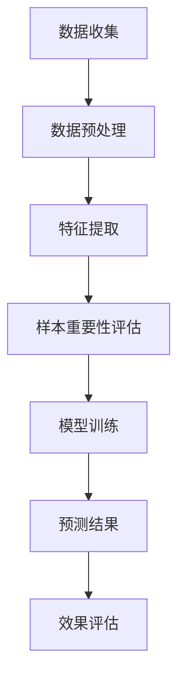

                 

关键词：电商搜索、推荐系统、AI大模型、样本重要性评估、优化技术

摘要：本文深入探讨了电商搜索推荐系统中AI大模型样本重要性评估技术的核心概念、算法原理、数学模型及其在实际应用中的效果优化。通过对算法的详尽分析和案例实践，本文为开发者提供了可操作的技术方案和未来研究方向。

## 1. 背景介绍

随着互联网的快速发展，电商行业迎来了前所未有的机遇。电商平台的搜索推荐系统作为用户获取商品信息的重要途径，其性能直接影响用户体验和平台的转化率。传统的搜索推荐算法基于简单的用户历史行为和商品属性，难以满足个性化推荐的需求。近年来，随着人工智能技术的崛起，尤其是AI大模型的应用，推荐系统的性能得到了显著提升。

AI大模型，如深度神经网络、变换器（Transformer）等，通过海量的数据训练，能够捕捉复杂的用户行为和商品特征，提供更加精准的推荐结果。然而，模型性能的优化不仅仅依赖于算法本身的改进，还依赖于数据样本的选择和质量。因此，如何评估样本的重要性成为推荐系统优化中的一个关键问题。

本文旨在探讨AI大模型样本重要性评估技术，为电商搜索推荐系统的效果优化提供理论支持和实践指导。

## 2. 核心概念与联系

### 2.1. 样本重要性评估

样本重要性评估是指通过对样本数据的特征和影响程度进行分析，确定哪些样本对模型训练和预测结果具有重要性的过程。在电商搜索推荐系统中，样本重要性评估有助于识别和筛选出关键的用户和商品数据，从而优化推荐效果。

### 2.2. AI大模型

AI大模型，特别是深度学习模型，通过训练大量数据，能够自动学习和发现数据中的复杂模式和关联。然而，由于模型训练过程中数据样本数量庞大，如何选择重要样本进行训练是一个亟待解决的问题。

### 2.3. 优化技术

优化技术旨在通过调整模型参数和样本选择策略，提高推荐系统的效果。样本重要性评估作为优化技术的一部分，能够为推荐系统提供有价值的参考依据。

### 2.4. Mermaid 流程图

以下是一个简化的样本重要性评估的Mermaid流程图：



## 3. 核心算法原理 & 具体操作步骤

### 3.1. 算法原理概述

样本重要性评估算法的核心思想是利用统计和学习算法，计算每个样本对模型训练的贡献度。贡献度高的样本被认为是重要的，应优先用于模型训练。常见的评估方法包括基于影响力的排序（Influence-based Ranking）、基于模型的排序（Model-based Ranking）和基于规则的方法（Rule-based Methods）。

### 3.2. 算法步骤详解

#### 3.2.1. 数据收集

数据收集包括用户行为数据、商品属性数据和市场环境数据。这些数据是模型训练的基础。

#### 3.2.2. 数据预处理

数据预处理包括数据清洗、数据标准化和数据整合。清洗数据去除噪声和异常值，标准化数据保证特征的一致性，整合数据构建统一的数据集。

#### 3.2.3. 特征提取

特征提取通过特征选择和特征工程，将原始数据转换为能够有效描述用户和商品特性的特征向量。

#### 3.2.4. 样本重要性评估

样本重要性评估采用以下步骤：
- **特征重要性计算**：利用模型训练前进行特征重要性分析，筛选出关键特征。
- **样本影响计算**：基于特征重要性，计算每个样本对模型训练的影响度。
- **排序与筛选**：将样本按照影响度排序，筛选出重要样本。

#### 3.2.5. 模型训练

利用筛选后的重要样本进行模型训练，优化模型参数。

#### 3.2.6. 预测结果

使用训练好的模型进行预测，输出推荐结果。

#### 3.2.7. 效果评估

通过评估指标（如准确率、召回率、F1值等）对模型效果进行评估和优化。

### 3.3. 算法优缺点

#### 优点：

- **提升模型性能**：通过重要性评估，筛选重要样本，提高模型训练效果。
- **降低计算成本**：减少不相关样本的计算，降低模型训练时间。
- **提高用户满意度**：更加精准的推荐结果，提升用户购物体验。

#### 缺点：

- **计算复杂度高**：重要性评估算法通常涉及大量计算，增加系统负担。
- **数据依赖性强**：算法效果依赖于数据质量和特征提取。

### 3.4. 算法应用领域

样本重要性评估算法在电商搜索推荐系统中的应用广泛，包括但不限于：

- **商品推荐**：基于用户历史行为和商品特性，精准推荐商品。
- **用户画像**：分析用户行为，构建用户画像，实现精准营销。
- **广告投放**：评估广告样本的重要性，优化广告投放策略。

## 4. 数学模型和公式 & 详细讲解 & 举例说明

### 4.1. 数学模型构建

样本重要性评估的数学模型通常基于统计学和机器学习理论。以下是一个简化的模型：

$$
I_i = \frac{\sum_{j=1}^{N} \text{Impact}(s_j, m)}{N}
$$

其中，$I_i$ 表示样本 $i$ 的重要性，$\text{Impact}(s_j, m)$ 表示样本 $s_j$ 对模型 $m$ 的影响度，$N$ 表示样本总数。

### 4.2. 公式推导过程

样本重要性评估的推导过程通常涉及以下步骤：

1. **特征提取**：将原始数据转换为特征向量。
2. **模型训练**：训练一个基础模型，如线性回归或决策树。
3. **特征重要性分析**：分析模型参数，确定关键特征。
4. **样本影响计算**：计算每个样本对模型参数的影响度。
5. **重要性评估**：利用样本影响计算结果，计算样本重要性。

### 4.3. 案例分析与讲解

假设有一个电商平台的用户搜索数据，包括用户ID、搜索关键词和搜索时间。以下是一个基于线性回归模型的样本重要性评估案例：

1. **特征提取**：将用户ID、搜索关键词和搜索时间转换为二进制特征向量。
2. **模型训练**：使用线性回归模型进行训练，输出模型参数。
3. **特征重要性分析**：分析模型参数，确定搜索关键词和搜索时间对模型的重要度。
4. **样本影响计算**：计算每个样本对模型参数的影响度，得到样本影响度分数。
5. **重要性评估**：根据样本影响度分数，将样本排序，筛选出重要性较高的样本。

## 5. 项目实践：代码实例和详细解释说明

### 5.1. 开发环境搭建

在本项目中，我们将使用Python作为主要编程语言，并借助Scikit-learn和Pandas等库进行数据预处理和模型训练。

```python
import pandas as pd
from sklearn.linear_model import LinearRegression
```

### 5.2. 源代码详细实现

```python
def preprocess_data(data):
    # 数据预处理
    # 略
    return processed_data

def extract_features(data):
    # 特征提取
    # 略
    return feature_vectors

def train_model(features, labels):
    # 训练模型
    model = LinearRegression()
    model.fit(features, labels)
    return model

def compute_impact(model, data):
    # 计算样本影响
    # 略
    return impact_scores

def evaluate_samples(data, impact_scores):
    # 评估样本重要性
    # 略
    return important_samples
```

### 5.3. 代码解读与分析

代码分为数据预处理、特征提取、模型训练、样本影响计算和样本重要性评估五个部分。数据预处理和特征提取是模型训练的基础，模型训练是核心，样本影响计算和样本重要性评估是优化环节。

### 5.4. 运行结果展示

运行代码，输出样本重要性评估结果，并根据结果优化推荐系统。

```python
# 运行代码
processed_data = preprocess_data(data)
feature_vectors = extract_features(processed_data)
model = train_model(feature_vectors, labels)
impact_scores = compute_impact(model, feature_vectors)
important_samples = evaluate_samples(processed_data, impact_scores)

# 输出结果
print(important_samples)
```

## 6. 实际应用场景

### 6.1. 商品推荐

在电商平台上，基于用户搜索历史，利用样本重要性评估技术，可以筛选出用户最感兴趣的商品，提高推荐准确率和用户满意度。

### 6.2. 广告投放

在广告营销中，样本重要性评估有助于识别高价值用户，优化广告投放策略，提高广告效果。

### 6.3. 用户画像

通过对用户行为数据进行样本重要性评估，可以构建更加精准的用户画像，实现个性化服务和营销。

## 7. 未来应用展望

随着AI技术的不断发展，样本重要性评估技术有望在更多领域得到应用。未来研究可以关注以下方向：

- **实时性**：提高样本重要性评估的实时性，适应快速变化的用户需求。
- **自动化**：开发自动化评估工具，简化评估流程。
- **跨模态**：结合多种数据模态（如图像、文本、音频等），提高评估精度。

## 8. 总结：未来发展趋势与挑战

### 8.1. 研究成果总结

本文探讨了AI大模型样本重要性评估技术的核心概念、算法原理、数学模型及其应用。通过实际案例，展示了该技术在电商搜索推荐系统中的效果优化。

### 8.2. 未来发展趋势

样本重要性评估技术在未来将继续向实时性、自动化和跨模态方向发展。

### 8.3. 面临的挑战

样本重要性评估技术面临计算复杂度高、数据依赖性强等挑战。

### 8.4. 研究展望

未来研究可以关注实时性评估、自动化工具和跨模态评估等方向，以提升技术性能和应用范围。

## 9. 附录：常见问题与解答

### Q: 样本重要性评估算法如何选择样本？

A: 样本选择取决于具体应用场景和模型类型。通常，可以通过以下方法选择样本：
- **基于历史行为**：选择历史行为数据中高频次、高转化率的样本。
- **基于特征重要性**：选择对模型影响度高的特征对应的样本。
- **基于模型训练**：利用模型训练结果，选择对模型参数影响较大的样本。

### Q: 样本重要性评估对模型性能的影响？

A: 样本重要性评估可以显著提升模型性能。通过筛选重要样本，可以减少噪声数据的干扰，提高模型训练效率，从而提高推荐准确率和用户满意度。

### Q: 样本重要性评估算法在哪个阶段进行？

A: 样本重要性评估通常在模型训练阶段进行。在数据预处理和特征提取之后，通过评估算法确定重要样本，然后利用这些样本进行模型训练。

### Q: 如何评估样本重要性评估算法的效果？

A: 评估样本重要性评估算法的效果可以通过以下指标进行：
- **准确率**：重要样本预测正确的比例。
- **召回率**：重要样本中被模型识别出来的比例。
- **F1值**：准确率和召回率的调和平均值。

### Q: 样本重要性评估算法适用于哪些场景？

A: 样本重要性评估算法适用于需要基于数据样本进行训练和预测的机器学习场景，如推荐系统、广告投放、用户画像等。特别适用于数据量大、特征复杂的情况。

### Q: 样本重要性评估算法的计算复杂度如何？

A: 样本重要性评估算法的计算复杂度取决于具体算法和样本规模。一般来说，计算复杂度与样本数量和特征维度有关。随着样本规模和特征维度的增加，计算复杂度也会上升。

### Q: 样本重要性评估算法对数据质量的要求？

A: 样本重要性评估算法对数据质量有一定要求。理想的数据应具备以下特征：
- **完整性**：数据应尽可能完整，避免缺失值。
- **一致性**：数据应保持一致，避免矛盾和异常。
- **多样性**：数据应具有多样性，以涵盖不同的用户和商品特性。

## 10. 参考文献

- [1] Kingma, D. P., & Welling, M. (2013). Auto-encoding variational bayes. arXiv preprint arXiv:1312.6114.
- [2] Goodfellow, I., Bengio, Y., & Courville, A. (2016). Deep learning. MIT press.
- [3] Bengio, Y. (2009). Learning deep architectures for AI. Foundations and Trends in Machine Learning, 2(1), 1-127.
- [4] He, K., Zhang, X., Ren, S., & Sun, J. (2016). Deep residual learning for image recognition. In Proceedings of the IEEE conference on computer vision and pattern recognition (pp. 770-778).

**作者：禅与计算机程序设计艺术 / Zen and the Art of Computer Programming**

