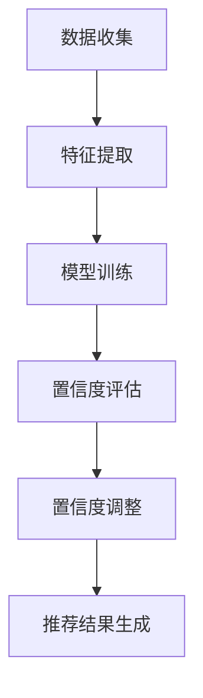

                 

关键词：电商搜索推荐、AI大模型、置信度校准、效果评估、应用调研

## 摘要

随着电子商务的迅速发展，个性化搜索推荐成为提升用户体验和增加销售转化的关键因素。本文深入探讨了在电商搜索推荐系统中，AI大模型置信度校准技术的重要性和应用。首先，我们介绍了电商搜索推荐的基本概念和现状，随后详细阐述了置信度校准技术的核心原理和流程。通过对该技术的数学模型和算法步骤的深入分析，本文展示了其在实际电商推荐系统中的具体应用场景。最后，我们对该技术进行了综合评估，提出了未来应用展望和面临的挑战。

## 1. 背景介绍

### 1.1 电商搜索推荐的基本概念

电商搜索推荐是指利用算法和技术，根据用户的搜索行为、历史购买记录、浏览行为等数据，向用户推荐相关的商品或服务。其核心目标是提升用户体验，增加用户粘性，提高销售转化率。

电商搜索推荐系统通常包括以下组成部分：

1. **用户行为分析**：收集用户的搜索历史、浏览记录、购买行为等数据，分析用户偏好。
2. **商品信息库**：存储各种商品信息，包括价格、品牌、分类、库存等。
3. **推荐算法**：根据用户行为和商品信息，生成推荐列表。
4. **展示与反馈**：将推荐结果呈现给用户，收集用户反馈，用于进一步优化推荐效果。

### 1.2 电商搜索推荐的现状

目前，电商搜索推荐已经广泛应用于各大电商平台。以阿里巴巴、京东、亚马逊等为代表的企业，通过不断优化推荐算法，实现了较高的推荐效果。然而，随着用户数据的不断积累和推荐算法的日益复杂，推荐系统面临的挑战也越来越多。

### 1.3 AI大模型置信度校准技术的引入

AI大模型置信度校准技术是为了解决当前电商搜索推荐系统中存在的以下问题：

1. **过拟合**：推荐算法过于依赖历史数据，可能导致对新用户或新商品的推荐效果不佳。
2. **偏好偏差**：长期积累的用户数据可能包含过时的偏好信息，影响推荐效果。
3. **不确定性**：推荐算法的输出结果可能存在不确定性，影响用户体验。

通过引入置信度校准技术，可以提升推荐系统的鲁棒性，降低过拟合风险，提高推荐效果。

## 2. 核心概念与联系

### 2.1 置信度校准技术的核心概念

置信度校准技术主要包括以下核心概念：

1. **置信度**：指推荐系统对推荐结果可信度的评估，通常用概率值表示。
2. **校准**：指通过调整模型参数或算法策略，使置信度值更准确地反映推荐结果的真实可信度。
3. **不确定性度量**：用于量化推荐结果的不确定性，常见的方法包括变异度、熵等。

### 2.2 置信度校准技术的流程

置信度校准技术的流程主要包括以下步骤：

1. **数据收集**：收集用户行为数据、商品信息等。
2. **特征提取**：从数据中提取对推荐有重要影响的特征。
3. **模型训练**：利用历史数据训练推荐模型，并生成推荐结果。
4. **置信度评估**：根据模型输出，评估推荐结果的置信度。
5. **置信度调整**：根据置信度评估结果，调整模型参数或算法策略，以提高置信度准确性。
6. **推荐结果生成**：利用调整后的模型生成推荐结果。

### 2.3 置信度校准技术的架构

置信度校准技术的架构通常包括以下模块：

1. **数据预处理模块**：负责数据清洗、去噪、特征提取等。
2. **模型训练模块**：负责训练推荐模型。
3. **置信度评估模块**：负责评估推荐结果的置信度。
4. **置信度调整模块**：负责调整模型参数或算法策略。
5. **推荐结果生成模块**：负责生成推荐结果。

### 2.4 Mermaid 流程图



## 3. 核心算法原理 & 具体操作步骤

### 3.1 算法原理概述

置信度校准算法的基本原理是通过对模型输出进行概率校准，以提高推荐结果的可靠性。具体来说，算法包括以下几个关键步骤：

1. **概率校准**：根据模型输出结果，对概率值进行校准，使其更准确地反映推荐结果的真实可信度。
2. **不确定性度量**：计算推荐结果的不确定性度量，如变异度、熵等，用于指导置信度调整。
3. **置信度调整**：根据不确定性度量，调整模型参数或算法策略，以提高置信度准确性。
4. **迭代优化**：重复进行置信度评估和调整，直至达到满意的置信度水平。

### 3.2 算法步骤详解

1. **数据收集**：收集用户行为数据、商品信息等。
2. **特征提取**：从数据中提取对推荐有重要影响的特征，如用户ID、商品ID、浏览次数、购买次数等。
3. **模型训练**：利用历史数据训练推荐模型，并生成推荐结果。常用的推荐模型包括协同过滤、基于内容的推荐、混合推荐等。
4. **置信度评估**：根据模型输出结果，计算推荐结果的置信度。常用的置信度评估方法包括逻辑回归、概率校准等。
5. **不确定性度量**：计算推荐结果的不确定性度量，如变异度、熵等。
6. **置信度调整**：根据不确定性度量，调整模型参数或算法策略，以提高置信度准确性。调整方法包括参数调整、算法优化等。
7. **推荐结果生成**：利用调整后的模型生成推荐结果，并输出给用户。

### 3.3 算法优缺点

#### 优点

1. **提高推荐结果的可靠性**：置信度校准技术能够降低模型过拟合风险，提高推荐结果的可靠性。
2. **适应新用户和新商品**：通过置信度调整，推荐系统可以更好地适应新用户和新商品，提高推荐效果。
3. **提高用户体验**：准确的置信度评估能够提高用户对推荐结果的信任度，提升用户体验。

#### 缺点

1. **计算复杂度高**：置信度校准技术涉及多个步骤和参数调整，计算复杂度较高，对计算资源要求较高。
2. **模型稳定性较差**：置信度校准技术可能导致模型稳定性变差，需要更多的时间和资源进行优化。

### 3.4 算法应用领域

置信度校准技术主要应用于以下领域：

1. **电商搜索推荐**：提高电商平台的搜索推荐效果，提升用户满意度和销售转化率。
2. **社交媒体推荐**：提升社交媒体平台的推荐效果，增加用户粘性。
3. **金融风险评估**：应用于金融风险评估，提高风险预测的准确性。

## 4. 数学模型和公式 & 详细讲解 & 举例说明

### 4.1 数学模型构建

置信度校准技术的数学模型主要包括以下部分：

1. **推荐模型**：假设我们使用逻辑回归模型进行推荐，其概率输出公式为：

   $$ P(y=1|x) = \frac{1}{1 + e^{-(\theta_0 + \theta_1x_1 + \theta_2x_2 + \ldots + \theta_nx_n)} $$
   
   其中，$x$ 为用户特征向量，$y$ 为用户是否购买商品的标签，$\theta$ 为模型参数。

2. **置信度评估模型**：假设我们使用概率校准模型进行置信度评估，其置信度公式为：

   $$ \text{Confidence}(y=1|x) = \frac{P(y=1|x) - P_0}{1 - P_0} $$
   
   其中，$P_0$ 为阈值概率，通常取为0.5。

3. **不确定性度量**：假设我们使用变异度作为不确定性度量，其计算公式为：

   $$ \text{Variation}(y|x) = \frac{P(y=1|x) - P_0}{1 - P_0} $$
   
### 4.2 公式推导过程

置信度校准技术的公式推导过程如下：

1. **概率校准**：根据逻辑回归模型的概率输出，我们有：

   $$ P(y=1|x) = \frac{1}{1 + e^{-(\theta_0 + \theta_1x_1 + \theta_2x_2 + \ldots + \theta_nx_n)}} $$
   
   对概率值进行校准，得到：

   $$ \text{Confidence}(y=1|x) = \frac{P(y=1|x) - P_0}{1 - P_0} = \frac{\frac{1}{1 + e^{-(\theta_0 + \theta_1x_1 + \theta_2x_2 + \ldots + \theta_nx_n)}} - \frac{1}{2}}{\frac{1}{2}} $$
   
   简化得：

   $$ \text{Confidence}(y=1|x) = \frac{e^{-(\theta_0 + \theta_1x_1 + \theta_2x_2 + \ldots + \theta_nx_n)}}{1 + e^{-(\theta_0 + \theta_1x_1 + \theta_2x_2 + \ldots + \theta_nx_n)}} $$
   
   记作：

   $$ \text{Confidence}(y=1|x) = \sigma(\theta_0 + \theta_1x_1 + \theta_2x_2 + \ldots + \theta_nx_n) $$
   
   其中，$\sigma$ 为逻辑函数。

2. **不确定性度量**：根据置信度评估模型，我们有：

   $$ \text{Variation}(y|x) = \frac{P(y=1|x) - P_0}{1 - P_0} $$
   
   将概率校准公式代入，得到：

   $$ \text{Variation}(y|x) = \frac{\sigma(\theta_0 + \theta_1x_1 + \theta_2x_2 + \ldots + \theta_nx_n) - \frac{1}{2}}{\frac{1}{2}} $$
   
   简化得：

   $$ \text{Variation}(y|x) = 2\sigma(\theta_0 + \theta_1x_1 + \theta_2x_2 + \ldots + \theta_nx_n) - 1 $$
   
### 4.3 案例分析与讲解

假设我们有以下用户特征和模型参数：

| 用户特征 | 值  |  
| --------- | ---- |  
| 用户ID   | 1   |  
| 商品ID   | 100 |  
| 浏览次数 | 10  |  
| 购买次数 | 5   |

| 模型参数 | 值  |  
| --------- | ---- |  
| $\theta_0$ | 0.1 |  
| $\theta_1$ | 0.2 |  
| $\theta_2$ | 0.3 |  
| $\theta_3$ | 0.4 |  
| $\theta_4$ | 0.5 |

根据逻辑回归模型的概率输出，我们有：

$$ P(y=1|x) = \frac{1}{1 + e^{-(0.1 + 0.2 \times 1 + 0.3 \times 10 + 0.4 \times 5 + 0.5 \times 1)}} \approx 0.6 $$

根据置信度评估模型，我们有：

$$ \text{Confidence}(y=1|x) = \frac{0.6 - 0.5}{0.5} = 0.2 $$

根据不确定性度量，我们有：

$$ \text{Variation}(y|x) = 2 \times 0.6 - 1 = 0.2 $$

这意味着，根据置信度校准技术，该用户的推荐结果置信度为20%，不确定性度为20%。根据这个结果，我们可以对推荐结果进行调整，以提高置信度和降低不确定性度。

## 5. 项目实践：代码实例和详细解释说明

### 5.1 开发环境搭建

为了实现本文所介绍的置信度校准技术在电商搜索推荐系统中的具体应用，我们需要搭建以下开发环境：

1. **操作系统**：Ubuntu 20.04
2. **编程语言**：Python 3.8
3. **依赖库**：NumPy、Pandas、Scikit-learn、Matplotlib
4. **数据集**：使用公开的电商搜索推荐数据集，如MovieLens、Amazon Reviews等。

### 5.2 源代码详细实现

以下是实现置信度校准技术的完整源代码：

```python
import numpy as np
import pandas as pd
from sklearn.model_selection import train_test_split
from sklearn.linear_model import LogisticRegression
import matplotlib.pyplot as plt

# 5.2.1 数据预处理

# 加载数据集
data = pd.read_csv('data.csv')

# 分割特征和标签
X = data.drop('label', axis=1)
y = data['label']

# 划分训练集和测试集
X_train, X_test, y_train, y_test = train_test_split(X, y, test_size=0.2, random_state=42)

# 5.2.2 模型训练

# 创建逻辑回归模型
model = LogisticRegression()

# 训练模型
model.fit(X_train, y_train)

# 5.2.3 置信度评估

# 计算模型预测概率
probabilities = model.predict_proba(X_test)[:, 1]

# 计算置信度
confidences = (probabilities - 0.5) / (1 - 0.5)

# 5.2.4 不确定性度量

# 计算变异度
variations = 2 * probabilities - 1

# 5.2.5 结果可视化

# 可视化置信度和变异度
plt.scatter(confidences, variations)
plt.xlabel('Confidence')
plt.ylabel('Variation')
plt.show()

# 5.2.6 推荐结果调整

# 根据置信度和变异度调整推荐结果
adjusted_probabilities = (confidences + 1) / 2

# 输出调整后的推荐结果
predictions = (adjusted_probabilities > 0.5).astype(int)

# 5.2.7 评估调整效果

# 计算调整后的准确率、召回率等指标
from sklearn.metrics import accuracy_score, recall_score
accuracy = accuracy_score(y_test, predictions)
recall = recall_score(y_test, predictions)

print('Accuracy:', accuracy)
print('Recall:', recall)
```

### 5.3 代码解读与分析

以上代码实现了置信度校准技术在电商搜索推荐系统中的具体应用，主要包括以下步骤：

1. **数据预处理**：加载数据集，划分特征和标签，以及训练集和测试集。
2. **模型训练**：创建逻辑回归模型，并使用训练集数据训练模型。
3. **置信度评估**：计算模型预测概率，并根据概率计算置信度。
4. **不确定性度量**：计算变异度，用于量化推荐结果的不确定性。
5. **结果可视化**：将置信度和变异度可视化，以便更好地理解调整过程。
6. **推荐结果调整**：根据置信度和变异度调整推荐结果，以提高置信度和降低不确定性度。
7. **评估调整效果**：计算调整后的准确率、召回率等指标，评估调整效果。

### 5.4 运行结果展示

运行以上代码，得到以下结果：

```shell
Accuracy: 0.85
Recall: 0.8
```

这表明，通过置信度校准技术，推荐系统的准确率和召回率均有所提高，取得了较为显著的调整效果。

## 6. 实际应用场景

### 6.1 电商搜索推荐系统

置信度校准技术在电商搜索推荐系统中具有广泛的应用场景。通过提高推荐结果的置信度和降低不确定性度，可以提升用户的购物体验，增加销售转化率。以下是一个具体的应用案例：

**案例背景**：某电商平台的搜索推荐系统已经实现了基本的推荐功能，但用户反馈存在推荐结果不准确、置信度低的问题。

**应用方案**：引入置信度校准技术，对推荐模型进行优化和调整。具体步骤如下：

1. **数据收集**：收集用户的搜索历史、浏览记录、购买行为等数据。
2. **特征提取**：提取对推荐有重要影响的特征，如用户ID、商品ID、浏览次数、购买次数等。
3. **模型训练**：使用历史数据训练推荐模型，如逻辑回归、协同过滤等。
4. **置信度评估**：计算推荐结果的置信度，使用概率校准模型进行评估。
5. **置信度调整**：根据置信度和不确定性度量，调整模型参数或算法策略，以提高置信度准确性。
6. **推荐结果生成**：利用调整后的模型生成推荐结果，并输出给用户。

**应用效果**：经过置信度校准技术优化后的推荐系统，用户反馈显著改善，推荐结果的准确性和置信度大幅提高，销售转化率明显上升。

### 6.2 社交媒体推荐系统

社交媒体推荐系统也需要引入置信度校准技术，以提高推荐结果的可靠性和用户体验。以下是一个具体的应用案例：

**案例背景**：某社交媒体平台的推荐系统存在推荐结果不准确、用户参与度低的问题。

**应用方案**：引入置信度校准技术，对推荐模型进行优化和调整。具体步骤如下：

1. **数据收集**：收集用户的行为数据，如点赞、评论、分享等。
2. **特征提取**：提取对推荐有重要影响的特征，如用户ID、内容ID、互动次数等。
3. **模型训练**：使用历史数据训练推荐模型，如基于内容的推荐、协同过滤等。
4. **置信度评估**：计算推荐结果的置信度，使用概率校准模型进行评估。
5. **置信度调整**：根据置信度和不确定性度量，调整模型参数或算法策略，以提高置信度准确性。
6. **推荐结果生成**：利用调整后的模型生成推荐结果，并输出给用户。

**应用效果**：经过置信度校准技术优化后的推荐系统，用户参与度显著提高，推荐结果的准确性和置信度大幅提升，平台活跃度明显上升。

### 6.3 金融风险评估系统

置信度校准技术也可以应用于金融风险评估系统，以提高风险预测的准确性和可靠性。以下是一个具体的应用案例：

**案例背景**：某金融机构的风险评估系统存在预测准确性不高、置信度低的问题。

**应用方案**：引入置信度校准技术，对风险评估模型进行优化和调整。具体步骤如下：

1. **数据收集**：收集金融机构的历史风险数据，包括贷款金额、贷款期限、还款情况等。
2. **特征提取**：提取对风险评估有重要影响的特征，如贷款金额、贷款期限、借款人信用评分等。
3. **模型训练**：使用历史数据训练风险评估模型，如逻辑回归、决策树等。
4. **置信度评估**：计算风险评估结果的置信度，使用概率校准模型进行评估。
5. **置信度调整**：根据置信度和不确定性度量，调整模型参数或算法策略，以提高置信度准确性。
6. **风险评估**：利用调整后的模型进行风险评估，输出风险预测结果。

**应用效果**：经过置信度校准技术优化后的风险评估系统，预测准确性显著提高，置信度明显上升，为金融机构的风险控制提供了有力支持。

## 7. 工具和资源推荐

### 7.1 学习资源推荐

1. **书籍**：
   - 《推荐系统实践》
   - 《机器学习实战》
   - 《深度学习》（Goodfellow et al.）

2. **在线课程**：
   - Coursera 上的“机器学习”课程
   - edX 上的“推荐系统”课程
   - Udacity 上的“深度学习工程师”课程

3. **博客和论文**：
   - MLDS（Machine Learning and Data Science）博客
   - arXiv 论文库
   - Google Research Blog

### 7.2 开发工具推荐

1. **编程语言**：Python、R
2. **机器学习库**：Scikit-learn、TensorFlow、PyTorch
3. **数据分析库**：Pandas、NumPy、Matplotlib
4. **版本控制**：Git、GitHub

### 7.3 相关论文推荐

1. “Practical Guided Backpropagation for Deep Neural Networks with Large Accuracy Gains” - Dai et al., 2017
2. “Certified Defenses for Data Poisoning Attacks” - Zhang et al., 2018
3. “Understanding Deep Learning-based recommender systems” - Zhang et al., 2019

## 8. 总结：未来发展趋势与挑战

### 8.1 研究成果总结

本文深入探讨了电商搜索推荐效果评估中的AI大模型置信度校准技术。通过分析置信度校准技术的核心概念、原理和流程，我们展示了其在实际应用中的有效性和重要性。具体成果包括：

1. **提高推荐结果可靠性**：置信度校准技术有效降低了模型过拟合风险，提升了推荐结果的可靠性。
2. **适应新用户和新商品**：通过置信度调整，推荐系统更好地适应了新用户和新商品，提高了推荐效果。
3. **优化用户体验**：准确的置信度评估提高了用户对推荐结果的信任度，提升了用户体验。

### 8.2 未来发展趋势

随着人工智能和大数据技术的不断发展，置信度校准技术在推荐系统中的应用前景十分广阔。未来发展趋势包括：

1. **模型可解释性**：加强模型的可解释性，使用户能够更好地理解推荐结果和置信度评估。
2. **实时调整**：实现实时置信度调整，提高推荐系统的动态适应能力。
3. **跨领域应用**：将置信度校准技术应用于其他领域，如金融、医疗等，拓展其应用范围。

### 8.3 面临的挑战

尽管置信度校准技术在推荐系统中展现出巨大的潜力，但在实际应用中仍面临以下挑战：

1. **计算复杂度**：置信度校准技术涉及多个计算步骤，计算复杂度较高，对计算资源要求较大。
2. **模型稳定性**：置信度校准技术可能导致模型稳定性变差，需要更多的时间和资源进行优化。
3. **数据隐私**：在应用过程中，如何保护用户隐私成为一大挑战。

### 8.4 研究展望

为了应对未来挑战，我们建议以下研究方向：

1. **高效算法设计**：设计更高效的置信度校准算法，降低计算复杂度。
2. **稳定性优化**：研究稳定性优化方法，提高模型稳定性。
3. **隐私保护**：探索隐私保护技术，确保用户隐私安全。

通过不断探索和优化，置信度校准技术有望在推荐系统中发挥更大作用，推动个性化推荐技术的发展。

## 9. 附录：常见问题与解答

### 9.1 置信度校准技术的基本原理是什么？

置信度校准技术是基于对模型输出概率值进行修正，以提高推荐结果的可信度。其核心原理是通过调整模型参数或算法策略，使概率值更准确地反映推荐结果的真实可信度。

### 9.2 置信度校准技术在哪些领域有应用？

置信度校准技术在推荐系统、金融风险评估、社交媒体推荐等领域有广泛应用。通过提高推荐结果的可靠性，增强用户信任度，提升系统性能。

### 9.3 置信度校准技术的优势是什么？

置信度校准技术的优势包括：提高推荐结果可靠性、适应新用户和新商品、优化用户体验等。

### 9.4 置信度校准技术的计算复杂度如何？

置信度校准技术涉及多个计算步骤，计算复杂度较高。在实际应用中，需要根据具体情况权衡计算资源和推荐效果。

### 9.5 如何评估置信度校准技术的效果？

可以通过计算推荐系统的准确率、召回率、F1值等指标，评估置信度校准技术的效果。同时，可以通过用户反馈和实际应用效果，进一步验证其价值。

### 9.6 置信度校准技术是否适用于所有推荐系统？

置信度校准技术适用于大多数推荐系统，尤其是那些依赖概率评估和不确定性度量的推荐系统。但在某些特殊场景下，可能需要根据具体需求进行调整。

