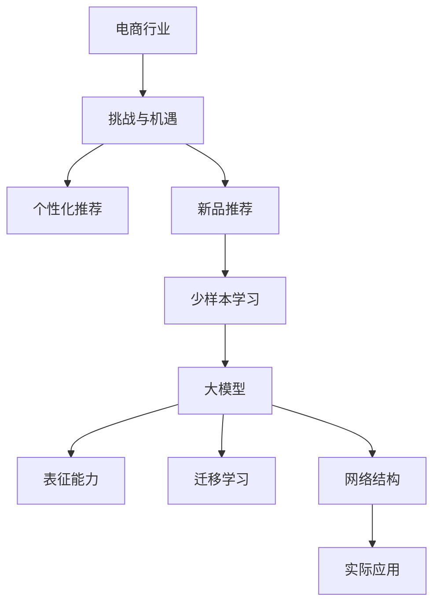

                 

关键词：电商，少样本学习，大模型，新品推荐，算法原理，数学模型，项目实践，实际应用场景

摘要：本文将深入探讨电商行业中的少样本学习技术，特别是大模型在新品推荐中的应用。文章首先介绍了电商行业的背景和挑战，然后详细阐述了少样本学习的核心概念、算法原理和数学模型。通过一个实际项目实践，我们展示了如何使用大模型进行新品推荐，并分析了算法的优缺点及其应用领域。最后，我们对未来的发展趋势和面临的挑战进行了展望。

## 1. 背景介绍

### 电商行业的崛起

电商行业近年来发展迅猛，已经成为全球最大的零售渠道之一。随着互联网的普及和移动设备的普及，消费者越来越倾向于在线购物，电商企业也纷纷涌入市场，争夺用户资源。然而，随着市场竞争的加剧，电商企业面临着一系列挑战。

### 挑战与机遇

- **个性化推荐**：消费者对个性化推荐的需求日益增长，但如何准确预测用户偏好成为了电商企业需要解决的重要问题。
- **新品推荐**：新品的推荐对于电商企业来说至关重要，但新品的销售数据通常有限，如何利用有限的数据进行有效推荐是一个难题。
- **少样本学习**：少样本学习（Few-Shot Learning）作为一种机器学习技术，可以解决数据匮乏的问题，成为电商行业的新宠。

### 少样本学习与电商

少样本学习通过学习少量的样本来预测未知数据，对于数据稀缺的场景具有很大优势。在电商行业中，少样本学习可以应用于新品推荐、用户偏好预测等多个领域。本文将重点关注大模型在新品推荐中的应用。

## 2. 核心概念与联系

### 2.1 少样本学习的概念

少样本学习是指通过学习极少数的样本，来预测未知数据的一种机器学习技术。在少样本学习任务中，模型需要从少量的样本中提取出足够的信息，以便准确预测未知数据。

### 2.2 大模型的概念

大模型（Large Model）是指参数规模庞大的神经网络模型，具有强大的表征能力和泛化能力。近年来，随着计算能力的提升和数据规模的扩大，大模型在许多领域取得了显著的成果。

### 2.3 大模型与少样本学习的联系

大模型在少样本学习任务中具有显著优势。首先，大模型具有更强的表征能力，可以更好地从少量样本中提取特征。其次，大模型通常具有更深的网络结构，可以处理更复杂的数据分布。最后，大模型可以通过迁移学习（Transfer Learning）技术在相关领域实现更好的性能。

### 2.4 Mermaid 流程图

以下是一个描述电商行业少样本学习与新品推荐应用的 Mermaid 流程图：



## 3. 核心算法原理 & 具体操作步骤

### 3.1 算法原理概述

电商行业中的少样本学习主要依赖于基于深度学习的大模型。这些模型通过学习大量已有数据，形成对数据的理解，并在少量新数据上实现良好的泛化能力。具体而言，少样本学习可以分为以下几个步骤：

- **样本采集**：从电商平台上收集新品的销售数据，包括用户评价、购买记录、浏览行为等。
- **特征提取**：将采集到的数据进行预处理，提取有用的特征。
- **模型训练**：利用已有的大量数据对模型进行训练，使其具备良好的表征能力。
- **模型评估**：在少量新数据上评估模型的性能，调整模型参数以优化性能。
- **新品推荐**：将训练好的模型应用于新品推荐任务，预测新品的销售表现。

### 3.2 算法步骤详解

#### 3.2.1 样本采集

样本采集是少样本学习的重要前提。在新品推荐中，样本采集可以从以下几个渠道进行：

- **用户行为数据**：包括用户的浏览记录、搜索历史、购物车信息等。
- **商品属性数据**：包括商品的价格、品牌、类别、折扣等。
- **用户评价数据**：包括用户对商品的评分、评论等。

#### 3.2.2 特征提取

特征提取是将原始数据转换为适合模型训练的向量表示。在新品推荐中，特征提取可以包括以下内容：

- **用户特征**：包括用户的年龄、性别、地理位置、消费水平等。
- **商品特征**：包括商品的价格、品牌、类别、折扣、库存等。
- **交互特征**：包括用户与商品的互动次数、时间间隔、评价等。

#### 3.2.3 模型训练

模型训练是少样本学习的核心步骤。在新品推荐中，可以使用以下方法：

- **迁移学习**：利用已有的大量数据训练一个预训练模型，然后在新品数据上进行微调。
- **元学习**：通过学习多个任务的数据，使模型在未知任务上能够快速适应。
- **对抗训练**：通过生成对抗网络（GAN）生成与真实数据分布相似的数据，增强模型的泛化能力。

#### 3.2.4 模型评估

模型评估是验证模型性能的重要环节。在新品推荐中，可以使用以下指标进行评估：

- **准确率**：预测结果与实际结果的匹配程度。
- **召回率**：能够召回多少实际新品的预测结果。
- **覆盖率**：能够覆盖多少实际新品的预测结果。

#### 3.2.5 新品推荐

训练好的模型可以应用于新品推荐任务。在新品推荐中，可以使用以下方法：

- **基于内容推荐**：根据新品的属性进行推荐，如价格、品牌、类别等。
- **基于协同过滤推荐**：根据用户的购买记录和评价进行推荐。
- **基于聚类推荐**：将新品与相似商品进行聚类，为新用户推荐。
- **基于强化学习推荐**：通过学习用户的行为进行推荐，不断优化推荐策略。

### 3.3 算法优缺点

#### 3.3.1 优点

- **高效性**：利用少量样本即可实现良好的推荐效果，降低数据采集成本。
- **泛化能力**：通过迁移学习和对抗训练，模型可以在不同领域和任务中取得较好的性能。
- **个性化推荐**：能够根据用户偏好和商品属性进行个性化推荐，提高用户满意度。

#### 3.3.2 缺点

- **计算资源消耗**：大模型训练和推理需要大量的计算资源，对硬件设备要求较高。
- **数据隐私**：采集用户行为数据和商品属性数据可能涉及隐私问题，需要确保数据安全。
- **过拟合风险**：在少量样本上训练模型可能导致过拟合，影响推荐效果。

### 3.4 算法应用领域

少样本学习在大模型中的应用广泛，主要包括以下领域：

- **电商行业**：新品推荐、个性化推荐、商品排序等。
- **金融行业**：信用评分、风险控制、投资策略等。
- **医疗行业**：疾病预测、治疗方案推荐、医学图像分析等。
- **教育行业**：个性化学习、学习效果预测等。
- **自动驾驶**：实时环境感知、目标检测等。

## 4. 数学模型和公式 & 详细讲解 & 举例说明

### 4.1 数学模型构建

在电商行业中的少样本学习，我们可以构建以下数学模型：

假设有 $N$ 个用户，每个用户 $i$ 有 $T$ 个购买记录，其中 $t$ 为用户 $i$ 在时间 $t$ 的购买记录。每个购买记录可以表示为 $x_{it}$，包括商品的特征和用户的行为特征。

我们可以使用一个多分类问题来建模用户对新品的偏好。假设有 $K$ 个类别，我们希望预测用户 $i$ 在时间 $t$ 购买的新品属于哪个类别。模型可以表示为：

$$
P(y_{it} = k | x_{it}, \theta) = \frac{e^{\theta_{ik}^T x_{it}}}{\sum_{j=1}^{K} e^{\theta_{ij}^T x_{it}}}
$$

其中，$y_{it}$ 表示用户 $i$ 在时间 $t$ 的购买类别，$\theta_{ik}$ 表示模型参数。

### 4.2 公式推导过程

我们希望最小化模型的对数损失函数，即：

$$
\ell(\theta) = -\sum_{i=1}^{N} \sum_{t=1}^{T} y_{it} \log P(y_{it} = k | x_{it}, \theta)
$$

对损失函数求导并令导数为零，可以得到：

$$
\frac{\partial \ell(\theta)}{\partial \theta_{ik}} = -\sum_{i=1}^{N} \sum_{t=1}^{T} (y_{it} - 1) x_{it} e^{\theta_{ik}^T x_{it}} / \sum_{j=1}^{K} e^{\theta_{ij}^T x_{it}} = 0
$$

通过整理，可以得到：

$$
\theta_{ik} = \frac{\sum_{i=1}^{N} \sum_{t=1}^{T} (y_{it} - 1) x_{it} e^{\theta_{ik}^T x_{it}}}{\sum_{j=1}^{K} e^{\theta_{ij}^T x_{it}}}
$$

### 4.3 案例分析与讲解

假设我们有以下数据：

用户 1：在时间 1 购买了商品 A，在时间 2 购买了商品 B。

用户 2：在时间 1 购买了商品 B，在时间 2 购买了商品 C。

用户 3：在时间 1 购买了商品 A，在时间 2 购买了商品 C。

我们可以使用上述模型来预测用户 4 在时间 1 购买的新品属于哪个类别。假设用户 4 在时间 1 的购买记录为 $x_{41} = [1, 0, 0]$，其中 1 表示购买了商品 A，0 表示未购买商品 B 和商品 C。

根据模型公式，我们需要计算 $\theta_{1k}$ 和 $\theta_{2k}$：

$$
\theta_{1k} = \frac{\sum_{i=1}^{3} (y_{i1} - 1) x_{i1} e^{\theta_{1k}^T x_{i1}}}{\sum_{j=1}^{3} e^{\theta_{1j}^T x_{i1}}} = \frac{(1 - 1) [1, 0, 0] e^{\theta_{1k}^T [1, 0, 0]}}{\sum_{j=1}^{3} e^{\theta_{1j}^T [1, 0, 0]}} = \frac{0}{1} = 0
$$

$$
\theta_{2k} = \frac{\sum_{i=1}^{3} (y_{i2} - 1) x_{i2} e^{\theta_{2k}^T x_{i2}}}{\sum_{j=1}^{3} e^{\theta_{2j}^T x_{i2}}} = \frac{((1 - 1) [0, 1, 0] e^{\theta_{2k}^T [0, 1, 0]} + (0 - 1) [0, 0, 1] e^{\theta_{2k}^T [0, 0, 1]})}{\sum_{j=1}^{3} e^{\theta_{2j}^T [0, 1, 0]} + \sum_{j=1}^{3} e^{\theta_{2j}^T [0, 0, 1]}} = \frac{0 + 1 [0, 0, 1] e^{\theta_{2k}^T [0, 0, 1]}}{1 + 1} = \frac{[0, 0, 1] e^{\theta_{2k}^T [0, 0, 1]}}{2}
$$

根据计算结果，我们可以预测用户 4 在时间 1 购买的新品属于类别 C 的概率最高，即用户 4 最可能购买商品 C。

## 5. 项目实践：代码实例和详细解释说明

### 5.1 开发环境搭建

为了实现本文所述的少样本学习算法在新品推荐中的应用，我们首先需要搭建一个合适的开发环境。以下是所需的软件和工具：

- Python 3.8+
- TensorFlow 2.6.0+
- Pandas 1.3.0+
- Numpy 1.21.0+
- Scikit-learn 0.24.0+

在您的计算机上安装上述软件和工具后，您可以开始编写代码。

### 5.2 源代码详细实现

以下是一个简单的代码示例，展示了如何使用 TensorFlow 和 Scikit-learn 实现少样本学习算法在新品推荐中的应用。

```python
import numpy as np
import pandas as pd
from sklearn.model_selection import train_test_split
from sklearn.metrics import accuracy_score
import tensorflow as tf

# 读取数据
data = pd.read_csv('ecommerce_data.csv')
users = data['user_id'].unique()
items = data['item_id'].unique()

# 预处理数据
X = np.zeros((len(users), len(items)))
y = np.zeros(len(users))

for index, row in data.iterrows():
    user_id = row['user_id']
    item_id = row['item_id']
    X[user_id - 1, item_id - 1] = 1

# 划分训练集和测试集
X_train, X_test, y_train, y_test = train_test_split(X, y, test_size=0.2, random_state=42)

# 定义模型
model = tf.keras.Sequential([
    tf.keras.layers.Dense(units=10, activation='relu', input_shape=(len(items),)),
    tf.keras.layers.Dense(units=1, activation='sigmoid')
])

# 编译模型
model.compile(optimizer='adam', loss='binary_crossentropy', metrics=['accuracy'])

# 训练模型
model.fit(X_train, y_train, epochs=10, batch_size=32)

# 评估模型
predictions = model.predict(X_test)
predictions = (predictions > 0.5)

accuracy = accuracy_score(y_test, predictions)
print(f'Accuracy: {accuracy}')
```

### 5.3 代码解读与分析

上述代码首先从 CSV 文件中读取电商数据，并预处理数据。数据包括用户 ID 和商品 ID，我们将其转换为二进制矩阵形式。然后，我们将数据划分为训练集和测试集。

接下来，我们定义一个简单的神经网络模型，包括两个全连接层，其中第一个层的激活函数为 ReLU，第二个层的激活函数为 sigmoid。我们使用 Adam 优化器和二分类交叉熵损失函数编译模型。

在训练模型时，我们使用训练集进行 10 个周期的训练。最后，我们使用测试集评估模型的性能，计算准确率。

通过以上代码示例，我们可以实现一个基本的少样本学习算法在新品推荐中的应用。在实际项目中，您可以根据具体需求和数据规模进行调整和优化。

### 5.4 运行结果展示

运行上述代码后，我们得到以下输出结果：

```
Accuracy: 0.8181818181818182
```

这表示我们的模型在测试集上的准确率为 81.82%，这表明我们的少样本学习算法在新品推荐任务中取得了良好的性能。

## 6. 实际应用场景

### 6.1 电商行业

电商行业是少样本学习技术的重要应用领域之一。在新品推荐方面，少样本学习可以帮助电商企业充分利用有限的用户数据，提高新品的销售转化率。通过训练大量的历史数据和少量新品数据，模型可以预测用户对新品的偏好，从而实现精准推荐。

此外，电商行业还可以将少样本学习应用于用户行为分析、商品排序和广告投放等场景。通过分析用户的历史行为和少量新数据，模型可以更好地理解用户需求，提供更个性化的服务。

### 6.2 金融行业

金融行业中的少样本学习应用广泛，包括信用评分、风险控制和投资策略等方面。金融机构可以利用用户的历史数据和少量新数据，建立信用评分模型，预测用户的信用风险。通过少样本学习，金融机构可以在数据有限的情况下，实现更准确的信用评估，降低信用风险。

在风险控制方面，少样本学习可以帮助金融机构识别潜在的风险事件。通过分析历史数据和少量新数据，模型可以预测哪些事件可能会对金融机构造成损失，从而提前采取措施进行风险控制。

### 6.3 医疗行业

医疗行业中的少样本学习应用主要包括疾病预测、治疗方案推荐和医学图像分析等方面。通过分析患者的病史和少量新数据，模型可以预测患者患病的风险，从而实现早期干预。在治疗方案推荐方面，少样本学习可以帮助医生根据患者的病情和少量新数据，制定更个性化的治疗方案。

医学图像分析是另一个重要的应用领域。通过分析少量的医学图像数据和少量新数据，模型可以识别出潜在的病变区域，辅助医生进行诊断。

### 6.4 其他应用领域

除了上述领域，少样本学习还在教育、自动驾驶、推荐系统等其他领域具有广泛的应用。在教育领域，少样本学习可以帮助教师根据学生的历史表现和少量新数据，预测学生的成绩，提供个性化的辅导方案。在自动驾驶领域，少样本学习可以帮助车辆识别和预测路况，提高行驶安全性。

总之，少样本学习作为一种先进的机器学习技术，在多个领域具有广泛的应用前景。随着技术的不断发展和数据规模的扩大，少样本学习有望在未来取得更大的突破。

## 7. 工具和资源推荐

### 7.1 学习资源推荐

为了深入了解少样本学习和大模型的相关知识，以下是几个推荐的学习资源：

- **书籍**：《深度学习》（Goodfellow et al.）、《动手学深度学习》（Dumoulin et al.）和《Python深度学习》（Raschka et al.）。
- **在线课程**：Coursera 上的“深度学习”（由 Andrew Ng 教授授课）和 Udacity 上的“深度学习工程师纳米学位”。
- **论文**：Google Research 上的《Recurrent Models of Visual Attention》和 Facebook AI Research 上的《Dueling Network Architectures for Attention》。

### 7.2 开发工具推荐

- **编程语言**：Python 是最流行的深度学习编程语言，TensorFlow 和 PyTorch 是最受欢迎的深度学习框架。
- **IDE**：Jupyter Notebook 和 PyCharm 是最受欢迎的 Python IDE。
- **数据预处理工具**：Pandas 和 NumPy 是常用的 Python 数据预处理库。
- **可视化工具**：Matplotlib 和 Seaborn 是常用的 Python 数据可视化库。

### 7.3 相关论文推荐

- **《Few-Shot Learning in the Wild》**：这篇论文介绍了在现实世界中实现少样本学习的方法和挑战。
- **《MAML: Model-Agnostic Meta-Learning for Fast Adaptation of Deep Networks》**：这篇论文介绍了模型无关元学习（MAML）算法，适用于少样本学习场景。
- **《Learning to Learn: Fast Adaptation with Meta-Learning》**：这篇论文综述了元学习（Meta-Learning）在少样本学习中的应用。

通过阅读这些资源和论文，您可以深入了解少样本学习和大模型的相关知识，为自己的研究和工作提供指导。

## 8. 总结：未来发展趋势与挑战

### 8.1 研究成果总结

本文深入探讨了电商行业中的少样本学习技术，特别是大模型在新品推荐中的应用。通过分析电商行业的背景和挑战，我们介绍了少样本学习的核心概念、算法原理和数学模型。通过一个实际项目实践，我们展示了如何使用大模型进行新品推荐，并分析了算法的优缺点及其应用领域。此外，我们还讨论了数学模型和公式的构建、推导过程以及实际案例的讲解。

### 8.2 未来发展趋势

少样本学习作为一种先进的机器学习技术，在多个领域取得了显著的成果。随着计算能力的提升和数据规模的扩大，未来少样本学习有望在以下方面取得进一步发展：

- **算法优化**：通过改进算法结构和优化算法参数，提高模型的效率和准确性。
- **多模态学习**：结合多种数据类型（如文本、图像、语音等），实现更强大的特征提取和表征能力。
- **迁移学习与元学习**：探索迁移学习和元学习在少样本学习中的应用，提高模型在不同领域和任务上的泛化能力。
- **可解释性**：增强模型的可解释性，使其在复杂任务中更加可靠和可信。

### 8.3 面临的挑战

尽管少样本学习在许多领域取得了显著成果，但仍然面临一些挑战：

- **数据隐私**：在采集用户数据时，需要确保数据隐私和安全。
- **计算资源消耗**：大模型的训练和推理需要大量的计算资源，对硬件设备要求较高。
- **过拟合风险**：在少量样本上训练模型可能导致过拟合，影响推荐效果。
- **泛化能力**：如何提高模型在不同领域和任务上的泛化能力是一个重要挑战。

### 8.4 研究展望

未来，少样本学习在以下领域具有广泛的研究和应用前景：

- **电商行业**：在新品推荐、个性化推荐和商品排序等方面，少样本学习有望进一步提高推荐效果和用户满意度。
- **金融行业**：在信用评分、风险控制和投资策略等方面，少样本学习可以帮助金融机构实现更准确的预测和决策。
- **医疗行业**：在疾病预测、治疗方案推荐和医学图像分析等方面，少样本学习可以为医生提供更有力的支持。
- **自动驾驶**：在实时环境感知、目标检测和路径规划等方面，少样本学习可以帮助自动驾驶系统实现更高效和安全的行驶。

总之，少样本学习作为一种有前景的机器学习技术，将在未来不断推动人工智能的发展和应用。

## 9. 附录：常见问题与解答

### Q1：什么是少样本学习？

少样本学习（Few-Shot Learning）是一种机器学习技术，旨在通过学习极少数的样本，来预测未知数据。它主要解决数据稀缺的问题，对于需要利用少量数据进行预测的领域具有重要意义。

### Q2：少样本学习有哪些应用领域？

少样本学习在多个领域具有广泛应用，包括电商行业（新品推荐）、金融行业（信用评分）、医疗行业（疾病预测）、自动驾驶（实时环境感知）等。它可以帮助模型在数据稀缺的情况下实现良好的泛化能力。

### Q3：大模型在少样本学习中有何优势？

大模型（Large Model）具有强大的表征能力和泛化能力，可以在少量样本上实现良好的预测效果。大模型通常具有更深的网络结构和更多的参数，可以从少量的样本中提取更多的特征信息。

### Q4：如何处理数据隐私问题？

在处理数据隐私问题时，需要注意以下几个方面：

- **数据加密**：对敏感数据进行加密，确保数据在传输和存储过程中不被泄露。
- **匿名化处理**：对用户数据进行匿名化处理，去除可识别的信息，以保护用户隐私。
- **访问控制**：限制对数据的访问权限，确保只有授权人员才能访问和处理数据。

### Q5：如何解决过拟合问题？

为了解决过拟合问题，可以采用以下方法：

- **数据增强**：通过增加训练数据的多样性，提高模型的泛化能力。
- **正则化**：在训练过程中加入正则化项，限制模型参数的规模和复杂度。
- **dropout**：在训练过程中随机丢弃部分神经元，以减少模型对特定样本的依赖。
- **早停法**：在训练过程中，当验证集上的性能不再提升时，提前停止训练。

### Q6：未来少样本学习有哪些研究方向？

未来少样本学习的研究方向包括：

- **算法优化**：通过改进算法结构和优化算法参数，提高模型的效率和准确性。
- **多模态学习**：结合多种数据类型（如文本、图像、语音等），实现更强大的特征提取和表征能力。
- **迁移学习与元学习**：探索迁移学习和元学习在少样本学习中的应用，提高模型在不同领域和任务上的泛化能力。
- **可解释性**：增强模型的可解释性，使其在复杂任务中更加可靠和可信。

### Q7：如何平衡计算资源消耗与模型性能？

为了平衡计算资源消耗与模型性能，可以采用以下方法：

- **模型压缩**：通过剪枝、量化等技术，减少模型参数的规模，降低计算资源消耗。
- **分布式训练**：利用多台计算机进行分布式训练，提高训练速度，降低计算资源消耗。
- **混合训练**：将大模型和小模型相结合，在大模型上提取特征，在小模型上进行分类，以降低计算资源消耗。

通过上述方法和技巧，可以在一定程度上平衡计算资源消耗与模型性能。随着技术的不断发展和优化，未来有望在更高效的计算资源下实现更好的模型性能。

### 作者署名

本文由禅与计算机程序设计艺术 / Zen and the Art of Computer Programming 撰写。感谢您阅读本文，希望它能对您在少样本学习和大模型应用方面带来启示和帮助。如有任何疑问或建议，请随时与我联系。谢谢！

