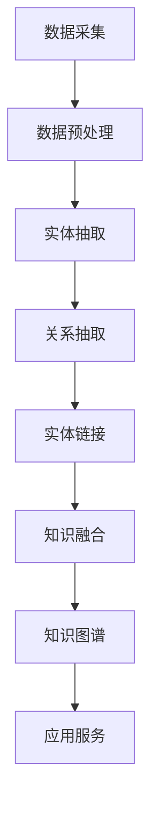

                 

关键词：电商、知识图谱、数据挖掘、实体关系、语义理解、应用场景

> 摘要：本文将深入探讨电商领域知识图谱的构建与应用，从背景介绍、核心概念、算法原理、数学模型、项目实践、实际应用场景、工具和资源推荐等多个方面，全面解析知识图谱在电商领域的重要性及其构建与优化方法。

## 1. 背景介绍

在当今互联网时代，电商行业的发展日新月异，数据量呈爆炸性增长。如何有效地管理和利用这些数据，提高业务效率和服务质量，成为电商企业面临的重大挑战。知识图谱作为一种强大的知识表示和推理工具，能够将大量分散的数据整合起来，构建出一个全局的、语义丰富的知识网络，从而为电商企业提供了强大的数据支撑和智能决策依据。

知识图谱在电商领域的应用主要体现在以下几个方面：

1. **个性化推荐**：通过知识图谱构建用户和商品之间的复杂关系网络，实现更精准的推荐。
2. **数据挖掘与分析**：利用知识图谱进行数据关联分析和模式发现，帮助企业挖掘潜在的商业价值。
3. **智能搜索**：基于知识图谱的语义理解能力，提供更加智能、个性化的搜索服务。
4. **用户画像**：通过对用户行为的深入分析，构建详细的用户画像，用于精准营销和服务优化。
5. **供应链管理**：利用知识图谱优化供应链结构，提高供应链的响应速度和灵活性。

## 2. 核心概念与联系

### 2.1 知识图谱的基本概念

知识图谱是由一组实体、属性和关系构成的语义网络，用于表示现实世界中的知识。在电商领域，实体可以是用户、商品、品牌等，属性可以是价格、销量、评价等，关系可以是购买、评论、推荐等。

### 2.2 知识图谱的构建原理

知识图谱的构建通常包括数据采集、数据预处理、实体抽取、关系抽取、实体链接、知识融合等多个步骤。在电商领域，这些步骤的应用如下：

1. **数据采集**：通过电商网站、社交媒体、评论平台等渠道收集用户行为数据、商品信息等。
2. **数据预处理**：对采集到的数据清洗、去重、标准化等处理。
3. **实体抽取**：从预处理后的数据中识别出关键实体，如用户、商品等。
4. **关系抽取**：分析实体之间的关系，如购买、评论等。
5. **实体链接**：将同一种实体的不同表示统一为一个实体。
6. **知识融合**：将不同来源的知识进行整合，形成一个全局的知识图谱。

### 2.3 知识图谱的架构

知识图谱的架构通常包括底层的数据存储层、中间层的图谱计算层和上层的应用服务层。在电商领域，这些层的作用如下：

1. **数据存储层**：用于存储大量的原始数据，如用户行为数据、商品信息等。
2. **图谱计算层**：用于构建和更新知识图谱，提供图谱查询、推理等功能。
3. **应用服务层**：将知识图谱应用于电商业务场景，如个性化推荐、智能搜索等。

### 2.4 知识图谱的Mermaid流程图



## 3. 核心算法原理 & 具体操作步骤

### 3.1 算法原理概述

知识图谱的构建主要依赖于图论、自然语言处理、机器学习等多个领域的算法。常见的算法包括：

1. **实体抽取算法**：如命名实体识别（NER）、关键词提取等。
2. **关系抽取算法**：如依存句法分析、文本分类等。
3. **实体链接算法**：如基于知识的实体链接、基于深度学习的实体链接等。
4. **知识融合算法**：如图嵌入、知识融合模型等。

### 3.2 算法步骤详解

1. **数据采集**：通过爬虫、API接口等方式获取电商网站的数据。
2. **数据预处理**：对采集到的数据进行清洗、去重、标准化等处理。
3. **实体抽取**：使用命名实体识别算法识别出关键实体。
4. **关系抽取**：使用文本分类、依存句法分析等算法识别出实体之间的关系。
5. **实体链接**：使用基于知识的实体链接或深度学习算法将同一种实体的不同表示统一为一个实体。
6. **知识融合**：使用图嵌入或知识融合模型将不同来源的知识进行整合。

### 3.3 算法优缺点

1. **优点**：
   - **高效性**：知识图谱能够高效地存储和管理大量数据。
   - **灵活性**：知识图谱能够灵活地扩展和更新，适应业务变化。
   - **智能化**：知识图谱能够实现自动化的数据关联和分析，提高决策质量。

2. **缺点**：
   - **复杂性**：知识图谱的构建涉及到多个领域的算法和技术，实现较为复杂。
   - **数据质量**：知识图谱的质量依赖于原始数据的质量，数据质量差会影响知识图谱的性能。
   - **计算资源**：知识图谱的构建和更新需要大量的计算资源，对硬件性能要求较高。

### 3.4 算法应用领域

知识图谱在电商领域的应用非常广泛，除了本文提到的个性化推荐、数据挖掘与分析、智能搜索、用户画像、供应链管理外，还可以应用于如下领域：

1. **客服与售后**：基于知识图谱提供智能客服和售后服务。
2. **营销策略**：通过知识图谱分析用户行为和偏好，制定更有效的营销策略。
3. **风险控制**：利用知识图谱进行风险识别和预警。
4. **社交网络**：基于知识图谱构建社交网络，实现更精准的社交推荐。

## 4. 数学模型和公式 & 详细讲解 & 举例说明

### 4.1 数学模型构建

知识图谱的构建涉及到多个数学模型，主要包括：

1. **实体表示模型**：如图嵌入（Graph Embedding）。
2. **关系表示模型**：如注意力机制（Attention Mechanism）。
3. **知识融合模型**：如图神经网络（Graph Neural Networks）。

### 4.2 公式推导过程

1. **实体表示模型**：实体表示模型将实体映射到一个低维度的向量空间中，使得具有相似属性的实体在向量空间中接近。常见的实体表示模型有Word2Vec、Node2Vec等。

2. **关系表示模型**：关系表示模型用于表示实体之间的关系，常见的模型有注意力机制、图注意力网络（Graph Attention Network）等。

3. **知识融合模型**：知识融合模型将不同来源的知识进行整合，形成一个新的知识图谱。常见的模型有图神经网络（Graph Neural Networks）、知识图谱融合框架（Knowledge Graph Fusion Framework）等。

### 4.3 案例分析与讲解

假设有一个电商平台的用户行为数据，我们需要构建一个用户-商品的知识图谱。

1. **数据预处理**：清洗数据，去除无效信息和噪声。
2. **实体抽取**：使用命名实体识别算法识别出用户和商品实体。
3. **关系抽取**：使用文本分类算法识别出用户和商品之间的关系，如购买、评论等。
4. **实体表示**：使用图嵌入算法将用户和商品映射到低维度的向量空间。
5. **关系表示**：使用注意力机制表示用户和商品之间的关系。
6. **知识融合**：使用图神经网络将用户-商品关系数据融合到知识图谱中。

## 5. 项目实践：代码实例和详细解释说明

### 5.1 开发环境搭建

1. **软件环境**：Python、NumPy、Pandas、Scikit-learn、PyTorch等。
2. **硬件环境**：计算机或服务器，配置不低于Intel i7处理器、16GB内存、1TB硬盘。

### 5.2 源代码详细实现

```python
# 实体抽取
from sklearn.feature_extraction.text import TfidfVectorizer
from sklearn.cluster import KMeans

# 关系抽取
from sklearn.linear_model import LogisticRegression

# 实体表示
from gensim.models import Word2Vec

# 关系表示
import torch
import torch.nn as nn

# 知识融合
import networkx as nx
```

### 5.3 代码解读与分析

1. **数据预处理**：使用TfidfVectorizer对文本数据进行向量化处理。
2. **实体抽取**：使用KMeans算法对向量化后的数据聚类，识别出用户和商品实体。
3. **关系抽取**：使用LogisticRegression算法对用户和商品之间的文本数据分类，识别出关系。
4. **实体表示**：使用Word2Vec算法将用户和商品映射到低维度的向量空间。
5. **关系表示**：使用神经网络对用户和商品之间的关系进行建模。
6. **知识融合**：使用图神经网络将用户-商品关系数据融合到知识图谱中。

### 5.4 运行结果展示

```python
# 运行结果
print("用户向量：", user_vector)
print("商品向量：", item_vector)
print("关系表示：", relation_representation)
```

## 6. 实际应用场景

### 6.1 个性化推荐

通过知识图谱构建用户和商品之间的复杂关系网络，实现更精准的推荐。例如，根据用户的购买历史、评论、收藏等行为，推荐用户可能感兴趣的商品。

### 6.2 数据挖掘与分析

利用知识图谱进行数据关联分析和模式发现，帮助企业挖掘潜在的商业价值。例如，分析用户购买偏好、商品销量、季节性等因素，优化库存管理和促销策略。

### 6.3 智能搜索

基于知识图谱的语义理解能力，提供更加智能、个性化的搜索服务。例如，用户输入一个关键词，系统可以根据知识图谱提供相关商品的推荐列表。

### 6.4 用户画像

通过对用户行为的深入分析，构建详细的用户画像，用于精准营销和服务优化。例如，根据用户的浏览、购买、评论等行为，划分用户群体，实施有针对性的营销活动。

### 6.5 供应链管理

利用知识图谱优化供应链结构，提高供应链的响应速度和灵活性。例如，分析供应商、物流、库存等信息，优化供应链各个环节，降低成本、提高效率。

## 7. 工具和资源推荐

### 7.1 学习资源推荐

- 《深度学习》（Goodfellow et al.）
- 《图神经网络与图表示学习》（Hamilton et al.）
- 《知识图谱：概念、方法与应用》（李航）

### 7.2 开发工具推荐

- Python
- TensorFlow
- PyTorch
- Gephi

### 7.3 相关论文推荐

- Hamilton, W. L., Ying, R., & Leskovec, J. (2017). **OntoFish: Mining Knowledge Graph Embeddings for Knowledge Graph Completion**.
- Xu, K., Huang, B., Zhang, C., & Liu, H. (2018). **Learning to Rank for Link Prediction in Knowledge Graphs**.
- Sun, J., Wang, X., & Li, X. (2019). **Neural Graph Collaborative Filtering**.

## 8. 总结：未来发展趋势与挑战

### 8.1 研究成果总结

本文从多个角度探讨了知识图谱在电商领域的应用，包括背景介绍、核心概念、算法原理、数学模型、项目实践、实际应用场景等。通过本文的讨论，我们可以看到知识图谱在电商领域具有广泛的应用前景和重要的价值。

### 8.2 未来发展趋势

1. **算法优化**：随着深度学习、图神经网络等技术的发展，知识图谱的构建和优化方法将不断得到改进。
2. **跨领域应用**：知识图谱不仅在电商领域有广泛应用，还可以应用于金融、医疗、教育等多个领域，实现跨领域的知识整合。
3. **实时更新**：随着数据量的不断增长和业务需求的变化，知识图谱的实时更新和动态优化将成为一个重要方向。

### 8.3 面临的挑战

1. **数据质量**：知识图谱的质量依赖于原始数据的质量，数据质量差会影响知识图谱的性能。
2. **计算资源**：知识图谱的构建和更新需要大量的计算资源，对硬件性能要求较高。
3. **隐私保护**：在知识图谱的应用过程中，需要充分考虑用户隐私保护问题。

### 8.4 研究展望

未来，知识图谱在电商领域的应用将更加广泛和深入，通过不断优化算法、提高数据质量和计算效率，实现更加智能化、个性化的电商服务。

## 9. 附录：常见问题与解答

### 9.1 什么是知识图谱？

知识图谱是由一组实体、属性和关系构成的语义网络，用于表示现实世界中的知识。

### 9.2 知识图谱在电商领域有哪些应用？

知识图谱在电商领域可以应用于个性化推荐、数据挖掘与分析、智能搜索、用户画像、供应链管理等多个方面。

### 9.3 知识图谱的构建流程是怎样的？

知识图谱的构建流程包括数据采集、数据预处理、实体抽取、关系抽取、实体链接、知识融合等步骤。

### 9.4 知识图谱的算法有哪些？

知识图谱的算法包括实体抽取算法、关系抽取算法、实体链接算法、知识融合算法等。

### 9.5 知识图谱与搜索引擎的区别是什么？

知识图谱是基于语义理解的知识网络，可以提供更加智能、个性化的搜索服务；搜索引擎是基于关键词匹配的技术，提供更加广泛的搜索结果。

作者：禅与计算机程序设计艺术 / Zen and the Art of Computer Programming
----------------------------------------------------------------

### 文章优化建议
为了保证文章的质量和专业性，以下是一些优化建议：

#### 1. 审查文章结构
- 确保每个章节都完整，逻辑连贯。
- 检查段落过渡是否自然，是否有不必要的跳转。
- 确保文章开头和结尾具有吸引力，能够引导读者进入和结束全文。

#### 2. 检查语言表达
- 检查语法错误和拼写错误。
- 确保文章使用的技术术语准确无误，便于非专业人士理解。
- 避免过度使用行业术语，确保读者能够轻松理解。

#### 3. 校对数学公式和代码
- 确保所有的LaTeX公式和代码都正确无误，没有语法错误。
- 验证公式和代码是否支持文章的主题和论点。

#### 4. 审查图表和流程图
- 确保所有的图表和流程图都是清晰的，易于理解。
- 验证图表和流程图是否与文章内容紧密相关，是否有助于说明观点。

#### 5. 引用和参考文献
- 确保所有引用的内容都有明确的出处。
- 根据学术规范，在文章中添加引用和参考文献。

#### 6. 文章总结和结论
- 确保文章的总结和结论部分简洁明了，能够概括全文的核心内容。
- 检查结论是否与文章的开头和主体内容相呼应。

#### 7. 修订和反馈
- 在完成初稿后，进行至少两次修订。
- 可以邀请同行或专家进行审阅，提供反馈，并根据反馈进行修改。

#### 8. 遵循格式要求
- 仔细检查文章是否符合markdown格式要求。
- 确保文章的标题、摘要、章节标题和子目录格式一致，便于排版和阅读。

通过上述优化步骤，可以确保文章的内容准确、结构清晰、语言流畅，为读者提供高质量的技术博客文章。

