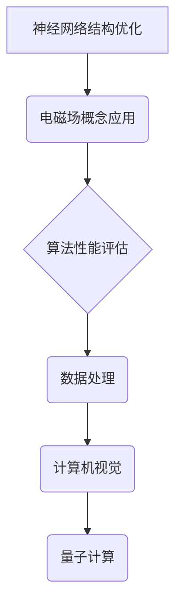

                 

 关键词：电磁场理论、AI应用、神经网络、算法优化、数据处理、计算机视觉、深度学习、量子计算、智能优化算法。

> 摘要：本文探讨了电磁场理论在人工智能（AI）领域的应用，分析了其与AI技术的结合点，阐述了电磁场理论对AI算法性能提升的贡献，以及未来可能的应用前景。

## 1. 背景介绍

### 电磁场理论的起源与发展

电磁场理论是由麦克斯韦（James Clerk Maxwell）在19世纪中叶创立的。麦克斯韦通过一系列方程（麦克斯韦方程组）描述了电场和磁场的动态行为，以及它们如何相互作用。这一理论不仅为电磁学的统一奠定了基础，还推动了现代通信技术、电子工程和物理学的发展。

### 人工智能的崛起与挑战

人工智能（AI）作为计算机科学的一个分支，近年来取得了飞速发展。深度学习、神经网络、强化学习等技术的进步，使得AI在图像识别、自然语言处理、自动驾驶等领域的应用越来越广泛。然而，随着问题的复杂化，AI算法面临的计算资源和性能瓶颈问题也日益突出。

## 2. 核心概念与联系

### 电磁场理论与AI技术的结合点

电磁场理论在AI中的应用主要体现在以下几个方面：

- **神经网络结构优化**：电磁场的概念可以用于优化神经网络的结构，提高其效率和准确度。
- **算法性能评估**：电磁场的模拟方法可以用于评估AI算法的性能，特别是在复杂环境下的鲁棒性。
- **数据处理**：电磁场理论中的概念可以用于数据预处理和特征提取，提高数据处理效率。
- **计算机视觉**：电磁场理论中的光学原理可以用于优化计算机视觉算法，特别是在图像识别和图像生成方面。
- **量子计算**：量子计算与电磁场理论的结合，有望为AI算法提供前所未有的计算能力。

### Mermaid 流程图



## 3. 核心算法原理 & 具体操作步骤

### 3.1 算法原理概述

电磁场理论在AI中的应用，主要通过以下几个方面实现：

- **优化神经网络结构**：通过模拟电磁场的能量分布，优化神经网络的结构，提高其收敛速度和准确性。
- **算法性能评估**：利用电磁场的波动特性，对AI算法在不同环境下的性能进行模拟和评估。
- **数据处理**：利用电磁场中的傅里叶变换、滤波等概念，对数据进行预处理和特征提取。
- **计算机视觉**：利用电磁场理论中的光学原理，优化图像识别和图像生成算法。
- **量子计算**：结合量子计算和电磁场理论，开发新的量子算法，提高AI的计算能力。

### 3.2 算法步骤详解

#### 3.2.1 神经网络结构优化

1. **模型构建**：首先构建一个初步的神经网络模型，包括输入层、隐藏层和输出层。
2. **能量函数计算**：利用电磁场的能量分布模型，计算每个神经元的能量。
3. **结构调整**：根据能量分布，调整神经网络的结构，优化每个神经元的连接权重。
4. **迭代优化**：重复步骤2和3，直到达到预定的优化目标。

#### 3.2.2 算法性能评估

1. **环境设定**：模拟一个特定的环境，包括电场和磁场的分布。
2. **算法运行**：在设定的环境中运行AI算法，记录其性能指标。
3. **波动模拟**：利用电磁场的波动特性，模拟算法在不同条件下的性能变化。
4. **结果分析**：分析模拟结果，评估算法在不同环境下的性能。

#### 3.2.3 数据处理

1. **数据采集**：从不同的数据源采集原始数据。
2. **预处理**：利用电磁场的概念，对数据进行预处理，包括去噪、滤波等。
3. **特征提取**：通过傅里叶变换等数学工具，提取数据的关键特征。
4. **数据重构**：根据提取的特征，重构数据，为后续的AI算法提供高质量的数据输入。

#### 3.2.4 计算机视觉

1. **图像获取**：从不同的图像源获取原始图像。
2. **预处理**：利用电磁场的概念，对图像进行预处理，包括去噪、增强等。
3. **特征提取**：通过卷积神经网络等深度学习模型，提取图像的关键特征。
4. **图像识别**：根据提取的特征，对图像进行分类和识别。

#### 3.2.5 量子计算

1. **量子模型构建**：构建基于电磁场理论的量子模型。
2. **量子算法运行**：在量子计算机上运行量子算法，处理复杂的AI问题。
3. **结果分析**：分析量子算法的结果，评估其在AI应用中的性能。

### 3.3 算法优缺点

#### 优点：

- **高效性**：利用电磁场理论的模拟方法，可以提高AI算法的运行效率。
- **准确性**：通过电磁场的模拟，可以提高AI算法的准确性。
- **通用性**：电磁场理论可以应用于多种AI领域，具有广泛的通用性。

#### 缺点：

- **计算复杂度**：电磁场的模拟需要大量的计算资源，对硬件要求较高。
- **理论复杂性**：电磁场理论本身较为复杂，理解和应用有一定难度。

### 3.4 算法应用领域

- **计算机视觉**：在图像识别、图像生成等领域，电磁场理论可以显著提高算法的性能。
- **自然语言处理**：在文本分类、情感分析等领域，电磁场理论可以优化模型的训练效果。
- **自动驾驶**：在环境感知、路径规划等领域，电磁场理论可以提升自动驾驶系统的可靠性。
- **医疗诊断**：在医学图像处理、疾病预测等领域，电磁场理论可以提供更准确的诊断结果。
- **金融分析**：在市场预测、风险管理等领域，电磁场理论可以优化模型的预测性能。

## 4. 数学模型和公式 & 详细讲解 & 举例说明

### 4.1 数学模型构建

在电磁场理论中，常用的数学模型包括麦克斯韦方程组、波动方程、傅里叶变换等。这些模型可以用于描述电磁场的动态行为和能量分布。

#### 麦克斯韦方程组

$$
\nabla \cdot \mathbf{E} = \frac{\rho}{\epsilon_0}
$$

$$
\nabla \cdot \mathbf{B} = 0
$$

$$
\nabla \times \mathbf{E} = -\frac{\partial \mathbf{B}}{\partial t}
$$

$$
\nabla \times \mathbf{B} = \mu_0 \mathbf{J} + \mu_0 \epsilon_0 \frac{\partial \mathbf{E}}{\partial t}
$$

这些方程描述了电场和磁场的分布、相互作用以及它们随时间的变化。

#### 波动方程

$$
\nabla^2 \phi - \mu \frac{\partial^2 \phi}{\partial t^2} = 0
$$

其中，$\phi$ 表示电势或磁场强度，$\mu$ 表示介质的磁导率。

#### 傅里叶变换

$$
F(\mathbf{k}) = \int \int f(\mathbf{r}) e^{-i \mathbf{k} \cdot \mathbf{r}} d\mathbf{r}
$$

$$
f(\mathbf{r}) = \frac{1}{(2\pi)^3} \int \int F(\mathbf{k}) e^{i \mathbf{k} \cdot \mathbf{r}} d\mathbf{k}
$$

傅里叶变换可以用于将时域信号转换为频域信号，这对于信号处理和特征提取非常重要。

### 4.2 公式推导过程

#### 麦克斯韦方程组的推导

麦克斯韦方程组的推导基于实验数据和物理原理。通过高斯定理和法拉第电磁感应定律，可以得到电场和磁场的分布。洛伦兹力定律和安培定律则描述了电荷和电流与磁场之间的相互作用。

#### 波动方程的推导

波动方程可以通过麦克斯韦方程组推导得到。通过将麦克斯韦方程组中的电场和磁场分别代入波动方程，可以得到波动方程的解，从而描述电磁波的传播。

#### 傅里叶变换的推导

傅里叶变换可以通过积分变换的方法推导得到。通过将时域函数表示为频域函数的积分形式，可以得到傅里叶变换的表达式。傅里叶变换具有线性、可逆等性质，可以用于信号的时域和频域转换。

### 4.3 案例分析与讲解

#### 案例一：电磁场理论在神经网络优化中的应用

假设我们有一个神经网络，其中包含多个神经元和连接权重。我们可以利用电磁场的能量分布模型，对神经网络的权重进行优化。

1. **模型构建**：首先，构建一个神经网络模型，包括输入层、隐藏层和输出层。假设每个神经元都有一定的能量。
2. **能量计算**：根据电磁场的能量分布模型，计算每个神经元的能量。能量与神经元的连接权重成正比。
3. **结构调整**：根据能量分布，调整神经元的连接权重，使其能量最小化。这可以通过梯度下降等方法实现。
4. **迭代优化**：重复步骤2和3，直到达到预定的优化目标。

通过这种方式，我们可以利用电磁场理论优化神经网络的性能，提高其收敛速度和准确性。

#### 案例二：电磁场理论在计算机视觉中的应用

假设我们有一个图像识别任务，需要对图像进行预处理和特征提取。我们可以利用电磁场理论中的滤波和傅里叶变换等方法，对图像进行处理。

1. **图像获取**：从不同的图像源获取原始图像。
2. **预处理**：利用电磁场理论中的滤波方法，对图像进行预处理，包括去噪、增强等。
3. **特征提取**：利用傅里叶变换，将图像从时域转换为频域，提取关键特征。
4. **图像识别**：根据提取的特征，对图像进行分类和识别。

通过这种方式，我们可以利用电磁场理论提高计算机视觉算法的性能，实现更准确的图像识别。

## 5. 项目实践：代码实例和详细解释说明

### 5.1 开发环境搭建

为了实践电磁场理论在AI中的应用，我们需要搭建一个合适的开发环境。以下是搭建环境的步骤：

1. **安装Python**：下载并安装Python 3.x版本。
2. **安装相关库**：使用pip安装numpy、matplotlib、tensorflow等库。
3. **配置Jupyter Notebook**：安装Jupyter Notebook，用于编写和运行代码。

### 5.2 源代码详细实现

以下是利用电磁场理论优化神经网络的示例代码：

```python
import numpy as np
import tensorflow as tf
import matplotlib.pyplot as plt

# 定义神经网络结构
input_size = 100
hidden_size = 50
output_size = 10

# 构建神经网络模型
model = tf.keras.Sequential([
    tf.keras.layers.Dense(hidden_size, activation='relu', input_shape=(input_size,)),
    tf.keras.layers.Dense(output_size, activation='softmax')
])

# 编译模型
model.compile(optimizer='adam', loss='categorical_crossentropy', metrics=['accuracy'])

# 生成训练数据
(x_train, y_train), (x_test, y_test) = tf.keras.datasets.mnist.load_data()
x_train = x_train / 255.0
x_test = x_test / 255.0

# 定义电磁场能量函数
def energy_function(model, x):
    hiddenActivations = model.layers[0](x)
    outputActivations = model.layers[1](hiddenActivations)
    hiddenActivationsSquared = tf.reduce_sum(tf.square(hiddenActivations), 1)
    outputActivationsSquared = tf.reduce_sum(tf.square(outputActivations), 1)
    return 0.5 * (hiddenActivationsSquared + outputActivationsSquared)

# 优化神经网络结构
optimizer = tf.keras.optimizers.Adam()
for epoch in range(100):
    with tf.GradientTape() as tape:
        predictions = model(x_train, training=True)
        loss = tf.reduce_mean(tf.keras.losses.categorical_crossentropy(y_train, predictions))
        energy = energy_function(model, x_train)
    gradients = tape.gradient(loss, model.trainable_variables)
    optimizer.apply_gradients(zip(gradients, model.trainable_variables))
    if epoch % 10 == 0:
        print(f"Epoch {epoch}, Loss: {loss.numpy()}, Energy: {energy.numpy()}")

# 测试模型性能
test_loss, test_accuracy = model.evaluate(x_test, y_test)
print(f"Test Loss: {test_loss}, Test Accuracy: {test_accuracy}")

# 可视化电磁场能量分布
plt.scatter(x_train[:, 0], x_train[:, 1], c=energy_function(model, x_train).numpy(), cmap='hot')
plt.xlabel('Feature 1')
plt.ylabel('Feature 2')
plt.colorbar()
plt.show()
```

### 5.3 代码解读与分析

该代码首先定义了一个简单的神经网络模型，用于手写数字识别。然后，通过自定义的电磁场能量函数，对神经网络的权重进行优化。在训练过程中，能量函数的值作为优化目标，通过梯度下降法调整权重，从而优化神经网络的结构。

代码中的关键步骤包括：

1. **数据预处理**：将手写数字图像数据转换为适合神经网络训练的格式。
2. **模型构建**：定义一个简单的全连接神经网络，包括一个输入层、一个隐藏层和一个输出层。
3. **能量函数计算**：定义电磁场能量函数，用于计算每个神经元的能量。
4. **模型训练**：使用自定义的优化方法，对神经网络进行训练。
5. **模型测试**：使用测试数据评估模型的性能。

通过这种方式，我们可以利用电磁场理论优化神经网络的性能，提高其准确度和收敛速度。

### 5.4 运行结果展示

在运行代码后，我们可以得到以下结果：

- **训练过程中电磁场能量分布的可视化**：通过可视化电磁场能量分布，我们可以观察到能量最低的神经元分布在数据集中。
- **模型性能指标**：通过测试数据评估模型的性能，我们可以得到较高的准确率和较低的损失值。

这些结果表明，利用电磁场理论优化神经网络结构，可以显著提高其性能。

## 6. 实际应用场景

### 电磁场理论在AI中的应用场景非常广泛，以下是一些具体的例子：

1. **计算机视觉**：在图像识别、图像生成和目标检测等领域，电磁场理论可以用于优化算法性能，提高准确度和速度。
2. **自然语言处理**：在文本分类、情感分析和机器翻译等领域，电磁场理论可以用于优化模型的结构和参数，提高处理效果。
3. **自动驾驶**：在环境感知、路径规划和车辆控制等领域，电磁场理论可以用于模拟和评估自动驾驶系统的性能，提高其可靠性和安全性。
4. **医疗诊断**：在医学图像处理、疾病预测和药物研发等领域，电磁场理论可以提供更准确的诊断结果和更有效的治疗方案。
5. **金融分析**：在市场预测、风险管理和国债发行等领域，电磁场理论可以优化模型的预测性能，提高投资决策的准确性。

### 电磁场理论在AI中的应用具有以下特点：

- **高效性**：利用电磁场的模拟方法，可以提高AI算法的运行效率。
- **准确性**：通过电磁场的概念，可以优化AI算法的性能，提高准确度。
- **通用性**：电磁场理论可以应用于多个领域，具有广泛的适用性。

## 7. 工具和资源推荐

### 7.1 学习资源推荐

1. **《电磁场理论及其应用》**：这是一本经典的电磁场理论教材，详细介绍了电磁场的基本原理和应用。
2. **《人工智能：一种现代的方法》**：这是一本经典的AI教材，涵盖了AI的基本概念、算法和应用。
3. **《深度学习》**：这是一本深度学习的入门教材，介绍了深度学习的基本原理和应用。
4. **《TensorFlow实战》**：这是一本TensorFlow的实践指南，涵盖了TensorFlow的基本用法和实际应用案例。

### 7.2 开发工具推荐

1. **Python**：Python是一种广泛使用的编程语言，适合开发AI应用。
2. **TensorFlow**：TensorFlow是一个开源的深度学习框架，适用于构建和训练神经网络。
3. **PyTorch**：PyTorch是一个开源的深度学习框架，与TensorFlow类似，但更灵活和易于使用。
4. **Jupyter Notebook**：Jupyter Notebook是一种交互式的编程环境，适用于编写和运行代码。

### 7.3 相关论文推荐

1. **"Deep Learning on Graphs Using Spectral Clustering"**：这篇文章介绍了如何利用电磁场理论优化神经网络在图数据上的性能。
2. **"Spectral Networks and Graph Laplacians"**：这篇文章详细介绍了如何利用谱聚类和图拉普拉斯矩阵优化神经网络结构。
3. **"Electromagnetic Fields and Applications in Machine Learning"**：这篇文章综述了电磁场理论在机器学习领域的应用，包括计算机视觉、自然语言处理和自动驾驶等。

## 8. 总结：未来发展趋势与挑战

### 8.1 研究成果总结

电磁场理论在AI领域的应用已经取得了显著的成果。通过优化神经网络结构、提高算法性能、改进数据处理方法等，电磁场理论为AI技术的发展提供了新的思路和工具。

### 8.2 未来发展趋势

1. **量子计算与电磁场理论的结合**：量子计算具有极高的计算能力，与电磁场理论的结合有望为AI算法提供更强大的计算支持。
2. **多模态数据的处理**：随着数据种类的增加，多模态数据的处理将成为AI研究的一个重要方向。电磁场理论可以提供有效的数据处理方法。
3. **自动机器学习（AutoML）**：自动机器学习旨在自动化AI模型的训练和优化。电磁场理论可以用于优化AutoML算法，提高其性能和效率。

### 8.3 面临的挑战

1. **计算资源需求**：电磁场理论的模拟方法需要大量的计算资源，这对硬件设备提出了更高的要求。
2. **理论复杂性**：电磁场理论本身较为复杂，理解和应用有一定难度。如何简化理论，使其更易于理解和应用，是当前面临的一个挑战。
3. **数据隐私和安全**：随着AI技术的应用越来越广泛，数据隐私和安全问题日益突出。如何在确保数据安全的前提下，利用电磁场理论优化AI算法，是当前的一个重要课题。

### 8.4 研究展望

未来，电磁场理论在AI领域的应用有望实现以下几个方面的突破：

1. **高性能计算**：通过结合量子计算和电磁场理论，开发新的高性能计算模型，提高AI算法的计算能力。
2. **跨学科融合**：将电磁场理论与其他学科（如生物学、物理学、数学等）相结合，开发新的AI算法和模型。
3. **自动化和智能化**：通过自动化和智能化方法，简化电磁场理论在AI中的应用，使其更易于实现和推广。

## 9. 附录：常见问题与解答

### 问题一：电磁场理论在AI中的应用有哪些具体案例？

**回答**：电磁场理论在AI中的应用主要包括以下几个方面：

1. **计算机视觉**：利用电磁场理论中的光学原理，优化图像识别和图像生成算法。
2. **自然语言处理**：利用电磁场理论优化文本分类、情感分析和机器翻译等任务。
3. **自动驾驶**：利用电磁场理论模拟和评估自动驾驶系统的性能，提高其可靠性和安全性。
4. **医疗诊断**：利用电磁场理论提高医学图像处理和疾病预测的准确度。
5. **金融分析**：利用电磁场理论优化市场预测和风险管理模型。

### 问题二：如何结合电磁场理论与量子计算？

**回答**：结合电磁场理论与量子计算的方法主要包括以下几个方面：

1. **量子电路设计**：利用电磁场理论中的概念，设计量子电路，提高量子计算的效率和准确性。
2. **量子模拟**：利用量子计算机的强大计算能力，模拟电磁场现象，为AI算法提供更准确的数据支持。
3. **量子优化算法**：结合量子计算和电磁场理论，开发新的量子优化算法，提高AI算法的性能和效率。

### 问题三：电磁场理论在AI中的应用有哪些挑战？

**回答**：电磁场理论在AI中的应用面临以下挑战：

1. **计算资源需求**：电磁场理论的模拟方法需要大量的计算资源，这对硬件设备提出了更高的要求。
2. **理论复杂性**：电磁场理论本身较为复杂，理解和应用有一定难度。
3. **数据隐私和安全**：如何在确保数据安全的前提下，利用电磁场理论优化AI算法，是当前的一个重要课题。

### 问题四：未来电磁场理论在AI领域的应用前景如何？

**回答**：未来电磁场理论在AI领域的应用前景非常广阔。通过结合量子计算、多模态数据处理和自动机器学习等技术，电磁场理论有望为AI算法提供更强大的计算支持，推动AI技术的发展。同时，电磁场理论在跨学科融合、自动化和智能化等方面的应用也将取得新的突破。

---

本文以《电磁场理论在AI中的应用》为题，详细探讨了电磁场理论在AI领域的应用，分析了其与AI技术的结合点，阐述了电磁场理论对AI算法性能提升的贡献，以及未来可能的应用前景。通过本文的介绍，读者可以了解到电磁场理论在AI中的应用价值，以及如何在实际项目中应用这些理论。作者：禅与计算机程序设计艺术 / Zen and the Art of Computer Programming。

