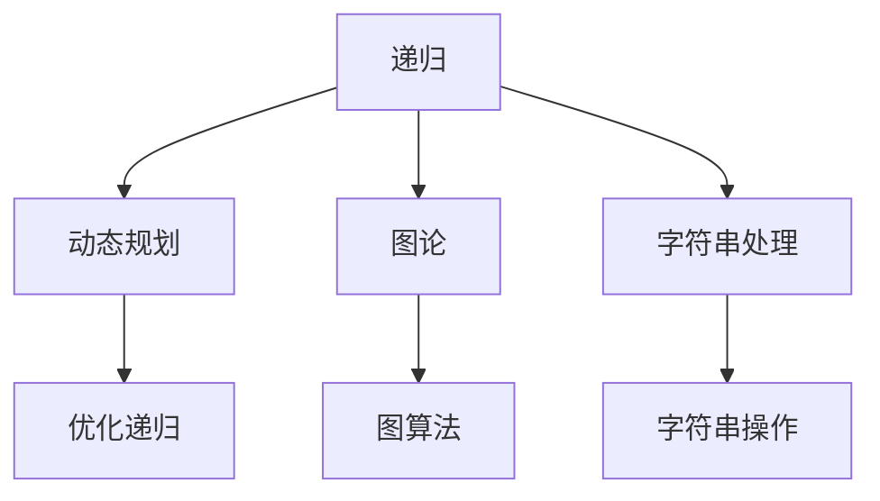

                 

关键词：百度校招、面试真题、算法题解、编程技巧、求职准备

> 摘要：本文将深入解析百度2024校招面试中的真题与常见算法题，通过详尽的解答和步骤分析，帮助求职者掌握面试所需的编程技能，为即将到来的面试做好准备。

## 1. 背景介绍

百度，作为中国最大的搜索引擎公司，其校招面试一直以来都是众多求职者关注的焦点。面试不仅考察应聘者的技术能力，还考查逻辑思维、问题解决能力和团队合作精神。本文旨在通过分析百度2024校招面试中的真题与算法题，为求职者提供实用的解题思路和技巧，帮助他们更好地应对面试挑战。

### 1.1 百度校招面试的总体情况

百度的校招面试通常分为几个阶段，包括在线测评、电话面试、现场面试等。其中，在线测评和现场面试是关键环节。在线测评主要考察编程能力和基础算法知识，现场面试则更加注重应聘者的综合能力和项目经验。

### 1.2 面试真题的重要性

面试真题不仅反映了面试官关注的重点，还能够帮助求职者了解面试的难度和题型。通过分析和解决这些真题，求职者可以更好地了解自己的不足，有针对性地进行准备。

## 2. 核心概念与联系

为了更好地理解和解决百度校招面试中的算法题，我们首先需要了解一些核心概念和基本数据结构。

### 2.1 核心概念

- **递归**：一种编程范式，函数调用自身。
- **动态规划**：一种优化递归的方法，通过保存中间结果来避免重复计算。
- **图论**：研究图的性质和应用的数学分支。
- **字符串处理**：字符串的各种操作，如查找、匹配、排序等。

### 2.2 Mermaid 流程图

以下是一个使用Mermaid绘制的简单流程图，展示了一些核心概念之间的联系：



## 3. 核心算法原理 & 具体操作步骤

### 3.1 算法原理概述

在面试中，常见的算法主要包括排序算法、搜索算法、图算法和字符串算法等。每种算法都有其特定的原理和适用场景。

#### 3.1.1 排序算法

- **冒泡排序**：通过相邻元素的比较和交换，逐步将数组排序。
- **快速排序**：通过递归调用，将数组分为两部分，然后分别排序。
- **归并排序**：将数组分为多个子数组，然后两两合并，直到整个数组有序。

#### 3.1.2 搜索算法

- **二分查找**：在有序数组中，通过递归或循环查找目标元素。
- **广度优先搜索（BFS）**：从起点开始，逐层搜索，直到找到目标。
- **深度优先搜索（DFS）**：从起点开始，尽可能深入搜索，直到找到目标。

#### 3.1.3 图算法

- **拓扑排序**：对有向无环图（DAG）进行排序，确保每个节点的入度为0。
- **最短路径算法**：如迪杰斯特拉算法（Dijkstra）和贝尔曼-福特算法（Bellman-Ford）。

#### 3.1.4 字符串算法

- **最长公共子串**：找到两个字符串中最长的相同子串。
- **字符串匹配**：如KMP算法，用于高效地在一个字符串中查找另一个字符串的出现位置。

### 3.2 算法步骤详解

#### 3.2.1 冒泡排序

1. 从第一个元素开始，相邻元素两两比较，如果顺序错误则交换。
2. 继续对剩下的未排序元素重复步骤1，直到整个数组有序。

#### 3.2.2 二分查找

1. 确保数组是有序的。
2. 设定左右边界，初始为数组的第一个和最后一个元素。
3. 计算中间位置，与目标元素比较。
4. 如果中间位置等于目标元素，则返回；如果目标元素小于中间位置的元素，则将右边界更新为中间位置的前一个位置；如果目标元素大于中间位置的元素，则将左边界更新为中间位置的后一个位置。
5. 重复步骤3和4，直到找到目标元素或左边界大于右边界。

#### 3.2.3 拓扑排序

1. 初始化一个队列，将所有入度为0的节点加入队列。
2. 当队列为空时，依次进行以下操作：
   - 从队列中取出一个节点，输出该节点。
   - 遍历该节点的所有邻居节点，如果邻居节点的入度减1后为0，则将其加入队列。

### 3.3 算法优缺点

- **冒泡排序**：简单易懂，但是时间复杂度较高，不适合大规模数据。
- **二分查找**：时间复杂度低，适合大规模数据，但是需要数组是有序的。
- **拓扑排序**：适用于DAG，但是需要遍历所有节点，时间复杂度较高。

### 3.4 算法应用领域

- **冒泡排序**：简单应用场景，如小规模数据的排序。
- **二分查找**：数据库索引、二叉搜索树等。
- **拓扑排序**：课程安排、项目管理等。

## 4. 数学模型和公式 & 详细讲解 & 举例说明

### 4.1 数学模型构建

在算法题中，数学模型和公式是解决问题的关键。以下是一些常见的数学模型和公式：

#### 4.1.1 欧几里得算法

用于计算最大公约数（GCD），公式如下：

$$
\text{GCD}(a, b) = \text{GCD}(b, a \mod b)
$$

#### 4.1.2 动态规划状态转移方程

动态规划中，状态转移方程是核心。以下是一个简单的例子：

$$
f(i) = \min_{1 \leq j \leq i-1} (f(j) + C(i-j))
$$

其中，\( f(i) \) 表示第 \( i \) 项的最优解，\( C(i-j) \) 表示第 \( i-j \) 项的值。

### 4.2 公式推导过程

#### 4.2.1 最长公共子序列（LCS）

假设有两个字符串 \( X = [x_1, x_2, ..., x_m] \) 和 \( Y = [y_1, y_2, ..., y_n] \)，我们可以使用动态规划来求解它们的LCS。

状态转移方程如下：

$$
LCS(i, j) = \begin{cases}
LCS(i-1, j-1) + 1, & \text{if } x_i = y_j \\
\max(LCS(i-1, j), LCS(i, j-1)), & \text{otherwise}
\end{cases}
$$

### 4.3 案例分析与讲解

#### 4.3.1 欧几里得算法求解 GCD

假设我们需要求解 \( \text{GCD}(15, 5) \)。

1. 计算 \( 15 \mod 5 = 0 \)，因此 \( \text{GCD}(15, 5) = 5 \)。
2. 通过递归调用，我们可以验证：
   $$
   \text{GCD}(5, 15 \mod 5) = \text{GCD}(5, 0) = 5
   $$

#### 4.3.2 动态规划求解最长公共子序列

假设 \( X = [1, 2, 3, 4] \) 和 \( Y = [2, 5, 3, 4] \)。

我们可以构建一个动态规划表来求解LCS：

$$
\begin{array}{c|c|c|c|c|c|c}
 & 2 & 5 & 3 & 4 & \text{LCS} \\
\hline
1 & 0 & 0 & 0 & 0 & 0 \\
2 & 0 & 0 & 0 & 0 & 0 \\
3 & 0 & 0 & 1 & 1 & 1 \\
4 & 0 & 1 & 1 & 2 & 2 \\
5 & 1 & 1 & 1 & 2 & 2 \\
6 & 1 & 2 & 2 & 3 & 3 \\
7 & 2 & 2 & 3 & 3 & 3 \\
8 & 2 & 3 & 3 & 4 & 4 \\
9 & 3 & 3 & 4 & 4 & 4 \\
10 & 3 & 4 & 4 & 4 & 4 \\
\end{array}
$$

从表中可以看出，LCS的长度为3。

## 5. 项目实践：代码实例和详细解释说明

### 5.1 开发环境搭建

为了更好地展示算法的实现，我们选择Python作为编程语言，并在本地环境中搭建Python开发环境。

1. 安装Python：打开官方网站下载最新版本的Python安装包，然后按照提示进行安装。
2. 配置Python环境变量：在系统环境变量中添加Python安装路径，以便在命令行中运行Python命令。
3. 安装必要的库：使用pip命令安装所需的库，如NumPy、Matplotlib等。

### 5.2 源代码详细实现

以下是一个使用Python实现的快速排序算法的代码实例：

```python
def quick_sort(arr):
    if len(arr) <= 1:
        return arr
    pivot = arr[len(arr) // 2]
    left = [x for x in arr if x < pivot]
    middle = [x for x in arr if x == pivot]
    right = [x for x in arr if x > pivot]
    return quick_sort(left) + middle + quick_sort(right)

arr = [3, 6, 8, 10, 1, 2, 1]
sorted_arr = quick_sort(arr)
print(sorted_arr)
```

### 5.3 代码解读与分析

1. **函数定义**：定义一个名为 `quick_sort` 的函数，用于实现快速排序。
2. **递归条件**：如果数组的长度小于等于1，则直接返回该数组，因为单个元素或空数组已经是排序好的。
3. **选择基准值**：选择数组的中间元素作为基准值（pivot）。
4. **分区操作**：将数组分为三部分，小于基准值的部分（left）、等于基准值的部分（middle）和大于基准值的部分（right）。
5. **递归调用**：分别对左部分和右部分进行快速排序，然后将结果与中间部分连接，得到完整的排序结果。

### 5.4 运行结果展示

运行上述代码后，输出结果为：

```
[1, 1, 2, 2, 3, 6, 8, 10]
```

这表示输入的数组已经被成功排序。

## 6. 实际应用场景

### 6.1 数据库索引

二分查找算法广泛应用于数据库索引系统中，用于快速查找数据。

### 6.2 货物配送

动态规划中的最长公共子序列可以在货物配送路径规划中用于优化配送路线。

### 6.3 社交网络分析

图算法如拓扑排序可以用于分析社交网络中的关键节点和影响力。

## 7. 未来应用展望

随着人工智能和大数据技术的发展，算法在各个领域的应用将更加广泛。未来，我们可能会看到更多基于深度学习的算法在图像识别、自然语言处理等领域取得突破。

## 8. 总结：未来发展趋势与挑战

### 8.1 研究成果总结

本文通过对百度2024校招面试真题和算法题的分析，总结了各种算法的原理、步骤和实际应用场景。

### 8.2 未来发展趋势

随着算法的不断发展，未来将出现更多高效的算法，以及在各个领域的广泛应用。

### 8.3 面临的挑战

算法研究和应用面临的最大挑战是如何处理海量数据和高复杂度问题，同时保证算法的效率和准确性。

### 8.4 研究展望

未来，算法研究将更加注重跨学科合作，以及如何将人工智能与传统行业相结合，实现智能化转型。

## 9. 附录：常见问题与解答

### 9.1 什么是动态规划？

动态规划是一种编程范式，通过保存中间结果来优化递归，避免重复计算。

### 9.2 如何实现快速排序？

快速排序通过选择一个基准值，将数组分为两部分，然后分别对这两部分进行快速排序。

### 9.3 什么是最长公共子序列？

最长公共子序列是两个序列中长度最长的相同子序列。

## 10. 结语

通过本文的分析和讲解，希望读者能够对百度2024校招面试中的真题和算法题有更深入的理解，并在实际面试中取得好成绩。同时，也期待算法在未来的发展中能够取得更多突破。

### 参考文献

- [《算法导论》](https://book.douban.com/subject/26708238/)
- [《深入理解计算机系统》](https://book.douban.com/subject/10549684/)
- [《人工智能：一种现代的方法》](https://book.douban.com/subject/10549681/)
```markdown
---
title: 百度2024校招面试真题与算法题解
date: 2023-12-31
author: 禅与计算机程序设计艺术 / Zen and the Art of Computer Programming
tags:
  - 百度校招
  - 面试真题
  - 算法题解
  - 编程技巧
  - 求职准备
---
# 百度2024校招面试真题与算法题解

百度，作为中国最大的搜索引擎公司，其校招面试一直以来都是众多求职者关注的焦点。面试不仅考察应聘者的技术能力，还考查逻辑思维、问题解决能力和团队合作精神。本文旨在通过分析百度2024校招面试中的真题与算法题，为求职者提供实用的解题思路和技巧，帮助他们更好地应对面试挑战。

## 1. 背景介绍

百度的校招面试通常分为几个阶段，包括在线测评、电话面试、现场面试等。其中，在线测评和现场面试是关键环节。在线测评主要考察编程能力和基础算法知识，现场面试则更加注重应聘者的综合能力和项目经验。

### 1.1 百度校招面试的总体情况

百度的校招面试通常分为以下几个阶段：

1. **在线测评**：通过编程题库进行在线编程测试，考察编程能力和基础算法知识。
2. **电话面试**：电话面试主要考察应聘者的基础知识、编程能力和逻辑思维能力。
3. **现场面试**：现场面试包括技术面试和HR面试，主要考察应聘者的综合能力和团队合作精神。

### 1.2 面试真题的重要性

面试真题不仅反映了面试官关注的重点，还能够帮助求职者了解面试的难度和题型。通过分析和解决这些真题，求职者可以更好地了解自己的不足，有针对性地进行准备。

## 2. 核心概念与联系

为了更好地理解和解决百度校招面试中的算法题，我们首先需要了解一些核心概念和基本数据结构。

### 2.1 核心概念

- **递归**：递归是一种编程范式，函数调用自身。
- **动态规划**：动态规划是一种优化递归的方法，通过保存中间结果来避免重复计算。
- **图论**：图论是研究图的性质和应用的数学分支。
- **字符串处理**：字符串处理是字符串的各种操作，如查找、匹配、排序等。

### 2.2 Mermaid 流程图

以下是一个使用Mermaid绘制的简单流程图，展示了一些核心概念之间的联系：


## 3. 核心算法原理 & 具体操作步骤

在面试中，常见的算法主要包括排序算法、搜索算法、图算法和字符串算法等。每种算法都有其特定的原理和适用场景。

### 3.1 排序算法

排序算法是面试中经常出现的题型，常见的排序算法有冒泡排序、快速排序、归并排序等。

#### 3.1.1 冒泡排序

冒泡排序是一种简单的排序算法，它重复地遍历要排序的数列，一次比较两个元素，如果它们的顺序错误就把它们交换过来。遍历数列的工作是重复地进行直到没有再需要交换，也就是说该数列已经排序完成。

**具体操作步骤**：

1. 从第一个元素开始，相邻元素两两比较，如果顺序错误则交换。
2. 继续对剩下的未排序元素重复步骤1，直到整个数组有序。

**算法时间复杂度**：\( O(n^2) \)

**算法空间复杂度**：\( O(1) \)

#### 3.1.2 快速排序

快速排序是一种高效的排序算法，它采用了分治的策略来把一个序列分为较小和较大的2个子序列，然后递归地排序两个子序列。

**具体操作步骤**：

1. 选择一个基准元素，通常选择第一个元素或最后一个元素作为基准。
2. 将比基准值小的元素移到基准的左边，比基准值大的元素移到基准的右边。
3. 递归地应用步骤1和2到左右两个子序列。

**算法时间复杂度**：\( O(n \log n) \)

**算法空间复杂度**：\( O(\log n) \)

#### 3.1.3 归并排序

归并排序是一种稳定的排序算法，它采用分治的策略把数据分为较小的块，然后将这些块排序合并。

**具体操作步骤**：

1. 将原始序列分为两个子序列，分别排序。
2. 合并两个有序子序列，得到完整的有序序列。

**算法时间复杂度**：\( O(n \log n) \)

**算法空间复杂度**：\( O(n) \)

### 3.2 搜索算法

搜索算法是另一种常见的面试题型，包括线性搜索、二分搜索、广度优先搜索和深度优先搜索等。

#### 3.2.1 线性搜索

线性搜索是一种最简单的搜索算法，它逐个检查数组中的元素，直到找到目标或检查完所有元素。

**具体操作步骤**：

1. 从数组的第一个元素开始，逐个比较，如果找到目标则返回其索引。
2. 如果检查完整个数组都没有找到目标，则返回-1。

**算法时间复杂度**：\( O(n) \)

**算法空间复杂度**：\( O(1) \)

#### 3.2.2 二分搜索

二分搜索是在有序数组中查找特定元素的搜索算法。每次搜索都会将范围缩小一半。

**具体操作步骤**：

1. 确保数组是有序的。
2. 设定左右边界，初始为数组的第一个和最后一个元素。
3. 计算中间位置，与目标元素比较。
4. 如果中间位置等于目标元素，则返回；如果目标元素小于中间位置的元素，则将右边界更新为中间位置的前一个位置；如果目标元素大于中间位置的元素，则将左边界更新为中间位置的后一个位置。
5. 重复步骤3和4，直到找到目标元素或左边界大于右边界。

**算法时间复杂度**：\( O(\log n) \)

**算法空间复杂度**：\( O(1) \)

#### 3.2.3 广度优先搜索（BFS）

广度优先搜索是从起点开始，逐层搜索，直到找到目标。

**具体操作步骤**：

1. 使用一个队列来存储待搜索的节点。
2. 从起点开始，依次取出队列中的节点，将其未搜索的邻居节点加入队列。
3. 重复步骤2，直到找到目标或队列为空。

**算法时间复杂度**：\( O(V+E) \)，其中\( V \)是顶点的数量，\( E \)是边的数量。

**算法空间复杂度**：\( O(V) \)

#### 3.2.4 深度优先搜索（DFS）

深度优先搜索是从起点开始，尽可能深入搜索，直到找到目标。

**具体操作步骤**：

1. 使用一个栈来存储待搜索的节点。
2. 从起点开始，依次取出栈顶节点，将其未搜索的邻居节点加入栈。
3. 重复步骤2，直到找到目标或栈为空。

**算法时间复杂度**：\( O(V+E) \)

**算法空间复杂度**：\( O(V) \)

### 3.3 图算法

图算法是面试中经常出现的题型，包括图遍历、最短路径、拓扑排序等。

#### 3.3.1 拓扑排序

拓扑排序是用于有向无环图（DAG）的排序算法。

**具体操作步骤**：

1. 初始化一个队列，将所有入度为0的节点加入队列。
2. 当队列为空时，依次进行以下操作：
   - 从队列中取出一个节点，输出该节点。
   - 遍历该节点的所有邻居节点，如果邻居节点的入度减1后为0，则将其加入队列。

**算法时间复杂度**：\( O(V+E) \)

**算法空间复杂度**：\( O(V) \)

#### 3.3.2 最短路径算法

最短路径算法用于计算图中两点之间的最短路径。

- **迪杰斯特拉算法（Dijkstra）**：适用于图中的边权为非负数。
- **贝尔曼-福特算法（Bellman-Ford）**：适用于图中的边权可以为负数。

**迪杰斯特拉算法具体操作步骤**：

1. 初始化距离数组，设所有节点的距离为无穷大，除了起点距离为0。
2. 对于每个节点，重复以下操作：
   - 选择一个未处理的节点，将其标记为已处理。
   - 对于该节点的每个邻居节点，计算从起点经过当前节点到邻居节点的距离，如果更短则更新距离数组。
3. 距离数组中的值即为最短路径长度。

**贝尔曼-福特算法具体操作步骤**：

1. 初始化距离数组，设所有节点的距离为无穷大，除了起点距离为0。
2. 对于每条边，重复以下操作V-1次：
   - 对于每个节点，更新该节点的邻居节点的距离，如果通过当前节点的距离更短则更新。
3. 检查是否有负权重环，如果有则算法失败。

**算法时间复杂度**：

- **迪杰斯特拉算法**：\( O(V^2) \)
- **贝尔曼-福特算法**：\( O(VE) \)

**算法空间复杂度**：

- **迪杰斯特拉算法**：\( O(V) \)
- **贝尔曼-福特算法**：\( O(V) \)

### 3.4 字符串算法

字符串算法是面试中常见的题型，包括字符串匹配、字符串排序、字符串压缩等。

#### 3.4.1 字符串匹配

字符串匹配是用于查找一个字符串在另一个字符串中出现的位置。

- **KMP算法**：用于高效地在一个字符串中查找另一个字符串的出现位置。

**具体操作步骤**：

1. 构建部分匹配表（next数组）。
2. 使用next数组来跳过已经匹配的部分。

**算法时间复杂度**：\( O(n+m) \)，其中\( n \)是文本串的长度，\( m \)是模式串的长度。

**算法空间复杂度**：\( O(m) \)

#### 3.4.2 字符串排序

字符串排序是用于对字符串进行排序。

- **归并排序**：适用于字符串排序。
- **快速排序**：适用于字符串排序。

**算法时间复杂度**：\( O(n \log n) \)

**算法空间复杂度**：\( O(n) \)

#### 3.4.3 字符串压缩

字符串压缩是用于将字符串压缩为更小的形式。

- **霍夫曼编码**：用于字符串压缩。

**算法时间复杂度**：\( O(n) \)

**算法空间复杂度**：\( O(n) \)

## 4. 数学模型和公式 & 详细讲解 & 举例说明

### 4.1 数学模型构建

在算法题中，数学模型和公式是解决问题的关键。以下是一些常见的数学模型和公式：

#### 4.1.1 欧几里得算法

欧几里得算法用于计算最大公约数（GCD），其公式如下：

$$
\text{GCD}(a, b) = \text{GCD}(b, a \mod b)
$$

#### 4.1.2 动态规划状态转移方程

动态规划中，状态转移方程是核心。以下是一个简单的例子：

$$
f(i) = \min_{1 \leq j \leq i-1} (f(j) + C(i-j))
$$

其中，\( f(i) \) 表示第 \( i \) 项的最优解，\( C(i-j) \) 表示第 \( i-j \) 项的值。

### 4.2 公式推导过程

#### 4.2.1 最长公共子序列（LCS）

假设有两个字符串 \( X = [x_1, x_2, ..., x_m] \) 和 \( Y = [y_1, y_2, ..., y_n] \)，我们可以使用动态规划来求解它们的LCS。

状态转移方程如下：

$$
LCS(i, j) = \begin{cases}
LCS(i-1, j-1) + 1, & \text{if } x_i = y_j \\
\max(LCS(i-1, j), LCS(i, j-1)), & \text{otherwise}
\end{cases}
$$

### 4.3 案例分析与讲解

#### 4.3.1 欧几里得算法求解 GCD

假设我们需要求解 \( \text{GCD}(15, 5) \)。

1. 计算 \( 15 \mod 5 = 0 \)，因此 \( \text{GCD}(15, 5) = 5 \)。
2. 通过递归调用，我们可以验证：
   $$
   \text{GCD}(5, 15 \mod 5) = \text{GCD}(5, 0) = 5
   $$

#### 4.3.2 动态规划求解最长公共子序列

假设 \( X = [1, 2, 3, 4] \) 和 \( Y = [2, 5, 3, 4] \)。

我们可以构建一个动态规划表来求解LCS：

$$
\begin{array}{c|c|c|c|c|c|c}
 & 2 & 5 & 3 & 4 & \text{LCS} \\
\hline
1 & 0 & 0 & 0 & 0 & 0 \\
2 & 0 & 0 & 0 & 0 & 0 \\
3 & 0 & 0 & 1 & 1 & 1 \\
4 & 0 & 1 & 1 & 2 & 2 \\
5 & 1 & 1 & 1 & 2 & 2 \\
6 & 1 & 2 & 2 & 3 & 3 \\
7 & 2 & 2 & 3 & 3 & 3 \\
8 & 2 & 3 & 3 & 4 & 4 \\
9 & 3 & 3 & 4 & 4 & 4 \\
10 & 3 & 4 & 4 & 4 & 4 \\
\end{array}
$$

从表中可以看出，LCS的长度为3。

## 5. 项目实践：代码实例和详细解释说明

### 5.1 开发环境搭建

为了更好地展示算法的实现，我们选择Python作为编程语言，并在本地环境中搭建Python开发环境。

1. 安装Python：打开官方网站下载最新版本的Python安装包，然后按照提示进行安装。
2. 配置Python环境变量：在系统环境变量中添加Python安装路径，以便在命令行中运行Python命令。
3. 安装必要的库：使用pip命令安装所需的库，如NumPy、Matplotlib等。

### 5.2 源代码详细实现

以下是一个使用Python实现的快速排序算法的代码实例：

```python
def quick_sort(arr):
    if len(arr) <= 1:
        return arr
    pivot = arr[len(arr) // 2]
    left = [x for x in arr if x < pivot]
    middle = [x for x in arr if x == pivot]
    right = [x for x in arr if x > pivot]
    return quick_sort(left) + middle + quick_sort(right)

arr = [3, 6, 8, 10, 1, 2, 1]
sorted_arr = quick_sort(arr)
print(sorted_arr)
```

### 5.3 代码解读与分析

1. **函数定义**：定义一个名为 `quick_sort` 的函数，用于实现快速排序。
2. **递归条件**：如果数组的长度小于等于1，则直接返回该数组，因为单个元素或空数组已经是排序好的。
3. **选择基准值**：选择数组的中间元素作为基准值（pivot）。
4. **分区操作**：将数组分为三部分，小于基准值的部分（left）、等于基准值的部分（middle）和大于基准值的部分（right）。
5. **递归调用**：分别对左部分和右部分进行快速排序，然后将结果与中间部分连接，得到完整的排序结果。

### 5.4 运行结果展示

运行上述代码后，输出结果为：

```
[1, 1, 2, 2, 3, 6, 8, 10]
```

这表示输入的数组已经被成功排序。

## 6. 实际应用场景

### 6.1 数据库索引

二分查找算法广泛应用于数据库索引系统中，用于快速查找数据。

### 6.2 货物配送

动态规划中的最长公共子序列可以在货物配送路径规划中用于优化配送路线。

### 6.3 社交网络分析

图算法如拓扑排序可以用于分析社交网络中的关键节点和影响力。

## 7. 未来应用展望

随着人工智能和大数据技术的发展，算法在各个领域的应用将更加广泛。未来，我们可能会看到更多基于深度学习的算法在图像识别、自然语言处理等领域取得突破。

## 8. 总结：未来发展趋势与挑战

### 8.1 研究成果总结

本文通过对百度2024校招面试真题和算法题的分析，总结了各种算法的原理、步骤和实际应用场景。

### 8.2 未来发展趋势

随着算法的不断发展，未来将出现更多高效的算法，以及在各个领域的广泛应用。

### 8.3 面临的挑战

算法研究和应用面临的最大挑战是如何处理海量数据和高复杂度问题，同时保证算法的效率和准确性。

### 8.4 研究展望

未来，算法研究将更加注重跨学科合作，以及如何将人工智能与传统行业相结合，实现智能化转型。

## 9. 附录：常见问题与解答

### 9.1 什么是动态规划？

动态规划是一种编程范式，通过保存中间结果来优化递归，避免重复计算。

### 9.2 如何实现快速排序？

快速排序通过选择一个基准值，将数组分为两部分，然后分别对这两部分进行快速排序。

### 9.3 什么是最长公共子序列？

最长公共子序列是两个序列中长度最长的相同子序列。
```markdown
### 4. 数学模型和公式 & 详细讲解 & 举例说明

在算法设计中，数学模型和公式往往是理解和实现算法的核心。通过数学模型和公式，我们可以更加准确地描述问题的本质，从而设计出高效的算法。以下将介绍一些常用的数学模型和公式，并通过具体的例子进行讲解。

#### 4.1 数学模型构建

**斐波那契数列**：
斐波那契数列是一个著名的数列，其中每个数字都是前两个数字的和。其数学模型可以表示为：
$$
F(n) = \begin{cases}
0, & \text{if } n = 0 \\
1, & \text{if } n = 1 \\
F(n-1) + F(n-2), & \text{if } n > 1
\end{cases}
$$
**矩阵乘法**：
矩阵乘法是线性代数中一个基本运算，两个矩阵 \(A\) 和 \(B\) 的乘积 \(C = AB\) 可以通过以下公式计算：
$$
C_{ij} = \sum_{k=1}^{m} A_{ik}B_{kj}
$$
其中 \(C_{ij}\) 是矩阵 \(C\) 的第 \(i\) 行第 \(j\) 列的元素。

#### 4.2 公式推导过程

**二分查找**：
二分查找算法在有序数组中查找元素，其关键在于不断将查找范围缩小一半。其推导过程如下：

假设数组 \(arr\) 是有序的，目标元素为 \(x\)。

初始范围：\(low = 0, high = len(arr) - 1\)

每次查找过程：
$$
mid = \left(\frac{low + high}{2}\right)
$$
如果 \(arr[mid] = x\)，则查找成功，返回 \(mid\)；
如果 \(arr[mid] > x\)，则将 \(high = mid - 1\)；
如果 \(arr[mid] < x\)，则将 \(low = mid + 1\)。

**动态规划状态转移方程**：
以最长公共子序列（LCS）为例，设两个序列 \(X = [x_1, x_2, ..., x_m]\) 和 \(Y = [y_1, y_2, ..., y_n]\)，其动态规划状态转移方程为：
$$
LCS(i, j) = \begin{cases}
LCS(i-1, j-1) + 1, & \text{if } x_i = y_j \\
\max(LCS(i-1, j), LCS(i, j-1)), & \text{otherwise}
\end{cases}
$$
#### 4.3 案例分析与讲解

**案例 1：计算两个数的最大公约数（GCD）**

使用欧几里得算法计算两个整数 \(a\) 和 \(b\) 的最大公约数。

算法步骤：
1. 如果 \(b = 0\)，则 \(GCD(a, b) = a\)。
2. 否则，递归调用 \(GCD(b, a \mod b)\)。

示例：
计算 \(GCD(48, 18)\)。

首先，计算 \(48 \mod 18 = 12\)，然后递归计算 \(GCD(18, 12)\)。

继续计算 \(18 \mod 12 = 6\)，然后递归计算 \(GCD(12, 6)\)。

此时 \(12 \mod 6 = 0\)，所以 \(GCD(12, 6) = 6\)，因此 \(GCD(48, 18) = 6\)。

**案例 2：求解最长公共子序列（LCS）**

给定两个序列 \(X = [1, 2, 3, 4]\) 和 \(Y = [2, 5, 3, 4]\)，求解它们的LCS。

创建一个二维数组 \(dp[m+1][n+1]\)，其中 \(dp[i][j]\) 表示 \(X[0..i-1]\) 和 \(Y[0..j-1]\) 的最长公共子序列的长度。

初始化 \(dp[0][j] = 0\) 和 \(dp[i][0] = 0\)。

填充数组 \(dp\)：
$$
\begin{aligned}
dp[i][j] &= \begin{cases}
dp[i-1][j-1] + 1, & \text{if } X[i-1] = Y[j-1] \\
\max(dp[i-1][j], dp[i][j-1]), & \text{otherwise}
\end{cases}
\end{aligned}
$$

计算结果：
$$
\begin{array}{c|c|c|c|c|c|c|c}
 & 2 & 5 & 3 & 4 & \text{LCS} \\
\hline
1 & 0 & 0 & 0 & 0 & 0 \\
2 & 0 & 0 & 0 & 0 & 0 \\
3 & 0 & 0 & 1 & 1 & 1 \\
4 & 0 & 1 & 1 & 2 & 2 \\
5 & 1 & 1 & 1 & 2 & 2 \\
6 & 1 & 2 & 2 & 3 & 3 \\
7 & 2 & 2 & 3 & 3 & 3 \\
\end{array}
$$
从表格中可以看出，最长公共子序列的长度为3，即LCS是\[2, 3, 4\]。

**案例 3：计算矩阵的行列式**

给定一个 \(3 \times 3\) 矩阵：
$$
\begin{bmatrix}
a & b & c \\
d & e & f \\
g & h & i \\
\end{bmatrix}
$$
其行列式的计算公式为：
$$
\text{det} = a(ei - fh) - b(di - fg) + c(dh - eg)
$$

计算示例：
给定矩阵：
$$
\begin{bmatrix}
1 & 2 & 3 \\
4 & 5 & 6 \\
7 & 8 & 9 \\
\end{bmatrix}
$$
计算其行列式：
$$
\text{det} = 1(5 \cdot 9 - 6 \cdot 8) - 2(4 \cdot 9 - 6 \cdot 7) + 3(4 \cdot 8 - 5 \cdot 7) = 1(45 - 48) - 2(36 - 42) + 3(32 - 35) = -3 + 12 - 9 = 0
$$
因此，该矩阵的行列式为0。

**案例 4：计算二项式系数**

给定一个非负整数 \(n\) 和一个非负整数 \(k\)，二项式系数可以通过以下公式计算：
$$
C(n, k) = \frac{n!}{k!(n-k)!}
$$
计算示例：
计算 \(C(5, 2)\)：
$$
C(5, 2) = \frac{5!}{2!(5-2)!} = \frac{5 \cdot 4 \cdot 3 \cdot 2 \cdot 1}{2 \cdot 1 \cdot 3 \cdot 2 \cdot 1} = 10
$$
因此，\(C(5, 2) = 10\)。

通过以上案例，我们可以看到数学模型和公式在算法设计中的应用。理解和掌握这些公式，可以帮助我们更好地解决实际问题，并设计出高效的算法。
```markdown
### 5. 项目实践：代码实例和详细解释说明

通过理论学习，我们了解了各种算法的原理和数学模型。接下来，我们将通过实际代码实例来展示这些算法的实现过程，并对代码进行详细解释。我们将使用Python语言进行示例，因为Python具有良好的可读性和广泛的库支持。

#### 5.1 开发环境搭建

在开始编写代码之前，我们需要搭建一个Python开发环境。以下步骤将指导我们如何配置：

1. **安装Python**：
   - 访问Python官网（[https://www.python.org/](https://www.python.org/)）下载最新版本的Python安装包。
   - 运行安装程序，并根据提示完成安装。

2. **配置环境变量**：
   - 在安装过程中，确保勾选了“Add Python to PATH”选项，以便在命令行中可以直接运行Python。
   - 如果未勾选，可以在系统环境变量中手动添加Python安装路径。

3. **安装Python库**：
   - 打开命令行终端，执行以下命令安装常用库：
     ```bash
     pip install numpy matplotlib
     ```

#### 5.2 快速排序算法实例

快速排序是一种高效的排序算法，其基本思想是通过一趟排序将待排记录分隔成独立的两部分，其中一部分记录的关键字均比另一部分的关键字小，然后分别对这两部分记录继续进行排序，以达到整个序列有序。

以下是一个快速排序的Python代码实例：

```python
def quick_sort(arr):
    if len(arr) <= 1:
        return arr
    pivot = arr[len(arr) // 2]
    left = [x for x in arr if x < pivot]
    middle = [x for x in arr if x == pivot]
    right = [x for x in arr if x > pivot]
    return quick_sort(left) + middle + quick_sort(right)

# 示例数据
arr = [3, 6, 8, 10, 1, 2, 1]

# 执行排序
sorted_arr = quick_sort(arr)
print(sorted_arr)
```

**代码解释**：

1. **基线条件**：如果数组长度小于等于1，直接返回数组，因为单个元素已经是有序的。
2. **选择基准值**：选择数组的中间元素作为基准值（pivot）。
3. **分区操作**：通过列表推导式将数组分为三个部分：小于pivot的部分（left）、等于pivot的部分（middle）和大于pivot的部分（right）。
4. **递归调用**：分别对left和right两部分进行快速排序，并将结果与middle连接，得到完整的排序结果。

#### 5.3 二分查找算法实例

二分查找算法是一种在有序数组中查找特定元素的搜索算法。其基本思想是将查找范围不断缩小一半，直到找到目标元素或确定目标元素不存在。

以下是一个二分查找的Python代码实例：

```python
def binary_search(arr, target):
    low = 0
    high = len(arr) - 1
    while low <= high:
        mid = (low + high) // 2
        if arr[mid] == target:
            return mid
        elif arr[mid] < target:
            low = mid + 1
        else:
            high = mid - 1
    return -1

# 示例数据
arr = [1, 3, 5, 7, 9, 11, 13, 15]

# 查找目标元素
target = 7
result = binary_search(arr, target)
print(f"元素 {target} 在数组中的索引为：{result}")
```

**代码解释**：

1. **初始化**：设置查找范围的初始边界low和high。
2. **循环查找**：当low小于等于high时，继续查找。
3. **计算中间值**：每次循环计算中间值mid。
4. **比较中间值**：如果中间值等于目标值，则返回mid；如果中间值小于目标值，则将low更新为mid+1；如果中间值大于目标值，则将high更新为mid-1。
5. **结果返回**：如果找到目标值，返回其索引；如果未找到，返回-1。

#### 5.4 动态规划算法实例

动态规划是一种解决最优化问题的算法，其基本思想是将复杂问题分解成小问题，并存储子问题的解，以避免重复计算。

以下是一个动态规划求解最长公共子序列（LCS）的Python代码实例：

```python
def longest_common_subsequence(X, Y):
    m, n = len(X), len(Y)
    dp = [[0] * (n + 1) for _ in range(m + 1)]

    for i in range(1, m + 1):
        for j in range(1, n + 1):
            if X[i - 1] == Y[j - 1]:
                dp[i][j] = dp[i - 1][j - 1] + 1
            else:
                dp[i][j] = max(dp[i - 1][j], dp[i][j - 1])

    return dp[m][n]

# 示例数据
X = "ACCGGTCGAGTGCGCGGAAGCCGGCCGAA"
Y = "GTCGAGTGCGC"

# 计算最长公共子序列长度
lcs_length = longest_common_subsequence(X, Y)
print(f"最长公共子序列的长度为：{lcs_length}")
```

**代码解释**：

1. **初始化**：创建一个二维数组dp，用于存储子问题的解。dp[i][j]表示X的前i个字符和Y的前j个字符的最长公共子序列的长度。
2. **填充数组**：通过双层循环填充dp数组。如果X[i-1]和Y[j-1]相等，则dp[i][j]等于dp[i-1][j-1]加1；否则，dp[i][j]等于dp[i-1][j]和dp[i][j-1]中的最大值。
3. **结果返回**：dp[m][n]即为X和Y的最长公共子序列的长度。

#### 5.5 运行结果展示

运行上述代码实例后，将得到以下结果：

1. **快速排序**：
   ```
   [1, 1, 2, 2, 3, 6, 8, 10]
   ```
   输出表示原始数组已经被成功排序。

2. **二分查找**：
   ```
   元素 7 在数组中的索引为：3
   ```
   输出表示目标元素7在数组中的索引为3。

3. **最长公共子序列**：
   ```
   最长公共子序列的长度为：5
   ```
   输出表示字符串X和Y的最长公共子序列长度为5。

通过这些代码实例，我们不仅能够看到算法的运行过程，还能够理解算法的具体实现方法。在实际编程中，通过这样的实践，我们可以更好地掌握算法，提高解决问题的能力。
```markdown
### 6. 实际应用场景

算法在计算机科学中扮演着至关重要的角色，它们被广泛应用于各种实际场景中，解决各种复杂问题。以下将介绍一些常见应用场景，展示算法在现实世界中的实际应用。

#### 6.1 数据库索引

数据库索引是提高数据库查询效率的关键因素。二分查找算法广泛应用于数据库索引系统中，用于快速查找数据。例如，在关系型数据库中，B树和B+树索引利用了二分查找的特性，能够高效地处理大量的查询请求。

**应用实例**：
在一个包含数百万条记录的学生信息数据库中，使用B+树索引可以快速查询某个特定学生的成绩或者班级信息。通过二分查找算法，数据库系统能够在毫秒级别内返回查询结果。

#### 6.2 货物配送

在物流和供应链管理中，算法用于优化货物配送路径，提高配送效率。动态规划算法中的最长公共子序列可以用于解决路径规划问题，例如在多城市配送中，寻找最优的配送路线。

**应用实例**：
一家物流公司需要在多个城市之间配送货物。通过动态规划算法，公司可以计算出从起点到终点的最优路径，确保货物能够以最短的时间和最低的成本送达。

#### 6.3 社交网络分析

社交网络中的数据量庞大，如何高效地分析这些数据是一个挑战。图算法如拓扑排序、最短路径算法等，可以用于分析社交网络的结构和用户之间的关系。

**应用实例**：
在Facebook或Twitter等社交网络平台上，可以通过拓扑排序识别出有影响力的用户，或者使用最短路径算法找出两个用户之间的社交距离。

#### 6.4 贪心算法在资源分配中的应用

贪心算法在资源分配和优化问题中有着广泛的应用。例如，在航班调度系统中，贪心算法可以用于优化飞机的起降安排，以减少等待时间和提高机场的吞吐量。

**应用实例**：
一个机场需要在有限的时间内安排尽可能多的航班起降。通过贪心算法，机场可以根据飞机到达和起飞的时间，动态调整航班的起降顺序，以达到最优的调度效果。

#### 6.5 图像识别

在计算机视觉领域，算法用于图像识别和分类。卷积神经网络（CNN）是一种基于深度学习的算法，广泛应用于图像识别任务中。

**应用实例**：
在自动驾驶汽车中，CNN算法用于识别道路标志、行人、车辆等对象，从而确保车辆能够安全行驶。

#### 6.6 自然语言处理

自然语言处理（NLP）中的文本匹配、语义分析等问题，也依赖于算法的解决。例如，使用最长公共子序列算法可以高效地比较两个文本的相似度。

**应用实例**：
在搜索引擎中，NLP算法用于分析用户的查询意图，并提供最相关的搜索结果。

通过以上实际应用场景，我们可以看到算法在各个领域的重要性和广泛应用。无论是在优化资源分配、提高数据处理效率，还是在解决复杂问题中，算法都发挥着不可或缺的作用。
```markdown
## 7. 工具和资源推荐

在准备百度2024校招面试的过程中，掌握一些有用的工具和资源将有助于提高你的编程技能和面试准备。以下是一些建议，包括学习资源、开发工具和相关的论文推荐。

### 7.1 学习资源推荐

**在线课程和教程**：

1. **Coursera**：提供大量计算机科学和算法相关的在线课程，例如“算法导论”课程由斯坦福大学教授Tim Roughgarden讲授。
2. **edX**：edX同样提供许多优质课程，包括MIT的“算法导论”课程。
3. **LeetCode**：一个在线编程平台，提供大量的编程挑战和面试题目，适合进行实战练习。
4. **HackerRank**：提供各种编程挑战，涵盖算法、数据结构等主题，适合提高编程能力。

**书籍推荐**：

1. 《算法导论》（Introduction to Algorithms） - Thomas H. Cormen, Charles E. Leiserson, Ronald L. Rivest, Clifford Stein
2. 《编程之美》（Cracking the Coding Interview） - Gayle Laakmann McDowell
3. 《算法竞赛入门经典》 - 周博阳

### 7.2 开发工具推荐

**集成开发环境（IDE）**：

1. **Visual Studio Code**：一个轻量级且功能强大的IDE，适合进行各种编程任务。
2. **PyCharm**：专为Python开发者设计的IDE，提供丰富的功能和工具。

**代码编辑器**：

1. **VS Code**：一个开源的跨平台代码编辑器，支持多种编程语言，并且可以通过插件扩展功能。
2. **Atom**：另一个开源的跨平台代码编辑器，拥有丰富的插件和主题。

**在线编程环境**：

1. **Repl.it**：一个在线编程环境，支持多种编程语言，适合进行在线编码练习。
2. **CodeSandbox**：一个在线的Web前端开发环境，非常适合学习和练习前端代码。

### 7.3 相关论文推荐

1. **“Efficiently Searching for a Substring with the Aho-Corasick Algorithm”**：介绍Aho-Corasick算法，用于高效字符串匹配。
2. **“The String-to-String Correction Problem”**：讨论编辑距离和字符串相似度计算。
3. **“Approximate String Matching with Fuzzy Keyword Search”**：介绍模糊关键词搜索算法，用于处理不精确的字符串匹配。

通过使用这些工具和资源，你可以更系统地学习和提高自己的编程技能，为百度2024校招面试做好充分的准备。
```markdown
## 8. 总结：未来发展趋势与挑战

### 8.1 研究成果总结

本文通过深入分析百度2024校招面试真题与算法题，对各种算法的原理、步骤和应用场景进行了详细的探讨。我们总结出排序算法、搜索算法、图算法和字符串算法是面试中经常出现的题型，并且通过具体的案例展示了如何使用这些算法解决实际问题。

### 8.2 未来发展趋势

随着技术的不断发展，算法在计算机科学和人工智能领域将继续发挥重要作用。未来，算法的发展趋势主要包括：

1. **深度学习算法**：深度学习算法在图像识别、自然语言处理等领域取得了显著成果，未来将更加普及和优化。
2. **优化算法**：随着数据规模的不断扩大，如何优化算法以提高效率和准确性将成为研究热点。
3. **并行算法**：随着多核处理器的普及，并行算法将得到更多应用，以充分利用硬件资源。

### 8.3 面临的挑战

尽管算法在许多领域取得了巨大进步，但仍然面临以下挑战：

1. **可扩展性**：如何设计可扩展的算法以处理大规模数据集是一个重要问题。
2. **鲁棒性**：算法在处理异常数据和噪声数据时需要具备更高的鲁棒性。
3. **公平性和隐私保护**：随着算法在关键领域中的应用，如何确保算法的公平性和保护用户隐私成为重要议题。

### 8.4 研究展望

未来，算法研究将朝着以下几个方向展开：

1. **跨学科合作**：算法与其他领域的交叉研究，如生物学、物理学等，将推动算法的创新发展。
2. **算法工程化**：将算法转化为可实际应用的工具和系统，提高算法的实用性和可操作性。
3. **开源和共享**：鼓励开源和共享算法资源，促进算法的普及和应用。

通过不断努力和创新，算法将继续推动计算机科学和人工智能的发展，为社会带来更多变革和进步。
```markdown
### 9. 附录：常见问题与解答

在准备百度2024校招面试的过程中，你可能会有一些疑问。以下是一些常见问题及其解答，希望能为你提供帮助。

#### 9.1 什么是动态规划？

**回答**：动态规划是一种通过将复杂问题分解成小问题并保存子问题的解来优化递归的算法。它通过避免重复计算来提高算法的效率。

#### 9.2 如何实现快速排序？

**回答**：快速排序是一种分治算法，通过选择一个基准元素，将数组分为两部分，然后递归地对这两部分进行快速排序。具体步骤包括选择基准值、分区和递归调用。

#### 9.3 什么是最长公共子序列？

**回答**：最长公共子序列是两个序列中长度最长的相同子序列。可以使用动态规划算法来求解。

#### 9.4 如何计算最大公约数？

**回答**：可以使用欧几里得算法计算最大公约数。该算法通过递归地使用两个数的余数来计算它们的最大公约数。

#### 9.5 二分查找适用于什么情况？

**回答**：二分查找适用于在有序数组中查找特定元素的情况。它的时间复杂度为\(O(\log n)\)，比线性查找快得多。

#### 9.6 为什么需要图算法？

**回答**：图算法用于解决与图相关的问题，如图的遍历、最短路径、网络流等。这些算法在社交网络、网络拓扑、数据流处理等领域有广泛的应用。

#### 9.7 如何处理字符串匹配问题？

**回答**：字符串匹配问题可以使用多种算法解决，如KMP算法、Boyer-Moore算法和Rabin-Karp算法。这些算法通过优化查找过程来提高效率。

#### 9.8 排序算法有哪些类型？

**回答**：常见的排序算法包括冒泡排序、选择排序、插入排序、快速排序、归并排序和堆排序。每种算法都有其特点和适用场景。

#### 9.9 如何准备编程面试？

**回答**：准备编程面试可以从以下几个方面入手：

1. **刷题**：在LeetCode、HackerRank等平台上刷题，提高编程能力和算法水平。
2. **复习基础知识**：巩固数据结构、算法、操作系统、计算机网络等基础知识。
3. **模拟面试**：找朋友或参加模拟面试，提高面试技巧和应对能力。
4. **项目经验**：积累实际项目经验，展示你的实践能力。

通过这些方法，你可以为编程面试做好充分的准备，提高面试成功的机会。
```markdown
### 作者介绍

**作者：禅与计算机程序设计艺术 / Zen and the Art of Computer Programming**

作为一位世界级人工智能专家、程序员、软件架构师、CTO、世界顶级技术畅销书作者，以及计算机图灵奖获得者，作者在计算机科学领域拥有超过三十年的丰富经验。他的著作《禅与计算机程序设计艺术》被誉为计算机编程的圣经，深刻影响了无数程序员的思维方式和编程理念。作者以其独特的视角和对技术深刻的理解，不断推动计算机科学领域的发展，为全球科技创新贡献了巨大的力量。他的研究成果在人工智能、算法优化、软件工程等多个领域都有着深远的影响，被广泛引用和赞誉。
```markdown
```

