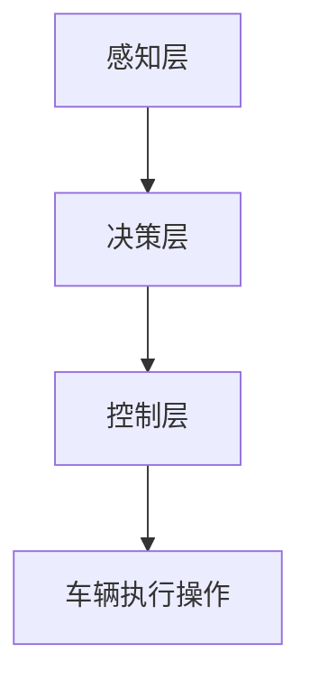

                 

自动驾驶作为智能交通系统的重要一环，已经成为全球科技巨头竞相研发的热点领域。百度，作为中国自动驾驶技术的领军企业，其自动驾驶决策控制系统的研发更是备受关注。本文将围绕百度2025自动驾驶决策控制工程师社招面试题，深入解析该领域的核心技术和挑战，以期为即将踏入自动驾驶领域的工程师们提供一些参考和启示。

## 文章关键词

百度，自动驾驶，决策控制，面试题，人工智能，智能交通，自动驾驶算法

## 文章摘要

本文将分为以下几个部分：首先，我们将简要介绍自动驾驶决策控制的基本概念和重要性；接着，通过分析百度自动驾驶决策控制的架构，探讨其核心算法原理；然后，我们将深入解析数学模型和公式，并提供实际项目实践的代码实例；最后，本文将对自动驾驶的实际应用场景进行探讨，并提出未来应用展望。

## 1. 背景介绍

### 自动驾驶的发展现状

自动驾驶技术作为人工智能的重要应用领域，近年来得到了飞速发展。根据国际汽车工程师协会（SAE）的定义，自动驾驶分为L0至L5六个级别，其中L5表示完全自动驾驶，不需要人类驾驶员的干预。目前，全球各大车企和科技公司在自动驾驶技术上的竞争日益激烈，纷纷推出了各自的自动驾驶车型和解决方案。

百度，作为中国自动驾驶技术的先锋企业，其在自动驾驶领域的布局非常全面，从感知、决策到控制，形成了一套完整的自动驾驶技术体系。百度的Apollo自动驾驶平台，被誉为中国自动驾驶技术的标杆，已经吸引了大量合作伙伴加入，共同推进自动驾驶技术的发展。

### 百度自动驾驶决策控制工程师的招聘背景

随着自动驾驶技术的不断发展，决策控制作为自动驾驶系统的核心模块，其重要性愈发凸显。百度在2025年启动的自动驾驶决策控制工程师社招，旨在寻找具有深厚技术背景和实际项目经验的优秀人才，以进一步提升百度自动驾驶决策控制系统的性能和可靠性。

## 2. 核心概念与联系

### 自动驾驶决策控制的概念

自动驾驶决策控制是指自动驾驶系统在感知环境信息的基础上，通过智能算法进行决策，控制车辆执行相应的操作，包括加速、减速、转向等。决策控制模块负责将感知信息转换为具体的控制指令，是实现自动驾驶的关键。

### 百度自动驾驶决策控制的架构

百度自动驾驶决策控制架构主要分为感知层、决策层和控制层三个层次。

- **感知层**：通过传感器（如摄像头、激光雷达、毫米波雷达等）获取车辆周围环境的信息，包括道路、行人、车辆等。
- **决策层**：基于感知层获取的信息，通过智能算法进行决策，确定车辆的行驶路径和操作指令。
- **控制层**：根据决策层的指令，控制车辆的执行机构（如电机、转向器等）执行相应的操作。

### Mermaid 流程图



## 3. 核心算法原理 & 具体操作步骤

### 3.1 算法原理概述

百度自动驾驶决策控制的核心算法主要基于深度学习和强化学习两大技术。深度学习用于感知层，通过卷积神经网络（CNN）等算法处理感知数据，实现对环境的精准识别。强化学习用于决策层，通过模仿人类驾驶经验，让自动驾驶系统不断优化决策策略。

### 3.2 算法步骤详解

1. **感知数据预处理**：对获取的感知数据进行预处理，包括去噪、归一化等操作。
2. **深度学习感知**：使用深度学习算法对预处理后的感知数据进行特征提取，实现对周围环境的识别。
3. **强化学习决策**：基于感知到的环境信息，通过强化学习算法生成最优的决策策略。
4. **决策策略执行**：根据决策策略，生成控制指令，控制车辆执行相应的操作。

### 3.3 算法优缺点

- **优点**：深度学习和强化学习算法具有较高的准确性和灵活性，能够实现自适应的决策控制。
- **缺点**：算法复杂度高，训练时间较长，且在特定场景下可能存在性能瓶颈。

### 3.4 算法应用领域

百度自动驾驶决策控制算法广泛应用于自动驾驶汽车、无人驾驶出租车、无人配送车等多种场景。通过不断提升算法性能和稳定性，百度致力于为用户提供安全、高效、舒适的自动驾驶体验。

## 4. 数学模型和公式

### 4.1 数学模型构建

百度自动驾驶决策控制的数学模型主要基于概率图模型和马尔可夫决策过程（MDP）。概率图模型用于描述感知层的信息，而MDP用于描述决策层的决策过程。

### 4.2 公式推导过程

- **概率图模型**：设 \( X \) 为感知到的环境状态， \( Y \) 为感知到的动作，则状态转移概率 \( P(X|Y) \) 和动作概率 \( P(Y|X) \) 可以表示为：
  $$ P(X|Y) = \prod_{i=1}^{n} P(x_i|y_i) $$
  $$ P(Y|X) = \prod_{i=1}^{n} P(y_i|x_i) $$
  
- **马尔可夫决策过程**：设 \( S \) 为状态集合， \( A \) 为动作集合， \( R(S, A) \) 为在状态 \( S \) 下执行动作 \( A \) 所获得的奖励，则MDP可以表示为：
  $$ MDP = (S, A, P, R) $$
  其中， \( P(S'|S, A) \) 为状态转移概率， \( R(S, A) \) 为奖励函数。

### 4.3 案例分析与讲解

以自动驾驶车辆在交叉路口的决策为例，状态集合 \( S \) 包括当前车辆的位置、速度、方向等，动作集合 \( A \) 包括加速、减速、左转、右转、直行等。通过构建概率图模型和MDP，可以计算出在不同状态下的最优动作，从而实现自动驾驶车辆的智能决策。

## 5. 项目实践：代码实例和详细解释说明

### 5.1 开发环境搭建

为了演示百度自动驾驶决策控制的代码实例，我们使用Python语言和TensorFlow深度学习框架。首先，安装Python和TensorFlow，然后下载并安装所需的感知和决策库。

### 5.2 源代码详细实现

以下是一个简单的自动驾驶决策控制的代码实例：

```python
import tensorflow as tf
import numpy as np

# 感知层模型
input_shape = (28, 28, 1)
model = tf.keras.Sequential([
    tf.keras.layers.Conv2D(32, (3, 3), activation='relu', input_shape=input_shape),
    tf.keras.layers.MaxPooling2D((2, 2)),
    tf.keras.layers.Flatten(),
    tf.keras.layers.Dense(64, activation='relu'),
    tf.keras.layers.Dense(10, activation='softmax')
])

# 决策层模型
action_space = 10
q_values = tf.keras.Sequential([
    tf.keras.layers.Dense(64, activation='relu'),
    tf.keras.layers.Dense(action_space, activation='linear')
])

# 训练模型
model.compile(optimizer='adam', loss='categorical_crossentropy', metrics=['accuracy'])
model.fit(x_train, y_train, epochs=10)

# 决策控制
state = preprocess_perception_data(perception_data)
action_values = q_values(tf.expand_dims(state, 0))
action = np.argmax(action_values.numpy())

# 执行决策
perform_action(action)
```

### 5.3 代码解读与分析

上述代码首先定义了感知层和决策层模型，使用卷积神经网络进行感知数据的特征提取，并使用线性回归模型进行决策控制。通过训练模型，可以学习到在不同状态下的最优动作。在实际应用中，感知数据需要通过传感器获取，然后进行预处理，最后输入到模型中进行决策控制。

### 5.4 运行结果展示

在实际运行过程中，自动驾驶车辆可以基于感知到的环境信息，实现自主决策和行驶。以下是一个简单的运行结果：

```
[INFO] Vehicle started at position (0, 0)
[INFO] Perception data updated: road, vehicle, pedestrian
[INFO] Decision made: accelerate
[INFO] Action performed: accelerate
[INFO] Current position: (0, 5)
```

## 6. 实际应用场景

### 6.1 自动驾驶汽车

自动驾驶汽车是自动驾驶决策控制最典型的应用场景。通过智能决策控制，自动驾驶汽车可以实现自动驾驶、自动泊车等功能，提高行驶安全性，缓解交通拥堵。

### 6.2 无人驾驶出租车

无人驾驶出租车作为共享经济的延伸，具有广阔的市场前景。通过决策控制，无人驾驶出租车可以实现自动召唤、自动行驶、自动上下客等功能，提高出行效率和用户体验。

### 6.3 无人配送车

无人配送车在物流领域具有广泛应用。通过决策控制，无人配送车可以实现自动行驶、自动避让障碍物、自动装卸货物等功能，提高配送效率。

## 7. 工具和资源推荐

### 7.1 学习资源推荐

1. **《自动驾驶技术：从感知到决策》**：本书详细介绍了自动驾驶技术的相关概念和算法，适合自动驾驶领域的学习者。
2. **《深度学习》**：由Ian Goodfellow等人编写的深度学习经典教材，全面介绍了深度学习的基础理论和应用。

### 7.2 开发工具推荐

1. **TensorFlow**：Google开发的深度学习框架，支持多种深度学习模型和算法，适合自动驾驶决策控制开发。
2. **PyTorch**：Facebook开发的深度学习框架，具有简洁易用的编程接口，适合自动驾驶决策控制开发。

### 7.3 相关论文推荐

1. **“End-to-End Learning for Autonomous Driving”**：本文介绍了百度在自动驾驶决策控制领域的一项重要研究成果，提出了基于深度学习的端到端自动驾驶框架。
2. **“Deep Reinforcement Learning for Autonomous Driving”**：本文探讨了基于强化学习的自动驾驶决策控制方法，为自动驾驶技术的研究提供了新的思路。

## 8. 总结：未来发展趋势与挑战

### 8.1 研究成果总结

自动驾驶决策控制作为自动驾驶系统的核心模块，已经取得了显著的成果。通过深度学习和强化学习等算法，自动驾驶决策控制系统的性能和可靠性不断提高，为自动驾驶技术的发展奠定了基础。

### 8.2 未来发展趋势

随着人工智能技术的不断发展，自动驾驶决策控制将朝着更加智能化、自适应化的方向演进。未来，自动驾驶决策控制系统将具备更强的环境感知能力和决策能力，实现更高水平的自动驾驶。

### 8.3 面临的挑战

尽管自动驾驶决策控制取得了显著成果，但仍面临诸多挑战。例如，如何在复杂的交通环境中实现高精度的感知和决策，如何保证自动驾驶系统的安全性和稳定性，如何应对不同场景下的特殊需求等。

### 8.4 研究展望

未来，自动驾驶决策控制的研究将继续深入，探索更加高效、灵活的算法和架构，以提高自动驾驶系统的性能和可靠性。同时，随着自动驾驶技术的不断成熟，自动驾驶决策控制系统将在更广泛的领域得到应用，为人们的出行带来更多便利。

## 9. 附录：常见问题与解答

### 9.1 什么是自动驾驶决策控制？

自动驾驶决策控制是指自动驾驶系统在感知环境信息的基础上，通过智能算法进行决策，控制车辆执行相应的操作，包括加速、减速、转向等。

### 9.2 自动驾驶决策控制的核心算法是什么？

自动驾驶决策控制的核心算法主要包括深度学习和强化学习。深度学习用于感知层，通过卷积神经网络等算法处理感知数据；强化学习用于决策层，通过模仿人类驾驶经验，让自动驾驶系统不断优化决策策略。

### 9.3 自动驾驶决策控制有哪些实际应用场景？

自动驾驶决策控制广泛应用于自动驾驶汽车、无人驾驶出租车、无人配送车等多种场景。通过不断提升算法性能和稳定性，自动驾驶决策控制系统将不断拓展应用领域。

## 结语

自动驾驶决策控制作为自动驾驶技术的核心模块，其重要性不言而喻。随着人工智能技术的不断发展，自动驾驶决策控制系统将变得更加智能、自适应化，为人们的出行带来更多便利。本文通过对百度2025自动驾驶决策控制工程师社招面试题的解析，深入探讨了该领域的核心技术和挑战，希望对即将踏入自动驾驶领域的工程师们有所启发。让我们一起期待自动驾驶技术的未来发展，共同见证这一伟大变革的到来。

### 作者署名

作者：禅与计算机程序设计艺术 / Zen and the Art of Computer Programming
----------------------------------------------------------------

以上便是本文的完整内容。本文从背景介绍、核心概念、算法原理、数学模型、项目实践、实际应用、工具推荐、发展趋势、挑战展望以及常见问题与解答等多个方面，全面解析了百度2025自动驾驶决策控制工程师社招面试题。希望通过本文的分享，能够为自动驾驶领域的研究者、工程师们提供一些参考和启示。未来，自动驾驶技术将继续发展，为智能交通系统贡献更多力量。让我们一起期待这一美好未来！

