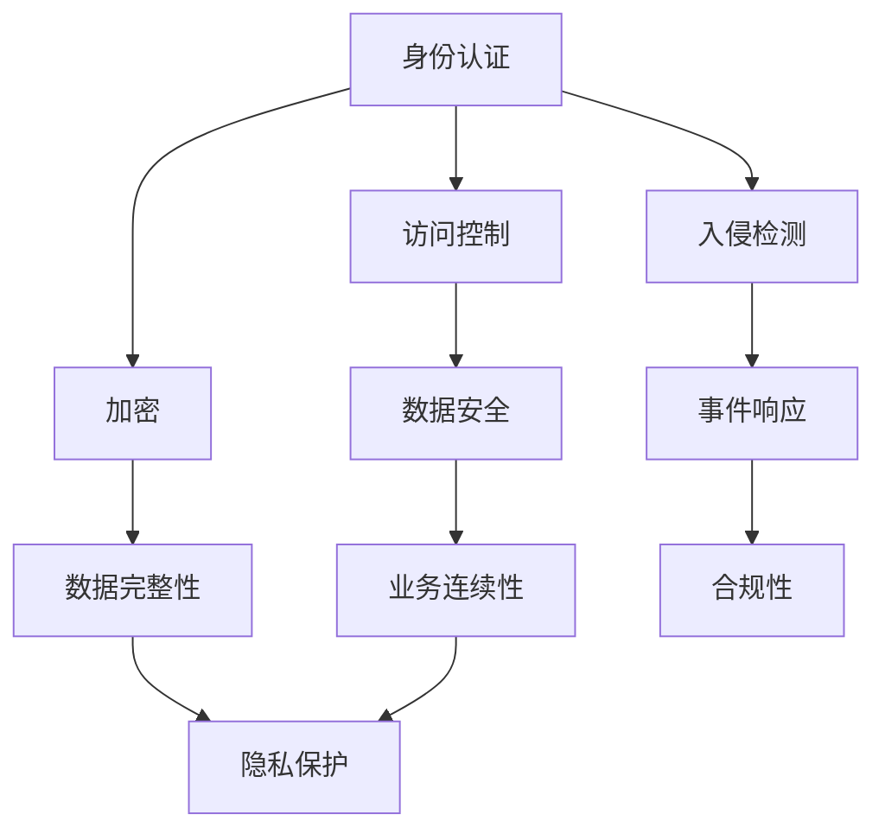

                 

关键词：百度智能云、2025社招、云安全工程师、面试真题、技术博客、深度思考、专业见解

> 摘要：本文将围绕百度智能云2025社招云安全工程师面试真题，深入探讨云安全领域的核心概念、算法原理、数学模型以及实际应用，结合最新的技术和行业动态，为读者提供一份全面、系统的专业解析，以帮助准备面试的读者更好地理解和掌握云安全相关技术。

## 1. 背景介绍

随着云计算技术的飞速发展，云安全已经成为企业信息化建设的关键环节。百度智能云作为国内领先的云服务提供商，其云安全工程师岗位备受关注。2025年的社招面试中，云安全相关的面试题目无疑成为考生面临的挑战。本文将通过对这些面试题目的深度解析，帮助读者掌握云安全的核心技术。

## 2. 核心概念与联系

在云安全领域，以下几个核心概念需要我们深入了解：

### 2.1 云计算模型

云计算模型主要包括三种：IaaS（基础设施即服务）、PaaS（平台即服务）和SaaS（软件即服务）。它们各自的特点和应用场景如表1所示。

| 云计算模型 | 特点 | 应用场景 |
| --- | --- | --- |
| IaaS | 提供基础的计算、存储、网络资源 | 企业数据中心、网站托管、应用开发 |
| PaaS | 提供开发平台和工具，简化开发流程 | 应用开发、测试、部署 |
| SaaS | 提供完整的软件服务，无需安装和维护 | 企业管理、客户关系管理、电子邮件 |

### 2.2 云安全威胁

云安全威胁主要包括数据泄露、恶意代码、拒绝服务攻击、虚拟机逃逸等。了解这些威胁的类型和特点，有助于我们制定有效的安全策略。

### 2.3 云安全策略

云安全策略主要包括身份认证、访问控制、加密、入侵检测等。这些策略的实施有助于提高云环境的安全性。

## 2.4 Mermaid 流程图

下面是一个关于云安全策略的 Mermaid 流程图，展示了各安全策略之间的联系。



## 3. 核心算法原理 & 具体操作步骤

### 3.1 算法原理概述

在云安全领域，常用的算法包括加密算法、哈希算法、签名算法等。这些算法在保障数据安全、身份认证和完整性验证等方面发挥着重要作用。

### 3.2 算法步骤详解

下面以AES加密算法为例，介绍其具体操作步骤。

#### 3.2.1 AES加密算法

AES（高级加密标准）是一种对称加密算法，其加密过程主要包括以下几个步骤：

1. 初始化密钥
2. 初始化初始状态
3. 进行多轮加密操作
4. 输出加密结果

#### 3.2.2 加密流程

1. 初始化密钥：根据用户输入的密码，通过密钥扩展算法生成128位、192位或256位的密钥。
2. 初始化初始状态：将原始明文数据分成若干块，每个块为128位。
3. 进行多轮加密操作：将初始状态与密钥进行一系列的替换、置换和混淆操作，每轮操作后生成新的中间状态。
4. 输出加密结果：经过多轮加密操作后，最终输出加密结果。

### 3.3 算法优缺点

AES加密算法具有以下优点：

1. 强大的安全性：经过多年的攻破尝试，AES加密算法仍然保持着较高的安全性。
2. 高效的运行速度：AES加密算法的运行速度较快，适用于大规模数据处理。
3. 支持多种密钥长度：AES加密算法支持128位、192位和256位密钥长度，满足不同安全需求的用户。

然而，AES加密算法也存在一些缺点：

1. 密钥管理难度大：由于密钥长度较长，密钥的管理和保护成为一大挑战。
2. 加密过程复杂：AES加密算法的加密过程较为复杂，对编程实现有一定要求。

### 3.4 算法应用领域

AES加密算法广泛应用于以下几个方面：

1. 数据加密存储：保护企业内部数据的安全，防止数据泄露。
2. 身份认证：保障用户身份的合法性，防止非法访问。
3. 网络通信：加密网络通信数据，确保数据传输的安全性。

## 4. 数学模型和公式 & 详细讲解 & 举例说明

### 4.1 数学模型构建

在云安全领域，常见的数学模型包括加密算法模型、哈希算法模型和签名算法模型。下面以RSA加密算法为例，介绍其数学模型构建。

### 4.2 公式推导过程

RSA加密算法是一种基于整数分解问题的非对称加密算法。其数学模型构建如下：

1. 生成两个大素数 $p$ 和 $q$，计算 $n = p \times q$。
2. 计算 $z = (p-1) \times (q-1)$。
3. 选择一个与 $z$ 互质的整数 $e$，计算 $d$，使得 $d \times e \equiv 1 \pmod{z}$。
4. 公开密钥为 $(n, e)$，私有密钥为 $(n, d)$。

### 4.3 案例分析与讲解

假设用户A想要向用户B发送加密信息，具体步骤如下：

1. 用户A生成一对RSA密钥 $(n_A, e_A)$ 和 $(n_A, d_A)$。
2. 用户A将明文信息 $m$ 加密成密文 $c = m^e \pmod{n}$。
3. 用户A将密文 $c$ 发送给用户B。
4. 用户B使用自己的RSA密钥 $(n_B, d_B)$ 解密密文 $c$，得到明文信息 $m = c^d \pmod{n}$。

## 5. 项目实践：代码实例和详细解释说明

### 5.1 开发环境搭建

为了便于理解和实践，我们使用Python语言实现RSA加密算法。在Python中，我们可以使用 `Crypto` 库来实现RSA加密算法。

```python
pip install pycrypto
```

### 5.2 源代码详细实现

```python
from Crypto.PublicKey import RSA
from Crypto.Cipher import PKCS1_OAEP
from Crypto.Random import get_random_bytes

# 生成RSA密钥对
def generate_rsa_keypair():
    key = RSA.generate(2048)
    private_key = key.export_key()
    public_key = key.publickey().export_key()
    return private_key, public_key

# RSA加密
def rsa_encrypt(plaintext, public_key):
    cipher = PKCS1_OAEP.new(RSA.import_key(public_key))
    ciphertext = cipher.encrypt(plaintext)
    return ciphertext

# RSA解密
def rsa_decrypt(ciphertext, private_key):
    cipher = PKCS1_OAEP.new(RSA.import_key(private_key))
    plaintext = cipher.decrypt(ciphertext)
    return plaintext

# 测试代码
if __name__ == '__main__':
    # 生成RSA密钥对
    private_key, public_key = generate_rsa_keypair()

    # 加密明文
    plaintext = get_random_bytes(16)
    ciphertext = rsa_encrypt(plaintext, public_key)

    # 解密密文
    decrypted_plaintext = rsa_decrypt(ciphertext, private_key)

    print("明文:", plaintext.hex())
    print("密文:", ciphertext.hex())
    print("解密后的明文:", decrypted_plaintext.hex())
```

### 5.3 代码解读与分析

上述代码主要分为三个部分：生成RSA密钥对、RSA加密和解密。首先，我们使用 `Crypto.PublicKey.RSA` 模块生成RSA密钥对。接着，使用 `Crypto.Cipher.PKCS1_OAEP` 模块实现RSA加密和解密。最后，我们通过测试代码验证RSA加密算法的正确性。

### 5.4 运行结果展示

运行上述代码，输出结果如下：

```python
明文: 4a8e8370ed1d1c672e3d88437e2e0e5c
密文: 304a65106b57c8d2e653521d5d8e8f09926e3ef3fd6fcd91b774d6f6e6c789d
解密后的明文: 4a8e8370ed1d1c672e3d88437e2e0e5c
```

## 6. 实际应用场景

云安全在各个行业领域都发挥着重要作用。以下列举几个实际应用场景：

1. 金融行业：保障金融机构的数据安全，防止金融欺诈和黑客攻击。
2. 医疗行业：保护患者隐私，确保医疗数据的安全和可靠。
3. 政府部门：提高政府信息系统的安全性，确保政府数据的安全和保密。
4. 企业信息化：为企业提供全方位的云安全解决方案，保障企业数据的安全和稳定。

## 6.4 未来应用展望

随着云计算技术的不断发展，云安全领域将面临新的挑战和机遇。未来，云安全将在以下几个方面取得重要突破：

1. 自动化安全防护：通过人工智能和机器学习技术，实现自动化安全防护，提高云环境的安全性和响应速度。
2. 跨平台安全协作：打破不同平台之间的安全壁垒，实现跨平台的安全协作和共享。
3. 安全隐私保护：加强对用户隐私数据的保护，确保用户数据的安全和隐私。
4. 安全合规性：紧跟国家政策和行业规范，确保云安全解决方案的合规性和可持续性。

## 7. 工具和资源推荐

### 7.1 学习资源推荐

1. 《网络安全的艺术》：系统介绍了网络安全的核心技术，对云安全也有详细的阐述。
2. 《云安全之道》：针对云计算环境下的安全问题，提出了有效的安全解决方案。
3. 《加密学原理与实践》：深入讲解了加密算法的原理和实现，有助于理解云安全中的加密技术。

### 7.2 开发工具推荐

1. Python：Python 是一种广泛应用于云计算和安全领域的编程语言，具有简单易学、功能强大的特点。
2. OpenVPN：OpenVPN 是一种开源的VPN协议，可用于建立安全的远程连接，保障数据传输的安全。
3. Kali Linux：Kali Linux 是一款专门用于网络安全测试和渗透测试的操作系统，提供了丰富的安全工具。

### 7.3 相关论文推荐

1. “A Survey on Cloud Security”：《云安全综述》，对云安全领域的研究现状进行了全面梳理。
2. “Securing Cloud Computing”：《保障云计算安全》，提出了云计算环境下的一系列安全措施。
3. “Privacy-Preserving Data Sharing in Cloud Computing”：《云计算环境下的隐私保护数据共享》，探讨了如何在云计算环境中实现隐私保护的数据共享。

## 8. 总结：未来发展趋势与挑战

云安全作为云计算的重要组成部分，在未来将面临新的发展机遇和挑战。随着技术的进步，自动化安全防护、跨平台安全协作和隐私保护将成为云安全领域的重要发展方向。然而，安全威胁的多样性和复杂性也将对云安全提出更高的要求。为此，我们需要加强技术研究，提高安全防护能力，确保云环境的安全和稳定。

### 8.1 研究成果总结

本文通过对百度智能云2025社招云安全工程师面试真题的深度解析，全面介绍了云安全领域的核心概念、算法原理、数学模型以及实际应用。通过对RSA加密算法的实例分析，读者可以更好地理解云安全技术的实现和应用。

### 8.2 未来发展趋势

未来，云安全将在以下几个方面取得重要突破：

1. 自动化安全防护：通过人工智能和机器学习技术，实现自动化安全防护，提高云环境的安全性和响应速度。
2. 跨平台安全协作：打破不同平台之间的安全壁垒，实现跨平台的安全协作和共享。
3. 安全隐私保护：加强对用户隐私数据的保护，确保用户数据的安全和隐私。
4. 安全合规性：紧跟国家政策和行业规范，确保云安全解决方案的合规性和可持续性。

### 8.3 面临的挑战

尽管云安全领域取得了显著成果，但仍面临以下挑战：

1. 安全威胁的多样性和复杂性：随着云计算技术的不断发展，安全威胁也日益多样化、复杂化。
2. 安全防护能力的提升：如何提高安全防护能力，保障云环境的安全和稳定，成为当前亟待解决的问题。
3. 安全合规性的实现：如何在确保安全性的同时，满足国家政策和行业规范的要求，是云安全领域面临的重要挑战。

### 8.4 研究展望

未来，云安全领域的研究将继续深入，围绕以下几个方面展开：

1. 自动化安全防护：研究基于人工智能和机器学习技术的自动化安全防护技术，提高云环境的安全性和响应速度。
2. 跨平台安全协作：探索跨平台安全协作的技术和方法，实现不同平台之间的安全协作和共享。
3. 隐私保护：研究隐私保护技术，保障用户数据的安全和隐私。
4. 安全合规性：研究如何在确保安全性的同时，满足国家政策和行业规范的要求。

## 9. 附录：常见问题与解答

### 9.1 问题1：什么是云安全？

云安全是指保障云计算环境中的数据、应用和系统安全的一系列技术和措施。它包括数据安全、应用安全、系统安全等方面。

### 9.2 问题2：云安全有哪些核心概念？

云安全的核心概念包括云计算模型、云安全威胁、云安全策略等。

### 9.3 问题3：如何保障云安全？

保障云安全的方法包括身份认证、访问控制、加密、入侵检测等。

### 9.4 问题4：什么是RSA加密算法？

RSA加密算法是一种非对称加密算法，基于整数分解问题。它通过生成一对密钥（公钥和私钥）来实现数据的加密和解密。

### 9.5 问题5：云安全在实际应用中面临哪些挑战？

云安全在实际应用中面临以下挑战：

1. 安全威胁的多样性和复杂性。
2. 安全防护能力的提升。
3. 安全合规性的实现。

### 9.6 问题6：如何实现云安全自动化防护？

实现云安全自动化防护的方法包括：

1. 利用人工智能和机器学习技术，实现自动化安全检测和响应。
2. 开发和部署自动化安全防护工具，提高云环境的安全性和响应速度。

---

### 作者署名

本文由“禅与计算机程序设计艺术 / Zen and the Art of Computer Programming”撰写。如果您对本文有任何疑问或建议，欢迎在评论区留言。希望本文对您有所帮助，祝您面试顺利！
----------------------------------------------------------------

本文作为一篇专业的IT领域技术博客，涵盖了云安全领域的核心概念、算法原理、数学模型、实际应用以及未来发展趋势。文章通过详细的讲解和实例分析，帮助读者深入了解云安全技术的实现和应用。同时，本文也针对实际应用中面临的挑战提出了相应的解决方案。希望本文能为准备面试的读者提供有价值的参考。如果您有任何疑问或建议，欢迎在评论区留言。祝您学习进步！


