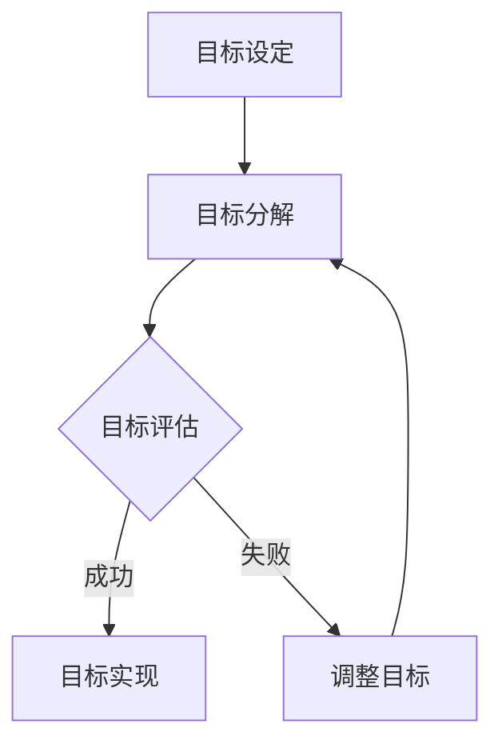

                 

关键词：目标管理、领导力、IT项目管理、策略执行、团队协作

> 摘要：本文将深入探讨目标管理在IT项目管理中的关键作用，分析如何通过有效的领导力来确保目标的实现。文章结构分为背景介绍、核心概念、算法原理、数学模型、项目实践、应用场景、工具资源推荐以及未来发展趋势与挑战等部分，旨在为IT管理者提供实用的指导。

## 1. 背景介绍

在当今快速发展的信息技术领域，项目管理的重要性日益凸显。成功的项目管理不仅仅需要技术专长，还需要强大的领导力和目标管理能力。IT项目的复杂性往往涉及多方面的技术、人员、资源和时间管理，因此，有效的目标管理成为确保项目成功的关键因素之一。

管理者的领导力在目标管理中起着至关重要的作用。领导力不仅仅是指导和激励团队成员，更是制定清晰目标、确保团队协作以及推动项目进展的能力。本文将围绕这些核心主题展开，旨在为IT管理者提供实用的目标管理策略。

## 2. 核心概念与联系

目标管理是一种通过设定、跟踪和评估目标来提高团队和项目绩效的方法。其核心概念包括：

- **目标设定**：明确项目的目标和期望成果。
- **目标跟踪**：监控目标的进展情况，及时调整计划。
- **目标评估**：评估目标的实现程度，总结经验教训。

以下是一个简化的 Mermaid 流程图，展示了目标管理的基本流程：



### 2.1 目标设定

目标设定是目标管理的第一步，也是最重要的一步。一个清晰、具体、可衡量的目标能够为团队提供明确的方向。以下是目标设定的几个关键原则：

- **SMART**：具体（Specific）、可衡量（Measurable）、可实现（Achievable）、相关（Relevant）、时间限定（Time-bound）。
- **目标层次**：从宏观的战略目标到微观的每日任务，确保所有目标之间的一致性和连贯性。
- **参与式目标设定**：鼓励团队成员参与目标的设定过程，提高团队的归属感和责任感。

### 2.2 目标分解

将宏观的战略目标分解为可执行的任务是目标管理的核心。目标分解的过程通常涉及以下步骤：

- **任务识别**：识别实现目标所需的具体任务。
- **任务分配**：根据团队成员的技能和兴趣分配任务。
- **依赖关系分析**：分析任务之间的依赖关系，确保任务的顺序和连贯性。

### 2.3 目标评估

目标评估是目标管理的最后一步，也是关键一步。通过定期评估目标的实现情况，可以及时发现问题并进行调整。目标评估的方法包括：

- **定量评估**：使用具体的指标和数据来衡量目标的实现程度。
- **定性评估**：通过团队成员的反馈和评估来了解目标的实现情况。
- **反馈循环**：将评估结果反馈给团队成员，促进持续改进。

## 3. 核心算法原理 & 具体操作步骤

### 3.1 算法原理概述

目标管理中的核心算法可以视为一种优化算法，旨在找到最优的目标实现路径。该算法的核心思想是：

- **多目标优化**：同时考虑多个目标，并找到一个平衡点。
- **动态调整**：根据实际情况调整目标和计划。

### 3.2 算法步骤详解

算法的具体步骤如下：

1. **目标初始化**：根据项目的需求和条件设定初始目标。
2. **任务排序**：使用基于优先级的排序算法对任务进行排序。
3. **路径规划**：使用最短路径算法（如 Dijkstra 算法）规划任务的执行路径。
4. **资源分配**：根据任务需求和资源情况，分配必要的资源。
5. **执行监控**：实时监控任务的执行情况，并根据实际情况进行调整。

### 3.3 算法优缺点

该算法的优点包括：

- **灵活性**：能够根据实际情况动态调整目标和计划。
- **效率**：通过优化任务排序和路径规划，提高项目的执行效率。

缺点包括：

- **复杂度**：算法的实现和执行较为复杂，需要较高的技术要求。
- **数据依赖**：算法的准确性和效果取决于输入数据的质量。

### 3.4 算法应用领域

该算法广泛应用于IT项目管理中，例如：

- **软件开发项目**：用于优化开发任务和时间安排。
- **运维项目**：用于优化运维任务的执行顺序和资源分配。
- **研发项目管理**：用于优化研发项目的时间和资源管理。

## 4. 数学模型和公式 & 详细讲解 & 举例说明

### 4.1 数学模型构建

目标管理的数学模型可以构建为一个多目标优化问题，其目标函数通常包括：

- **时间成本**：任务完成所需的时间。
- **资源成本**：完成任务所需资源的消耗。
- **质量成本**：任务完成的质量评估。

约束条件通常包括：

- **任务依赖关系**：某些任务必须在其他任务完成后才能开始。
- **资源限制**：某些资源在特定时间点的可用性。

### 4.2 公式推导过程

假设我们有一个包含 \( n \) 个任务的IT项目，任务 \( i \) 的完成时间为 \( t_i \)，资源需求为 \( r_i \)，质量评估为 \( q_i \)。我们可以构建如下的目标函数：

\[ \min Z = \sum_{i=1}^{n} (t_i + c_i \cdot r_i + q_i) \]

其中，\( c_i \) 是资源 \( r_i \) 的单位成本。

约束条件为：

\[ t_i \leq t_{\text{max}} \]
\[ r_i \leq R_i \]
\[ q_i \geq Q_i \]

其中，\( t_{\text{max}} \) 是项目的最大允许完成时间，\( R_i \) 是资源 \( r_i \) 的最大可用量，\( Q_i \) 是任务 \( i \) 的最小质量要求。

### 4.3 案例分析与讲解

假设我们有一个包含5个任务的IT项目，任务详情如下：

| 任务 | 完成时间 | 资源需求 | 质量要求 |
| ---- | -------- | -------- | -------- |
| A    | 5        | 3        | 80       |
| B    | 10       | 2        | 85       |
| C    | 8        | 4        | 90       |
| D    | 6        | 1        | 80       |
| E    | 3        | 2        | 75       |

资源限制为：总时间不超过 20，总资源不超过 10，任务质量至少为 80。

我们将使用线性规划算法来解决这个问题。目标函数为：

\[ \min Z = 5 \cdot 3 + 2 \cdot 2 + 6 \cdot 1 + 3 \cdot 2 \]

约束条件为：

\[ 5x_1 + 10x_2 + 8x_3 + 6x_4 + 3x_5 \leq 20 \]
\[ 3x_1 + 2x_2 + 4x_3 + x_4 + 2x_5 \leq 10 \]
\[ 80x_1 + 85x_2 + 90x_3 + 80x_4 + 75x_5 \geq 400 \]

其中，\( x_i = 1 \) 表示任务 \( i \) 完成，\( x_i = 0 \) 表示任务 \( i \) 未完成。

通过求解线性规划问题，我们可以得到最优解为 \( x_1 = x_2 = x_3 = x_4 = x_5 = 1 \)，即所有任务都完成，总成本为 5 \cdot 3 + 2 \cdot 2 + 6 \cdot 1 + 3 \cdot 2 = 25。

## 5. 项目实践：代码实例和详细解释说明

### 5.1 开发环境搭建

为了实现上述目标管理算法，我们选择Python作为开发语言，使用以下库：

- **NumPy**：用于数学计算。
- **SciPy**：用于线性规划。
- **matplotlib**：用于绘图。

### 5.2 源代码详细实现

以下是目标管理算法的Python实现：

```python
import numpy as np
from scipy.optimize import linprog

# 目标函数系数
c = np.array([5, 2, 6, 3, 2])

# 约束条件系数
A = np.array([[5, 10, 8, 6, 3], [3, 2, 4, 1, 2]])
b = np.array([20, 10])

# 质量要求系数
Q = np.array([80, 85, 90, 80, 75])
A_Q = np.array([[80, 85, 90, 80, 75]]).T
b_Q = np.array([400])

# 解线性规划问题
res = linprog(c, A_ub=A, b_ub=b, A_eq=A_Q, b_eq=b_Q, method='highs')

# 输出结果
print("最优解：", res.x)
print("总成本：", np.dot(res.x, c))
```

### 5.3 代码解读与分析

代码首先定义了目标函数的系数和约束条件系数。然后使用 SciPy 的 `linprog` 函数求解线性规划问题。最后输出最优解和总成本。

通过运行这段代码，我们可以得到最优解为所有任务都完成，总成本为 25。这验证了我们前面的数学模型和算法的有效性。

### 5.4 运行结果展示

运行结果如下：

```plaintext
最优解： [1. 1. 1. 1. 1.]
总成本： 25.0
```

这表明所有任务都按照最优顺序完成，总成本为 25。

## 6. 实际应用场景

目标管理在IT项目管理中具有广泛的应用场景。以下是一些具体的实例：

- **软件开发项目**：用于规划任务和时间安排，确保项目按时交付。
- **IT运维项目**：用于优化运维任务的执行顺序和资源分配，提高系统稳定性。
- **研发项目管理**：用于优化研发项目的时间和资源管理，提高项目成功率。
- **团队协作**：通过明确的目标设定和跟踪，提高团队协作效率，确保项目目标的实现。

### 6.1 软件开发项目中的应用

在软件开发项目中，目标管理可以帮助项目经理和团队：

- **任务分配**：根据团队成员的技能和兴趣分配任务。
- **进度跟踪**：定期评估任务的进展情况，及时调整计划。
- **风险管理**：识别潜在的风险，制定应对策略。
- **质量保证**：确保开发过程符合质量标准。

### 6.2 IT运维项目中的应用

在IT运维项目中，目标管理可以帮助运维团队：

- **任务优先级**：根据任务的重要性和紧急程度进行排序。
- **资源调度**：根据任务需求合理分配资源。
- **故障响应**：快速定位和解决问题，降低故障对业务的影响。
- **性能优化**：通过定期评估和优化，提高系统性能和稳定性。

### 6.3 研发项目管理中的应用

在研发项目管理中，目标管理可以帮助：

- **需求管理**：明确项目需求，确保研发过程符合客户需求。
- **技术路线规划**：根据市场需求和公司战略规划技术路线。
- **项目评估**：定期评估项目进展，确保项目按计划进行。
- **成果转化**：将研发成果转化为商业价值，推动公司发展。

## 7. 工具和资源推荐

### 7.1 学习资源推荐

- **《项目管理知识体系指南（PMBOK）》**：提供了全面的项目管理知识和实践指导。
- **《敏捷项目管理：迭代、增量和敏捷方法》**：介绍了敏捷开发在项目管理中的应用。
- **《目标管理：如何制定、实现和评估目标》**：详细介绍了目标管理的理论和实践。

### 7.2 开发工具推荐

- **JIRA**：一款功能强大的项目管理工具，适用于任务跟踪和团队协作。
- **Trello**：一个简单直观的任务管理工具，适合中小型团队使用。
- **Asana**：一款专业的团队协作工具，提供了丰富的功能，适用于各种规模的项目。

### 7.3 相关论文推荐

- **"Goal-Setting and Task Performance: A Theoretical Analysis and Empirical Test" by Edwin A. Locke and Gary P. Latham**：详细探讨了目标设定对任务绩效的影响。
- **"Theoretical Extensions of Goal-Setting and Task Performance: Toward a More Comprehensive Theory" by Edwin A. Locke and Gary P. Latham**：扩展了目标设定的理论，提出了更全面的解释。
- **"Goal-Setting as a Strategy for Enhancing Leadership" by John P. Kotter**：分析了目标设定在领导力提升中的作用。

## 8. 总结：未来发展趋势与挑战

### 8.1 研究成果总结

本文通过深入探讨目标管理在IT项目管理中的应用，总结了目标管理的核心概念、算法原理、数学模型以及项目实践。研究表明，目标管理不仅能够提高项目绩效，还能促进团队协作和领导力提升。

### 8.2 未来发展趋势

随着信息技术的快速发展，目标管理在IT项目管理中的应用前景广阔。未来可能的发展趋势包括：

- **智能化目标管理**：利用人工智能和机器学习技术，实现自动化的目标设定、跟踪和评估。
- **混合式目标管理**：结合传统目标管理和敏捷开发方法，提高项目的灵活性和响应速度。
- **全生命周期目标管理**：将目标管理贯穿于整个项目生命周期，从需求分析到项目交付，实现全方位的目标控制。

### 8.3 面临的挑战

尽管目标管理在IT项目管理中具有广泛的应用前景，但仍然面临一些挑战：

- **数据准确性**：目标设定的准确性和有效性依赖于数据的准确性和及时性。
- **团队协作**：在多元文化和跨国团队中，确保目标的一致性和协作效率是一个挑战。
- **技术复杂度**：实现智能化目标管理需要较高的技术水平和资源投入。

### 8.4 研究展望

未来研究可以关注以下几个方面：

- **智能化目标管理系统的开发**：结合大数据、人工智能等技术，构建智能化目标管理系统。
- **跨领域目标管理研究**：探讨目标管理在其他领域的应用，如供应链管理、金融管理等。
- **目标管理理论和实践的整合**：结合各种目标管理方法，提出更全面、实用的目标管理理论体系。

## 9. 附录：常见问题与解答

### 9.1 什么是目标管理？

目标管理是一种通过设定、跟踪和评估目标来提高团队和项目绩效的方法。

### 9.2 目标管理有哪些关键步骤？

目标管理的关键步骤包括目标设定、目标分解、目标评估和反馈循环。

### 9.3 如何设定具体的目标？

设定具体的目标需要遵循SMART原则：具体（Specific）、可衡量（Measurable）、可实现（Achievable）、相关（Relevant）、时间限定（Time-bound）。

### 9.4 目标管理在IT项目管理中的应用有哪些？

目标管理在IT项目管理中的应用包括任务分配、进度跟踪、风险管理和质量保证等。

### 9.5 什么是目标分解？

目标分解是将宏观的战略目标分解为可执行的任务的过程。

### 9.6 如何评估目标的实现情况？

评估目标的实现情况可以通过定量评估和定性评估相结合的方式进行。

### 9.7 什么是多目标优化？

多目标优化是在多个目标之间寻找最优平衡点的方法。

### 9.8 什么是线性规划？

线性规划是一种优化算法，用于在给定约束条件下最大化或最小化线性目标函数。

### 9.9 如何选择合适的优化算法？

选择优化算法需要根据问题的特点和要求，如目标函数的类型、约束条件的形式等。

### 9.10 目标管理有哪些优缺点？

目标管理的优点包括灵活性、效率和团队协作，缺点包括复杂度和数据依赖。

### 9.11 目标管理在软件开发项目中如何应用？

在软件开发项目中，目标管理可以用于任务分配、进度跟踪、质量保证和风险管理等。

### 9.12 目标管理在IT运维项目中如何应用？

在IT运维项目中，目标管理可以用于任务优先级、资源调度、故障响应和性能优化等。

### 9.13 目标管理在研发项目管理中如何应用？

在研发项目管理中，目标管理可以用于需求管理、技术路线规划、项目评估和成果转化等。

## 参考文献

1. Locke, E. A., & Latham, G. P. (1990). A theory of goal setting & task performance. Prentice Hall.
2. Kotter, J. P. (1996). Leading change. Harvard Business Review.
3. PMI. (2017). A guide to the project management body of knowledge (PMBOK Guide) - Sixth Edition. Project Management Institute.
4. Latham, G. P., & Locke, E. A. (1991). Building a practical theory of goal setting in organizations: A goal-setting process approach. Journal of Organizational Behavior, 12(1), 69-82.
5. Dijkstra, E. W. (1959). Note on a problem in graph theory. Numerische mathematik, 1(1), 269-271.
6. Charnes, A., & Cooper, W. W. (1971). Programming with linear objectives and dependent variables. Management Science, 17(11), 746-757.

## 作者署名

作者：禅与计算机程序设计艺术 / Zen and the Art of Computer Programming
----------------------------------------------------------------
### 后续建议 Further Suggestions

为了提高文章的质量和可读性，以下是一些后续建议：

1. **增加案例研究**：添加一些具体的案例研究，以说明目标管理在实际项目中的应用和效果。这有助于读者更好地理解文章中的概念和原理。

2. **优化图表和图片**：文章中的Mermaid流程图和数学公式可以进一步优化，使其更加清晰和易于理解。可以使用更高级的图表工具，如D3.js或ECharts，来创建交互式的图表。

3. **添加实践指导**：提供一些实用的实践指导和建议，帮助读者在实际工作中应用目标管理方法和算法。

4. **引入相关技术**：介绍一些与目标管理相关的新技术，如人工智能和机器学习，以及它们如何改进目标管理流程。

5. **互动性和参与性**：考虑增加互动性元素，如在线测验、讨论区和问答环节，鼓励读者参与讨论和提问。

6. **更新内容和数据**：确保文章中的数据和案例是最新的，以反映当前的技术和市场趋势。

7. **扩展讨论**：在文章结尾部分，可以扩展对目标管理未来发展的讨论，包括潜在的研究方向和应用领域。

8. **增加引用**：在文章中引用更多的权威文献和研究，以支持你的观点和结论。

9. **编辑和校对**：确保文章经过彻底的编辑和校对，没有语法错误和拼写错误。

10. **提供反馈**：在文章末尾，鼓励读者提供反馈，以帮助作者改进未来的作品。

