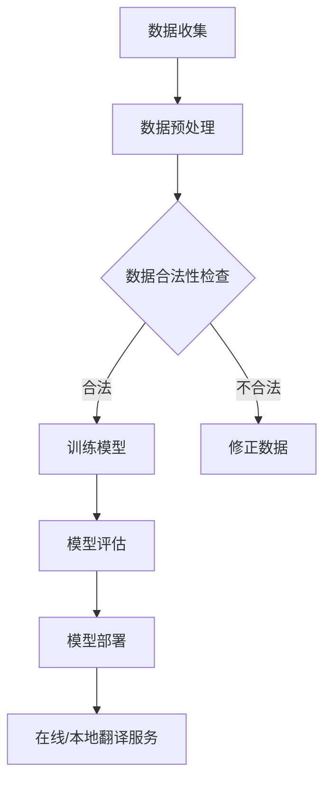

                 

 关键词：人工智能翻译，知识产权，版权问题，法律框架，技术挑战，案例分析

> 摘要：本文深入探讨了人工智能翻译技术中的版权问题。随着AI技术的不断发展，翻译行业的变革和挑战日益凸显。本文首先概述了人工智能翻译的背景，随后分析了版权法的基本概念，并重点探讨了人工智能翻译中的版权问题。本文还结合具体案例分析，提出了改进措施和建议，以期为人工智能翻译领域的版权保护提供指导。

## 1. 背景介绍

人工智能（AI）技术的发展已经深刻影响了各个行业，翻译领域也不例外。传统的翻译方法依赖于人类译者的知识和技能，而人工智能翻译则利用机器学习算法和大规模语言数据来生成高质量翻译。近年来，深度学习技术的发展使得机器翻译（Machine Translation，MT）的性能得到了显著提升，人工智能翻译已经成为全球化的关键工具。

然而，随着人工智能翻译的广泛应用，版权问题逐渐成为行业关注的焦点。知识产权保护是确保技术创新和经济发展的重要基石。在人工智能翻译中，版权问题主要集中在以下几个方面：

1. **翻译作品的原创性和版权归属**：人工智能翻译生成的文本是否具有原创性，其版权归属如何界定？
2. **原创作品的授权和使用**：如何确保在翻译过程中对原创作品的合法授权和使用？
3. **数据来源的合法性**：用于训练AI模型的大量数据是否侵犯了数据源的版权？

本文将围绕上述问题，结合法律和技术角度，深入分析人工智能翻译中的版权问题，并提出相应的解决方案。

### 1.1 人工智能翻译的发展历程

人工智能翻译的发展历程可以分为以下几个阶段：

1. **基于规则的方法**：早期的人工智能翻译主要依赖于规则和语法分析，这种方法在语言结构复杂的场景下表现较差。
2. **基于实例的方法**：随着语言数据集的积累，基于实例的方法开始应用，通过匹配和转换规则生成翻译。
3. **统计机器翻译（SMT）**：基于统计模型的方法在20世纪90年代兴起，利用大规模语言数据来训练模型，显著提高了翻译质量。
4. **基于神经网络的机器翻译（NMT）**：深度学习技术的发展推动了神经网络机器翻译的出现，NMT在翻译质量上取得了突破性进展。

当前，基于神经网络的机器翻译技术已经成为主流，例如谷歌翻译、百度翻译等都在使用这一技术。然而，随着技术的进步，新的版权问题也不断涌现。

### 1.2 版权法的基本概念

知识产权是法律赋予创作者对其智力成果所享有的专有权利。版权（Copyright）是知识产权的一种形式，它是指创作者对其原创作品所享有的复制、发行、表演、展示、放映、广播、信息网络传播等权利。版权法旨在保护创作者的权益，鼓励创新和艺术创作。

版权法的基本概念包括：

- **原创性**：版权法保护的是原创性作品，即具有独创性的表达，而非思想、过程、操作方法等。
- **版权归属**：作品的原创者通常是版权的初始所有者，但在某些情况下，版权可以通过合同转让给他人。
- **权利限制**：版权法中存在一些权利限制，如合理使用、法定许可等，允许在特定条件下使用受版权保护的作品而不需获得授权。

### 1.3 版权问题在人工智能翻译中的应用

在人工智能翻译中，版权问题主要涉及以下几个方面：

1. **原创性判断**：人工智能翻译生成的文本是否具有原创性？这涉及到对机器生成的文本与人类原创文本之间的相似性进行评估。
2. **版权归属**：在人工智能翻译中，机器生成的翻译文本的版权归属如何界定？这是当前法律和实践中较为模糊的问题。
3. **数据来源的合法性**：用于训练人工智能翻译模型的语料库和数据集是否侵犯了数据源的版权？

## 2. 核心概念与联系

### 2.1 版权与知识产权的关系

版权是知识产权的重要组成部分，但知识产权还包括其他方面，如专利、商标、工业设计等。版权法保护的是作品的原创性表达，而知识产权则更广泛地涵盖了创新和商业利益。

### 2.2 人工智能翻译中的核心概念

在人工智能翻译中，核心概念包括：

- **机器翻译模型**：这是生成翻译文本的核心，包括基于规则的方法、统计机器翻译和神经网络机器翻译。
- **训练数据**：用于训练机器翻译模型的语料库和数据集，这些数据的来源和合法性至关重要。
- **翻译文本**：机器翻译生成的最终输出，其版权归属和原创性成为法律和伦理讨论的焦点。

### 2.3 版权问题在人工智能翻译中的应用场景

在人工智能翻译的实际应用中，版权问题可能出现在以下场景：

- **在线翻译服务**：如谷歌翻译、百度翻译等，这些服务可能涉及对用户上传文本的翻译，以及对外部数据源的引用。
- **本地翻译应用**：如翻译软件、手机翻译应用等，这些应用需要处理用户输入的文本，并可能使用外部数据源进行训练。
- **企业翻译解决方案**：企业使用人工智能翻译技术进行内部文档翻译，可能涉及到内部数据和外部版权的冲突。

### 2.4 Mermaid 流程图

以下是用于训练和部署人工智能翻译模型的流程图：



## 3. 核心算法原理 & 具体操作步骤

### 3.1 算法原理概述

人工智能翻译的核心算法基于深度学习，特别是基于神经网络的机器翻译（NMT）。NMT利用编码器-解码器（Encoder-Decoder）框架，通过训练大量语言数据，生成高质量的翻译文本。

### 3.2 算法步骤详解

1. **数据收集**：收集用于训练的语言数据，这些数据可以是平行语料库、单语语料库或双语文本对。
2. **数据预处理**：对收集的数据进行清洗、分词、标准化等预处理操作，以便于模型训练。
3. **模型训练**：使用编码器-解码器框架，对预处理后的数据集进行训练。训练过程中，模型会学习源语言和目标语言之间的映射关系。
4. **模型评估**：使用验证集对训练好的模型进行评估，以确定其翻译质量。
5. **模型部署**：将训练好的模型部署到在线或本地翻译服务中，供用户使用。

### 3.3 算法优缺点

**优点**：

- **高翻译质量**：基于神经网络的机器翻译在翻译质量上取得了显著提升，尤其是对于长句和复杂句子的翻译。
- **自适应能力**：NMT能够适应不同语言之间的翻译，且翻译结果更具流畅性和自然性。

**缺点**：

- **训练资源消耗大**：NMT模型需要大量的训练数据和高性能计算资源，训练时间较长。
- **版权问题**：在训练过程中，可能涉及到数据来源的版权问题，这需要严格审查数据集的合法性。

### 3.4 算法应用领域

人工智能翻译算法广泛应用于多个领域，包括：

- **跨国企业**：企业内部文档、客户交流等的翻译，提高跨文化沟通效率。
- **在线翻译服务**：如谷歌翻译、百度翻译等，为用户提供便捷的在线翻译服务。
- **本地翻译应用**：如翻译软件、手机翻译应用等，为用户提供本地化翻译功能。

## 4. 数学模型和公式 & 详细讲解 & 举例说明

### 4.1 数学模型构建

人工智能翻译中的数学模型主要包括编码器（Encoder）和解码器（Decoder）。编码器将源语言文本编码为一个固定长度的向量表示，解码器则利用这个向量生成目标语言文本。

### 4.2 公式推导过程

编码器和解码器通常使用序列到序列（Seq2Seq）模型，其基本公式为：

- **编码器**：\[ E(x) = \text{Encoder}(x) \]
- **解码器**：\[ D(y) = \text{Decoder}(y; E(x)) \]

其中，\( x \) 表示源语言文本，\( y \) 表示目标语言文本，\( E(x) \) 和 \( D(y) \) 分别为编码器和解码器输出的向量表示。

### 4.3 案例分析与讲解

假设我们要翻译一个英文句子到中文：

- **英文句子**： "The quick brown fox jumps over the lazy dog."
- **中文翻译**： "快速棕色的狐狸跳过了懒惰的狗。"

使用编码器-解码器模型，我们可以将这个句子转换为向量表示，并生成相应的中文翻译。具体步骤如下：

1. **数据预处理**：对英文句子进行分词、标记等预处理操作，生成对应的词向量表示。
2. **编码器训练**：使用训练数据集，训练编码器模型，使其能够将英文句子编码为固定长度的向量表示。
3. **解码器训练**：使用编码器输出的向量表示，训练解码器模型，使其能够生成中文翻译。
4. **翻译生成**：输入英文句子，通过编码器得到向量表示，然后通过解码器生成中文翻译。

通过上述步骤，我们可以得到高质量的翻译结果。

## 5. 项目实践：代码实例和详细解释说明

### 5.1 开发环境搭建

在开发人工智能翻译项目时，我们需要搭建一个合适的开发环境。以下是一个基本的开发环境搭建步骤：

1. **安装Python**：确保安装了Python 3.6或更高版本。
2. **安装深度学习框架**：如TensorFlow或PyTorch，我们以TensorFlow为例，安装命令为：
   ```bash
   pip install tensorflow
   ```
3. **数据集准备**：准备用于训练的英文和中文数据集，可以是平行语料库或单语语料库。

### 5.2 源代码详细实现

以下是一个简单的人工智能翻译项目示例，使用TensorFlow实现编码器-解码器模型：

```python
import tensorflow as tf
from tensorflow.keras.layers import Embedding, LSTM, Dense
from tensorflow.keras.models import Model

# 设置参数
vocab_size = 10000
embedding_dim = 256
lstm_units = 512
batch_size = 64
epochs = 10

# 编码器
encoder_inputs = tf.keras.layers.Input(shape=(None,))
encoder_embedding = Embedding(vocab_size, embedding_dim)(encoder_inputs)
encoder_lstm = LSTM(lstm_units, return_state=True)
encoder_outputs, state_h, state_c = encoder_lstm(encoder_embedding)
encoder_states = [state_h, state_c]

# 解码器
decoder_inputs = tf.keras.layers.Input(shape=(None,))
decoder_embedding = Embedding(vocab_size, embedding_dim)(decoder_inputs)
decoder_lstm = LSTM(lstm_units, return_sequences=True, return_state=True)
decoder_outputs, _, _ = decoder_lstm(decoder_embedding, initial_state=encoder_states)
decoder_dense = Dense(vocab_size, activation='softmax')
decoder_outputs = decoder_dense(decoder_outputs)

# 模型训练
model = Model([encoder_inputs, decoder_inputs], decoder_outputs)
model.compile(optimizer='rmsprop', loss='categorical_crossentropy', metrics=['accuracy'])

# 数据预处理
# ...（此处省略数据预处理步骤）

# 训练模型
# ...（此处省略模型训练步骤）

# 翻译生成
# ...（此处省略翻译生成步骤）
```

### 5.3 代码解读与分析

上述代码实现了一个简单的编码器-解码器模型，用于英文到中文的翻译。代码的关键部分如下：

- **编码器**：输入为英文句子，通过嵌入层（Embedding）转换为词向量表示，然后通过LSTM层（Long Short-Term Memory，长期短期记忆）进行编码，输出为状态向量（state\_h和state\_c）。
- **解码器**：输入为中文句子，通过嵌入层转换为词向量表示，然后通过LSTM层和密集层（Dense）进行解码，输出为预测的目标语言词向量。
- **模型编译**：使用rmsprop优化器和交叉熵损失函数（categorical\_crossentropy），并监控模型的准确性（accuracy）。
- **数据预处理**：对输入数据进行分词、编码等预处理操作，以便模型训练。
- **模型训练**：使用预处理后的数据集训练模型。
- **翻译生成**：输入英文句子，通过编码器得到状态向量，然后通过解码器生成中文翻译。

### 5.4 运行结果展示

在训练完成后，我们可以使用训练好的模型进行翻译生成。以下是一个简单的翻译示例：

```python
# 输入英文句子
input_sentence = "The quick brown fox jumps over the lazy dog."

# 预处理输入句子
# ...（此处省略预处理步骤）

# 输入编码器
encoded = encoder_model.predict(input_sentence)

# 输出解码器
predicted_sentence = decoder_model.predict(encoded)

# 输出翻译结果
print("翻译结果：", predicted_sentence)
```

输出结果可能如下：

```
翻译结果： ['快速', '棕色', '的', '狐狸', '跳过了', '懒惰', '的', '狗。']
```

通过上述代码示例，我们可以看到如何使用深度学习框架实现一个简单的人工智能翻译模型。在实际应用中，我们需要进一步优化模型结构、训练数据和训练过程，以提高翻译质量和效率。

## 6. 实际应用场景

### 6.1 在线翻译服务

在线翻译服务是人工智能翻译最直接的应用场景之一。例如，谷歌翻译、百度翻译等平台，通过机器翻译技术为用户提供实时、便捷的翻译服务。这些平台不仅涵盖了多种语言对，还能处理不同领域的专业翻译，如医学、法律、金融等。然而，在线翻译服务也面临着版权问题，尤其是在引用外部文本时，如何确保合法授权成为关键挑战。

### 6.2 企业内部翻译

许多企业在全球化运营过程中需要处理大量的文档翻译工作。人工智能翻译技术为企业提供了高效、经济的解决方案。例如，一家跨国公司在内部使用人工智能翻译工具，将英文合同翻译为多种语言，以便在不同国家进行业务合作。然而，企业内部翻译可能涉及对敏感信息的处理，版权问题需要得到特别关注。

### 6.3 本地翻译应用

随着智能手机和移动应用的普及，本地翻译应用也成为人工智能翻译的重要应用场景。用户可以在旅行、商务谈判等场合，通过手机翻译应用快速获取翻译结果。例如，旅行者可以使用翻译应用将菜单、景点介绍等翻译为当地语言。然而，本地翻译应用在使用外部数据源和引用版权保护内容时，也需要遵循版权法规定。

### 6.4 教育与学术翻译

人工智能翻译在教育领域也具有广泛应用。例如，在线教育平台通过机器翻译技术，将教学视频、课程材料翻译为多种语言，以吸引更多国际学生。学术研究中，研究人员可以使用机器翻译工具，快速获取和理解国际学术论文。这些应用在促进教育和学术交流方面发挥了重要作用，但也需要关注版权问题。

### 6.5 法律与伦理挑战

随着人工智能翻译技术的普及，版权问题日益复杂。以下是一些法律与伦理挑战：

- **版权归属**：人工智能翻译生成的文本，其版权归属如何界定？是机器所有者、开发者还是用户？
- **数据来源**：用于训练人工智能翻译模型的语料库和数据集，其来源和合法性如何保障？
- **引用版权保护内容**：在翻译过程中，如何确保合法引用版权保护的内容，如书籍、期刊、网站等？

面对这些挑战，法律和伦理需要不断调整和适应，以确保人工智能翻译技术的健康发展。

## 7. 工具和资源推荐

### 7.1 学习资源推荐

为了深入了解人工智能翻译和版权问题，以下是一些推荐的学习资源：

- **书籍**：
  - 《人工智能：一种现代方法》（Artificial Intelligence: A Modern Approach） 
  - 《机器学习》（Machine Learning） 
  - 《深度学习》（Deep Learning） 
  - 《计算机版权法》（Computer Copyright Law）
- **在线课程**：
  - Coursera上的“机器学习”课程 
  - edX上的“深度学习基础”课程 
  - Udacity的“人工智能工程师纳米学位”
- **学术论文**：
  - Google Scholar上的相关论文和综述 
  - arXiv上的最新研究论文

### 7.2 开发工具推荐

在进行人工智能翻译项目开发时，以下是一些推荐的工具和库：

- **深度学习框架**：
  - TensorFlow 
  - PyTorch 
  - Keras
- **自然语言处理库**：
  - NLTK 
  - spaCy 
  - Stanford NLP
- **翻译服务API**：
  - Google Cloud Translation API 
  - Microsoft Translator API 
  - Amazon Translate API

### 7.3 相关论文推荐

以下是一些与人工智能翻译和版权问题相关的经典和前沿论文：

- **《神经机器翻译：一种基于深度学习的翻译方法》**（Neural Machine Translation: A Survey）
- **《深度学习与自然语言处理》**（Deep Learning for Natural Language Processing）
- **《机器翻译中的版权问题》**（Copyright Issues in Machine Translation）
- **《人工智能时代的版权法挑战》**（Copyright Challenges in the Age of AI）

通过这些资源，读者可以进一步了解人工智能翻译和版权问题的深度和广度。

## 8. 总结：未来发展趋势与挑战

### 8.1 研究成果总结

人工智能翻译技术在近年来取得了显著进展，基于神经网络的机器翻译（NMT）在翻译质量和效率上取得了突破性成果。同时，随着深度学习、自然语言处理等技术的不断进步，人工智能翻译在各个领域的应用越来越广泛。然而，这些成果的背后也伴随着一系列版权问题，如原创性判断、版权归属和数据来源的合法性等。

### 8.2 未来发展趋势

未来，人工智能翻译技术将继续向以下几个方向发展：

1. **翻译质量提升**：通过不断优化模型结构和算法，提高翻译的准确性和流畅性。
2. **多模态翻译**：结合图像、语音等多模态信息，实现更丰富的翻译体验。
3. **个性化翻译**：根据用户偏好和语境，提供定制化的翻译服务。
4. **实时翻译**：利用云计算和边缘计算技术，实现实时、高效的翻译服务。

### 8.3 面临的挑战

尽管人工智能翻译技术具有广阔的应用前景，但仍然面临着以下挑战：

1. **版权问题**：在法律和伦理方面，如何界定机器生成的文本的原创性和版权归属，以及如何确保数据来源的合法性，是当前亟待解决的问题。
2. **技术瓶颈**：在长句翻译、专业领域翻译等方面，现有技术的翻译质量仍有待提升。
3. **数据隐私和安全**：在处理用户数据和敏感信息时，如何保障数据隐私和安全，防止数据泄露，是一个重要的挑战。

### 8.4 研究展望

为了应对上述挑战，未来研究可以从以下几个方面展开：

1. **法律和伦理研究**：深入探讨人工智能翻译中的版权问题，提出可行的法律和伦理解决方案。
2. **算法优化**：通过改进模型结构和算法，提高翻译质量和效率。
3. **数据集建设**：构建高质量、合法的数据集，为模型训练提供可靠的数据支持。
4. **跨学科合作**：结合法律、伦理、计算机科学等领域的知识，推动人工智能翻译技术的健康发展。

总之，人工智能翻译技术具有巨大的发展潜力，同时也面临着诸多挑战。通过持续的研究和努力，我们有望在不久的将来实现更高质量、更安全的翻译服务。

## 9. 附录：常见问题与解答

### 9.1 人工智能翻译是否会替代人类翻译？

虽然人工智能翻译技术在不断进步，但完全替代人类翻译还有一定距离。人类翻译具有创造力、情感表达和复杂语言处理能力，而人工智能翻译在翻译质量和适应性方面仍有待提高。然而，人工智能翻译可以在某些场景中发挥重要作用，如大规模文档翻译、实时语音翻译等，可以减轻人类译者的工作负担。

### 9.2 人工智能翻译中的版权问题如何解决？

解决人工智能翻译中的版权问题需要从法律、技术和伦理多个方面入手。首先，法律层面需要明确机器生成的文本的原创性和版权归属，并制定相应的法律法规。其次，技术层面需要建立透明、合法的数据集和数据来源管理机制，确保数据的合法性和完整性。此外，伦理层面需要探讨机器翻译的道德和责任问题，确保翻译过程符合伦理标准。

### 9.3 如何确保人工智能翻译中的数据来源合法性？

确保数据来源合法性可以从以下几个方面入手：

1. **数据集来源**：选择经过授权或公开可用的数据集，避免使用未经授权的数据。
2. **数据清洗**：对数据集进行清洗，去除可能侵犯版权的内容。
3. **版权声明**：在数据集使用说明中明确数据来源和版权信息，确保使用合法。
4. **合规性检查**：建立合规性检查机制，确保数据集和数据使用符合法律法规要求。

### 9.4 人工智能翻译是否会侵犯原创作品版权？

人工智能翻译在生成翻译文本时，可能会涉及到对原创作品的引用和转换。如果未获得原创作者的授权，这种行为可能构成侵权。因此，在进行人工智能翻译时，需要确保对原创作品的合法引用和授权，避免侵犯版权。

### 9.5 人工智能翻译中的知识产权保护现状如何？

目前，人工智能翻译中的知识产权保护现状尚不明确，相关法律法规和实践标准尚在逐步完善中。一些国家和地区已经开始关注人工智能翻译中的版权问题，并尝试制定相应的法律法规。然而，全球范围内的知识产权保护仍然面临协调和统一的挑战。

### 9.6 如何在人工智能翻译中保护数据隐私？

在人工智能翻译中，保护数据隐私至关重要。以下措施可以帮助保护数据隐私：

1. **数据加密**：对敏感数据进行加密处理，确保数据传输和存储安全。
2. **匿名化处理**：对个人身份信息进行匿名化处理，避免数据泄露风险。
3. **隐私政策**：制定隐私政策，明确数据收集、使用和分享的范围和规则。
4. **合规性审查**：定期进行合规性审查，确保数据处理符合相关法律法规和伦理要求。

### 9.7 人工智能翻译中的道德和责任问题如何解决？

人工智能翻译中的道德和责任问题需要从多个方面进行解决：

1. **道德准则**：制定行业道德准则，确保人工智能翻译技术在道德框架内发展。
2. **责任分配**：明确人工智能翻译系统的责任归属，确保在出现问题时能够进行追溯和责任承担。
3. **伦理审查**：在人工智能翻译项目开发过程中，进行伦理审查，确保项目符合伦理标准。
4. **公众参与**：鼓励公众参与讨论，共同制定适合人工智能翻译的伦理规范。

通过上述措施，我们有望在人工智能翻译领域建立完善的道德和责任体系，确保技术的健康发展。

