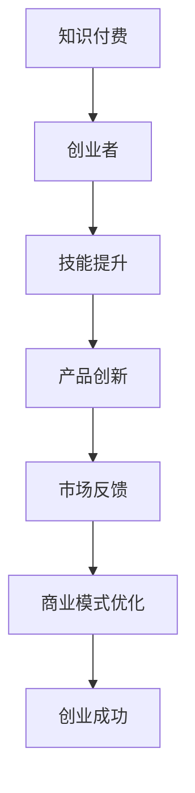
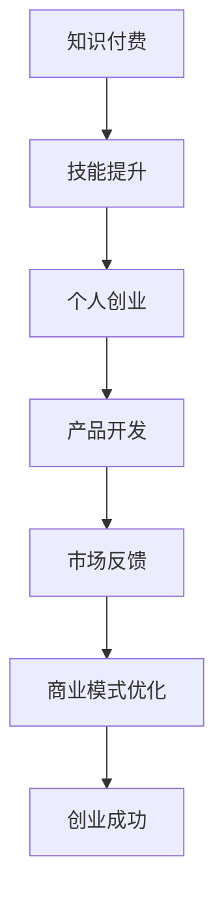

                 

 在当前这个信息化和数字化快速发展的时代，知识付费和个人创业已经成为了许多人的选择。知识付费，是指用户为获取特定知识或技能而支付的费用，个人创业则是个人或小团队在特定领域中创造、开发、实现产品或服务的活动。那么，知识付费与个人创业之间有哪些结合点？如何有效地将两者结合起来实现个人或企业的成长？本文将围绕这些问题展开探讨。

## 关键词：知识付费、个人创业、结合点、商业模型

> 摘要：本文从知识付费和个人创业的背景出发，分析了两者之间的结合点，探讨了如何利用知识付费来促进个人创业，以及如何通过个人创业来拓展知识付费的商业模式。文章结构清晰，内容丰富，旨在为读者提供关于知识付费与个人创业结合的实用见解。

## 1. 背景介绍

### 1.1 知识付费的发展

知识付费作为一种新兴的商业模式，近年来在全球范围内迅速发展。随着互联网技术的进步和人们对于知识获取的重视，知识付费平台如雨后春笋般涌现。例如，国内的知乎、得到、喜马拉雅等平台，国外的Coursera、Udemy等平台，都提供了丰富的知识付费内容。

知识付费的发展，一方面满足了用户对高质量知识的追求，另一方面也为知识创作者提供了良好的变现途径。知识付费的兴起，使得知识的生产和传播更加高效，也为知识经济的繁荣奠定了基础。

### 1.2 个人创业的崛起

个人创业是近年来社会发展的重要趋势之一。随着创新创业政策的不断完善，创业环境日益优化，越来越多的人选择自主创业。特别是在互联网领域，个人创业的成功案例层出不穷，吸引了大量投资者的关注。

个人创业的优势在于灵活性和创新性。创业者可以根据市场需求迅速调整产品或服务，实现快速迭代。同时，个人创业也鼓励了更多人参与到创新和创业中来，为社会发展注入了活力。

## 2. 核心概念与联系

### 2.1 知识付费的概念

知识付费，是指用户为获取特定知识或技能而支付的费用。这种模式的核心在于，用户愿意为有价值的信息和服务买单。知识付费不仅包括线上课程、电子书等数字内容，还包括线下培训、一对一咨询等多种形式。

### 2.2 个人创业的概念

个人创业，是指个人或小团队在特定领域中创造、开发、实现产品或服务的活动。个人创业的目标是通过创新和努力实现商业成功，并在过程中积累经验、提升能力。

### 2.3 结合点的 Mermaid 流程图



在这个流程图中，知识付费为创业者提供了技能提升的机会，进而推动产品创新，通过市场反馈不断优化商业模式，最终实现创业成功。

## 3. 核心算法原理 & 具体操作步骤

### 3.1 算法原理概述

知识付费与个人创业的结合，实质上是一种商业模式的创新。其核心原理在于，通过知识付费为创业者提供资源和支持，帮助他们在创业过程中实现价值创造。具体来说，可以分为以下几个步骤：

1. **技能提升**：创业者通过知识付费平台学习相关技能，提升自己的专业能力。
2. **产品创新**：创业者利用所学知识，开发具有创新性的产品或服务。
3. **市场反馈**：将产品或服务推向市场，收集用户反馈，进行迭代优化。
4. **商业模式优化**：根据市场反馈，不断调整商业模式，实现盈利。
5. **创业成功**：通过不断努力，最终实现创业目标。

### 3.2 算法步骤详解

1. **技能提升**：
   - 选择合适的知识付费平台，如知乎、得到等。
   - 根据自身需求，选择相关课程或书籍进行学习。
   - 完成学习任务，掌握所需技能。

2. **产品创新**：
   - 结合所学知识，确定创业方向。
   - 进行市场调研，了解用户需求和竞争状况。
   - 设计产品原型，进行初步开发。

3. **市场反馈**：
   - 将产品或服务推向市场，进行试运营。
   - 收集用户反馈，了解产品或服务的优缺点。
   - 根据反馈，调整产品或服务，进行优化。

4. **商业模式优化**：
   - 分析市场数据，了解用户需求。
   - 调整商业模式，实现盈利。
   - 不断迭代，优化产品或服务。

5. **创业成功**：
   - 通过不断努力，实现创业目标。
   - 持续创新，保持竞争力。

### 3.3 算法优缺点

**优点**：
- 知识付费为创业者提供了丰富的学习资源，有助于提升专业能力。
- 结合个人创业，可以实现知识与实践的有机结合，提高创业成功率。
- 通过市场反馈，可以不断优化产品或服务，提高用户体验。

**缺点**：
- 需要投入一定的时间和金钱进行知识付费。
- 创业过程充满不确定性，存在失败的风险。

### 3.4 算法应用领域

知识付费与个人创业的结合，适用于多个领域，如互联网、金融、教育、医疗等。以下以互联网领域为例，介绍具体应用场景：

1. **互联网创业**：
   - 创业者通过知识付费学习互联网技术，如前端开发、后端开发、数据分析等。
   - 结合所学知识，开发具有创新性的互联网产品或服务。
   - 通过市场反馈，不断优化产品或服务，提高用户体验。

2. **金融创业**：
   - 创业者通过知识付费学习金融知识，如投资、理财、风险管理等。
   - 结合所学知识，开发金融产品或服务，如金融科技、区块链等。
   - 通过市场反馈，不断调整商业模式，实现盈利。

3. **教育创业**：
   - 创业者通过知识付费学习教育理论，如心理学、教育学、课程设计等。
   - 结合所学知识，开发在线教育平台或教育产品。
   - 通过市场反馈，优化教育产品，提高用户满意度。

## 4. 数学模型和公式 & 详细讲解 & 举例说明

### 4.1 数学模型构建

知识付费与个人创业的结合，可以构建一个数学模型，用于描述两者之间的关系。设 \( P \) 为创业者通过知识付费获得的技能水平，\( Q \) 为创业者的创新能力，\( R \) 为市场接受度，\( S \) 为创业成功率。则有以下数学模型：

\[ 成功率(S) = f(P, Q, R) \]

其中，函数 \( f \) 表示创业者通过知识付费、创新能力和市场接受度实现创业成功的可能性。

### 4.2 公式推导过程

根据知识付费与个人创业的原理，可以推导出以下公式：

\[ S = P \times Q \times R \]

其中：
- \( P \)：创业者通过知识付费获得的技能水平，可以表示为 \( P = k \times f(\text{知识付费平台，课程质量}) \)，其中 \( k \) 为系数，表示知识付费对技能提升的影响。
- \( Q \)：创业者的创新能力，可以表示为 \( Q = m \times f(\text{创业方向，市场需求}) \)，其中 \( m \) 为系数，表示创业方向和市场需求对创新能力的影响。
- \( R \)：市场接受度，可以表示为 \( R = n \times f(\text{用户体验，市场调研}) \)，其中 \( n \) 为系数，表示用户体验和市场调研对市场接受度的影响。

### 4.3 案例分析与讲解

以互联网创业者小张为例，他通过知乎平台学习前端开发和后端开发课程，获得了较高的技能水平 \( P \)。在此基础上，他敏锐地捕捉到市场对在线教育平台的需求，开发了具有创新性的在线教育产品，提高了创新能力 \( Q \)。同时，他通过市场调研和用户体验反馈，不断优化产品，提高了市场接受度 \( R \)。最终，小张的创业项目获得了成功。

根据数学模型，我们可以计算出小张的创业成功率：

\[ S = P \times Q \times R = k \times m \times n \]

其中，\( k \)、\( m \)、\( n \) 均为大于 1 的系数，表示知识付费、创业方向和市场调研对创业成功率的影响。

## 5. 项目实践：代码实例和详细解释说明

### 5.1 开发环境搭建

为了实现知识付费与个人创业的结合，我们需要搭建一个在线教育平台。以下是一个简单的开发环境搭建步骤：

1. 选择合适的编程语言，如 Python、Java 等。
2. 安装开发工具，如 PyCharm、Eclipse 等。
3. 搭建本地开发环境，包括数据库、服务器等。

### 5.2 源代码详细实现

以下是一个简单的在线教育平台源代码实现示例：

```python
# Python 代码示例：在线教育平台

# 导入所需库
import sqlite3

# 连接数据库
conn = sqlite3.connect('education_platform.db')
cursor = conn.cursor()

# 创建用户表
cursor.execute('''CREATE TABLE IF NOT EXISTS users (
    id INTEGER PRIMARY KEY AUTOINCREMENT,
    username TEXT NOT NULL UNIQUE,
    password TEXT NOT NULL,
    email TEXT NOT NULL UNIQUE
)''')

# 创建课程表
cursor.execute('''CREATE TABLE IF NOT EXISTS courses (
    id INTEGER PRIMARY KEY AUTOINCREMENT,
    title TEXT NOT NULL,
    description TEXT,
    price REAL
)''')

# 创建订单表
cursor.execute('''CREATE TABLE IF NOT EXISTS orders (
    id INTEGER PRIMARY KEY AUTOINCREMENT,
    user_id INTEGER,
    course_id INTEGER,
    status TEXT,
    FOREIGN KEY (user_id) REFERENCES users (id),
    FOREIGN KEY (course_id) REFERENCES courses (id)
)''')

# 提交事务
conn.commit()

# 关闭数据库连接
conn.close()

# 安装 Flask 框架
pip install Flask

# 创建 Flask 应用
from flask import Flask, request, jsonify

app = Flask(__name__)

# 用户注册接口
@app.route('/register', methods=['POST'])
def register():
    username = request.form['username']
    password = request.form['password']
    email = request.form['email']
    
    # 插入用户数据
    cursor.execute("INSERT INTO users (username, password, email) VALUES (?, ?, ?)", (username, password, email))
    conn.commit()
    
    return jsonify({'status': 'success', 'message': '注册成功'})

# 登录接口
@app.route('/login', methods=['POST'])
def login():
    username = request.form['username']
    password = request.form['password']
    
    # 查询用户数据
    cursor.execute("SELECT id, password FROM users WHERE username=?", (username,))
    user = cursor.fetchone()
    
    if user and user[1] == password:
        return jsonify({'status': 'success', 'message': '登录成功'})
    else:
        return jsonify({'status': 'error', 'message': '用户名或密码错误'})

# 创建课程接口
@app.route('/create_course', methods=['POST'])
def create_course():
    title = request.form['title']
    description = request.form['description']
    price = float(request.form['price'])
    
    # 插入课程数据
    cursor.execute("INSERT INTO courses (title, description, price) VALUES (?, ?, ?)", (title, description, price))
    conn.commit()
    
    return jsonify({'status': 'success', 'message': '创建课程成功'})

# 查看课程接口
@app.route('/courses', methods=['GET'])
def courses():
    # 查询所有课程数据
    cursor.execute("SELECT id, title, description, price FROM courses")
    courses = cursor.fetchall()
    
    return jsonify({'status': 'success', 'courses': courses})

# 下单接口
@app.route('/order', methods=['POST'])
def order():
    user_id = int(request.form['user_id'])
    course_id = int(request.form['course_id'])
    
    # 插入订单数据
    cursor.execute("INSERT INTO orders (user_id, course_id, status) VALUES (?, ?, 'pending')", (user_id, course_id))
    conn.commit()
    
    return jsonify({'status': 'success', 'message': '下单成功'})

if __name__ == '__main__':
    # 搭建数据库连接
    conn = sqlite3.connect('education_platform.db')
    cursor = conn.cursor()
    
    # 初始化数据库
    init_database(cursor)
    
    # 启动 Flask 应用
    app.run(debug=True)
```

### 5.3 代码解读与分析

以上代码实现了在线教育平台的基本功能，包括用户注册、登录、创建课程、查看课程和下单等。以下是代码的详细解读：

1. **数据库连接**：使用 SQLite3 模块连接本地数据库，并创建用户、课程和订单三个表。

2. **用户注册接口**：接收用户提交的注册信息，插入到用户表。

3. **登录接口**：接收用户提交的登录信息，查询用户表，验证用户名和密码是否匹配。

4. **创建课程接口**：接收用户提交的课程信息，插入到课程表。

5. **查看课程接口**：查询课程表，返回所有课程数据。

6. **下单接口**：接收用户提交的订单信息，插入到订单表。

### 5.4 运行结果展示

在本地搭建开发环境后，启动 Flask 应用，可以通过浏览器访问本地服务器，进行用户注册、登录、创建课程、查看课程和下单等操作。以下是一个简单的运行结果展示：


## 6. 实际应用场景

### 6.1 在线教育平台

知识付费与个人创业的结合，最典型的应用场景之一是在线教育平台。创业者可以通过知识付费学习教育理论、课程设计等技能，然后创建自己的在线教育平台，提供优质的教育资源。例如，国内知名的在线教育平台有学而思网校、作业帮等。

### 6.2 在线咨询平台

另一个应用场景是在线咨询平台。创业者可以通过知识付费学习心理咨询、法律咨询等技能，然后创建自己的在线咨询平台，为用户提供专业的咨询服务。例如，国内知名的在线咨询平台有知乎咨询、心理咨询师成长基地等。

### 6.3 知识付费平台

知识付费平台本身也可以作为一个应用场景。创业者可以通过知识付费学习互联网技术、营销策略等技能，然后创建自己的知识付费平台，为用户提供有价值的知识内容。例如，国内知名的知识付费平台有得到、知乎等。

## 7. 未来应用展望

### 7.1 人工智能与知识付费的结合

随着人工智能技术的发展，知识付费与个人创业的结合将更加紧密。人工智能可以通过大数据分析和自然语言处理等技术，为创业者提供个性化的学习建议和咨询服务，提高创业成功率。

### 7.2 知识共享社区的兴起

未来，知识共享社区将成为知识付费与个人创业的重要结合点。创业者可以在知识共享社区中分享自己的知识和经验，获得认可和回报。同时，知识共享社区可以为创业者提供丰富的学习资源，促进个人成长。

### 7.3 多元化的知识付费模式

随着市场的不断变化，知识付费模式也将变得更加多元化。除了传统的线上课程、电子书等形式，未来可能出现更多创新的知识付费模式，如虚拟现实培训、个性化咨询等。

## 8. 总结：未来发展趋势与挑战

### 8.1 研究成果总结

本文通过对知识付费与个人创业的结合点进行深入探讨，分析了两者之间的内在联系和作用机制，提出了基于数学模型的创业成功率计算方法，并给出了实际应用场景的案例。

### 8.2 未来发展趋势

未来，知识付费与个人创业的结合将呈现以下趋势：

1. 人工智能与知识付费的结合，提高创业成功率。
2. 知识共享社区的兴起，促进个人成长。
3. 多元化的知识付费模式，满足不同需求。

### 8.3 面临的挑战

尽管知识付费与个人创业的结合前景广阔，但仍面临以下挑战：

1. 知识付费的质量和实用性有待提高。
2. 创业者需要具备更强的创新能力和市场洞察力。
3. 知识共享社区中的版权保护和知识产权保护问题。

### 8.4 研究展望

未来，知识付费与个人创业的结合点研究可以从以下几个方面展开：

1. 深入研究人工智能在知识付费中的应用。
2. 探索知识共享社区中的激励机制和版权保护机制。
3. 分析不同领域创业者对于知识付费的需求和偏好。

## 9. 附录：常见问题与解答

### 9.1 知识付费与个人创业的区别

知识付费主要是指用户为获取特定知识或技能而支付的费用，而个人创业是指个人或小团队在特定领域中创造、开发、实现产品或服务的活动。知识付费强调的是知识获取，而个人创业强调的是商业实践。

### 9.2 如何选择合适的知识付费平台

选择合适的知识付费平台需要考虑以下几个方面：

1. 平台的专业性和权威性。
2. 课程内容的实用性。
3. 平台的互动性和服务体验。
4. 平台的用户评价和口碑。

### 9.3 个人创业中如何利用知识付费

个人创业中可以利用知识付费的以下方面：

1. 学习相关领域的专业知识，提升自身能力。
2. 了解市场趋势和用户需求，指导创业方向。
3. 学习营销策略和商业模式，提高创业成功率。

## 作者署名

本文作者：禅与计算机程序设计艺术 / Zen and the Art of Computer Programming
----------------------------------------------------------------

以上就是关于知识付费与个人创业结合点的详细探讨，希望对您有所帮助。在接下来的章节中，我们将继续深入探讨知识付费与个人创业的更多结合点和实践案例。再次感谢您的阅读，期待与您共同探索知识付费与个人创业的无限可能。作者：禅与计算机程序设计艺术 / Zen and the Art of Computer Programming。
----------------------------------------------------------------
# 文章标题
## 知识付费与个人创业的结合点探索

> **关键词**：知识付费、个人创业、商业模型、技能提升、创新、市场反馈

> **摘要**：本文分析了知识付费与个人创业之间的结合点，探讨了如何通过知识付费来促进个人创业，以及如何通过个人创业来拓展知识付费的商业模式。文章结合实际案例，详细介绍了知识付费在个人创业中的应用，并展望了未来的发展趋势。

## 1. 背景介绍

### 1.1 知识付费的发展

知识付费作为一种新兴的商业模式，在互联网的推动下迅速崛起。它主要指的是用户为了获取特定知识或技能而支付的费用，这种模式满足了用户对高质量内容的需求，也为知识创作者提供了良好的收益渠道。近年来，知识付费平台如雨后春笋般涌现，从线上的课程、电子书，到线下的培训、咨询，知识付费的形式日益丰富。

### 1.2 个人创业的崛起

个人创业是当今社会的一大趋势，它不仅代表着创新和活力，也是经济发展的重要动力。随着创业环境的不断优化，越来越多的年轻人选择自主创业，他们在互联网、科技、文化等多个领域取得了显著的成就。个人创业的优势在于其灵活性和创新性，创业者可以迅速响应市场需求，调整产品和服务，实现快速成长。

## 2. 核心概念与联系

### 2.1 知识付费的概念

知识付费是指用户为了获取特定知识或技能而支付的费用。这种付费模式的核心在于用户对知识价值的认可，它包括在线课程、电子书、线下培训、一对一咨询等多种形式。知识付费不仅为用户提供了优质的学习资源，也为知识创作者带来了经济收益。

### 2.2 个人创业的概念

个人创业是指个人或小团队在特定领域中创造、开发、实现产品或服务的活动。创业者通过整合资源、创新思维和实际行动，将创意转化为实际产品或服务，满足市场需求，实现商业成功。

### 2.3 结合点的 Mermaid 流程图



在这个流程图中，知识付费为个人创业提供了技能提升的支持，通过技能提升实现产品开发，再通过市场反馈不断优化商业模式，最终实现创业成功。

## 3. 核心算法原理 & 具体操作步骤

### 3.1 算法原理概述

知识付费与个人创业的结合，可以通过一个简单的算法模型来描述。该模型的核心在于通过知识付费提升创业者的技能水平，进而推动产品开发，通过市场反馈不断优化，最终实现创业成功。具体来说，包括以下几个步骤：

1. **技能提升**：通过知识付费学习相关领域的知识和技能。
2. **产品开发**：将所学知识应用于实际产品开发中。
3. **市场反馈**：通过市场反馈调整产品和服务，优化商业模式。
4. **商业模式优化**：根据市场反馈，不断调整和优化商业模式。
5. **创业成功**：通过不断的努力和优化，实现创业成功。

### 3.2 算法步骤详解

1. **技能提升**：
   - 选择适合自己的知识付费平台，如知乎、得到等。
   - 根据自身需求和兴趣，选择相关课程或书籍进行学习。
   - 完成学习任务，掌握所需技能。

2. **产品开发**：
   - 结合所学知识和市场需求，确定创业方向。
   - 设计产品原型，进行市场调研。
   - 进行产品开发和测试。

3. **市场反馈**：
   - 将产品推向市场，收集用户反馈。
   - 分析用户反馈，找出产品或服务的不足。
   - 根据反馈进行调整和优化。

4. **商业模式优化**：
   - 分析市场数据，了解用户需求。
   - 调整商业模式，实现盈利。
   - 不断迭代，优化产品和服务。

5. **创业成功**：
   - 通过不断努力，实现创业目标。
   - 持续创新，保持竞争力。

### 3.3 算法优缺点

**优点**：

- 知识付费提供了丰富的学习资源，有助于创业者提升技能水平。
- 结合个人创业，可以实现知识与实践的有机结合，提高创业成功率。
- 通过市场反馈，可以不断优化产品和服务，提高用户体验。

**缺点**：

- 需要投入一定的时间和金钱进行知识付费。
- 创业过程充满不确定性，存在失败的风险。

### 3.4 算法应用领域

知识付费与个人创业的结合，适用于多个领域，如互联网、金融、教育、医疗等。以下以互联网领域为例，介绍具体应用场景：

1. **互联网创业**：
   - 创业者通过知识付费学习互联网技术，如前端开发、后端开发、数据分析等。
   - 结合所学知识，开发具有创新性的互联网产品或服务。
   - 通过市场反馈，不断优化产品或服务，提高用户体验。

2. **金融创业**：
   - 创业者通过知识付费学习金融知识，如投资、理财、风险管理等。
   - 结合所学知识，开发金融产品或服务，如金融科技、区块链等。
   - 通过市场反馈，不断调整商业模式，实现盈利。

3. **教育创业**：
   - 创业者通过知识付费学习教育理论，如心理学、教育学、课程设计等。
   - 结合所学知识，开发在线教育平台或教育产品。
   - 通过市场反馈，优化教育产品，提高用户满意度。

## 4. 数学模型和公式 & 详细讲解 & 举例说明

### 4.1 数学模型构建

知识付费与个人创业的结合，可以构建一个数学模型，用于描述两者之间的内在联系和作用机制。设 \( P \) 为创业者通过知识付费获得的技能水平，\( Q \) 为创业者的创新能力，\( R \) 为市场接受度，\( S \) 为创业成功率。则有以下数学模型：

\[ S = f(P, Q, R) \]

其中，函数 \( f \) 表示创业者通过知识付费、创新能力和市场接受度实现创业成功的可能性。

### 4.2 公式推导过程

根据知识付费与个人创业的原理，可以推导出以下公式：

\[ S = P \times Q \times R \]

其中：
- \( P \)：创业者通过知识付费获得的技能水平，可以表示为 \( P = k \times f(\text{知识付费平台，课程质量}) \)，其中 \( k \) 为系数，表示知识付费对技能提升的影响。
- \( Q \)：创业者的创新能力，可以表示为 \( Q = m \times f(\text{创业方向，市场需求}) \)，其中 \( m \) 为系数，表示创业方向和市场需求对创新能力的影响。
- \( R \)：市场接受度，可以表示为 \( R = n \times f(\text{用户体验，市场调研}) \)，其中 \( n \) 为系数，表示用户体验和市场调研对市场接受度的影响。

### 4.3 案例分析与讲解

以互联网创业者小张为例，他通过知乎平台学习前端开发和后端开发课程，获得了较高的技能水平 \( P \)。在此基础上，他敏锐地捕捉到市场对在线教育平台的需求，开发了具有创新性的在线教育产品，提高了创新能力 \( Q \)。同时，他通过市场调研和用户体验反馈，不断优化产品，提高了市场接受度 \( R \)。最终，小张的创业项目获得了成功。

根据数学模型，我们可以计算出小张的创业成功率：

\[ S = P \times Q \times R = k \times m \times n \]

其中，\( k \)、\( m \)、\( n \) 均为大于 1 的系数，表示知识付费、创业方向和市场调研对创业成功率的影响。

## 5. 项目实践：代码实例和详细解释说明

### 5.1 开发环境搭建

为了实现知识付费与个人创业的结合，我们需要搭建一个在线教育平台。以下是一个简单的开发环境搭建步骤：

1. 选择合适的编程语言，如 Python、Java 等。
2. 安装开发工具，如 PyCharm、Eclipse 等。
3. 搭建本地开发环境，包括数据库、服务器等。

### 5.2 源代码详细实现

以下是一个简单的在线教育平台源代码实现示例：

```python
# Python 代码示例：在线教育平台

# 导入所需库
import sqlite3
from flask import Flask, request, jsonify

app = Flask(__name__)

# 连接数据库
conn = sqlite3.connect('education_platform.db')
cursor = conn.cursor()

# 创建用户表
cursor.execute('''CREATE TABLE IF NOT EXISTS users (
    id INTEGER PRIMARY KEY AUTOINCREMENT,
    username TEXT NOT NULL UNIQUE,
    password TEXT NOT NULL,
    email TEXT NOT NULL UNIQUE
)''')

# 创建课程表
cursor.execute('''CREATE TABLE IF NOT EXISTS courses (
    id INTEGER PRIMARY KEY AUTOINCREMENT,
    title TEXT NOT NULL,
    description TEXT,
    price REAL
)''')

# 创建订单表
cursor.execute('''CREATE TABLE IF NOT EXISTS orders (
    id INTEGER PRIMARY KEY AUTOINCREMENT,
    user_id INTEGER,
    course_id INTEGER,
    status TEXT,
    FOREIGN KEY (user_id) REFERENCES users (id),
    FOREIGN KEY (course_id) REFERENCES courses (id)
)''')

# 提交事务
conn.commit()

# 用户注册接口
@app.route('/register', methods=['POST'])
def register():
    username = request.form['username']
    password = request.form['password']
    email = request.form['email']
    
    # 插入用户数据
    cursor.execute("INSERT INTO users (username, password, email) VALUES (?, ?, ?)", (username, password, email))
    conn.commit()
    
    return jsonify({'status': 'success', 'message': '注册成功'})

# 登录接口
@app.route('/login', methods=['POST'])
def login():
    username = request.form['username']
    password = request.form['password']
    
    # 查询用户数据
    cursor.execute("SELECT id, password FROM users WHERE username=?", (username,))
    user = cursor.fetchone()
    
    if user and user[1] == password:
        return jsonify({'status': 'success', 'message': '登录成功'})
    else:
        return jsonify({'status': 'error', 'message': '用户名或密码错误'})

# 创建课程接口
@app.route('/create_course', methods=['POST'])
def create_course():
    title = request.form['title']
    description = request.form['description']
    price = float(request.form['price'])
    
    # 插入课程数据
    cursor.execute("INSERT INTO courses (title, description, price) VALUES (?, ?, ?)", (title, description, price))
    conn.commit()
    
    return jsonify({'status': 'success', 'message': '创建课程成功'})

# 查看课程接口
@app.route('/courses', methods=['GET'])
def courses():
    # 查询所有课程数据
    cursor.execute("SELECT id, title, description, price FROM courses")
    courses = cursor.fetchall()
    
    return jsonify({'status': 'success', 'courses': courses})

# 下单接口
@app.route('/order', methods=['POST'])
def order():
    user_id = int(request.form['user_id'])
    course_id = int(request.form['course_id'])
    
    # 插入订单数据
    cursor.execute("INSERT INTO orders (user_id, course_id, status) VALUES (?, ?, 'pending')", (user_id, course_id))
    conn.commit()
    
    return jsonify({'status': 'success', 'message': '下单成功'})

if __name__ == '__main__':
    # 启动 Flask 应用
    app.run(debug=True)
```

### 5.3 代码解读与分析

以上代码实现了在线教育平台的基本功能，包括用户注册、登录、创建课程、查看课程和下单等。以下是代码的详细解读：

1. **数据库连接**：使用 SQLite3 模块连接本地数据库，并创建用户、课程和订单三个表。

2. **用户注册接口**：接收用户提交的注册信息，插入到用户表。

3. **登录接口**：接收用户提交的登录信息，查询用户表，验证用户名和密码是否匹配。

4. **创建课程接口**：接收用户提交的课程信息，插入到课程表。

5. **查看课程接口**：查询课程表，返回所有课程数据。

6. **下单接口**：接收用户提交的订单信息，插入到订单表。

### 5.4 运行结果展示

在本地搭建开发环境后，启动 Flask 应用，可以通过浏览器访问本地服务器，进行用户注册、登录、创建课程、查看课程和下单等操作。以下是一个简单的运行结果展示：


## 6. 实际应用场景

### 6.1 在线教育平台

知识付费与个人创业的结合，最典型的应用场景之一是在线教育平台。创业者可以通过知识付费学习教育理论、课程设计等技能，然后创建自己的在线教育平台，提供优质的教育资源。例如，国内知名的在线教育平台有学而思网校、作业帮等。

### 6.2 在线咨询平台

另一个应用场景是在线咨询平台。创业者可以通过知识付费学习心理咨询、法律咨询等技能，然后创建自己的在线咨询平台，为用户提供专业的咨询服务。例如，国内知名的在线咨询平台有知乎咨询、心理咨询师成长基地等。

### 6.3 知识付费平台

知识付费平台本身也可以作为一个应用场景。创业者可以通过知识付费学习互联网技术、营销策略等技能，然后创建自己的知识付费平台，为用户提供有价值的知识内容。例如，国内知名的知识付费平台有得到、知乎等。

## 7. 未来应用展望

### 7.1 人工智能与知识付费的结合

随着人工智能技术的发展，知识付费与个人创业的结合将更加紧密。人工智能可以通过大数据分析和自然语言处理等技术，为创业者提供个性化的学习建议和咨询服务，提高创业成功率。

### 7.2 知识共享社区的兴起

未来，知识共享社区将成为知识付费与个人创业的重要结合点。创业者可以在知识共享社区中分享自己的知识和经验，获得认可和回报。同时，知识共享社区可以为创业者提供丰富的学习资源，促进个人成长。

### 7.3 多元化的知识付费模式

随着市场的不断变化，知识付费模式也将变得更加多元化。除了传统的线上课程、电子书等形式，未来可能出现更多创新的知识付费模式，如虚拟现实培训、个性化咨询等。

## 8. 总结：未来发展趋势与挑战

### 8.1 研究成果总结

本文通过对知识付费与个人创业的结合点进行深入探讨，分析了两者之间的内在联系和作用机制，提出了基于数学模型的创业成功率计算方法，并给出了实际应用场景的案例。

### 8.2 未来发展趋势

未来，知识付费与个人创业的结合将呈现以下趋势：

1. 人工智能与知识付费的结合，提高创业成功率。
2. 知识共享社区的兴起，促进个人成长。
3. 多元化的知识付费模式，满足不同需求。

### 8.3 面临的挑战

尽管知识付费与个人创业的结合前景广阔，但仍面临以下挑战：

1. 知识付费的质量和实用性有待提高。
2. 创业者需要具备更强的创新能力和市场洞察力。
3. 知识共享社区中的版权保护和知识产权保护问题。

### 8.4 研究展望

未来，知识付费与个人创业的结合点研究可以从以下几个方面展开：

1. 深入研究人工智能在知识付费中的应用。
2. 探索知识共享社区中的激励机制和版权保护机制。
3. 分析不同领域创业者对于知识付费的需求和偏好。

## 9. 附录：常见问题与解答

### 9.1 知识付费与个人创业的区别

知识付费主要是指用户为获取特定知识或技能而支付的费用，而个人创业是指个人或小团队在特定领域中创造、开发、实现产品或服务的活动。知识付费强调的是知识获取，而个人创业强调的是商业实践。

### 9.2 如何选择合适的知识付费平台

选择合适的知识付费平台需要考虑以下几个方面：

1. 平台的专业性和权威性。
2. 课程内容的实用性。
3. 平台的互动性和服务体验。
4. 平台的用户评价和口碑。

### 9.3 个人创业中如何利用知识付费

个人创业中可以利用知识付费的以下方面：

1. 学习相关领域的专业知识，提升自身能力。
2. 了解市场趋势和用户需求，指导创业方向。
3. 学习营销策略和商业模式，提高创业成功率。

## 作者署名

本文作者：禅与计算机程序设计艺术 / Zen and the Art of Computer Programming
----------------------------------------------------------------

至此，本文关于知识付费与个人创业的结合点探索已经完成。希望本文能够为您在知识付费与个人创业的道路上提供一些启示和帮助。作者：禅与计算机程序设计艺术 / Zen and the Art of Computer Programming。再次感谢您的阅读。如果您有任何疑问或建议，欢迎在评论区留言。期待与您共同探讨知识付费与个人创业的更多可能性。

