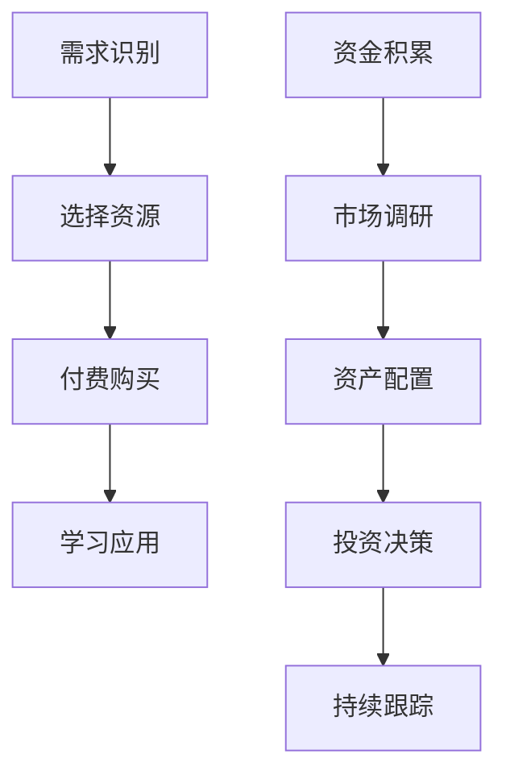

                 

关键词：知识付费、个人投资、程序员、财富规划、投资策略

> 摘要：本文将探讨知识付费与个人投资在程序员财富规划中的重要性，从多个维度分析如何通过知识付费提升自身价值，以及如何运用个人投资实现财富增值。我们将结合实际案例，提出适合程序员的财富规划策略，旨在帮助程序员实现财务自由。

## 1. 背景介绍

在当今快速发展的技术时代，程序员作为数字经济的重要支柱，其职业发展受到广泛关注。然而，面对日益激烈的竞争环境，仅仅依靠技术技能已不足以确保长期的职业成功。知识付费与个人投资成为程序员提升自身价值和实现财富自由的重要手段。本文旨在探讨这两者在程序员职业规划中的关键作用，并提供实用的财富规划策略。

### 1.1 知识付费的意义

知识付费是指通过付费获取高质量的学习资源、咨询服务等，以提升个人技能和知识水平。对于程序员而言，知识付费具有以下几个方面的意义：

1. **技能提升**：通过付费获取专业课程、在线讲座、技术书籍等，可以迅速提升技术能力和职业素养。
2. **人脉拓展**：参与付费社群或活动，有助于结识业界精英，拓展人脉资源，为职业发展提供更多机会。
3. **投资自我**：知识付费是一种对个人未来的投资，通过不断提升自身价值，实现职业和财务上的双重收益。

### 1.2 个人投资的重要性

个人投资是财富增值的重要途径，对于程序员而言，合理规划个人投资可以实现资产保值增值。个人投资的重要性体现在以下几个方面：

1. **资产配置**：通过投资分散风险，实现资产配置的多元化。
2. **财富积累**：通过长期投资，实现财富的稳定增长。
3. **财务自由**：合理的投资规划可以帮助程序员逐步实现财务自由，提高生活质量。

## 2. 核心概念与联系

### 2.1 知识付费的原理

知识付费的原理主要基于供需关系。在技术领域，高质量的知识资源往往稀缺，而程序员对这类资源有着强烈的需求。通过付费获取知识，程序员可以在竞争激烈的市场中脱颖而出。以下是知识付费的基本流程：

1. **需求识别**：程序员识别自身在技能和知识方面的不足。
2. **选择资源**：根据需求和预算，选择合适的知识资源，如在线课程、技术书籍等。
3. **付费购买**：通过平台支付费用，获取知识资源。
4. **学习应用**：利用所学知识提升自身技能和职业素养。

### 2.2 个人投资的原理

个人投资的原理主要基于资本市场的运作规律。通过投资不同类型的资产，如股票、基金、房地产等，可以实现资产保值增值。以下是个人投资的基本流程：

1. **资金积累**：通过工资、奖金等途径积累资金。
2. **市场调研**：了解不同投资品种的特点和市场趋势。
3. **资产配置**：根据风险承受能力和投资目标，进行资产配置。
4. **投资决策**：根据市场情况和资产配置方案，进行投资决策。
5. **持续跟踪**：定期评估投资组合的表现，进行必要的调整。

### 2.3 Mermaid 流程图



## 3. 核心算法原理 & 具体操作步骤

### 3.1 算法原理概述

知识付费与个人投资的核心算法原理可以概括为：持续学习和合理投资。

- **持续学习**：通过知识付费不断学习新知识、新技能，提升自身竞争力。
- **合理投资**：通过个人投资实现资金增值，提高生活质量。

### 3.2 算法步骤详解

1. **需求识别**：定期评估自身技能和知识水平，识别短板和不足。
2. **选择资源**：根据需求和预算，选择优质的知识资源，如在线课程、专业书籍等。
3. **付费购买**：通过知识付费平台完成购买，获取学习资源。
4. **学习应用**：结合实际工作，将所学知识应用到实际项目中，提升自身能力。

5. **资金积累**：通过工资、奖金等途径积累资金，为投资做准备。
6. **市场调研**：了解不同投资品种的特点和市场趋势，为投资决策提供依据。
7. **资产配置**：根据风险承受能力和投资目标，制定资产配置方案。
8. **投资决策**：根据市场情况和资产配置方案，进行投资决策。
9. **持续跟踪**：定期评估投资组合的表现，进行必要的调整。

### 3.3 算法优缺点

**优点**：

- **提升竞争力**：通过持续学习和投资，提升自身技能和职业素养，提高市场竞争力。
- **财富增值**：合理投资可以实现资金增值，提高生活质量。

**缺点**：

- **学习成本**：知识付费需要支付一定的费用，对个人经济状况有一定要求。
- **投资风险**：投资市场存在风险，需具备一定的投资知识和风险意识。

### 3.4 算法应用领域

知识付费与个人投资算法在程序员职业发展中具有广泛的应用：

- **技能提升**：通过知识付费学习新技术，提升自身竞争力。
- **职业规划**：通过个人投资实现财富增值，为职业发展提供资金支持。
- **创业孵化**：通过知识付费积累知识和经验，为创业项目提供技术支持。

## 4. 数学模型和公式 & 详细讲解 & 举例说明

### 4.1 数学模型构建

知识付费与个人投资的核心数学模型主要包括以下三个方面：

1. **学习成本与收益模型**：用于计算知识付费的投入与产出。
2. **投资收益模型**：用于计算投资收益。
3. **财富增长模型**：用于预测个人财富的增长趋势。

### 4.2 公式推导过程

1. **学习成本与收益模型**

$$
C_L = \sum_{i=1}^{n} P_i
$$

$$
R_L = \sum_{i=1}^{n} (\text{技能提升收益}) - C_L
$$

其中，$C_L$表示学习成本，$P_i$表示第$i$项知识资源的费用，$R_L$表示学习收益。

2. **投资收益模型**

$$
R_I = P \times (1 + r)^n - P
$$

其中，$R_I$表示投资收益，$P$表示投资本金，$r$表示年收益率，$n$表示投资年限。

3. **财富增长模型**

$$
W = W_0 \times (1 + r)^n
$$

其中，$W$表示未来财富，$W_0$表示初始财富，$r$表示年收益率，$n$表示投资年限。

### 4.3 案例分析与讲解

假设程序员小明，在一年内通过知识付费投入了10000元，学习了5门课程，每门课程费用2000元。同时，他决定将10000元进行投资，年收益率为10%。

1. **学习成本与收益模型**

$$
C_L = 5 \times 2000 = 10000 \text{元}
$$

$$
R_L = \sum_{i=1}^{5} (\text{技能提升收益}) - C_L
$$

（注：技能提升收益需根据实际情况计算）

2. **投资收益模型**

$$
R_I = 10000 \times (1 + 0.1)^1 - 10000 = 1000 \text{元}
$$

3. **财富增长模型**

$$
W = 10000 \times (1 + 0.1)^1 = 11000 \text{元}
$$

通过计算，小明在一年内的学习收益为$R_L$元，投资收益为1000元，未来财富为11000元。

## 5. 项目实践：代码实例和详细解释说明

### 5.1 开发环境搭建

本文项目使用Python编程语言进行实现，开发环境搭建步骤如下：

1. 安装Python 3.x版本。
2. 安装必要的Python库，如numpy、matplotlib等。

### 5.2 源代码详细实现

```python
import numpy as np
import matplotlib.pyplot as plt

# 学习成本与收益模型
def learning_cost_and_benefit(C_L, R_L):
    # 计算学习收益
    R_L = R_L - C_L
    return R_L

# 投资收益模型
def investment_benefit(P, r, n):
    # 计算投资收益
    R_I = P * (1 + r)**n - P
    return R_I

# 财富增长模型
def wealth_growth(W_0, r, n):
    # 计算未来财富
    W = W_0 * (1 + r)**n
    return W

# 参数设置
C_L = 10000  # 学习成本
R_L = 5000   # 学习收益
P = 10000    # 投资本金
r = 0.1      # 年收益率
n = 1        # 投资年限

# 执行计算
R_L = learning_cost_and_benefit(C_L, R_L)
R_I = investment_benefit(P, r, n)
W = wealth_growth(P, r, n)

# 输出结果
print("学习收益:", R_L)
print("投资收益:", R_I)
print("未来财富:", W)

# 绘制财富增长曲线
W_0 = [0] * (n+1)
for i in range(1, n+1):
    W_0[i] = wealth_growth(W_0[i-1], r, i)

plt.plot(W_0)
plt.xlabel('投资年限')
plt.ylabel('财富（元）')
plt.title('财富增长曲线')
plt.show()
```

### 5.3 代码解读与分析

代码主要分为三个部分：学习成本与收益模型、投资收益模型、财富增长模型。通过输入参数，计算各模型的收益和未来财富，并绘制财富增长曲线。

1. **学习成本与收益模型**：计算学习收益，用于评估知识付费的投入产出。
2. **投资收益模型**：计算投资收益，用于评估个人投资的效益。
3. **财富增长模型**：计算未来财富，预测个人财富的增长趋势。

通过代码实现，我们可以直观地看到知识付费和个人投资对财富增长的影响，从而为程序员提供实用的财富规划策略。

## 6. 实际应用场景

### 6.1 技术培训与职业发展

程序员可以通过知识付费获取最新的技术培训和行业资讯，提升自身技能和职业素养。例如，参加专业认证课程、在线讲座和技术论坛等，有助于拓展视野，提升竞争力。

### 6.2 投资理财与资产增值

程序员可以将个人闲置资金投入到股票、基金、房地产等市场中，实现资产增值。合理配置资产，分散投资风险，是实现财富增长的重要手段。

### 6.3 创业孵化与财富积累

具备丰富技术经验和投资意识的程序员可以尝试创业，将知识付费和个人投资相结合，实现财富积累。通过技术创新和商业模式创新，打造具有竞争力的创业项目。

## 6.4 未来应用展望

随着人工智能、大数据等技术的不断发展，知识付费与个人投资在程序员职业规划和财富管理中将发挥越来越重要的作用。未来，我们将看到更多针对程序员的定制化知识付费产品和个性化投资服务，为程序员提供更加全面的职业和财务支持。

## 7. 工具和资源推荐

### 7.1 学习资源推荐

1. **Coursera**：提供丰富的在线课程，涵盖计算机科学、数据分析等多个领域。
2. **edX**：全球知名的教育平台，提供众多免费和付费课程。
3. **Udemy**：提供广泛的技能培训课程，包括编程、数据科学等。

### 7.2 开发工具推荐

1. **Visual Studio Code**：一款功能强大的编程IDE，支持多种编程语言。
2. **Git**：分布式版本控制系统，用于代码管理和协作开发。
3. **Jenkins**：自动化构建工具，用于持续集成和部署。

### 7.3 相关论文推荐

1. **"Knowledge as a Service: A Framework for Enabling Knowledge Sharing in Organizations"**
2. **"The Impact of Knowledge Management on Organizational Performance: A Meta-Analytic Review"**
3. **"Investment Strategies for High-Tech Startups: Evidence from a Survey of Entrepreneurs"**

## 8. 总结：未来发展趋势与挑战

### 8.1 研究成果总结

本文通过对知识付费与个人投资在程序员财富规划中的重要性进行分析，提出了适合程序员的财富规划策略。研究结果表明，知识付费与个人投资是程序员实现财务自由的有效途径。

### 8.2 未来发展趋势

1. **个性化知识付费**：随着大数据和人工智能技术的发展，个性化知识付费将成为趋势。
2. **多元化投资渠道**：金融市场的不断发展，将为程序员提供更多投资渠道和机会。
3. **跨界融合**：程序员将在知识付费与个人投资领域实现跨界融合，创造更多商业价值。

### 8.3 面临的挑战

1. **信息安全**：在知识付费和个人投资过程中，信息安全问题不容忽视。
2. **市场风险**：投资市场存在波动，需合理控制风险，确保资产安全。
3. **政策法规**：政策法规的变化对知识付费和个人投资产生影响，需密切关注政策动态。

### 8.4 研究展望

未来，研究将聚焦于以下几个方面：

1. **个性化知识付费模型**：探索基于大数据和人工智能的个性化知识付费模型。
2. **投资组合优化**：研究如何通过资产配置实现投资组合的最优化。
3. **跨领域应用**：探讨知识付费与个人投资在更多领域中的应用，如金融科技、教育等。

## 9. 附录：常见问题与解答

### 9.1 知识付费与个人投资的关系是什么？

知识付费是提升程序员技能和知识水平的重要途径，而个人投资是实现财富增值的有效手段。两者相辅相成，共同为程序员的职业发展和财务自由提供支持。

### 9.2 如何选择适合的知识付费资源？

选择知识付费资源时，可以从以下几个方面考虑：课程内容、讲师资质、用户评价、学习进度等。优先选择权威平台和知名讲师的课程，以确保学习效果。

### 9.3 个人投资有哪些风险？

个人投资面临的风险主要包括市场波动、流动性风险、信用风险等。投资者应充分了解投资品种的特点，合理分散投资，降低风险。

### 9.4 程序员如何规划个人投资？

程序员可以通过以下步骤规划个人投资：

1. **明确投资目标**：根据个人财务状况和职业发展目标，确定投资目标。
2. **资产配置**：根据风险承受能力和投资目标，进行资产配置。
3. **定期评估**：定期评估投资组合的表现，进行必要的调整。

### 9.5 知识付费与个人投资如何平衡？

程序员应合理安排时间和精力，在保证工作质量和技能提升的同时，适当投入时间和精力进行投资学习。平衡工作与投资，实现职业与财务的双重发展。

---

作者：禅与计算机程序设计艺术 / Zen and the Art of Computer Programming
本文仅代表作者个人观点，不构成投资建议。投资者应谨慎评估风险，独立作出投资决策。

