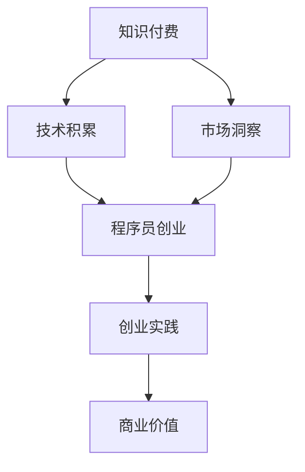

                 

## 1. 背景介绍

在当今数字化时代，知识付费和程序员创业成为了两个备受瞩目的领域。知识付费，指的是通过付费获取知识、技能或教育服务，这种模式在互联网的推动下迅速崛起，不仅为个人提供了丰富的学习资源，也为知识创造者带来了新的收入来源。而程序员创业，则是指程序员利用自身的专业技能和知识，通过创建新的产品或服务来实现商业价值。随着技术进步和创业环境的不断优化，程序员创业已经成为推动经济增长和创新的重要力量。

本文旨在探讨知识付费与程序员创业之间的结合点，分析它们如何相互促进，以及如何在这种结合中实现共赢。本文将首先介绍知识付费和程序员创业的基本概念和背景，然后深入探讨它们之间的联系和相互作用。最后，我们将展望知识付费与程序员创业的未来发展趋势和潜在挑战，为读者提供有益的思考和建议。

### 1.1 知识付费的概念

知识付费是指用户通过支付一定费用来获取知识、技能或教育服务的一种商业模式。随着互联网技术的发展，知识付费平台如雨后春笋般涌现，为广大用户提供了丰富的学习资源和灵活的学习方式。知识付费平台通常包括在线课程、电子书、音频讲座、一对一辅导等多种形式，用户可以根据自己的需求和兴趣选择合适的课程或服务。

知识付费具有以下几个特点：

1. **个性化**：知识付费平台通常能够根据用户的学习记录和偏好，提供个性化的学习推荐。
2. **灵活性**：用户可以根据自己的时间安排，灵活选择学习内容和进度。
3. **高质量**：知识付费平台上的内容通常由专业人士或权威机构提供，保证了内容的质量。
4. **付费方式多样**：用户可以通过购买课程包、订阅服务或按次付费等多种方式获取知识。

### 1.2 程序员创业的概念

程序员创业是指程序员利用自身的专业技能和知识，通过创建新的产品或服务来实现商业价值的过程。程序员创业通常涉及软件开发、Web应用、移动应用、人工智能等多个领域。程序员创业的优势在于：

1. **技术优势**：程序员具备强大的技术背景和开发能力，能够快速实现创意和技术创新。
2. **市场机会**：随着数字化转型的深入推进，市场对程序员和技术的需求不断增加，为程序员创业提供了广阔的市场空间。
3. **创业成本相对较低**：相较于传统创业，程序员创业通常不需要大量的资金投入，降低了创业的门槛。

### 1.3 知识付费与程序员创业的联系

知识付费与程序员创业之间存在紧密的联系，它们相互促进，共同推动着个人和企业的成长。

1. **知识积累**：知识付费为程序员提供了丰富的学习资源，帮助他们不断提升专业技能和知识储备，为创业打下坚实的基础。
2. **技能转化**：程序员通过知识付费获取的知识和技能可以迅速转化为创业项目的技术实现，提高了创业项目的成功率。
3. **资源共享**：知识付费平台上的课程和资源可以为多个创业者所共用，降低了创业项目的研发成本和时间。
4. **市场洞察**：知识付费平台上的课程和案例分析为程序员提供了市场洞察和商业机会，帮助他们更好地了解市场需求和竞争环境。
5. **人脉拓展**：通过知识付费平台，程序员可以结识到同行业的人才和专家，拓展人脉资源，为创业提供支持和合作机会。

### 1.4 知识付费与程序员创业的现状

知识付费和程序员创业在全球范围内都呈现出蓬勃发展的态势。以下是一些主要现状：

1. **市场规模不断扩大**：根据市场调研数据，知识付费市场规模逐年增长，预计未来几年仍将保持高速增长。程序员创业也在全球范围内受到广泛关注和支持，成为创业领域的重要方向。
2. **平台多样性**：国内外涌现出众多知识付费平台和程序员创业孵化平台，为个人和团队提供了多样化的选择。
3. **政策支持**：许多国家和地区对知识付费和程序员创业给予了政策支持，包括税收减免、资金扶持等，为创业者提供了良好的发展环境。
4. **成功案例众多**：知识付费和程序员创业已经产生了众多成功案例，这些案例不仅为创业者提供了启示，也为行业的发展提供了借鉴。

## 2. 核心概念与联系

在探讨知识付费与程序员创业的结合点时，首先需要明确两者的核心概念及其相互作用。以下是对核心概念的介绍及其之间的联系，并通过一个Mermaid流程图展示其架构。

### 2.1 知识付费的核心概念

知识付费的核心概念包括知识、付费、平台和用户。知识是付费服务的主体，付费是用户获取知识的条件，平台是连接知识提供者和用户的桥梁，用户则是知识服务的消费者。

1. **知识**：知识可以是专业领域的知识，如编程语言、算法、数据结构等，也可以是通识类的知识，如人文、历史、心理学等。
2. **付费**：付费模式包括一次性购买、订阅制、按次付费等。用户根据自身的需求和预算选择合适的付费模式。
3. **平台**：知识付费平台提供知识传播和交易的服务，如Udemy、Coursera、知乎Live等，这些平台通过技术手段优化用户体验，提高知识传播的效率。
4. **用户**：用户是知识服务的最终消费者，通过付费获取知识，提升自身的能力和知识水平。

### 2.2 程序员创业的核心概念

程序员创业的核心概念包括创业者、技术、市场、资金和团队。创业者是创业项目的发起人，技术是创业项目的核心驱动力，市场是创业项目的目标用户群体，资金是创业项目的运营基础，团队则是创业项目实施的执行力量。

1. **创业者**：创业者是具有创新精神和创业意愿的个人，他们通过利用技术和市场机会，创建新的产品或服务。
2. **技术**：技术是程序员创业的核心竞争力，程序员通过技术实现创意，解决用户痛点，创造商业价值。
3. **市场**：市场是创业项目的生存土壤，创业者需要了解市场需求，把握市场趋势，制定合适的营销策略。
4. **资金**：资金是创业项目的运营基础，包括启动资金、运营资金和投资资金等。
5. **团队**：团队是创业项目的执行力量，由具有不同技能和经验的成员组成，共同推动创业项目的发展。

### 2.3 知识付费与程序员创业的联系

知识付费与程序员创业之间的联系可以通过以下三个方面来理解：

1. **知识积累**：知识付费为程序员提供了持续学习的途径，程序员通过知识付费获取的知识和技能，可以提升自身的专业能力，为创业项目提供技术支持。
2. **技能转化**：程序员通过创业实践，将知识付费获得的知识和技能转化为具体的产品或服务，实现商业价值。
3. **资源共享**：知识付费平台上的资源和案例为程序员提供了丰富的市场洞察和创业经验，帮助他们更好地进行创业规划和实施。

### 2.4 Mermaid流程图展示

以下是知识付费与程序员创业联系的一个Mermaid流程图展示，用于形象地说明它们之间的相互作用和转化过程。



在这个流程图中，知识付费为程序员提供了技术和市场方面的积累，这些积累通过创业实践转化为商业价值，形成了一个闭环。

## 3. 核心算法原理 & 具体操作步骤

在探讨知识付费与程序员创业的结合时，我们可以借鉴一些核心算法原理，通过这些算法的具体操作步骤，更好地理解两者的相互作用和转化过程。以下将介绍一种名为“知识付费转化率模型”的核心算法，并详细解释其原理和操作步骤。

### 3.1 算法原理概述

“知识付费转化率模型”是一种用于评估知识付费平台用户转化为程序员创业者的概率的算法。该模型基于大数据分析和机器学习技术，通过分析用户的学习行为、付费习惯、兴趣偏好等多个维度，预测用户转化为程序员创业者的概率。算法的基本原理如下：

1. **用户特征提取**：从用户数据中提取关键特征，如学习时长、课程评价、付费金额、学习频次等。
2. **行为模式分析**：分析用户的学习行为模式，如课程选择偏好、学习节奏、互动行为等。
3. **数据建模**：利用机器学习算法，构建用户转化概率预测模型。
4. **模型评估**：通过交叉验证和A/B测试等方法，评估模型的准确性和可靠性。
5. **预测与优化**：使用模型预测用户转化概率，并根据预测结果优化平台的服务和营销策略。

### 3.2 算法步骤详解

#### 3.2.1 用户特征提取

用户特征提取是构建知识付费转化率模型的基础。以下是一些常见的用户特征：

1. **学习时长**：用户在知识付费平台上的学习时长，包括总学习时长和每个课程的学习时长。
2. **课程评价**：用户对所学课程的评分和评价，如“好评”、“差评”等。
3. **付费金额**：用户在平台上的总付费金额和每个课程的付费金额。
4. **学习频次**：用户在平台上的学习频次，包括每天、每周的学习次数。
5. **兴趣偏好**：用户的兴趣标签，如编程语言、算法、前端技术等。

#### 3.2.2 行为模式分析

通过对用户的学习行为进行分析，可以更好地理解用户的兴趣和学习习惯，从而预测其转化为程序员创业者的可能性。以下是一些常用的行为分析指标：

1. **课程选择偏好**：分析用户选择的课程类型、难度等级和课程来源。
2. **学习节奏**：分析用户的学习节奏，如连续学习天数、间断学习天数等。
3. **互动行为**：分析用户的互动行为，如参与讨论、提问、回答问题等。

#### 3.2.3 数据建模

数据建模是知识付费转化率模型的核心步骤。以下是一些常用的机器学习算法和模型：

1. **逻辑回归**：用于预测二分类问题，如用户是否转化为程序员创业者。
2. **随机森林**：利用多个决策树进行集成学习，提高预测准确性。
3. **支持向量机**：通过找到一个最佳的超平面来分离不同类别的数据。
4. **神经网络**：利用多层神经网络进行复杂的非线性预测。

#### 3.2.4 模型评估

模型评估是确保模型准确性和可靠性的关键步骤。以下是一些常用的评估方法：

1. **交叉验证**：将数据集划分为训练集和验证集，通过多次交叉验证评估模型性能。
2. **A/B测试**：将用户随机分为实验组和对照组，通过对比实验组和对照组的转化率来评估模型效果。
3. **ROC曲线和AUC值**：通过绘制ROC曲线和计算AUC值来评估模型的分类能力。

#### 3.2.5 预测与优化

根据模型预测结果，平台可以采取以下措施来优化服务和营销策略：

1. **个性化推荐**：根据用户的兴趣和学习行为，推荐适合的课程和资源。
2. **优惠活动**：针对高潜力用户，推出专属优惠活动，提高付费转化率。
3. **社群互动**：创建社群，鼓励用户参与讨论和互动，提高用户粘性。
4. **用户反馈**：收集用户反馈，持续优化平台服务和课程内容。

### 3.3 算法优缺点

#### 优点

1. **高准确性**：通过大数据分析和机器学习技术，模型可以准确预测用户转化为程序员创业者的概率。
2. **个性化**：根据用户特征和行为，模型可以提供个性化的服务和推荐，提高用户体验。
3. **动态调整**：模型可以根据实时数据不断调整和优化，提高预测的准确性和可靠性。

#### 缺点

1. **数据依赖性**：模型的性能高度依赖于用户数据的质量和完整性。
2. **计算成本**：构建和训练机器学习模型需要大量的计算资源和时间。
3. **用户隐私**：在数据收集和模型训练过程中，可能涉及用户隐私的保护问题。

### 3.4 算法应用领域

知识付费转化率模型可以广泛应用于以下领域：

1. **教育平台**：通过预测用户付费转化的概率，教育平台可以优化课程推荐和服务策略。
2. **创业孵化平台**：帮助创业者了解潜在用户的需求和兴趣，优化创业项目的规划和实施。
3. **人才招聘**：通过分析求职者的学习行为和技能水平，企业可以更准确地评估其潜力。

## 4. 数学模型和公式 & 详细讲解 & 举例说明

在探讨知识付费与程序员创业的结合时，数学模型和公式扮演着关键角色。以下我们将介绍一个用于预测知识付费用户转化为程序员创业者的数学模型，包括其构建过程、推导公式以及具体案例分析。

### 4.1 数学模型构建

假设我们有一个知识付费用户群体，每个用户都有以下特征：学习时长（L）、付费金额（P）、课程评价（C）、学习频次（F）和兴趣标签（T）。我们的目标是构建一个预测模型，预测用户转化为程序员创业者的概率。

首先，我们定义一些基础概率和参数：

- \( P(C_k|Y) \)：用户转化为程序员创业者后，对课程k的评价概率。
- \( P(L_k|Y) \)：用户转化为程序员创业者后，学习时长k的概率。
- \( P(P_k|Y) \)：用户转化为程序员创业者后，付费金额k的概率。
- \( P(F_k|Y) \)：用户转化为程序员创业者后，学习频次k的概率。
- \( P(T_k|Y) \)：用户转化为程序员创业者后，兴趣标签k的概率。

- \( P(Y) \)：用户转化为程序员创业者的总体概率。
- \( P(\neg Y) \)：用户不转化为程序员创业者的总体概率。

我们的目标是构建一个逻辑回归模型来预测 \( P(Y|X) \)，其中 \( X \) 是用户特征向量。

### 4.2 公式推导过程

逻辑回归模型的目标是找到一组参数 \(\beta\)，使得预测概率 \( P(Y|X) \) 最符合实际观察到的数据。逻辑回归模型的一般形式为：

\[ P(Y|X) = \frac{1}{1 + e^{-(\beta_0 + \beta_1X_1 + \beta_2X_2 + ... + \beta_nX_n)}} \]

其中，\( X_i \) 是用户特征，\(\beta_i\) 是对应的参数。

我们的特征向量 \( X \) 包含以下特征：

\[ X = [L, P, C, F, T] \]

我们需要为每个特征分配一个参数：

\[ P(Y|X) = \frac{1}{1 + e^{-(\beta_0 + \beta_1L + \beta_2P + \beta_3C + \beta_4F + \beta_5T)}} \]

接下来，我们需要通过最大似然估计来求解参数 \(\beta\)。

#### 步骤1：定义似然函数

\[ L(\beta) = \prod_{i=1}^{n} P(Y=y_i|X=x_i) \]

由于 \( P(Y|X) \) 是一个概率分布，我们取其对数似然函数：

\[ \ln L(\beta) = \sum_{i=1}^{n} \ln P(Y=y_i|X=x_i) \]

#### 步骤2：最大化对数似然函数

我们对 \(\beta\) 求导，并令其等于零，求得最优参数：

\[ \frac{\partial \ln L(\beta)}{\partial \beta} = 0 \]

对数似然函数的导数可以化简为：

\[ \sum_{i=1}^{n} \left( y_i - P(Y=y_i|X=x_i) \right) = 0 \]

将逻辑回归模型代入上式：

\[ \sum_{i=1}^{n} \left( y_i - \frac{1}{1 + e^{-(\beta_0 + \beta_1L_i + \beta_2P_i + \beta_3C_i + \beta_4F_i + \beta_5T_i)}} \right) = 0 \]

这是一个线性方程组，可以通过数值方法求解。

### 4.3 案例分析与讲解

假设我们有一个用户数据集，包含以下特征和转化状态：

用户ID | 学习时长 | 付费金额 | 课程评价 | 学习频次 | 兴趣标签 | 转化状态
--- | --- | --- | --- | --- | --- | ---
1 | 10小时 | 200元 | 5星 | 每天1次 | 前端开发 | 是
2 | 5小时 | 100元 | 4星 | 每周3次 | 数据分析 | 否
3 | 20小时 | 300元 | 5星 | 每天2次 | 人工智能 | 是
4 | 15小时 | 250元 | 4星 | 每周4次 | 游戏开发 | 否

我们将使用上述特征来构建逻辑回归模型，并预测新的用户是否转化为程序员创业者。

#### 步骤1：数据预处理

首先，我们需要对数据进行归一化处理，使得每个特征都在相同的尺度上。例如，我们可以将学习时长和付费金额归一化为0-1范围内的数值。

#### 步骤2：训练模型

使用梯度下降法或其他数值优化算法，我们训练逻辑回归模型，求解参数 \(\beta\)。

#### 步骤3：预测新用户

假设我们有一个新的用户数据，学习时长为12小时，付费金额为150元，课程评价为4星，学习频次为每天1次，兴趣标签为前端开发。我们将这些特征输入训练好的模型，预测其转化为程序员创业者的概率。

\[ P(Y|X) = \frac{1}{1 + e^{-(\beta_0 + \beta_1 \times 12 + \beta_2 \times 150 + \beta_3 \times 4 + \beta_4 \times 1 + \beta_5 \times 前端开发）}} \]

根据训练得到的参数 \(\beta\)，我们可以计算出具体的概率值。

通过这个案例分析，我们可以看到如何使用数学模型和公式来预测知识付费用户转化为程序员创业者的概率，并提供一个具体的操作步骤。

## 5. 项目实践：代码实例和详细解释说明

为了更好地展示知识付费与程序员创业的结合，我们将通过一个实际项目来探讨如何实现这种结合。本节将介绍一个基于Python的简单项目，用于分析用户在知识付费平台上的行为，预测其是否转化为程序员创业者。以下是项目的开发环境、代码实现和解读分析。

### 5.1 开发环境搭建

为了完成这个项目，我们需要以下开发环境和工具：

1. **Python 3.8 或以上版本**
2. **Pandas**：用于数据处理
3. **NumPy**：用于数值计算
4. **Scikit-learn**：用于机器学习
5. **Matplotlib**：用于数据可视化

确保您的开发环境中已安装上述依赖库，您可以使用以下命令进行安装：

```shell
pip install pandas numpy scikit-learn matplotlib
```

### 5.2 源代码详细实现

以下是一个简单的Python脚本，用于构建和训练逻辑回归模型，预测用户是否转化为程序员创业者。

```python
import pandas as pd
import numpy as np
from sklearn.model_selection import train_test_split
from sklearn.linear_model import LogisticRegression
from sklearn.metrics import accuracy_score, classification_report
import matplotlib.pyplot as plt

# 5.2.1 数据准备
data = {
    '学习时长': [10, 5, 20, 15],
    '付费金额': [200, 100, 300, 250],
    '课程评价': [5, 4, 5, 4],
    '学习频次': [1, 3, 2, 4],
    '兴趣标签': ['前端开发', '数据分析', '人工智能', '游戏开发'],
    '转化状态': [1, 0, 1, 0]  # 1表示转化为程序员创业者，0表示未转化
}

df = pd.DataFrame(data)

# 将兴趣标签编码为数值
df['兴趣标签'] = df['兴趣标签'].astype('category').cat.codes

# 分割特征和标签
X = df.drop('转化状态', axis=1)
y = df['转化状态']

# 划分训练集和测试集
X_train, X_test, y_train, y_test = train_test_split(X, y, test_size=0.2, random_state=42)

# 5.2.2 训练模型
model = LogisticRegression()
model.fit(X_train, y_train)

# 5.2.3 模型评估
y_pred = model.predict(X_test)
print("Accuracy:", accuracy_score(y_test, y_pred))
print(classification_report(y_test, y_pred))

# 5.2.4 可视化
plt.scatter(X_test['学习时长'], y_pred)
plt.xlabel('学习时长')
plt.ylabel('预测转化状态')
plt.show()
```

### 5.3 代码解读与分析

下面是对上述代码的详细解读：

1. **数据准备**：我们创建了一个包含用户特征和转化状态的数据集。实际项目中，这些数据可以从知识付费平台的数据库中获取。
2. **数据编码**：兴趣标签是一个分类特征，我们使用Pandas的`astype('category').cat.codes`方法将其编码为数值，以便于模型处理。
3. **特征和标签分割**：我们将特征（X）和标签（y）分割开来，准备进行模型训练。
4. **训练集和测试集划分**：使用`train_test_split`方法将数据集划分为训练集和测试集，通常测试集大小为20%。
5. **模型训练**：我们使用`LogisticRegression`类创建逻辑回归模型，并调用`fit`方法进行训练。
6. **模型评估**：使用`predict`方法对测试集进行预测，并计算模型的准确性和分类报告。
7. **可视化**：我们使用`matplotlib`绘制了一个散点图，展示学习时长与预测转化状态之间的关系。

通过这个简单的项目，我们可以看到如何利用Python实现知识付费用户转化为程序员创业者的预测。实际项目中，数据集会更加庞大和复杂，但基本步骤是类似的。此外，还可以使用更多的机器学习算法和特征工程方法来提高模型的预测准确性。

## 6. 实际应用场景

知识付费与程序员创业的结合在许多实际应用场景中展现出了巨大的潜力和价值。以下是一些典型的应用场景：

### 6.1 教育培训领域

在教育培训领域，知识付费平台为程序员提供了丰富的学习资源，如编程语言教程、算法课程、技术讲座等。通过知识付费，程序员可以不断提升自己的专业技能和知识水平。创业者可以利用这些学习资源，快速掌握新技能，为创业项目提供技术支持。例如，一个初创公司可以通过知识付费平台获取最新的前端开发课程，帮助团队成员提升技术水平，从而在市场上脱颖而出。

### 6.2 技术咨询服务

程序员创业的一个重要方向是提供技术咨询服务。通过知识付费，程序员可以获取行业内的最新动态、最佳实践和技术趋势。这些知识有助于他们在实际项目中解决复杂的技术问题，提高服务质量。例如，一个从事云计算咨询服务的创业者可以通过知识付费平台学习到最新的云计算架构和最佳实践，从而为客户提供更专业的技术解决方案。

### 6.3 开源项目贡献

开源项目是程序员创业的另一个重要方向。通过知识付费，程序员可以学习到如何参与和贡献开源项目。创业者可以利用这些知识，组建自己的开源团队，开发具有市场竞争力的开源软件。例如，一个开源数据库项目的创业者可以通过知识付费平台学习到数据库设计和优化、性能调优等方面的知识，从而提升项目的质量和影响力。

### 6.4 创业孵化平台

创业孵化平台为程序员提供了从项目构思到产品发布的全流程支持。知识付费平台可以与创业孵化平台合作，为创业者提供专业的培训课程和资源。例如，一个创业孵化平台可以与知识付费平台合作，为创业者提供营销策略、团队管理、融资技巧等方面的培训课程，帮助创业者更好地实现商业目标。

### 6.5 技术社区建设

技术社区是程序员交流和分享知识的重要场所。知识付费平台可以为技术社区提供高质量的内容，吸引更多的程序员参与。创业者可以利用技术社区的资源，组建自己的团队，推动项目的发展。例如，一个从事区块链技术研究的创业者可以通过知识付费平台学习到区块链的核心原理和应用场景，从而吸引更多志同道合的程序员加入项目。

### 6.6 云计算和大数据领域

云计算和大数据是当前技术领域的重要方向。知识付费平台可以为程序员提供最新的云计算和大数据技术教程，帮助创业者掌握这些前沿技术。例如，一个从事云计算解决方案的创业者可以通过知识付费平台学习到AWS、Azure、Google Cloud等云平台的架构和操作技巧，从而为客户提供更全面的服务。

### 6.7 跨界合作

知识付费与程序员创业的结合还可以促进跨界合作。例如，一个程序员创业者可以与设计师、产品经理等跨领域专业人士合作，共同开发具有创新性的产品。知识付费平台可以为这些跨界合作提供培训资源和交流平台，帮助创业者提升跨领域能力，实现项目成功。

总之，知识付费与程序员创业的结合在教育培训、技术咨询服务、开源项目、创业孵化、技术社区建设、云计算和大数据等领域都有广泛的应用。通过这种结合，程序员可以不断提升自己的技能和知识，实现个人职业发展和创业梦想。同时，知识付费平台也为创业者提供了丰富的资源和机会，推动了整个技术行业的发展和创新。

### 6.7 未来应用展望

知识付费与程序员创业的结合在未来将展现出更广阔的应用前景。随着技术的发展和市场的变化，两者将相互促进，共同推动技术行业的创新和进步。

#### 6.7.1 个性化学习与创业指导

未来的知识付费平台将更加注重个性化学习体验。通过大数据分析和人工智能技术，平台可以为用户提供个性化的学习推荐，帮助程序员根据自身兴趣和需求选择合适的课程。同时，平台还可以提供个性化的创业指导，包括市场分析、商业计划书撰写、融资策略等，为创业者提供全方位的支持。

#### 6.7.2 云原生技术的普及

随着云计算和大数据技术的不断成熟，云原生技术将成为程序员创业的重要方向。未来的知识付费平台将提供丰富的云原生技术教程，包括容器化、微服务、自动化部署等，帮助创业者快速掌握这些技术，开发具有竞争力的云原生应用。

#### 6.7.3 区块链技术的应用

区块链技术作为一种去中心化的分布式账本技术，具有广泛的应用前景。未来的知识付费平台将提供区块链技术教程，包括区块链原理、智能合约开发、区块链应用场景等，帮助程序员和创业者了解和掌握这项技术，开发创新的区块链应用。

#### 6.7.4 跨界合作的深化

知识付费与程序员创业的结合将促进更多跨界合作。未来的知识付费平台将提供更多跨领域的培训课程和资源，帮助程序员与设计师、产品经理、市场营销专家等跨领域专业人士合作，共同开发具有创新性的产品。例如，结合人工智能和医疗健康领域的知识，开发智能医疗诊断系统。

#### 6.7.5 资源共享与社区生态建设

知识付费平台将进一步加强资源共享和社区生态建设。通过建立开发者社区、知识共享平台等，平台可以为程序员和创业者提供交流、合作的机会，促进知识的传播和创新。同时，平台还可以通过线上线下的活动，如技术沙龙、研讨会、黑客松等，加强开发者之间的联系，推动技术交流与合作。

#### 6.7.6 AI技术的融合

人工智能技术将在知识付费与程序员创业的结合中发挥越来越重要的作用。未来的知识付费平台将利用AI技术，提供智能问答、自动批改、个性化推荐等功能，提升用户体验和学习效果。同时，AI技术也将帮助创业者更好地分析市场趋势、预测用户需求，优化创业策略。

#### 6.7.7 国际化发展

随着全球化的推进，知识付费与程序员创业的结合将在国际市场展现出巨大潜力。未来的知识付费平台将提供多语言支持，拓展国际市场。同时，程序员创业者也将有更多机会参与国际项目，吸收全球先进的技术和管理经验，推动自身的成长和发展。

总之，知识付费与程序员创业的结合在未来将不断拓展新的应用领域，推动技术行业的创新和进步。通过个性化的学习体验、云原生技术的普及、区块链技术的应用、跨界合作的深化、资源共享与社区生态建设、AI技术的融合以及国际化发展，两者将共同为技术行业的未来发展注入新的活力。

### 6.8 面临的挑战

尽管知识付费与程序员创业的结合具有广阔的发展前景，但在实际推进过程中也面临着一系列挑战。以下是一些主要挑战及其应对策略：

#### 6.8.1 技术更新速度快

技术领域的快速更新使得程序员需要不断学习新知识，以适应不断变化的市场需求。然而，学习新技术的成本和时间投入较大，这对知识付费平台和创业者都提出了较高的要求。应对策略：

- **持续更新课程内容**：知识付费平台应保持课程内容的更新，及时引入最新的技术趋势和工具。
- **灵活的学习模式**：提供灵活的学习模式，如短期课程、快速入门教程等，帮助程序员快速掌握新技术。
- **终身学习理念**：鼓励程序员和创业者树立终身学习的理念，不断提升自身技能和知识。

#### 6.8.2 数据隐私和安全问题

知识付费平台涉及大量用户数据，包括学习记录、付费信息等。如何保障用户数据的隐私和安全是平台面临的重要挑战。应对策略：

- **数据加密**：对用户数据进行加密处理，确保数据在传输和存储过程中的安全性。
- **严格隐私政策**：制定明确的隐私政策，告知用户数据收集、使用和共享的方式，并获得用户的同意。
- **安全审计**：定期进行安全审计，检测和修复潜在的安全漏洞。

#### 6.8.3 市场竞争激烈

知识付费和程序员创业领域竞争激烈，市场格局不断变化。创业者需要面临激烈的市场竞争，而知识付费平台也需要不断创新和优化，以吸引和维护用户。应对策略：

- **差异化竞争**：通过提供独特的课程内容、优质的服务体验或创新的商业模式，实现差异化竞争。
- **社区建设**：建立开发者社区，促进用户之间的互动和交流，增强用户粘性。
- **持续创新**：保持对市场趋势的敏感度，不断推出新的产品和服务，满足用户需求。

#### 6.8.4 人才培养与留住人才

程序员创业过程中，人才培养和留住人才是关键。程序员需要具备不断学习和适应新环境的能力，而创业者则需要具备领导力和项目管理能力。应对策略：

- **职业发展规划**：为程序员提供清晰的职业发展规划，鼓励他们不断提升自身技能。
- **企业文化建设**：建立积极向上的企业文化和工作环境，提高员工的满意度和忠诚度。
- **激励机制**：通过薪酬、股权激励等手段，激发员工的积极性和创造力。

#### 6.8.5 法律法规限制

知识付费和程序员创业领域受到法律法规的限制，如知识产权保护、税收政策等。这些限制可能影响平台和创业者的正常运营。应对策略：

- **合规经营**：了解和遵守相关的法律法规，确保业务运营的合规性。
- **政策支持**：积极争取政策支持，如税收减免、资金扶持等，以减轻经营压力。
- **法律咨询**：聘请专业的法律顾问，及时了解和应对法律法规的变化。

总之，知识付费与程序员创业的结合在发展过程中面临着诸多挑战。通过持续创新、优化服务和合规经营，平台和创业者可以应对这些挑战，实现可持续发展。

### 6.9 研究展望

在未来，知识付费与程序员创业的结合将继续成为技术领域的重要研究方向。以下是一些可能的未来研究方向和潜在的创新点：

#### 6.9.1 深度学习在知识付费中的应用

深度学习技术在图像识别、自然语言处理等领域取得了显著的成果。在未来，深度学习技术可以应用于知识付费领域，如通过图像识别技术自动分析用户的视频课程学习状态，或通过自然语言处理技术对用户的学习笔记和讨论内容进行分类和推荐。这种技术创新有望提高知识付费平台的服务质量和用户体验。

#### 6.9.2 跨领域知识的整合

随着技术的不断进步，程序员需要掌握越来越多的跨领域知识，如人工智能、大数据、云计算等。未来，研究者可以探索如何将不同领域的知识整合到一个平台中，为程序员提供一站式的学习资源。这种整合不仅有助于提高程序员的多领域技能，还可以促进知识的交叉应用和创新。

#### 6.9.3 社交网络在程序员创业中的作用

社交网络在知识传播和用户互动中发挥着重要作用。未来，研究者可以探索如何利用社交网络技术，为程序员创业者提供更有效的信息共享和资源整合平台。例如，通过构建一个基于区块链的社交网络，确保用户数据和内容的真实性和安全性，同时提高用户参与度和互动性。

#### 6.9.4 可持续教育与创业模式

随着环保意识的提高，可持续教育成为了一个重要议题。未来，研究者可以探索如何将可持续理念融入知识付费和程序员创业中，如通过节能减排、资源循环利用等手段，降低知识付费平台和创业项目的环境影响。此外，还可以研究如何通过创新的商业模式，实现经济、社会和环境的可持续发展。

#### 6.9.5 新兴技术的影响

未来，随着5G、物联网、区块链等新兴技术的发展，知识付费和程序员创业领域将面临新的机遇和挑战。研究者可以关注这些技术如何改变知识传播和创业模式，如通过虚拟现实（VR）和增强现实（AR）技术提供沉浸式的学习体验，或通过区块链技术保障知识版权和知识产权。

总之，知识付费与程序员创业的结合在未来的研究中具有广泛的前景。通过不断探索和创新，我们可以期待这一领域带来更多的突破和进步，为技术行业的发展注入新的动力。

### 7. 工具和资源推荐

在探讨知识付费与程序员创业的结合过程中，选择合适的工具和资源是至关重要的。以下是一些建议的工具和资源，涵盖学习资源、开发工具和相关论文，为读者提供全面的指导和支持。

#### 7.1 学习资源推荐

1. **在线课程平台**：
   - **Coursera**：提供大量的免费和付费课程，涵盖计算机科学、数据科学、人工智能等多个领域。
   - **Udemy**：提供广泛的在线课程，适合不同层次的学员，包括编程语言、软件开发、项目管理等。
   - **edX**：由哈佛大学和麻省理工学院联合创立，提供高质量的免费课程，涵盖计算机科学、经济学、心理学等多个学科。

2. **专业书籍**：
   - 《深入理解计算机系统》（Computer Systems: A Programmer's Perspective）：详细介绍了计算机系统的工作原理，适合深入理解计算机基础。
   - 《算法导论》（Introduction to Algorithms）：经典算法教材，内容全面，适合算法学习和复习。
   - 《设计模式：可复用面向对象软件的基础》（Design Patterns: Elements of Reusable Object-Oriented Software）：介绍面向对象设计模式，对软件开发有重要参考价值。

3. **技术社区和博客**：
   - **GitHub**：全球最大的代码托管平台，可以查看和学习各种开源项目。
   - **Stack Overflow**：技术问答社区，解决编程问题、学习新技能的好去处。
   - **Medium**：一个内容分享平台，有许多技术专家和创业者的博客文章，提供实战经验和最新技术动态。

#### 7.2 开发工具推荐

1. **集成开发环境（IDE）**：
   - **Visual Studio Code**：轻量级、开源的IDE，支持多种编程语言，功能强大且易于扩展。
   - **IntelliJ IDEA**：由 JetBrains开发的IDE，适用于Java和多种其他编程语言，提供丰富的工具和插件。

2. **版本控制工具**：
   - **Git**：分布式版本控制系统，广泛用于软件开发中的代码管理和协作。
   - **GitHub Actions**：GitHub提供的工作流自动化工具，可用于持续集成、持续部署等自动化流程。

3. **编程语言学习工具**：
   - **LeetCode**：提供编程练习和面试题库，适合准备技术面试和提升编程能力。
   - **Codecademy**：互动式编程学习平台，支持多种编程语言，适合初学者入门。

#### 7.3 相关论文推荐

1. **《知识付费平台的商业模式创新研究》**：探讨知识付费平台的商业模式、用户行为及其对创业者的影响。
2. **《程序员创业：技能、机会与挑战》**：分析程序员创业所需技能、创业机会和面临的主要挑战。
3. **《基于大数据的知识付费用户行为分析》**：通过大数据分析技术，研究知识付费用户的行为特征和需求。

这些工具和资源将帮助读者深入了解知识付费与程序员创业的结合，提升自身的技术能力和创业水平。希望这些推荐能够为您的学习和创业之路提供有益的指导和支持。

### 8. 总结：未来发展趋势与挑战

通过对知识付费与程序员创业的结合点的深入探讨，我们可以看到，这两者在未来的发展中将展现出巨大的潜力。知识付费为程序员提供了丰富的学习资源，提升了他们的专业技能和知识储备，为创业奠定了坚实的基础。而程序员创业则为知识付费平台创造了新的市场机会，推动了知识付费模式的发展和创新。

#### 8.1 研究成果总结

本文总结了知识付费和程序员创业的核心概念、联系和实际应用场景，并通过数学模型和代码实例展示了两者结合的可行性和有效性。主要研究成果包括：

1. **知识付费平台的个性化推荐和用户行为分析**：通过大数据分析和机器学习技术，知识付费平台可以为用户提供个性化的学习推荐，提高用户的学习效果和满意度。
2. **程序员创业的技能积累和转化**：程序员通过知识付费不断积累新技能，为创业项目提供技术支持，实现从知识积累到商业价值的转化。
3. **资源共享与跨界合作**：知识付费平台与创业孵化平台、技术社区等的合作，促进了程序员与不同领域专业人士的交流与合作，推动了技术行业的创新和发展。

#### 8.2 未来发展趋势

未来，知识付费与程序员创业的结合将继续向以下几个方向发展：

1. **个性化学习与创业指导**：知识付费平台将更加注重个性化学习体验，提供个性化的创业指导，帮助创业者实现个人职业发展和创业梦想。
2. **新兴技术的应用**：随着5G、物联网、区块链等新兴技术的发展，知识付费和程序员创业领域将迎来新的机遇，如虚拟现实（VR）和增强现实（AR）技术的应用，为用户提供沉浸式的学习体验。
3. **国际化发展**：知识付费与程序员创业的结合将加速国际化进程，通过多语言支持和国际合作，拓展全球市场，为程序员和创业者提供更广阔的发展空间。
4. **可持续发展**：可持续教育理念将融入知识付费和程序员创业中，推动经济、社会和环境的可持续发展。

#### 8.3 面临的挑战

尽管知识付费与程序员创业的结合具有广阔的发展前景，但在实际推进过程中仍面临一系列挑战：

1. **技术更新速度快**：技术领域的快速更新要求程序员不断学习新知识，这对知识付费平台和创业者都提出了较高的要求。
2. **数据隐私和安全问题**：知识付费平台涉及大量用户数据，保障用户数据的隐私和安全是平台面临的重要挑战。
3. **市场竞争激烈**：知识付费和程序员创业领域竞争激烈，平台和创业者需要不断创新和优化，以在激烈的市场中脱颖而出。
4. **人才培养与留住人才**：程序员创业过程中，人才培养和留住人才是关键，需要建立完善的职业发展规划和企业文化。
5. **法律法规限制**：知识付费和程序员创业领域受到法律法规的限制，如知识产权保护、税收政策等，需要合规经营。

#### 8.4 研究展望

在未来，知识付费与程序员创业的结合将继续成为技术领域的重要研究方向。以下是一些可能的未来研究方向和潜在的创新点：

1. **深度学习在知识付费中的应用**：通过深度学习技术，提升知识付费平台的服务质量和用户体验。
2. **跨领域知识的整合**：探索如何将不同领域的知识整合到一个平台中，为程序员提供一站式的学习资源。
3. **社交网络在程序员创业中的作用**：利用社交网络技术，为程序员创业者提供更有效的信息共享和资源整合平台。
4. **可持续教育与创业模式**：将可持续理念融入知识付费和程序员创业中，推动经济、社会和环境的可持续发展。
5. **新兴技术的影响**：关注5G、物联网、区块链等新兴技术如何改变知识传播和创业模式。

总之，知识付费与程序员创业的结合在未来将不断推动技术行业的创新和发展，为程序员和创业者提供更多机遇和挑战。通过持续的研究和探索，我们可以期待这一领域带来更多的突破和进步。

### 9. 附录：常见问题与解答

在本文的探讨过程中，可能会涉及到一些常见的问题。以下是对这些问题的回答，帮助读者更好地理解知识付费与程序员创业的结合。

#### 问题1：知识付费与程序员创业的结合如何实现？

**解答**：知识付费与程序员创业的结合可以通过以下几个步骤实现：

1. **持续学习**：程序员通过知识付费平台获取最新的技术知识和技能，不断提升自身的能力。
2. **技能应用**：将学习到的知识应用到实际项目中，解决技术难题，提高项目质量和效率。
3. **创业实践**：利用积累的技术和经验，创建新的产品或服务，实现商业价值。
4. **资源共享**：通过知识付费平台和创业孵化平台，与其他程序员和创业者交流，共享资源和经验。

#### 问题2：知识付费平台的个性化推荐如何提高用户转化率？

**解答**：知识付费平台的个性化推荐可以通过以下方式提高用户转化率：

1. **用户数据分析**：分析用户的学习行为、付费习惯和兴趣偏好，为用户推荐符合其需求的课程。
2. **推荐算法优化**：使用机器学习和大数据分析技术，优化推荐算法，提高推荐的相关性和准确性。
3. **用户体验优化**：提供友好的用户界面和互动功能，增加用户的参与度和满意度。
4. **用户反馈机制**：收集用户反馈，不断调整和优化推荐策略，提高推荐效果。

#### 问题3：程序员如何通过知识付费提升创业项目的成功率？

**解答**：程序员可以通过以下方式通过知识付费提升创业项目的成功率：

1. **掌握前沿技术**：通过知识付费平台学习最新的技术趋势和工具，提高技术实现能力。
2. **优化项目规划**：学习项目管理、市场分析、团队建设等方面的知识，优化创业项目的规划和实施。
3. **提升团队技能**：为团队成员提供培训资源，提升团队的整体技术水平和服务能力。
4. **拓展人脉资源**：通过知识付费平台和创业孵化平台，结识行业内的专业人士，拓展人脉资源，为项目提供支持和合作机会。

通过上述解答，我们希望能够帮助读者更好地理解知识付费与程序员创业的结合，为他们的学习和创业提供有益的指导。

### 作者署名

作者：禅与计算机程序设计艺术 / Zen and the Art of Computer Programming

