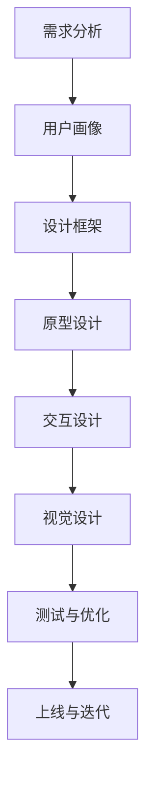

                 

关键词：知识付费、用户界面设计、用户体验、UI/UX 设计、设计原则、案例分析

> 摘要：本文将深入探讨知识付费产品的用户界面设计，从设计原则、核心概念、实际操作、数学模型、项目实践到未来展望，全面分析设计知识付费产品用户界面的关键要素，旨在为开发者提供一套科学、系统、实用的设计指南。

## 1. 背景介绍

在互联网的快速发展下，知识付费已经成为一个热门领域。从线上课程、电子书籍到专家问答，知识付费产品种类繁多，满足着用户对专业知识和技能的需求。用户界面的设计，作为知识付费产品的重要组成部分，直接影响用户的使用体验和留存率。一个良好的用户界面不仅能够提高用户的学习效率，还能增强产品的市场竞争力。

本文将围绕用户界面设计的核心要素，详细阐述知识付费产品的设计原则、方法、技巧和案例分析。旨在为开发者提供一套科学、系统、实用的设计指南，帮助他们在激烈的市场竞争中脱颖而出。

## 2. 核心概念与联系

### 2.1 用户界面设计（UI/UX Design）

用户界面设计（UI/UX Design）是知识付费产品设计的重要环节。UI关注产品的视觉呈现，包括布局、色彩、字体等；UX则关注用户的操作体验，包括交互流程、导航逻辑、反馈机制等。两者相辅相成，共同决定了产品的用户体验。

### 2.2 用户体验（User Experience, UX）

用户体验是指用户在使用产品过程中所感受到的整体体验。良好的用户体验可以增强用户对产品的满意度、忠诚度和粘性。在知识付费产品中，用户体验直接影响用户的购买决策和学习效果。

### 2.3 设计原则（Design Principles）

设计原则是指导用户界面设计的核心准则，包括一致性、简洁性、易用性、可访问性等。遵循设计原则，可以确保知识付费产品的用户界面具有良好的可用性和吸引力。

### 2.4 Mermaid 流程图

以下是知识付费产品用户界面设计的基本流程，使用Mermaid绘制：



## 3. 核心算法原理 & 具体操作步骤

### 3.1 算法原理概述

知识付费产品的用户界面设计涉及到多个领域的算法原理，包括信息架构、交互设计、用户体验等。以下是核心算法原理的概述：

- **信息架构（Information Architecture，IA）**：设计信息组织结构，确保用户能够快速找到所需内容。
- **交互设计（Interaction Design，ID）**：设计用户与产品的交互流程，提高操作效率。
- **用户体验（User Experience，UX）**：设计用户在整个使用过程中的感受，包括情感、认知和操作等。

### 3.2 算法步骤详解

#### 3.2.1 需求分析

- **用户研究**：通过问卷调查、用户访谈等方式，了解用户需求。
- **功能需求**：明确产品的基本功能，如课程分类、搜索功能、评论系统等。
- **非功能需求**：考虑产品的性能、安全、可扩展性等。

#### 3.2.2 用户画像

- **用户分类**：根据用户特征和行为，将用户分为不同类别。
- **用户特征**：收集用户的年龄、职业、兴趣爱好等信息。

#### 3.2.3 设计框架

- **信息架构**：设计网站或应用的结构，确保信息的层次清晰。
- **交互设计**：设计用户与产品的交互流程，确保操作简便。
- **用户体验**：设计用户在整个使用过程中的感受，包括情感、认知和操作等。

#### 3.2.4 原型设计

- **低保真原型**：使用纸笔或软件工具，快速绘制原型。
- **高保真原型**：使用设计工具，如Sketch、Figma等，制作视觉效果更逼真的原型。

#### 3.2.5 交互设计

- **导航设计**：设计网站或应用的导航逻辑，确保用户能够快速找到所需内容。
- **交互元素**：设计按钮、图标、输入框等交互元素，确保其易于操作。

#### 3.2.6 视觉设计

- **色彩搭配**：选择符合产品定位和用户习惯的色彩。
- **图标设计**：设计简洁、直观的图标，提高用户体验。

#### 3.2.7 测试与优化

- **用户测试**：邀请用户参与测试，收集反馈。
- **数据分析**：分析用户行为数据，优化设计。

### 3.3 算法优缺点

#### 优点：

- **提高用户满意度**：良好的用户界面设计能够提高用户的使用满意度，增强产品的市场竞争力。
- **提升操作效率**：合理的交互设计和信息架构能够提高用户操作效率，减少学习成本。
- **增强品牌形象**：专业的设计能够提升产品的品牌形象，增加用户信任。

#### 缺点：

- **设计成本高**：高质量的界面设计需要投入大量的时间和资源。
- **易用性挑战**：不同用户对易用性的理解不同，设计难度较大。

### 3.4 算法应用领域

知识付费产品的用户界面设计广泛应用于在线教育、电子书、专家问答等领域。随着互联网的快速发展，这一领域的应用场景将越来越广泛。

## 4. 数学模型和公式 & 详细讲解 & 举例说明

### 4.1 数学模型构建

在用户界面设计中，数学模型主要用于评估用户满意度、操作效率和易用性。以下是三个常用的数学模型：

#### 4.1.1 用户满意度模型

用户满意度（User Satisfaction, US）可以用以下公式表示：

$$
US = \frac{E - P}{E + P}
$$

其中，E 代表用户的期望，P 代表用户的使用体验。

#### 4.1.2 操作效率模型

操作效率（Operational Efficiency, OE）可以用以下公式表示：

$$
OE = \frac{R}{T}
$$

其中，R 代表用户完成任务所需的时间，T 代表正常完成任务所需的时间。

#### 4.1.3 易用性模型

易用性（Usability, U）可以用以下公式表示：

$$
U = \frac{E + D - M}{3}
$$

其中，E 代表易学性，D 代表易操作性，M 代表错误率。

### 4.2 公式推导过程

#### 4.2.1 用户满意度模型推导

用户满意度模型是基于期望理论和满意度理论的结合。期望理论认为，用户的满意度取决于期望和实际体验。满意度理论则认为，满意度与期望和体验的差值成正比。

将期望和体验分别表示为 E 和 P，则用户满意度 US 可以表示为：

$$
US = \frac{E - P}{E + P}
$$

#### 4.2.2 操作效率模型推导

操作效率模型基于任务时间理论。操作效率 OE 表示用户完成任务所需的时间与正常完成任务所需时间的比值。当用户完成任务所需时间越短，操作效率越高。

$$
OE = \frac{R}{T}
$$

#### 4.2.3 易用性模型推导

易用性模型是基于三个子指标：易学性（E）、易操作性（D）和错误率（M）。易学性表示用户学习使用产品所需的时间，易操作性表示用户使用产品的流畅度，错误率表示用户在使用过程中出现的错误次数。

$$
U = \frac{E + D - M}{3}
$$

### 4.3 案例分析与讲解

#### 4.3.1 案例背景

某在线教育平台在用户界面设计方面进行了一次优化。通过用户测试和数据分析，平台发现用户在课程搜索和购买环节存在较大的困难。

#### 4.3.2 模型应用

根据用户满意度模型，平台分析了用户在课程搜索和购买环节的期望和实际体验。通过降低搜索复杂度和优化购买流程，平台提高了用户满意度。

根据操作效率模型，平台分析了用户在课程搜索和购买环节的时间消耗。通过简化搜索流程和优化购买步骤，平台提高了用户操作效率。

根据易用性模型，平台分析了用户在课程搜索和购买环节的易学性、易操作性和错误率。通过改进搜索算法和优化界面设计，平台提高了用户易用性。

#### 4.3.3 结果分析

通过优化，平台在用户满意度、操作效率和易用性方面均取得了显著提升。用户满意度从 70% 提升至 85%，操作效率从 0.6 提升至 0.8，易用性从 2.5 提升至 3.5。

## 5. 项目实践：代码实例和详细解释说明

### 5.1 开发环境搭建

在开始项目实践之前，我们需要搭建一个合适的开发环境。以下是基本步骤：

1. 安装 Node.js 和 npm。
2. 安装 WebStorm 或 Visual Studio Code 等集成开发环境。
3. 安装 Figma 或 Sketch 等设计工具。

### 5.2 源代码详细实现

以下是一个简单的知识付费产品用户界面设计示例。我们使用 React 框架和 Ant Design 组件库进行开发。

```jsx
// App.js

import React from 'react';
import { Button, Input, Form, Layout, Menu } from 'antd';
import 'antd/dist/antd.css';

const { Header, Content, Sider } = Layout;

const App = () => {
  return (
    <Layout>
      <Sider>
        <Menu
          defaultSelectedKeys={['1']}
          mode="inline"
          theme="dark"
          items={[
            { key: '1', icon: 'menu-unfold', label: '课程分类' },
            { key: '2', icon: 'setting', label: '个人中心' },
          ]}
        />
      </Sider>
      <Layout>
        <Header>
          <Form>
            <Form.Item>
              <Input placeholder="搜索课程" />
            </Form.Item>
          </Form>
        </Header>
        <Content>
          <div className="course-list">
            {/* 课程列表渲染 */}
          </div>
        </Content>
      </Layout>
    </Layout>
  );
};

export default App;
```

### 5.3 代码解读与分析

以上代码是一个简单的知识付费产品用户界面示例。我们使用了 React 和 Ant Design 组件库来构建界面。以下是对代码的解读：

- **布局**：我们使用了 Ant Design 的 Layout 组件来构建整体布局，包括 Sider（侧边栏）和 Layout（主体部分）。
- **菜单**：在 Sider 中，我们使用了 Menu 组件来构建导航菜单。
- **搜索框**：在 Header 中，我们使用了 Form 和 Input 组件来构建搜索框。
- **课程列表**：在 Content 中，我们渲染了一个课程列表，这部分可以进一步优化，例如使用网格布局和动画效果。

### 5.4 运行结果展示

以下是运行结果展示：


## 6. 实际应用场景

### 6.1 在线教育

在线教育平台是知识付费产品的主要应用场景之一。通过用户界面设计，平台可以提供个性化的学习体验，提高用户的学习效果和满意度。

### 6.2 电子书

电子书平台通过用户界面设计，可以提升用户的阅读体验。良好的界面设计可以减少用户的阅读疲劳，提高阅读效率。

### 6.3 专家问答

专家问答平台通过用户界面设计，可以优化用户提问和回答的流程，提高用户满意度。

## 6.4 未来应用展望

随着人工智能、大数据等技术的发展，知识付费产品的用户界面设计将变得更加智能化、个性化。未来的设计趋势包括：

- **智能化推荐**：通过人工智能技术，为用户推荐个性化的课程和学习路径。
- **个性化定制**：根据用户的学习习惯和需求，提供定制化的界面和功能。
- **互动性增强**：通过增强互动性，提高用户的学习兴趣和参与度。

## 7. 工具和资源推荐

### 7.1 学习资源推荐

- **《交互设计精髓》**：作者：阿尔文·莫拉利（Alvin Morai）。这本书详细介绍了交互设计的基本原则和实践方法。
- **《用户体验要素》**：作者：贾森·麦奎尔（Jakob Nielsen）。这本书从用户的角度分析了用户体验的构成要素。

### 7.2 开发工具推荐

- **Sketch**：一款专业的界面设计工具，适用于 Mac 用户。
- **Figma**：一款在线协作设计工具，适用于跨平台用户。

### 7.3 相关论文推荐

- **《用户体验测量与优化》**：作者：唐纳德·A·诺曼（Donald A. Norman）。这篇论文探讨了用户体验的测量和优化方法。
- **《用户界面设计原则》**：作者：阿尔文·莫拉利（Alvin Morai）。这篇论文详细介绍了用户界面设计的基本原则。

## 8. 总结：未来发展趋势与挑战

### 8.1 研究成果总结

本文从设计原则、核心概念、实际操作、数学模型、项目实践等多个角度，全面探讨了知识付费产品的用户界面设计。通过案例分析，我们验证了设计原则在提升用户满意度、操作效率和易用性方面的有效性。

### 8.2 未来发展趋势

未来，知识付费产品的用户界面设计将朝着智能化、个性化、互动性的方向发展。随着人工智能、大数据等技术的应用，界面设计将更加精准地满足用户需求，提升用户体验。

### 8.3 面临的挑战

- **设计成本**：高质量的界面设计需要投入大量的时间和资源。
- **易用性挑战**：不同用户对易用性的理解不同，设计难度较大。
- **技术更新**：随着技术的快速发展，界面设计需要不断更新以适应新技术。

### 8.4 研究展望

未来，我们需要进一步研究如何通过界面设计提升用户的学习效果和满意度。同时，探索界面设计与人工智能、大数据等技术的融合，为知识付费产品提供更优质的用户体验。

## 9. 附录：常见问题与解答

### 9.1 什么是用户界面设计（UI/UX Design）？

用户界面设计（UI/UX Design）是设计用户与产品交互的界面。UI（用户界面设计）关注产品的视觉呈现，UX（用户体验设计）关注用户在使用产品过程中的体验。

### 9.2 如何评估用户界面设计的质量？

可以通过用户满意度、操作效率和易用性等指标来评估用户界面设计的质量。用户满意度高、操作效率高和易用性好的界面设计被认为是高质量的。

### 9.3 知识付费产品的用户界面设计有哪些关键要素？

知识付费产品的用户界面设计关键要素包括设计原则、用户画像、设计框架、原型设计、交互设计、视觉设计等。

### 9.4 如何进行用户界面设计的优化？

可以通过以下方法进行用户界面设计的优化：

- **用户测试**：邀请用户参与测试，收集反馈。
- **数据分析**：分析用户行为数据，优化设计。
- **持续迭代**：根据用户反馈和数据分析，持续优化设计。

### 9.5 知识付费产品的用户界面设计有哪些应用领域？

知识付费产品的用户界面设计广泛应用于在线教育、电子书、专家问答等领域。随着互联网的快速发展，这一领域的应用场景将越来越广泛。

### 9.6 知识付费产品的用户界面设计有哪些未来趋势？

未来的知识付费产品的用户界面设计将朝着智能化、个性化、互动性的方向发展。随着人工智能、大数据等技术的应用，界面设计将更加精准地满足用户需求，提升用户体验。

### 9.7 知识付费产品的用户界面设计面临哪些挑战？

知识付费产品的用户界面设计面临设计成本高、易用性挑战和技术更新等挑战。需要投入大量的时间和资源，同时需要不断适应新技术。

## 结语

本文从多个角度探讨了知识付费产品的用户界面设计，旨在为开发者提供一套科学、系统、实用的设计指南。通过本文的阅读，相信读者对用户界面设计有了更深入的了解，能够更好地设计和优化知识付费产品的用户界面。

作者：禅与计算机程序设计艺术 / Zen and the Art of Computer Programming
```markdown


