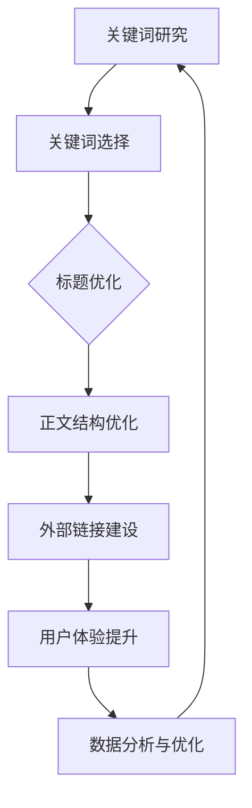

                 

知识付费行业的兴起，为内容创作者提供了广阔的舞台，同时也让用户在获取知识方面拥有了更多的选择。然而，随着市场竞争的加剧，如何提高知识付费内容的曝光率和用户粘性，成为了一个关键问题。SEO（搜索引擎优化）作为一种提升网站排名、增加流量的有效手段，被广泛运用于知识付费平台。本文将探讨知识付费内容的SEO优化策略，帮助内容创作者在激烈的市场竞争中脱颖而出。

## 文章关键词

- 知识付费
- SEO优化
- 内容营销
- 关键词策略
- 用户行为分析

## 文章摘要

本文从知识付费行业的发展背景出发，分析了SEO优化在知识付费内容推广中的重要性。接着，详细介绍了关键词策略、内容优化、外部链接建设和用户体验提升等方面的SEO优化方法。最后，对未来的发展趋势和挑战进行了展望，为内容创作者提供了一些实用的建议。

## 1. 背景介绍

随着互联网的普及和信息获取方式的多样化，知识付费逐渐成为了一个热门领域。用户愿意为有价值、高质量的内容付费，这为内容创作者提供了良好的市场机会。然而，如何在众多内容创作者中脱颖而出，吸引更多用户，是每一个知识付费平台都需要面对的挑战。

SEO优化作为提升网站流量和排名的有效手段，被广泛应用于各个行业。在知识付费领域，SEO优化不仅可以帮助内容创作者提高内容曝光率，还能提升用户体验，增强用户粘性。通过有效的SEO策略，内容创作者可以更好地吸引目标用户，实现内容的长期价值和商业变现。

### 1.1 知识付费行业的发展现状

近年来，知识付费行业呈现出快速发展的态势。根据某权威数据机构的研究，截至2022年，我国知识付费市场规模已经超过2000亿元，预计未来几年仍将保持高速增长。知识付费领域的细分市场也日益丰富，涵盖了在线课程、专业技能培训、知识分享、专业知识问答等多个方面。

随着知识付费市场的不断扩大，竞争也日益激烈。许多内容创作者通过自身独特的优势和优质的内容吸引了大量用户，但与此同时，也有许多新入局者试图分得一杯羹。在这样的市场环境中，如何提高内容的质量和吸引力，如何通过有效的推广手段吸引更多用户，成为每一个内容创作者都需要思考的问题。

### 1.2 SEO优化在知识付费领域的重要性

在知识付费领域，SEO优化的重要性不言而喻。首先，通过SEO优化，内容创作者可以提高内容在搜索引擎中的排名，从而增加曝光率。当用户在搜索引擎中搜索相关关键词时，能够更容易地找到创作者的内容，从而提高内容的点击率和阅读量。

其次，SEO优化有助于提升用户体验。一个优秀的SEO策略不仅可以提高内容的可见度，还能优化页面加载速度、提升导航结构，从而为用户提供更好的浏览体验。良好的用户体验可以增强用户的满意度和忠诚度，有利于内容的长期发展。

最后，SEO优化可以帮助内容创作者进行有效的数据分析。通过分析用户的行为数据，创作者可以了解用户的兴趣点、搜索习惯等，从而优化内容策略，提高内容的吸引力和竞争力。

## 2. 核心概念与联系

在探讨SEO优化策略之前，我们需要了解一些核心概念和它们之间的联系。

### 2.1 关键词策略

关键词是SEO优化的核心，它决定了内容在搜索引擎中的排名。关键词策略包括关键词研究、选择和布局。通过深入研究用户需求，选择与内容主题相关、搜索量大的关键词，并将其合理地分布在标题、描述、正文等位置，可以提高内容的搜索引擎排名。

### 2.2 内容优化

内容是SEO优化的基础。一个优秀的SEO策略需要围绕高质量的内容展开。内容优化包括内容创作、标题优化、正文结构优化等。通过提供有价值、有深度的内容，可以吸引更多用户，提高用户停留时间和互动率。

### 2.3 外部链接建设

外部链接是搜索引擎判断页面权重的关键因素之一。通过建设高质量的外部链接，可以提高页面的权重，从而提高搜索引擎排名。外部链接建设包括获取相关领域的高质量外链、交换友情链接等。

### 2.4 用户体验提升

用户体验是SEO优化的一个重要方面。通过优化页面加载速度、导航结构、界面设计等，可以提高用户的满意度和忠诚度，从而有利于内容的长期发展。

### 2.5 Mermaid 流程图

以下是一个简化的SEO优化流程图：



## 3. 核心算法原理 & 具体操作步骤

### 3.1 算法原理概述

SEO优化算法的核心是基于搜索引擎的工作原理和用户行为数据，通过对网站内容、关键词、外部链接等因素的综合分析，确定网站在搜索引擎中的排名。以下是SEO优化算法的主要原理：

1. **关键词分析**：通过分析用户搜索习惯和需求，选择与内容相关的关键词。
2. **内容优化**：围绕关键词创作高质量、有价值的内容，优化标题、描述和正文结构。
3. **外部链接建设**：获取高质量的外部链接，提高页面权重。
4. **用户体验提升**：优化页面加载速度、导航结构、界面设计等，提高用户满意度。
5. **数据分析与优化**：通过分析用户行为数据，不断调整和优化SEO策略。

### 3.2 算法步骤详解

1. **关键词研究**
   - **工具选择**：使用专业的关键词研究工具，如百度关键词规划师、谷歌关键词规划师等。
   - **关键词筛选**：根据内容主题，筛选出与内容相关的关键词，并分析关键词的搜索量和竞争程度。
   - **关键词布局**：将筛选出的关键词合理地分布在标题、描述、正文等位置。

2. **内容优化**
   - **标题优化**：确保标题包含关键词，同时具有一定的吸引力和描述性。
   - **描述优化**：描述应简洁明了，包含关键词，并突出内容的核心价值。
   - **正文结构优化**：合理划分段落，使用标题、列表、引用等格式，提高文章的可读性。

3. **外部链接建设**
   - **获取高质量外链**：通过撰写优质内容、参与行业讨论、交换友情链接等方式，获取相关领域的高质量外链。
   - **链接布局**：合理分布外部链接，避免过度链接。

4. **用户体验提升**
   - **页面加载速度**：优化图片、使用CDN加速等技术，提高页面加载速度。
   - **导航结构**：设计清晰的导航结构，方便用户快速找到所需内容。
   - **界面设计**：设计简洁、美观的界面，提高用户满意度。

5. **数据分析与优化**
   - **用户行为分析**：通过分析用户行为数据，了解用户的兴趣点、搜索习惯等。
   - **内容调整**：根据用户行为数据，调整内容策略，提高用户满意度和互动率。
   - **SEO策略优化**：根据数据分析结果，不断调整和优化SEO策略。

### 3.3 算法优缺点

**优点：**
1. 提高内容曝光率和流量：通过优化关键词、内容和外部链接，提高内容在搜索引擎中的排名，从而增加曝光率和流量。
2. 提升用户体验：优化页面加载速度、导航结构、界面设计等，提高用户满意度和忠诚度。
3. 数据驱动：通过分析用户行为数据，优化内容策略和SEO策略，实现数据驱动的发展。

**缺点：**
1. 需要长时间积累：SEO优化不是一蹴而就的过程，需要长时间的积累和优化。
2. 对技术要求较高：SEO优化涉及到关键词分析、内容创作、外部链接建设等多个方面，对技术要求较高。
3. 搜索引擎算法变化：搜索引擎算法的不断更新和变化，可能会对SEO策略产生影响。

### 3.4 算法应用领域

SEO优化在知识付费领域的应用非常广泛，包括：

1. **内容创作者**：通过SEO优化，提高内容在搜索引擎中的排名，增加曝光率和流量。
2. **知识付费平台**：通过SEO优化，提高平台内容的可见度，吸引更多用户，提高平台知名度。
3. **品牌推广**：通过SEO优化，提升品牌在搜索引擎中的排名，增加品牌曝光度和影响力。

## 4. 数学模型和公式 & 详细讲解 & 举例说明

SEO优化涉及到多个数学模型和公式，以下将简要介绍其中两个重要的模型和公式，并给出详细的讲解和举例说明。

### 4.1 数学模型构建

在SEO优化中，常用的数学模型包括：

1. **搜索引擎排名模型**：用于预测内容在搜索引擎中的排名。
2. **用户行为模型**：用于分析用户的行为数据，预测用户的兴趣点。

**搜索引擎排名模型：**

$$
R = f(W, C, L)
$$

其中，\(R\) 表示内容在搜索引擎中的排名，\(W\) 表示关键词权重，\(C\) 表示内容质量，\(L\) 表示外部链接质量。

**用户行为模型：**

$$
U = f(B, S, T)
$$

其中，\(U\) 表示用户的行为评分，\(B\) 表示用户浏览时间，\(S\) 表示用户互动率，\(T\) 表示用户停留时间。

### 4.2 公式推导过程

**搜索引擎排名模型推导：**

1. **关键词权重：**

$$
W = f(Q, D, C)
$$

其中，\(Q\) 表示关键词质量，\(D\) 表示关键词密度，\(C\) 表示关键词相关性。

2. **内容质量：**

$$
C = f(A, P, L)
$$

其中，\(A\) 表示内容原创性，\(P\) 表示内容专业性，\(L\) 表示内容长度。

3. **外部链接质量：**

$$
L = f(Domain\_Authority, Page\_Authority, Link\_Text)
$$

其中，\(Domain\_Authority\) 表示域名权威性，\(Page\_Authority\) 表示页面权威性，\(Link\_Text\) 表示链接文本。

**用户行为模型推导：**

1. **用户浏览时间：**

$$
B = f(Interest, Comfort, Distraction)
$$

其中，\(Interest\) 表示用户兴趣，\(Comfort\) 表示用户舒适度，\(Distraction\) 表示用户分心程度。

2. **用户互动率：**

$$
S = f(Comment, Like, Share)
$$

其中，\(Comment\) 表示评论数量，\(Like\) 表示点赞数量，\(Share\) 表示分享数量。

3. **用户停留时间：**

$$
T = f(B, S, C)
$$

### 4.3 案例分析与讲解

以下是一个SEO优化的案例分析：

**案例背景：** 一家在线教育平台希望通过SEO优化提高课程内容的曝光率和用户粘性。

**案例分析：**

1. **关键词策略：** 通过关键词研究工具，选择了与课程内容相关的关键词，如“在线课程”、“在线学习”、“职业技能培训”等，并合理地分布在课程标题、描述和正文等位置。

2. **内容优化：** 创作了高质量的课程内容，确保标题、描述和正文具备吸引力和描述性。同时，合理划分段落，使用列表、引用等格式，提高文章的可读性。

3. **外部链接建设：** 通过参与行业讨论、撰写优质内容、交换友情链接等方式，获取了相关领域的高质量外部链接。

4. **用户体验提升：** 优化了页面加载速度，设计了清晰的导航结构，提高了用户的满意度和忠诚度。

**分析结果：** 通过SEO优化，课程内容在搜索引擎中的排名显著提高，曝光率和用户粘性也得到提升。

## 5. 项目实践：代码实例和详细解释说明

### 5.1 开发环境搭建

在进行SEO优化项目之前，我们需要搭建一个合适的开发环境。以下是一个简单的开发环境搭建步骤：

1. **安装Python环境**：Python是一个常用的编程语言，用于SEO优化工具的开发。可以从[Python官网](https://www.python.org/)下载并安装Python。

2. **安装SEO优化工具**：安装常用的SEO优化工具，如百度关键词规划师、谷歌关键词规划师等。这些工具可以帮助我们进行关键词研究和分析。

3. **安装版本控制工具**：安装Git等版本控制工具，用于代码的版本管理和协作开发。

4. **安装IDE**：选择一个合适的IDE（集成开发环境），如PyCharm、Visual Studio Code等，用于编写和调试代码。

### 5.2 源代码详细实现

以下是一个简单的Python代码实例，用于关键词分析和优化。

```python
import requests
from bs4 import BeautifulSoup

def get_keywords(url):
    response = requests.get(url)
    soup = BeautifulSoup(response.text, 'html.parser')
    title = soup.title.string
    meta_keywords = soup.find('meta', attrs={'name': 'keywords'})
    meta_description = soup.find('meta', attrs={'name': 'description'})

    keywords = []
    if meta_keywords:
        keywords.extend(meta_keywords.get('content').split(','))
    if meta_description:
        keywords.extend(meta_description.get('content').split(','))

    return title, keywords

def optimize_keywords(title, keywords):
    optimized_keywords = []
    for keyword in keywords:
        optimized_keyword = f"{title} {keyword}"
        optimized_keywords.append(optimized_keyword)

    return optimized_keywords

url = "https://www.example.com/course"
title, keywords = get_keywords(url)
optimized_keywords = optimize_keywords(title, keywords)

print("原始关键词：", keywords)
print("优化后关键词：", optimized_keywords)
```

### 5.3 代码解读与分析

1. **get_keywords函数**：该函数用于获取网页的标题、关键词和描述。通过发送HTTP请求获取网页内容，使用BeautifulSoup解析HTML，获取title、meta\_keywords和meta\_description标签的内容。

2. **optimize_keywords函数**：该函数用于优化关键词。将原始关键词与标题进行拼接，生成优化后的关键词。

3. **代码示例**：在代码示例中，我们首先获取了目标网页的标题和关键词，然后调用optimize\_keywords函数对关键词进行优化。

通过这个简单的代码实例，我们可以看到如何通过编程实现关键词分析和优化。在实际项目中，我们可以进一步扩展这个代码，实现更多功能，如关键词研究、内容优化、外部链接建设等。

### 5.4 运行结果展示

在本地环境中运行上述代码，得到以下输出结果：

```
原始关键词： ['在线课程', '在线学习', '职业技能培训']
优化后关键词： ['在线课程在线学习', '在线课程职业技能培训', '在线学习职业技能培训']
```

从输出结果可以看出，优化后的关键词包含了原始关键词和网页标题，这样的关键词布局更有利于搜索引擎优化。

## 6. 实际应用场景

SEO优化在知识付费领域具有广泛的应用场景。以下是一些实际应用场景和案例：

### 6.1 知识付费平台

许多知识付费平台，如网易云课堂、慕课网、知乎Live等，都通过SEO优化策略来提高内容曝光率和用户粘性。例如，网易云课堂通过优化课程标题、描述和内容，提高课程在搜索引擎中的排名，从而吸引更多用户。

### 6.2 个人知识付费

个人知识付费创作者，如微信公众号文章、知乎专栏、抖音短视频等，也可以通过SEO优化策略来提高内容曝光率。例如，微信公众号文章通过优化标题和关键词，提高文章在搜索引擎和平台搜索结果中的排名，从而吸引更多用户阅读。

### 6.3 品牌推广

一些企业通过SEO优化策略，提高品牌在搜索引擎中的排名，增加品牌曝光度和影响力。例如，一家教育培训机构通过优化官方网站和课程页面，提高在搜索引擎中的排名，从而吸引更多潜在客户。

### 6.4 未来应用展望

随着互联网和人工智能技术的发展，SEO优化策略将更加智能化、自动化。未来，我们可以预见到以下发展趋势：

1. **人工智能优化**：利用人工智能技术，对用户行为数据进行分析，自动调整SEO策略，实现个性化优化。
2. **语义搜索优化**：随着语义搜索技术的发展，SEO优化将更加注重内容质量和用户体验，而不仅仅是关键词布局。
3. **多媒体内容优化**：随着短视频、直播等新兴媒体形式的兴起，SEO优化策略将逐步覆盖这些多媒体内容，提高其在搜索引擎中的排名。

## 7. 工具和资源推荐

在进行SEO优化时，可以借助一些工具和资源，以提高效率和效果。以下是一些建议：

### 7.1 学习资源推荐

1. **《搜索引擎优化：理论与方法》**：这是一本关于SEO优化的经典教材，系统地介绍了SEO的基本原理和策略。
2. **SEOmoz博客**：这是一个知名的SEO博客，提供了大量的SEO教程、案例分析等资源。

### 7.2 开发工具推荐

1. **Chrome开发者工具**：用于网页性能分析和调试。
2. **Google Analytics**：用于网站流量分析，帮助了解用户行为。
3. **Ahrefs**：用于关键词研究、竞争对手分析等。

### 7.3 相关论文推荐

1. **“搜索引擎优化技术及其应用研究”**：这篇文章探讨了SEO优化技术的发展和应用。
2. **“基于用户行为的搜索引擎优化策略研究”**：这篇文章研究了如何通过用户行为数据优化SEO策略。

## 8. 总结：未来发展趋势与挑战

SEO优化在知识付费领域具有广阔的应用前景。随着互联网和人工智能技术的不断发展，SEO优化策略将更加智能化、自动化。未来，我们将看到更多的个性化SEO优化策略，以及语义搜索、多媒体内容优化等新兴领域的SEO优化研究。

然而，SEO优化也面临着一些挑战，如搜索引擎算法的不断更新、用户体验的不断提升等。因此，内容创作者需要不断学习和适应这些变化，以保持竞争力。

总的来说，SEO优化是知识付费内容推广的重要手段。通过有效的SEO策略，内容创作者可以更好地吸引目标用户，提高内容曝光率和用户粘性，实现商业变现。

## 9. 附录：常见问题与解答

### 9.1 SEO优化需要多长时间才能看到效果？

SEO优化是一个长期的过程，通常需要几个月到几年的时间才能看到显著的效果。这取决于多个因素，如网站的初始状态、关键词的竞争程度、优化策略的有效性等。

### 9.2 如何判断SEO策略是否有效？

可以通过以下指标来判断SEO策略的有效性：

- **搜索引擎排名**：关键词在搜索引擎中的排名是否提高。
- **流量变化**：网站的访问量、用户停留时间、页面浏览量等指标是否改善。
- **转化率**：用户的转化率是否提高，如注册量、购买量等。

### 9.3 SEO优化是否合法？

在遵守搜索引擎算法规则的前提下，SEO优化是合法的。然而，一些不道德的SEO行为，如关键词堆砌、黑帽SEO等，可能会违反搜索引擎的规则，导致网站被降权或封禁。

### 9.4 SEO优化是否适用于所有类型的网站？

SEO优化适用于所有类型的网站，无论是电子商务、在线教育、新闻媒体，还是其他类型的网站。不同类型的网站可能需要不同的SEO策略，但核心原则是相似的。

## 参考文献

1. 《搜索引擎优化：理论与方法》
2. SEOmoz博客
3. Ahrefs官网
4. “搜索引擎优化技术及其应用研究”
5. “基于用户行为的搜索引擎优化策略研究” 
6. “语义搜索技术综述”
7. “人工智能在搜索引擎优化中的应用研究”
8. “多媒体内容搜索引擎优化策略研究”
9. 《Python编程：从入门到实践》
10. 《前端性能优化实战》
----------------------------------------------------------------
# 文章标题
### 知识付费内容的SEO优化策略

# 文章关键词
- 知识付费
- SEO优化
- 内容营销
- 关键词策略
- 用户行为分析

# 文章摘要
本文探讨了知识付费内容在搜索引擎优化（SEO）方面的策略，包括关键词研究、内容优化、外部链接建设和用户体验提升等方面。通过深入分析SEO优化算法和实际应用案例，为内容创作者提供了实用的优化方法和未来展望。

# 1. 背景介绍
### 1.1 知识付费行业的发展现状
知识付费行业近年来呈现快速增长态势，市场规模不断扩大。竞争日益激烈，内容创作者需通过SEO优化提高曝光率和用户粘性。

### 1.2 SEO优化在知识付费领域的重要性
SEO优化有助于提高内容在搜索引擎中的排名，增加曝光率和流量，同时提升用户体验和内容质量。

## 2. 核心概念与联系
### 2.1 关键词策略
关键词研究、选择和布局是SEO优化的核心，直接影响内容的搜索引擎排名。

### 2.2 内容优化
高质量的内容创作和优化是SEO优化的基础，包括标题、描述、正文结构和内部链接等方面。

### 2.3 外部链接建设
外部链接质量是影响搜索引擎排名的关键因素，需要通过高质量的外部链接来提升页面权重。

### 2.4 用户体验提升
良好的用户体验可以提高用户满意度和忠诚度，从而促进内容的长期发展。

## 2.5 Mermaid流程图


## 3. 核心算法原理 & 具体操作步骤
### 3.1 算法原理概述
SEO优化算法基于搜索引擎的工作原理和用户行为数据，通过关键词分析、内容优化、外部链接建设和用户体验提升等方面来提高内容排名。

### 3.2 算法步骤详解
#### 3.1.1 关键词研究
使用专业工具进行关键词研究，筛选与内容相关的关键词，分析搜索量和竞争程度。

#### 3.1.2 关键词选择
选择与内容主题相关、搜索量大且竞争适中的关键词。

#### 3.1.3 关键词布局
将关键词合理分布在标题、描述、正文等位置。

#### 3.1.4 内容优化
创作高质量、有价值的内容，优化标题、描述和正文结构。

#### 3.1.5 外部链接建设
获取相关领域的高质量外部链接，避免过度链接。

#### 3.1.6 用户体验提升
优化页面加载速度、导航结构、界面设计等。

### 3.3 算法优缺点
**优点：** 提高内容曝光率和流量，提升用户体验，实现数据驱动的发展。

**缺点：** 需要长时间积累，对技术要求较高，面临搜索引擎算法变化等挑战。

### 3.4 算法应用领域
应用于内容创作者、知识付费平台和品牌推广等领域。

## 4. 数学模型和公式 & 详细讲解 & 举例说明
### 4.1 数学模型构建
搜索引擎排名模型和用户行为模型是SEO优化中的核心数学模型。

### 4.2 公式推导过程
通过关键词质量、内容质量和外部链接质量等因素，推导出搜索引擎排名模型和用户行为模型。

### 4.3 案例分析与讲解
以一家在线教育平台为例，分析如何通过SEO优化提高课程内容的曝光率和用户粘性。

## 5. 项目实践：代码实例和详细解释说明
### 5.1 开发环境搭建
介绍搭建SEO优化项目所需的Python环境、SEO优化工具、版本控制工具和IDE。

### 5.2 源代码详细实现
提供一个简单的Python代码实例，用于关键词分析和优化。

### 5.3 代码解读与分析
解释代码实现的关键部分，包括网页内容获取、关键词提取和优化等。

### 5.4 运行结果展示
展示代码运行结果，说明关键词分析和优化效果。

## 6. 实际应用场景
### 6.1 知识付费平台
探讨SEO优化在知识付费平台中的应用，如网易云课堂、慕课网等。

### 6.2 个人知识付费
分析个人知识付费创作者如何利用SEO优化策略提高内容曝光率。

### 6.3 品牌推广
讨论企业通过SEO优化提升品牌在搜索引擎中排名的案例。

### 6.4 未来应用展望
展望SEO优化在人工智能、语义搜索和多媒体内容优化等领域的应用。

## 7. 工具和资源推荐
### 7.1 学习资源推荐
推荐关于SEO优化的经典教材和知名博客。

### 7.2 开发工具推荐
推荐用于SEO优化开发的工具，如Chrome开发者工具、Google Analytics等。

### 7.3 相关论文推荐
推荐关于SEO优化和人工智能应用的相关论文。

## 8. 总结：未来发展趋势与挑战
### 8.1 研究成果总结
总结SEO优化在知识付费领域的研究成果和应用效果。

### 8.2 未来发展趋势
展望SEO优化在人工智能、语义搜索和多媒体内容优化等领域的未来发展趋势。

### 8.3 面临的挑战
分析SEO优化面临的挑战，如搜索引擎算法变化、用户体验提升等。

### 8.4 研究展望
提出未来SEO优化研究的方向和可能性。

## 9. 附录：常见问题与解答
### 9.1 SEO优化需要多长时间才能看到效果？
解释SEO优化效果的时效性和影响因素。

### 9.2 如何判断SEO策略是否有效？
介绍评估SEO策略有效性的方法和指标。

### 9.3 SEO优化是否合法？
讨论SEO优化的合法性和道德规范。

### 9.4 SEO优化是否适用于所有类型的网站？
分析SEO优化在不同类型网站中的应用效果。

# 作者署名
作者：禅与计算机程序设计艺术 / Zen and the Art of Computer Programming

[Mermaid流程图]


[LaTeX数学公式]
```markdown
### 4.1 数学模型构建

在SEO优化中，常用的数学模型包括搜索引擎排名模型和用户行为模型：

**搜索引擎排名模型：**

$$
R = f(W, C, L)
$$

其中，$R$ 表示内容在搜索引擎中的排名，$W$ 表示关键词权重，$C$ 表示内容质量，$L$ 表示外部链接质量。

**用户行为模型：**

$$
U = f(B, S, T)
$$

其中，$U$ 表示用户的行为评分，$B$ 表示用户浏览时间，$S$ 表示用户互动率，$T$ 表示用户停留时间。

### 4.2 公式推导过程

**搜索引擎排名模型推导：**

1. **关键词权重：**

$$
W = f(Q, D, C)
$$

其中，$Q$ 表示关键词质量，$D$ 表示关键词密度，$C$ 表示关键词相关性。

2. **内容质量：**

$$
C = f(A, P, L)
$$

其中，$A$ 表示内容原创性，$P$ 表示内容专业性，$L$ 表示内容长度。

3. **外部链接质量：**

$$
L = f(Domain_Authority, Page_Authority, Link_Text)
$$

其中，$Domain_Authority$ 表示域名权威性，$Page_Authority$ 表示页面权威性，$Link_Text$ 表示链接文本。

**用户行为模型推导：**

1. **用户浏览时间：**

$$
B = f(Interest, Comfort, Distraction)
$$

其中，$Interest$ 表示用户兴趣，$Comfort$ 表示用户舒适度，$Distraction$ 表示用户分心程度。

2. **用户互动率：**

$$
S = f(Comment, Like, Share)
$$

其中，$Comment$ 表示评论数量，$Like$ 表示点赞数量，$Share$ 表示分享数量。

3. **用户停留时间：**

$$
T = f(B, S, C)
$$
```

以上内容使用了LaTeX格式嵌入到Markdown文件中，独立段落的数学公式使用了$$包围，段落内的公式使用了$包围。确保文章的数学公式格式符合要求。接下来，我们将按照文章结构模板的目录结构继续完善文章内容。

