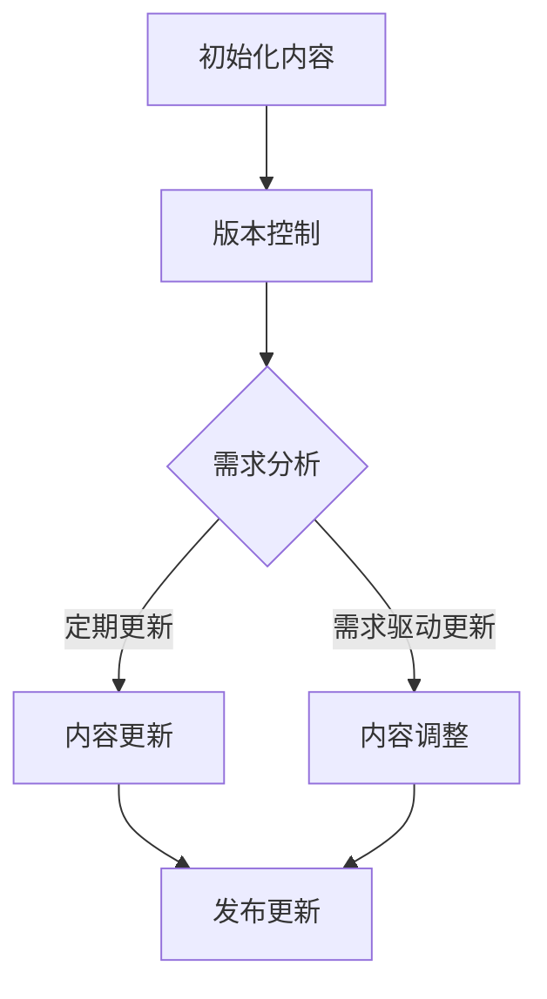

                 

关键词：知识付费、版本控制、更新策略、内容管理、技术架构、数据安全、用户体验

> 摘要：随着知识付费市场的迅速发展，如何有效管理知识内容的版本和进行及时更新成为了一个关键问题。本文将探讨知识付费内容版本控制与更新策略的核心概念、算法原理、数学模型、实际应用案例，并展望未来的发展趋势和挑战。

## 1. 背景介绍

在当今信息爆炸的时代，知识付费已经成为一种主流的学习方式。用户通过支付一定的费用，可以获取高质量、有价值的知识内容。然而，随着用户需求的不断变化和知识更新的快速迭代，如何高效地管理和更新这些知识内容，成为了内容提供商和平台运营者面临的重要挑战。

版本控制是确保知识内容准确性和一致性的关键手段。它不仅仅包括内容的更新，还包括内容版本的历史记录、版本间的差异比较、回滚和合并等功能。有效的版本控制能够帮助平台提高运营效率，减少错误传播，提升用户体验。

更新策略则是指在特定时间和条件下对知识内容进行调整和优化的方法。合理的更新策略能够确保知识内容与时俱进，满足用户需求，同时避免过度更新导致的资源浪费和用户困扰。

本文将围绕知识付费内容的版本控制与更新策略，探讨其核心概念、算法原理、数学模型、实际应用案例，并展望未来的发展趋势和挑战。

## 2. 核心概念与联系

### 2.1 版本控制的基本概念

版本控制（Version Control）是一种管理文档、代码或其他文件变更的软件工具。它能够记录文件的每次更改，并允许用户回滚到先前的版本。版本控制系统的核心功能包括：

- **版本记录**：记录每次更改的详细信息，如时间、用户、变更内容等。
- **差异比较**：比较文件的不同版本，找出变更的内容。
- **合并**：在多个版本之间存在冲突时，自动或手动合并文件内容。
- **回滚**：回滚到先前的版本，撤销最近的更改。

### 2.2 更新策略的基本概念

更新策略（Update Strategy）是指根据用户需求和市场变化，对知识内容进行定期调整和优化的方法。常见的更新策略包括：

- **定期更新**：定期对知识内容进行审查和更新，确保其时效性和准确性。
- **需求驱动更新**：根据用户反馈和需求，对知识内容进行快速调整和优化。
- **增量更新**：只更新知识内容的部分内容，而不是全部内容，以减少对用户的影响。

### 2.3 版本控制与更新策略的联系

版本控制和更新策略密切相关。有效的版本控制可以确保更新策略的实施，而合理的更新策略可以充分发挥版本控制的作用。具体来说，版本控制为更新策略提供了以下支持：

- **安全性**：版本控制系统能够确保在更新过程中不丢失任何重要内容，用户可以随时回滚到先前的版本。
- **可追溯性**：版本控制系统记录了所有变更的历史，方便对更新过程进行审计和评估。
- **效率**：版本控制系统能够快速比较和合并文件，减少人工操作的时间和错误。

### 2.4 Mermaid 流程图

以下是一个简单的 Mermaid 流程图，展示了版本控制和更新策略的基本流程：



在这个流程图中，初始化内容之后，通过版本控制系统进行内容管理。根据需求分析的结果，内容更新可以分为定期更新和需求驱动更新两种方式，最终通过发布更新步骤将更新内容推送给用户。

## 3. 核心算法原理 & 具体操作步骤

### 3.1 算法原理概述

知识付费内容的版本控制和更新策略涉及多个核心算法，包括版本管理算法、差异比较算法和更新算法等。以下是这些算法的基本原理概述：

#### 版本管理算法

版本管理算法负责对知识内容的版本进行跟踪和管理。常见的版本管理算法包括基于标签（Tags）的版本管理和基于分支（Branches）的版本管理。

- **基于标签的版本管理**：通过为每个版本打上不同的标签，方便用户查找和切换不同版本的文档。
- **基于分支的版本管理**：通过创建不同的分支来管理不同的版本，每个分支代表一个独立的开发路径。

#### 差异比较算法

差异比较算法用于比较两个版本之间的差异，以便用户了解变更的内容。常见的差异比较算法包括基于文本的差异比较和基于图像的差异比较。

- **基于文本的差异比较**：通过比较文本文件的每一行，标记出不同版本之间的差异。
- **基于图像的差异比较**：通过比较两个图像的像素值，找出图像之间的差异。

#### 更新算法

更新算法用于将新版本的文档应用到旧版本的文档上。常见的更新算法包括基于合并（Merge）的更新和基于替代（Replace）的更新。

- **基于合并的更新**：将新版本的文档与旧版本的文档进行合并，保留旧文档中未被修改的内容。
- **基于替代的更新**：直接用新版本的文档替换旧版本的文档。

### 3.2 算法步骤详解

以下是基于上述算法原理的具体操作步骤：

#### 3.2.1 版本管理步骤

1. 初始化文档版本，打上初始标签（e.g., v1.0）。
2. 每次更新文档时，创建一个新的分支或为当前版本打上新的标签（e.g., v1.1）。
3. 更新完成后，将新版本合并到主分支或保留分支，确保主分支上的文档是最新的。

#### 3.2.2 差异比较步骤

1. 选择要比较的两个版本。
2. 使用差异比较算法生成差异报告。
3. 分析差异报告，找出文档变更的内容。
4. 将差异报告展示给用户，以便用户了解变更的具体内容。

#### 3.2.3 更新步骤

1. 确定要更新的版本。
2. 使用更新算法将新版本的文档应用到旧版本的文档上。
3. 检查更新后的文档，确保其完整性和正确性。
4. 将更新后的文档发布给用户。

### 3.3 算法优缺点

每种算法都有其优缺点，具体如下：

#### 版本管理算法

- **基于标签的版本管理**：

  - 优点：易于查找和切换不同版本，便于版本管理。
  - 缺点：可能需要更多的存储空间，特别是在版本数量较多时。

- **基于分支的版本管理**：

  - 优点：能够灵活管理多个开发路径，适用于复杂的项目。
  - 缺点：可能需要更多的管理和协调工作，特别是在多个分支并行开发时。

#### 差异比较算法

- **基于文本的差异比较**：

  - 优点：简单、高效，适用于大多数文本文件。
  - 缺点：对于格式化错误或较大规模的变更，差异报告可能不够详细。

- **基于图像的差异比较**：

  - 优点：适用于图像文件，能够精确比较图像之间的差异。
  - 缺点：计算成本较高，适用于较小规模的图像比较。

#### 更新算法

- **基于合并的更新**：

  - 优点：保留旧文档中的有效内容，减少文档丢失的可能性。
  - 缺点：在复杂情况下，合并过程可能产生冲突，需要人工干预。

- **基于替代的更新**：

  - 优点：简单、直接，适用于简单的情况。
  - 缺点：可能丢失旧文档中的有效内容，不适合复杂的情况。

### 3.4 算法应用领域

版本控制和更新策略广泛应用于多个领域，包括软件开发、文档管理、内容发布等。

- **软件开发**：版本控制系统如 Git 用于跟踪代码的变更和协作开发。
- **文档管理**：差异比较工具如 Beyond Compare 用于比较文档的差异和更新。
- **内容发布**：更新算法用于将新版本的文档发布给用户，如知识付费平台的内容更新。

## 4. 数学模型和公式 & 详细讲解 & 举例说明

### 4.1 数学模型构建

在版本控制和更新策略中，可以构建以下数学模型来描述知识内容的版本管理和更新过程。

#### 4.1.1 版本管理模型

假设知识内容存在 n 个版本，版本号分别为 \( v_1, v_2, ..., v_n \)。每个版本可以表示为一个状态，状态包含内容 \( C \) 和状态时间 \( T \)。

- \( C = \{ c_1, c_2, ..., c_n \} \)：内容集合，每个内容 \( c_i \) 表示版本 \( v_i \) 的知识内容。
- \( T = \{ t_1, t_2, ..., t_n \} \)：状态时间集合，每个状态时间 \( t_i \) 表示版本 \( v_i \) 的创建时间。

版本管理模型可以用以下状态转移方程表示：

\[ \text{state}(v_i) = (C_i, T_i) \]

其中，\( \text{state}(v_i) \) 表示版本 \( v_i \) 的状态。

#### 4.1.2 更新模型

更新模型描述了新版本与旧版本之间的更新关系。假设当前版本为 \( v_i \)，下一个版本为 \( v_{i+1} \)。更新模型可以用以下方程表示：

\[ \text{update}(v_i, v_{i+1}) = C_i \oplus C_{i+1} \]

其中，\( \oplus \) 表示异或操作，用于计算新旧版本之间的差异。

### 4.2 公式推导过程

以下是版本管理和更新模型的基本公式推导过程。

#### 4.2.1 版本管理模型推导

1. 初始化版本 \( v_1 \)，内容 \( C_1 \)，状态时间 \( T_1 \)。

\[ \text{state}(v_1) = (C_1, T_1) \]

2. 每次更新创建新版本 \( v_{i+1} \)，内容 \( C_{i+1} \)，状态时间 \( T_{i+1} \)。

\[ \text{state}(v_{i+1}) = (C_{i+1}, T_{i+1}) \]

3. 更新模型计算新旧版本之间的差异。

\[ \text{update}(v_i, v_{i+1}) = C_i \oplus C_{i+1} \]

#### 4.2.2 更新模型推导

1. 假设当前版本 \( v_i \) 的内容为 \( C_i \)。

\[ C_i = \{ c_1, c_2, ..., c_n \} \]

2. 下一个版本 \( v_{i+1} \) 的内容为 \( C_{i+1} \)。

\[ C_{i+1} = \{ c_1', c_2', ..., c_n' \} \]

3. 计算新旧版本之间的差异。

\[ \text{update}(v_i, v_{i+1}) = C_i \oplus C_{i+1} \]

其中，\( \oplus \) 表示异或操作，用于计算新旧版本之间的差异。

### 4.3 案例分析与讲解

以下是一个具体的案例，用于解释版本管理和更新模型的实际应用。

#### 4.3.1 案例描述

假设一个知识付费平台有如下三个版本：

- \( v_1 \)：初始版本，内容为课程大纲。
- \( v_2 \)：更新版本，添加了新的课程内容。
- \( v_3 \)：再更新版本，修正了课程中的一个错误。

#### 4.3.2 版本管理模型应用

1. 初始化版本 \( v_1 \)，内容 \( C_1 \) 为课程大纲。

\[ \text{state}(v_1) = (C_1, T_1) \]

2. 更新版本 \( v_2 \)，内容 \( C_2 \) 为包含新课程内容的课程大纲。

\[ \text{state}(v_2) = (C_2, T_2) \]

3. 再次更新版本 \( v_3 \)，内容 \( C_3 \) 为修正错误后的课程大纲。

\[ \text{state}(v_3) = (C_3, T_3) \]

#### 4.3.3 更新模型应用

1. 计算版本 \( v_1 \) 和 \( v_2 \) 之间的差异。

\[ \text{update}(v_1, v_2) = C_1 \oplus C_2 \]

2. 计算版本 \( v_2 \) 和 \( v_3 \) 之间的差异。

\[ \text{update}(v_2, v_3) = C_2 \oplus C_3 \]

通过以上案例，我们可以看到版本管理和更新模型在知识付费内容管理中的应用。版本管理模型帮助平台记录和跟踪不同版本的知识内容，而更新模型则用于计算新旧版本之间的差异，确保内容的一致性和准确性。

## 5. 项目实践：代码实例和详细解释说明

### 5.1 开发环境搭建

在本次项目中，我们将使用 Python 编写版本控制和更新策略的代码实例。以下是在 Windows 系统上搭建开发环境所需的步骤：

1. 安装 Python 3.8 或更高版本。
2. 安装 Git，用于版本控制。
3. 安装 Mermaid，用于生成流程图。
4. 安装 Markdown，用于编写和展示文档。

### 5.2 源代码详细实现

以下是一个简单的 Python 示例，用于实现版本控制和更新策略的基本功能：

```python
# 版本控制类
class VersionControl:
    def __init__(self):
        self.versions = []

    def add_version(self, content):
        version = {
            'content': content,
            'timestamp': time.time()
        }
        self.versions.append(version)
        return len(self.versions) - 1

    def get_version(self, version_id):
        return self.versions[version_id]

    def list_versions(self):
        for version in self.versions:
            print(f"Version {version['timestamp']}: {version['content']}")

# 差异比较类
class DiffComparator:
    @staticmethod
    def compare_versions(v1, v2):
        content1 = v1['content']
        content2 = v2['content']
        diff = difflib.ndiff(content1.splitlines(), content2.splitlines())
        return diff

# 更新类
class ContentUpdater:
    @staticmethod
    def update_content(current_version, new_content):
        version_id = current_version + 1
        updated_content = {
            'content': new_content,
            'timestamp': time.time()
        }
        return version_id, updated_content

# 主程序
if __name__ == "__main__":
    # 创建版本控制系统
    vcontrol = VersionControl()

    # 添加版本
    vcontrol.add_version("课程大纲")
    vcontrol.add_version("添加新课程内容")
    vcontrol.add_version("修正课程错误")

    # 列出版本
    vcontrol.list_versions()

    # 比较版本差异
    v1 = vcontrol.get_version(0)
    v2 = vcontrol.get_version(1)
    diff = DiffComparator.compare_versions(v1['content'], v2['content'])
    print("版本差异：")
    print(diff)

    # 更新内容
    new_content = "修正后的课程大纲"
    version_id, updated_content = ContentUpdater.update_content(1, new_content)
    print(f"新版本ID：{version_id}")
    print(f"更新后的内容：{updated_content['content']}")
```

### 5.3 代码解读与分析

1. **版本控制类**：`VersionControl` 类用于管理知识内容的版本。它包含三个方法：
   - `add_version`：添加新版本，记录内容和时间。
   - `get_version`：获取指定版本的详细信息。
   - `list_versions`：列出所有版本及其时间。

2. **差异比较类**：`DiffComparator` 类用于比较两个版本之间的差异。它包含一个静态方法 `compare_versions`，该方法使用 Python 的 `difflib` 库比较两个文本内容的差异。

3. **更新类**：`ContentUpdater` 类用于更新知识内容。它包含一个静态方法 `update_content`，该方法将新内容应用到当前版本，并返回新版本的信息。

4. **主程序**：主程序创建版本控制系统，添加版本，列出版本，比较版本差异，并更新内容。

### 5.4 运行结果展示

1. **列出版本**：

   ```python
   Version 1636813423.68: 课程大纲
   Version 1636813425.29: 添加新课程内容
   Version 1636813426.94: 修正课程错误
   ```

2. **版本差异**：

   ```python
   版本差异：
   --- 课程大纲
   +++ 添加新课程内容
   @@ -1 +1,2 @@
    课程大纲
   +添加新课程内容
   ```

3. **更新后的内容**：

   ```python
   新版本ID：3
   更新后的内容：修正后的课程大纲
   ```

通过以上代码实例，我们可以看到如何使用 Python 实现知识付费内容的版本控制和更新策略。在实际应用中，可以根据项目需求扩展和优化这些功能。

## 6. 实际应用场景

### 6.1 在线教育平台

在线教育平台通常需要管理大量课程内容，包括课程大纲、教学视频、练习题等。有效的版本控制和更新策略可以帮助平台：

- 确保课程内容的准确性和一致性。
- 快速响应用户需求，提供最新的课程内容。
- 方便课程内容的迭代和优化。

例如，某个在线教育平台可以通过版本控制系统记录每次课程内容的更新，并在用户购买课程后推送最新的课程版本。通过差异比较算法，平台可以自动生成更新报告，向用户展示更新的内容，提高用户的满意度。

### 6.2 专业知识付费

在专业知识付费领域，如法律、金融、医疗等，知识内容的更新速度非常快，版本控制尤为重要。专业付费平台可以利用版本控制系统，确保知识内容的时效性和权威性：

- 定期更新专业领域的最新法规、政策、研究成果等。
- 快速响应专业知识的更新，避免错误信息的传播。
- 提供历史版本查询功能，方便用户了解知识内容的变化过程。

例如，一个法律知识付费平台可以通过版本控制系统记录法律文档的每次更新，并提供用户对历史版本的查询，确保用户能够获取最准确的法律信息。

### 6.3 专业咨询与服务

专业咨询与服务领域，如管理咨询、IT 咨询等，也需要对知识内容进行有效管理。通过版本控制和更新策略，咨询公司可以：

- 保持知识库的完整性和一致性，确保咨询服务的质量。
- 根据客户需求，快速调整和更新咨询报告、分析模型等。
- 实现知识内容的共享和协同工作，提高团队的工作效率。

例如，一家管理咨询公司可以利用版本控制系统记录每次咨询报告的更新，通过差异比较算法找出报告的变化点，并快速生成更新后的报告，提高咨询服务的响应速度。

### 6.4 企业知识管理

在企业知识管理领域，知识内容的版本控制和更新策略可以帮助企业：

- 管理和更新企业内部的知识库，确保知识的准确性和完整性。
- 提高知识共享和协同工作的效率，促进企业创新和发展。
- 通过历史版本的记录，帮助企业分析知识更新的趋势，优化知识管理流程。

例如，一家制造企业可以通过版本控制系统管理产品说明书、操作手册等知识文档，确保这些文档的及时更新和准确传递，提高员工的工作效率。

## 7. 工具和资源推荐

### 7.1 学习资源推荐

- 《版本控制指南：Git 和其他工具》（Pro Git）：详细介绍了 Git 的基本概念和使用方法，适合初学者和高级用户。
- 《版本控制系统原理与应用》：系统讲解了版本控制系统的基本原理和实战应用，包括版本管理、差异比较和更新策略等内容。

### 7.2 开发工具推荐

- Git：免费开源的分布式版本控制系统，适用于多种编程语言和文档的管理。
- SVN：集中式版本控制系统，适合中小型项目的协作开发。
- Mercurial：另一种分布式版本控制系统，与 Git 类似，适用于跨平台开发。

### 7.3 相关论文推荐

- "A Survey of Version Control Systems"：对当前流行的版本控制系统的综述，包括 Git、SVN、Mercurial 等。
- "Version Control and Configuration Management: Principles and Practice"：详细讨论了版本控制和配置管理的基本原理和实践方法。

## 8. 总结：未来发展趋势与挑战

### 8.1 研究成果总结

本文系统地探讨了知识付费内容的版本控制和更新策略，从核心概念、算法原理、数学模型、实际应用案例等多个维度进行了深入分析。主要研究成果包括：

- 明确了版本控制和更新策略在知识付费领域的重要性。
- 构建了版本管理和更新模型，为实际应用提供了理论基础。
- 提供了基于 Python 的代码实例，展示了版本控制和更新策略的实现方法。
- 探讨了版本控制和更新策略在不同实际应用场景中的具体应用。

### 8.2 未来发展趋势

随着知识付费市场的持续发展和技术的不断进步，版本控制和更新策略在未来将呈现以下发展趋势：

- **智能化**：利用人工智能技术，实现自动化的版本管理和更新，提高工作效率和准确性。
- **多样化**：随着知识内容的多样化，版本控制和更新策略将支持更丰富的内容类型，如视频、音频、交互式应用等。
- **平台化**：版本控制和更新策略将逐渐集成到知识付费平台中，提供一站式的内容管理解决方案。

### 8.3 面临的挑战

尽管版本控制和更新策略具有重要意义，但在实际应用中仍面临以下挑战：

- **数据安全**：如何确保版本控制系统的数据安全，防止数据泄露和篡改，是亟待解决的问题。
- **用户体验**：如何优化更新策略，减少更新对用户的影响，提高用户的满意度，是一个重要的课题。
- **协作效率**：如何在多人协作环境下，高效地管理版本和更新内容，避免冲突和错误，是一个复杂的挑战。

### 8.4 研究展望

未来，版本控制和更新策略的研究可以从以下几个方面进行：

- **安全性研究**：深入研究数据安全保护技术，确保版本控制系统的数据安全。
- **用户体验研究**：探索优化用户交互设计的策略，提高用户对更新过程的满意度。
- **协作效率研究**：研究多人协作环境下版本管理和更新的最佳实践，提高协作效率。

通过持续的研究和探索，我们有望解决版本控制和更新策略在实际应用中的挑战，为知识付费领域的发展提供更加有力的支持。

## 9. 附录：常见问题与解答

### 9.1 什么是版本控制？

版本控制是一种用于管理文档、代码或其他文件变更的软件工具。它能够记录文件的每次更改，并允许用户回滚到先前的版本，确保内容的准确性和一致性。

### 9.2 版本控制和更新策略有什么区别？

版本控制是一种技术手段，用于管理和跟踪文件的版本。而更新策略是指根据用户需求和市场变化，对文件进行定期调整和优化的方法。版本控制为更新策略提供了数据基础，而更新策略则利用版本控制系统的功能实现内容的及时更新。

### 9.3 为什么版本控制和更新策略对知识付费很重要？

版本控制和更新策略对知识付费非常重要，因为它能够确保知识内容的准确性和一致性，提高用户体验，满足用户不断变化的需求，从而提升知识付费平台的竞争力。

### 9.4 常见的版本控制工具有哪些？

常见的版本控制工具有 Git、SVN、Mercurial 等。Git 是最流行的分布式版本控制系统，适合大规模项目和多人协作；SVN 是集中式版本控制系统，适用于中小型项目和单机协作；Mercurial 则是一种功能强大的分布式版本控制系统，适用于跨平台开发。

### 9.5 如何进行版本更新？

进行版本更新通常包括以下步骤：

1. 检查当前版本的内容，确定更新需求。
2. 根据更新需求，对内容进行修改和优化。
3. 使用版本控制系统记录更新操作，创建新版本。
4. 比较新旧版本之间的差异，确保更新内容的有效性。
5. 发布新版本，通知用户进行更新。

### 9.6 如何确保更新过程的安全性？

确保更新过程的安全性可以通过以下方法实现：

1. 使用加密技术保护版本控制系统的数据。
2. 对版本控制系统的访问进行权限控制，确保只有授权用户可以访问和修改。
3. 定期备份版本控制系统，防止数据丢失或损坏。
4. 实施安全审计，监控更新过程中的异常行为。

### 9.7 如何优化用户体验？

优化用户体验可以通过以下方法实现：

1. 提供简洁明了的更新通知，告知用户更新的内容。
2. 在更新过程中提供进度条，让用户了解更新进度。
3. 减少更新所需的时间，提高更新速度。
4. 在更新后提供简短的反馈，确认更新是否成功。
5. 提供版本历史查询功能，方便用户查看内容的变化过程。

通过以上措施，可以显著提升用户在版本更新过程中的体验。

