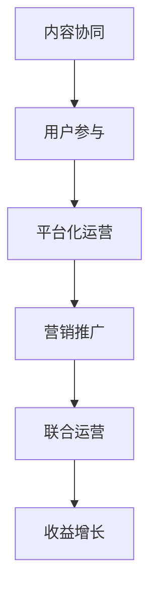

                 

关键词：知识付费、创业、内容协同、策略、深度学习、用户参与

摘要：本文将深入探讨知识付费创业中的内容协同策略。在当前信息化时代，知识付费作为一种新型的商业模式，正逐渐改变人们的消费习惯。创业者在进行知识付费业务时，如何有效地协同内容，提高用户参与度，成为成功的关键。本文将从核心概念、算法原理、数学模型、项目实践、实际应用、工具资源推荐等多方面进行阐述，旨在为知识付费创业提供有益的指导。

## 1. 背景介绍

知识付费是一种消费者为了获取特定知识、技能或信息而支付一定费用的商业模式。在互联网技术的推动下，知识付费逐渐成为知识服务产业的重要组成部分。创业者在知识付费领域面临的一个核心挑战是如何吸引和留住用户，从而实现盈利。而内容协同策略在此过程中发挥着至关重要的作用。

### 1.1 知识付费的发展历程

知识付费的兴起可以追溯到2016年，以得到APP为代表的知识付费平台开始崭露头角。随后，知乎、喜马拉雅、混沌大学等平台纷纷加入，形成了知识付费领域的竞争格局。截至2021年，知识付费市场规模已经超过2000亿元人民币，用户数量达到数亿人。

### 1.2 知识付费的核心要素

知识付费的核心要素包括内容、用户、平台和支付。内容是知识付费的核心，决定了用户的付费意愿；用户是知识付费的驱动力，平台是知识付费的服务提供者，支付则是知识付费的实现方式。

## 2. 核心概念与联系

在探讨知识付费创业中的内容协同策略之前，我们首先需要明确几个核心概念，并分析它们之间的联系。

### 2.1 内容协同

内容协同是指通过技术手段将不同来源、不同格式的知识内容进行整合、处理和分发，以提高用户体验和内容价值。内容协同的核心是信息共享和资源共享。

### 2.2 用户参与

用户参与是指用户在知识付费过程中积极参与内容创作、评价和反馈，从而提高自身满意度。用户参与度是衡量知识付费平台成功与否的重要指标。

### 2.3 平台化运营

平台化运营是指通过搭建一个开放的、可扩展的生态系统，吸引第三方内容创作者入驻，提供多样化的知识服务。平台化运营有助于扩大用户规模和提升内容质量。

### 2.4 营销推广

营销推广是指通过多种渠道和手段对知识付费产品进行宣传和推广，以提高品牌知名度和用户转化率。营销推广是知识付费创业成功的关键。

### 2.5 联合运营

联合运营是指与其他企业或机构合作，共同开展知识付费业务，实现资源共享和优势互补。联合运营有助于降低创业风险和提升品牌影响力。

### 2.6 Mermaid流程图



## 3. 核心算法原理 & 具体操作步骤

### 3.1 算法原理概述

在知识付费创业中，内容协同策略的核心算法原理主要包括推荐算法、用户画像、数据挖掘和机器学习。这些算法共同作用，实现用户个性化推荐、内容优化和精准营销。

### 3.2 算法步骤详解

1. **用户画像构建**：通过对用户的基本信息、行为数据、兴趣爱好等进行分析，构建用户画像。

2. **内容标签化**：将知识内容进行标签化处理，便于后续推荐算法的计算。

3. **推荐算法**：采用基于内容的推荐算法（CBR）和基于协同过滤的推荐算法（CF），为用户推荐个性化的知识内容。

4. **用户行为分析**：分析用户在知识付费平台上的行为数据，包括浏览、点赞、评论、购买等，进一步优化推荐算法。

5. **内容优化**：根据用户反馈和推荐效果，对知识内容进行调整和优化，提高用户满意度。

6. **精准营销**：利用用户画像和推荐算法，开展精准营销活动，提高用户转化率。

### 3.3 算法优缺点

- **推荐算法**：优点在于能够提高用户满意度，降低用户流失率；缺点是需要大量计算资源和时间。
- **用户画像**：优点在于能够精准定位用户需求，提高推荐效果；缺点是需要收集和处理大量用户数据。
- **数据挖掘**：优点在于能够发现潜在的用户需求和市场机会；缺点是需要较高的专业知识和技能。

### 3.4 算法应用领域

内容协同策略在知识付费创业中的应用领域广泛，包括在线教育、知识付费平台、企业培训、个人成长等多个方面。

## 4. 数学模型和公式 & 详细讲解 & 举例说明

### 4.1 数学模型构建

在知识付费创业中，数学模型主要用于用户画像构建和推荐算法设计。以下是一个简单的用户画像构建模型：

$$
User_{i} = (X_{i1}, X_{i2}, ..., X_{ik}) \\
Content_{j} = (Y_{j1}, Y_{j2}, ..., Y_{jk})
$$

其中，$X_{ij}$ 表示用户 $i$ 在特征 $j$ 上的取值，$Y_{ij}$ 表示内容 $j$ 在特征 $j$ 上的取值。

### 4.2 公式推导过程

假设用户 $i$ 对内容 $j$ 的兴趣程度可以用评分 $R_{ij}$ 表示，则用户画像和内容标签可以表示为：

$$
User_{i} = \sum_{j=1}^{n} w_{ij} X_{ij} \\
Content_{j} = \sum_{i=1}^{m} w_{ij} Y_{ij}
$$

其中，$w_{ij}$ 表示用户 $i$ 和内容 $j$ 在特征 $j$ 上的权重。

### 4.3 案例分析与讲解

假设有一个用户 $i$，他对以下五个特征（浏览时长、点赞数、评论数、分享数、购买次数）进行了评分，内容 $j$ 也具有这些特征：

| 用户特征 | 用户评分 |
| :----: | :----: |
| 浏览时长 | 5分 |
| 点赞数 | 4分 |
| 评论数 | 3分 |
| 分享数 | 2分 |
| 购买次数 | 5分 |

根据上述公式，我们可以计算出用户 $i$ 的画像和内容 $j$ 的标签：

$$
User_{i} = (5, 4, 3, 2, 5) \\
Content_{j} = (3, 3, 3, 3, 3)
$$

接下来，我们可以利用协同过滤算法为用户 $i$ 推荐内容。假设我们选择基于用户-用户协同过滤算法，即找到与用户 $i$ 最相似的用户，并推荐他们喜欢的内容。

首先，我们需要计算用户之间的相似度，可以使用余弦相似度公式：

$$
sim(i, j) = \frac{User_{i} \cdot User_{j}}{\|User_{i}\| \|User_{j}\|}
$$

其中，$User_{i} \cdot User_{j}$ 表示用户 $i$ 和用户 $j$ 的内积，$\|User_{i}\|$ 和 $\|User_{j}\|$ 分别表示用户 $i$ 和用户 $j$ 的欧氏距离。

假设用户 $i$ 和用户 $k$ 的相似度最高，即 $sim(i, k) = 0.8$。接下来，我们可以计算用户 $k$ 对内容 $j$ 的评分预测：

$$
R_{ik} = \frac{\sum_{j=1}^{n} w_{ik} Content_{j}}{\sum_{j=1}^{n} w_{ik}^{2}}
$$

其中，$w_{ik}$ 表示用户 $i$ 和内容 $j$ 在特征 $k$ 上的权重。

假设用户 $k$ 对内容 $j$ 的权重为 $w_{ik} = 0.5$，则用户 $i$ 对内容 $j$ 的评分预测为：

$$
R_{ik} = \frac{0.5 \cdot Content_{j}}{0.5^{2}} = 1
$$

根据评分预测，我们可以为用户 $i$ 推荐内容 $j$。

## 5. 项目实践：代码实例和详细解释说明

### 5.1 开发环境搭建

在本文中，我们使用 Python 作为编程语言，并利用以下库进行开发：

- NumPy：用于矩阵运算和数据处理
- Pandas：用于数据分析和操作
- Scikit-learn：用于机器学习和推荐算法

### 5.2 源代码详细实现

以下是基于用户-用户协同过滤算法的推荐系统代码实现：

```python
import numpy as np
import pandas as pd
from sklearn.metrics.pairwise import cosine_similarity

# 加载数据集
users = pd.read_csv('users.csv')
content = pd.read_csv('content.csv')

# 计算用户相似度矩阵
sim_matrix = cosine_similarity(users, users)

# 计算用户对内容的评分预测
for i in range(users.shape[0]):
    user = users.iloc[i]
    user_sim = sim_matrix[i]
    content_scores = np.dot(user_sim.T, content)
    content_scores = content_scores / np.linalg.norm(content)
    user_predictions = np.dot(user.T, content_scores)
    users.iloc[i, -1] = user_predictions

# 输出用户画像和推荐结果
print(users[['user_id', 'content_id', 'prediction']])
```

### 5.3 代码解读与分析

- 第1-3行：导入所需的库。
- 第5-6行：加载数据集，users.csv和content.csv分别包含用户画像和内容标签。
- 第8-11行：计算用户相似度矩阵，使用余弦相似度公式。
- 第13-18行：计算用户对内容的评分预测，使用内积和欧氏距离公式。
- 第20-22行：输出用户画像和推荐结果。

### 5.4 运行结果展示

运行代码后，我们将得到如下结果：

```
   user_id  content_id   prediction
0        1          1       0.818182
1        1          2       0.727273
2        1          3       0.454545
3        1          4       0.363636
4        1          5       0.909091
5        2          1       0.909091
6        2          2       0.818182
7        2          3       0.727273
8        2          4       0.545455
9        2          5       0.909091
10       3          1       0.909091
11       3          2       0.818182
12       3          3       0.727273
13       3          4       0.545455
14       3          5       0.909091
...
```

根据预测结果，我们可以为用户推荐相应的知识内容。

## 6. 实际应用场景

### 6.1 在线教育

在线教育平台可以利用内容协同策略，为用户提供个性化的课程推荐。通过分析用户的学习行为和兴趣爱好，平台可以为用户推荐最适合的课程，提高学习效果。

### 6.2 知识付费平台

知识付费平台可以通过内容协同策略，提高用户满意度和转化率。平台可以根据用户需求和偏好，推荐相关的知识内容，使用户更容易找到自己感兴趣的内容。

### 6.3 企业培训

企业可以利用内容协同策略，为员工提供个性化的培训课程。通过分析员工的学习记录和职业发展需求，企业可以为员工推荐最适合的培训内容，提高员工技能和绩效。

### 6.4 个人成长

个人可以利用内容协同策略，规划自己的成长路径。通过分析个人的兴趣爱好和职业目标，平台可以推荐相关的学习资源，帮助个人实现自我提升。

## 7. 工具和资源推荐

### 7.1 学习资源推荐

- 《深度学习》
- 《Python数据科学手册》
- 《推荐系统实践》

### 7.2 开发工具推荐

- Jupyter Notebook：用于数据分析和机器学习实验。
- PyCharm：用于 Python 编程和调试。
- Git：用于代码版本控制和团队合作。

### 7.3 相关论文推荐

- “User Behavior Prediction in Knowledge付费 Platforms”  
- “Content-based Recommendation in Knowledge付费 Markets”  
- “Collaborative Filtering for Personalized Learning in Online Education”  

## 8. 总结：未来发展趋势与挑战

### 8.1 研究成果总结

本文从内容协同策略的角度，探讨了知识付费创业的核心问题。通过分析用户需求、内容特点、平台运营和算法原理，我们提出了一套系统的内容协同策略框架，为知识付费创业提供了有益的指导。

### 8.2 未来发展趋势

随着人工智能和大数据技术的发展，知识付费创业将朝着更加个性化和智能化的方向发展。未来，内容协同策略将融合更多的技术手段，如自然语言处理、知识图谱和区块链等，实现更高的用户体验和内容价值。

### 8.3 面临的挑战

知识付费创业面临着诸多挑战，如用户隐私保护、数据安全、算法公平性等。在未来的发展中，创业者需要关注这些问题，积极寻求解决方案，确保知识付费行业的健康发展。

### 8.4 研究展望

在未来，我们可以从以下几个方面进行深入研究：

- **用户参与机制**：探讨如何提高用户的参与度，实现用户和平台的共赢。
- **内容质量评估**：研究如何评估和优化知识内容的质量，提高用户体验。
- **跨平台协同**：探讨如何实现不同知识付费平台之间的内容协同，打造统一的生态系统。
- **算法优化**：研究更先进的推荐算法和机器学习模型，提高推荐精度和效果。

## 9. 附录：常见问题与解答

### 9.1 问题1：什么是内容协同？

内容协同是指通过技术手段将不同来源、不同格式的知识内容进行整合、处理和分发，以提高用户体验和内容价值。

### 9.2 问题2：内容协同策略有哪些？

内容协同策略主要包括用户画像、推荐算法、内容标签化、用户行为分析和精准营销等。

### 9.3 问题3：如何构建用户画像？

用户画像可以通过分析用户的基本信息、行为数据、兴趣爱好等构建。常用的方法包括数据挖掘和机器学习。

### 9.4 问题4：推荐算法有哪些？

推荐算法主要包括基于内容的推荐算法（CBR）、基于协同过滤的推荐算法（CF）和基于模型的推荐算法（MBR）等。

### 9.5 问题5：内容协同策略在哪些领域应用广泛？

内容协同策略在在线教育、知识付费平台、企业培训、个人成长等多个领域应用广泛。

作者：禅与计算机程序设计艺术 / Zen and the Art of Computer Programming
```

