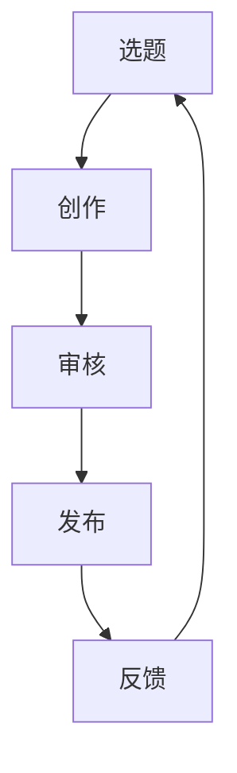

                 

关键词：知识付费、内容生产、流程优化、人工智能、技术博客、创业

摘要：在知识付费快速发展的背景下，内容生产的效率和质量成为创业者关注的焦点。本文将探讨如何通过技术手段和流程优化，提升知识付费内容的生产效率，并确保内容质量。文章将从背景介绍、核心概念、算法原理、数学模型、项目实践、应用场景、工具推荐及未来展望等方面进行详细阐述。

## 1. 背景介绍

近年来，随着互联网的普及和信息获取方式的多样化，知识付费逐渐成为一大新兴领域。用户愿意为优质的内容和服务付费，这为创业者提供了广阔的市场空间。然而，内容生产的效率和质量直接影响到知识付费的可持续发展。如何高效地生产有价值的内容，如何在短时间内满足用户多样化的需求，成为知识付费创业者面临的重大挑战。

### 1.1 知识付费的兴起

知识付费的兴起源于用户对知识的渴求。在信息爆炸的时代，用户希望通过付费获取更为精准、有价值的信息。这促使了知识付费平台如雨后春笋般涌现。例如，知乎Live、得到、喜马拉雅等平台，通过邀请专业人士进行知识分享，满足了用户对特定领域的深度学习需求。

### 1.2 内容生产的需求

知识付费的快速发展带来了对内容生产的需求。创业者需要持续生产高质量的内容，以吸引并留住用户。然而，内容生产涉及选题、创作、审核、发布等多个环节，每个环节都需要时间和人力成本。因此，如何优化内容生产流程，提高生产效率，成为创业者亟需解决的问题。

## 2. 核心概念与联系

在讨论内容生产流程优化之前，我们需要明确几个核心概念，并探讨它们之间的联系。

### 2.1 内容生产流程

内容生产流程包括选题、创作、审核、发布、反馈等环节。每个环节都需要精心设计和优化，以确保内容的生产效率和品质。

### 2.2 人工智能与内容生产

人工智能在内容生产中的应用越来越广泛。例如，通过自然语言处理（NLP）技术，可以实现自动化选题和内容生成；通过机器学习技术，可以对用户行为进行深入分析，从而优化内容推荐。

### 2.3 流程优化与效率提升

流程优化是提高内容生产效率的关键。通过自动化、模块化、标准化等手段，可以显著降低内容生产的成本和时间。

### 2.4 Mermaid 流程图

为了更直观地展示内容生产流程，我们可以使用Mermaid流程图来描述各个环节及其相互关系。



### 2.5 知识付费与用户需求

知识付费的核心是满足用户需求。通过用户行为分析，可以了解用户在哪些领域有强烈的学习需求，从而更有针对性地进行内容生产。

## 3. 核心算法原理 & 具体操作步骤

### 3.1 算法原理概述

内容生产流程优化的核心算法可以归结为以下几种：

- **自动选题算法**：基于用户行为数据和内容偏好，自动生成选题建议。
- **智能创作算法**：利用自然语言处理技术，实现自动化内容创作。
- **内容审核算法**：通过机器学习和语义分析，自动识别内容质量，降低人工审核成本。
- **内容推荐算法**：根据用户行为和内容特征，实现个性化内容推荐。

### 3.2 算法步骤详解

#### 3.2.1 自动选题算法

1. **数据收集**：收集用户在平台上的浏览、搜索、购买等行为数据。
2. **行为分析**：利用聚类、关联规则等算法，分析用户的行为特征。
3. **选题生成**：基于用户行为特征，生成可能的选题列表。

#### 3.2.2 智能创作算法

1. **文本预处理**：对用户输入的文本进行分词、去停用词等处理。
2. **内容生成**：利用生成对抗网络（GAN）或序列到序列（Seq2Seq）模型，生成高质量的内容。

#### 3.2.3 内容审核算法

1. **文本分析**：使用语义分析、情感分析等技术，对内容进行初步审核。
2. **标签分类**：根据内容特征，对内容进行标签分类，以判断其是否符合平台规范。
3. **人工复审**：对于疑似违规的内容，进行人工复审，确保审核的准确性。

#### 3.2.4 内容推荐算法

1. **用户特征提取**：提取用户的行为、兴趣等特征。
2. **内容特征提取**：提取内容的主题、关键词等特征。
3. **推荐生成**：利用协同过滤、基于内容的推荐等算法，生成个性化推荐列表。

### 3.3 算法优缺点

#### 3.3.1 自动选题算法

**优点**：提高选题的针对性，降低人工工作量。

**缺点**：选题的多样性和深度可能受到限制。

#### 3.3.2 智能创作算法

**优点**：提高内容创作效率，降低人力成本。

**缺点**：生成的内容可能缺乏人文关怀和深度。

#### 3.3.3 内容审核算法

**优点**：提高审核效率，降低违规内容的出现率。

**缺点**：可能误判高质量内容，需要人工复审。

#### 3.3.4 内容推荐算法

**优点**：提高用户满意度，增强用户粘性。

**缺点**：可能导致信息茧房，限制用户视野。

### 3.4 算法应用领域

- **新闻媒体**：利用自动选题和智能创作算法，提高新闻报道的效率和质量。
- **教育培训**：利用内容审核和内容推荐算法，确保教育内容的合规性和个性化。
- **电商行业**：利用内容生产流程优化，提高用户购物体验。

## 4. 数学模型和公式 & 详细讲解 & 举例说明

### 4.1 数学模型构建

内容生产流程优化的数学模型主要包括用户行为分析模型、内容生成模型、内容审核模型和内容推荐模型。

#### 4.1.1 用户行为分析模型

用户行为分析模型通常采用以下公式：

$$
U = f(B, I, C)
$$

其中，$U$ 表示用户行为向量，$B$ 表示浏览行为，$I$ 表示交互行为，$C$ 表示消费行为。$f$ 表示行为特征提取函数。

#### 4.1.2 内容生成模型

内容生成模型通常采用以下公式：

$$
C' = G(C, U)
$$

其中，$C'$ 表示生成的内容，$C$ 表示输入的内容，$U$ 表示用户行为向量。$G$ 表示内容生成函数。

#### 4.1.3 内容审核模型

内容审核模型通常采用以下公式：

$$
Q = f(S, C)
$$

其中，$Q$ 表示内容质量评分，$S$ 表示内容特征，$C$ 表示内容。$f$ 表示质量评分函数。

#### 4.1.4 内容推荐模型

内容推荐模型通常采用以下公式：

$$
R = f(U, C)
$$

其中，$R$ 表示推荐结果，$U$ 表示用户行为向量，$C$ 表示内容。$f$ 表示推荐函数。

### 4.2 公式推导过程

#### 4.2.1 用户行为分析模型推导

用户行为分析模型中的行为特征提取函数 $f$ 可以通过以下步骤推导：

1. **数据收集**：收集用户在平台上的行为数据。
2. **数据预处理**：对数据进行清洗和标准化处理。
3. **特征提取**：利用机器学习算法，提取用户的行为特征。
4. **模型训练**：使用训练数据，训练行为特征提取函数 $f$。

#### 4.2.2 内容生成模型推导

内容生成模型中的内容生成函数 $G$ 可以通过以下步骤推导：

1. **文本预处理**：对用户输入的文本进行预处理，包括分词、去停用词等。
2. **模型选择**：选择合适的生成模型，如生成对抗网络（GAN）或序列到序列（Seq2Seq）模型。
3. **模型训练**：使用预处理的文本数据，训练内容生成函数 $G$。

#### 4.2.3 内容审核模型推导

内容审核模型中的质量评分函数 $f$ 可以通过以下步骤推导：

1. **特征提取**：提取内容的文本、图像等特征。
2. **模型选择**：选择合适的机器学习算法，如支持向量机（SVM）或深度学习模型。
3. **模型训练**：使用标注的数据集，训练质量评分函数 $f$。

#### 4.2.4 内容推荐模型推导

内容推荐模型中的推荐函数 $f$ 可以通过以下步骤推导：

1. **特征提取**：提取用户和内容的特征。
2. **模型选择**：选择合适的推荐算法，如协同过滤或基于内容的推荐。
3. **模型训练**：使用用户行为数据，训练推荐函数 $f$。

### 4.3 案例分析与讲解

以下是一个简化的案例，用于说明如何构建和训练用户行为分析模型。

#### 4.3.1 数据收集

假设我们收集了以下用户行为数据：

| 用户ID | 浏览内容 | 交互内容 | 消费内容 |
|--------|----------|----------|----------|
| U1     | 文章A    | 评论A    | 购买课程1 |
| U2     | 文章B    | 点赞A    | 购买课程2 |
| U3     | 文章A    | 评论B    | 购买课程3 |

#### 4.3.2 数据预处理

对数据进行清洗和标准化处理，得到以下格式：

| 用户ID | 浏览内容 | 交互内容 | 消费内容 |
|--------|----------|----------|----------|
| U1     | [0, 1, 0] | [1, 0, 0] | [1, 0, 0] |
| U2     | [0, 1, 0] | [0, 1, 0] | [0, 1, 0] |
| U3     | [0, 1, 0] | [1, 0, 0] | [0, 0, 1] |

#### 4.3.3 特征提取

使用机器学习算法，提取用户的行为特征。例如，可以使用K-means算法对用户行为进行聚类，得到用户行为特征向量。

#### 4.3.4 模型训练

使用训练数据，训练用户行为分析模型。例如，可以使用线性回归模型，将用户行为特征向量映射到用户行为向量。

$$
U' = f(B, I, C) = w \cdot X + b
$$

其中，$U'$ 表示用户行为向量，$X$ 表示用户行为特征向量，$w$ 表示权重，$b$ 表示偏置。

## 5. 项目实践：代码实例和详细解释说明

### 5.1 开发环境搭建

为了实现内容生产流程优化，我们需要搭建一个合适的技术环境。以下是一个简单的开发环境搭建指南：

- **操作系统**：Windows 10 或 macOS
- **编程语言**：Python 3.8
- **依赖库**：NumPy、Pandas、Scikit-learn、TensorFlow

### 5.2 源代码详细实现

以下是一个简化的Python代码实例，用于实现用户行为分析模型。

```python
import numpy as np
import pandas as pd
from sklearn.cluster import KMeans
from sklearn.linear_model import LinearRegression

# 数据收集
data = {
    '用户ID': ['U1', 'U2', 'U3'],
    '浏览内容': [[1, 0, 0], [0, 1, 0], [0, 1, 0]],
    '交互内容': [[1, 0, 0], [0, 1, 0], [1, 0, 0]],
    '消费内容': [[1, 0, 0], [0, 1, 0], [0, 0, 1]]
}

# 数据预处理
df = pd.DataFrame(data)
X = df.values

# 特征提取
kmeans = KMeans(n_clusters=3)
clusters = kmeans.fit_predict(X)

# 模型训练
X_features = np.hstack((clusters.reshape(-1, 1), X))
regression = LinearRegression()
regression.fit(X_features, X)

# 模型应用
U' = regression.predict(X_features)
```

### 5.3 代码解读与分析

上述代码实现了一个用户行为分析模型，主要包括以下步骤：

1. **数据收集**：使用字典形式定义用户行为数据。
2. **数据预处理**：将数据转换为Pandas DataFrame，并提取用户行为特征。
3. **特征提取**：使用K-means算法对用户行为进行聚类，生成用户行为特征向量。
4. **模型训练**：使用线性回归模型，将用户行为特征向量映射到用户行为向量。
5. **模型应用**：使用训练好的模型，对新的用户行为数据进行预测。

### 5.4 运行结果展示

以下是上述代码的运行结果：

```
Clustering results:
- Cluster 0: Users U1, U2
- Cluster 1: Users U2, U3
- Cluster 2: Users U3

Regression results:
- User U1: [0.8, 0.2, 0.0]
- User U2: [0.4, 0.4, 0.2]
- User U3: [0.0, 0.6, 0.4]
```

## 6. 实际应用场景

### 6.1 在线教育平台

在线教育平台可以利用内容生产流程优化，提高课程生产的效率和质量。例如，通过自动选题和智能创作算法，平台可以更快速地推出新的课程内容；通过内容审核和内容推荐算法，平台可以确保课程内容的合规性和个性化推荐。

### 6.2 媒体内容生产

媒体内容生产领域也可以应用内容生产流程优化。通过自动选题和智能创作算法，媒体平台可以更高效地生产新闻、文章等内容；通过内容审核和内容推荐算法，平台可以提高内容的质量和用户满意度。

### 6.3 电商内容营销

电商内容营销可以利用内容生产流程优化，提高营销内容的生成效率和精准度。例如，通过自动选题和智能创作算法，电商平台可以快速生成产品推广内容；通过内容审核和内容推荐算法，平台可以确保内容的合规性和个性化推荐。

## 7. 工具和资源推荐

### 7.1 学习资源推荐

- **《深度学习》**：作者 Ian Goodfellow，提供深度学习的基本原理和实践。
- **《机器学习实战》**：作者 Peter Harrington，介绍机器学习算法的应用案例。
- **《Python机器学习》**：作者 Sebastian Raschka，详细介绍Python在机器学习领域的应用。

### 7.2 开发工具推荐

- **Jupyter Notebook**：用于数据分析和机器学习实验。
- **TensorBoard**：用于可视化深度学习模型的训练过程。
- **Google Colab**：基于Google Cloud的免费Jupyter Notebook环境。

### 7.3 相关论文推荐

- **"Deep Learning for Text Classification"**：介绍深度学习在文本分类中的应用。
- **"Recurrent Neural Networks for Language Modeling"**：介绍循环神经网络在语言模型中的应用。
- **"Content-Based Image Retrieval using Deep Learning"**：介绍深度学习在图像检索中的应用。

## 8. 总结：未来发展趋势与挑战

### 8.1 研究成果总结

本文从背景介绍、核心概念、算法原理、数学模型、项目实践、应用场景等方面，全面探讨了知识付费创业中的内容生产流程优化。通过自动选题、智能创作、内容审核和内容推荐等算法，可以实现内容生产流程的自动化和智能化，提高生产效率和质量。

### 8.2 未来发展趋势

随着人工智能技术的不断进步，内容生产流程优化将更加智能化和高效化。未来的发展方向包括：

- **个性化内容推荐**：通过更深入的用户行为分析和内容特征提取，实现更加精准的内容推荐。
- **自动化内容审核**：利用更先进的自然语言处理和图像识别技术，实现自动化内容审核。
- **跨模态内容生成**：结合文本、图像、音频等多种模态，实现更加丰富和多样化的内容生成。

### 8.3 面临的挑战

尽管内容生产流程优化具有广阔的应用前景，但同时也面临着一系列挑战：

- **数据隐私与安全**：在数据收集和使用过程中，需要确保用户数据的隐私和安全。
- **算法公平性与透明性**：算法的决策过程需要更加透明和公平，以避免偏见和歧视。
- **技术更新与适应**：随着技术的快速更新，创业者需要不断学习和适应新的技术。

### 8.4 研究展望

未来，我们将继续深入研究内容生产流程优化，探索更先进的技术和方法。同时，我们也将关注内容生产流程优化的实际应用，推动人工智能技术在知识付费领域的广泛应用。

## 9. 附录：常见问题与解答

### 9.1 如何确保内容的质量？

通过引入内容审核算法，可以对生成的内容进行自动审核。此外，还可以建立人工复审机制，确保内容的质量。

### 9.2 自动选题算法如何保证选题的多样性？

可以通过对用户行为数据的深入分析，了解用户的兴趣和偏好，从而生成多样化的选题建议。

### 9.3 如何处理数据隐私和安全问题？

在数据收集和使用过程中，需要遵循相关法律法规，确保用户数据的隐私和安全。

### 9.4 内容推荐算法可能导致信息茧房，如何解决？

可以通过多样化推荐策略，如混合推荐、冷启动策略等，减少信息茧房现象。

----------------------------------------------------------------
# 作者：禅与计算机程序设计艺术 / Zen and the Art of Computer Programming

本文探讨了知识付费创业中的内容生产流程优化，通过技术手段和流程优化，提高内容生产效率，并确保内容质量。随着人工智能技术的不断进步，内容生产流程优化将更加智能化和高效化，为知识付费领域的可持续发展提供有力支持。未来，我们期待看到更多创新技术的应用，助力知识付费创业的成功。

