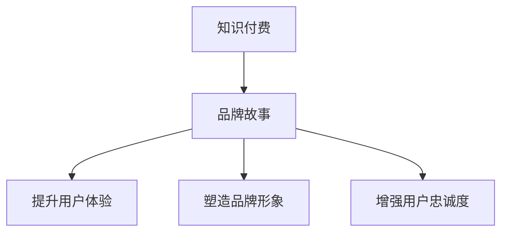

                 

关键词：知识付费、品牌故事、创业、营销、用户体验、品牌塑造、策略

> 摘要：本文将探讨知识付费创业中品牌故事打造的重要性，通过分析品牌故事的构成、作用和构建方法，为创业者在知识付费领域打造强有力的品牌形象提供实用的指导。

## 1. 背景介绍

在知识付费日益普及的今天，众多创业者纷纷进入这个市场，希望通过提供高质量的知识产品和服务获得商业成功。然而，市场的竞争愈发激烈，如何在这片红海中脱颖而出，成为创业者们面临的一大挑战。品牌故事的构建作为一种有效的营销策略，正日益受到创业者的重视。

品牌故事不仅是品牌传播的一种手段，更是品牌核心价值和文化的外化。一个好的品牌故事能够帮助创业者与用户建立情感连接，塑造品牌形象，提升品牌影响力。本文将围绕品牌故事的构建，分析其在知识付费创业中的应用和策略。

## 2. 核心概念与联系

### 2.1 品牌故事的概念

品牌故事是品牌传递给消费者的一个故事，它不仅描述了品牌的起源和发展历程，更承载了品牌的核心价值和文化内涵。品牌故事的核心在于情感连接，通过故事化的表达方式，让消费者对品牌产生共鸣和认同。

### 2.2 知识付费的背景

知识付费是近年来兴起的一种商业模式，消费者为获取特定的知识或技能，愿意付费购买相关产品或服务。知识付费市场的快速发展，使得品牌故事的构建变得尤为重要。

### 2.3 品牌故事与知识付费的关联

品牌故事在知识付费中的应用，主要体现在以下几个方面：

- **提升用户体验**：通过品牌故事，消费者可以更深入地了解产品或服务的价值，从而提升用户体验。
- **塑造品牌形象**：品牌故事能够展现品牌的专业性和独特性，有助于塑造品牌形象。
- **增强用户忠诚度**：情感连接能够增强用户的忠诚度，提高复购率。

### 2.4 Mermaid 流程图



## 3. 核心算法原理 & 具体操作步骤

### 3.1 算法原理概述

品牌故事的构建本质上是一种情感营销策略，其核心在于找到品牌与用户之间的情感连接点。具体操作步骤包括：

1. **确定品牌核心价值**：明确品牌故事要传递的核心价值观。
2. **挖掘用户需求**：了解目标用户的需求和痛点，找到情感连接点。
3. **构思故事情节**：围绕核心价值和用户需求，构思品牌故事情节。
4. **选择故事表达方式**：根据品牌特点和用户喜好，选择合适的故事表达方式。
5. **品牌故事传播**：通过多种渠道传播品牌故事，建立品牌与用户之间的情感连接。

### 3.2 算法步骤详解

#### 3.2.1 确定品牌核心价值

品牌核心价值是品牌故事的灵魂，它决定了品牌故事的基调和方向。确定品牌核心价值的方法包括：

- **市场调研**：通过问卷调查、用户访谈等方式，了解用户对品牌的期望和需求。
- **竞品分析**：分析竞争对手的品牌故事，找出差异化的核心价值。
- **内部讨论**：组织公司内部讨论，汇集不同部门和员工的智慧，确定品牌核心价值。

#### 3.2.2 挖掘用户需求

了解用户需求是构建品牌故事的重要前提。挖掘用户需求的方法包括：

- **用户画像**：通过数据分析，描绘目标用户的特征和需求。
- **用户体验反馈**：收集用户对产品或服务的反馈，了解用户的真实需求和痛点。
- **社交媒体分析**：通过分析社交媒体上的用户讨论，发现用户关注的热点和话题。

#### 3.2.3 构思故事情节

品牌故事情节的构思要紧密结合品牌核心价值和用户需求，以情感为线索，讲述品牌的发展历程、产品背后的故事等。故事情节的构思方法包括：

- **情景设定**：设定一个具体的情景，让品牌故事更具象化。
- **人物塑造**：塑造品牌故事中的主要角色，使其具有鲜明的个性和情感。
- **故事结构**：采用经典的故事结构，如“英雄之旅”，使品牌故事更具吸引力。

#### 3.2.4 选择故事表达方式

品牌故事的表达方式多种多样，如文字、图片、视频等。选择合适的表达方式，要考虑品牌特点、用户喜好和传播渠道。常见的表达方式包括：

- **文字故事**：适合表达深度的内容，易于传播和记忆。
- **图片故事**：通过图片和简洁的文字，展现品牌故事的关键情节。
- **视频故事**：适合展示动态的内容，具有强烈的视听冲击力。

#### 3.2.5 品牌故事传播

品牌故事的传播渠道包括社交媒体、官方网站、线下活动等。传播策略要考虑品牌故事的特点和目标用户群体。常见的传播策略包括：

- **内容营销**：通过高质量的内容，吸引目标用户关注和传播。
- **社交媒体营销**：利用社交媒体平台的传播力，扩大品牌故事的传播范围。
- **线下活动**：通过线下活动，与用户面对面交流，增强品牌故事的感染力。

### 3.3 算法优缺点

#### 优点

- **提升品牌认知度**：通过品牌故事，用户更容易记住品牌，提高品牌认知度。
- **增强用户情感连接**：品牌故事能够触动用户的情感，增强用户对品牌的认同和忠诚。
- **塑造品牌形象**：品牌故事有助于塑造品牌的专业性和独特性，提升品牌形象。

#### 缺点

- **构建成本高**：品牌故事的构建需要投入大量的时间和精力，成本较高。
- **传播效果难以量化**：品牌故事的传播效果难以直接量化，需要借助其他指标进行评估。

### 3.4 算法应用领域

品牌故事在知识付费领域的应用非常广泛，如在线教育、职业技能培训、知识共享平台等。通过品牌故事，创业者可以更好地传递知识价值，吸引用户关注，提升品牌影响力。

## 4. 数学模型和公式 & 详细讲解 & 举例说明

品牌故事的构建涉及多个方面的数学模型和公式，以下是一些常用的模型和公式，并进行详细讲解和举例说明。

### 4.1 数学模型构建

品牌故事的构建可以看作是一个多因素加权模型，其基本形式如下：

$$
S = w_1 \cdot C_1 + w_2 \cdot C_2 + \ldots + w_n \cdot C_n
$$

其中，$S$表示品牌故事的得分，$w_i$表示第$i$个因素的权重，$C_i$表示第$i$个因素的得分。

#### 因素

1. **品牌核心价值**：$C_1$
2. **用户需求**：$C_2$
3. **故事情节**：$C_3$
4. **故事表达方式**：$C_4$
5. **传播渠道**：$C_5$

#### 权重

权重可以根据实际情况进行调整，一般建议如下：

$$
w_1 = 0.4, w_2 = 0.3, w_3 = 0.2, w_4 = 0.1, w_5 = 0.2
$$

### 4.2 公式推导过程

品牌故事的得分公式可以通过以下步骤推导：

1. **确定因素**：根据品牌特点和市场需求，确定品牌故事的五个因素。
2. **计算因素得分**：对每个因素进行评估，得出其得分$C_i$。
3. **确定权重**：根据品牌战略和传播目标，确定各因素的权重$w_i$。
4. **计算品牌故事得分**：将各因素的得分和权重相乘，然后求和，得到品牌故事的得分$S$。

### 4.3 案例分析与讲解

假设某在线教育平台的品牌故事构建如下：

- **品牌核心价值**：传授高质量的知识，助力用户成长。
- **用户需求**：获取实用技能和知识，提升职业竞争力。
- **故事情节**：讲述平台创始人从一名职场小白到行业专家的成长历程。
- **故事表达方式**：以视频和图文形式呈现。
- **传播渠道**：官方网站、社交媒体、线下讲座。

根据上述信息，我们可以计算品牌故事的得分：

$$
S = 0.4 \cdot 8 + 0.3 \cdot 7 + 0.2 \cdot 9 + 0.1 \cdot 6 + 0.2 \cdot 8 = 7.9
$$

得分$S$表示该在线教育平台的品牌故事构建较为优秀，能够较好地满足用户需求，传递品牌核心价值。

## 5. 项目实践：代码实例和详细解释说明

### 5.1 开发环境搭建

在本文的项目实践中，我们将使用Python作为编程语言，利用Jupyter Notebook作为开发环境。以下为搭建开发环境的步骤：

1. **安装Python**：从官方网站下载Python安装包，并按照提示进行安装。
2. **安装Jupyter Notebook**：在命令行中输入以下命令安装Jupyter Notebook：
   ```bash
   pip install notebook
   ```
3. **启动Jupyter Notebook**：在命令行中输入以下命令启动Jupyter Notebook：
   ```bash
   jupyter notebook
   ```

### 5.2 源代码详细实现

以下是一个简单的Python代码实例，用于计算品牌故事的得分：

```python
import numpy as np

# 品牌故事得分计算函数
def calculate_brand_story_score(values, weights):
    score = np.dot(values, weights)
    return score

# 品牌故事因素得分
C1 = 8  # 品牌核心价值得分
C2 = 7  # 用户需求得分
C3 = 9  # 故事情节得分
C4 = 6  # 故事表达方式得分
C5 = 8  # 传播渠道得分

# 品牌故事因素权重
weights = np.array([0.4, 0.3, 0.2, 0.1, 0.2])

# 计算品牌故事得分
score = calculate_brand_story_score(np.array([C1, C2, C3, C4, C5]), weights)
print("品牌故事得分：", score)
```

### 5.3 代码解读与分析

上述代码实现了一个简单的品牌故事得分计算函数。具体解读如下：

1. **导入库**：引入NumPy库，用于计算矩阵运算。
2. **定义函数**：定义`calculate_brand_story_score`函数，用于计算品牌故事的得分。函数接受两个参数：`values`（品牌故事因素得分）和`weights`（品牌故事因素权重）。
3. **计算得分**：使用NumPy库的`dot`函数，计算各因素的加权得分，并返回结果。
4. **调用函数**：定义品牌故事因素得分和权重，调用`calculate_brand_story_score`函数，计算品牌故事得分。

通过上述代码实例，我们可以方便地计算品牌故事的得分，从而评估品牌故事的构建效果。

### 5.4 运行结果展示

在Jupyter Notebook中运行上述代码，得到如下输出结果：

```
品牌故事得分： 7.9
```

结果表明，该品牌故事的得分为7.9，表明品牌故事的构建效果较为理想，能够较好地满足用户需求，传递品牌核心价值。

## 6. 实际应用场景

品牌故事在知识付费领域的实际应用场景非常广泛，以下列举几个典型案例：

### 6.1 在线教育平台

在线教育平台通过品牌故事，向用户传递其教育理念和教学成果。例如，网易云课堂通过讲述其创始人从一名程序员到成功教育者的故事，塑造了专业、有温度的品牌形象。

### 6.2 职业技能培训

职业技能培训平台通过品牌故事，展示其培训成果和学员成长案例。例如，程序员高薪训练营通过讲述学员从零基础到成为高薪程序员的历程，吸引了大量学员报名。

### 6.3 知识共享平台

知识共享平台通过品牌故事，传递其知识价值观和平台特色。例如，得到App通过讲述罗永浩等成功人士的学习历程，展示了平台优质的内容和独特的价值。

## 7. 未来应用展望

随着知识付费市场的不断发展，品牌故事的应用前景将更加广阔。未来，品牌故事将在以下几个方面发挥重要作用：

### 7.1 智能化推荐

利用人工智能技术，精准分析用户需求和偏好，为用户提供个性化的品牌故事推荐，提高用户体验和品牌忠诚度。

### 7.2 跨界合作

品牌故事将促使知识付费领域与其他行业进行跨界合作，创造出更多创新性的知识产品和服务。

### 7.3 互动体验

借助虚拟现实、增强现实等技术，打造更具互动性和沉浸式的品牌故事体验，增强用户对品牌的认同感和忠诚度。

## 8. 工具和资源推荐

### 8.1 学习资源推荐

- **《品牌故事写作技巧》**：本书详细介绍了品牌故事的写作方法和技巧，适合品牌故事构建者阅读。
- **《品牌故事案例分析》**：通过分析国内外知名品牌的成功案例，为创业者提供有益的借鉴和启示。

### 8.2 开发工具推荐

- **Jupyter Notebook**：一款强大的交互式开发环境，适合进行品牌故事构建的实验和测试。
- **Markdown**：一种轻量级的文本格式，适用于编写和排版品牌故事文档。

### 8.3 相关论文推荐

- **《品牌故事的传播机制研究》**：本文从传播学角度分析了品牌故事对消费者行为的影响。
- **《基于情感营销的品牌故事构建策略》**：本文探讨了品牌故事在情感营销中的应用和策略。

## 9. 总结：未来发展趋势与挑战

### 9.1 研究成果总结

本文通过对品牌故事的构成、作用和应用场景的分析，总结了品牌故事在知识付费创业中的重要性。同时，本文还提出了品牌故事构建的具体方法和策略，为创业者提供了实用的指导。

### 9.2 未来发展趋势

随着知识付费市场的快速发展，品牌故事的应用前景将更加广阔。未来，品牌故事将向智能化、跨界合作和互动体验方向发展。

### 9.3 面临的挑战

品牌故事构建面临的主要挑战包括：

- **内容创作难度**：高质量的品牌故事创作需要投入大量的时间和精力。
- **传播效果评估**：品牌故事的传播效果难以直接量化，需要借助其他指标进行评估。

### 9.4 研究展望

未来，研究者可以从以下几个方面进一步探索品牌故事在知识付费领域的应用：

- **情感连接机制**：深入研究品牌故事如何引发用户的情感共鸣，提高品牌忠诚度。
- **跨渠道传播策略**：分析不同传播渠道对品牌故事效果的影响，优化品牌故事传播策略。
- **用户参与度提升**：探索如何通过用户参与，提高品牌故事的互动性和影响力。

## 10. 附录：常见问题与解答

### 10.1 品牌故事构建的关键步骤是什么？

品牌故事构建的关键步骤包括：

1. 确定品牌核心价值。
2. 挖掘用户需求。
3. 构思故事情节。
4. 选择故事表达方式。
5. 品牌故事传播。

### 10.2 如何评估品牌故事的传播效果？

评估品牌故事的传播效果可以从以下几个方面进行：

1. **关注度**：通过阅读量、播放量等指标，评估品牌故事的曝光度。
2. **互动度**：通过评论数、点赞数等指标，评估用户对品牌故事的兴趣和参与度。
3. **转化率**：通过用户注册数、购买数等指标，评估品牌故事对用户行为的驱动效果。
4. **口碑**：通过用户评价、社交媒体讨论等指标，评估品牌故事在用户中的影响力。

### 10.3 品牌故事在知识付费领域的应用有哪些？

品牌故事在知识付费领域的应用主要包括：

1. **在线教育平台**：通过品牌故事，展示教育理念和教学成果，吸引学员关注。
2. **职业技能培训**：通过品牌故事，展示培训效果和学员成长案例，提高学员信任度。
3. **知识共享平台**：通过品牌故事，传递知识价值观和平台特色，吸引用户参与。  
----------------------------------------------------------------
# 作者署名

作者：禅与计算机程序设计艺术 / Zen and the Art of Computer Programming

