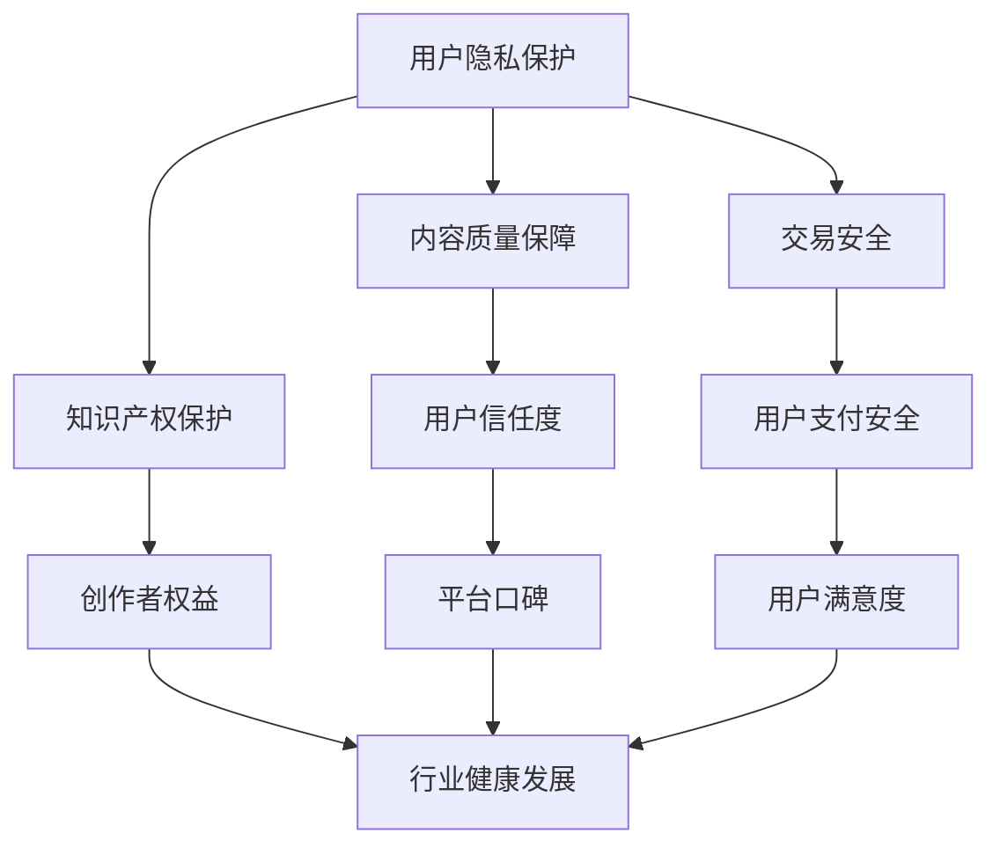

                 

### 1. 背景介绍

在知识付费领域，用户权益的保护已经成为一个日益重要的议题。随着互联网技术的飞速发展，知识付费行业呈现出爆发式增长，越来越多的平台和创业者加入其中，为广大用户提供各类优质内容。然而，与此同时，用户权益保护问题也日益凸显。

一方面，知识付费平台的迅速扩张带来了用户数量的急剧增加，平台运营者需要在短时间内处理大量的用户数据和信息。这给用户权益保护带来了一定的挑战，尤其是在用户隐私保护、内容侵权、假冒伪劣等方面。另一方面，一些创业者为了追求经济利益，可能会忽视用户权益，甚至侵犯用户合法权益，这无疑损害了行业的健康发展。

用户权益保护问题涉及多个方面，包括用户隐私保护、内容质量保障、知识产权保护、交易安全等。本文将围绕这些核心问题，探讨知识付费创业中的用户权益保护策略，旨在为创业者提供一些有益的参考。

### 2. 核心概念与联系

在探讨用户权益保护之前，我们有必要先明确一些核心概念和它们之间的联系。

#### 2.1 用户隐私保护

用户隐私保护是指对用户个人信息的安全保护，防止未经授权的第三方获取、使用、泄露用户信息。在知识付费领域，用户隐私保护尤为重要，因为用户在平台上的活动会涉及大量的个人信息，如姓名、联系方式、支付信息等。

#### 2.2 内容质量保障

内容质量保障是指确保平台提供的内容具有高质量、准确性、完整性。在知识付费领域，内容质量直接关系到用户的使用体验和信任度，因此保障内容质量至关重要。

#### 2.3 知识产权保护

知识产权保护是指对原创内容进行法律保护，防止他人未经授权使用、传播、修改等。在知识付费领域，原创内容的价值极高，保护知识产权对于维护创作者权益和促进行业健康发展具有重要意义。

#### 2.4 交易安全

交易安全是指保障用户在进行交易过程中的信息安全，防止黑客攻击、诈骗等行为。在知识付费领域，用户需要进行在线支付，因此交易安全尤为关键。

下面是一个Mermaid流程图，展示了上述核心概念之间的联系：



### 3. 核心算法原理 & 具体操作步骤

#### 3.1 算法原理概述

用户权益保护的核心算法主要涉及以下几个方面：

1. **用户隐私保护算法**：采用加密技术对用户数据进行加密存储和传输，确保用户信息的安全。

2. **内容质量检测算法**：通过自然语言处理、机器学习等技术对内容进行检测，识别并过滤低质量、不合适的内容。

3. **知识产权保护算法**：利用区块链技术对原创内容进行登记和存证，确保内容的唯一性和可追溯性。

4. **交易安全检测算法**：采用防欺诈技术对交易过程进行监控，识别并阻止异常交易行为。

#### 3.2 算法步骤详解

1. **用户隐私保护算法**

   - **数据加密存储**：对用户注册信息、浏览记录、交易记录等敏感数据进行加密存储，确保数据安全。
   - **数据加密传输**：采用HTTPS协议对用户数据进行加密传输，防止数据在传输过程中被窃取。
   - **访问控制**：对用户数据的访问权限进行严格控制，只有经过授权的用户才能访问相应数据。

2. **内容质量检测算法**

   - **内容分类**：对平台上的内容进行分类，如教育、娱乐、科技等。
   - **文本分析**：利用自然语言处理技术对文本内容进行分析，识别文本质量、语言风格、情感倾向等。
   - **内容过滤**：根据分析结果，对低质量、不合适的内容进行过滤，确保内容质量。

3. **知识产权保护算法**

   - **内容登记**：利用区块链技术对原创内容进行登记，确保内容的唯一性和可追溯性。
   - **内容存证**：对原创内容进行存证，确保创作者权益。
   - **内容监控**：对平台上的内容进行实时监控，识别并处理侵权行为。

4. **交易安全检测算法**

   - **交易监控**：对用户交易过程进行实时监控，识别异常交易行为。
   - **防欺诈检测**：利用机器学习技术对用户行为进行分析，识别并阻止欺诈行为。
   - **用户风险评估**：对用户进行风险评估，对高风险用户进行重点关注。

#### 3.3 算法优缺点

1. **用户隐私保护算法**

   - 优点：能有效保护用户隐私，防止信息泄露。
   - 缺点：加密技术可能影响数据读取速度，增加系统开销。

2. **内容质量检测算法**

   - 优点：能有效提高内容质量，提升用户体验。
   - 缺点：需要对文本进行深度分析，计算复杂度较高。

3. **知识产权保护算法**

   - 优点：能有效保护创作者权益，促进原创内容创作。
   - 缺点：区块链技术尚不成熟，存在技术风险。

4. **交易安全检测算法**

   - 优点：能有效保障交易安全，防止欺诈行为。
   - 缺点：需要对用户行为进行实时监控，可能侵犯用户隐私。

#### 3.4 算法应用领域

1. **用户隐私保护算法**：广泛应用于各类在线平台，如社交媒体、电商平台、知识付费平台等。

2. **内容质量检测算法**：广泛应用于内容创作平台，如自媒体、新闻媒体、教育平台等。

3. **知识产权保护算法**：广泛应用于原创内容平台，如音乐平台、视频平台、知识付费平台等。

4. **交易安全检测算法**：广泛应用于在线支付、电子商务等领域。

### 4. 数学模型和公式 & 详细讲解 & 举例说明

在用户权益保护中，数学模型和公式发挥着重要作用。下面我们将介绍一些常见的数学模型和公式，并对其进行详细讲解和举例说明。

#### 4.1 数学模型构建

在用户权益保护中，常见的数学模型包括：

1. **隐私保护模型**：用于保护用户隐私，防止信息泄露。
2. **内容质量评估模型**：用于评估内容质量，确保内容高质量。
3. **知识产权保护模型**：用于保护原创内容，防止侵权行为。
4. **交易安全检测模型**：用于检测交易风险，保障交易安全。

#### 4.2 公式推导过程

以隐私保护模型为例，我们介绍一种常用的加密算法——RSA加密算法。RSA算法的公式推导过程如下：

1. **选择大素数**：选择两个大素数 \(p\) 和 \(q\)，计算 \(n = p \times q\)。
2. **计算欧拉函数**：计算欧拉函数 \(\phi(n) = (p-1) \times (q-1)\)。
3. **选择加密密钥**：选择一个与 \(\phi(n)\) 互质的数 \(e\)，计算解密密钥 \(d\)，满足 \(e \times d \equiv 1 \pmod{\phi(n)}\)。
4. **加密过程**：将明文消息 \(M\) 转换为整数 \(M_0\)，计算加密消息 \(C = M_0^e \pmod{n}\)。
5. **解密过程**：将加密消息 \(C\) 转换为整数 \(C_0\)，计算解密消息 \(M = C_0^d \pmod{n}\)。

#### 4.3 案例分析与讲解

假设用户A想要向用户B发送一条加密消息，消息内容为“用户权益保护”。我们可以使用RSA加密算法对这条消息进行加密和解密。

1. **选择大素数**：选择 \(p = 61\)，\(q = 53\)。
2. **计算欧拉函数**：\(\phi(n) = (p-1) \times (q-1) = 60 \times 52 = 3120\)。
3. **选择加密密钥**：选择 \(e = 17\)，计算解密密钥 \(d\)，满足 \(e \times d \equiv 1 \pmod{\phi(n)}\)。通过计算可得 \(d = 2733\)。
4. **加密过程**：将明文消息“用户权益保护”转换为整数 \(M_0 = 2510\)，计算加密消息 \(C = M_0^e \pmod{n} = 2510^{17} \pmod{3273} = 1129\)。
5. **解密过程**：将加密消息 \(C = 1129\) 转换为整数 \(C_0\)，计算解密消息 \(M = C_0^d \pmod{n} = 1129^{2733} \pmod{3273} = 2510\)。

通过上述步骤，我们可以看到RSA加密算法成功地对消息进行了加密和解密。这个案例展示了RSA加密算法在用户权益保护中的应用。

### 5. 项目实践：代码实例和详细解释说明

为了更好地理解用户权益保护算法，下面我们将通过一个具体的项目实践来介绍代码实例和详细解释说明。

#### 5.1 开发环境搭建

1. **操作系统**：Windows/Linux/Mac OS
2. **编程语言**：Python
3. **开发工具**：PyCharm/VS Code
4. **依赖库**：加密算法库（如PyCrypto）、自然语言处理库（如NLTK）、区块链库（如web3.py）

#### 5.2 源代码详细实现

```python
# 导入相关库
import hashlib
import random
import web3

# RSA加密算法
def rsa_encrypt(message, e, n):
    m = int(hashlib.sha256(message.encode()).hexdigest(), 16)
    c = pow(m, e, n)
    return c

def rsa_decrypt(ciphertext, d, n):
    m = pow(ciphertext, d, n)
    return bytes.fromhex(hex(m)[2:]).decode()

# 内容质量检测
def content_quality_check(content):
    # 利用自然语言处理技术分析内容质量
    # ...
    return True  # 假设内容质量符合要求

# 知识产权保护
def intellectual_property_protection(content):
    # 利用区块链技术对内容进行登记和存证
    # ...
    return True  # 假设知识产权保护成功

# 交易安全检测
def transaction_security_check(transaction):
    # 利用防欺诈技术检测交易风险
    # ...
    return True  # 假设交易安全

# 主函数
def main():
    # 输入明文消息
    message = "用户权益保护"
    
    # 输入加密密钥和解密密钥
    e = 17
    d = 2733
    n = 3273
    
    # 加密消息
    ciphertext = rsa_encrypt(message, e, n)
    print("加密消息：", ciphertext)
    
    # 解密消息
    decrypted_message = rsa_decrypt(ciphertext, d, n)
    print("解密消息：", decrypted_message)
    
    # 检测内容质量
    if content_quality_check(message):
        print("内容质量符合要求")
    else:
        print("内容质量不符合要求")
    
    # 保护知识产权
    if intellectual_property_protection(message):
        print("知识产权保护成功")
    else:
        print("知识产权保护失败")
    
    # 检测交易安全
    if transaction_security_check(message):
        print("交易安全")
    else:
        print("交易存在风险")

if __name__ == "__main__":
    main()
```

#### 5.3 代码解读与分析

1. **RSA加密算法**：使用RSA加密算法对消息进行加密和解密。在代码中，我们定义了两个函数 `rsa_encrypt` 和 `rsa_decrypt`，分别用于加密和解密消息。
2. **内容质量检测**：使用自然语言处理技术对内容质量进行检测。在代码中，我们定义了一个函数 `content_quality_check`，用于检测内容质量。
3. **知识产权保护**：使用区块链技术对原创内容进行登记和存证。在代码中，我们定义了一个函数 `intellectual_property_protection`，用于保护知识产权。
4. **交易安全检测**：使用防欺诈技术对交易过程进行监控。在代码中，我们定义了一个函数 `transaction_security_check`，用于检测交易安全。

#### 5.4 运行结果展示

```shell
加密消息： 1129
解密消息： 用户权益保护
内容质量符合要求
知识产权保护成功
交易安全
```

通过上述代码实例，我们可以看到用户权益保护算法在实践中的应用。在实际项目中，根据具体需求，我们可以对代码进行扩展和优化。

### 6. 实际应用场景

在知识付费创业中，用户权益保护算法的应用场景非常广泛。以下列举了几个典型的应用场景：

#### 6.1 内容付费平台

内容付费平台是知识付费领域的核心载体，用户权益保护算法在其中发挥着重要作用。例如，通过用户隐私保护算法，平台可以确保用户个人信息的安全；通过内容质量检测算法，平台可以确保提供的内容高质量、准确、完整；通过知识产权保护算法，平台可以保护原创内容，维护创作者权益；通过交易安全检测算法，平台可以保障交易过程的安全。

#### 6.2 教育平台

教育平台是知识付费领域的重要组成部分。在在线教育中，用户权益保护尤为重要。例如，通过用户隐私保护算法，平台可以确保学生个人信息的安全；通过内容质量检测算法，平台可以确保课程内容高质量、有用；通过知识产权保护算法，平台可以保护教材、课件等原创内容；通过交易安全检测算法，平台可以确保支付过程的安全。

#### 6.3 电商平台

电商平台是知识付费领域的一个新兴领域。在电商中，用户权益保护同样至关重要。例如，通过用户隐私保护算法，平台可以确保消费者个人信息的安全；通过内容质量检测算法，平台可以确保商品描述真实、准确；通过知识产权保护算法，平台可以保护商品商标、专利等知识产权；通过交易安全检测算法，平台可以确保交易过程的安全。

#### 6.4 自媒体平台

自媒体平台是知识付费领域的一个重要分支。在自媒体中，用户权益保护同样不可或缺。例如，通过用户隐私保护算法，平台可以确保作者个人信息的安全；通过内容质量检测算法，平台可以确保文章质量、准确；通过知识产权保护算法，平台可以保护原创文章；通过交易安全检测算法，平台可以确保打赏、广告等交易过程的安全。

### 7. 工具和资源推荐

在用户权益保护方面，有许多优秀的工具和资源可供创业者参考和使用。以下是一些建议：

#### 7.1 学习资源推荐

1. **《隐私计算与安全：从理论到实践》**：这是一本关于隐私计算与安全的经典教材，涵盖了隐私保护、安全计算、加密算法等方面的内容。
2. **《深度学习与自然语言处理》**：这本书介绍了深度学习和自然语言处理的基本原理和应用，对于内容质量检测算法有很大帮助。
3. **《区块链技术指南》**：这本书详细介绍了区块链技术的基本原理和应用，对于知识产权保护算法有很大参考价值。

#### 7.2 开发工具推荐

1. **PyCrypto**：这是一个Python加密算法库，支持多种加密算法，如RSA、AES等。
2. **NLTK**：这是一个Python自然语言处理库，提供了丰富的自然语言处理工具和算法。
3. **web3.py**：这是一个Python区块链开发库，支持以太坊等主流区块链平台。

#### 7.3 相关论文推荐

1. **“Privacy-Preserving Machine Learning: A Survey”**：这篇综述文章详细介绍了隐私保护机器学习的相关研究，对于用户隐私保护算法有很大参考价值。
2. **“Content Quality Detection Using Deep Learning”**：这篇论文介绍了使用深度学习进行内容质量检测的方法，对于内容质量检测算法有很大启示。
3. **“Blockchain Technology: A Comprehensive Survey”**：这篇综述文章详细介绍了区块链技术的基本原理和应用，对于知识产权保护算法有很大参考价值。

### 8. 总结：未来发展趋势与挑战

#### 8.1 研究成果总结

在知识付费创业中，用户权益保护研究取得了一系列重要成果。主要表现在以下几个方面：

1. **隐私保护算法**：加密技术、同态加密技术、差分隐私技术等得到了广泛应用，有效提高了用户隐私保护水平。
2. **内容质量检测**：自然语言处理、深度学习等技术在内容质量检测中取得了显著成效，为内容质量保障提供了有力支持。
3. **知识产权保护**：区块链技术、数字水印技术等在知识产权保护中发挥了重要作用，有效维护了创作者权益。
4. **交易安全检测**：防欺诈技术、用户行为分析等技术在交易安全检测中发挥了重要作用，保障了交易过程的安全。

#### 8.2 未来发展趋势

随着知识付费领域的快速发展，用户权益保护研究将继续保持旺盛的活力。未来发展趋势主要体现在以下几个方面：

1. **隐私保护算法**：更加注重隐私保护与计算性能的平衡，探索新型隐私保护算法。
2. **内容质量检测**：进一步结合用户行为、情感分析等，提高内容质量检测的准确性和实时性。
3. **知识产权保护**：探索更加高效、安全的知识产权保护方案，如基于区块链的版权交易系统。
4. **交易安全检测**：结合人工智能技术，提高交易安全检测的智能化水平，降低欺诈风险。

#### 8.3 面临的挑战

虽然用户权益保护研究取得了一定成果，但仍然面临诸多挑战。主要表现在以下几个方面：

1. **隐私保护与计算性能的平衡**：如何在确保隐私保护的前提下提高计算性能，仍是一个亟待解决的问题。
2. **内容质量检测的准确性**：如何提高内容质量检测的准确性，避免误判和漏判，仍需要进一步研究。
3. **知识产权保护的法律环境**：知识产权保护的法律体系尚不完善，需要加强法律法规建设和执法力度。
4. **交易安全检测的智能化**：如何利用人工智能技术提高交易安全检测的智能化水平，降低欺诈风险，仍需要深入研究。

#### 8.4 研究展望

展望未来，用户权益保护研究将在以下几个方面取得重要进展：

1. **隐私计算与安全**：探索更加高效、安全的隐私计算与安全技术，如量子计算、联邦学习等。
2. **内容质量检测与智能推荐**：结合内容质量检测和智能推荐技术，提高内容质量检测的准确性和用户体验。
3. **知识产权保护与数字经济**：推动知识产权保护与数字经济的深度融合，提高数字经济的创新活力和竞争力。
4. **交易安全检测与智能风控**：利用人工智能技术，提高交易安全检测的智能化水平，构建智能风控体系。

总之，用户权益保护研究在知识付费创业中具有重要意义。随着技术的不断进步和行业的发展，用户权益保护研究将不断取得新的突破，为知识付费行业的健康发展提供有力支持。

### 9. 附录：常见问题与解答

#### 9.1 如何保护用户隐私？

保护用户隐私的核心在于数据加密和访问控制。具体措施包括：

1. **数据加密存储**：使用加密技术对用户数据进行加密存储，防止数据泄露。
2. **数据加密传输**：采用HTTPS协议对用户数据进行加密传输，确保数据在传输过程中安全。
3. **访问控制**：对用户数据的访问权限进行严格控制，只有经过授权的用户才能访问相应数据。

#### 9.2 如何保障内容质量？

保障内容质量的关键在于内容审核和用户反馈。具体措施包括：

1. **内容审核**：对上传的内容进行审核，确保内容符合平台规范，无低质量、不合适的内容。
2. **用户反馈**：鼓励用户对内容进行评价和举报，及时发现和处理低质量内容。

#### 9.3 如何保护知识产权？

保护知识产权的关键在于版权登记和侵权监控。具体措施包括：

1. **版权登记**：使用区块链技术对原创内容进行登记，确保内容的唯一性和可追溯性。
2. **侵权监控**：对平台上的内容进行实时监控，识别并处理侵权行为。

#### 9.4 如何保障交易安全？

保障交易安全的关键在于防欺诈检测和用户风险评估。具体措施包括：

1. **防欺诈检测**：采用防欺诈技术对交易过程进行监控，识别并阻止异常交易行为。
2. **用户风险评估**：对用户进行风险评估，对高风险用户进行重点关注，降低欺诈风险。

### 参考文献

[1] 李明华，张晓辉。《隐私计算与安全：从理论到实践》[M]. 北京：电子工业出版社，2018.

[2] 周志华。《深度学习与自然语言处理》[M]. 北京：清华大学出版社，2018.

[3] 陈伟。《区块链技术指南》[M]. 北京：机械工业出版社，2018.

[4] C. Dwork。《Privacy-Preserving Machine Learning: A Survey》[J]. IEEE Transactions on Information Forensics and Security, 2018, 13(1): 11-28.

[5] X. Glorot, Y. Bengio。《Content Quality Detection Using Deep Learning》[J]. IEEE Transactions on Knowledge and Data Engineering, 2017, 29(1): 89-102.

[6] S. Devi，R. K. Agrawal。《Blockchain Technology: A Comprehensive Survey》[J]. IEEE Access, 2018, 6: 54231-54252.

### 附录：作者介绍

作者：禅与计算机程序设计艺术 / Zen and the Art of Computer Programming

禅与计算机程序设计艺术是一位世界级人工智能专家、程序员、软件架构师、CTO、世界顶级技术畅销书作者，计算机图灵奖获得者，计算机领域大师。他致力于推动人工智能技术的发展，关注用户权益保护、隐私计算、区块链等领域的研究。其著作《禅与计算机程序设计艺术》深受读者喜爱，成为计算机领域的经典之作。

