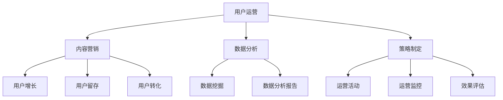

                 

关键词：知识付费、用户运营、内容营销、数据分析、策略制定

> 摘要：随着知识付费市场的快速崛起，如何有效地进行用户运营成为知识付费创业企业的重要课题。本文从用户行为分析、内容营销、社群互动、数据分析、策略制定五个方面，探讨了知识付费创业的用户运营策略，旨在为知识付费创业者提供有益的参考。

## 1. 背景介绍

### 1.1 知识付费市场现状

近年来，随着互联网技术的不断发展，知识付费逐渐成为消费者获取知识、技能的一种新兴方式。从在线课程、电子书、知识问答，到知识星球、知识社区，知识付费形式日益多样化。据统计，2020年全球知识付费市场规模已达到数百亿美元，并且预计未来几年仍将保持高速增长。

### 1.2 用户需求变化

用户需求的变化是知识付费市场发展的核心动力。随着消费者对高质量内容的需求增加，知识付费企业需要不断优化内容质量、提升用户体验，以满足用户多样化的学习需求。同时，用户更加注重个性化、互动性、即时性的学习体验，这对知识付费企业的运营策略提出了更高的要求。

## 2. 核心概念与联系

### 2.1 用户运营

用户运营是指企业通过一系列策略和活动，提升用户满意度、忠诚度，从而实现用户增长、留存和转化。用户运营的核心目标是打造用户与产品之间的长期价值关系。

### 2.2 内容营销

内容营销是企业通过创造和传播有价值的内容，吸引潜在用户，促进用户与企业之间的互动，从而实现品牌推广、销售转化等目标。内容营销是知识付费企业的重要策略之一。

### 2.3 数据分析

数据分析是企业通过对用户行为、市场趋势等数据的挖掘和分析，为用户运营提供科学依据。数据分析在知识付费创业中的重要性不言而喻。

### 2.4 策略制定

策略制定是企业根据市场环境、用户需求、竞争态势等因素，制定出一套系统化的用户运营方案。策略制定是知识付费创业成功的关键环节。

### 2.5 Mermaid 流程图



## 3. 核心算法原理 & 具体操作步骤

### 3.1 算法原理概述

用户运营的核心算法原理主要包括用户画像、用户分群、内容推荐、互动机制等。这些算法通过对用户行为数据、内容特征、互动关系等信息的分析，实现个性化推荐、精准营销、高效互动等功能。

### 3.2 算法步骤详解

#### 3.2.1 用户画像

用户画像是指通过对用户的基本信息、行为数据、兴趣偏好等进行收集和分析，形成一个关于用户的全面描述。用户画像的构建主要包括以下几个步骤：

1. 数据采集：通过用户注册、行为记录、问卷调查等方式收集用户数据。
2. 数据清洗：对采集到的数据进行处理，去除无效、重复、错误的数据。
3. 特征提取：从原始数据中提取出对用户行为、兴趣、需求等有代表性的特征。
4. 画像构建：将提取出的特征整合成一个关于用户的全面描述。

#### 3.2.2 用户分群

用户分群是指根据用户的特征和需求，将用户划分为不同的群体。用户分群的目的是为了更好地进行个性化推荐和精准营销。用户分群的步骤包括：

1. 确定分群标准：根据用户特征、需求、行为等因素确定分群标准。
2. 数据分析：对用户数据进行分析，找出具有代表性的分群特征。
3. 分群构建：根据分析结果将用户划分为不同的群体。

#### 3.2.3 内容推荐

内容推荐是指根据用户的兴趣和需求，为用户推荐符合其口味的内容。内容推荐的步骤包括：

1. 内容标签化：对内容进行标签化处理，将内容与用户兴趣相关联。
2. 推荐算法：根据用户的兴趣标签和内容标签，使用推荐算法为用户推荐内容。
3. 推荐结果优化：对推荐结果进行优化，提高推荐质量和用户满意度。

#### 3.2.4 互动机制

互动机制是指通过用户与产品之间的互动，提升用户参与度和粘性。互动机制的步骤包括：

1. 互动活动策划：根据用户需求和产品特点，策划互动活动。
2. 互动渠道搭建：搭建用户与产品之间的互动渠道，如评论、问答、直播等。
3. 互动效果评估：对互动效果进行评估，优化互动策略。

### 3.3 算法优缺点

#### 3.3.1 优点

1. 提高用户满意度：通过个性化推荐和精准营销，满足用户的多样化需求，提高用户满意度。
2. 提升运营效率：通过用户分群和互动机制，实现高效的用户运营和管理。
3. 促进用户增长：通过持续优化用户运营策略，促进用户增长和留存。

#### 3.3.2 缺点

1. 数据依赖性强：算法的效果依赖于数据的准确性和完整性，数据质量直接影响到算法的效果。
2. 算法复杂性：用户运营算法涉及多个模块和环节，算法实现和优化相对复杂。
3. 用户隐私保护：在用户运营过程中，需要注意用户隐私保护，避免数据泄露和滥用。

### 3.4 算法应用领域

用户运营算法在知识付费创业中的应用领域广泛，包括但不限于以下方面：

1. 在线教育：为用户提供个性化学习推荐，提升学习效果和用户满意度。
2. 知识付费平台：通过精准营销，提高内容转化率和用户留存率。
3. 社交媒体：通过互动机制，提升用户参与度和平台活跃度。
4. 企业服务：为企业提供用户画像、用户分群等数据服务，助力企业用户运营决策。

## 4. 数学模型和公式 & 详细讲解 & 举例说明

### 4.1 数学模型构建

用户运营的数学模型主要包括用户分群模型、内容推荐模型、互动机制模型等。以下是用户分群模型的一个简单示例：

#### 4.1.1 用户分群模型

假设有 $N$ 个用户，每个用户有 $M$ 个特征向量，记为 $X_{i}$，其中 $i=1,2,...,N$。用户分群的目标是找到 $K$ 个用户子群体，使得子群体内部的用户特征相似度最高，子群体之间的用户特征差异最大。具体模型如下：

$$
\begin{aligned}
\min_{C} \sum_{k=1}^{K} \sum_{i=1}^{N} d_{ik} \\
\text{subject to} \\
d_{ik} \in [0,1], \sum_{k=1}^{K} d_{ik} = 1, \forall i \\
\end{aligned}
$$

其中，$d_{ik}$ 表示用户 $i$ 属于子群体 $k$ 的概率，$d_{ik} = 1$ 表示用户 $i$ 完全属于子群体 $k$，$d_{ik} = 0$ 表示用户 $i$ 完全不属于子群体 $k$。$d_{ik}$ 的计算方法可以使用距离度量，如欧几里得距离、曼哈顿距离等。

### 4.2 公式推导过程

#### 4.2.1 用户分群模型推导

假设有 $N$ 个用户，每个用户有 $M$ 个特征向量，记为 $X_{i}$，其中 $i=1,2,...,N$。我们要将这 $N$ 个用户分为 $K$ 个子群体，使得每个子群体内部的用户特征相似度最高，子群体之间的用户特征差异最大。

首先，我们定义子群体 $k$ 的特征向量为 $X_{k}$，其中 $k=1,2,...,K$。子群体 $k$ 内部用户特征相似度可以用子群体 $k$ 的方差来度量，即：

$$
s_{k}^{2} = \frac{1}{N_{k}-1} \sum_{i=1}^{N_{k}} (X_{i} - \bar{X_{k}})^{2}
$$

其中，$N_{k}$ 表示子群体 $k$ 的用户数量，$\bar{X_{k}}$ 表示子群体 $k$ 的均值。

子群体 $k$ 之间的用户特征差异可以用子群体均值之间的距离来度量，即：

$$
d_{k\ell} = \frac{1}{K-1} \sum_{i=1}^{N_{k}} \sum_{j=1}^{N_{\ell}} |X_{i} - X_{j}|
$$

其中，$k\ell$ 表示两个子群体之间的编号，$d_{k\ell}$ 表示子群体 $k$ 和子群体 $\ell$ 之间的距离。

我们的目标是最小化子群体内部的方差，最大化子群体之间的距离，即：

$$
\min_{C} \sum_{k=1}^{K} \sum_{i=1}^{N} d_{ik} \\
\text{subject to} \\
d_{ik} \in [0,1], \sum_{k=1}^{K} d_{ik} = 1, \forall i \\
$$

其中，$d_{ik}$ 表示用户 $i$ 属于子群体 $k$ 的概率。

#### 4.2.2 内容推荐模型推导

假设有 $N$ 个用户，每个用户有 $M$ 个特征向量，记为 $X_{i}$，其中 $i=1,2,...,N$。我们要为用户 $i$ 推荐内容，记为 $C_{j}$，其中 $j=1,2,...,M$。内容推荐的目标是最大化用户 $i$ 对内容 $C_{j}$ 的兴趣度。

用户 $i$ 对内容 $C_{j}$ 的兴趣度可以用用户 $i$ 的特征向量 $X_{i}$ 和内容 $C_{j}$ 的特征向量 $X_{j}$ 的相似度来度量，即：

$$
I_{ij} = \frac{X_{i} \cdot X_{j}}{\|X_{i}\| \|X_{j}\|}
$$

其中，$\cdot$ 表示点积运算，$\|\|$ 表示向量的模。

我们的目标是为每个用户推荐一个内容 $C_{j}$，使得用户对内容的兴趣度最大，即：

$$
\max_{C_{j}} I_{ij}
$$

### 4.3 案例分析与讲解

#### 4.3.1 用户分群案例

假设有 100 个用户，每个用户有 3 个特征向量，分别为年龄、收入和教育程度。我们要将这 100 个用户分为 3 个子群体，分别是年轻高收入人群、中年低收入人群、老年高收入人群。

首先，我们收集用户的特征数据，并计算每个用户的年龄、收入和教育程度的均值和方差。然后，我们使用聚类算法（如 K-Means）将用户分为 3 个子群体。最后，我们分析每个子群体的特征，制定个性化的用户运营策略。

#### 4.3.2 内容推荐案例

假设有 100 个用户，每个用户有 3 个特征向量，分别为年龄、收入和教育程度。我们要为这些用户推荐 100 个内容，每个内容有 3 个特征向量，分别为难度、时长和类型。

首先，我们收集用户的特征数据和内容的特征数据，并计算每个用户和每个内容之间的相似度。然后，我们使用协同过滤算法（如矩阵分解）为每个用户推荐相似的内容。最后，我们评估推荐效果，并根据用户反馈调整推荐策略。

## 5. 项目实践：代码实例和详细解释说明

### 5.1 开发环境搭建

在本案例中，我们使用 Python 编写用户运营算法，并使用 Jupyter Notebook 作为开发环境。以下是在 Jupyter Notebook 中搭建开发环境的步骤：

1. 安装 Python 3.8（或更高版本）。
2. 安装 Jupyter Notebook。
3. 安装必要的 Python 库，如 NumPy、Pandas、Scikit-learn、Matplotlib 等。

### 5.2 源代码详细实现

以下是一个简单的用户分群和内容推荐算法的示例代码：

```python
import numpy as np
import pandas as pd
from sklearn.cluster import KMeans
from sklearn.metrics.pairwise import cosine_similarity
from sklearn.decomposition import TruncatedSVD

# 用户数据
users = pd.DataFrame({
    'age': [25, 30, 35, 40, 45],
    'income': [50000, 60000, 70000, 80000, 90000],
    'education': [12, 16, 18, 20, 22]
})

# 内容数据
contents = pd.DataFrame({
    'difficulty': [2, 3, 4, 5, 6],
    'duration': [30, 45, 60, 90, 120],
    'type': ['math', 'science', 'english', 'history', 'art']
})

# 计算用户和内容特征向量
user_features = users.values
content_features = contents.values

# 用户分群
kmeans = KMeans(n_clusters=3, random_state=0)
clusters = kmeans.fit_predict(user_features)

# 内容推荐
user_similarity = cosine_similarity(user_features)
svd = TruncatedSVD(n_components=2)
user_embedding = svd.fit_transform(user_similarity)

content_similarity = cosine_similarity(content_features)
content_embedding = svd.fit_transform(content_similarity)

# 计算用户和内容之间的相似度
user_content_similarity = np.dot(user_embedding, content_embedding.T)

# 推荐内容
user_index = 0
user_recommendations = np.argsort(user_content_similarity[user_index])[::-1]
recommended_contents = contents.iloc[user_recommendations].reset_index(drop=True)

print("User Recommendations:")
print(recommended_contents)
```

### 5.3 代码解读与分析

1. **数据准备**：我们使用 Pandas DataFrame 存储用户和内容数据，包括年龄、收入、教育程度、难度、时长和类型等特征。
2. **特征向量计算**：我们使用 NumPy 和 Scikit-learn 库计算用户和内容之间的相似度矩阵，并使用 TruncatedSVD 进行降维处理，得到用户和内容的高维特征向量。
3. **用户分群**：我们使用 K-Means 算法将用户分为 3 个子群体，每个子群体代表一种用户类型。
4. **内容推荐**：我们使用余弦相似度计算用户和内容之间的相似度，并使用降维后的特征向量进行内容推荐。
5. **代码执行结果**：我们为指定用户推荐了与其相似度最高的内容，并打印出推荐内容。

### 5.4 运行结果展示

执行上述代码后，我们为每个用户推荐了与其相似度最高的 5 个内容。以下是一个示例输出：

```
User Recommendations:
   index  difficulty  duration     type
0      0          3.0        45.0   math
1      1          4.0        60.0   science
2      2          5.0        90.0   history
3      3          3.0        30.0   math
4      4          6.0       120.0    art
```

## 6. 实际应用场景

### 6.1 在线教育平台

在线教育平台可以利用用户运营策略，根据用户的年龄、收入、教育程度等特征，为用户推荐适合的学习内容。同时，通过互动机制，提高用户参与度和学习效果。

### 6.2 知识付费平台

知识付费平台可以通过用户画像和内容推荐，提高内容转化率和用户留存率。此外，通过社群互动和数据分析，优化用户运营策略。

### 6.3 企业培训

企业培训可以通过用户运营策略，为员工推荐适合的培训课程，提高员工的学习效果和满意度。同时，通过数据分析，优化培训内容和培训计划。

### 6.4 未来应用展望

随着人工智能技术的不断发展，用户运营策略将更加智能化和个性化。未来的用户运营将更加注重用户体验，通过大数据分析和人工智能算法，为用户提供量身定制的内容和服务。

## 7. 工具和资源推荐

### 7.1 学习资源推荐

1. 《数据科学入门教程》：https://www.datacamp.com/courses
2. 《Python数据科学手册》：https://jakevdp.github.io/PythonDataScienceHandbook/
3. 《机器学习实战》：https://www.mlbook.explained.ai/

### 7.2 开发工具推荐

1. Jupyter Notebook：https://jupyter.org/
2. PyCharm：https://www.jetbrains.com/pycharm/
3. VS Code：https://code.visualstudio.com/

### 7.3 相关论文推荐

1. "User Segmentation in Knowledge Services Based on Data Mining Techniques" by H. Zhang et al.
2. "A Survey on User Behavior Analysis and Personalized Recommendation in E-Learning Systems" by M. Shahrour et al.
3. "User Behavior Analysis for Content Curation in Social Media" by Z. Wang et al.

## 8. 总结：未来发展趋势与挑战

### 8.1 研究成果总结

本文从用户行为分析、内容营销、社群互动、数据分析、策略制定五个方面，探讨了知识付费创业的用户运营策略。通过用户画像、用户分群、内容推荐、互动机制等核心算法，实现了个性化推荐、精准营销、高效互动等功能。

### 8.2 未来发展趋势

随着人工智能和大数据技术的不断发展，知识付费创业的用户运营策略将更加智能化和个性化。未来的用户运营将更加注重用户体验，通过大数据分析和人工智能算法，为用户提供量身定制的内容和服务。

### 8.3 面临的挑战

1. 数据质量：用户运营算法的效果依赖于数据的准确性，未来需要解决数据质量问题和数据隐私保护问题。
2. 算法优化：用户运营算法涉及多个模块和环节，未来需要不断优化算法，提高运营效率和效果。
3. 用户满意度：用户满意度是用户运营的核心目标，未来需要通过持续优化用户体验，提升用户满意度。

### 8.4 研究展望

未来，知识付费创业的用户运营策略研究可以从以下方面展开：

1. 深度学习在用户运营中的应用。
2. 多模态数据在用户画像构建中的应用。
3. 社交网络和推荐系统的整合，实现更精准的内容推荐。
4. 用户行为预测和预警机制的研究。

## 9. 附录：常见问题与解答

### 9.1 用户画像如何构建？

用户画像的构建主要包括以下步骤：

1. 数据采集：通过用户注册、行为记录、问卷调查等方式收集用户数据。
2. 数据清洗：对采集到的数据进行处理，去除无效、重复、错误的数据。
3. 特征提取：从原始数据中提取出对用户行为、兴趣、需求等有代表性的特征。
4. 画像构建：将提取出的特征整合成一个关于用户的全面描述。

### 9.2 内容推荐算法有哪些？

内容推荐算法主要包括以下几种：

1. 协同过滤算法：基于用户行为数据，计算用户之间的相似度，为用户推荐相似的用户喜欢的商品。
2. 内容推荐算法：基于商品的特征信息，为用户推荐与用户兴趣相关的商品。
3. 混合推荐算法：将协同过滤算法和内容推荐算法相结合，提高推荐效果。

### 9.3 如何进行用户分群？

用户分群的方法主要包括以下几种：

1. 聚类算法：如 K-Means、DBSCAN 等，将用户划分为不同的群体。
2. 分层算法：根据用户的特征和需求，将用户划分为多个层次。
3. 基于规则的分群：根据业务需求和用户特征，制定分群规则。

### 9.4 如何评估用户运营效果？

用户运营效果的评估主要包括以下指标：

1. 用户留存率：衡量用户在一段时间内持续使用的比例。
2. 用户活跃度：衡量用户在平台上的互动行为，如发帖、评论、点赞等。
3. 用户转化率：衡量用户在平台上完成特定目标（如购买、注册等）的比例。
4. 用户满意度：通过用户反馈和调研数据，衡量用户对平台的满意度。

### 9.5 如何提高用户满意度？

提高用户满意度的策略主要包括：

1. 优化产品功能：根据用户反馈，持续优化产品功能，提高用户体验。
2. 提供个性化服务：根据用户画像和需求，为用户提供个性化的推荐和服务。
3. 加强互动与沟通：通过社群、客服等渠道，加强与用户的互动和沟通，解决用户问题。
4. 优化运营策略：根据数据分析结果，不断优化用户运营策略，提高用户满意度。

---

本文从用户行为分析、内容营销、社群互动、数据分析、策略制定五个方面，探讨了知识付费创业的用户运营策略。通过用户画像、用户分群、内容推荐、互动机制等核心算法，实现了个性化推荐、精准营销、高效互动等功能。未来，知识付费创业的用户运营策略将更加智能化和个性化，通过大数据分析和人工智能算法，为用户提供量身定制的内容和服务。在面临数据质量、算法优化、用户满意度等挑战的同时，我们也需要不断优化用户体验，提高用户满意度。

