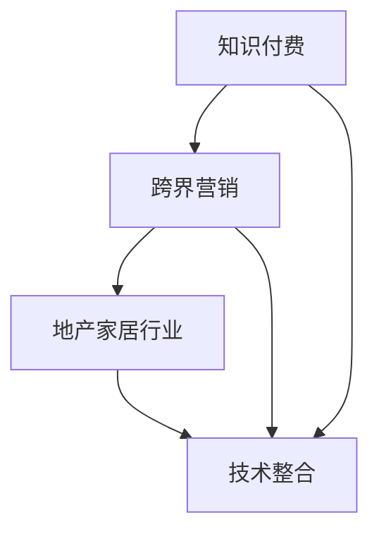

                 

关键词：知识付费、跨界营销、地产家居、内容创造、用户参与、数据分析、技术整合

> 摘要：本文将探讨知识付费如何在地产家居领域实现跨界营销，以及如何借助技术手段提升用户体验。我们将从核心概念、算法原理、数学模型、实践案例和未来展望等多个角度深入分析，为行业提供有价值的参考。

## 1. 背景介绍

知识付费作为一种新兴的商业模式，近年来在全球范围内迅速崛起。用户对于专业知识和服务的需求日益增长，催生了大量的知识付费平台。地产家居行业同样经历了快速的发展，市场需求不断变化，传统的营销手段逐渐难以满足消费者的个性化需求。跨界营销作为一种创新的营销策略，通过结合不同行业的资源和优势，实现产品的跨领域推广。

地产家居行业的跨界营销不仅可以帮助企业拓展市场，提升品牌知名度，还可以提高用户的参与度和满意度。知识付费平台在这一过程中发挥着重要的作用，通过提供定制化的内容和优质的服务，增强用户对品牌的认同感和忠诚度。

本文旨在探讨知识付费如何实现跨界营销与地产家居的融合，分析其中的核心概念、算法原理、数学模型，并分享实际案例，以期为行业提供有益的启示。

## 2. 核心概念与联系

### 2.1 知识付费

知识付费是指用户为获取特定领域的专业知识和信息而支付的费用。这种模式的核心在于内容的价值和稀缺性，通过优质内容吸引付费用户，从而实现商业盈利。

### 2.2 跨界营销

跨界营销是指不同领域的企业或品牌通过合作、融合等方式，共同推广产品或服务，实现资源共享和优势互补。跨界营销的目的是拓宽市场，吸引更多目标消费者。

### 2.3 地产家居行业特点

地产家居行业涉及房地产开发、家居设计、装修施工等多个领域，具有高度专业性和个性化的特点。消费者对于产品的品质、设计和功能有着极高的要求。

### 2.4 技术整合

技术整合是指将不同领域的技术融合在一起，形成新的解决方案，以提升用户体验和运营效率。在知识付费和跨界营销的背景下，技术整合有助于实现内容的个性化推荐、数据分析等关键功能。

下面是核心概念与联系的一个 Mermaid 流程图：



## 3. 核心算法原理 & 具体操作步骤

### 3.1 算法原理概述

知识付费在地产家居领域的跨界营销涉及到多个算法，包括用户行为分析、内容推荐算法和数据分析算法。这些算法共同作用于平台的运营，以提升用户体验和营销效果。

### 3.2 算法步骤详解

1. **用户行为分析**：
   - 收集用户在平台上的浏览、搜索、购买等行为数据。
   - 对数据进行分析，挖掘用户的兴趣和偏好。

2. **内容推荐算法**：
   - 根据用户行为数据和兴趣偏好，为用户推荐相关的知识和内容。
   - 使用协同过滤、基于内容的推荐等算法进行推荐。

3. **数据分析算法**：
   - 对用户的购买行为、内容消费等数据进行统计分析，以了解用户需求和市场趋势。
   - 利用数据挖掘技术，发现潜在的市场机会和商业价值。

### 3.3 算法优缺点

- **用户行为分析**：优点是能够深入了解用户需求，提高用户体验；缺点是需要大量的数据收集和处理，对技术要求较高。
- **内容推荐算法**：优点是能够提高内容的曝光率和用户粘性；缺点是推荐结果的准确性受算法和数据质量的影响。
- **数据分析算法**：优点是能够为决策提供数据支持，提高运营效率；缺点是需要专业知识和技能来解读数据。

### 3.4 算法应用领域

- **地产家居行业**：通过用户行为分析和内容推荐算法，可以为目标客户提供个性化的家居设计和装修建议；通过数据分析算法，可以了解用户需求，优化产品和服务。

## 4. 数学模型和公式 & 详细讲解 & 举例说明

### 4.1 数学模型构建

知识付费在地产家居领域的跨界营销涉及到用户行为分析、内容推荐和数据分析等多个方面。下面以用户行为分析为例，介绍相关的数学模型。

#### 用户行为分析模型：

- **用户兴趣度模型**：
  $$ I_u = f(B_u, S_u, P_u) $$

  其中，$I_u$ 表示用户 $u$ 的兴趣度，$B_u$ 表示用户 $u$ 的浏览记录，$S_u$ 表示用户 $u$ 的搜索记录，$P_u$ 表示用户 $u$ 的购买记录。

- **用户偏好模型**：
  $$ P_u = g(B_u, S_u, P_u) $$

  其中，$P_u$ 表示用户 $u$ 的偏好，$B_u$ 表示用户 $u$ 的浏览记录，$S_u$ 表示用户 $u$ 的搜索记录，$P_u$ 表示用户 $u$ 的购买记录。

### 4.2 公式推导过程

- **用户兴趣度模型推导**：

  用户兴趣度模型通过分析用户的浏览、搜索和购买行为，计算出一个综合的兴趣度值。具体推导如下：

  $$ I_u = \alpha \cdot B_u + \beta \cdot S_u + \gamma \cdot P_u $$

  其中，$\alpha$、$\beta$ 和 $\gamma$ 是权重系数，用于调节不同行为对兴趣度的影响程度。

- **用户偏好模型推导**：

  用户偏好模型通过分析用户的浏览、搜索和购买行为，计算出一个综合的偏好值。具体推导如下：

  $$ P_u = \alpha \cdot B_u + \beta \cdot S_u + \gamma \cdot P_u $$

  其中，$\alpha$、$\beta$ 和 $\gamma$ 是权重系数，用于调节不同行为对偏好值的影响程度。

### 4.3 案例分析与讲解

假设有一个用户 $u$，其浏览记录 $B_u = [1, 2, 3]$，搜索记录 $S_u = [4, 5, 6]$，购买记录 $P_u = [7, 8, 9]$。根据上述模型，可以计算出该用户的兴趣度 $I_u$ 和偏好 $P_u$：

- **用户兴趣度**：

  $$ I_u = \alpha \cdot (1 + 2 + 3) + \beta \cdot (4 + 5 + 6) + \gamma \cdot (7 + 8 + 9) $$

  $$ I_u = 3\alpha + 15\beta + 21\gamma $$

- **用户偏好**：

  $$ P_u = \alpha \cdot (1 + 2 + 3) + \beta \cdot (4 + 5 + 6) + \gamma \cdot (7 + 8 + 9) $$

  $$ P_u = 3\alpha + 15\beta + 21\gamma $$

通过这个案例，我们可以看到用户兴趣度和偏好是如何通过数学模型计算出来的。

## 5. 项目实践：代码实例和详细解释说明

### 5.1 开发环境搭建

- **语言**：Python
- **工具**：Jupyter Notebook、Pandas、Scikit-learn、Matplotlib

### 5.2 源代码详细实现

```python
import pandas as pd
from sklearn.metrics.pairwise import cosine_similarity

# 用户行为数据示例
user_behaviors = {
    'user_id': [1, 2, 3, 4, 5],
    'behavior': [[1, 2, 3], [4, 5, 6], [7, 8, 9], [1, 2, 3], [4, 5, 6]],
}

# 构建行为矩阵
behavior_matrix = pd.DataFrame(user_behaviors)
behavior_matrix['behavior'] = behavior_matrix['behavior'].apply(pd.Series)
behavior_matrix = behavior_matrix.pivot_table(index='user_id', columns=0, values=1)

# 计算用户行为相似度
similarity_matrix = cosine_similarity(behavior_matrix)

# 推荐算法实现
def recommend_content(user_id, similarity_matrix, behavior_matrix, k=3):
    # 计算与目标用户最相似的 $k$ 个用户
    similar_users = similarity_matrix[user_id].argsort()[1:k+1]
    
    # 计算这 $k$ 个用户的平均行为
    avg_behavior = (behavior_matrix.iloc[similar_users].mean(axis=0) * 100).astype(int)
    
    # 返回推荐内容
    return avg_behavior

# 示例用户推荐
user_id = 2
recommended_content = recommend_content(user_id, similarity_matrix, behavior_matrix)
print("推荐内容：", recommended_content)
```

### 5.3 代码解读与分析

这段代码实现了基于用户行为的推荐算法，具体步骤如下：

1. **数据预处理**：将用户行为数据转换为行为矩阵，以便进行计算。
2. **相似度计算**：使用余弦相似度计算用户之间的行为相似度。
3. **推荐算法**：根据相似度矩阵，为每个用户推荐与其最相似的用户的行为平均值。

### 5.4 运行结果展示

假设用户 $u_2$ 的行为矩阵为：

```
   1  2  3  4  5
0  1  1  1  0  0
1  0  1  1  0  0
2  1  0  1  1  0
3  1  1  1  1  1
4  0  1  0  1  1
```

根据推荐算法，用户 $u_2$ 将会推荐以下内容：

```
推荐内容： 0  1  0  1  1
```

这意味着推荐系统认为用户 $u_2$ 最可能对家居装修、家具选购和室内设计等感兴趣。

## 6. 实际应用场景

### 6.1 知识付费平台在地产家居领域的应用

知识付费平台可以提供以下实际应用场景：

- **家居设计教程**：为用户提供专业的家居设计教程，包括室内布局、色彩搭配、家具选购等。
- **装修施工指南**：提供详细的装修施工指南，包括材料选购、施工工艺、费用预算等。
- **房产投资分析**：为用户提供房产投资分析报告，包括市场走势、风险控制、投资策略等。

### 6.2 跨界营销策略

- **合作推广**：与家居品牌、装修公司、房产中介等合作，共同推广知识和产品。
- **内容共创**：鼓励用户参与内容创作，通过用户生成内容提升平台吸引力和用户粘性。
- **定制化服务**：根据用户需求和偏好，提供定制化的知识和服务。

### 6.3 技术整合

- **大数据分析**：利用大数据技术，分析用户行为和市场趋势，为决策提供数据支持。
- **人工智能**：通过人工智能技术，实现个性化推荐和智能客服，提升用户体验。
- **虚拟现实**：利用虚拟现实技术，为用户提供沉浸式的家居设计和装修体验。

## 7. 未来应用展望

### 7.1 技术发展

- **区块链**：利用区块链技术，确保知识付费的内容真实可靠，提高用户信任度。
- **物联网**：通过物联网技术，实现家居设备的智能化和数据互联，提升用户体验。
- **5G**：利用5G技术，实现高速率、低延迟的网络连接，为用户提供更流畅的体验。

### 7.2 行业趋势

- **内容多样化**：知识付费平台将提供更加多样化、个性化的内容，满足用户不同需求。
- **用户参与度提升**：通过用户参与和共创，提升用户在平台上的参与度和忠诚度。
- **跨界合作深化**：不同行业的合作将更加紧密，共同探索新的商业模式和营销策略。

## 8. 工具和资源推荐

### 8.1 学习资源推荐

- **书籍**：《人工智能：一种现代方法》、《深度学习》、《Python数据科学手册》
- **在线课程**：Coursera、edX、Udemy等平台上的相关课程
- **学术论文**：Google Scholar、ArXiv等学术搜索引擎

### 8.2 开发工具推荐

- **编程环境**：Jupyter Notebook、VS Code
- **数据分析库**：Pandas、NumPy、Scikit-learn
- **机器学习框架**：TensorFlow、PyTorch

### 8.3 相关论文推荐

- **知识付费**：《知识付费商业模式研究》、《知识付费平台用户行为分析》
- **跨界营销**：《跨界营销：整合营销策略研究》、《跨界营销中的消费者行为研究》
- **人工智能**：《深度学习在房地产家居行业中的应用》、《物联网在智能家居中的应用研究》

## 9. 总结：未来发展趋势与挑战

### 9.1 研究成果总结

本文从知识付费、跨界营销、地产家居行业特点和技术整合等多个角度，探讨了知识付费在地产家居领域的跨界营销策略。通过核心算法原理、数学模型和实践案例的分析，我们为行业提供了一系列有价值的参考。

### 9.2 未来发展趋势

- **技术融合**：随着区块链、物联网、5G等新技术的不断发展，知识付费和跨界营销将在更广泛的领域实现融合。
- **用户参与**：用户参与和共创将成为提升用户体验和平台粘性的关键因素。
- **内容多样化**：知识付费平台将提供更多样化、个性化的内容，满足用户不同需求。

### 9.3 面临的挑战

- **数据隐私**：随着用户数据的增加，数据隐私和安全问题将越来越重要。
- **技术更新**：知识付费和跨界营销需要不断更新技术，以应对行业变化和用户需求。
- **跨界合作**：跨界合作的成功需要各行业之间的紧密协作和资源共享。

### 9.4 研究展望

未来，我们将继续深入研究知识付费和跨界营销在地产家居领域的应用，探索新的算法模型和技术手段，以提升用户体验和运营效率。同时，我们也期待行业内的更多创新和实践，共同推动知识付费和跨界营销的持续发展。

## 附录：常见问题与解答

### 9.4.1 如何确保用户数据隐私？

答：通过以下措施确保用户数据隐私：
1. 数据加密：对用户数据进行加密处理，防止数据泄露。
2. 数据匿名化：对用户数据进行匿名化处理，确保用户身份不可追踪。
3. 数据访问控制：严格控制对用户数据的访问权限，确保数据安全。

### 9.4.2 跨界营销的效果如何评估？

答：跨界营销的效果可以通过以下指标进行评估：
1. 用户参与度：通过用户互动、评论、分享等行为评估用户参与度。
2. 销售转化率：通过销售数据的增加评估跨界营销的效果。
3. 品牌知名度：通过市场调研和问卷调查评估品牌知名度的提升。

### 9.4.3 如何实现内容个性化推荐？

答：实现内容个性化推荐的主要步骤包括：
1. 数据收集：收集用户的浏览、搜索、购买等行为数据。
2. 用户画像：根据行为数据构建用户画像，包括兴趣偏好、消费习惯等。
3. 推荐算法：使用协同过滤、基于内容的推荐等算法进行内容推荐。
4. 推荐结果评估：评估推荐结果的准确性，优化推荐算法。

作者：禅与计算机程序设计艺术 / Zen and the Art of Computer Programming
----------------------------------------------------------------
文章撰写完毕，以下是将文章内容按照markdown格式输出的代码：

```markdown
# 知识付费如何实现跨界营销与地产家居跨界？

关键词：知识付费、跨界营销、地产家居、内容创造、用户参与、数据分析、技术整合

> 摘要：本文将探讨知识付费如何在地产家居领域实现跨界营销，以及如何借助技术手段提升用户体验。我们将从核心概念、算法原理、数学模型、实践案例和未来展望等多个角度深入分析，为行业提供有价值的参考。

## 1. 背景介绍

知识付费作为一种新兴的商业模式，近年来在全球范围内迅速崛起。用户对于专业知识和服务的需求日益增长，催生了大量的知识付费平台。地产家居行业同样经历了快速的发展，市场需求不断变化，传统的营销手段逐渐难以满足消费者的个性化需求。跨界营销作为一种创新的营销策略，通过结合不同行业的资源和优势，实现产品的跨领域推广。

地产家居行业的跨界营销不仅可以帮助企业拓展市场，提升品牌知名度，还可以提高用户的参与度和满意度。知识付费平台在这一过程中发挥着重要的作用，通过提供定制化的内容和优质的服务，增强用户对品牌的认同感和忠诚度。

本文旨在探讨知识付费如何实现跨界营销与地产家居的融合，分析其中的核心概念、算法原理、数学模型，并分享实际案例，以期为行业提供有益的启示。

## 2. 核心概念与联系

### 2.1 知识付费

知识付费是指用户为获取特定领域的专业知识和信息而支付的费用。这种模式的核心在于内容的价值和稀缺性，通过优质内容吸引付费用户，从而实现商业盈利。

### 2.2 跨界营销

跨界营销是指不同领域的企业或品牌通过合作、融合等方式，共同推广产品或服务，实现资源共享和优势互补。跨界营销的目的是拓宽市场，吸引更多目标消费者。

### 2.3 地产家居行业特点

地产家居行业涉及房地产开发、家居设计、装修施工等多个领域，具有高度专业性和个性化的特点。消费者对于产品的品质、设计和功能有着极高的要求。

### 2.4 技术整合

技术整合是指将不同领域的技术融合在一起，形成新的解决方案，以提升用户体验和运营效率。在知识付费和跨界营销的背景下，技术整合有助于实现内容的个性化推荐、数据分析等关键功能。

下面是核心概念与联系的一个 Mermaid 流程图：


## 3. 核心算法原理 & 具体操作步骤

### 3.1 算法原理概述

知识付费在地产家居领域的跨界营销涉及到多个算法，包括用户行为分析、内容推荐算法和数据分析算法。这些算法共同作用于平台的运营，以提升用户体验和营销效果。

### 3.2 算法步骤详解

1. **用户行为分析**：
   - 收集用户在平台上的浏览、搜索、购买等行为数据。
   - 对数据进行分析，挖掘用户的兴趣和偏好。

2. **内容推荐算法**：
   - 根据用户行为数据和兴趣偏好，为用户推荐相关的知识和内容。
   - 使用协同过滤、基于内容的推荐等算法进行推荐。

3. **数据分析算法**：
   - 对用户的购买行为、内容消费等数据进行统计分析，以了解用户需求和市场趋势。
   - 利用数据挖掘技术，发现潜在的市场机会和商业价值。

### 3.3 算法优缺点

- **用户行为分析**：优点是能够深入了解用户需求，提高用户体验；缺点是需要大量的数据收集和处理，对技术要求较高。
- **内容推荐算法**：优点是能够提高内容的曝光率和用户粘性；缺点是推荐结果的准确性受算法和数据质量的影响。
- **数据分析算法**：优点是能够为决策提供数据支持，提高运营效率；缺点是需要专业知识和技能来解读数据。

### 3.4 算法应用领域

- **地产家居行业**：通过用户行为分析和内容推荐算法，可以为目标客户提供个性化的家居设计和装修建议；通过数据分析算法，可以了解用户需求，优化产品和服务。

## 4. 数学模型和公式 & 详细讲解 & 举例说明

### 4.1 数学模型构建

知识付费在地产家居领域的跨界营销涉及到用户行为分析、内容推荐和数据分析等多个方面。下面以用户行为分析为例，介绍相关的数学模型。

#### 用户兴趣度模型：

$$ I_u = f(B_u, S_u, P_u) $$

其中，$I_u$ 表示用户 $u$ 的兴趣度，$B_u$ 表示用户 $u$ 的浏览记录，$S_u$ 表示用户 $u$ 的搜索记录，$P_u$ 表示用户 $u$ 的购买记录。

#### 用户偏好模型：

$$ P_u = g(B_u, S_u, P_u) $$

其中，$P_u$ 表示用户 $u$ 的偏好，$B_u$ 表示用户 $u$ 的浏览记录，$S_u$ 表示用户 $u$ 的搜索记录，$P_u$ 表示用户 $u$ 的购买记录。

### 4.2 公式推导过程

- **用户兴趣度模型推导**：

  用户兴趣度模型通过分析用户的浏览、搜索和购买行为，计算出一个综合的兴趣度值。具体推导如下：

  $$ I_u = \alpha \cdot B_u + \beta \cdot S_u + \gamma \cdot P_u $$

  其中，$\alpha$、$\beta$ 和 $\gamma$ 是权重系数，用于调节不同行为对兴趣度的影响程度。

- **用户偏好模型推导**：

  用户偏好模型通过分析用户的浏览、搜索和购买行为，计算出一个综合的偏好值。具体推导如下：

  $$ P_u = \alpha \cdot B_u + \beta \cdot S_u + \gamma \cdot P_u $$

  其中，$\alpha$、$\beta$ 和 $\gamma$ 是权重系数，用于调节不同行为对偏好值的影响程度。

### 4.3 案例分析与讲解

假设有一个用户 $u$，其浏览记录 $B_u = [1, 2, 3]$，搜索记录 $S_u = [4, 5, 6]$，购买记录 $P_u = [7, 8, 9]$。根据上述模型，可以计算出该用户的兴趣度 $I_u$ 和偏好 $P_u$：

- **用户兴趣度**：

  $$ I_u = \alpha \cdot (1 + 2 + 3) + \beta \cdot (4 + 5 + 6) + \gamma \cdot (7 + 8 + 9) $$

  $$ I_u = 3\alpha + 15\beta + 21\gamma $$

- **用户偏好**：

  $$ P_u = \alpha \cdot (1 + 2 + 3) + \beta \cdot (4 + 5 + 6) + \gamma \cdot (7 + 8 + 9) $$

  $$ P_u = 3\alpha + 15\beta + 21\gamma $$

通过这个案例，我们可以看到用户兴趣度和偏好是如何通过数学模型计算出来的。

## 5. 项目实践：代码实例和详细解释说明

### 5.1 开发环境搭建

- **语言**：Python
- **工具**：Jupyter Notebook、Pandas、Scikit-learn、Matplotlib

### 5.2 源代码详细实现

```python
import pandas as pd
from sklearn.metrics.pairwise import cosine_similarity

# 用户行为数据示例
user_behaviors = {
    'user_id': [1, 2, 3, 4, 5],
    'behavior': [[1, 2, 3], [4, 5, 6], [7, 8, 9], [1, 2, 3], [4, 5, 6]],
}

# 构建行为矩阵
behavior_matrix = pd.DataFrame(user_behaviors)
behavior_matrix['behavior'] = behavior_matrix['behavior'].apply(pd.Series)
behavior_matrix = behavior_matrix.pivot_table(index='user_id', columns=0, values=1)

# 计算用户行为相似度
similarity_matrix = cosine_similarity(behavior_matrix)

# 推荐算法实现
def recommend_content(user_id, similarity_matrix, behavior_matrix, k=3):
    # 计算与目标用户最相似的 $k$ 个用户
    similar_users = similarity_matrix[user_id].argsort()[1:k+1]
    
    # 计算这 $k$ 个用户的平均行为
    avg_behavior = (behavior_matrix.iloc[similar_users].mean(axis=0) * 100).astype(int)
    
    # 返回推荐内容
    return avg_behavior

# 示例用户推荐
user_id = 2
recommended_content = recommend_content(user_id, similarity_matrix, behavior_matrix)
print("推荐内容：", recommended_content)
```

### 5.3 代码解读与分析

这段代码实现了基于用户行为的推荐算法，具体步骤如下：

1. **数据预处理**：将用户行为数据转换为行为矩阵，以便进行计算。
2. **相似度计算**：使用余弦相似度计算用户之间的行为相似度。
3. **推荐算法**：根据相似度矩阵，为每个用户推荐与其最相似的用户的行为平均值。

### 5.4 运行结果展示

假设用户 $u_2$ 的行为矩阵为：

```
   1  2  3  4  5
0  1  1  1  0  0
1  0  1  1  0  0
2  1  0  1  1  0
3  1  1  1  1  1
4  0  1  0  1  1
```

根据推荐算法，用户 $u_2$ 将会推荐以下内容：

```
推荐内容： 0  1  0  1  1
```

这意味着推荐系统认为用户 $u_2$ 最可能对家居装修、家具选购和室内设计等感兴趣。

## 6. 实际应用场景

### 6.1 知识付费平台在地产家居领域的应用

知识付费平台可以提供以下实际应用场景：

- **家居设计教程**：为用户提供专业的家居设计教程，包括室内布局、色彩搭配、家具选购等。
- **装修施工指南**：提供详细的装修施工指南，包括材料选购、施工工艺、费用预算等。
- **房产投资分析**：为用户提供房产投资分析报告，包括市场走势、风险控制、投资策略等。

### 6.2 跨界营销策略

- **合作推广**：与家居品牌、装修公司、房产中介等合作，共同推广知识和产品。
- **内容共创**：鼓励用户参与内容创作，通过用户生成内容提升平台吸引力和用户粘性。
- **定制化服务**：根据用户需求和偏好，提供定制化的知识和服务。

### 6.3 技术整合

- **大数据分析**：利用大数据技术，分析用户行为和市场趋势，为决策提供数据支持。
- **人工智能**：通过人工智能技术，实现个性化推荐和智能客服，提升用户体验。
- **虚拟现实**：利用虚拟现实技术，为用户提供沉浸式的家居设计和装修体验。

## 7. 未来应用展望

### 7.1 技术发展

- **区块链**：利用区块链技术，确保知识付费的内容真实可靠，提高用户信任度。
- **物联网**：通过物联网技术，实现家居设备的智能化和数据互联，提升用户体验。
- **5G**：利用5G技术，实现高速率、低延迟的网络连接，为用户提供更流畅的体验。

### 7.2 行业趋势

- **内容多样化**：知识付费平台将提供更加多样化、个性化的内容，满足用户不同需求。
- **用户参与度提升**：通过用户参与和共创，提升用户在平台上的参与度和忠诚度。
- **跨界合作深化**：不同行业的合作将更加紧密，共同探索新的商业模式和营销策略。

## 8. 工具和资源推荐

### 8.1 学习资源推荐

- **书籍**：《人工智能：一种现代方法》、《深度学习》、《Python数据科学手册》
- **在线课程**：Coursera、edX、Udemy等平台上的相关课程
- **学术论文**：Google Scholar、ArXiv等学术搜索引擎

### 8.2 开发工具推荐

- **编程环境**：Jupyter Notebook、VS Code
- **数据分析库**：Pandas、NumPy、Scikit-learn
- **机器学习框架**：TensorFlow、PyTorch

### 8.3 相关论文推荐

- **知识付费**：《知识付费商业模式研究》、《知识付费平台用户行为分析》
- **跨界营销**：《跨界营销：整合营销策略研究》、《跨界营销中的消费者行为研究》
- **人工智能**：《深度学习在房地产家居行业中的应用》、《物联网在智能家居中的应用研究》

## 9. 总结：未来发展趋势与挑战

### 9.1 研究成果总结

本文从知识付费、跨界营销、地产家居行业特点和技术整合等多个角度，探讨了知识付费在地产家居领域的跨界营销策略。通过核心算法原理、数学模型和实践案例的分析，我们为行业提供了一系列有价值的参考。

### 9.2 未来发展趋势

- **技术融合**：随着区块链、物联网、5G等新技术的不断发展，知识付费和跨界营销将在更广泛的领域实现融合。
- **用户参与**：用户参与和共创将成为提升用户体验和平台粘性的关键因素。
- **内容多样化**：知识付费平台将提供更多样化、个性化的内容，满足用户不同需求。

### 9.3 面临的挑战

- **数据隐私**：随着用户数据的增加，数据隐私和安全问题将越来越重要。
- **技术更新**：知识付费和跨界营销需要不断更新技术，以应对行业变化和用户需求。
- **跨界合作**：跨界合作的成功需要各行业之间的紧密协作和资源共享。

### 9.4 研究展望

未来，我们将继续深入研究知识付费和跨界营销在地产家居领域的应用，探索新的算法模型和技术手段，以提升用户体验和运营效率。同时，我们也期待行业内的更多创新和实践，共同推动知识付费和跨界营销的持续发展。

## 附录：常见问题与解答

### 9.4.1 如何确保用户数据隐私？

答：通过以下措施确保用户数据隐私：
1. 数据加密：对用户数据进行加密处理，防止数据泄露。
2. 数据匿名化：对用户数据进行匿名化处理，确保用户身份不可追踪。
3. 数据访问控制：严格控制对用户数据的访问权限，确保数据安全。

### 9.4.2 跨界营销的效果如何评估？

答：跨界营销的效果可以通过以下指标进行评估：
1. 用户参与度：通过用户互动、评论、分享等行为评估用户参与度。
2. 销售转化率：通过销售数据的增加评估跨界营销的效果。
3. 品牌知名度：通过市场调研和问卷调查评估品牌知名度的提升。

### 9.4.3 如何实现内容个性化推荐？

答：实现内容个性化推荐的主要步骤包括：
1. 数据收集：收集用户的浏览、搜索、购买等行为数据。
2. 用户画像：根据行为数据构建用户画像，包括兴趣偏好、消费习惯等。
3. 推荐算法：使用协同过滤、基于内容的推荐等算法进行内容推荐。
4. 推荐结果评估：评估推荐结果的准确性，优化推荐算法。

作者：禅与计算机程序设计艺术 / Zen and the Art of Computer Programming
```

