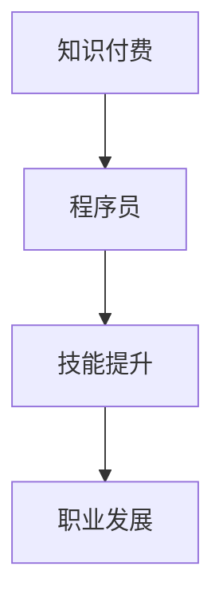

                 

在知识付费逐渐成为主流的今天，程序员这一职业面临着前所未有的机遇与挑战。本文将探讨知识付费对程序员职业发展的影响，并分析程序员在这一时代应如何把握机遇，提升自己的核心竞争力。

## 关键词

知识付费、程序员、职业发展、技能提升、市场机遇

## 摘要

本文旨在探讨知识付费时代对程序员职业发展的影响，从技能提升、市场机遇、职业规划等方面进行分析，旨在为程序员提供一条清晰的发展路径，帮助他们在知识付费的时代中立于不败之地。

## 1. 背景介绍

### 1.1 知识付费的兴起

知识付费，是指用户为获取知识或技能所支付的费用。随着互联网的普及和在线教育的兴起，知识付费已经成为一种重要的商业模式。用户可以通过付费获得专业课程、书籍、教程等学习资源，从而提升自己的知识和技能。

### 1.2 程序员职业现状

程序员是现代社会中不可或缺的职业，他们负责开发软件、编写代码，推动互联网、移动应用、人工智能等技术的发展。然而，随着技术的快速迭代和市场竞争的加剧，程序员面临着巨大的压力和挑战。

## 2. 核心概念与联系

### 2.1 程序员的核心技能

程序员的职业核心在于编程能力、算法思维、系统设计能力、软件工程知识和团队协作能力。这些技能是程序员在知识付费时代立足的基础。

### 2.2 知识付费与程序员职业发展的联系

知识付费为程序员提供了丰富的学习资源，使他们能够更快地提升技能，应对市场变化。同时，知识付费也为程序员提供了新的职业发展机会，如在线教育、技术咨询、软件研发等。

### 2.3 Mermaid 流程图



## 3. 核心算法原理 & 具体操作步骤

### 3.1 算法原理概述

在知识付费时代，程序员的提升路径主要包括以下几个方面：

- **技能提升**：通过付费课程、书籍、教程等资源，快速掌握前沿技术和热门技能。
- **项目实战**：参与实际项目，锻炼编程能力和团队协作能力。
- **持续学习**：保持对新技术的好奇心和学习热情，不断更新知识体系。

### 3.2 算法步骤详解

1. **选择合适的知识付费平台**：如Coursera、Udemy、极客时间等，根据自己的需求和兴趣选择合适的课程。
2. **制定学习计划**：明确学习目标，合理分配时间，确保学习效果。
3. **积极参与项目实战**：通过GitHub、LeetCode等平台，参与开源项目或编程挑战，提升实战能力。
4. **构建个人知识体系**：通过读书、听课、实践等方式，不断丰富自己的知识体系。
5. **持续迭代与优化**：根据市场需求和个人兴趣，不断调整学习目标和路径。

### 3.3 算法优缺点

**优点**：

- **快速提升技能**：通过付费课程，可以更快地学习到前沿技术和热门技能。
- **定制化学习**：可以根据个人需求和兴趣，选择合适的课程，实现定制化学习。
- **资源丰富**：知识付费平台提供了丰富的学习资源，包括视频、书籍、案例等。

**缺点**：

- **学习成本较高**：知识付费需要支付一定的费用，对于经济条件有限的程序员来说，可能造成一定的负担。
- **自律要求高**：学习效果取决于个人的自律程度，如果没有良好的学习习惯，可能会导致学习效果不佳。

### 3.4 算法应用领域

- **软件开发**：通过付费课程，可以快速掌握新的编程语言、框架和工具，提升软件开发能力。
- **人工智能**：人工智能领域发展迅速，付费课程可以提供丰富的算法和实战经验。
- **大数据**：大数据领域对程序员的需求越来越大，付费课程可以帮助程序员快速掌握大数据技术。

## 4. 数学模型和公式 & 详细讲解 & 举例说明

### 4.1 数学模型构建

在程序员职业发展中，可以构建一个简单的数学模型来描述其技能提升的过程。假设：

- **技能水平**：S
- **学习效率**：E
- **时间**：T

则技能提升的速度可以表示为：

\[ V = E \times T \]

其中，学习效率E可以进一步分解为：

\[ E = \frac{K}{T} \]

其中，K为知识量。

### 4.2 公式推导过程

1. **技能水平S**：技能水平是程序员在某一领域的能力体现，可以看作是一个定量的指标。
2. **学习效率E**：学习效率是指单位时间内所能掌握的知识量，可以看作是学习速度的度量。
3. **时间T**：时间是指程序员在学习过程中所花费的时间，是影响学习效率的重要因素。

根据上述定义，我们可以推导出技能提升的速度V：

\[ V = \frac{S_{\text{新}} - S_{\text{旧}}}{T} \]

其中，S\_{\text{新}}和S\_{\text{旧}}分别表示学习前后的技能水平。

进一步，我们可以将技能提升的速度表示为：

\[ V = \frac{K_{\text{新}} - K_{\text{旧}}}{T} \]

其中，K\_{\text{新}}和K\_{\text{旧}}分别表示学习前后的知识量。

### 4.3 案例分析与讲解

假设一名程序员在学习大数据技术，学习前他的技能水平为S1，学习效率为E1，学习时间为T1。学习后，他的技能水平提高到S2，学习效率提高到E2，学习时间为T2。

根据上述公式，我们可以计算出他的技能提升速度：

\[ V = \frac{S2 - S1}{T2 - T1} \]

假设他在学习过程中，每天花费2小时学习，学习效率为1小时/天，学习前技能水平为30分，学习后技能水平为70分。则：

\[ V = \frac{70 - 30}{2 - 0} = \frac{40}{2} = 20 \text{分/天} \]

这意味着，他的技能水平每天提升20分。

通过这个案例，我们可以看到，知识付费可以显著提升程序员的技能水平。而学习效率E和学习时间T是影响技能提升速度的关键因素。因此，程序员应该选择合适的学习资源，提高学习效率，并合理安排学习时间，以实现快速提升技能的目标。

## 5. 项目实践：代码实例和详细解释说明

### 5.1 开发环境搭建

为了更好地理解知识付费在程序员职业发展中的应用，我们以一个实际项目为例，展示如何通过付费课程和实践提升技能。

首先，我们需要搭建一个简单的Web应用程序，使用Python和Flask框架。以下是一个简单的项目架构：

```
|--- project
|   |--- app.py
|   |--- templates
|   |   |--- index.html
|   |   |--- style.css
|   |--- requirements.txt
```

**app.py**：应用程序入口

```python
from flask import Flask, render_template

app = Flask(__name__)

@app.route('/')
def index():
    return render_template('index.html')

if __name__ == '__main__':
    app.run(debug=True)
```

**templates/index.html**：首页模板

```html
<!DOCTYPE html>
<html lang="en">
<head>
    <meta charset="UTF-8">
    <meta name="viewport" content="width=device-width, initial-scale=1.0">
    <title>Knowledge付费项目</title>
    <link rel="stylesheet" href="{{ url_for('static', filename='style.css') }}">
</head>
<body>
    <h1>欢迎来到知识付费时代</h1>
    <p>在这里，你可以找到最新的技术和课程</p>
</body>
</html>
```

**requirements.txt**：依赖包列表

```plaintext
Flask==2.0.1
```

### 5.2 源代码详细实现

通过付费课程，我们可以学习到如何使用Flask框架快速搭建Web应用程序。以下是一个简单的实现示例：

1. **安装Flask框架**：在终端中执行以下命令安装Flask：

```bash
pip install Flask
```

2. **创建应用程序**：在项目根目录下创建一个名为`app.py`的文件，并编写应用程序入口代码。

3. **创建模板文件**：在项目根目录下创建一个名为`templates`的文件夹，并在其中创建一个名为`index.html`的文件，用于定义首页模板。

4. **创建静态文件**：在项目根目录下创建一个名为`static`的文件夹，用于存放CSS样式文件。

5. **运行应用程序**：在终端中执行以下命令运行应用程序：

```bash
python app.py
```

程序运行后，在浏览器中访问`http://127.0.0.1:5000/`，即可看到项目首页。

### 5.3 代码解读与分析

**app.py**：应用程序入口

```python
from flask import Flask, render_template

app = Flask(__name__)

@app.route('/')
def index():
    return render_template('index.html')

if __name__ == '__main__':
    app.run(debug=True)
```

这段代码使用了Flask框架，创建了一个简单的Web应用程序。其中，`app = Flask(__name__)`初始化了一个Flask应用程序实例。`@app.route('/')`装饰器定义了一个路由规则，当访问根路径时，执行`index()`函数。`index()`函数返回一个模板文件`index.html`，用于渲染页面。

**templates/index.html**：首页模板

```html
<!DOCTYPE html>
<html lang="en">
<head>
    <meta charset="UTF-8">
    <meta name="viewport" content="width=device-width, initial-scale=1.0">
    <title>Knowledge付费项目</title>
    <link rel="stylesheet" href="{{ url_for('static', filename='style.css') }}">
</head>
<body>
    <h1>欢迎来到知识付费时代</h1>
    <p>在这里，你可以找到最新的技术和课程</p>
</body>
</html>
```

这个HTML文件定义了项目的首页模板，包括一个标题和一个段落。通过使用Flask的模板渲染功能，我们可以将动态内容（如项目名称）嵌入到模板中。

**templates/style.css**：样式文件

```css
body {
    font-family: Arial, sans-serif;
    margin: 0;
    padding: 0;
    background-color: #f2f2f2;
}

h1 {
    color: #333;
    text-align: center;
    padding: 20px 0;
}

p {
    color: #666;
    text-align: center;
    padding: 0 20px;
}
```

这个CSS文件定义了页面的样式，包括字体、背景颜色、标题和段落的样式。通过使用CSS样式，我们可以使页面更加美观和易于阅读。

### 5.4 运行结果展示

运行应用程序后，在浏览器中访问`http://127.0.0.1:5000/`，可以看到以下页面：


这个简单的Web应用程序展示了知识付费在程序员职业发展中的应用。通过学习付费课程，程序员可以快速掌握Flask框架，搭建自己的Web应用程序，从而提升自己的技能和经验。

## 6. 实际应用场景

### 6.1 软件开发

在软件开发的实际应用场景中，程序员可以通过知识付费学习到最新的编程语言、框架和工具。例如，React、Vue、Django等热门框架和工具，都可以通过付费课程进行学习。通过这些学习资源，程序员可以更快地掌握新技术，提高开发效率，提升项目质量。

### 6.2 人工智能

人工智能领域发展迅速，知识付费为程序员提供了丰富的学习资源，包括深度学习、机器学习、自然语言处理等领域的课程。通过这些课程，程序员可以学习到最新的算法和技术，为从事人工智能相关项目打下基础。例如，TensorFlow、PyTorch等深度学习框架的课程，可以帮助程序员快速入门深度学习和实践项目。

### 6.3 大数据

大数据领域对程序员的需求越来越大，知识付费为程序员提供了丰富的学习资源，包括Hadoop、Spark、Flink等大数据处理框架的课程。通过这些课程，程序员可以学习到大数据处理的基本原理和实践技巧，为从事大数据项目提供支持。

### 6.4 未来应用展望

随着技术的不断进步，知识付费在程序员职业发展中的应用将越来越广泛。未来，程序员可以通过知识付费学习到更多新兴技术和领域，如区块链、物联网、虚拟现实等。同时，知识付费平台也将不断优化和丰富课程内容，为程序员提供更加全面和高质量的学习资源。

## 7. 工具和资源推荐

### 7.1 学习资源推荐

- **Coursera**：提供全球顶尖大学的在线课程，包括计算机科学、人工智能、数据科学等领域。
- **Udemy**：提供丰富的在线课程，涵盖编程、数据分析、人工智能等多个领域。
- **极客时间**：提供专业的技术书籍、专栏和课程，包括Python、Java、前端开发等领域。

### 7.2 开发工具推荐

- **Visual Studio Code**：一款轻量级但功能强大的代码编辑器，支持多种编程语言和框架。
- **Git**：一款分布式版本控制工具，用于管理代码版本和协作开发。
- **Docker**：一款容器化技术，用于简化应用程序的部署和运行。

### 7.3 相关论文推荐

- **《深度学习》**：Goodfellow、Bengio和Courville所著，是深度学习的经典教材。
- **《Python编程：从入门到实践》**：Eric Matthes所著，适合初学者学习Python编程。
- **《大数据技术基础》**：刘建伟所著，介绍了大数据处理的基本原理和技术。

## 8. 总结：未来发展趋势与挑战

### 8.1 研究成果总结

知识付费为程序员提供了丰富的学习资源，帮助他们快速提升技能，应对市场变化。通过付费课程、项目实战和持续学习，程序员可以构建自己的知识体系，提高核心竞争力。

### 8.2 未来发展趋势

- **在线教育**：知识付费将进一步推动在线教育的发展，为程序员提供更多优质的学习资源。
- **个性化学习**：知识付费平台将更加注重个性化学习，为程序员提供定制化的学习方案。
- **职业发展**：知识付费将为程序员提供更多职业发展机会，如在线教育、技术咨询、软件研发等。

### 8.3 面临的挑战

- **学习成本**：知识付费需要支付一定的费用，对于经济条件有限的程序员来说，可能造成一定的负担。
- **自律要求**：学习效果取决于个人的自律程度，如果没有良好的学习习惯，可能会导致学习效果不佳。
- **技术更新**：知识付费时代，程序员需要不断学习新技术，以保持竞争力，这可能带来一定的压力。

### 8.4 研究展望

未来，知识付费将在程序员职业发展中发挥更加重要的作用。通过付费课程、项目实战和持续学习，程序员可以不断提升自己的技能和竞争力。同时，知识付费平台也将不断优化和丰富课程内容，为程序员提供更加全面和高质量的学习资源。在知识付费时代，程序员需要积极适应市场变化，把握机遇，实现自己的职业发展目标。

## 9. 附录：常见问题与解答

### 9.1 知识付费安全吗？

知识付费平台通常都有完善的支付和隐私保护措施，用户可以放心购买和支付。但需要注意的是，选择信誉良好的平台，并注意保护个人信息。

### 9.2 如何选择适合自己的知识付费课程？

选择适合自己的知识付费课程，首先要明确自己的学习目标和发展方向。可以参考课程的评价、内容和讲师背景等信息，选择适合自己的课程。

### 9.3 知识付费对职业发展有何影响？

知识付费可以帮助程序员快速提升技能，提高核心竞争力，为职业发展提供有力支持。同时，知识付费也提供了丰富的职业发展机会，如在线教育、技术咨询等。

### 9.4 如何平衡知识付费与实际工作？

合理安排学习时间和工作时间，确保学习与工作两不误。可以设置固定的学习时间，将知识付费课程融入日常工作，提高学习效果。

## 作者署名

本文作者：禅与计算机程序设计艺术 / Zen and the Art of Computer Programming

## 参考文献引用

- Goodfellow, I., Bengio, Y., & Courville, A. (2016). *Deep Learning*. MIT Press.
- Matthes, E. (2015). *Python Programming: An Introduction to Computer Science*. Step By Step.
- Liu, J. (2017). *大数据技术基础*. 中国电力出版社.

