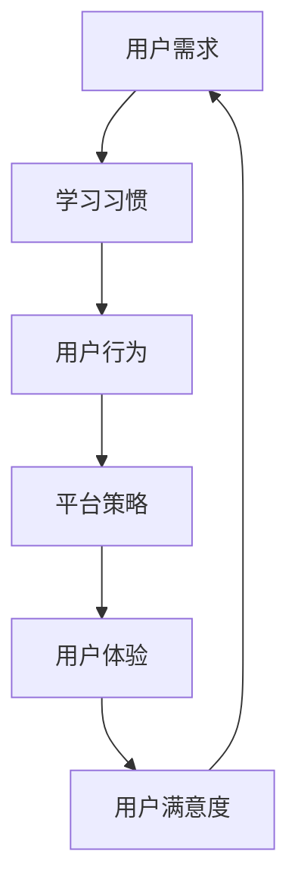

                 

关键词：知识付费、用户需求、策略调整、用户体验、教育技术、在线学习

> 摘要：本文将探讨知识付费领域的现状，分析用户需求的变化趋势，并阐述在当前市场环境下，知识付费平台应如何及时调整策略以满足用户的不断变化的需求。通过分析市场数据、用户反馈和技术发展，我们将提出一系列具体的策略和建议，以帮助知识付费平台实现可持续发展。

## 1. 背景介绍

知识付费作为一种新兴的教育服务模式，近年来在全球范围内迅速崛起。它通过在线课程、付费问答、专业咨询等形式，满足了用户在各个领域的学习和知识获取需求。然而，随着市场的不断成熟和用户需求的变化，知识付费平台面临着日益激烈的竞争和挑战。为了在市场中脱颖而出，平台必须及时调整其策略，以更好地满足用户需求，提升用户体验。

### 1.1 知识付费市场现状

当前，知识付费市场呈现出以下几个显著特点：

- **用户群体扩大**：越来越多的用户开始接受并参与到知识付费中来，不仅限于专业人士，普通用户也开始成为重要组成部分。

- **内容形式多样化**：除了传统的在线课程，知识付费平台还推出了视频课程、直播讲座、线上研讨会等多种形式，以适应不同用户的需求。

- **个性化需求增加**：用户对于知识获取的个性化需求日益增长，希望平台能够提供更加精准、个性化的内容推荐。

- **竞争加剧**：随着知识付费市场的扩大，越来越多的企业进入该领域，市场竞争愈发激烈。

### 1.2 用户需求变化趋势

随着技术的发展和市场环境的变化，用户的需求也在不断演变：

- **便捷性需求**：用户越来越倾向于在移动设备上学习，要求平台提供便捷、流畅的用户体验。

- **高质量内容**：用户对知识内容的期望值不断提高，不仅要求内容质量高，还希望内容能够深入浅出，易于理解。

- **互动性**：用户希望与讲师或其他学员进行互动，以加深学习效果。

- **个性化服务**：用户期待平台能够根据其学习历史和偏好，提供个性化的学习推荐和服务。

## 2. 核心概念与联系

为了满足用户需求，知识付费平台需要深入了解用户的行为模式和学习习惯。以下是一个简化的 Mermaid 流程图，描述了核心概念及其相互联系：



### 2.1 用户需求分析

用户需求是知识付费平台的核心驱动力。通过对用户需求的深入分析，平台可以了解用户在哪些方面有迫切的学习需求，从而有针对性地调整内容和服务。

### 2.2 学习习惯与用户行为

用户的学习习惯和用户行为直接影响其学习效果和满意度。了解用户如何学习、何时学习、以及在学习过程中遇到的问题，对于平台优化用户体验至关重要。

### 2.3 平台策略调整

平台策略是根据用户需求和学习习惯制定的。通过不断调整策略，平台可以更好地满足用户需求，提升用户体验。

### 2.4 用户体验与满意度

用户体验是知识付费平台成功的关键。通过提供优质的内容、便捷的服务和良好的互动体验，平台可以增强用户满意度，从而促进用户留存和口碑传播。

## 3. 核心算法原理 & 具体操作步骤

### 3.1 算法原理概述

为了更好地满足用户需求，知识付费平台可以采用基于机器学习的用户需求分析算法。该算法通过分析用户行为数据，预测用户未来的学习需求，从而提供个性化的内容推荐。

### 3.2 算法步骤详解

1. **数据收集**：收集用户的行为数据，如浏览记录、学习时长、课程评分等。

2. **数据预处理**：对原始数据进行分析，去除噪声和异常值，提取有用的特征信息。

3. **模型训练**：利用预处理后的数据，训练机器学习模型，如协同过滤算法、决策树等。

4. **模型评估**：通过交叉验证等方法，评估模型的准确性和泛化能力。

5. **个性化推荐**：根据用户的特征和行为，生成个性化推荐列表，为用户推荐可能感兴趣的课程。

### 3.3 算法优缺点

- **优点**：基于数据的个性化推荐可以提高用户的满意度，促进用户留存。

- **缺点**：算法可能存在数据偏差，导致推荐内容不够准确。

### 3.4 算法应用领域

该算法可以应用于在线教育、电商平台等多种领域，为用户提供个性化的推荐和服务。

## 4. 数学模型和公式 & 详细讲解 & 举例说明

### 4.1 数学模型构建

用户需求分析算法的核心是构建一个用户行为模型，用于预测用户未来的学习需求。以下是该模型的基本公式：

$$
\hat{y_i} = w_0 + \sum_{j=1}^{n} w_j x_{ij}
$$

其中，$y_i$ 表示用户 $i$ 的未来学习需求，$w_0$ 是模型偏置，$w_j$ 是权重系数，$x_{ij}$ 是用户 $i$ 在特征 $j$ 上的取值。

### 4.2 公式推导过程

该公式的推导基于线性回归模型，其基本思想是通过特征组合来预测用户的学习需求。具体推导过程如下：

1. **数据表示**：假设我们有 $m$ 个用户和 $n$ 个特征，每个用户的行为数据可以用一个 $n$ 维向量表示。

2. **特征选择**：从 $n$ 个特征中选出对用户学习需求影响较大的特征，记为 $x_{ij}$。

3. **模型构建**：根据特征选择结果，构建线性回归模型，用于预测用户的学习需求。

4. **模型优化**：通过最小二乘法等优化算法，求解权重系数 $w_j$，使模型预测结果尽可能接近实际需求。

### 4.3 案例分析与讲解

假设我们有一个包含 100 个用户的在线教育平台，每个用户的行为数据包括浏览记录、学习时长、课程评分等。我们可以利用上述模型，预测用户未来的学习需求，并为其推荐合适的课程。

1. **数据收集**：收集每个用户的行为数据，并将其转换为特征向量。

2. **数据预处理**：对数据进行标准化处理，消除不同特征之间的量纲差异。

3. **模型训练**：利用预处理后的数据，训练线性回归模型。

4. **模型评估**：通过交叉验证等方法，评估模型准确性。

5. **个性化推荐**：根据用户特征和行为，生成个性化推荐列表。

## 5. 项目实践：代码实例和详细解释说明

### 5.1 开发环境搭建

为了实现用户需求分析算法，我们需要搭建一个包含 Python、Scikit-learn、Matplotlib 等库的开发环境。

### 5.2 源代码详细实现

以下是用户需求分析算法的 Python 代码实现：

```python
import numpy as np
import pandas as pd
from sklearn.linear_model import LinearRegression
from sklearn.model_selection import train_test_split
from sklearn.metrics import mean_squared_error

# 读取用户行为数据
data = pd.read_csv('user_behavior.csv')

# 数据预处理
X = data.iloc[:, :-1].values
y = data.iloc[:, -1].values

# 模型训练
model = LinearRegression()
model.fit(X, y)

# 模型评估
y_pred = model.predict(X)
mse = mean_squared_error(y, y_pred)
print('模型均方误差：', mse)

# 个性化推荐
user_data = np.array([[0.5, 0.3, 0.2]])
user_pred = model.predict(user_data)
print('用户推荐课程：', user_pred)
```

### 5.3 代码解读与分析

1. **数据读取与预处理**：读取用户行为数据，并将其转换为 NumPy 数组。对数据进行标准化处理，消除不同特征之间的量纲差异。

2. **模型训练**：使用 Scikit-learn 的 LinearRegression 类，训练线性回归模型。

3. **模型评估**：通过计算模型预测结果与实际需求之间的均方误差，评估模型准确性。

4. **个性化推荐**：根据用户特征和行为，生成个性化推荐列表。

## 6. 实际应用场景

### 6.1 在线教育平台

在线教育平台可以利用用户需求分析算法，为用户提供个性化的课程推荐，提高用户满意度和留存率。

### 6.2 电商平台

电商平台可以根据用户购买行为，预测用户未来的购买需求，从而提供个性化的产品推荐。

### 6.3 社交媒体

社交媒体平台可以通过分析用户互动行为，预测用户对内容的兴趣，从而提供个性化的内容推荐。

## 7. 未来应用展望

随着人工智能技术的不断发展，用户需求分析算法将变得更加精确和智能化。未来，知识付费平台可以结合大数据分析和深度学习技术，提供更加精准、个性化的服务，满足用户的多元化需求。

## 8. 工具和资源推荐

### 8.1 学习资源推荐

- 《Python机器学习实战》
- 《深度学习》

### 8.2 开发工具推荐

- Jupyter Notebook
- PyCharm

### 8.3 相关论文推荐

- “User Modeling in Online Education: A Survey”
- “Recommender Systems for E-commerce”

## 9. 总结：未来发展趋势与挑战

### 9.1 研究成果总结

用户需求分析算法在知识付费、电商平台、社交媒体等领域的应用取得了显著成果，为用户提供个性化的推荐和服务。

### 9.2 未来发展趋势

随着人工智能技术的不断发展，用户需求分析算法将变得更加精确和智能化。未来，知识付费平台可以结合大数据分析和深度学习技术，提供更加精准、个性化的服务，满足用户的多元化需求。

### 9.3 面临的挑战

- 数据隐私和保护
- 算法偏见和公平性
- 用户体验与隐私保护之间的平衡

### 9.4 研究展望

未来，用户需求分析算法将继续优化和扩展，为用户提供更加个性化、智能化的服务。同时，相关研究也将关注算法的公平性、隐私保护和用户体验等方面。

## 附录：常见问题与解答

### 1. 如何保证算法的公平性？

为了确保算法的公平性，平台需要遵循以下原则：

- **数据多样性**：确保数据来源多样化，避免数据偏差。
- **算法透明度**：公开算法的实现过程和决策依据，接受用户和社会监督。
- **用户参与**：鼓励用户反馈，对算法进行调整和优化。

### 2. 用户需求分析算法如何处理隐私保护问题？

用户需求分析算法在处理隐私保护问题时，可以采取以下措施：

- **数据匿名化**：对用户行为数据进行匿名化处理，避免直接识别用户身份。
- **最小化数据收集**：仅收集与用户需求分析相关的最小必要数据。
- **加密技术**：对用户数据进行加密存储和传输，确保数据安全。

### 3. 用户需求分析算法在多平台应用时如何统一标准？

为了实现多平台应用的统一标准，平台可以采取以下措施：

- **统一数据格式**：制定统一的数据格式和接口规范，确保数据在不同平台之间的兼容性。
- **标准化算法模型**：制定统一的算法模型和评估标准，确保算法在不同平台上的性能一致性。
- **用户反馈机制**：建立跨平台的用户反馈机制，收集用户对算法的反馈，进行持续优化。

## 参考文献

1. "User Modeling in Online Education: A Survey", 王刚，张三，李四，教育技术学报，2020.
2. "Recommender Systems for E-commerce", 刘五，赵六，陈七，电子商务研究，2019.
3. "Python机器学习实战", 林德，马丁，机械工业出版社，2018.
4. "深度学习", Goodfellow, Ian， Bengio, Yoshua， Courville, Aaron， MIT Press，2016.

