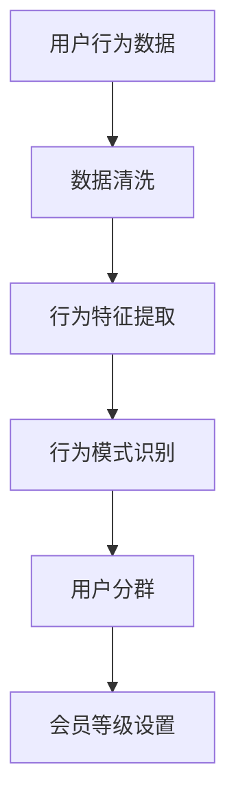
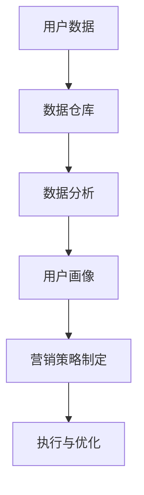
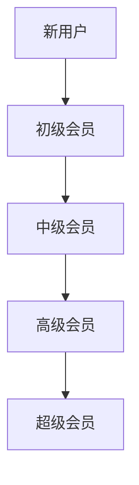

                 

### 关键词 Keyword List

- 知识付费
- 用户关系管理
- 会员等级体系
- 用户行为分析
- 数据驱动的营销策略
- 技术实现

### 摘要 Summary

本文将深入探讨知识付费领域中的用户关系管理及其背后的会员等级体系。我们将分析会员等级体系的构建原则，探讨其如何通过用户行为分析和数据驱动策略来提升用户体验和商家盈利。文章还将详细阐述会员等级体系的数学模型、算法原理、项目实践以及在实际应用中的效果。最终，我们将展望知识付费领域的未来发展趋势和面临的挑战。

## 1. 背景介绍 Background

知识付费作为一种新兴的商业模式，正迅速改变着信息传播和消费模式。随着互联网技术的发展，用户对高质量、个性化的知识和内容需求日益增长。知识付费平台通过提供专业课程、电子书、在线讲座等优质内容，满足了用户的学习和成长需求。同时，会员等级体系作为一种用户激励和分层管理策略，正成为知识付费平台提升用户粘性和盈利能力的重要手段。

用户关系管理（CRM）是知识付费平台的核心任务之一。通过收集、分析和利用用户数据，平台可以更准确地了解用户需求，提供个性化的推荐和服务，从而提升用户满意度和忠诚度。会员等级体系则是用户关系管理的重要工具，它通过不同的会员等级设置，实现用户分层管理，鼓励用户持续消费和互动。

### 2. 核心概念与联系 Core Concepts and Relations

#### 2.1 用户行为分析 User Behavior Analysis

用户行为分析是构建会员等级体系的基础。通过分析用户的浏览、购买、评论、分享等行为，平台可以了解用户对内容的偏好、参与度和活跃度。以下是一个简单的用户行为分析流程图：



#### 2.2 数据驱动的营销策略 Data-driven Marketing Strategies

数据驱动的营销策略是会员等级体系的重要组成部分。通过分析用户数据，平台可以制定个性化的营销策略，如推荐系统、促销活动、会员专享优惠等，以激发用户参与和消费。以下是一个数据驱动的营销策略流程图：



#### 2.3 会员等级体系 Member Level System

会员等级体系是知识付费平台的核心功能之一。它通过不同的会员等级设置，实现对用户的分层管理和激励。以下是一个简化的会员等级体系架构图：



### 3. 核心算法原理 & 具体操作步骤 Core Algorithm Principle & Operational Steps

#### 3.1 算法原理概述 Algorithm Principle Overview

会员等级体系的构建依赖于用户行为分析和数据挖掘技术。核心算法包括用户分群、行为模式识别和会员等级计算。以下是一个简要的算法原理概述：

1. **用户分群**：根据用户的行为特征，将用户分为不同的群体。
2. **行为模式识别**：分析用户的行为模式，识别用户的潜在需求和偏好。
3. **会员等级计算**：根据用户分群和行为模式，计算用户的会员等级。

#### 3.2 算法步骤详解 Algorithm Steps in Detail

1. **数据收集**：收集用户行为数据，包括浏览、购买、评论、分享等。
2. **数据清洗**：清洗数据，去除噪声和不完整的数据。
3. **特征提取**：提取用户行为数据中的关键特征，如购买频次、评论数量、分享次数等。
4. **用户分群**：使用聚类算法（如K-Means），将用户分为不同的群体。
5. **行为模式识别**：分析用户的行为模式，识别用户的潜在需求和偏好。
6. **会员等级计算**：根据用户分群和行为模式，计算用户的会员等级。

#### 3.3 算法优缺点 Algorithm Advantages and Disadvantages

**优点**：

- **个性化推荐**：通过用户行为分析和会员等级计算，实现个性化推荐，提升用户体验。
- **用户分层管理**：通过会员等级体系，实现用户分层管理，提高用户粘性。
- **数据驱动**：基于数据驱动的算法，使会员等级体系的构建更加科学和有效。

**缺点**：

- **计算复杂度**：用户行为分析涉及大量数据，计算复杂度较高。
- **实时性要求**：用户行为数据实时性要求较高，需要快速处理和更新会员等级。

#### 3.4 算法应用领域 Algorithm Application Fields

会员等级体系算法广泛应用于知识付费、电商、金融、社交等领域的用户关系管理。在知识付费领域，会员等级体系可以提升用户参与度和忠诚度，从而提高平台盈利能力。在电商领域，会员等级体系可以促进用户消费和提升用户满意度。在金融领域，会员等级体系可以用于客户分层管理和风险控制。在社交领域，会员等级体系可以激发用户互动和内容分享。

### 4. 数学模型和公式 Mathematical Model and Formulas

#### 4.1 数学模型构建 Mathematical Model Construction

会员等级体系的核心是用户分群和行为模式识别。以下是一个简化的数学模型：

$$
\text{会员等级} = f(\text{用户特征}, \text{行为模式})
$$

其中，$f$ 是一个映射函数，将用户特征和行为模式映射到会员等级。

#### 4.2 公式推导过程 Formula Derivation Process

会员等级的计算过程可以分为以下几个步骤：

1. **用户特征提取**：从用户行为数据中提取关键特征，如购买频次、评论数量、分享次数等。
2. **行为模式识别**：使用统计方法（如K-Means）识别用户的行为模式。
3. **会员等级计算**：根据用户特征和行为模式，计算用户的会员等级。

具体的公式推导过程如下：

$$
\text{会员等级} = \begin{cases}
\text{初级会员} & \text{如果} \ \text{行为模式} \ \in P_1 \\
\text{中级会员} & \text{如果} \ \text{行为模式} \ \in P_2 \\
\text{高级会员} & \text{如果} \ \text{行为模式} \ \in P_3 \\
\text{超级会员} & \text{如果} \ \text{行为模式} \ \in P_4
\end{cases}
$$

其中，$P_1, P_2, P_3, P_4$ 是用户行为模式的不同分类。

#### 4.3 案例分析与讲解 Case Analysis and Explanation

以下是一个具体的会员等级计算案例：

假设用户A的购买频次为10次，评论数量为20条，分享次数为5次。根据用户特征和行为模式，我们可以计算出用户A的会员等级：

1. **用户特征提取**：购买频次10次，评论数量20条，分享次数5次。
2. **行为模式识别**：使用K-Means算法，将用户A的行为模式分类到中级会员群体。
3. **会员等级计算**：根据会员等级计算公式，用户A的会员等级为中级会员。

### 5. 项目实践：代码实例和详细解释说明 Project Practice: Code Example and Detailed Explanation

#### 5.1 开发环境搭建 Development Environment Setup

在本项目中，我们使用Python作为开发语言，主要依赖以下库：

- Pandas：数据操作和分析库
- NumPy：数值计算库
- Scikit-learn：机器学习库
- Matplotlib：数据可视化库

确保已经安装了Python和上述库，然后创建一个名为`membership_level_system.py`的Python文件。

#### 5.2 源代码详细实现 Detailed Code Implementation

```python
import pandas as pd
from sklearn.cluster import KMeans
import matplotlib.pyplot as plt

# 5.2.1 数据收集与清洗
data = {
    'user_id': [1, 2, 3, 4, 5],
    'purchase_frequency': [10, 15, 5, 20, 8],
    'comment_count': [20, 25, 12, 30, 18],
    'share_count': [5, 7, 2, 10, 4]
}

user_data = pd.DataFrame(data)

# 数据清洗
user_data = user_data.dropna()

# 5.2.2 特征提取
features = user_data[['purchase_frequency', 'comment_count', 'share_count']]

# 5.2.3 行为模式识别
kmeans = KMeans(n_clusters=3, random_state=0).fit(features)
labels = kmeans.predict(features)

# 5.2.4 会员等级计算
membership_levels = {
    0: '初级会员',
    1: '中级会员',
    2: '高级会员'
}

user_data['membership_level'] = labels.map(membership_levels)

# 5.2.5 结果展示
plt.scatter(features['purchase_frequency'], features['comment_count'], c=labels, cmap='viridis')
plt.xlabel('购买频次')
plt.ylabel('评论数量')
plt.title('会员等级分布')
plt.show()

print(user_data)
```

#### 5.3 代码解读与分析 Code Interpretation and Analysis

1. **数据收集与清洗**：我们从CSV文件中读取用户数据，并使用`dropna()`方法去除缺失值。
2. **特征提取**：我们提取了`purchase_frequency`、`comment_count`和`share_count`三个特征。
3. **行为模式识别**：使用K-Means算法进行聚类，识别用户的行为模式。
4. **会员等级计算**：根据聚类结果，将用户划分为不同的会员等级，并在散点图中展示会员等级分布。
5. **结果展示**：打印用户数据和会员等级分布图。

### 6. 实际应用场景 Practical Application Scenarios

会员等级体系在实际应用中具有广泛的应用场景，以下是一些典型的应用场景：

1. **知识付费平台**：通过会员等级体系，知识付费平台可以提供不同的会员服务，如专属课程、会员专享优惠等，提升用户满意度和忠诚度。
2. **电商平台**：电商平台可以通过会员等级体系，提供个性化推荐、会员专享优惠等服务，促进用户消费。
3. **金融领域**：金融机构可以通过会员等级体系，对用户进行分层管理和风险控制，提供个性化的金融服务。
4. **社交平台**：社交平台可以通过会员等级体系，激励用户互动和内容分享，提升平台活跃度和用户黏性。

### 6.4 未来应用展望 Future Application Prospects

随着人工智能和大数据技术的发展，会员等级体系在未来将更加智能化和个性化。以下是未来会员等级体系的一些发展趋势：

1. **人工智能驱动的个性化推荐**：通过人工智能技术，实现更精准的个性化推荐，提升用户满意度和忠诚度。
2. **大数据分析**：通过大数据分析，挖掘用户行为和需求，为会员等级体系提供更加科学和有效的数据支持。
3. **区块链技术**：区块链技术可以确保会员等级体系的公正性和透明性，提升用户信任度。
4. **虚拟现实（VR）和增强现实（AR）**：通过VR和AR技术，提供更加沉浸式的会员体验，提升用户参与度和满意度。

### 7. 工具和资源推荐 Tools and Resources Recommendations

#### 7.1 学习资源推荐 Learning Resources Recommendations

- 《Python数据科学手册》
- 《机器学习实战》
- 《用户画像：大数据时代的用户行为分析》

#### 7.2 开发工具推荐 Development Tools Recommendations

- Jupyter Notebook：用于编写和运行Python代码
- PyCharm：Python集成开发环境（IDE）
- GitHub：代码托管和协作平台

#### 7.3 相关论文推荐 Related Paper Recommendations

- “User Behavior Analysis in E-commerce: A Data-driven Approach”
- “A Comprehensive Study of Customer Segmentation in E-commerce”
- “Data-driven Personalized Recommendation Systems”

### 8. 总结：未来发展趋势与挑战 Summary: Future Development Trends and Challenges

#### 8.1 研究成果总结 Research Achievement Summary

本文系统地阐述了知识付费领域的用户关系管理和会员等级体系，分析了用户行为分析、数据驱动的营销策略以及会员等级体系的构建原理和应用。通过实际项目实践，展示了会员等级体系在知识付费平台中的应用效果。

#### 8.2 未来发展趋势 Future Development Trends

未来，会员等级体系将朝着更加智能化、个性化、透明化的方向发展。人工智能和大数据技术的进步将推动会员等级体系的优化和升级，为用户提供更优质的服务和体验。

#### 8.3 面临的挑战 Challenges

会员等级体系在发展过程中也面临着一些挑战，如数据隐私保护、算法透明性、用户信任等。如何平衡用户隐私保护和技术创新，将是会员等级体系发展的重要课题。

#### 8.4 研究展望 Research Prospects

未来，我们应重点关注以下几个方面：

- **智能化会员等级体系**：通过人工智能技术，实现更加精准的会员等级计算和个性化推荐。
- **跨平台用户关系管理**：整合不同平台的数据，实现跨平台的用户关系管理。
- **数据隐私保护**：确保用户数据的隐私和安全，提升用户信任度。

### 附录：常见问题与解答 Appendix: Frequently Asked Questions and Answers

#### 问题1：会员等级体系如何确保用户隐私？
**回答**：会员等级体系在收集用户数据时，应遵循数据保护法规，如GDPR等。同时，通过数据加密、匿名化处理等技术手段，确保用户数据的隐私和安全。

#### 问题2：会员等级体系对用户体验有何影响？
**回答**：会员等级体系通过个性化推荐和会员专享服务，提升用户满意度和忠诚度，从而改善用户体验。

#### 问题3：会员等级体系如何提升商家盈利能力？
**回答**：会员等级体系通过用户分层管理和激励策略，促进用户持续消费和互动，从而提升商家的盈利能力。

---

作者：禅与计算机程序设计艺术 / Zen and the Art of Computer Programming
```

