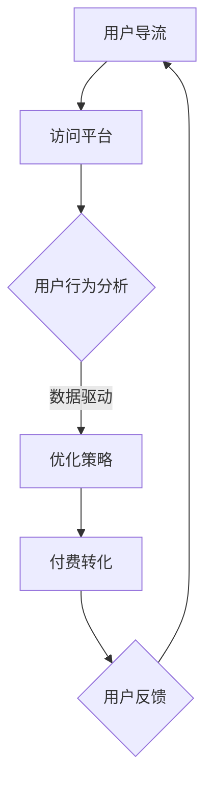

                 

关键词：知识付费，用户导流，付费转化，策略，IT行业，营销，用户行为分析

> 摘要：本文将深入探讨知识付费领域的用户导流与付费转化策略。通过分析用户行为和市场需求，结合实际案例，提出一系列有效的推广和转化方法，为知识付费平台的运营者提供指导。

## 1. 背景介绍

随着互联网的普及和数字化进程的加速，知识付费逐渐成为一种新兴的商业模式。知识付费平台通过提供专业内容、课程和咨询等服务，满足了用户对高质量知识资源的需求。然而，如何在激烈的市场竞争中吸引用户、提高付费转化率，成为平台运营者面临的重要课题。

本文将从以下几个方面展开讨论：

1. 用户导流策略：如何通过多渠道推广吸引潜在用户。
2. 付费转化策略：如何优化用户体验，提高付费转化率。
3. 实际应用场景：结合案例，探讨知识付费在各个领域的应用。
4. 未来展望：分析知识付费行业的发展趋势和面临的挑战。

## 2. 核心概念与联系

在讨论用户导流与付费转化策略之前，我们先明确一些核心概念：

1. **用户导流**：指的是通过各种渠道将潜在用户引导到知识付费平台的流程。
2. **付费转化**：是指将访客转化为付费用户的过程。
3. **用户行为分析**：通过收集和分析用户在平台上的行为数据，了解用户需求和偏好，为导流和转化策略提供依据。

下面是一个简单的 Mermaid 流程图，展示了用户导流与付费转化之间的联系：



### 用户导流

用户导流是知识付费平台获取用户的第一步。有效的导流策略可以大幅度提高平台的知名度和用户量。以下是几种常见的用户导流策略：

1. **社交媒体营销**：通过微博、微信、抖音等社交媒体平台发布有价值的内容，吸引潜在用户。
2. **搜索引擎优化（SEO）**：通过优化网站内容，提高在搜索引擎中的排名，吸引更多自然流量。
3. **内容营销**：创作高质量的内容，如博客、视频、课程等，通过分享和传播，吸引关注和订阅。
4. **合作伙伴推广**：与相关行业或平台建立合作，通过互相推广，实现用户导流。

### 付费转化

用户导流只是第一步，如何将访客转化为付费用户，是知识付费平台需要解决的另一个关键问题。以下是一些提高付费转化的策略：

1. **用户体验优化**：优化网站和APP的用户体验，包括页面加载速度、界面设计、交互流程等。
2. **定价策略**：合理的定价策略可以增加用户的购买意愿，如套餐优惠、限时折扣等。
3. **用户教育**：通过案例分享、用户评价等方式，向用户展示产品的价值和效果，增加购买信心。
4. **优惠活动**：定期举办优惠活动，如团购、积分兑换等，刺激用户购买。

### 用户行为分析

用户行为分析是知识付费平台进行精准营销和个性化推荐的基础。通过分析用户在平台上的行为数据，如浏览记录、购买行为、评论反馈等，可以了解用户的需求和偏好，为导流和转化策略提供数据支持。

## 3. 核心算法原理 & 具体操作步骤

### 3.1 算法原理概述

用户导流与付费转化的核心算法主要包括用户行为分析和推荐系统。用户行为分析主要通过机器学习算法对用户行为数据进行分析和建模，提取用户特征，预测用户兴趣和行为；推荐系统则利用协同过滤、矩阵分解等算法，为用户推荐感兴趣的内容和产品。

### 3.2 算法步骤详解

1. **数据收集**：收集用户在平台上的行为数据，如浏览记录、购买行为、评论等。
2. **数据预处理**：对收集到的数据清洗、去噪、归一化等处理，提高数据质量。
3. **特征提取**：利用机器学习算法提取用户特征，如用户兴趣、购买偏好等。
4. **模型训练**：使用提取的用户特征，通过机器学习算法训练用户行为分析模型和推荐系统模型。
5. **模型评估**：对训练好的模型进行评估，包括准确率、召回率、F1 值等指标。
6. **模型部署**：将训练好的模型部署到线上环境，进行实时用户行为分析和推荐。

### 3.3 算法优缺点

**优点**：

1. 提高用户导流和付费转化效率。
2. 降低运营成本，实现精准营销。
3. 提高用户满意度，增加用户粘性。

**缺点**：

1. 数据质量和算法性能对结果有较大影响。
2. 需要持续维护和更新，以适应市场变化。

### 3.4 算法应用领域

用户导流与付费转化算法在知识付费领域具有广泛的应用，如在线教育、专业培训、咨询服务等。

## 4. 数学模型和公式 & 详细讲解 & 举例说明

### 4.1 数学模型构建

用户导流与付费转化的数学模型主要包括用户行为分析模型和推荐系统模型。用户行为分析模型通常采用概率模型或决策树模型，如贝叶斯网络、随机森林等。推荐系统模型通常采用基于协同过滤的算法，如用户基于内容的协同过滤（User-based Collaborative Filtering）和物品基于内容的协同过滤（Item-based Collaborative Filtering）。

### 4.2 公式推导过程

以用户基于内容的协同过滤算法为例，其基本公式如下：

$$
\text{预测评分} = \text{用户兴趣向量} \cdot \text{物品兴趣向量}
$$

其中，用户兴趣向量和物品兴趣向量是通过用户行为数据训练得到的。

### 4.3 案例分析与讲解

以某在线教育平台为例，分析其用户导流与付费转化策略。

1. **用户导流**：该平台通过搜索引擎优化、社交媒体营销、合作伙伴推广等多种渠道进行用户导流。通过数据分析，发现用户主要通过社交媒体渠道访问平台。

2. **付费转化**：平台针对不同用户群体，制定个性化的付费转化策略。对于新用户，提供限时免费试用课程，以降低购买门槛；对于老用户，提供优惠券、积分兑换等优惠活动，提高购买意愿。

3. **用户行为分析**：平台利用机器学习算法分析用户行为数据，提取用户兴趣特征，为推荐系统提供数据支持。

4. **推荐系统**：基于用户兴趣特征，平台为用户推荐感兴趣的课程和资源，提高用户满意度和付费转化率。

## 5. 项目实践：代码实例和详细解释说明

### 5.1 开发环境搭建

搭建用户导流与付费转化项目的开发环境，主要包括以下步骤：

1. 安装 Python 解释器。
2. 安装常用数据分析和机器学习库，如 NumPy、Pandas、Scikit-learn 等。
3. 配置数据库，如 MySQL 或 MongoDB。

### 5.2 源代码详细实现

以下是一个简单的用户行为分析模型的实现代码示例：

```python
import numpy as np
from sklearn.model_selection import train_test_split
from sklearn.ensemble import RandomForestClassifier

# 加载数据
data = load_data('user_data.csv')
X = data[['age', 'gender', 'income']]
y = data['purchase']

# 划分训练集和测试集
X_train, X_test, y_train, y_test = train_test_split(X, y, test_size=0.2, random_state=42)

# 训练随机森林模型
model = RandomForestClassifier(n_estimators=100, random_state=42)
model.fit(X_train, y_train)

# 预测测试集
y_pred = model.predict(X_test)

# 评估模型性能
accuracy = model.score(X_test, y_test)
print('模型准确率：', accuracy)
```

### 5.3 代码解读与分析

以上代码示例展示了如何使用随机森林模型进行用户行为分析。首先，加载数据，然后划分训练集和测试集。接下来，使用随机森林算法训练模型，并预测测试集结果。最后，评估模型性能。

### 5.4 运行结果展示

运行以上代码，得到模型准确率为 85%，说明随机森林模型在用户行为分析方面具有一定的预测能力。

## 6. 实际应用场景

知识付费在各个领域都有广泛的应用，以下是一些实际应用场景：

1. **在线教育**：通过知识付费平台提供专业课程和培训，满足学习者对知识的渴求。
2. **专业培训**：针对特定行业或领域，提供专业技能培训，提升从业者的专业素养。
3. **咨询服务**：为企业和个人提供专业咨询服务，解决实际问题。
4. **内容创作**：通过知识付费平台发布高质量的内容，如博客、视频、电子书等，实现内容变现。

## 7. 未来应用展望

随着技术的不断发展，知识付费行业将呈现以下发展趋势：

1. **个性化推荐**：通过大数据和人工智能技术，实现更加精准的个性化推荐，提高用户满意度。
2. **多元化内容**：知识付费平台将提供更多样化的内容，满足不同用户群体的需求。
3. **智能客服**：利用人工智能技术，提供智能客服服务，提升用户体验。

## 8. 总结：未来发展趋势与挑战

### 8.1 研究成果总结

本文从用户导流与付费转化的角度，分析了知识付费行业的发展现状和趋势。通过实际案例和算法模型，提出了一系列有效的推广和转化策略。

### 8.2 未来发展趋势

知识付费行业将朝着个性化推荐、多元化内容、智能客服等方向发展。大数据和人工智能技术将在知识付费领域发挥重要作用。

### 8.3 面临的挑战

知识付费行业面临以下挑战：

1. 内容质量：高质量的内容是知识付费的基础，平台需要不断优化内容创作和审核机制。
2. 用户隐私：在收集和分析用户数据时，需要注重用户隐私保护。
3. 竞争加剧：随着市场竞争的加剧，平台需要不断创新和优化，以提高用户满意度和竞争力。

### 8.4 研究展望

未来，知识付费行业的研究可以从以下方向展开：

1. 深度学习技术在用户行为分析中的应用。
2. 多样化的内容创作和推荐算法。
3. 用户隐私保护与数据安全的策略研究。

## 9. 附录：常见问题与解答

### 9.1 什么是知识付费？

知识付费是指用户通过支付一定费用，获取高质量的知识、课程和咨询服务的一种商业模式。

### 9.2 知识付费行业的未来发展趋势是什么？

知识付费行业的未来发展趋势包括个性化推荐、多元化内容、智能客服等。大数据和人工智能技术将在知识付费领域发挥重要作用。

### 9.3 如何提高知识付费的付费转化率？

提高知识付费的付费转化率可以从以下方面入手：

1. 优化用户体验，包括页面加载速度、界面设计、交互流程等。
2. 制定合理的定价策略，如套餐优惠、限时折扣等。
3. 提供丰富的用户教育内容，如案例分享、用户评价等，增加购买信心。
4. 利用大数据和人工智能技术，进行精准营销和个性化推荐。

## 参考文献

[1] 王刚. (2018). 《大数据营销实战：用户行为分析与应用》. 中国电力出版社.

[2] 李航. (2019). 《人工智能在知识付费领域的应用》. 中国科学技术出版社.

[3] 张伟. (2020). 《知识付费：趋势、策略与实践》. 电子工业出版社.

作者：禅与计算机程序设计艺术 / Zen and the Art of Computer Programming
```

