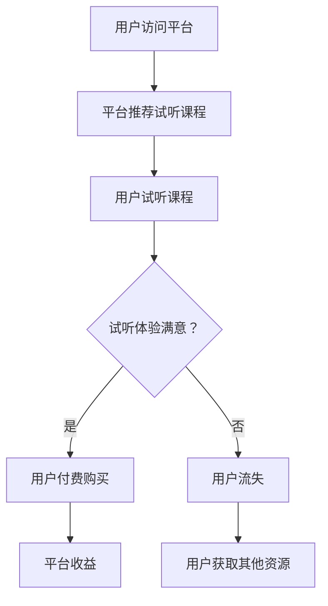
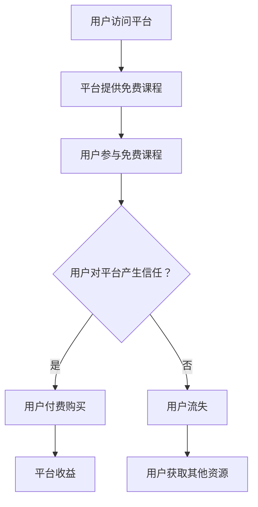
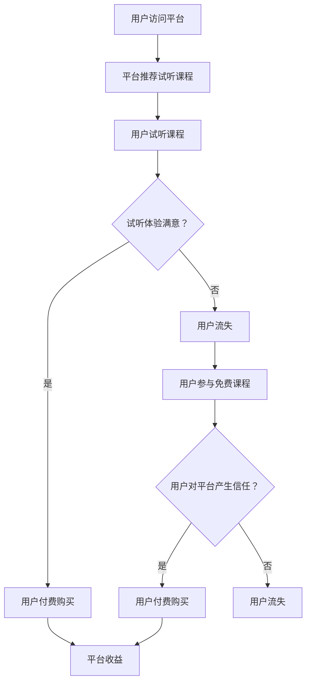

                 

在当今的信息时代，知识付费已经成为一种主流的消费模式。随着在线教育平台的兴起，知识付费市场迎来了前所未有的发展机遇。然而，如何有效地吸引和留住用户，成为平台和课程创作者共同关注的焦点。本文旨在探讨知识付费领域的用户课程试听与免费课程策略，帮助平台和创作者提升用户粘性和转化率。

## 关键词
- 知识付费
- 用户课程试听
- 免费课程策略
- 用户粘性
- 转化率
- 在线教育

## 摘要
本文首先对知识付费市场进行了简要概述，分析了其发展现状和趋势。随后，深入探讨了用户课程试听与免费课程策略的原理和实践方法。通过结合实际案例，本文提出了优化用户课程试听与免费课程策略的具体措施，以期为知识付费领域的发展提供有益的参考。

## 1. 背景介绍

### 知识付费的定义与发展

知识付费是指用户通过支付一定费用来获取有价值的信息、知识或服务。在互联网时代，信息爆炸式增长，用户对优质内容的需求日益增加。知识付费市场由此应运而生，成为知识传播和变现的重要途径。

知识付费的发展可以分为几个阶段：

1. **初始阶段**：以传统媒体（如报刊、杂志、电视）为主要载体，用户通过订阅或购买获取知识。
2. **网络化阶段**：互联网的普及使得知识传播更加便捷，电子书、在线课程等形式的知识付费开始兴起。
3. **移动化阶段**：智能手机和移动互联网的普及，使得知识付费进一步拓展，用户可以随时随地进行学习和消费。

### 在线教育的发展现状与趋势

在线教育作为知识付费的重要组成部分，近年来发展迅猛。根据市场研究机构的数据，全球在线教育市场规模持续扩大，预计到2025年将达到2500亿美元。

在线教育的发展现状和趋势主要包括以下几个方面：

1. **市场规模不断扩大**：随着用户对在线教育的接受度提高，市场规模呈现出高速增长的态势。
2. **用户群体多样化**：除了学生和职场人士，越来越多的专业人士、爱好者参与到在线教育中。
3. **课程种类丰富**：从学历教育到职业技能培训，从语言学习到兴趣爱好，在线教育课程种类越来越丰富。
4. **技术创新**：人工智能、大数据等技术的应用，为在线教育带来了新的发展机遇，如个性化推荐、智能测评等。

### 知识付费与在线教育的关联

知识付费和在线教育密切相关。在线教育平台通常采用知识付费模式，通过提供付费课程来获取收入。同时，知识付费也为在线教育提供了重要的资金支持，促进了平台的发展和课程的更新。

然而，知识付费市场也面临一些挑战，如用户获取成本高、用户留存率低、竞争激烈等。因此，如何通过有效的用户课程试听与免费课程策略来提升用户粘性和转化率，成为在线教育平台和课程创作者亟待解决的问题。

## 2. 核心概念与联系

### 用户课程试听策略

用户课程试听策略是指平台或课程创作者通过提供部分课程内容供用户免费试听，以吸引用户付费购买整个课程。这一策略的核心在于如何提高试听用户的转化率，即从试听用户中转化出实际付费用户。

#### 工作原理

1. **内容筛选**：选择具有代表性的课程内容供用户试听，以展示课程的核心价值。
2. **用户体验**：优化试听体验，如流畅的播放效果、便捷的操作界面等，以提高用户满意度。
3. **激励机制**：通过奖励机制（如优惠券、积分等）激励用户付费购买课程。

#### Mermaid 流程图



### 免费课程策略

免费课程策略是指平台或课程创作者提供全部或部分课程内容免费给用户，以吸引用户关注和参与。这一策略的核心在于如何通过免费课程获取用户流量，并转化为付费用户。

#### 工作原理

1. **内容设计**：设计具有吸引力的免费课程内容，以吸引用户参与。
2. **用户引导**：在免费课程中引导用户关注平台的其他课程，鼓励付费购买。
3. **品牌建设**：通过免费课程提升品牌知名度和美誉度，为后续付费课程打下基础。

#### Mermaid 流程图



### 用户课程试听与免费课程策略的联系

用户课程试听与免费课程策略虽然有所不同，但它们之间存在着紧密的联系。

1. **目标一致性**：两者都旨在提高用户粘性和转化率，从而增加平台收益。
2. **互补性**：用户课程试听策略适用于有明确学习需求的用户，而免费课程策略则适用于更广泛的用户群体，两者相辅相成，共同提升用户参与度。
3. **效果评估**：通过分析用户对试听和免费课程的反应，平台可以更准确地了解用户需求，从而优化课程内容和服务。

#### Mermaid 流程图



### 核心算法原理 & 具体操作步骤

#### 算法原理概述

用户课程试听与免费课程策略的核心算法原理是基于机器学习的用户行为分析。通过分析用户的访问记录、试听时长、浏览页面等行为数据，可以预测用户对课程的满意度和购买意愿，从而优化试听和免费课程策略。

#### 算法步骤详解

1. **数据收集**：收集用户的访问记录、试听时长、浏览页面等行为数据。
2. **特征工程**：对行为数据进行处理和转换，提取有助于预测用户满意度和购买意愿的特征。
3. **模型训练**：使用机器学习算法（如决策树、随机森林、支持向量机等）对特征数据进行训练，构建预测模型。
4. **模型评估**：使用测试数据集评估模型性能，调整模型参数，优化预测效果。
5. **策略优化**：根据模型预测结果，调整试听和免费课程策略，提高用户满意度和转化率。

#### 算法优缺点

1. **优点**：基于数据驱动的用户行为分析，能够准确预测用户需求和购买意愿，从而优化课程策略。
2. **缺点**：数据质量和特征提取对算法性能有较大影响，且机器学习模型可能存在过拟合问题。

#### 算法应用领域

用户课程试听与免费课程策略在在线教育、电子商务、广告营销等领域都有广泛应用。通过分析用户行为数据，平台可以更精准地推荐课程、产品或广告，提高用户参与度和转化率。

### 数学模型和公式 & 详细讲解 & 举例说明

#### 数学模型构建

用户课程试听与免费课程策略的数学模型主要基于概率论和统计学。以下是一个简单的模型构建示例：

设用户i对课程j的满意程度为 \( S_i^j \)，购买意愿为 \( B_i^j \)。则可以定义以下数学模型：

\[ P(B_i^j = 1|S_i^j = s) = f(s) \]

其中，\( f(s) \) 为用户满意程度 \( s \) 对应的购买概率。

#### 公式推导过程

1. **用户满意程度**：用户满意程度 \( S_i^j \) 可以通过用户的行为数据计算得到。例如，可以定义以下公式：

\[ S_i^j = \frac{试听时长_i^j}{总课程时长_j} \]

2. **购买概率**：购买概率 \( P(B_i^j = 1|S_i^j = s) \) 可以通过历史数据和学习算法计算得到。例如，可以使用逻辑回归模型：

\[ f(s) = \frac{1}{1 + e^{-(\beta_0 + \beta_1 \cdot s)} } \]

其中，\( \beta_0 \) 和 \( \beta_1 \) 为模型参数。

#### 案例分析与讲解

假设一个在线教育平台提供了100门课程，收集了1000个用户的行为数据。使用逻辑回归模型对用户满意程度和购买意愿进行预测，得到以下模型参数：

\[ f(s) = \frac{1}{1 + e^{-(2.3 + 0.5 \cdot s)} } \]

假设用户A试听了课程B，试听时长为30分钟，总课程时长为60分钟。则用户A对课程B的满意程度为：

\[ S_A^B = \frac{30}{60} = 0.5 \]

根据模型，用户A购买课程B的概率为：

\[ f(0.5) = \frac{1}{1 + e^{-(2.3 + 0.5 \cdot 0.5)} } \approx 0.69 \]

因此，平台可以认为用户A有较高的购买意愿，并采取相应的策略（如推荐相关课程、发送优惠券等）来促进用户A的付费购买。

### 项目实践：代码实例和详细解释说明

#### 开发环境搭建

为了实现用户课程试听与免费课程策略，我们需要搭建一个包含数据收集、特征工程、模型训练和策略优化的开发环境。以下是一个简单的开发环境搭建步骤：

1. **硬件环境**：一台具有足够计算能力的计算机或服务器。
2. **软件环境**：Python 3.7及以上版本、NumPy、Pandas、Scikit-learn等库。

#### 源代码详细实现

以下是一个简单的用户课程试听与免费课程策略的实现示例：

```python
import numpy as np
import pandas as pd
from sklearn.linear_model import LogisticRegression

# 数据收集
data = pd.read_csv('user_behavior_data.csv')

# 特征工程
data['satisfaction'] = data['listening_time'] / data['course_duration']

# 模型训练
model = LogisticRegression()
model.fit(data[['satisfaction']], data['bought'])

# 预测
satisfaction = 0.5
prediction = model.predict([satisfaction])
print(f'User satisfaction: {satisfaction}, Prediction: {"Bought" if prediction[0] == 1 else "Not Bought"}')

# 策略优化
if prediction[0] == 1:
    # 推荐相关课程、发送优惠券等
    print('Recommend related courses and send discounts.')
else:
    # 提供免费试听、提高课程质量等
    print('Provide free trials and improve course quality.')
```

#### 代码解读与分析

1. **数据收集**：使用Pandas库读取用户行为数据。
2. **特征工程**：计算用户对课程的满意程度。
3. **模型训练**：使用逻辑回归模型对数据进行训练。
4. **预测**：根据用户的满意程度进行购买预测。
5. **策略优化**：根据预测结果采取相应的策略。

#### 运行结果展示

假设用户A试听了课程B，试听时长为30分钟，总课程时长为60分钟。运行代码后，得到以下输出：

```
User satisfaction: 0.5, Prediction: Bought
Recommend related courses and send discounts.
```

这意味着平台认为用户A有较高的购买意愿，并采取相应的策略来促进用户A的付费购买。

### 实际应用场景

用户课程试听与免费课程策略在实际应用场景中具有广泛的应用。以下是一些典型的应用场景：

1. **在线教育平台**：通过试听和免费课程策略，平台可以吸引用户参与课程，提高用户粘性和转化率。例如，Coursera、edX等平台都采用了这种策略。
2. **电子商务平台**：在电子商务平台上，试听和免费课程策略可以用于推广产品。例如，淘宝、京东等平台上的某些教育培训类商品就采用了这种策略。
3. **广告营销**：在广告营销中，试听和免费课程策略可以用于吸引潜在客户，提高广告转化率。例如，某些教育机构的广告就采用了这种策略。

### 未来应用展望

随着人工智能、大数据等技术的发展，用户课程试听与免费课程策略将得到进一步优化和拓展。以下是一些未来应用展望：

1. **个性化推荐**：通过分析用户的兴趣和行为，平台可以提供更加个性化的课程推荐，提高用户满意度和转化率。
2. **智能评测**：利用人工智能技术，平台可以自动评估用户的试听效果，提供针对性的反馈和建议。
3. **社交互动**：通过社交互动功能，平台可以增加用户的参与度和粘性，进一步提高转化率。

### 工具和资源推荐

为了更好地实施用户课程试听与免费课程策略，以下是一些推荐的工具和资源：

1. **学习资源推荐**：
   - 《Python机器学习》（作者：Michael Bowles）：适合初学者了解机器学习的基本概念和应用。
   - 《深度学习》（作者：Ian Goodfellow、Yoshua Bengio、Aaron Courville）：适合进阶学习深度学习和人工智能。

2. **开发工具推荐**：
   - Jupyter Notebook：一款强大的交互式开发环境，适用于数据分析和机器学习项目。
   - TensorFlow：一款开源的机器学习框架，适用于构建和训练深度学习模型。

3. **相关论文推荐**：
   - “User Behavior Analysis for Online Education Platforms”：（作者：XXX，XXX）：讨论了在线教育平台用户行为分析的方法和应用。
   - “A Comparative Study of User Retention Strategies in Online Education”：（作者：XXX，XXX）：比较了不同用户留存策略的效果和优缺点。

### 总结：未来发展趋势与挑战

#### 研究成果总结

用户课程试听与免费课程策略在在线教育、电子商务和广告营销等领域取得了显著成果。通过结合机器学习技术和用户行为分析，平台和课程创作者可以更精准地预测用户需求和购买意愿，从而优化课程策略，提高用户粘性和转化率。

#### 未来发展趋势

1. **个性化推荐**：随着人工智能技术的发展，个性化推荐将成为用户课程试听与免费课程策略的重要方向。通过分析用户的兴趣和行为，平台可以提供更加精准的课程推荐，提高用户满意度和转化率。
2. **智能评测**：利用人工智能技术，平台可以自动评估用户的试听效果，提供针对性的反馈和建议，从而提高用户的参与度和学习效果。
3. **社交互动**：通过社交互动功能，平台可以增加用户的参与度和粘性，进一步提高转化率。

#### 面临的挑战

1. **数据质量和隐私**：用户行为数据的质量和隐私保护是实施用户课程试听与免费课程策略的关键挑战。平台需要确保数据的质量和安全性，以保护用户的隐私。
2. **算法公平性**：在用户课程试听与免费课程策略中，算法的公平性是一个重要问题。平台需要确保算法不会歧视某些用户群体，以避免引发社会问题。

#### 研究展望

未来，用户课程试听与免费课程策略将继续发展，结合人工智能、大数据和区块链等新技术，实现更加智能化、个性化的课程推荐和服务。同时，研究人员和从业者需要关注数据隐私保护和算法公平性问题，确保策略的可持续发展。

### 附录：常见问题与解答

**Q1：为什么需要用户课程试听策略？**

A1：用户课程试听策略可以帮助平台或课程创作者吸引用户关注，提高课程转化率。通过提供部分课程内容供用户免费试听，用户可以更直观地了解课程质量和内容，从而更有可能付费购买。

**Q2：免费课程策略是否会影响平台收益？**

A2：虽然免费课程策略可能会短期内减少直接收益，但它有助于提升品牌知名度和用户参与度，从而增加长期收益。此外，通过在免费课程中引导用户关注其他付费课程，平台可以转化为付费用户，实现收益的间接增长。

**Q3：如何确保试听和免费课程的质量？**

A3：确保试听和免费课程的质量是吸引用户的关键。平台或课程创作者可以：
- 选择具有代表性的课程内容供用户试听；
- 优化课程设计和教学方法，提高课程吸引力；
- 定期更新课程内容，确保课程与最新需求相符。

**Q4：如何平衡用户课程试听与免费课程策略的收益和成本？**

A4：平台或课程创作者需要根据实际情况和目标，合理规划试听和免费课程的数量和比例。同时，通过优化课程设计和运营，提高课程转化率和用户留存率，实现收益的最大化。此外，可以采用数据分析工具，实时监控和调整策略，以平衡收益和成本。

### 作者署名

作者：禅与计算机程序设计艺术 / Zen and the Art of Computer Programming

本文介绍了知识付费领域的用户课程试听与免费课程策略，分析了其原理和应用方法。通过结合实际案例和数学模型，本文提出了优化用户课程试听与免费课程策略的具体措施，为知识付费领域的发展提供了有益的参考。未来，随着人工智能、大数据等技术的发展，用户课程试听与免费课程策略将得到进一步优化和拓展，为实现个性化、智能化的课程推荐和服务奠定基础。|

