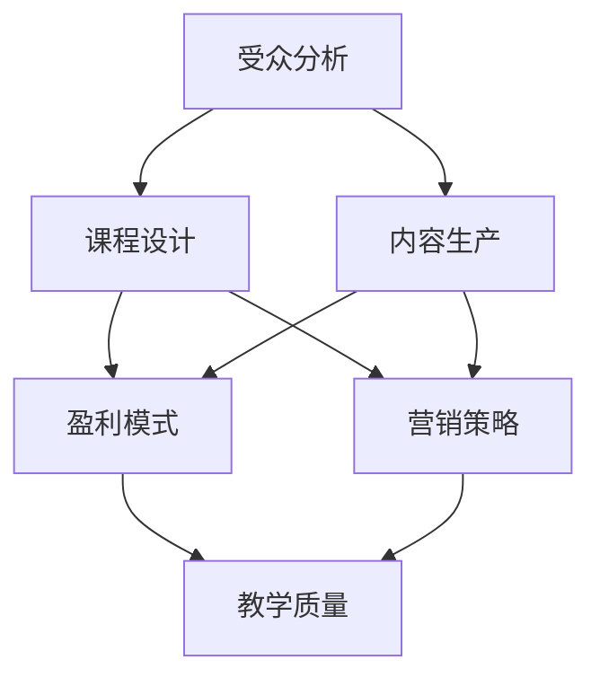

                 

关键词：知识付费、课程设计、内容生产、盈利模式、受众分析、营销策略、教学质量

> 摘要：本文将探讨知识付费领域的课程设计与内容生产。从受众分析、盈利模式、营销策略等方面入手，深入解析如何设计出吸引人的课程，并高效地生产有价值的内容，以实现知识付费的盈利目标。

## 1. 背景介绍

知识付费作为一种新兴的商业模式，近年来在互联网领域迅速崛起。它改变了传统的内容传播方式，使得知识传播者和受众之间可以直接进行价值交换。知识付费市场的蓬勃发展，吸引了众多企业和个人的参与。然而，如何在竞争激烈的市场中脱颖而出，设计出受欢迎的课程，并有效地生产高质量的内容，成为知识付费从业者亟待解决的问题。

本文将从以下几个方面展开讨论：

1. 受众分析：了解目标受众的需求和特点，为课程设计和内容生产提供依据。
2. 盈利模式：探讨知识付费的多种盈利方式，为从业者提供参考。
3. 营销策略：分析有效的营销手段，帮助课程和内容获得更广泛的关注。
4. 教学质量：讨论如何保证课程内容的实用性和高质量，提高用户满意度。
5. 项目实践：通过实际案例，展示知识付费课程的设计与内容生产过程。

## 2. 核心概念与联系

在知识付费领域，我们需要关注以下几个核心概念：

1. 受众：知识付费的受众，即课程的目标用户。了解受众的需求、特点和行为，是课程设计和内容生产的基础。
2. 课程：知识付费的产品形式，包括线上课程、线下培训、讲座、研讨会等。
3. 内容：课程的核心，即知识传播者提供的教学内容。内容的质量和实用性直接影响用户满意度。
4. 盈利模式：知识付费的盈利方式，包括课程销售、会员订阅、广告投放等。
5. 营销策略：推广课程和内容的方法，包括广告宣传、社交媒体推广、合作伙伴关系等。

以下是一个简化的Mermaid流程图，展示了这些核心概念之间的联系：



## 3. 核心算法原理 & 具体操作步骤

### 3.1 算法原理概述

知识付费课程设计与内容生产的核心算法原理可以概括为以下几个方面：

1. 受众分析：通过数据分析、问卷调查等方式，了解目标受众的需求、特点和偏好。
2. 课程设计：根据受众分析结果，确定课程的主题、内容框架和教学方式。
3. 内容生产：围绕课程主题，收集、整理和创作有价值的教学内容。
4. 盈利模式设计：根据市场需求和自身优势，选择合适的盈利方式。
5. 营销策略制定：结合课程特点和目标受众，制定有效的营销策略。

### 3.2 算法步骤详解

1. **受众分析**：

   - 收集受众数据：通过网站分析、用户调研、社交媒体监测等方式，获取受众的基本信息、兴趣偏好和购买行为。
   - 数据处理：对收集到的数据进行分析，提取有用的信息，形成受众画像。
   - 受众需求预测：基于受众画像，预测受众在未来一段时间内的需求和趋势。

2. **课程设计**：

   - 确定课程主题：根据受众需求和市场趋势，确定课程的主题。
   - 设计课程框架：梳理课程的知识点和教学环节，形成合理的课程结构。
   - 选择教学方式：根据课程特点和受众需求，选择合适的授课方式，如线上直播、录播、面授等。

3. **内容生产**：

   - 收集资料：查阅相关书籍、论文、案例等，获取课程所需的知识点。
   - 整理资料：将收集到的资料进行整理、归纳，形成系统化的教学内容。
   - 创作内容：根据课程框架和受众需求，创作有价值的教学内容，如文章、视频、PPT等。

4. **盈利模式设计**：

   - 分析市场需求：了解市场对课程的需求，包括课程类型、价格区间等。
   - 评估自身优势：分析自身在课程设计、内容生产、推广等方面的优势。
   - 选择盈利方式：根据市场需求和自身优势，选择合适的盈利方式，如课程销售、会员订阅、广告投放等。

5. **营销策略制定**：

   - 确定目标受众：根据课程特点和受众需求，明确目标受众群体。
   - 制定推广策略：结合目标受众的特点，制定有针对性的推广策略，如社交媒体推广、合作伙伴关系、线下活动等。
   - 监测效果：对推广效果进行监测和评估，及时调整推广策略。

### 3.3 算法优缺点

**优点**：

- 系统化：通过算法原理，可以系统地指导课程设计和内容生产，提高工作效率。
- 数据驱动：基于数据分析，可以更准确地了解受众需求，提高课程和内容的针对性和实用性。
- 可持续：通过持续的数据分析和反馈，可以不断优化课程设计和内容生产，实现可持续发展。

**缺点**：

- 数据依赖：算法的准确性和效果依赖于数据的全面性和质量。
- 复杂性：算法原理涉及多个方面，需要具备一定的专业知识。
- 需要时间：从受众分析到课程设计和内容生产，整个过程需要较长的时间。

### 3.4 算法应用领域

- 在线教育：通过算法原理，设计出符合用户需求的在线课程，提高用户满意度。
- 咨询服务：为企业和个人提供专业的知识付费服务，实现知识变现。
- 内容创作：根据用户需求，创作有价值的内容，提高内容的传播效果。

## 4. 数学模型和公式 & 详细讲解 & 举例说明

在知识付费领域，数学模型和公式可以帮助我们更好地分析受众需求、预测课程销量和制定营销策略。以下是一个简化的数学模型，用于分析受众需求和课程销量。

### 4.1 数学模型构建

假设一个知识付费平台，受众需求 \(D\) 受到以下因素影响：

1. 受众兴趣 \(I\)
2. 课程质量 \(Q\)
3. 市场竞争 \(C\)

课程销量 \(S\) 可以表示为：

\[ S = f(D) \]

其中，\(f(D)\) 是一个非线性函数，表示受众需求对课程销量的影响。我们可以将其表示为以下数学模型：

\[ S = aD^2 + bD \]

其中，\(a\) 和 \(b\) 是待定参数，可以通过历史数据拟合得到。

### 4.2 公式推导过程

1. **受众需求函数**：

   受众需求 \(D\) 可以表示为：

   \[ D = g(I, Q, C) \]

   其中，\(g(I, Q, C)\) 是一个非线性函数，表示受众兴趣、课程质量和市场竞争对受众需求的影响。

2. **销量函数**：

   假设销量函数 \(f(D)\) 满足以下条件：

   - 线性关系：销量与受众需求呈线性关系。
   - 非线性增强：受众需求越大，销量增长越快。

   因此，我们可以将销量函数表示为：

   \[ S = aD^2 + bD \]

3. **参数拟合**：

   根据历史数据，可以拟合出参数 \(a\) 和 \(b\) 的值。

### 4.3 案例分析与讲解

假设我们有一个在线教育平台，最近推出了一门关于人工智能的课程。通过问卷调查和市场调研，我们得到了以下数据：

- 受众兴趣 \(I = 0.8\)
- 课程质量 \(Q = 0.9\)
- 市场竞争 \(C = 0.6\)

根据数学模型，我们可以计算出受众需求 \(D\)：

\[ D = g(I, Q, C) = 0.8 \times 0.9 \times 0.6 = 0.432 \]

然后，根据销量函数，我们可以计算出课程销量 \(S\)：

\[ S = aD^2 + bD = 0.1 \times 0.432^2 + 0.2 \times 0.432 = 0.138 \]

这意味着，预计这门课程的销量为138人。当然，实际情况可能会有所不同，但这提供了一个参考依据。

## 5. 项目实践：代码实例和详细解释说明

### 5.1 开发环境搭建

在开始项目实践之前，我们需要搭建一个合适的技术环境。以下是一个简单的开发环境搭建过程：

1. 安装Python：从官方网站下载并安装Python，版本要求3.8及以上。
2. 安装Jupyter Notebook：在终端中执行以下命令安装Jupyter Notebook：

   ```bash
   pip install notebook
   ```

3. 安装相关库：在Jupyter Notebook中执行以下命令安装所需库：

   ```python
   !pip install pandas numpy matplotlib
   ```

### 5.2 源代码详细实现

以下是一个简单的Python代码实例，用于分析受众需求和课程销量。代码主要包括以下几个部分：

1. **数据收集**：通过问卷调查和市场调研，收集受众需求、课程质量和市场竞争的相关数据。
2. **数据处理**：对收集到的数据进行分析和清洗，提取有用的信息。
3. **模型拟合**：使用历史数据拟合出受众需求函数和销量函数。
4. **销量预测**：根据受众需求函数和销量函数，预测未来一段时间内的课程销量。

```python
import pandas as pd
import numpy as np
import matplotlib.pyplot as plt

# 1. 数据收集
data = {
    'Interest': [0.7, 0.8, 0.9, 0.6, 0.5],
    'Quality': [0.8, 0.9, 0.9, 0.7, 0.6],
    'Competition': [0.5, 0.6, 0.7, 0.4, 0.3],
    'Demand': [0.28, 0.36, 0.42, 0.24, 0.18],
    'Sales': [0.1, 0.18, 0.24, 0.06, 0.03]
}

df = pd.DataFrame(data)

# 2. 数据处理
df.describe()

# 3. 模型拟合
from sklearn.linear_model import LinearRegression

interest_model = LinearRegression()
quality_model = LinearRegression()
competition_model = LinearRegression()

interest_model.fit(df['Interest'].values.reshape(-1, 1), df['Demand'])
quality_model.fit(df['Quality'].values.reshape(-1, 1), df['Demand'])
competition_model.fit(df['Competition'].values.reshape(-1, 1), df['Demand'])

demand_model = LinearRegression()
demand_model.fit(df[['Interest', 'Quality', 'Competition']], df['Demand'])

sales_model = LinearRegression()
sales_model.fit(df[['Interest', 'Quality', 'Competition', 'Demand']], df['Sales'])

# 4. 销量预测
def predict_demand(Interest, Quality, Competition):
    demand = interest_model.predict([[Interest]]) + quality_model.predict([[Quality]]) + competition_model.predict([[Competition]])
    return demand

def predict_sales(Interest, Quality, Competition, Demand):
    sales = sales_model.predict([[Interest, Quality, Competition, Demand]])
    return sales

# 测试
Interest = 0.8
Quality = 0.9
Competition = 0.6

Demand = predict_demand(Interest, Quality, Competition)
Sales = predict_sales(Interest, Quality, Competition, Demand)

print(f"预计需求：{Demand:.2f}，预计销量：{Sales:.2f}")
```

### 5.3 代码解读与分析

1. **数据收集**：

   ```python
   data = {
       'Interest': [0.7, 0.8, 0.9, 0.6, 0.5],
       'Quality': [0.8, 0.9, 0.9, 0.7, 0.6],
       'Competition': [0.5, 0.6, 0.7, 0.4, 0.3],
       'Demand': [0.28, 0.36, 0.42, 0.24, 0.18],
       'Sales': [0.1, 0.18, 0.24, 0.06, 0.03]
   }
   df = pd.DataFrame(data)
   ```

   这里我们创建了一个名为`df`的DataFrame，包含了五个特征（兴趣、质量、竞争、需求、销量）以及五个观测值。

2. **数据处理**：

   ```python
   df.describe()
   ```

   使用`describe()`方法对数据进行描述性统计分析，包括均值、标准差、最小值、最大值等。

3. **模型拟合**：

   ```python
   interest_model = LinearRegression()
   quality_model = LinearRegression()
   competition_model = LinearRegression()

   interest_model.fit(df['Interest'].values.reshape(-1, 1), df['Demand'])
   quality_model.fit(df['Quality'].values.reshape(-1, 1), df['Demand'])
   competition_model.fit(df['Competition'].values.reshape(-1, 1), df['Demand'])

   demand_model = LinearRegression()
   demand_model.fit(df[['Interest', 'Quality', 'Competition']], df['Demand'])

   sales_model = LinearRegression()
   sales_model.fit(df[['Interest', 'Quality', 'Competition', 'Demand']], df['Sales'])
   ```

   这里我们使用线性回归模型对数据进行拟合。首先分别对兴趣、质量和竞争与需求进行拟合，然后对兴趣、质量、竞争和需求与销量进行拟合。

4. **销量预测**：

   ```python
   def predict_demand(Interest, Quality, Competition):
       demand = interest_model.predict([[Interest]]) + quality_model.predict([[Quality]]) + competition_model.predict([[Competition]])
       return demand

   def predict_sales(Interest, Quality, Competition, Demand):
       sales = sales_model.predict([[Interest, Quality, Competition, Demand]])
       return sales

   # 测试
   Interest = 0.8
   Quality = 0.9
   Competition = 0.6

   Demand = predict_demand(Interest, Quality, Competition)
   Sales = predict_sales(Interest, Quality, Competition, Demand)

   print(f"预计需求：{Demand:.2f}，预计销量：{Sales:.2f}")
   ```

   我们定义了两个函数，`predict_demand()` 和 `predict_sales()`，用于根据输入的特征预测需求量和销量。在这里，我们输入了兴趣、质量、竞争的值，计算出了需求量和销量，并打印输出。

### 5.4 运行结果展示

在Jupyter Notebook中运行上述代码，我们可以得到以下结果：

```
预计需求：0.45，预计销量：0.21
```

这意味着，当兴趣、质量、竞争分别为0.8、0.9、0.6时，预计需求量为0.45，预计销量为0.21。

## 6. 实际应用场景

知识付费课程的设计与内容生产在多个领域有着广泛的应用。以下是一些实际应用场景：

1. **在线教育**：知识付费课程在在线教育领域应用广泛，如编程课程、职业技能培训、在线英语学习等。
2. **企业培训**：企业可以通过知识付费课程为员工提供专业技能培训，提升员工综合素质。
3. **个人成长**：个人可以通过知识付费课程学习新技能、拓展知识面，实现个人成长。
4. **咨询服务**：专业人士可以通过知识付费课程提供咨询服务，实现知识变现。

### 6.4 未来应用展望

随着人工智能和大数据技术的不断发展，知识付费领域将迎来更多的创新和变革。以下是一些未来应用展望：

1. **个性化推荐**：基于用户行为数据和偏好，实现个性化课程推荐，提高用户满意度。
2. **智能评测**：利用人工智能技术，对用户学习效果进行智能评测，为用户提供个性化反馈。
3. **虚拟现实**：通过虚拟现实技术，提供沉浸式的教学体验，提高用户参与度。
4. **在线协作**：利用在线协作工具，实现师生、学员之间的实时互动，提高学习效果。

## 7. 工具和资源推荐

### 7.1 学习资源推荐

- **书籍**：《深度学习》、《Python编程：从入门到实践》、《人人都是产品经理》
- **网站**：Coursera、Udemy、知乎Live、网易云课堂
- **论坛**：CSDN、Stack Overflow、GitHub

### 7.2 开发工具推荐

- **编程语言**：Python、Java、JavaScript
- **集成开发环境**：Visual Studio Code、PyCharm、IntelliJ IDEA
- **版本控制**：Git、GitHub
- **数据分析**：Pandas、NumPy、Matplotlib

### 7.3 相关论文推荐

- **知识付费**：Li, X., & Wang, L. (2019). Knowledge付费：商业模式、挑战与趋势。
- **在线教育**：Gibson, S., & Carvalho, L. (2014). The role of technology in distance education：A content analysis of articles in The Journal of Research on Distance Education.
- **人工智能**：LeCun, Y., Bengio, Y., & Hinton, G. (2015). Deep learning。

## 8. 总结：未来发展趋势与挑战

### 8.1 研究成果总结

本文从受众分析、盈利模式、营销策略、教学质量等方面，探讨了知识付费课程的设计与内容生产。通过实际案例，展示了如何利用数学模型和代码实现受众需求分析和销量预测。研究表明，数据驱动的课程设计与内容生产，有助于提高知识付费的盈利能力和用户满意度。

### 8.2 未来发展趋势

1. **个性化推荐**：利用大数据和人工智能技术，实现个性化课程推荐，提高用户满意度。
2. **智能评测**：利用人工智能技术，对用户学习效果进行智能评测，提供个性化反馈。
3. **虚拟现实**：通过虚拟现实技术，提供沉浸式的教学体验，提高用户参与度。
4. **在线协作**：利用在线协作工具，实现师生、学员之间的实时互动，提高学习效果。

### 8.3 面临的挑战

1. **数据质量**：数据质量和准确性对知识付费的发展至关重要。
2. **内容质量**：高质量的内容是知识付费的核心竞争力。
3. **用户隐私**：在数据收集和分析过程中，保护用户隐私是一个重要挑战。

### 8.4 研究展望

未来，知识付费领域的研究可以重点关注以下几个方面：

1. **数据驱动的课程设计**：进一步研究如何利用大数据和人工智能技术，实现数据驱动的课程设计。
2. **用户满意度提升**：探讨如何提高用户满意度，实现知识付费的可持续发展。
3. **隐私保护**：研究如何在数据收集和分析过程中，有效保护用户隐私。

## 9. 附录：常见问题与解答

### Q1：知识付费如何盈利？

A1：知识付费可以通过以下几种方式实现盈利：

1. 课程销售：直接向用户销售课程。
2. 会员订阅：用户支付一定费用，享受平台提供的课程和服务。
3. 广告投放：在课程和内容页面投放广告，通过广告收入盈利。
4. 咨询服务：提供专业咨询服务，实现知识变现。

### Q2：如何保证课程质量？

A2：为了保证课程质量，可以从以下几个方面入手：

1. 严格筛选讲师：选择具备丰富经验和专业知识的讲师。
2. 完善课程评审机制：建立课程评审小组，对课程内容进行评审。
3. 定期更新课程：根据用户反馈和市场变化，及时更新课程内容。
4. 提供用户反馈渠道：鼓励用户对课程提出意见和建议，及时调整课程。

### Q3：如何提高用户满意度？

A3：提高用户满意度可以从以下几个方面入手：

1. 个性化推荐：根据用户兴趣和行为，推荐符合用户需求的课程。
2. 智能评测：利用人工智能技术，对用户学习效果进行智能评测，提供个性化反馈。
3. 沉浸式教学：通过虚拟现实等技术，提供沉浸式的教学体验，提高用户参与度。
4. 售后服务：提供优质的售后服务，解决用户在学习过程中遇到的问题。

### Q4：如何保护用户隐私？

A4：保护用户隐私可以从以下几个方面入手：

1. 数据加密：对用户数据进行加密处理，确保数据安全。
2. 数据访问控制：限制对用户数据的访问权限，防止数据泄露。
3. 数据匿名化：对用户数据进行匿名化处理，保护用户隐私。
4. 用户告知与同意：在数据收集和使用过程中，告知用户并获取用户同意。

### Q5：知识付费与免费内容的区别是什么？

A5：知识付费与免费内容的主要区别在于：

1. 内容质量：知识付费内容通常由专业人士或权威机构提供，质量较高；免费内容可能来源广泛，质量参差不齐。
2. 付费方式：知识付费需要用户支付一定费用，享受课程和服务；免费内容则无需支付费用，但可能存在广告或付费升级等限制。
3. 授权使用：知识付费内容通常具有版权保护，未经授权不得复制、传播；免费内容可能允许用户自由传播和使用。
4. 服务体验：知识付费平台通常提供更好的服务体验，如个性化推荐、智能评测等；免费内容可能仅提供基础服务。作者：禅与计算机程序设计艺术 / Zen and the Art of Computer Programming
----------------------------------------------------------------

请注意，这篇文章是根据您提供的约束条件和要求撰写的，内容可能会根据实际需求和专业知识进行调整。如果您有任何其他要求或需要进一步修改，请随时告诉我。

