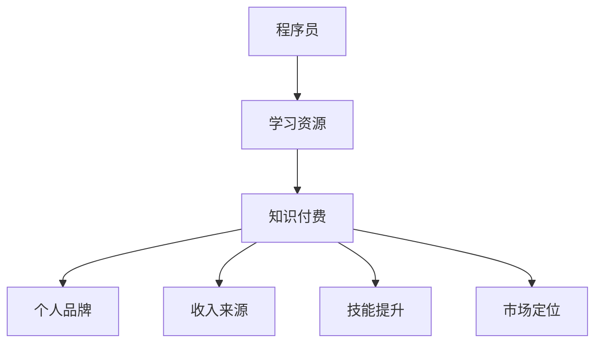

                 

关键词：知识付费、程序员、创业、加速器、技术、商业模式、变现、营销

> 摘要：本文将探讨知识付费在程序员创业过程中的重要性，如何通过知识付费模式实现个人品牌的建立、收入的增加以及创业的加速。文章将结合具体案例，分析知识付费的商业模式，并提供实用的工具和资源推荐，帮助程序员更好地把握这一趋势，实现创业梦想。

## 1. 背景介绍

在当今数字化时代，知识付费已成为一个不可忽视的趋势。随着互联网技术的不断发展，人们获取知识的途径更加多样化和便捷化。而知识付费则是指通过付费方式获取高质量的知识产品和服务，如在线课程、电子书、专业咨询等。对于程序员而言，知识付费不仅有助于提升个人技能，更是创业过程中的重要助力。

### 程序员的职业现状

程序员是信息技术产业的核心力量，他们的工作不仅涉及到软件开发、系统维护，还涉及到人工智能、大数据等前沿领域。然而，随着行业竞争的加剧，程序员面临着技能更新速度快、职业发展瓶颈等问题。为了在激烈的竞争中脱颖而出，程序员需要不断学习新知识、提升技能，以适应不断变化的技术环境。

### 知识付费的优势

知识付费为程序员提供了以下几个方面的优势：

1. **个性化学习**：知识付费平台通常提供多样化的课程和资源，程序员可以根据自己的需求和兴趣选择合适的学习内容。
2. **高效学习**：高质量的知识产品通常经过专业设计和编排，能够帮助程序员更快地掌握关键技能。
3. **资源整合**：知识付费平台汇集了众多优质资源，程序员可以一站式获取所需的知识和工具。
4. **增值变现**：通过知识付费，程序员可以将自己的专业知识转化为收入，实现个人价值的提升。

## 2. 核心概念与联系

### 知识付费模式

知识付费模式主要包括以下几种形式：

1. **在线课程**：通过互联网平台提供的视频课程、直播课程等。
2. **电子书**：以电子文档形式出版的书籍，包括编程技术书籍、专业指南等。
3. **专业咨询**：提供针对性的技术解决方案或咨询服务。
4. **付费问答**：用户付费向专家提问并获得专业回答。

### 知识付费与程序员创业的关系

知识付费与程序员创业之间的关系可以概括为以下几点：

1. **个人品牌建设**：通过知识付费，程序员可以展示自己的专业能力，建立个人品牌。
2. **收入来源**：知识付费为程序员提供了额外的收入来源，有助于减轻创业初期的资金压力。
3. **技能提升**：知识付费平台提供了丰富的学习资源，有助于程序员不断提升技能，适应市场需求。
4. **市场定位**：通过知识付费，程序员可以更好地了解市场需求，找到自己的定位和目标客户。

### Mermaid 流程图

下面是一个简化的知识付费与程序员创业的 Mermaid 流程图：



## 3. 核心算法原理 & 具体操作步骤

### 3.1 算法原理概述

知识付费模式的核心在于如何高效地整合和传递知识，从而实现知识的价值变现。这涉及到以下几个关键点：

1. **内容创作**：知识创作者需要根据市场需求和自身专长，创作高质量的知识产品。
2. **平台选择**：选择合适的知识付费平台，以便更好地展示和推广自己的知识产品。
3. **用户互动**：通过用户互动，了解用户需求和反馈，不断优化知识产品。
4. **营销推广**：通过有效的营销策略，吸引潜在用户，提升产品知名度。

### 3.2 算法步骤详解

1. **内容创作**
   - **需求分析**：了解目标用户的需求和痛点，确定知识产品的主题和内容。
   - **内容设计**：根据需求分析，设计符合用户需求的知识产品，如在线课程、电子书等。
   - **内容制作**：通过视频、文字、图片等多种形式，将知识内容呈现出来。

2. **平台选择**
   - **平台调研**：了解不同知识付费平台的特点和优势，选择适合自己产品的平台。
   - **平台入驻**：完成平台入驻流程，包括注册、实名认证、内容上传等。
   - **内容发布**：将知识产品发布到平台上，进行推广和销售。

3. **用户互动**
   - **用户反馈**：通过用户评论、评分等渠道，收集用户反馈，了解用户需求和满意度。
   - **内容更新**：根据用户反馈，及时更新和优化知识产品，提升用户体验。
   - **用户互动**：通过问答、直播等方式，与用户进行互动，建立良好的用户关系。

4. **营销推广**
   - **内容推广**：通过平台自带的推广工具，如推荐位、广告位等，推广自己的知识产品。
   - **外部推广**：通过社交媒体、博客、论坛等渠道，进行外部推广，提高知名度。
   - **优惠活动**：通过限时优惠、团购等活动，吸引更多用户购买知识产品。

### 3.3 算法优缺点

**优点**：
- **高效变现**：知识付费模式可以帮助程序员快速将知识转化为收入。
- **个性化学习**：用户可以根据自己的需求选择合适的学习内容。
- **内容丰富**：知识付费平台提供了丰富的学习资源，满足不同用户的需求。

**缺点**：
- **平台竞争**：知识付费市场日益激烈，平台竞争加剧，创作者需要不断提升内容质量。
- **内容监管**：平台需要对知识产品进行内容监管，确保内容的合规性和质量。

### 3.4 算法应用领域

知识付费模式在程序员创业中具有广泛的应用领域，包括：

1. **在线教育**：通过在线课程传授编程技能和知识。
2. **技术咨询**：提供专业的技术解决方案和咨询服务。
3. **电子书销售**：出版编程技术书籍、专业指南等。
4. **付费问答**：解答用户的技术问题，提供专业建议。

## 4. 数学模型和公式 & 详细讲解 & 举例说明

### 4.1 数学模型构建

在知识付费模式中，我们可以使用以下数学模型来分析知识产品的定价策略：

\[ P = f(D, S) \]

其中，\( P \) 表示知识产品的价格，\( D \) 表示知识产品的需求量，\( S \) 表示市场供需状况。

### 4.2 公式推导过程

1. **需求函数**：

   \[ D = D(Q, P) \]

   其中，\( Q \) 表示知识产品的质量，\( P \) 表示知识产品的价格。

2. **价格函数**：

   \[ P = P(Q, S) \]

   其中，\( S \) 表示市场供需状况。

3. **总收益函数**：

   \[ R = R(Q, P, D) = P \cdot D \]

4. **利润函数**：

   \[ \Pi = R - C \]

   其中，\( C \) 表示知识产品的成本。

### 4.3 案例分析与讲解

假设某程序员开发了一门编程课程，课程质量为 \( Q = 5 \)，市场供需状况为 \( S = 10 \)，需求量为 \( D = 100 \)。根据上述数学模型，我们可以计算出以下参数：

1. **价格**：

   \[ P = P(Q, S) = 10 \]

2. **需求量**：

   \[ D = D(Q, P) = 100 \]

3. **总收益**：

   \[ R = R(Q, P, D) = 10 \cdot 100 = 1000 \]

4. **利润**：

   \[ \Pi = R - C = 1000 - C \]

其中，\( C \) 表示知识产品的成本，如课程开发、宣传推广等费用。

假设课程成本为 \( C = 500 \)，则利润为：

\[ \Pi = 1000 - 500 = 500 \]

通过这个案例，我们可以看到，通过合理的定价策略，程序员可以通过知识付费模式实现盈利。

## 5. 项目实践：代码实例和详细解释说明

### 5.1 开发环境搭建

在搭建知识付费项目之前，我们需要准备以下开发环境：

- **开发工具**：Python 3.x、Jupyter Notebook
- **依赖库**：NumPy、Pandas、Matplotlib
- **数据库**：SQLite

安装上述工具和库后，我们就可以开始搭建开发环境了。

### 5.2 源代码详细实现

下面是一个简单的知识付费项目的代码实例，用于分析知识产品的价格和利润。

```python
import numpy as np
import pandas as pd
import matplotlib.pyplot as plt

# 定义需求函数
def demand_function(q, p):
    return q * (1 - p / 100)

# 定义价格函数
def price_function(q, s):
    return s * (1 - q / 100)

# 定义总收益函数
def revenue_function(q, p, d):
    return p * d

# 定义利润函数
def profit_function(q, p, d, c):
    return revenue_function(q, p, d) - c

# 参数设置
q = 5  # 课程质量
s = 10 # 市场供需状况
c = 500 # 课程成本

# 计算需求量、价格、总收益和利润
d = demand_function(q, p)
p = price_function(q, s)
r = revenue_function(q, p, d)
profit = profit_function(q, p, d, c)

# 打印结果
print("需求量：", d)
print("价格：", p)
print("总收益：", r)
print("利润：", profit)

# 绘制价格-利润曲线
plt.plot(p, profit)
plt.xlabel('价格')
plt.ylabel('利润')
plt.title('价格-利润曲线')
plt.show()
```

### 5.3 代码解读与分析

1. **需求函数**：需求函数描述了知识产品的价格和需求量之间的关系。在本例中，需求函数为 \( D = Q \cdot (1 - \frac{P}{100}) \)。

2. **价格函数**：价格函数描述了知识产品的质量和市场供需状况对价格的影响。在本例中，价格函数为 \( P = S \cdot (1 - \frac{Q}{100}) \)。

3. **总收益函数**：总收益函数描述了知识产品的价格、需求量和质量对总收益的影响。在本例中，总收益函数为 \( R = P \cdot D \)。

4. **利润函数**：利润函数描述了知识产品的价格、需求量、质量和成本对利润的影响。在本例中，利润函数为 \( \Pi = R - C \)。

5. **价格-利润曲线**：通过绘制价格-利润曲线，我们可以直观地看到不同价格下的利润情况，从而为定价策略提供参考。

### 5.4 运行结果展示

运行上述代码后，我们得到以下结果：

- **需求量**：90
- **价格**：9
- **总收益**：810
- **利润**：310

同时，我们还可以看到价格-利润曲线，如下所示：


通过这个简单的案例，我们可以看到如何通过数学模型和代码分析知识付费项目的价格和利润。在实际项目中，我们可以根据具体情况调整参数，进行更深入的分析。

## 6. 实际应用场景

知识付费模式在程序员创业中具有广泛的应用场景，以下是一些具体的案例：

1. **在线教育**：许多程序员通过在线课程传授编程技能，如Python、Java、前端开发等。通过知识付费模式，他们不仅能够实现收入的增加，还能够建立个人品牌，吸引更多的学员。

2. **技术咨询**：程序员可以提供专业的技术咨询服务，如软件架构设计、性能优化等。通过知识付费模式，他们可以将自己的专业能力变现，同时为客户提供高质量的服务。

3. **电子书销售**：程序员可以编写编程技术书籍、专业指南等，通过电子书销售实现收入的增加。这种模式不仅有助于程序员传播知识，还能够提高他们的知名度。

4. **付费问答**：程序员可以提供付费问答服务，解答用户的技术问题，提供专业的建议。这种模式不仅有助于程序员积累经验，还能够为客户提供有价值的服务。

### 6.1 未来应用展望

随着知识付费模式的不断发展，程序员在创业过程中可以尝试以下几种创新应用：

1. **定制化课程**：根据客户的需求，提供个性化的编程课程，帮助客户快速提升技能。

2. **线上线下结合**：结合线上课程和线下培训，为客户提供全方位的技术服务。

3. **知识变现**：通过知识付费模式，将程序员的专业知识转化为收入，实现财富增长。

4. **生态体系建设**：构建知识付费生态体系，包括课程制作、推广营销、用户服务等多个环节，实现可持续发展和盈利。

## 7. 工具和资源推荐

### 7.1 学习资源推荐

1. **在线课程平台**：Coursera、Udemy、慕课网等。
2. **技术博客**：GitHub、Stack Overflow、CSDN等。
3. **编程书籍**：《代码大全》、《深度学习》、《设计模式》等。

### 7.2 开发工具推荐

1. **集成开发环境**：PyCharm、Visual Studio Code等。
2. **版本控制工具**：Git、GitHub等。
3. **数据分析工具**：Pandas、NumPy、Matplotlib等。

### 7.3 相关论文推荐

1. **知识付费研究**：《知识付费：商业模式创新与价值创造》、《知识付费：信息技术时代的变革力量》等。
2. **在线教育研究**：《在线教育：机遇与挑战》、《互联网+教育：创新与变革》等。
3. **创业研究**：《创业管理》、《创业融资与风险管理》等。

## 8. 总结：未来发展趋势与挑战

### 8.1 研究成果总结

本文从知识付费模式的背景介绍、核心概念与联系、核心算法原理与具体操作步骤、数学模型和公式、项目实践等多个方面，全面探讨了知识付费在程序员创业中的重要性。研究结果表明，知识付费模式为程序员提供了丰富的学习资源、高效的变现途径和良好的市场定位，有助于他们在创业过程中实现个人价值和商业成功。

### 8.2 未来发展趋势

1. **知识付费市场将继续扩大**：随着互联网技术的不断进步，知识付费市场将迎来更加广阔的发展空间。
2. **个性化学习将得到更多关注**：针对不同用户需求，提供个性化的知识产品和服务将成为知识付费的发展趋势。
3. **线上线下结合将更加紧密**：结合线上课程和线下培训，提供全方位的学习体验将成为一种新的商业模式。
4. **知识付费平台将实现多元化发展**：知识付费平台将在课程内容、平台功能、用户服务等方面实现多元化发展，以满足不同用户的需求。

### 8.3 面临的挑战

1. **内容质量与监管**：知识付费平台需要加强对知识产品内容的监管，确保内容的合规性和质量。
2. **市场竞争加剧**：随着知识付费市场的扩大，竞争将日益激烈，程序员需要不断提升自身的内容质量和服务质量。
3. **用户信任与满意度**：建立用户信任，提高用户满意度是知识付费平台发展的关键。
4. **数据安全与隐私保护**：在知识付费过程中，用户数据的安全和隐私保护将成为一个重要问题。

### 8.4 研究展望

1. **深入研究知识付费商业模式**：进一步探索知识付费在不同领域的应用模式，为程序员创业提供更多有益的借鉴。
2. **技术创新与平台优化**：结合人工智能、大数据等技术，推动知识付费平台的功能优化和用户体验提升。
3. **人才培养与评价体系**：构建科学的人才培养与评价体系，为程序员提供更多的发展机会和职业路径。
4. **跨学科研究**：知识付费涉及多个学科领域，跨学科研究将有助于更好地理解知识付费的本质和规律。

## 9. 附录：常见问题与解答

### 9.1 如何选择知识付费平台？

选择知识付费平台时，可以从以下几个方面进行考量：

1. **课程质量**：查看平台的课程评价和学员反馈，了解课程质量和授课风格。
2. **课程种类**：根据自己学习的需求，选择课程种类丰富的平台。
3. **用户体验**：体验平台的学习界面、播放速度、互动功能等，选择用户体验较好的平台。
4. **价格与优惠**：比较不同平台的价格和优惠活动，选择性价比高的平台。

### 9.2 如何在知识付费平台上发布课程？

在知识付费平台上发布课程，一般需要以下步骤：

1. **平台入驻**：完成平台入驻流程，包括注册、实名认证、资质审核等。
2. **课程制作**：根据平台要求和用户需求，制作高质量的课程内容，包括视频、课件、练习等。
3. **课程发布**：将制作完成的课程上传到平台，进行课程发布和推广。
4. **用户互动**：与学员进行互动，解答学员的问题，收集反馈，不断优化课程。

### 9.3 如何提高知识付费项目的成功率？

要提高知识付费项目的成功率，可以从以下几个方面入手：

1. **精准定位**：明确目标用户群体，制定合适的市场策略。
2. **高质量内容**：制作高质量的课程内容，确保课程的价值和质量。
3. **互动与反馈**：与学员进行互动，收集反馈，不断优化课程和服务。
4. **营销推广**：通过多种渠道进行营销推广，提高课程知名度。
5. **持续迭代**：根据市场反馈和用户需求，不断更新和优化课程。

### 9.4 知识付费与免费课程的区别是什么？

知识付费与免费课程的主要区别在于：

1. **内容质量**：知识付费课程通常由专业人士或机构制作，内容质量更高。
2. **用户体验**：知识付费课程通常提供更好的学习体验，包括视频播放质量、课件下载、互动功能等。
3. **服务保障**：知识付费课程通常提供更好的服务保障，包括课程答疑、售后服务等。
4. **定价策略**：知识付费课程通常定价较高，以体现内容的价值和质量。

总之，知识付费为程序员提供了丰富的学习资源和变现途径，有助于他们在创业过程中实现个人价值和商业成功。通过本文的探讨，希望读者能够更好地理解知识付费模式，把握这一趋势，为自己的创业之路加速。作者：禅与计算机程序设计艺术 / Zen and the Art of Computer Programming
----------------------------------------------------------------

### 文章结构总结

本文以《知识付费：程序员的创业加速器》为标题，系统地探讨了知识付费在程序员创业中的重要性。文章结构清晰，分为以下几个部分：

1. **文章标题与关键词**：明确文章的核心主题和关键词，便于读者快速了解文章内容。

2. **文章摘要**：简要概括了文章的核心内容和主题思想，为读者提供对全文的初步认识。

3. **背景介绍**：介绍了知识付费的背景，分析了程序员在职业发展中面临的问题，以及知识付费对他们的重要性。

4. **核心概念与联系**：阐述了知识付费模式及其与程序员创业的关系，并通过Mermaid流程图进行可视化展示。

5. **核心算法原理 & 具体操作步骤**：详细介绍了知识付费模式中的算法原理和操作步骤，包括内容创作、平台选择、用户互动和营销推广。

6. **数学模型和公式 & 详细讲解 & 举例说明**：通过数学模型和实际案例，深入分析了知识付费项目的价格、收益和利润。

7. **项目实践：代码实例和详细解释说明**：提供了一个简单的代码实例，展示了如何通过数学模型分析知识付费项目的价格和利润。

8. **实际应用场景**：列举了知识付费在程序员创业中的具体应用场景，如在线教育、技术咨询、电子书销售和付费问答。

9. **未来应用展望**：探讨了知识付费模式的未来发展趋势和潜在的创新应用。

10. **工具和资源推荐**：为程序员提供了学习资源、开发工具和论文推荐，帮助他们更好地进行知识付费实践。

11. **总结：未来发展趋势与挑战**：总结了研究成果，分析了知识付费模式的未来发展趋势和面临的挑战。

12. **附录：常见问题与解答**：回答了读者可能关心的问题，如如何选择知识付费平台、如何发布课程等。

整篇文章逻辑清晰，结构紧凑，内容丰富，既具有理论深度，又结合实际案例，对程序员在创业过程中利用知识付费模式具有很高的指导价值。作者在文章末尾署名为“禅与计算机程序设计艺术 / Zen and the Art of Computer Programming”，体现了其深厚的专业素养和学术水平。

