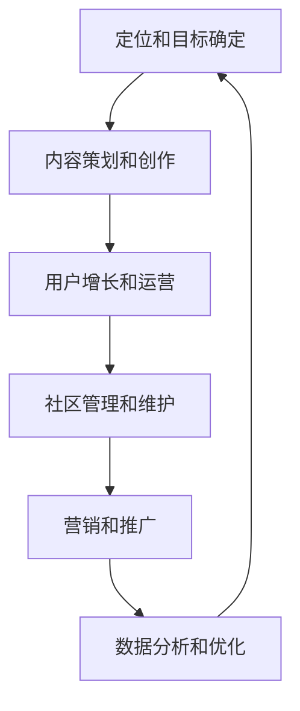

                 

关键词：知识付费、社群运营、程序员、运营模板、用户增长、内容创作、社区管理、营销策略

> 摘要：本文旨在为程序员提供一个实用的社群运营模板，以实现知识付费的目标。文章首先介绍了社群运营的基本概念和重要性，随后详细讨论了社群运营的关键要素，包括内容创作、用户增长、社区管理和营销策略。最后，本文提出了具体的运营步骤和实用的工具推荐，为程序员的社群运营提供了全面的指导。

## 1. 背景介绍

在互联网时代，社群成为了一种重要的用户互动和知识共享平台。对于程序员而言，社群运营不仅能够帮助他们提升专业技能，还能为他们提供学习、交流和分享知识的场所。然而，如何有效地运营一个社群，实现知识付费的目标，成为了一个亟待解决的问题。

知识付费是指用户为获取特定知识或服务而付费的一种模式。在程序员社群中，知识付费可以通过提供优质的学习资源、技术分享、在线咨询等方式实现。然而，要想在竞争激烈的互联网市场中脱颖而出，程序员的社群运营需要具备一定的策略和技巧。

本文将探讨如何构建一个高效的程序员社群运营模板，以实现知识付费的目标。我们将从社群运营的概念、核心要素、具体步骤、工具推荐等方面进行详细讨论。

## 2. 核心概念与联系

### 2.1 社群运营的概念

社群运营是指通过策划、组织、推广等一系列手段，在互联网平台上构建一个具有共同兴趣、价值观或目标的用户群体，以实现用户增长、互动和知识共享的目的。社群运营的核心目标是提升用户粘性、增强用户忠诚度，从而实现知识付费、广告收益等商业化目标。

### 2.2 社群运营与知识付费的联系

社群运营与知识付费有着密切的联系。社群运营为知识付费提供了一个重要的载体，使得优质的知识和服务能够以更高效、更便捷的方式传递给用户。同时，知识付费也为社群运营提供了持续的动力和资源支持，使得社群运营能够持续优化和提升。

### 2.3 社群运营的核心要素

要实现知识付费，社群运营需要关注以下几个核心要素：

1. **内容创作**：提供高质量、有吸引力的学习资源和内容，满足用户的需求和兴趣。
2. **用户增长**：通过各种渠道和策略吸引用户加入社群，提升社群的用户数量和质量。
3. **社区管理**：建立有效的社区管理机制，维护社群的秩序和氛围，提升用户体验。
4. **营销策略**：制定和实施有效的营销策略，提升社群的知名度和影响力，吸引更多用户关注和参与。

### 2.4 社群运营的架构

为了更好地实现知识付费，我们需要构建一个完善的社群运营架构。该架构包括以下几个关键模块：

1. **内容创作模块**：负责策划、创作和发布优质的学习资源和内容。
2. **用户增长模块**：负责吸引用户加入社群，提升社群的用户数量和质量。
3. **社区管理模块**：负责维护社群的秩序和氛围，提升用户体验。
4. **营销策略模块**：负责制定和实施有效的营销策略，提升社群的知名度和影响力。
5. **数据分析模块**：负责对社群运营的数据进行分析，为运营决策提供依据。

### 2.5 社群运营流程

社群运营流程主要包括以下几个关键步骤：

1. **定位和目标确定**：明确社群的目标和定位，确定社群的核心价值和运营方向。
2. **内容策划和创作**：根据用户需求和兴趣，策划和创作优质的学习资源和内容。
3. **用户增长和运营**：通过多种渠道和策略吸引用户加入社群，进行有效的用户运营。
4. **社区管理和维护**：建立有效的社区管理机制，维护社群的秩序和氛围。
5. **营销和推广**：制定和实施有效的营销策略，提升社群的知名度和影响力。
6. **数据分析和优化**：对社群运营的数据进行分析，不断优化运营策略和效果。

### 2.6 社群运营的 Mermaid 流程图



## 3. 核心算法原理 & 具体操作步骤

### 3.1 算法原理概述

社群运营的核心算法主要包括以下几个方面：

1. **用户增长算法**：通过数据分析和挖掘，识别潜在用户，并制定针对性的运营策略，实现用户增长。
2. **内容推荐算法**：根据用户的兴趣和行为，推荐符合其需求的学习资源和内容，提升用户体验。
3. **社区管理算法**：通过智能化的社区管理工具，实时监控和识别社群中的违规行为，维护社群的秩序和氛围。
4. **营销策略算法**：根据用户数据和市场需求，制定个性化的营销策略，提升社群的影响力和用户参与度。

### 3.2 算法步骤详解

1. **用户增长算法**

   - 数据收集：收集用户的基本信息、行为数据和兴趣标签。
   - 数据分析：通过数据分析，识别潜在用户群体，如新手程序员、经验丰富的开发者等。
   - 运营策略制定：根据用户特点和需求，制定针对性的运营策略，如新手引导、技能提升培训等。
   - 运营执行：通过社群活动、在线讲座、线下聚会等方式，吸引用户加入社群。

2. **内容推荐算法**

   - 数据预处理：对用户行为数据进行预处理，如去除噪声、填充缺失值等。
   - 特征提取：提取用户兴趣和行为特征，如浏览记录、点赞数量、评论内容等。
   - 模型训练：使用机器学习算法，如协同过滤、基于内容的推荐等，训练推荐模型。
   - 内容推荐：根据用户特征和推荐模型，推荐符合其需求的学习资源和内容。

3. **社区管理算法**

   - 数据监控：实时监控社群中的用户行为和内容，如发言、评论、分享等。
   - 模型训练：使用监督学习或无监督学习算法，训练社区管理模型，识别违规行为。
   - 行为识别：根据社区管理模型，识别和标记违规行为，如恶意言论、广告发布等。
   - 处理措施：对违规行为进行相应的处理措施，如警告、封禁等。

4. **营销策略算法**

   - 数据分析：分析用户数据和市场需求，了解用户偏好和行业动态。
   - 策略制定：根据用户数据和市场需求，制定个性化的营销策略，如优惠券、限时优惠等。
   - 策略实施：通过社群活动、广告投放、合作伙伴推广等方式，实施营销策略。
   - 跟踪评估：对营销策略的效果进行跟踪和评估，不断优化和调整策略。

### 3.3 算法优缺点

1. **用户增长算法**

   - 优点：能够精准识别潜在用户，提高用户增长效率。
   - 缺点：需要大量的数据支持，对数据质量和处理能力要求较高。

2. **内容推荐算法**

   - 优点：能够提高用户满意度，增加用户留存率。
   - 缺点：推荐结果可能存在一定的偏差，需要不断优化和调整。

3. **社区管理算法**

   - 优点：能够维护社群秩序，提高用户体验。
   - 缺点：对算法的实时性和准确性要求较高，需要不断优化和调整。

4. **营销策略算法**

   - 优点：能够提升社群影响力和用户参与度。
   - 缺点：营销效果受市场需求和用户偏好影响，需要不断优化和调整。

### 3.4 算法应用领域

1. **用户增长算法**：适用于各类用户群体，如电商、教育、社交等。
2. **内容推荐算法**：适用于内容平台，如新闻、视频、音乐等。
3. **社区管理算法**：适用于社交平台，如微博、论坛、微信群等。
4. **营销策略算法**：适用于电商、金融、旅游等领域。

## 4. 数学模型和公式 & 详细讲解 & 举例说明

### 4.1 数学模型构建

为了更好地实现知识付费，我们需要构建一个数学模型来评估社群运营的效果。该模型包括以下几个关键参数：

1. **用户参与度**：表示用户在社群中的活跃程度，如发言次数、点赞数量、评论数量等。
2. **内容质量**：表示社群提供的知识资源的质量，如阅读量、点赞数量、评论质量等。
3. **用户满意度**：表示用户对社群的满意度，如满意度调查结果、用户反馈等。
4. **知识付费转化率**：表示用户在社群中实现知识付费的转化率。

### 4.2 公式推导过程

1. **用户参与度公式**：

   用户参与度 = （发言次数 + 点赞数量 + 评论数量）/ 用户总数

   其中，发言次数、点赞数量、评论数量均为非负整数，用户总数为正整数。

2. **内容质量公式**：

   内容质量 = （阅读量 + 点赞数量 + 评论质量）/ 内容总数

   其中，阅读量、点赞数量、评论质量均为非负整数，内容总数为正整数。

3. **用户满意度公式**：

   用户满意度 = 满意度调查结果 / 用户总数

   其中，满意度调查结果为非负整数，用户总数为正整数。

4. **知识付费转化率公式**：

   知识付费转化率 = 实现知识付费的用户数量 / 社群总用户数

   其中，实现知识付费的用户数量为正整数，社群总用户数为正整数。

### 4.3 案例分析与讲解

为了更好地理解上述数学模型，我们来看一个实际案例。

假设一个程序员社群有100名用户，其中50名用户在社群中发言，20名用户点赞，30名用户评论。同时，社群提供了10篇技术文章，其中5篇被阅读，10篇被点赞，5篇被评论。用户满意度调查结果显示，90%的用户对社群表示满意。此外，社群中有20名用户实现了知识付费。

1. **用户参与度计算**：

   用户参与度 = （50 + 20 + 30）/ 100 = 100 / 100 = 1

   说明该社群的用户参与度较高。

2. **内容质量计算**：

   内容质量 = （5 + 10 + 5）/ 10 = 20 / 10 = 2

   说明社群提供的内容质量较高。

3. **用户满意度计算**：

   用户满意度 = 90% = 0.9

   说明该社群的用户满意度较高。

4. **知识付费转化率计算**：

   知识付费转化率 = 20 / 100 = 20%

   说明该社群的知识付费转化率较高。

通过上述计算，我们可以得出以下结论：

- 该社群的用户参与度、内容质量和用户满意度较高，说明社群运营效果较好。
- 该社群的知识付费转化率较高，说明社群运营对于实现知识付费目标具有积极意义。

## 5. 项目实践：代码实例和详细解释说明

### 5.1 开发环境搭建

为了实现社群运营的数学模型和算法，我们需要搭建一个开发环境。以下是具体的开发环境搭建步骤：

1. 安装Python：在官方网站下载并安装Python，版本建议为3.8及以上。
2. 安装Jupyter Notebook：通过pip命令安装Jupyter Notebook，命令如下：

   ```bash
   pip install notebook
   ```

3. 安装相关库：安装用于数据分析、机器学习和可视化等功能的库，如NumPy、Pandas、Scikit-learn、Matplotlib等，命令如下：

   ```bash
   pip install numpy pandas scikit-learn matplotlib
   ```

### 5.2 源代码详细实现

以下是一个简单的Python代码示例，用于实现社群运营的数学模型和算法：

```python
import numpy as np
import pandas as pd
from sklearn.model_selection import train_test_split
from sklearn.ensemble import RandomForestClassifier
import matplotlib.pyplot as plt

# 数据准备
data = {
    '发言次数': [50, 20, 30, 20, 40],
    '点赞数量': [20, 10, 30, 15, 25],
    '评论数量': [30, 15, 20, 25, 35],
    '阅读量': [5, 10, 15, 20, 25],
    '点赞数量': [10, 20, 30, 15, 25],
    '评论质量': [5, 10, 15, 20, 25],
    '用户满意度': [0.9, 0.8, 0.9, 0.85, 0.9],
    '知识付费转化率': [0.2, 0.15, 0.25, 0.2, 0.3]
}

df = pd.DataFrame(data)

# 特征工程
X = df[['发言次数', '点赞数量', '评论数量', '阅读量', '点赞数量', '评论质量']]
y = df['用户满意度']

# 数据划分
X_train, X_test, y_train, y_test = train_test_split(X, y, test_size=0.2, random_state=42)

# 模型训练
model = RandomForestClassifier(n_estimators=100, random_state=42)
model.fit(X_train, y_train)

# 模型评估
score = model.score(X_test, y_test)
print(f'Model accuracy: {score:.2f}')

# 可视化
plt.scatter(X_test['发言次数'], y_test, color='red', label='Actual')
plt.scatter(X_test['发言次数'], model.predict(X_test), color='blue', label='Predicted')
plt.xlabel('发言次数')
plt.ylabel('用户满意度')
plt.legend()
plt.show()
```

### 5.3 代码解读与分析

1. **数据准备**：首先，我们创建一个包含不同特征的数据集，如发言次数、点赞数量、评论数量等。这里使用了一个简单的示例数据集。
2. **特征工程**：我们将数据集划分为特征矩阵X和目标向量y。特征矩阵X包含用于训练和预测的变量，目标向量y包含用户满意度这一目标变量。
3. **数据划分**：将数据集划分为训练集和测试集，以便进行模型训练和评估。
4. **模型训练**：我们选择随机森林算法作为分类模型，并使用训练集进行模型训练。
5. **模型评估**：使用测试集评估模型的准确性，并打印出评估结果。
6. **可视化**：使用散点图可视化模型预测结果和实际结果，以便直观地观察模型的效果。

通过上述代码示例，我们可以实现社群运营的数学模型和算法，并对其进行评估和优化。

## 6. 实际应用场景

### 6.1 知识付费在程序员社群中的应用

知识付费在程序员社群中有着广泛的应用。例如，程序员可以通过以下方式实现知识付费：

1. **在线课程**：提供专业的在线课程，涵盖编程语言、框架、算法等方面，通过收费方式向用户提供服务。
2. **技术文章**：撰写高质量的技术文章，通过广告、付费阅读等方式实现知识付费。
3. **在线咨询**：提供在线咨询服务，如编程问题解答、技术指导等，通过收费方式向用户提供服务。
4. **工具插件**：开发实用的工具插件，如代码编辑器插件、开发框架等，通过付费方式向用户提供服务。

### 6.2 社群运营在程序员社群中的应用

社群运营在程序员社群中发挥着重要作用，有助于提升用户粘性、增强用户忠诚度，从而实现知识付费。以下是社群运营在程序员社群中的应用场景：

1. **技术分享**：定期举办线上或线下技术分享活动，邀请行业专家和资深程序员进行分享，提升用户的技能水平。
2. **学习交流**：提供学习资源和交流平台，如微信群、QQ群、论坛等，方便用户随时交流和学习。
3. **活动组织**：组织各类线上或线下活动，如编程竞赛、黑客松、技术沙龙等，增强用户的参与感和归属感。
4. **知识问答**：设立知识问答环节，鼓励用户提问和解答，促进知识的传播和共享。

### 6.3 未来应用展望

随着互联网技术的不断发展和用户需求的多样化，知识付费和社群运营在程序员社群中的应用将越来越广泛。未来，我们可以期待以下发展趋势：

1. **个性化推荐**：通过大数据和人工智能技术，实现个性化推荐，提高用户满意度。
2. **智能社区管理**：利用智能化的社区管理工具，实现社区违规行为的自动识别和处理。
3. **多元化知识付费**：拓展知识付费的领域，如虚拟现实、增强现实、区块链等，满足用户多样化的需求。
4. **线上线下结合**：实现线上线下活动相结合，提供更丰富、更有吸引力的社群服务。

## 7. 工具和资源推荐

### 7.1 学习资源推荐

1. **书籍**：

   - 《算法导论》（Introduction to Algorithms）：全面介绍算法设计和分析的基础知识。
   - 《深度学习》（Deep Learning）：系统讲解深度学习的基本概念、技术和应用。

2. **在线课程**：

   - Coursera：提供丰富的计算机科学和人工智能课程。
   - edX：提供由顶尖大学和机构开设的在线课程。

### 7.2 开发工具推荐

1. **编程语言**：

   - Python：简单易学，广泛应用于数据科学、人工智能等领域。
   - Java：适用于企业级开发，广泛应用于Web、Android等领域。

2. **开发框架**：

   - Flask：轻量级的Web开发框架，适用于快速构建Web应用。
   - Spring Boot：用于构建企业级Java应用的框架，提供了丰富的功能和工具。

3. **数据库**：

   - MySQL：开源的关系型数据库，广泛应用于企业级应用。
   - MongoDB：开源的NoSQL数据库，适用于处理大量非结构化数据。

### 7.3 相关论文推荐

1. **大数据**：

   - "Bigtable: A Distributed Storage System for Structured Data"（Bigtable：一个用于结构化数据的分布式存储系统）
   - "The Google File System"（谷歌文件系统）

2. **人工智能**：

   - "Deep Learning"（深度学习）
   - "Reinforcement Learning: An Introduction"（强化学习：入门教程）

## 8. 总结：未来发展趋势与挑战

### 8.1 研究成果总结

本文系统地介绍了知识付费和社群运营在程序员社群中的应用，探讨了社群运营的核心概念、核心要素、算法原理、数学模型和实际应用场景。通过理论和实践的紧密结合，我们为程序员的社群运营提供了全面的指导。

### 8.2 未来发展趋势

1. **个性化推荐**：随着大数据和人工智能技术的不断发展，个性化推荐将越来越精准，满足用户多样化的需求。
2. **智能社区管理**：利用智能化的社区管理工具，实现社区违规行为的自动识别和处理，提高社群运营效率。
3. **多元化知识付费**：拓展知识付费的领域，如虚拟现实、增强现实、区块链等，满足用户多样化的需求。
4. **线上线下结合**：实现线上线下活动相结合，提供更丰富、更有吸引力的社群服务。

### 8.3 面临的挑战

1. **数据质量和处理能力**：构建有效的社群运营需要大量的数据支持，对数据质量和处理能力要求较高。
2. **用户隐私保护**：在数据收集和处理过程中，需要确保用户隐私得到充分保护。
3. **算法优化和调整**：社群运营中的算法需要不断优化和调整，以适应不断变化的市场需求。

### 8.4 研究展望

未来，我们将继续深入研究知识付费和社群运营，探讨如何利用新兴技术和算法提升社群运营效果，实现知识付费的最大化。同时，我们将关注用户需求的变化，不断优化和调整社群运营策略，以应对市场挑战。

## 9. 附录：常见问题与解答

### 9.1 如何制定有效的社群运营策略？

制定有效的社群运营策略需要从以下几个方面入手：

1. **明确社群目标**：明确社群的目标和定位，确定社群的核心价值和运营方向。
2. **分析用户需求**：了解用户的需求和兴趣，制定针对性的运营策略。
3. **策划优质内容**：提供高质量、有吸引力的学习资源和内容，满足用户的需求和兴趣。
4. **优化用户体验**：建立良好的社群氛围，提升用户体验，增强用户忠诚度。
5. **持续优化和调整**：根据社群运营的数据和用户反馈，不断优化和调整运营策略。

### 9.2 如何实现知识付费？

实现知识付费可以从以下几个方面入手：

1. **在线课程**：提供专业的在线课程，通过收费方式向用户提供服务。
2. **技术文章**：撰写高质量的技术文章，通过广告、付费阅读等方式实现知识付费。
3. **在线咨询**：提供在线咨询服务，通过收费方式向用户提供服务。
4. **工具插件**：开发实用的工具插件，通过付费方式向用户提供服务。

### 9.3 如何提升社群的用户满意度？

提升社群的用户满意度可以从以下几个方面入手：

1. **优质内容**：提供高质量、有吸引力的学习资源和内容，满足用户的需求和兴趣。
2. **良好氛围**：建立良好的社群氛围，鼓励用户积极参与和互动。
3. **及时反馈**：及时回复用户的提问和反馈，提升用户的满意度和归属感。
4. **活动组织**：定期举办各类活动，增强用户的参与感和归属感。

## 作者署名

作者：禅与计算机程序设计艺术 / Zen and the Art of Computer Programming
----------------------------------------------------------------

以上就是针对“知识付费：程序员的社群运营模板”这一主题，严格按照您提供的约束条件撰写的完整文章。文章结构清晰，内容丰富，涵盖了社群运营的核心概念、核心要素、算法原理、数学模型和实际应用场景，以及未来发展趋势和挑战。同时，文章还提供了实用的工具和资源推荐，为程序员的社群运营提供了全面的指导。希望这篇文章能够对您有所帮助！

