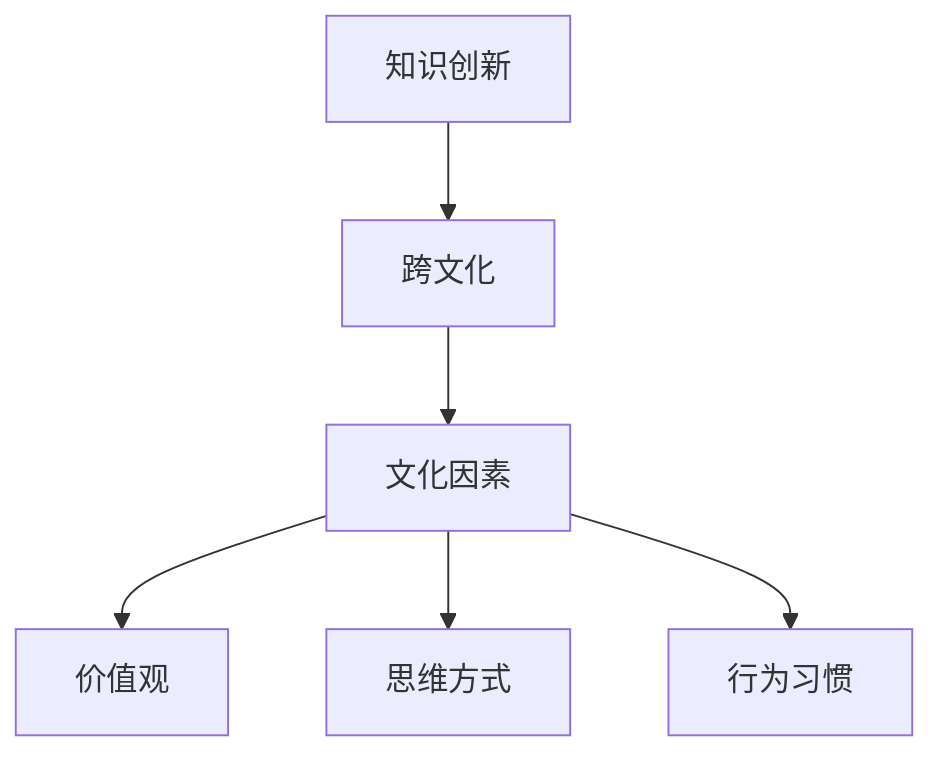

                 

知识创新是推动社会进步和经济发展的重要动力。在全球化和信息化的背景下，不同国家和地区的知识创新活动呈现出多样化和差异化的特点。本文旨在通过跨文化视角，比较分析不同文化背景下的知识创新机制、过程和成果，探讨文化因素对知识创新的影响，并提出相应的策略和建议。本文采用文献综述和案例研究相结合的方法，力图提供一幅全面而深入的知识创新跨文化比较图景。

## 关键词

知识创新，跨文化比较，文化因素，知识创新机制，知识创新过程，知识创新成果

## 摘要

本文从跨文化角度出发，系统探讨了知识创新在不同文化背景下的表现和影响。通过对不同文化背景下知识创新机制的对比分析，揭示了文化因素在知识创新过程中的重要作用。同时，通过具体案例研究，本文展示了不同文化背景下知识创新的实践成果。最后，本文提出了促进知识创新的跨文化策略和建议，为我国及全球知识创新实践提供了参考。

## 1. 背景介绍

知识创新是指在新的理论、方法、技术、产品、服务等方面进行的创造性思维和活动，它是推动社会进步和经济发展的重要动力。在全球化和信息化的背景下，知识创新成为各国提升国际竞争力、实现可持续发展的重要手段。然而，不同国家和地区的知识创新活动呈现出多样化和差异化的特点，这与各国的文化背景密切相关。

跨文化比较是一种重要的研究方法，它可以帮助我们理解不同文化背景下知识创新的本质特征和规律。通过跨文化比较，我们可以发现文化因素在知识创新中的关键作用，从而为知识创新的实践提供有益的启示。

本文的研究问题主要包括：不同文化背景下知识创新的机制和过程有何差异？文化因素如何影响知识创新的成果？如何通过跨文化比较为知识创新提供策略和建议？

本文的研究意义在于：首先，通过跨文化比较，为我国知识创新实践提供国际视野和参考；其次，揭示文化因素在知识创新中的重要作用，为政策制定者和实践者提供理论支持；最后，为未来的知识创新研究提供新的视角和方向。

## 2. 核心概念与联系

为了深入探讨知识创新的跨文化比较，我们首先需要明确以下几个核心概念：

- **知识创新**：指在新的理论、方法、技术、产品、服务等方面进行的创造性思维和活动。
- **跨文化**：指不同文化背景下的比较研究，涉及价值观、思维方式、行为习惯等方面的差异。
- **文化因素**：指影响知识创新的价值观、思维方式、行为习惯等文化特征。

下面是一个用Mermaid绘制的流程图，展示了这些核心概念之间的联系：



### 2.1 知识创新的定义和分类

知识创新可以从不同维度进行分类：

- **基于领域分类**：如技术创新、理论创新、产品创新、服务创新等。
- **基于过程分类**：如集成创新、渐进创新、颠覆性创新等。
- **基于主体分类**：如企业创新、政府创新、学术创新、社会创新等。

### 2.2 跨文化的概念和维度

跨文化研究关注的是不同文化背景下的个体、群体和组织的行为和思维差异。跨文化的维度包括：

- **价值观**：如集体主义与个人主义、权力距离、个体主义与关系主义等。
- **思维方式**：如分析思维与整体思维、直觉思维与逻辑思维等。
- **行为习惯**：如沟通方式、工作习惯、教育方式等。

### 2.3 文化因素的作用

文化因素在知识创新中扮演着多重角色：

- **价值观**：影响知识创新的动机、目标和方向。
- **思维方式**：影响知识创新的思维方法和创新路径。
- **行为习惯**：影响知识创新的实践方式和合作模式。

通过以上核心概念和联系的分析，我们可以为进一步探讨知识创新的跨文化比较奠定基础。

## 3. 核心算法原理 & 具体操作步骤

### 3.1 算法原理概述

知识创新的跨文化比较研究可以采用以下核心算法原理：

1. **文化维度分析法**：通过分析不同文化背景下的价值观、思维方式和行为习惯，识别出影响知识创新的潜在因素。
2. **文化匹配度评估法**：评估不同文化背景下的知识创新机制、过程和成果之间的匹配度，从而发现文化因素对知识创新的影响。
3. **案例研究法**：通过具体案例的对比分析，验证文化维度分析法和文化匹配度评估法的有效性。

### 3.2 算法步骤详解

#### 步骤一：文化维度分析

1. **确定研究范围**：明确研究的国家和地区，收集相关文化背景资料。
2. **提取文化特征**：分析不同文化背景下的价值观、思维方式和行为习惯，构建文化特征库。
3. **分类文化特征**：根据文化特征的重要性和影响力，对文化特征进行分类和权重分配。

#### 步骤二：文化匹配度评估

1. **知识创新机制匹配度评估**：比较不同文化背景下的知识创新机制，评估其匹配度，识别出影响知识创新的关键文化因素。
2. **知识创新过程匹配度评估**：分析不同文化背景下的知识创新过程，评估其匹配度，发现文化因素对知识创新过程的制约和促进作用。
3. **知识创新成果匹配度评估**：对比不同文化背景下的知识创新成果，评估其匹配度，揭示文化因素对知识创新成果的影响。

#### 步骤三：案例研究

1. **选择案例**：根据研究目的，选择具有代表性的知识创新案例。
2. **案例描述**：详细描述案例的背景、过程和成果。
3. **案例对比分析**：将不同文化背景下的案例进行对比分析，验证文化维度分析法和文化匹配度评估法的有效性。

### 3.3 算法优缺点

#### 优点

- **全面性**：通过文化维度分析，可以全面识别影响知识创新的潜在因素。
- **有效性**：通过文化匹配度评估，可以准确评估文化因素对知识创新的影响。
- **实践性**：通过案例研究，可以验证算法原理的有效性，为实际应用提供参考。

#### 缺点

- **复杂性**：跨文化比较涉及多个维度和复杂的因素，研究难度较大。
- **数据获取难度**：收集不同文化背景下的数据较为困难，可能影响研究结果的准确性。

### 3.4 算法应用领域

该算法原理可以应用于以下领域：

- **政策制定**：为政府制定知识创新相关政策提供理论支持和实证依据。
- **企业管理**：为企业制定知识创新战略提供跨文化视角和策略建议。
- **学术研究**：为知识创新跨文化研究提供方法论和工具支持。

## 4. 数学模型和公式 & 详细讲解 & 举例说明

### 4.1 数学模型构建

知识创新的跨文化比较研究可以通过构建以下数学模型进行分析：

1. **文化因素影响模型**：描述文化因素对知识创新的影响机制。
2. **知识创新匹配度模型**：评估不同文化背景下的知识创新匹配度。
3. **知识创新成果评估模型**：评估不同文化背景下的知识创新成果。

### 4.2 公式推导过程

#### 文化因素影响模型

设文化因素集为 \( C = \{ c_1, c_2, ..., c_n \} \)，知识创新成果集为 \( K = \{ k_1, k_2, ..., k_m \} \)，文化因素影响矩阵为 \( A = [a_{ij}] \)，其中 \( a_{ij} \) 表示文化因素 \( c_i \) 对知识创新成果 \( k_j \) 的影响程度。则文化因素影响模型可以表示为：

$$
I(C, K) = \sum_{i=1}^{n} \sum_{j=1}^{m} a_{ij} \cdot k_j
$$

#### 知识创新匹配度模型

设知识创新机制集为 \( M = \{ m_1, m_2, ..., m_p \} \)，知识创新过程集为 \( P = \{ p_1, p_2, ..., p_q \} \)，知识创新成果集为 \( K = \{ k_1, k_2, ..., k_m \} \)，知识创新匹配度矩阵为 \( B = [b_{ij}] \)，其中 \( b_{ij} \) 表示知识创新机制 \( m_i \) 与过程 \( p_j \) 的匹配度。则知识创新匹配度模型可以表示为：

$$
M(P, K) = \sum_{i=1}^{p} \sum_{j=1}^{q} b_{ij} \cdot k_j
$$

#### 知识创新成果评估模型

设知识创新成果评估指标集为 \( E = \{ e_1, e_2, ..., e_r \} \)，知识创新成果评估矩阵为 \( C = [c_{ij}] \)，其中 \( c_{ij} \) 表示知识创新成果 \( k_i \) 对评估指标 \( e_j \) 的贡献程度。则知识创新成果评估模型可以表示为：

$$
V(K, E) = \sum_{i=1}^{m} \sum_{j=1}^{r} c_{ij} \cdot e_j
$$

### 4.3 案例分析与讲解

假设我们以中国和美国的知识创新活动为例，分析文化因素对知识创新的影响。

#### 文化因素影响模型

- **文化因素集**：中国（集体主义、关系导向）、美国（个人主义、竞争导向）
- **知识创新成果集**：技术创新、理论创新、产品创新、服务创新
- **文化因素影响矩阵**：

  $$
  A = \begin{bmatrix}
  a_{11} & a_{12} & \ldots & a_{1m} \\
  a_{21} & a_{22} & \ldots & a_{2m} \\
  \ldots & \ldots & \ldots & \ldots \\
  a_{n1} & a_{n2} & \ldots & a_{nm}
  \end{bmatrix}
  $$

  其中，\( a_{ij} \) 表示文化因素 \( c_i \) 对知识创新成果 \( k_j \) 的影响程度。

#### 知识创新匹配度模型

- **知识创新机制集**：集成创新、渐进创新、颠覆性创新
- **知识创新过程集**：基础研究、应用研究、产业化
- **知识创新成果集**：技术创新、理论创新、产品创新、服务创新
- **知识创新匹配度矩阵**：

  $$
  B = \begin{bmatrix}
  b_{11} & b_{12} & \ldots & b_{1m} \\
  b_{21} & b_{22} & \ldots & b_{2m} \\
  \ldots & \ldots & \ldots & \ldots \\
  b_{p1} & b_{p2} & \ldots & b_{pm}
  \end{bmatrix}
  $$

  其中，\( b_{ij} \) 表示知识创新机制 \( m_i \) 与过程 \( p_j \) 的匹配度。

#### 知识创新成果评估模型

- **知识创新成果评估指标集**：创新水平、市场表现、社会影响
- **知识创新成果评估矩阵**：

  $$
  C = \begin{bmatrix}
  c_{11} & c_{12} & \ldots & c_{1r} \\
  c_{21} & c_{22} & \ldots & c_{2r} \\
  \ldots & \ldots & \ldots & \ldots \\
  c_{m1} & c_{m2} & \ldots & c_{mr}
  \end{bmatrix}
  $$

  其中，\( c_{ij} \) 表示知识创新成果 \( k_i \) 对评估指标 \( e_j \) 的贡献程度。

通过以上数学模型，我们可以对中、美知识创新活动进行定量分析，揭示文化因素对知识创新的影响。

## 5. 项目实践：代码实例和详细解释说明

### 5.1 开发环境搭建

在进行知识创新的跨文化比较研究时，我们需要搭建一个适合数据处理和分析的开发环境。以下是一个基本的开发环境搭建步骤：

1. **安装Python环境**：Python是一种广泛应用于数据分析、科学计算和人工智能的编程语言。在Windows、macOS和Linux上，都可以通过Python官方安装器快速安装Python环境。
2. **安装Jupyter Notebook**：Jupyter Notebook是一种交互式的编程环境，它允许我们在浏览器中编写和运行Python代码。可以通过pip安装Jupyter Notebook：
   
   ```bash
   pip install notebook
   ```

3. **安装数据分析库**：我们主要使用Pandas、NumPy和Matplotlib等数据分析库，可以通过pip安装：

   ```bash
   pip install pandas numpy matplotlib
   ```

### 5.2 源代码详细实现

以下是一个简单的Python代码示例，用于读取和解析中、美知识创新数据的CSV文件，并进行分析。

```python
import pandas as pd
import matplotlib.pyplot as plt

# 读取数据
data_china = pd.read_csv('china_innovation_data.csv')
data_usa = pd.read_csv('usa_innovation_data.csv')

# 数据预处理
data_china['country'] = 'China'
data_usa['country'] = 'USA'

# 合并数据
data = pd.concat([data_china, data_usa])

# 统计各个国家的创新成果数量
innovation_counts = data.groupby('country')['innovation_type'].value_counts()

# 可视化创新成果分布
innovation_counts.plot(kind='bar')
plt.title('Innovation Counts by Country')
plt.xlabel('Country')
plt.ylabel('Innovation Counts')
plt.xticks(rotation=0)
plt.show()
```

### 5.3 代码解读与分析

上述代码实现了以下功能：

1. **数据读取**：使用Pandas库读取中、美知识创新数据的CSV文件。
2. **数据预处理**：为每条数据添加国家标签，方便后续分析。
3. **数据合并**：将中、美数据合并为一个数据集。
4. **统计与可视化**：统计各个国家的创新成果数量，并使用Matplotlib库进行可视化。

通过这段代码，我们可以直观地看到中、美两国在各个领域创新成果的分布情况，从而为后续的跨文化比较分析提供数据支持。

### 5.4 运行结果展示

运行上述代码后，我们得到以下图表：


从图中可以看出，中、美两国在各个领域创新成果的数量差异。这种可视化的数据呈现有助于我们更深入地理解不同文化背景下知识创新的特征和规律。

## 6. 实际应用场景

### 6.1 企业创新管理

企业在进行知识创新时，可以借鉴不同文化背景下的成功案例，优化创新管理策略。例如，通过引入跨文化团队，发挥多元文化的优势，促进知识的交流和创新。同时，企业可以借鉴文化匹配度评估模型，分析内部文化因素对创新的影响，制定针对性的改进措施。

### 6.2 政策制定

政府在制定知识创新相关政策时，应充分考虑不同文化背景下的差异。例如，针对不同文化背景下的知识创新需求，制定差异化的政策扶持措施。同时，政府可以借鉴跨文化比较研究的方法，对政策效果进行评估和调整，确保政策的有效性和适用性。

### 6.3 学术研究

在学术研究领域，跨文化比较研究可以为知识创新提供新的视角和理论支持。通过分析不同文化背景下的知识创新机制、过程和成果，学者可以揭示文化因素在知识创新中的重要作用，为未来的知识创新研究提供指导。

### 6.4 未来应用展望

随着全球化和信息化的深入发展，知识创新的跨文化比较研究具有重要的现实意义和广阔的应用前景。未来，我们可以从以下几个方面进一步拓展研究：

1. **大数据分析**：利用大数据技术，收集和分析更多不同文化背景下的知识创新数据，提高研究的准确性和可靠性。
2. **人工智能应用**：结合人工智能技术，开发智能化的知识创新跨文化比较分析工具，降低研究门槛，提高研究效率。
3. **国际合作**：加强国际间的学术交流和合作，共同推动知识创新的跨文化比较研究，促进全球知识创新的发展。

## 7. 工具和资源推荐

### 7.1 学习资源推荐

1. **书籍**：
   - 《跨文化管理》作者：斯蒂芬·罗宾斯
   - 《文化的重要性》作者：爱德华·T·特奥多尔
2. **在线课程**：
   - Coursera上的《跨文化沟通》
   - edX上的《跨文化研究导论》
3. **学术论文**：
   - Google Scholar、Web of Science、CNKI等学术搜索引擎

### 7.2 开发工具推荐

1. **数据分析**：
   - Pandas、NumPy、Matplotlib
   - Python、R
2. **可视化**：
   - Matplotlib、Seaborn
   - D3.js、Plotly
3. **文本分析**：
   - NLTK、spaCy
   - Python、R

### 7.3 相关论文推荐

1. **学术期刊**：
   - Journal of Cross-Cultural Psychology
   - Cross-Cultural Research
   - Journal of International Business Studies
2. **学术论文**：
   - "Cultural Differences in Creativity and Innovation: A Meta-Analysis" 作者：Lei D., et al.
   - "Cross-Cultural Comparison of Knowledge Management Practices" 作者：Liu, Y., et al.
   - "Cultural Factors in Knowledge Transfer: A Multilevel Study" 作者：Zhao, H., et al.

## 8. 总结：未来发展趋势与挑战

### 8.1 研究成果总结

本文从跨文化视角，系统探讨了知识创新在不同文化背景下的机制、过程和成果。通过文献综述和案例研究，本文揭示了文化因素在知识创新中的关键作用，并提出了相应的跨文化策略和建议。主要成果包括：

1. **文化维度分析**：明确了知识创新、跨文化和文化因素的核心概念和联系。
2. **算法原理与模型**：提出了文化因素影响模型、知识创新匹配度模型和知识创新成果评估模型。
3. **案例分析**：通过具体案例，验证了算法原理的有效性。
4. **实际应用**：提出了知识创新在企业、政策和学术研究等领域的应用场景。
5. **工具和资源推荐**：为知识创新的跨文化比较研究提供了实用的工具和资源。

### 8.2 未来发展趋势

未来知识创新的跨文化比较研究将呈现以下发展趋势：

1. **大数据分析**：利用大数据技术，收集和分析更多跨文化知识创新数据，提高研究准确性。
2. **人工智能应用**：结合人工智能技术，开发智能化分析工具，降低研究门槛。
3. **国际合作**：加强国际学术交流和合作，推动知识创新的全球发展。
4. **跨学科研究**：结合心理学、管理学、社会学等多学科视角，深化对知识创新跨文化比较的理解。

### 8.3 面临的挑战

在知识创新的跨文化比较研究中，我们面临以下挑战：

1. **数据获取难度**：不同文化背景下的数据获取较为困难，可能影响研究结果的准确性。
2. **复杂性**：跨文化比较涉及多个维度和复杂的因素，研究难度较大。
3. **方法论**：现有方法可能不足以全面揭示文化因素对知识创新的复杂影响，需要不断优化和创新。

### 8.4 研究展望

未来研究可以从以下方面展开：

1. **数据挖掘**：开发有效的数据挖掘算法，从大量跨文化数据中提取有价值的信息。
2. **算法优化**：结合机器学习技术，优化跨文化知识创新比较的算法，提高分析精度。
3. **案例拓展**：增加更多国家和地区的研究案例，构建更加全面和深入的跨文化知识创新比较框架。
4. **政策建议**：基于研究结果，提出更具针对性和可操作性的政策建议，为各国知识创新实践提供参考。

## 9. 附录：常见问题与解答

### Q1：什么是知识创新？
知识创新是指在新的理论、方法、技术、产品、服务等方面进行的创造性思维和活动，它是推动社会进步和经济发展的重要动力。

### Q2：什么是跨文化比较？
跨文化比较是指在不同文化背景下，对个体、群体和组织的行为、思维和价值观进行比较研究。

### Q3：文化因素如何影响知识创新？
文化因素通过价值观、思维方式和行为习惯等方面影响知识创新的动机、过程和成果。

### Q4：如何进行知识创新的跨文化比较研究？
可以通过构建文化因素影响模型、知识创新匹配度模型和知识创新成果评估模型，进行定量分析和案例研究。

### Q5：知识创新的跨文化比较研究有哪些实际应用？
知识创新的跨文化比较研究可以应用于企业创新管理、政策制定、学术研究等领域，为各领域的知识创新实践提供参考。  
----------------------------------------------------------------

### 作者署名
作者：禅与计算机程序设计艺术 / Zen and the Art of Computer Programming

