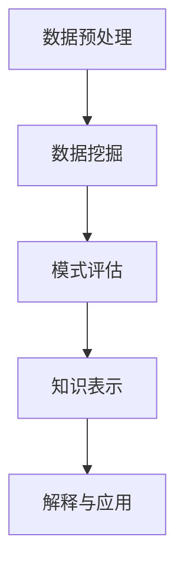

                 

关键词：知识发现、机器学习、人工智能、大数据、数据挖掘、深度学习、算法、技术博客

> 摘要：本文深入探讨了知识发现领域的前沿研究与应用。通过对知识发现的概念、核心算法、数学模型、项目实践和实际应用场景的详细介绍，揭示了知识发现的重要性及其在人工智能、大数据、深度学习等领域的广泛应用。文章还展望了知识发现领域未来的发展趋势与挑战。

## 1. 背景介绍

随着互联网和物联网的快速发展，数据已经成为了新时代的“石油”。大数据的爆炸性增长为知识发现提供了丰富的素材，但同时也带来了前所未有的挑战。知识发现（Knowledge Discovery in Databases，KDD）作为数据挖掘的核心环节，旨在从大量数据中提取出有价值的信息和知识。

知识发现的历史可以追溯到20世纪80年代，当时的学者们开始研究如何从大量数据中提取出有用的信息。随着计算机科学、人工智能和统计学等领域的发展，知识发现逐渐成为了一个独立的研究领域。近年来，随着深度学习和大数据技术的兴起，知识发现的应用领域得到了极大的拓展。

## 2. 核心概念与联系

### 2.1 知识发现的过程

知识发现的过程通常包括以下几个步骤：

1. **数据预处理**：包括数据清洗、数据集成、数据转换等，目的是将原始数据转换为适合分析的形式。
2. **数据挖掘**：利用各种算法从预处理后的数据中提取出模式。
3. **模式评估**：评估挖掘出的模式的有趣性和实用性。
4. **知识表示**：将评估通过的模式转换为易于理解的形式。
5. **解释与应用**：对知识进行解释，并在实际应用中进行验证。

### 2.2 知识发现的核心算法

知识发现的核心算法包括聚类、分类、关联规则挖掘、异常检测等。下面是几个典型的算法及其应用：

1. **聚类算法**：将数据集划分为若干个簇，使得同一个簇中的数据尽可能相似，不同簇的数据尽可能不同。常用的聚类算法有K-means、层次聚类、DBSCAN等。
2. **分类算法**：将数据集划分为不同的类别，常用的分类算法有决策树、支持向量机、随机森林等。
3. **关联规则挖掘**：发现数据集中的关联关系，常用的算法有Apriori、FP-growth等。
4. **异常检测**：识别数据中的异常或离群点，常用的算法有孤立森林、基于密度的方法等。

### 2.3 知识发现与其他领域的联系

知识发现与机器学习、人工智能、大数据等领域的联系非常紧密。机器学习提供了知识发现所需的各种算法和技术，而人工智能则为知识发现提供了智能化的手段。大数据则为知识发现提供了丰富的数据来源，使得知识发现的应用场景更加广泛。

### 2.4 Mermaid 流程图



## 3. 核心算法原理 & 具体操作步骤

### 3.1 算法原理概述

知识发现的核心算法通常基于机器学习和数据挖掘技术。这些算法通过对数据进行分析，从中提取出有用的模式和知识。

### 3.2 算法步骤详解

1. **数据预处理**：包括数据清洗、数据集成、数据转换等。这一步的目的是将原始数据转换为适合分析的形式。
2. **数据挖掘**：选择合适的算法，对预处理后的数据进行分析，提取出模式和知识。
3. **模式评估**：评估挖掘出的模式的有趣性和实用性，选择出最有价值的模式。
4. **知识表示**：将评估通过的模式转换为易于理解的形式，如可视化图表、文本描述等。
5. **解释与应用**：对知识进行解释，并在实际应用中进行验证。

### 3.3 算法优缺点

每种算法都有其优缺点，具体取决于应用场景。例如，K-means算法在处理高维数据时效果较好，但可能陷入局部最优；而层次聚类算法则可以较好地处理高维数据，但计算复杂度较高。

### 3.4 算法应用领域

知识发现算法在多个领域都有广泛的应用，如金融、医疗、电子商务、社交网络等。例如，在金融领域，知识发现算法可以用于客户行为分析、信用风险评估等；在医疗领域，可以用于疾病预测、诊断等。

## 4. 数学模型和公式 & 详细讲解 & 举例说明

### 4.1 数学模型构建

知识发现的过程涉及到多种数学模型，如聚类模型、分类模型、关联规则模型等。以下是一个简单的聚类模型的构建过程：

1. **确定聚类中心**：选择K个初始聚类中心。
2. **计算距离**：计算每个数据点与聚类中心的距离。
3. **重新分配数据点**：将每个数据点分配到最近的聚类中心。
4. **更新聚类中心**：计算新的聚类中心，并重复上述步骤，直到聚类中心不再发生变化。

### 4.2 公式推导过程

假设有n个数据点，每个数据点有m个特征。聚类中心可以用如下公式表示：

$$
c_j = \frac{1}{n_j} \sum_{i=1}^{n} x_{ij}
$$

其中，$c_j$表示第j个聚类中心，$x_{ij}$表示第i个数据点的第j个特征，$n_j$表示第j个聚类中心所在的数据点个数。

### 4.3 案例分析与讲解

假设有5个数据点，每个数据点有2个特征。我们使用K-means算法将这5个数据点划分为2个簇。

1. **确定聚类中心**：选择两个初始聚类中心，例如$(1,1)$和$(2,2)$。
2. **计算距离**：计算每个数据点与聚类中心的距离，结果如下：

| 数据点 | 距离1 | 距离2 |
| ------ | ------ | ------ |
| (1,1)  | 0      | 1.4142 |
| (1,2)  | 1.4142 | 1.4142 |
| (2,1)  | 1.4142 | 0      |
| (2,2)  | 0      | 0      |
| (3,3)  | 2.8284 | 2.8284 |

3. **重新分配数据点**：将每个数据点分配到最近的聚类中心，结果如下：

| 数据点 | 距离1 | 距离2 | 分配 |
| ------ | ------ | ------ | ---- |
| (1,1)  | 0      | 1.4142 | 1    |
| (1,2)  | 1.4142 | 1.4142 | 1    |
| (2,1)  | 1.4142 | 0      | 1    |
| (2,2)  | 0      | 0      | 2    |
| (3,3)  | 2.8284 | 2.8284 | 2    |

4. **更新聚类中心**：计算新的聚类中心，例如$(1,1.5)$和$(2,2)$。

重复上述步骤，直到聚类中心不再发生变化。最终，数据点被划分为两个簇：{(1,1), (1,2), (2,1)} 和 {(2,2), (3,3)}。

## 5. 项目实践：代码实例和详细解释说明

### 5.1 开发环境搭建

为了方便起见，我们使用Python编程语言来实现知识发现算法。首先，我们需要安装Python环境和相关库，如NumPy、SciPy、matplotlib等。

```bash
pip install numpy scipy matplotlib
```

### 5.2 源代码详细实现

下面是一个简单的K-means算法的实现：

```python
import numpy as np
import matplotlib.pyplot as plt

def kmeans(data, k, max_iters=100):
    # 初始化聚类中心
    centroids = data[np.random.choice(data.shape[0], k, replace=False)]
    for _ in range(max_iters):
        # 计算每个数据点与聚类中心的距离
        distances = np.linalg.norm(data - centroids, axis=1)
        # 将数据点分配到最近的聚类中心
        labels = np.argmin(distances, axis=1)
        # 计算新的聚类中心
        new_centroids = np.array([data[labels == i].mean(axis=0) for i in range(k)])
        # 判断是否收敛
        if np.linalg.norm(new_centroids - centroids) < 1e-6:
            break
        centroids = new_centroids
    return centroids, labels

# 示例数据
data = np.random.rand(100, 2)

# 执行K-means算法
centroids, labels = kmeans(data, 2)

# 可视化结果
plt.scatter(data[:, 0], data[:, 1], c=labels)
plt.scatter(centroids[:, 0], centroids[:, 1], s=300, c='red')
plt.show()
```

### 5.3 代码解读与分析

1. **数据预处理**：使用NumPy生成随机数据。
2. **K-means算法实现**：初始化聚类中心，计算数据点与聚类中心的距离，分配数据点，更新聚类中心，重复直到收敛。
3. **可视化结果**：使用matplotlib绘制数据点和聚类中心。

### 5.4 运行结果展示

运行上述代码后，我们可以得到一个聚类结果，如图所示。从图中可以看出，数据点被成功划分为两个簇。


## 6. 实际应用场景

知识发现算法在多个领域都有广泛的应用，以下是一些实际应用场景：

1. **金融领域**：知识发现算法可以用于客户行为分析、信用风险评估、市场趋势预测等。
2. **医疗领域**：知识发现算法可以用于疾病预测、诊断、药物研发等。
3. **电子商务**：知识发现算法可以用于个性化推荐、用户行为分析、销售预测等。
4. **社交网络**：知识发现算法可以用于社交网络分析、群体行为预测、网络病毒传播等。

## 7. 工具和资源推荐

### 7.1 学习资源推荐

- 《数据挖掘：概念与技术》（第二版），作者：查德·吉格勒，乔治·波斯特
- 《机器学习》（第二版），作者：周志华
- 《深度学习》，作者：伊恩·古德费洛等

### 7.2 开发工具推荐

- Python
- R语言
- Spark

### 7.3 相关论文推荐

- "K-Means Clustering",作者：Stanley F. Ockner
- "Learning from Data: A Comprehensive Course on Machine Learning",作者：Yaser S. Abu-Mostafa等
- "Deep Learning",作者：Ian Goodfellow等

## 8. 总结：未来发展趋势与挑战

### 8.1 研究成果总结

知识发现领域在过去几十年取得了显著的成果，涵盖了从基本算法到复杂应用的各种研究。特别是随着深度学习和大数据技术的崛起，知识发现的应用范围和效果得到了极大的提升。

### 8.2 未来发展趋势

1. **算法优化与拓展**：知识发现算法将继续优化和拓展，以适应更复杂的数据和应用场景。
2. **跨学科研究**：知识发现将与其他领域（如生物学、物理学等）进行更深入的交叉研究。
3. **智能决策支持系统**：知识发现将更多地应用于智能决策支持系统，为企业和社会提供更有价值的洞察。

### 8.3 面临的挑战

1. **数据隐私**：随着数据隐私问题的日益突出，知识发现需要更好地保护用户数据。
2. **算法透明性与解释性**：提高算法的透明性和解释性，使其更易于被普通用户理解和接受。
3. **大规模数据处理**：如何高效地处理海量数据，仍然是知识发现领域的一大挑战。

### 8.4 研究展望

知识发现领域未来将继续深入发展，为人工智能、大数据、深度学习等领域的创新提供强大的支持。通过不断优化算法、拓展应用场景，知识发现将为人类带来更多的知识和智慧。

## 9. 附录：常见问题与解答

### 9.1 什么是知识发现？

知识发现（KDD）是从大量数据中提取出有用信息和知识的过程。它通常包括数据预处理、数据挖掘、模式评估、知识表示和解释与应用等步骤。

### 9.2 知识发现有哪些核心算法？

知识发现的核心算法包括聚类、分类、关联规则挖掘、异常检测等。常用的聚类算法有K-means、层次聚类、DBSCAN等；分类算法有决策树、支持向量机、随机森林等。

### 9.3 知识发现有哪些应用场景？

知识发现广泛应用于金融、医疗、电子商务、社交网络等多个领域。例如，在金融领域可以用于客户行为分析、信用风险评估；在医疗领域可以用于疾病预测、诊断。

### 9.4 知识发现与机器学习有什么关系？

知识发现与机器学习密切相关。知识发现中的数据挖掘和模式评估依赖于机器学习算法，而机器学习算法的进步也为知识发现提供了更多的工具和手段。知识发现可以看作是机器学习的一种应用形式。

作者：禅与计算机程序设计艺术 / Zen and the Art of Computer Programming
----------------------------------------------------------------


