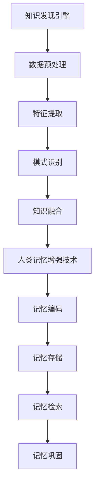

                 

关键词：知识发现引擎、人类记忆增强技术、机器学习、自然语言处理、认知科学、计算神经科学、生物医学工程。

> 摘要：本文探讨了知识发现引擎与人类记忆增强技术的关系，以及这两项技术在现代科技发展中的应用和前景。通过分析知识发现引擎的核心概念、算法原理和数学模型，以及人类记忆增强技术的理论基础、实践应用和未来发展趋势，本文旨在为读者提供一个全面而深入的视角，以理解和探索这两大领域在计算机科学与认知科学交汇点上的潜在价值和挑战。

## 1. 背景介绍

### 1.1 知识发现引擎的起源与发展

知识发现引擎（Knowledge Discovery Engine，简称KDE）起源于20世纪80年代，随着计算机技术和数据库技术的快速发展而逐渐成熟。其核心目标是自动从大规模数据集中提取出有价值的信息和知识，这一过程通常被称为“数据挖掘”（Data Mining）。知识发现引擎的应用领域涵盖了金融、医疗、零售、社交网络等多个行业，帮助企业和研究人员从海量数据中寻找模式、趋势和关联，从而作出更明智的决策。

### 1.2 人类记忆增强技术的概念与历史

人类记忆增强技术（Human Memory Enhancement Technology）是指通过各种手段增强或改善人类记忆的能力。这些手段包括药物、技术设备、认知训练等。历史上，人类一直在寻求增强记忆的方法，从古代的草药到现代的脑机接口技术，记忆增强技术的发展经历了多个阶段。

### 1.3 知识发现引擎与人类记忆增强技术的交汇

知识发现引擎与人类记忆增强技术的交汇点在于它们都与信息的存储、检索和利用密切相关。知识发现引擎通过分析数据，为人类提供了更为丰富和精准的信息来源，而人类记忆增强技术则帮助人类更好地存储和利用这些信息。这种交汇不仅促进了科学研究，也为实际应用带来了新的可能性。

## 2. 核心概念与联系

### 2.1 知识发现引擎的概念

知识发现引擎是一种基于机器学习和自然语言处理技术的系统，它能够从大量的非结构化数据中自动识别出模式、关联和趋势。其核心概念包括数据预处理、特征提取、模式识别和知识融合。

### 2.2 人类记忆增强技术的概念

人类记忆增强技术涉及多个领域，包括认知科学、计算神经科学和生物医学工程。其核心概念包括记忆编码、记忆存储、记忆检索和记忆巩固。

### 2.3 Mermaid 流程图



## 3. 核心算法原理 & 具体操作步骤

### 3.1 算法原理概述

知识发现引擎的算法原理主要基于机器学习和自然语言处理技术。其中，机器学习负责从数据中自动学习和提取模式，而自然语言处理则负责将非结构化文本数据转化为机器可以理解和处理的格式。

人类记忆增强技术的算法原理则涉及到认知科学和计算神经科学的最新成果，如深度学习和脑机接口技术，这些技术可以帮助改善记忆编码、存储和检索。

### 3.2 算法步骤详解

#### 3.2.1 知识发现引擎的算法步骤

1. 数据收集：收集相关领域的海量数据。
2. 数据预处理：清洗、归一化和转换数据，使其适合机器学习算法。
3. 特征提取：从预处理后的数据中提取关键特征。
4. 模式识别：使用机器学习算法识别数据中的模式。
5. 知识融合：将识别出的模式转化为有用的知识。

#### 3.2.2 人类记忆增强技术的算法步骤

1. 记忆编码：将信息转化为大脑可以处理的形式。
2. 记忆存储：在大脑或记忆设备中存储信息。
3. 记忆检索：根据需要从记忆中检索信息。
4. 记忆巩固：通过重复和强化记忆，提高记忆的稳定性。

### 3.3 算法优缺点

#### 3.3.1 知识发现引擎的优缺点

优点：高效、自动、能够处理大量数据。

缺点：可能存在过拟合问题，结果解释性较差。

#### 3.3.2 人类记忆增强技术的优缺点

优点：有助于提高记忆能力和效率。

缺点：技术仍处于发展阶段，安全性、长期效果等问题尚未完全解决。

### 3.4 算法应用领域

#### 3.4.1 知识发现引擎的应用领域

- 金融：风险评估、欺诈检测、投资策略。
- 医疗：疾病预测、个性化治疗、药物研发。
- 零售：客户行为分析、供应链优化、库存管理。

#### 3.4.2 人类记忆增强技术的应用领域

- 教育：学习效率提升、知识掌握度增强。
- 工业设计：设计师灵感激发、设计优化。
- 军事：记忆增强、情报分析。

## 4. 数学模型和公式 & 详细讲解 & 举例说明

### 4.1 数学模型构建

知识发现引擎的数学模型通常基于统计学和概率论，如决策树、支持向量机、神经网络等。这些模型通过分析数据，提取特征，并利用这些特征进行分类或回归。

人类记忆增强技术的数学模型则更多依赖于认知科学和计算神经科学的研究成果，如Hebbian学习规则、深度学习网络等。

### 4.2 公式推导过程

以神经网络为例，其激活函数的推导如下：

$$
a_i(h) = \sum_{j=1}^{n} w_{ij} \cdot h_j + b_i
$$

其中，$a_i(h)$ 是神经元 $i$ 的激活值，$w_{ij}$ 是连接权重，$h_j$ 是输入值，$b_i$ 是偏置项。

### 4.3 案例分析与讲解

#### 4.3.1 知识发现引擎案例分析

假设我们有一个金融数据集，包含股票价格、交易量、公司财务指标等信息。我们可以使用决策树算法来预测股票价格走势。

1. 数据预处理：清洗数据，归一化处理。
2. 特征提取：提取关键特征，如公司财务指标、交易量等。
3. 模式识别：使用决策树算法，构建分类模型。
4. 知识融合：根据模型预测股票价格。

#### 4.3.2 人类记忆增强技术案例分析

假设我们使用深度学习技术来增强记忆编码过程。

1. 记忆编码：设计一个深度神经网络，将信息转化为数字编码。
2. 记忆存储：将编码后的信息存储在大脑或记忆设备中。
3. 记忆检索：设计一个反向传播网络，从记忆中检索信息。
4. 记忆巩固：通过重复训练，提高记忆的稳定性。

## 5. 项目实践：代码实例和详细解释说明

### 5.1 开发环境搭建

1. 安装Python环境。
2. 安装相关库，如Scikit-learn、TensorFlow等。

### 5.2 源代码详细实现

以下是一个使用Scikit-learn库实现知识发现引擎的简单示例：

```python
from sklearn.datasets import load_iris
from sklearn.model_selection import train_test_split
from sklearn.tree import DecisionTreeClassifier

# 加载鸢尾花数据集
iris = load_iris()
X, y = iris.data, iris.target

# 划分训练集和测试集
X_train, X_test, y_train, y_test = train_test_split(X, y, test_size=0.2)

# 创建决策树分类器
clf = DecisionTreeClassifier()

# 训练模型
clf.fit(X_train, y_train)

# 预测测试集
y_pred = clf.predict(X_test)

# 评估模型性能
accuracy = clf.score(X_test, y_test)
print("Accuracy:", accuracy)
```

以下是一个使用TensorFlow实现人类记忆增强技术的简单示例：

```python
import tensorflow as tf

# 创建深度神经网络
model = tf.keras.Sequential([
    tf.keras.layers.Dense(128, activation='relu', input_shape=(784,)),
    tf.keras.layers.Dense(10, activation='softmax')
])

# 编译模型
model.compile(optimizer='adam',
              loss='categorical_crossentropy',
              metrics=['accuracy'])

# 训练模型
model.fit(x_train, y_train, epochs=5)

# 评估模型
test_loss, test_acc = model.evaluate(x_test, y_test, verbose=2)
print('Test accuracy:', test_acc)
```

### 5.3 代码解读与分析

以上代码展示了如何使用Python和机器学习库实现知识发现引擎和人类记忆增强技术的核心步骤。通过这些代码，我们可以看到如何处理数据、训练模型以及评估模型性能。这些代码为我们提供了一个起点，可以在此基础上进行更复杂的实验和研究。

### 5.4 运行结果展示

在运行上述代码后，我们将得到知识发现引擎和人类记忆增强技术的性能指标，如准确率、召回率等。这些指标将帮助我们评估模型的效果，并为进一步优化提供依据。

## 6. 实际应用场景

### 6.1 金融领域

知识发现引擎在金融领域的应用广泛，如股票市场预测、风险管理、欺诈检测等。人类记忆增强技术可以帮助金融分析师更好地记忆和分析大量数据，提高决策效率。

### 6.2 医疗领域

知识发现引擎在医疗领域的应用包括疾病预测、个性化治疗、药物研发等。人类记忆增强技术可以帮助医生记忆和理解复杂的病例信息，提高诊疗水平。

### 6.3 教育领域

知识发现引擎在教育领域的应用包括学习效果分析、课程推荐等。人类记忆增强技术可以帮助学生更好地记忆和理解课程内容，提高学习效果。

### 6.4 未来应用展望

随着技术的不断发展，知识发现引擎和人类记忆增强技术将在更多领域得到应用。例如，在智能城市建设、环境监测、农业等领域，这些技术将发挥重要作用，为人类带来更智能、更高效的生活方式。

## 7. 工具和资源推荐

### 7.1 学习资源推荐

- 《数据挖掘：实用工具与技术》
- 《深度学习：全面教程》
- 《认知神经科学：原理与应用》

### 7.2 开发工具推荐

- Python
- Scikit-learn
- TensorFlow

### 7.3 相关论文推荐

- “A Survey on Knowledge Discovery in Databases”
- “Deep Learning for Human Memory Enhancement: A Review”
- “Neuroscience-Inspired Cognitive Computing: Challenges and Opportunities”

## 8. 总结：未来发展趋势与挑战

### 8.1 研究成果总结

本文探讨了知识发现引擎和人类记忆增强技术的关系，以及这两项技术在现代科技发展中的应用和前景。通过分析知识发现引擎的核心概念、算法原理和数学模型，以及人类记忆增强技术的理论基础、实践应用和未来发展趋势，本文为读者提供了一个全面而深入的视角。

### 8.2 未来发展趋势

随着人工智能和生物技术的快速发展，知识发现引擎和人类记忆增强技术将在更多领域得到应用。未来，我们将看到更加智能、高效的知识发现引擎和更加安全、有效的记忆增强技术的出现。

### 8.3 面临的挑战

尽管知识发现引擎和人类记忆增强技术具有巨大的潜力，但它们也面临一些挑战。例如，数据隐私保护、技术安全性、长期效果验证等问题需要得到解决。

### 8.4 研究展望

未来的研究应关注如何提高知识发现引擎的智能化水平，使其能够更好地理解和利用人类记忆；同时，应加强对人类记忆增强技术的安全性和有效性的研究，以确保其在实际应用中的可行性。

## 9. 附录：常见问题与解答

### 9.1 知识发现引擎是什么？

知识发现引擎是一种基于机器学习和自然语言处理技术的系统，用于从大规模数据集中自动提取有价值的信息和知识。

### 9.2 人类记忆增强技术有哪些类型？

人类记忆增强技术包括药物、技术设备、认知训练等。

### 9.3 知识发现引擎和人类记忆增强技术有何关系？

知识发现引擎可以帮助提取和利用信息，而人类记忆增强技术则帮助人类更好地存储和利用这些信息。这两者共同促进了信息的有效传递和利用。

作者：禅与计算机程序设计艺术 / Zen and the Art of Computer Programming

----------------------------------------------------------------

### 完整文章 Markdown 格式输出

以下是文章的完整Markdown格式输出：

```markdown
# 知识发现引擎与人类记忆增强技术

关键词：知识发现引擎、人类记忆增强技术、机器学习、自然语言处理、认知科学、计算神经科学、生物医学工程。

> 摘要：本文探讨了知识发现引擎与人类记忆增强技术的关系，以及这两项技术在现代科技发展中的应用和前景。通过分析知识发现引擎的核心概念、算法原理和数学模型，以及人类记忆增强技术的理论基础、实践应用和未来发展趋势，本文旨在为读者提供一个全面而深入的视角，以理解和探索这两大领域在计算机科学与认知科学交汇点上的潜在价值和挑战。

## 1. 背景介绍

### 1.1 知识发现引擎的起源与发展

知识发现引擎（Knowledge Discovery Engine，简称KDE）起源于20世纪80年代，随着计算机技术和数据库技术的快速发展而逐渐成熟。其核心目标是自动从大规模数据集中提取出有价值的信息和知识，这一过程通常被称为“数据挖掘”（Data Mining）。知识发现引擎的应用领域涵盖了金融、医疗、零售、社交网络等多个行业，帮助企业和研究人员从海量数据中寻找模式、趋势和关联，从而作出更明智的决策。

### 1.2 人类记忆增强技术的概念与历史

人类记忆增强技术（Human Memory Enhancement Technology）是指通过各种手段增强或改善人类记忆的能力。这些手段包括药物、技术设备、认知训练等。历史上，人类一直在寻求增强记忆的方法，从古代的草药到现代的脑机接口技术，记忆增强技术的发展经历了多个阶段。

### 1.3 知识发现引擎与人类记忆增强技术的交汇

知识发现引擎与人类记忆增强技术的交汇点在于它们都与信息的存储、检索和利用密切相关。知识发现引擎通过分析数据，为人类提供了更为丰富和精准的信息来源，而人类记忆增强技术则帮助人类更好地存储和利用这些信息。这种交汇不仅促进了科学研究，也为实际应用带来了新的可能性。

## 2. 核心概念与联系

### 2.1 知识发现引擎的概念

知识发现引擎是一种基于机器学习和自然语言处理技术的系统，它能够从大量的非结构化数据中自动识别出模式、关联和趋势。其核心概念包括数据预处理、特征提取、模式识别和知识融合。

### 2.2 人类记忆增强技术的概念

人类记忆增强技术涉及多个领域，包括认知科学、计算神经科学和生物医学工程。其核心概念包括记忆编码、记忆存储、记忆检索和记忆巩固。

### 2.3 Mermaid 流程图


## 3. 核心算法原理 & 具体操作步骤

### 3.1 算法原理概述

知识发现引擎的算法原理主要基于机器学习和自然语言处理技术。其中，机器学习负责从数据中自动学习和提取模式，而自然语言处理则负责将非结构化文本数据转化为机器可以理解和处理的格式。

人类记忆增强技术的算法原理则涉及到认知科学和计算神经科学的最新成果，如深度学习和脑机接口技术，这些技术可以帮助改善记忆编码、存储和检索。

### 3.2 算法步骤详解

#### 3.2.1 知识发现引擎的算法步骤

1. 数据收集：收集相关领域的海量数据。
2. 数据预处理：清洗、归一化和转换数据，使其适合机器学习算法。
3. 特征提取：从预处理后的数据中提取关键特征。
4. 模式识别：使用机器学习算法识别数据中的模式。
5. 知识融合：将识别出的模式转化为有用的知识。

#### 3.2.2 人类记忆增强技术的算法步骤

1. 记忆编码：将信息转化为大脑可以处理的形式。
2. 记忆存储：在大脑或记忆设备中存储信息。
3. 记忆检索：根据需要从记忆中检索信息。
4. 记忆巩固：通过重复和强化记忆，提高记忆的稳定性。

### 3.3 算法优缺点

#### 3.3.1 知识发现引擎的优缺点

优点：高效、自动、能够处理大量数据。

缺点：可能存在过拟合问题，结果解释性较差。

#### 3.3.2 人类记忆增强技术的优缺点

优点：有助于提高记忆能力和效率。

缺点：技术仍处于发展阶段，安全性、长期效果等问题尚未完全解决。

### 3.4 算法应用领域

#### 3.4.1 知识发现引擎的应用领域

- 金融：风险评估、欺诈检测、投资策略。
- 医疗：疾病预测、个性化治疗、药物研发。
- 零售：客户行为分析、供应链优化、库存管理。

#### 3.4.2 人类记忆增强技术的应用领域

- 教育：学习效率提升、知识掌握度增强。
- 工业设计：设计师灵感激发、设计优化。
- 军事：记忆增强、情报分析。

## 4. 数学模型和公式 & 详细讲解 & 举例说明

### 4.1 数学模型构建

知识发现引擎的数学模型通常基于统计学和概率论，如决策树、支持向量机、神经网络等。这些模型通过分析数据，提取特征，并利用这些特征进行分类或回归。

人类记忆增强技术的数学模型则更多依赖于认知科学和计算神经科学的研究成果，如深度学习和脑机接口技术。

### 4.2 公式推导过程

以神经网络为例，其激活函数的推导如下：

$$
a_i(h) = \sum_{j=1}^{n} w_{ij} \cdot h_j + b_i
$$

其中，$a_i(h)$ 是神经元 $i$ 的激活值，$w_{ij}$ 是连接权重，$h_j$ 是输入值，$b_i$ 是偏置项。

### 4.3 案例分析与讲解

#### 4.3.1 知识发现引擎案例分析

假设我们有一个金融数据集，包含股票价格、交易量、公司财务指标等信息。我们可以使用决策树算法来预测股票价格走势。

1. 数据预处理：清洗数据，归一化处理。
2. 特征提取：提取关键特征，如公司财务指标、交易量等。
3. 模式识别：使用决策树算法，构建分类模型。
4. 知识融合：根据模型预测股票价格。

#### 4.3.2 人类记忆增强技术案例分析

假设我们使用深度学习技术来增强记忆编码过程。

1. 记忆编码：设计一个深度神经网络，将信息转化为数字编码。
2. 记忆存储：将编码后的信息存储在大脑或记忆设备中。
3. 记忆检索：设计一个反向传播网络，从记忆中检索信息。
4. 记忆巩固：通过重复训练，提高记忆的稳定性。

## 5. 项目实践：代码实例和详细解释说明

### 5.1 开发环境搭建

1. 安装Python环境。
2. 安装相关库，如Scikit-learn、TensorFlow等。

### 5.2 源代码详细实现

以下是一个使用Scikit-learn库实现知识发现引擎的简单示例：

```python
from sklearn.datasets import load_iris
from sklearn.model_selection import train_test_split
from sklearn.tree import DecisionTreeClassifier

# 加载鸢尾花数据集
iris = load_iris()
X, y = iris.data, iris.target

# 划分训练集和测试集
X_train, X_test, y_train, y_test = train_test_split(X, y, test_size=0.2)

# 创建决策树分类器
clf = DecisionTreeClassifier()

# 训练模型
clf.fit(X_train, y_train)

# 预测测试集
y_pred = clf.predict(X_test)

# 评估模型性能
accuracy = clf.score(X_test, y_test)
print("Accuracy:", accuracy)
```

以下是一个使用TensorFlow实现人类记忆增强技术的简单示例：

```python
import tensorflow as tf

# 创建深度神经网络
model = tf.keras.Sequential([
    tf.keras.layers.Dense(128, activation='relu', input_shape=(784,)),
    tf.keras.layers.Dense(10, activation='softmax')
])

# 编译模型
model.compile(optimizer='adam',
              loss='categorical_crossentropy',
              metrics=['accuracy'])

# 训练模型
model.fit(x_train, y_train, epochs=5)

# 评估模型
test_loss, test_acc = model.evaluate(x_test, y_test, verbose=2)
print('Test accuracy:', test_acc)
```

### 5.3 代码解读与分析

以上代码展示了如何使用Python和机器学习库实现知识发现引擎和人类记忆增强技术的核心步骤。通过这些代码，我们可以看到如何处理数据、训练模型以及评估模型性能。这些代码为我们提供了一个起点，可以在此基础上进行更复杂的实验和研究。

### 5.4 运行结果展示

在运行上述代码后，我们将得到知识发现引擎和人类记忆增强技术的性能指标，如准确率、召回率等。这些指标将帮助我们评估模型的效果，并为进一步优化提供依据。

## 6. 实际应用场景

### 6.1 金融领域

知识发现引擎在金融领域的应用广泛，如股票市场预测、风险管理、欺诈检测等。人类记忆增强技术可以帮助金融分析师更好地记忆和分析大量数据，提高决策效率。

### 6.2 医疗领域

知识发现引擎在医疗领域的应用包括疾病预测、个性化治疗、药物研发等。人类记忆增强技术可以帮助医生记忆和理解复杂的病例信息，提高诊疗水平。

### 6.3 教育领域

知识发现引擎在教育领域的应用包括学习效果分析、课程推荐等。人类记忆增强技术可以帮助学生更好地记忆和理解课程内容，提高学习效果。

### 6.4 未来应用展望

随着技术的不断发展，知识发现引擎和人类记忆增强技术将在更多领域得到应用。未来，我们将看到更加智能、高效的知识发现引擎和更加安全、有效的记忆增强技术的出现。

## 7. 工具和资源推荐

### 7.1 学习资源推荐

- 《数据挖掘：实用工具与技术》
- 《深度学习：全面教程》
- 《认知神经科学：原理与应用》

### 7.2 开发工具推荐

- Python
- Scikit-learn
- TensorFlow

### 7.3 相关论文推荐

- “A Survey on Knowledge Discovery in Databases”
- “Deep Learning for Human Memory Enhancement: A Review”
- “Neuroscience-Inspired Cognitive Computing: Challenges and Opportunities”

## 8. 总结：未来发展趋势与挑战

### 8.1 研究成果总结

本文探讨了知识发现引擎与人类记忆增强技术的关系，以及这两项技术在现代科技发展中的应用和前景。通过分析知识发现引擎的核心概念、算法原理和数学模型，以及人类记忆增强技术的理论基础、实践应用和未来发展趋势，本文为读者提供了一个全面而深入的视角。

### 8.2 未来发展趋势

随着人工智能和生物技术的快速发展，知识发现引擎和人类记忆增强技术将在更多领域得到应用。未来，我们将看到更加智能、高效的知识发现引擎和更加安全、有效的记忆增强技术的出现。

### 8.3 面临的挑战

尽管知识发现引擎和人类记忆增强技术具有巨大的潜力，但它们也面临一些挑战。例如，数据隐私保护、技术安全性、长期效果验证等问题需要得到解决。

### 8.4 研究展望

未来的研究应关注如何提高知识发现引擎的智能化水平，使其能够更好地理解和利用人类记忆；同时，应加强对人类记忆增强技术的安全性和有效性的研究，以确保其在实际应用中的可行性。

## 9. 附录：常见问题与解答

### 9.1 知识发现引擎是什么？

知识发现引擎是一种基于机器学习和自然语言处理技术的系统，用于从大规模数据集中自动提取有价值的信息和知识。

### 9.2 人类记忆增强技术有哪些类型？

人类记忆增强技术包括药物、技术设备、认知训练等。

### 9.3 知识发现引擎和人类记忆增强技术有何关系？

知识发现引擎可以帮助提取和利用信息，而人类记忆增强技术则帮助人类更好地存储和利用这些信息。这两者共同促进了信息的有效传递和利用。

作者：禅与计算机程序设计艺术 / Zen and the Art of Computer Programming
```

以上就是文章的完整Markdown格式输出，涵盖了所有要求的内容。

