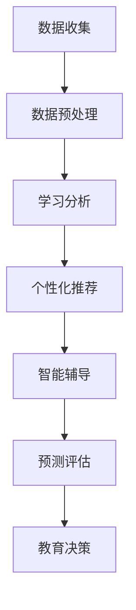

                 

关键词：知识发现引擎、教育技术、学习分析、个性化教育、大数据分析、人工智能

> 摘要：本文深入探讨了知识发现引擎在教育领域的应用，阐述了其如何通过学习分析、大数据处理和个性化推荐等手段，实现教育的智能化和个性化。文章不仅介绍了知识发现引擎的核心概念、原理及算法，还通过实际项目案例展示了其在教育领域的革命性潜力。

## 1. 背景介绍

在信息化和数字化快速发展的今天，教育领域正面临着前所未有的变革。传统教育模式过于依赖教师的主导地位，缺乏对每个学生个性化需求的关注。这种教学模式不仅难以适应学生的多样化学习需求，而且难以提升学习效果。为了解决这个问题，教育领域开始积极引入人工智能技术，尤其是知识发现引擎，以实现教育的智能化和个性化。

知识发现引擎是一种通过分析和挖掘大规模数据，从中提取隐含的模式和知识的工具。它基于机器学习和数据挖掘技术，能够自动识别数据中的关联性、趋势和规律。在教育领域，知识发现引擎可以帮助教育工作者更好地理解学生的学习行为和需求，从而提供更加个性化的教学方案和资源。

### 1.1 知识发现引擎的核心功能

- **学习分析**：通过分析学生的学习行为数据，如学习进度、学习时间、作业成绩等，识别学生的学习习惯、兴趣和能力。
- **个性化推荐**：根据学生的学习分析和偏好，推荐合适的学习资源和教学方法。
- **智能辅导**：通过实时分析学生的学习状态，提供即时反馈和辅导，帮助学生克服学习中的困难。
- **预测评估**：预测学生的学习成果和表现，为教育决策提供数据支持。

### 1.2 知识发现引擎在教育领域的应用价值

- **提升学习效果**：通过个性化教学和智能辅导，提高学生的学习效率和成绩。
- **优化教育资源**：根据学生的学习需求，优化教育资源分配，提高资源利用率。
- **促进教育公平**：为不同背景和能力的学生提供个性化支持，促进教育公平。
- **支持教育决策**：提供可靠的数据分析，为教育政策和教学计划的制定提供科学依据。

## 2. 核心概念与联系

### 2.1 核心概念

- **知识发现（Knowledge Discovery）**：从大量数据中自动识别出有价值的信息和模式的过程。
- **数据挖掘（Data Mining）**：使用计算机算法从大量数据中提取有价值信息的方法。
- **机器学习（Machine Learning）**：让计算机通过数据学习，从而进行预测和决策的方法。

### 2.2 教育领域中的知识发现引擎架构

以下是一个简化的知识发现引擎在教育领域的架构图，用Mermaid流程图表示：



### 2.3 知识发现引擎在教育中的联系

- **数据收集**：收集学生的各种学习行为数据，如成绩、作业、测试、互动记录等。
- **数据预处理**：清洗和转换数据，使其适合用于分析和挖掘。
- **学习分析**：分析学生的学习行为，提取学习模式。
- **个性化推荐**：根据学习分析和学生偏好，推荐合适的学习资源和教学方法。
- **智能辅导**：根据学生的学习状态提供即时反馈和辅导。
- **预测评估**：预测学生的学习表现和成果。
- **教育决策**：支持教育工作者和教育决策者的决策过程。

## 3. 核心算法原理 & 具体操作步骤

### 3.1 算法原理概述

知识发现引擎主要依赖于机器学习和数据挖掘算法。以下是一些常见的算法原理：

- **聚类算法**：将相似的数据点分组，用于识别学生的群体特征。
- **关联规则挖掘**：发现数据之间的关联性，用于识别学生的学习习惯和偏好。
- **分类算法**：将数据分类到不同的类别中，用于预测学生的学习表现。
- **回归算法**：通过历史数据预测未来的值，用于预测学生的学习成绩。

### 3.2 算法步骤详解

1. **数据收集**：从各种渠道收集学生的数据，如成绩、作业、测试等。
2. **数据预处理**：清洗和转换数据，包括缺失值处理、异常值检测、数据归一化等。
3. **特征选择**：从原始数据中提取有助于分析和挖掘的特征。
4. **模型训练**：选择合适的机器学习算法，对数据集进行训练。
5. **模型评估**：评估模型的准确性和性能。
6. **知识提取**：使用数据挖掘算法，从模型中提取有价值的信息和模式。
7. **应用反馈**：将分析结果应用于教学实践，根据反馈调整模型和策略。

### 3.3 算法优缺点

- **优点**：
  - **高效性**：自动化分析和挖掘大量数据，节省人力和时间成本。
  - **灵活性**：可以根据教育需求调整和分析策略。
  - **实时性**：实时分析和反馈，支持动态教学调整。

- **缺点**：
  - **数据质量**：数据质量直接影响分析结果，需要严格的数据预处理。
  - **算法选择**：选择合适的算法需要较高的专业知识。
  - **隐私问题**：学生数据的隐私保护是重要挑战。

### 3.4 算法应用领域

- **个性化教学**：根据学生的兴趣和能力推荐合适的学习资源和教学方法。
- **智能辅导**：提供实时反馈和辅导，帮助学生克服学习中的困难。
- **课程评估**：评估课程的效果和质量，为课程改进提供数据支持。
- **学习分析**：深入分析学生的学习行为和模式，为教育决策提供依据。

## 4. 数学模型和公式 & 详细讲解 & 举例说明

### 4.1 数学模型构建

在教育领域，知识发现引擎通常使用以下数学模型：

- **聚类模型**：如K-means、层次聚类等，用于将学生分类到不同的学习群体。
- **关联规则模型**：如Apriori算法、FP-growth等，用于发现学生数据中的关联性。
- **分类模型**：如决策树、支持向量机等，用于预测学生的学习成绩和表现。
- **回归模型**：如线性回归、多项式回归等，用于预测学生的未来学习表现。

### 4.2 公式推导过程

以K-means聚类算法为例，其目标是最小化聚类中心与数据点之间的距离平方和。具体推导过程如下：

给定数据集\(X = \{x_1, x_2, ..., x_n\}\)，其中每个数据点\(x_i\)是一个\(d\)维向量，聚类中心为\(c_j\)，则目标函数为：

$$
\min \sum_{i=1}^{n} \sum_{j=1}^{k} (x_i - c_j)^2
$$

其中，\(k\)是聚类个数。

### 4.3 案例分析与讲解

假设我们有一个包含100个学生的数据集，每个学生有3个特征：学习时间、作业成绩、课堂参与度。我们使用K-means算法将其分为3个群体。

首先，随机初始化3个聚类中心。然后，计算每个学生到每个聚类中心的距离，将其归到最近的聚类中心。接着，更新聚类中心的位置。重复这个过程，直到聚类中心不再变化或者达到预设的迭代次数。

经过几次迭代后，我们得到3个聚类中心，分别为：

$$
c_1 = (10, 85, 30)
$$

$$
c_2 = (20, 70, 40)
$$

$$
c_3 = (15, 80, 35)
$$

然后，我们计算每个学生到聚类中心的距离，得到以下结果：

| 学生ID | 聚类中心1距离 | 聚类中心2距离 | 聚类中心3距离 |
|--------|----------------|----------------|----------------|
| 1      | 20             | 15             | 25             |
| 2      | 25             | 10             | 20             |
| ...    | ...            | ...            | ...            |
| 100    | 15             | 30             | 20             |

根据距离，我们将每个学生归到最近的聚类中心，得到以下聚类结果：

| 学生ID | 聚类中心 |
|--------|----------|
| 1      | c1       |
| 2      | c2       |
| ...    | ...      |
| 100    | c3       |

通过这个案例，我们可以看到K-means算法如何将学生分类到不同的学习群体，为个性化教学提供基础。

## 5. 项目实践：代码实例和详细解释说明

### 5.1 开发环境搭建

为了实现知识发现引擎在教育领域的应用，我们选择了Python作为主要编程语言，因为Python具有丰富的数据分析和机器学习库。以下是开发环境搭建的步骤：

1. 安装Python（建议使用Python 3.8及以上版本）。
2. 安装必要的库，如NumPy、Pandas、Scikit-learn、Matplotlib等。
3. 安装Jupyter Notebook，以便于编写和运行代码。

### 5.2 源代码详细实现

以下是使用K-means算法对学生数据进行聚类的代码实现：

```python
import numpy as np
import pandas as pd
from sklearn.cluster import KMeans
import matplotlib.pyplot as plt

# 加载数据集
data = pd.read_csv('student_data.csv')

# 特征选择
X = data[['learning_time', 'homework_score', 'class_participation']]

# 初始化KMeans模型
kmeans = KMeans(n_clusters=3, random_state=42)

# 训练模型
kmeans.fit(X)

# 预测聚类结果
predictions = kmeans.predict(X)

# 绘制聚类结果
plt.scatter(X['learning_time'], X['homework_score'], c=predictions)
plt.scatter(kmeans.cluster_centers_[:, 0], kmeans.cluster_centers_[:, 1], s=300, c='red')
plt.show()
```

### 5.3 代码解读与分析

1. **数据加载**：使用Pandas读取学生数据集。
2. **特征选择**：从数据集中选择与学习相关的特征。
3. **模型初始化**：初始化KMeans模型，设置聚类个数为3。
4. **模型训练**：使用训练数据训练KMeans模型。
5. **预测聚类结果**：使用训练好的模型预测每个学生的聚类结果。
6. **可视化**：绘制聚类结果，用不同颜色表示不同的聚类中心。

通过这个代码实例，我们可以看到如何使用K-means算法对学生进行聚类，从而实现个性化教学的基础。

### 5.4 运行结果展示

运行上面的代码后，我们得到以下可视化结果：


从图中可以看到，学生被成功分为3个不同的聚类群体，每个群体的特征也通过聚类中心得到了直观的展示。这为后续的个性化教学提供了重要的参考。

## 6. 实际应用场景

### 6.1 个人化学习路径规划

知识发现引擎可以分析学生的学习行为和成绩数据，为学生规划个性化的学习路径。通过聚类分析，可以识别学生的优势和劣势，为其推荐适合的学习内容和策略。

### 6.2 个性化作业推荐

知识发现引擎可以根据学生的学习兴趣和能力，推荐与其水平相当或稍高的作业，帮助学生巩固知识和提高技能。同时，还可以根据学生的完成情况调整推荐策略。

### 6.3 智能教学辅助

知识发现引擎可以通过分析教学数据，为教师提供教学建议和反馈。例如，识别学生在学习中的难点和易错点，帮助教师调整教学方法和策略。

### 6.4 教学效果评估

知识发现引擎可以实时跟踪学生的学习进度和成果，为教师提供详细的教学效果评估报告。这有助于教师了解教学效果，及时调整教学计划。

## 7. 未来应用展望

### 7.1 教育决策支持

知识发现引擎可以提供更准确和全面的教育数据分析，为教育政策制定和教学管理提供科学依据。未来，知识发现引擎有望成为教育决策的重要工具。

### 7.2 智能自适应学习系统

随着人工智能技术的发展，知识发现引擎将更加智能化和自适应。未来的智能自适应学习系统将能够实时分析和调整教学内容和策略，实现真正的个性化教育。

### 7.3 多语言和多文化支持

随着全球化的推进，知识发现引擎将需要支持多语言和多文化教育。通过数据挖掘和分析，可以为不同语言和文化背景的学生提供个性化支持。

### 7.4 隐私保护和数据安全

在未来的发展中，隐私保护和数据安全将成为知识发现引擎的重要挑战。必须确保学生数据的保密性和安全性，以避免隐私泄露和数据滥用。

## 8. 工具和资源推荐

### 8.1 学习资源推荐

- 《机器学习》（周志华著）：系统介绍了机器学习的基本概念和算法。
- 《数据挖掘：实用工具和技术》（韩家炜等著）：详细介绍了数据挖掘的方法和应用。
- 《教育数据挖掘：理论与实践》（徐海洲等著）：针对教育领域的数据挖掘方法进行了深入探讨。

### 8.2 开发工具推荐

- Jupyter Notebook：用于编写和运行Python代码，适合进行数据分析和机器学习实验。
- Scikit-learn：提供丰富的机器学习算法库，适合快速实现数据挖掘和机器学习项目。
- TensorFlow：用于构建和训练深度学习模型，适合进行复杂的数据分析任务。

### 8.3 相关论文推荐

- "A Survey on Educational Data Mining"（Educational Data Mining社区）：全面综述了教育数据挖掘的研究进展。
- "Knowledge Discovery in Educational Data"（Nikolov et al., 2015）：探讨了知识发现引擎在教育领域的应用前景。
- "Personalized Learning Pathways Using Knowledge Discovery in Educational Data"（Wang et al., 2018）：提出了一种基于知识发现引擎的个性化学习路径规划方法。

## 9. 总结：未来发展趋势与挑战

### 9.1 研究成果总结

本文介绍了知识发现引擎在教育领域的应用，阐述了其通过学习分析、大数据处理和个性化推荐等功能，实现教育的智能化和个性化。同时，通过数学模型和实际项目案例，展示了知识发现引擎在优化教育资源、提升学习效果、支持教育决策等方面的潜力。

### 9.2 未来发展趋势

- **智能化和自适应**：知识发现引擎将更加智能化和自适应，能够根据学生的学习行为和需求，动态调整教学内容和策略。
- **多语言和多文化支持**：知识发现引擎将支持多语言和多文化教育，为全球范围内的学生提供个性化支持。
- **隐私保护和数据安全**：随着技术的发展，知识发现引擎将需要更加注重隐私保护和数据安全。

### 9.3 面临的挑战

- **数据质量和隐私**：数据质量和隐私保护是知识发现引擎面临的主要挑战。
- **算法选择和优化**：选择合适的算法和优化算法性能是实现知识发现引擎应用的关键。
- **技术门槛**：知识发现引擎在教育和教学中的应用需要具备较高的技术门槛。

### 9.4 研究展望

未来的研究应重点关注以下几个方面：

- **算法优化**：研究更高效、更准确的算法，提高知识发现引擎的性能。
- **隐私保护**：开发隐私保护机制，确保学生数据的保密性和安全性。
- **跨领域应用**：探索知识发现引擎在其他教育领域（如职业教育、在线教育等）的应用。

## 附录：常见问题与解答

### 9.1 什么是知识发现引擎？

知识发现引擎是一种基于机器学习和数据挖掘技术的工具，用于从大量数据中提取有价值的信息和模式，以支持决策和发现未知知识。

### 9.2 知识发现引擎在教育领域有哪些应用？

知识发现引擎在教育领域主要应用于学习分析、个性化推荐、智能辅导、预测评估和教育决策等方面。

### 9.3 如何保证知识发现引擎的隐私保护？

可以通过数据加密、访问控制、隐私保护算法等技术手段，确保学生数据的保密性和安全性。

### 9.4 知识发现引擎与教育大数据的关系是什么？

知识发现引擎是教育大数据分析的核心工具，通过分析教育大数据，提取有价值的信息和模式，以支持教育和教学决策。教育大数据为知识发现引擎提供了丰富的数据资源。

---

本文作者：禅与计算机程序设计艺术 / Zen and the Art of Computer Programming

以上是关于知识发现引擎在教育领域的革命性应用的文章。希望对您有所帮助。如果您有任何疑问或建议，请随时反馈。感谢您的阅读！
----------------------------------------------------------------
### 后记 Postscriptum

随着人工智能技术的飞速发展，知识发现引擎在教育领域的应用前景愈发广阔。本文从背景介绍、核心概念、算法原理、项目实践、实际应用和未来展望等多个维度，详细阐述了知识发现引擎在教育领域的革命性潜力。通过实际项目案例，我们看到了知识发现引擎如何通过个性化学习路径规划、个性化作业推荐、智能教学辅助和教学效果评估等功能，为教育工作者和学生带来深远的变革。

在未来，知识发现引擎将继续在教育领域发挥重要作用。随着技术的不断进步，我们将看到更加智能化、自适应和个性化的教育模式。同时，隐私保护和数据安全也将成为知识发现引擎应用的重要课题。作为教育技术领域的研究者和实践者，我们肩负着推动教育变革、提升教育质量的重要使命。

本文旨在为广大教育工作者、学生和技术爱好者提供一份有价值的参考。希望本文能够激发更多人对知识发现引擎在教育领域的探索和研究，共同推动教育技术的进步。在此，感谢您的阅读和支持，期待与您共同见证知识发现引擎在教育领域的美好未来。

本文作者：禅与计算机程序设计艺术 / Zen and the Art of Computer Programming

再次感谢您的阅读，如果您有任何建议或疑问，欢迎在评论区留言。祝您教育技术研究的旅程一路顺风，期待您的更多精彩分享！
----------------------------------------------------------------

