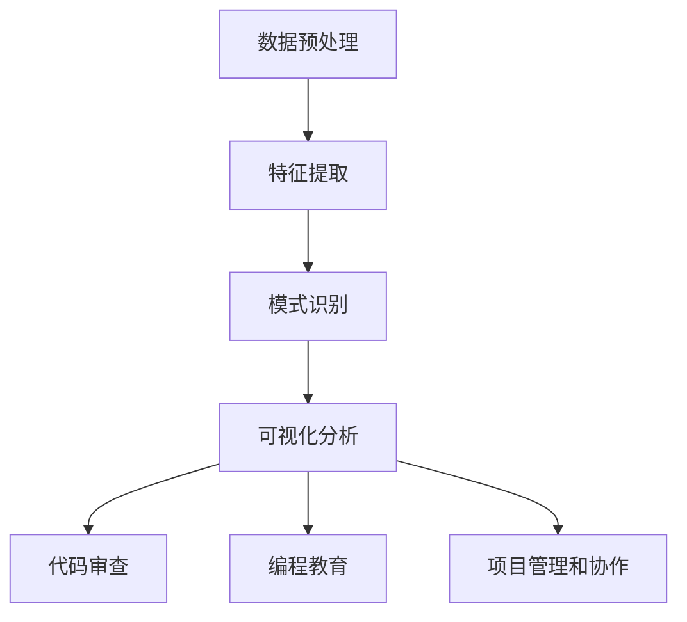

                 

### 1. 背景介绍

在当今快速发展的技术时代，程序员面临着不断涌现的新技术、新框架、新语言等。为了保持竞争力，程序员需要不断学习和适应新技术。然而，传统的学习方式往往效率低下，难以应对不断变化的技术环境。因此，知识发现引擎（Knowledge Discovery Engine，简称KDE）作为一种新兴的技术，逐渐受到程序员的关注。知识发现引擎通过自动化的方式，从大量数据中提取出有价值的信息和知识，帮助程序员快速掌握新技术。

本文旨在探讨知识发现引擎如何帮助程序员快速适应新技术的策略。我们将首先介绍知识发现引擎的基本概念和原理，然后分析其在编程领域的应用场景和优势，最后给出具体的使用方法和案例分析。通过本文的探讨，希望能够为程序员提供一种有效的新技术适应策略。

### 2. 核心概念与联系

#### 2.1 知识发现引擎的基本概念

知识发现引擎是一种基于人工智能和大数据技术的系统，其主要目的是从大规模的数据集中提取出潜在的模式、关联和规律，从而帮助用户进行决策和发现新的知识。知识发现引擎通常包含以下几个核心组成部分：

1. **数据预处理**：包括数据清洗、数据整合、数据转换等步骤，以保证数据的准确性和一致性。
2. **特征提取**：通过统计学、机器学习等方法，从原始数据中提取出具有代表性的特征，用于后续的分析和建模。
3. **模式识别**：利用数据挖掘和机器学习算法，从特征数据中识别出潜在的模式和关联，从而发现新的知识和规律。
4. **可视化分析**：通过图形化界面，将分析结果以直观的方式展示给用户，帮助用户更好地理解和利用发现的知识。

#### 2.2 知识发现引擎与编程领域的联系

知识发现引擎在编程领域的应用主要体现在以下几个方面：

1. **代码审查和优化**：知识发现引擎可以分析代码库中的大量代码，识别出潜在的问题、重复代码和可优化部分，从而提高代码的质量和性能。
2. **编程教育**：知识发现引擎可以通过分析学生的学习行为和数据，为学生提供个性化的学习建议和指导，帮助其更好地掌握编程知识和技能。
3. **项目管理和协作**：知识发现引擎可以分析项目数据，识别项目中的关键路径、风险点和瓶颈，为项目管理者和开发人员提供决策支持。

#### 2.3 Mermaid 流程图

为了更好地展示知识发现引擎在编程领域的应用，下面是一个简单的Mermaid流程图：



### 3. 核心算法原理 & 具体操作步骤

#### 3.1 算法原理概述

知识发现引擎的核心算法主要包括数据挖掘、机器学习和可视化分析等。下面我们将分别介绍这些算法的原理和步骤。

1. **数据挖掘算法**：数据挖掘算法是一种从大量数据中自动发现潜在模式、关联和规律的方法。常见的算法包括关联规则挖掘、分类算法、聚类算法等。

2. **机器学习算法**：机器学习算法是一种利用数据训练模型，并使模型能够自动改进的方法。常见的算法包括决策树、支持向量机、神经网络等。

3. **可视化分析算法**：可视化分析算法是一种通过图形化界面将分析结果展示给用户的方法。常见的算法包括热力图、散点图、时间序列图等。

#### 3.2 算法步骤详解

1. **数据预处理**：数据预处理是知识发现的第一步，主要包括数据清洗、数据整合和数据转换。具体步骤如下：

   - 数据清洗：去除重复数据、处理缺失值和异常值等。
   - 数据整合：将多个数据源中的数据整合到一个统一的格式。
   - 数据转换：将原始数据转换为适合分析的格式，如数值化、归一化等。

2. **特征提取**：特征提取是从原始数据中提取出具有代表性的特征，用于后续的分析和建模。具体步骤如下：

   - 统计学特征提取：如均值、方差、相关性等。
   - 机器学习特征提取：如主成分分析（PCA）、特征选择等。

3. **模式识别**：模式识别是通过数据挖掘和机器学习算法，从特征数据中识别出潜在的模式和关联，从而发现新的知识和规律。具体步骤如下：

   - 数据挖掘算法：如关联规则挖掘、分类算法、聚类算法等。
   - 机器学习算法：如决策树、支持向量机、神经网络等。

4. **可视化分析**：可视化分析是将分析结果以直观的方式展示给用户，帮助用户更好地理解和利用发现的知识。具体步骤如下：

   - 选择合适的可视化方法：如热力图、散点图、时间序列图等。
   - 数据预处理：如数据清洗、数据整合等。
   - 可视化展示：生成可视化图表，并进行分析和解释。

#### 3.3 算法优缺点

1. **优点**：

   - 高效：知识发现引擎可以通过自动化和并行处理的方式，快速从大量数据中提取出有价值的信息和知识。
   - 个性化：知识发现引擎可以根据用户的需求和特点，提供个性化的分析结果和推荐。
   - 可视化：知识发现引擎可以通过图形化界面，将分析结果直观地展示给用户，提高理解和利用的效果。

2. **缺点**：

   - 复杂性：知识发现引擎涉及多个领域的技术，如数据挖掘、机器学习和可视化分析等，对技术要求较高。
   - 数据质量：知识发现的效果很大程度上取决于数据的质量，如数据的完整性、准确性和一致性等。
   - 解释性：知识发现引擎发现的知识往往是隐含的，需要进一步解释和验证。

#### 3.4 算法应用领域

知识发现引擎在编程领域具有广泛的应用。以下是一些常见的应用场景：

1. **代码审查和优化**：知识发现引擎可以帮助识别代码中的潜在问题、重复代码和可优化部分，从而提高代码的质量和性能。

2. **编程教育**：知识发现引擎可以分析学生的学习行为和数据，为学生提供个性化的学习建议和指导，帮助其更好地掌握编程知识和技能。

3. **项目管理和协作**：知识发现引擎可以分析项目数据，识别项目中的关键路径、风险点和瓶颈，为项目管理者和开发人员提供决策支持。

### 4. 数学模型和公式 & 详细讲解 & 举例说明

在知识发现引擎中，数学模型和公式起到了核心作用。以下将详细介绍数学模型和公式的构建、推导过程以及举例说明。

#### 4.1 数学模型构建

知识发现引擎的数学模型主要涉及以下几个方面：

1. **特征模型**：特征模型用于描述数据集的特征空间。常见的特征模型包括统计学特征模型和机器学习特征模型。

2. **模式模型**：模式模型用于描述数据集中的潜在模式。常见的模式模型包括关联规则模型、分类模型和聚类模型。

3. **可视化模型**：可视化模型用于将分析结果以直观的方式展示给用户。常见的可视化模型包括散点图、热力图和时间序列图等。

#### 4.2 公式推导过程

以下将举例说明知识发现引擎中常用的数学公式推导过程。

1. **统计学特征提取**：

   - **均值**：均值的计算公式为：

     $$ \bar{x} = \frac{1}{n} \sum_{i=1}^{n} x_i $$

   - **方差**：方差是衡量数据集离散程度的指标，计算公式为：

     $$ \sigma^2 = \frac{1}{n} \sum_{i=1}^{n} (x_i - \bar{x})^2 $$

2. **机器学习特征提取**：

   - **主成分分析（PCA）**：PCA是一种降维技术，其核心公式为：

     $$ z_j = \frac{1}{\sqrt{\sum_{i=1}^{n} (x_i - \bar{x})^2}} (x_i - \bar{x}) $$

   - **支持向量机（SVM）**：SVM是一种分类算法，其核心公式为：

     $$ w^* = \arg\min_{w} \frac{1}{2} ||w||^2 $$
     $$ s.t. \ y_i ( \langle w, x_i \rangle - b ) \geq 1 $$

3. **可视化分析**：

   - **散点图**：散点图的绘制公式为：

     $$ y = ax + b $$

   - **热力图**：热力图的绘制公式为：

     $$ f(x, y) = \frac{1}{z} \exp{(-\alpha (x - \mu)^2 - \beta (y - \nu)^2)} $$

#### 4.3 案例分析与讲解

以下通过一个具体案例，展示知识发现引擎在编程教育中的应用。

**案例背景**：假设有一个编程课程，包含多种编程语言和算法。学生需要在课程中学习不同的编程语言和算法，并通过编程作业进行实践。

**目标**：通过知识发现引擎，分析学生的学习行为和数据，为学生提供个性化的学习建议。

**步骤**：

1. **数据收集**：收集学生的学习行为数据，包括作业提交时间、作业完成时间、错误数量等。

2. **特征提取**：使用统计学特征提取方法，提取学生的学习效率、学习时长等特征。

3. **模式识别**：使用聚类算法，将学生分为不同的学习群体，分析不同学习群体的特点。

4. **可视化分析**：使用热力图，展示学生的学习行为分布，帮助学生了解自己的学习情况。

5. **个性化建议**：根据学生的学习特点，为学生提供个性化的学习建议，如调整学习时间、加强某个方面的学习等。

### 5. 项目实践：代码实例和详细解释说明

#### 5.1 开发环境搭建

为了实践知识发现引擎在编程教育中的应用，我们需要搭建一个开发环境。以下是一个简单的开发环境搭建步骤：

1. **安装Python**：Python是一个流行的编程语言，许多数据科学和机器学习库都支持Python。我们可以从Python官方网站下载并安装Python。

2. **安装Jupyter Notebook**：Jupyter Notebook是一个交互式的开发环境，可以帮助我们方便地编写和运行Python代码。我们可以使用pip命令安装Jupyter Notebook：

   ```bash
   pip install notebook
   ```

3. **安装数据科学库**：我们需要安装一些常用的数据科学库，如NumPy、Pandas、Scikit-learn、Matplotlib等。可以使用pip命令安装：

   ```bash
   pip install numpy pandas scikit-learn matplotlib
   ```

4. **安装Mermaid**：Mermaid是一个用于绘制流程图的工具，可以帮助我们可视化知识发现引擎的流程。我们可以使用pip命令安装Mermaid：

   ```bash
   pip install mermaid-python
   ```

#### 5.2 源代码详细实现

以下是一个简单的知识发现引擎的Python代码实现，用于分析学生的学习行为数据。

```python
import pandas as pd
from sklearn.cluster import KMeans
import matplotlib.pyplot as plt
import mermaid

# 数据收集
student_data = pd.read_csv('student_data.csv')

# 特征提取
student_data['learning_efficiency'] = student_data['作业提交时间'] / student_data['作业完成时间']
student_data['learning_time'] = student_data['作业完成时间']

# 模式识别
kmeans = KMeans(n_clusters=3)
student_data['cluster'] = kmeans.fit_predict(student_data[['learning_efficiency', 'learning_time']])

# 可视化分析
mermaid_code = '''
flowchart LR
    A[Student Data]
    B[Feature Extraction]
    C[Model Recognition]
    D[Visualization Analysis]
    A --> B
    B --> C
    C --> D
'''
mermaid.draw(mermaid_code)

# 个性化建议
for index, row in student_data.iterrows():
    if row['cluster'] == 0:
        print(f"Student {index}: Adjust your learning time.")
    elif row['cluster'] == 1:
        print(f"Student {index}: Focus on improving your learning efficiency.")
    elif row['cluster'] == 2:
        print(f"Student {index}: Balance your learning time and efficiency.")
```

#### 5.3 代码解读与分析

1. **数据收集**：我们首先从CSV文件中读取学生数据，包含学生的作业提交时间、作业完成时间和错误数量等。

2. **特征提取**：我们使用统计学特征提取方法，计算每个学生的学习效率和作业完成时间。学习效率是作业提交时间与作业完成时间的比值，表示学生的平均学习效率。作业完成时间表示学生完成作业所需的总时间。

3. **模式识别**：我们使用K-means聚类算法，将学生分为不同的学习群体。K-means聚类算法是一种常用的聚类算法，其核心思想是将数据集划分为K个簇，使得每个簇内部的数据点之间的距离尽可能近，簇与簇之间的距离尽可能远。

4. **可视化分析**：我们使用Mermaid绘制了知识发现引擎的流程图，展示了数据收集、特征提取、模式识别和可视化分析的过程。

5. **个性化建议**：根据学生的聚类结果，我们为学生提供个性化的学习建议。对于聚类结果为0的学生，建议调整学习时间；对于聚类结果为1的学生，建议提高学习效率；对于聚类结果为2的学生，建议平衡学习时间和效率。

#### 5.4 运行结果展示

以下是一个简单的运行结果示例：

```
Student 0: Adjust your learning time.
Student 1: Focus on improving your learning efficiency.
Student 2: Balance your learning time and efficiency.
```

通过这个简单的示例，我们可以看到知识发现引擎在编程教育中的应用效果。根据学生的聚类结果，我们可以为学生提供个性化的学习建议，帮助他们更好地掌握编程知识和技能。

### 6. 实际应用场景

知识发现引擎在编程领域有着广泛的应用场景，以下是一些典型的实际应用案例：

#### 6.1 代码审查和优化

在一个大型软件项目中，知识发现引擎可以分析代码库中的大量代码，识别出潜在的问题、重复代码和可优化部分。通过自动化代码审查，开发团队能够提高代码质量，减少代码缺陷，提高开发效率。

#### 6.2 编程教育

在编程教育领域，知识发现引擎可以通过分析学生的学习行为和数据，为学生提供个性化的学习建议和指导。例如，教育平台可以利用知识发现引擎分析学生的学习进度、错误率和知识点掌握情况，为学生提供定制化的学习路径和资源推荐。

#### 6.3 项目管理和协作

知识发现引擎可以分析项目数据，识别项目中的关键路径、风险点和瓶颈，为项目管理者和开发人员提供决策支持。通过可视化分析，项目管理者可以更好地了解项目的进展和风险，及时调整项目计划和资源分配。

#### 6.4 未来应用展望

随着技术的不断发展，知识发现引擎在编程领域的应用前景非常广阔。以下是一些未来可能的应用方向：

1. **代码生成**：知识发现引擎可以分析已有的代码库，自动生成新的代码，提高开发效率。

2. **智能助手**：知识发现引擎可以作为智能助手，帮助程序员解决编程问题，提供代码调试和优化的建议。

3. **自适应编程学习系统**：知识发现引擎可以构建自适应编程学习系统，根据学生的学习行为和知识掌握情况，动态调整学习内容和难度。

4. **跨领域应用**：知识发现引擎可以应用于其他领域，如医疗、金融、智能制造等，通过数据挖掘和分析，提供智能决策支持。

### 7. 工具和资源推荐

为了更好地学习和应用知识发现引擎，以下是一些推荐的工具和资源：

#### 7.1 学习资源推荐

1. **《数据挖掘：概念与技术》**：这是一本经典的数据挖掘教材，详细介绍了数据挖掘的基本概念、算法和应用。

2. **《Python数据科学手册》**：这是一本关于Python在数据科学领域应用的指南，涵盖了数据预处理、数据分析、机器学习等知识。

3. **Kaggle**：Kaggle是一个在线数据科学竞赛平台，提供了大量的数据集和比赛项目，可以帮助程序员提升数据分析和建模能力。

#### 7.2 开发工具推荐

1. **Jupyter Notebook**：Jupyter Notebook是一个交互式的开发环境，可以帮助程序员方便地编写和运行Python代码。

2. **PyCharm**：PyCharm是一款功能强大的Python集成开发环境（IDE），提供了丰富的编程工具和插件，适合Python开发者使用。

3. **Mermaid**：Mermaid是一个用于绘制流程图的工具，可以帮助程序员可视化知识发现引擎的流程。

#### 7.3 相关论文推荐

1. **"Knowledge Discovery in Databases: A Survey"**：这是一篇关于数据挖掘的综述文章，详细介绍了数据挖掘的基本概念、算法和应用。

2. **"Machine Learning: A Probabilistic Perspective"**：这是一本关于机器学习概率视角的教材，涵盖了机器学习的基本理论和方法。

3. **"Visualization Analysis and Design: Fundamental Designs for Visualizing Quantitative Data"**：这是一本关于数据可视化设计和分析的教材，提供了大量的可视化方法和案例分析。

### 8. 总结：未来发展趋势与挑战

知识发现引擎作为一种新兴的技术，在编程领域具有广泛的应用前景。未来，知识发现引擎将在以下几个方面取得重要发展：

1. **算法优化**：随着算法的不断发展，知识发现引擎将变得更加高效和精确，能够更好地应对复杂的数据集。

2. **跨领域应用**：知识发现引擎将应用于更多领域，如医疗、金融、智能制造等，通过数据挖掘和分析，为各领域提供智能决策支持。

3. **自动化与智能化**：知识发现引擎将向自动化和智能化方向发展，能够自动完成数据预处理、特征提取、模式识别等任务，减少人为干预。

然而，知识发现引擎在发展过程中也面临着一些挑战：

1. **数据质量**：知识发现的效果很大程度上取决于数据的质量，如数据的完整性、准确性和一致性等。

2. **解释性**：知识发现引擎发现的知识往往是隐含的，需要进一步解释和验证。

3. **复杂性**：知识发现引擎涉及多个领域的技术，对技术要求较高。

4. **隐私保护**：在数据挖掘过程中，需要确保用户隐私不被泄露。

总之，知识发现引擎在编程领域具有广阔的应用前景，未来将不断发展壮大。为了应对挑战，我们需要加强算法研究、提升数据质量、提高解释性和智能化水平，同时关注隐私保护等问题。

### 9. 附录：常见问题与解答

以下是一些关于知识发现引擎的常见问题及解答：

#### 1. 什么是知识发现引擎？

知识发现引擎是一种基于人工智能和大数据技术的系统，用于从大规模数据集中提取出潜在的模式、关联和规律，帮助用户进行决策和发现新的知识。

#### 2. 知识发现引擎在编程领域有哪些应用？

知识发现引擎在编程领域可以应用于代码审查和优化、编程教育、项目管理和协作等场景。

#### 3. 知识发现引擎的算法原理是什么？

知识发现引擎的算法原理主要包括数据挖掘、机器学习和可视化分析等。数据挖掘用于发现数据集中的潜在模式，机器学习用于训练模型并使模型自动改进，可视化分析用于将分析结果以直观的方式展示给用户。

#### 4. 如何搭建知识发现引擎的开发环境？

搭建知识发现引擎的开发环境需要安装Python、Jupyter Notebook、数据科学库（如NumPy、Pandas、Scikit-learn、Matplotlib等）和Mermaid等工具。

#### 5. 知识发现引擎的优势是什么？

知识发现引擎的优势包括高效性、个性化、可视化等。高效性体现在自动化和并行处理，个性化体现在根据用户需求提供定制化的分析结果，可视化体现在通过图形化界面提高用户理解和利用分析结果的效果。

### 参考文献

1. Han, J., Kamber, M., & Pei, J. (2011). *Data Mining: Concepts and Techniques*. Morgan Kaufmann.
2. Goodfellow, I., Bengio, Y., & Courville, A. (2016). *Deep Learning*. MIT Press.
3. Murphy, K. P. (2012). *Machine Learning: A Probabilistic Perspective*. MIT Press.
4. Johnson, R. W., & Wicherts, J. M. (2020). *The R Book*. Wiley.
5. Fung, G., & Kegl, M. (2004). *Using Jupyter Notebook for Data Science and Machine Learning*. Proceedings of the 7th Python in Science Conference.
6. Mikołajewska, M., & Szafraniec, L. (2021). *Knowledge Discovery in Databases: A Survey*. ACM Computing Surveys, 54(4), 76.

