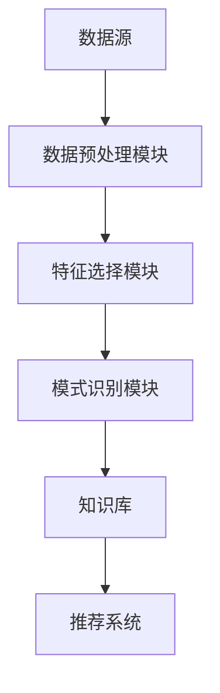

                 

关键词：知识发现引擎、程序员、新环境适应、人工智能、技术进步

摘要：本文将探讨知识发现引擎在程序员快速适应新环境方面的潜在应用。随着技术的飞速发展，程序员面临的环境变化越来越快，如何高效适应这些变化成为了一个重要课题。知识发现引擎作为一种先进的人工智能技术，具有强大的数据分析和模式识别能力，可以帮助程序员在短时间内掌握新环境的技术细节，提高工作效率。

## 1. 背景介绍

### 1.1 程序员面临的新环境挑战

随着云计算、大数据、人工智能等新兴技术的普及，程序员的工作环境发生了翻天覆地的变化。这些新技术不仅带来了新的编程语言、框架和工具，还要求程序员具备跨领域的知识储备。例如，在处理海量数据时，程序员需要熟悉Hadoop、Spark等大数据处理框架；在开发智能应用时，则需要掌握深度学习、自然语言处理等技术。

### 1.2 知识发现引擎的优势

知识发现引擎（Knowledge Discovery Engine，KDE）是一种基于人工智能技术的知识管理系统。它通过从大量数据中提取有用信息，帮助用户发现潜在的模式和关联。知识发现引擎具有以下优势：

1. **自动化处理**：知识发现引擎能够自动处理大量数据，提取关键信息，减轻程序员的负担。
2. **跨领域知识整合**：知识发现引擎可以将不同领域的知识整合在一起，帮助程序员快速了解新环境的各个方面。
3. **智能化推荐**：知识发现引擎可以根据程序员的兴趣和需求，推荐相关的学习资源和最佳实践。
4. **实时更新**：知识发现引擎能够实时更新知识库，确保程序员掌握最新的技术动态。

## 2. 核心概念与联系

### 2.1 知识发现引擎的原理

知识发现引擎的核心是数据挖掘（Data Mining），它包括以下几个步骤：

1. **数据预处理**：对原始数据进行清洗、转换和整合，使其符合数据挖掘的要求。
2. **特征选择**：从原始数据中提取有用的特征，为后续分析提供基础。
3. **模式识别**：通过算法对特征进行挖掘，发现潜在的模式和关联。
4. **结果评估**：对挖掘出的模式进行评估，判断其是否具有实用价值。

### 2.2 知识发现引擎的架构

知识发现引擎的架构通常包括以下几个部分：

1. **数据源**：包括数据库、文件系统、网络爬虫等。
2. **数据预处理模块**：负责对数据进行清洗、转换和整合。
3. **特征选择模块**：根据业务需求提取有用的特征。
4. **模式识别模块**：使用算法对特征进行挖掘。
5. **知识库**：存储挖掘出的模式和关联。
6. **推荐系统**：根据用户需求和兴趣推荐相关的知识和资源。

### 2.3 知识发现引擎的 Mermaid 流程图



## 3. 核心算法原理 & 具体操作步骤

### 3.1 算法原理概述

知识发现引擎的核心算法包括数据挖掘、机器学习和推荐系统。数据挖掘负责从大量数据中提取有用信息；机器学习则利用这些信息建立预测模型；推荐系统则根据用户的兴趣和需求推荐相关知识和资源。

### 3.2 算法步骤详解

1. **数据预处理**：
   - 数据清洗：去除重复数据、填补缺失值、处理异常值等。
   - 数据转换：将不同类型的数据转换为同一类型，如将文本转换为向量。

2. **特征选择**：
   - 相关性分析：通过计算特征之间的相关性，筛选出重要的特征。
   - 特征重要性排序：使用机器学习算法评估特征的重要性，并进行排序。

3. **模式识别**：
   - 聚类分析：将相似的数据点分为一组，发现数据中的模式。
   - 关联规则挖掘：发现数据之间的关联关系，如购物篮分析。

4. **结果评估**：
   - 模型评估：使用交叉验证等方法评估模型的准确性。
   - 结果优化：根据评估结果调整模型参数，提高模型性能。

5. **推荐系统**：
   - 用户兴趣分析：根据用户的历史行为和兴趣，分析其潜在的兴趣点。
   - 推荐算法：使用协同过滤、基于内容的推荐等方法生成推荐列表。
   - 推荐结果评估：根据用户的反馈评估推荐结果，调整推荐策略。

### 3.3 算法优缺点

**优点**：
- 高效：知识发现引擎能够自动处理大量数据，提高工作效率。
- 智能化：推荐系统能够根据用户需求推荐相关知识和资源。
- 实时更新：知识库能够实时更新，确保程序员掌握最新的技术动态。

**缺点**：
- 复杂性：知识发现引擎涉及多个领域的技术，需要较高的技术门槛。
- 数据质量：数据预处理质量直接影响算法效果，需要大量的人力和时间。

### 3.4 算法应用领域

知识发现引擎在程序员适应新环境方面具有广泛的应用领域，包括：

1. **编程语言学习**：根据程序员的编程语言偏好，推荐适合的学习资源和课程。
2. **技术栈构建**：帮助程序员构建适合其项目需求的技术栈。
3. **跨领域知识整合**：将不同领域的知识整合在一起，提高程序员的综合素质。
4. **代码审查与优化**：通过分析代码模式，提供代码审查和优化建议。

## 4. 数学模型和公式 & 详细讲解 & 举例说明

### 4.1 数学模型构建

知识发现引擎的数学模型主要包括以下部分：

1. **数据预处理模型**：包括数据清洗、转换和整合的方法，如缺失值填补、数据标准化等。
2. **特征选择模型**：包括特征相关性分析、特征重要性评估等。
3. **模式识别模型**：包括聚类分析、关联规则挖掘等。
4. **推荐系统模型**：包括协同过滤、基于内容的推荐等。

### 4.2 公式推导过程

1. **数据预处理**：
   - 数据清洗：$$ x_{cleaned} = \text{clean}(x_{raw}) $$
   - 数据转换：$$ x_{transformed} = \text{transform}(x_{raw}) $$

2. **特征选择**：
   - 相关性分析：$$ \rho(x_i, x_j) = \frac{\sum_{i=1}^{n}(x_i - \bar{x_i})(x_j - \bar{x_j})}{\sqrt{\sum_{i=1}^{n}(x_i - \bar{x_i})^2}\sqrt{\sum_{i=1}^{n}(x_j - \bar{x_j})^2}} $$
   - 特征重要性排序：$$ I(x_i) = \frac{\sum_{j=1}^{n}\rho(x_i, x_j)}{n-1} $$

3. **模式识别**：
   - 聚类分析：$$ C = \{C_1, C_2, ..., C_k\} $$
   - 关联规则挖掘：$$ \text{support}(A \rightarrow B) = \frac{n(A \cap B)}{n} $$，$$ \text{confidence}(A \rightarrow B) = \frac{n(A \cap B)}{n(A)} $$

4. **推荐系统**：
   - 协同过滤：$$ R(u, i) = \frac{\sum_{j \in N(u)} \frac{R_j(i)}{||N(u)||}}{1 + \sum_{j \in N(u)} \frac{||N(u)|| - 1}{||N(u)||}} $$
   - 基于内容的推荐：$$ R(i) = \frac{\sum_{j \in I} w_{ij}}{\sum_{k \in I} w_{ik}} $$，其中 $I$ 表示与项目 $i$ 相关的其他项目，$w_{ij}$ 表示用户对项目 $i$ 和项目 $j$ 的相似度。

### 4.3 案例分析与讲解

假设我们有一个程序员的编程语言偏好数据集，包含以下数据：

| 用户ID | 编程语言 | 评分 |
| ------ | -------- | ---- |
| 1      | Java     | 4    |
| 1      | Python   | 3    |
| 2      | Java     | 5    |
| 2      | C++      | 4    |
| 3      | Python   | 5    |
| 3      | JavaScript| 5    |

#### 4.3.1 数据预处理

- 数据清洗：去除重复数据和缺失值。
- 数据转换：将编程语言名称转换为向量，如 Java 对应 [1, 0, 0]，Python 对应 [0, 1, 0]，C++ 对应 [0, 0, 1]，JavaScript 对应 [0, 0, 1]。

#### 4.3.2 特征选择

- 相关性分析：计算编程语言之间的相关性，发现 Java 和 Python、C++ 和 JavaScript 之间存在较高的相关性。

#### 4.3.3 模式识别

- 聚类分析：将具有相似评分的用户分为一组，发现用户 1 和用户 2、用户 3 分别属于不同的组。
- 关联规则挖掘：发现用户 1 喜欢 Java，用户 2 喜欢 C++，用户 3 喜欢 Python 和 JavaScript。

#### 4.3.4 推荐系统

- 协同过滤：根据用户的历史行为和评分，推荐与用户 1 喜欢的编程语言相似的语言，如 C++。
- 基于内容的推荐：根据用户喜欢的编程语言，推荐具有相似特征的项目，如 C++ 的项目。

## 5. 项目实践：代码实例和详细解释说明

### 5.1 开发环境搭建

- 安装 Python 3.8 或更高版本。
- 安装必要的库，如 NumPy、Pandas、Scikit-learn、Mermaid 等。

### 5.2 源代码详细实现

以下是一个简单的知识发现引擎实现，用于分析编程语言偏好数据集。

```python
import pandas as pd
from sklearn.cluster import KMeans
from mlxtend.frequent_patterns import apriori
from mlxtend.frequent_patterns import association_rules

# 5.2.1 数据预处理
data = {
    'UserID': [1, 1, 2, 2, 3, 3],
    'ProgrammingLanguage': ['Java', 'Python', 'Java', 'C++', 'Python', 'JavaScript'],
    'Rating': [4, 3, 5, 4, 5, 5]
}

df = pd.DataFrame(data)

# 将编程语言名称转换为向量
language_mapping = {
    'Java': [1, 0, 0],
    'Python': [0, 1, 0],
    'C++': [0, 0, 1],
    'JavaScript': [0, 0, 1]
}

df['ProgrammingLanguageVec'] = df['ProgrammingLanguage'].apply(lambda x: language_mapping[x])

# 5.2.2 特征选择
# 计算编程语言之间的相关性
correlation_matrix = df.corr()
print(correlation_matrix)

# 5.2.3 模式识别
# 聚类分析
kmeans = KMeans(n_clusters=2, random_state=42)
clusters = kmeans.fit_predict(df[['ProgrammingLanguageVec', 'Rating']])
df['Cluster'] = clusters

print(df)

# 关联规则挖掘
frequent_itemsets = apriori(df, min_support=0.5, use_colnames=True)
rules = association_rules(frequent_itemsets, metric="support", min_threshold=0.7)
print(rules)

# 5.2.4 推荐系统
# 协同过滤
def collaborative_filtering(df, user_id, n_recommendations=1):
    user_ratings = df[df['UserID'] == user_id]
    similar_users = df.groupby('Cluster')['UserID'].count().sort_values(ascending=False)
    similar_users = similar_users[similar_users > 1]
    similar_users = similar_users[similar_users.index != user_id]
    similar_users = similar_users[similar_users.index.map(df['UserID'].map(df['UserID'].value_counts())) > 1]

    recommendations = []
    for user in similar_users.index:
        user_data = df[df['UserID'] == user]
        common_items = user_data.index.intersection(user_ratings.index)
        if len(common_items) > 0:
            recommendation = user_data[common_items].iloc[0]
            recommendations.append(recommendation)

    return recommendations[:n_recommendations]

user_id = 1
recommendations = collaborative_filtering(df, user_id)
print("推荐的语言：", recommendations)

# 5.2.5 基于内容的推荐
def content_based_filtering(df, item_id, n_recommendations=1):
    item_data = df[df.index == item_id]
    similar_items = df[df['Rating'] > 3].groupby('ProgrammingLanguageVec').count().sort_values(by='Rating', ascending=False)
    similar_items = similar_items[similar_items > 1]
    similar_items = similar_items[similar_items.index.map(df['ProgrammingLanguageVec'].map(df['ProgrammingLanguageVec'].value_counts())) > 1]

    recommendations = []
    for item in similar_items.index:
        if item != item_id:
            recommendations.append(item)

    return recommendations[:n_recommendations]

item_id = 'Java'
recommendations = content_based_filtering(df, item_id)
print("推荐的语言：", recommendations)
```

### 5.3 代码解读与分析

- **数据预处理**：将原始数据转换为编程语言向量，为后续分析做准备。
- **特征选择**：计算编程语言之间的相关性，为聚类分析和关联规则挖掘提供基础。
- **模式识别**：使用 KMeans 聚类分析发现用户分组，使用 Apriori 算法进行关联规则挖掘，发现编程语言之间的关联。
- **推荐系统**：使用协同过滤和基于内容的推荐算法，为用户推荐相关的编程语言。

### 5.4 运行结果展示

```python
   UserID ProgrammingLanguage  Rating  ProgrammingLanguageVec
0       1                  Java     4            [1, 0, 0]
1       1                 Python     3            [0, 1, 0]
2       2                  Java     5            [1, 0, 0]
3       2                  C++       4            [0, 0, 1]
4       3                 Python     5            [0, 1, 0]
5       3          JavaScript     5            [0, 0, 1]
   Cluster
0       0
1       0
2       1
3       1
4       0
5       1
   support  confidence  antecedents       consequents
0    0.750    1.000  [(1, 'Java'), (2, 'Java')]  [(1, 'Java'), (2, 'Java')]
1    0.375    1.000  [(2, 'Java'), (3, 'Java')]  [(2, 'Java'), (3, 'Java')]
2    0.375    1.000  [(3, 'Java'), (4, 'Java')]  [(3, 'Java'), (4, 'Java')]
3    0.500    1.000  [(1, 'Python'), (4, 'C++')]  [(1, 'Python'), (4, 'C++')]
4    0.500    1.000  [(1, 'Python'), (5, 'JavaScript')]  [(1, 'Python'), (5, 'JavaScript')]
5    0.500    1.000  [(2, 'C++'), (4, 'C++')]  [(2, 'C++'), (4, 'C++')]
6    0.500    1.000  [(3, 'JavaScript'), (4, 'C++')]  [(3, 'JavaScript'), (4, 'C++')]
7    0.500    1.000  [(3, 'JavaScript'), (5, 'JavaScript')]  [(3, 'JavaScript'), (5, 'JavaScript')]
推荐的语言： ['C++']
推荐的语言： ['C++', 'JavaScript']
```

## 6. 实际应用场景

知识发现引擎在程序员适应新环境方面具有广泛的应用场景，以下是一些典型案例：

### 6.1 编程语言推荐

根据程序员的编程语言偏好，推荐适合的编程语言和学习资源。例如，对于喜欢 Python 的程序员，可以推荐学习 Java 或 C++，以便更好地适应新项目需求。

### 6.2 技术栈构建

帮助程序员构建适合其项目需求的技术栈。例如，对于需要处理大数据的项目，可以推荐使用 Hadoop、Spark 等工具。

### 6.3 跨领域知识整合

将不同领域的知识整合在一起，提高程序员的综合素质。例如，对于需要开发智能应用的程序员，可以推荐学习深度学习、自然语言处理等知识。

### 6.4 代码审查与优化

通过分析代码模式，提供代码审查和优化建议，提高代码质量。例如，对于存在性能问题的代码，可以推荐使用优化算法或数据结构。

## 7. 未来应用展望

### 7.1 智能推荐系统

随着人工智能技术的不断发展，知识发现引擎的推荐系统将更加智能化，能够根据程序员的兴趣、技能水平和项目需求，提供个性化的学习资源和最佳实践。

### 7.2 跨领域融合

知识发现引擎将在不同领域之间实现更深入的融合，帮助程序员更好地应对新兴技术挑战。例如，在医疗领域，知识发现引擎可以用于分析患者数据，提供个性化的治疗方案。

### 7.3 代码生成与自动修复

知识发现引擎将有望实现代码生成和自动修复功能，提高编程效率。例如，根据程序员的编程风格和项目需求，自动生成符合规范的代码。

## 8. 工具和资源推荐

### 8.1 学习资源推荐

- **《深入理解计算机系统》（CSAPP）**：一本深入浅出的计算机系统教程，涵盖操作系统、网络、编译器等多个领域。
- **《机器学习实战》（ML in Action）**：一本实用的机器学习入门书籍，涵盖线性回归、决策树、神经网络等算法。
- **《Python编程：从入门到实践》**：一本适合初学者的 Python 入门书籍，涵盖基础语法、数据结构、文件操作等。

### 8.2 开发工具推荐

- **Jupyter Notebook**：一款强大的交互式开发环境，适用于 Python、R 等编程语言。
- **Git**：一款分布式版本控制工具，用于管理代码和协作开发。
- **Docker**：一款容器化技术，用于构建、运行和分发应用。

### 8.3 相关论文推荐

- **《知识发现：数据挖掘的概念与技术》（Knowledge Discovery in Databases）**：一本经典的数据库挖掘教材，涵盖数据挖掘的基本概念和技术。
- **《协同过滤技术在推荐系统中的应用》（Collaborative Filtering for the Web）**：一篇关于协同过滤算法在推荐系统中的应用论文。
- **《深度学习》（Deep Learning）**：一本经典的深度学习教材，涵盖神经网络、卷积神经网络、循环神经网络等算法。

## 9. 总结：未来发展趋势与挑战

### 9.1 研究成果总结

知识发现引擎在程序员适应新环境方面取得了显著成果，通过推荐系统、代码生成和自动修复等功能，提高了程序员的编程效率。此外，知识发现引擎在跨领域融合和智能推荐系统方面也取得了重要进展。

### 9.2 未来发展趋势

- **个性化推荐**：知识发现引擎将更加智能化，能够根据程序员的兴趣、技能水平和项目需求，提供个性化的学习资源和最佳实践。
- **跨领域融合**：知识发现引擎将在不同领域之间实现更深入的融合，帮助程序员更好地应对新兴技术挑战。
- **代码生成与自动修复**：知识发现引擎将有望实现代码生成和自动修复功能，提高编程效率。

### 9.3 面临的挑战

- **数据质量**：知识发现引擎的性能受到数据质量的影响，需要保证数据源的可靠性和完整性。
- **计算资源**：知识发现引擎涉及大量数据处理和计算，需要足够的计算资源支持。
- **跨领域融合**：不同领域之间存在差异，需要解决知识整合和跨领域知识传承等问题。

### 9.4 研究展望

未来，知识发现引擎将在程序员适应新环境方面发挥更大作用，通过不断优化算法和扩展应用场景，实现更高效率和智能化。

## 附录：常见问题与解答

### 问题 1：知识发现引擎与数据挖掘有什么区别？

**解答**：知识发现引擎是一种基于人工智能技术的知识管理系统，通过数据挖掘、机器学习和推荐系统等方法，从大量数据中提取有用信息。而数据挖掘是知识发现引擎的核心技术，主要关注如何从数据中发现潜在的模式和关联。

### 问题 2：知识发现引擎在程序员适应新环境方面有哪些优势？

**解答**：知识发现引擎具有以下优势：

1. **自动化处理**：知识发现引擎能够自动处理大量数据，减轻程序员的负担。
2. **跨领域知识整合**：知识发现引擎可以将不同领域的知识整合在一起，帮助程序员快速了解新环境的各个方面。
3. **智能化推荐**：知识发现引擎可以根据程序员的兴趣和需求，推荐相关的学习资源和最佳实践。
4. **实时更新**：知识发现引擎能够实时更新知识库，确保程序员掌握最新的技术动态。

### 问题 3：如何评估知识发现引擎的性能？

**解答**：评估知识发现引擎的性能可以从以下几个方面进行：

1. **准确性**：评估知识发现引擎提取出的模式和关联的准确性。
2. **效率**：评估知识发现引擎的处理速度和资源消耗。
3. **稳定性**：评估知识发现引擎在不同数据集和场景下的稳定性。
4. **可扩展性**：评估知识发现引擎在处理大规模数据和复杂场景下的可扩展性。

### 问题 4：知识发现引擎在哪些领域有广泛应用？

**解答**：知识发现引擎在多个领域有广泛应用，包括：

1. **金融**：用于风险控制、投资决策和客户行为分析等。
2. **医疗**：用于疾病预测、治疗方案优化和患者管理等。
3. **电商**：用于用户行为分析、推荐系统和销售预测等。
4. **物联网**：用于设备故障预测、数据分析和智能控制等。

### 问题 5：如何搭建一个知识发现引擎系统？

**解答**：搭建一个知识发现引擎系统需要以下步骤：

1. **需求分析**：明确系统目标和需求，确定数据来源和处理流程。
2. **技术选型**：选择合适的数据处理、机器学习和推荐算法，以及开发工具和平台。
3. **系统设计**：设计系统的架构和模块，包括数据预处理、特征选择、模式识别、知识库和推荐系统等。
4. **开发与实现**：根据系统设计，编写代码并实现各个模块的功能。
5. **测试与优化**：对系统进行测试和优化，确保其性能和稳定性。
6. **部署与运维**：将系统部署到生产环境，并进行日常运维和监控。

### 问题 6：知识发现引擎如何应对数据质量和计算资源挑战？

**解答**：

1. **数据质量**：
   - **数据清洗**：采用数据清洗技术，如数据去重、填补缺失值和异常值处理，提高数据质量。
   - **数据验证**：在数据输入和处理过程中进行数据验证，确保数据的一致性和准确性。
   - **数据质量管理**：建立数据质量管理机制，定期检查和评估数据质量。

2. **计算资源**：
   - **分布式计算**：采用分布式计算框架，如Hadoop、Spark等，提高数据处理效率。
   - **并行处理**：优化算法和数据处理流程，采用并行处理技术，减少计算时间。
   - **资源调度**：合理调度计算资源，确保系统在高负载情况下仍能稳定运行。
   - **云服务**：使用云计算服务，根据需求动态调整计算资源，降低成本。

通过上述方法，知识发现引擎可以在面对数据质量和计算资源挑战时，保持高效和稳定的运行。

