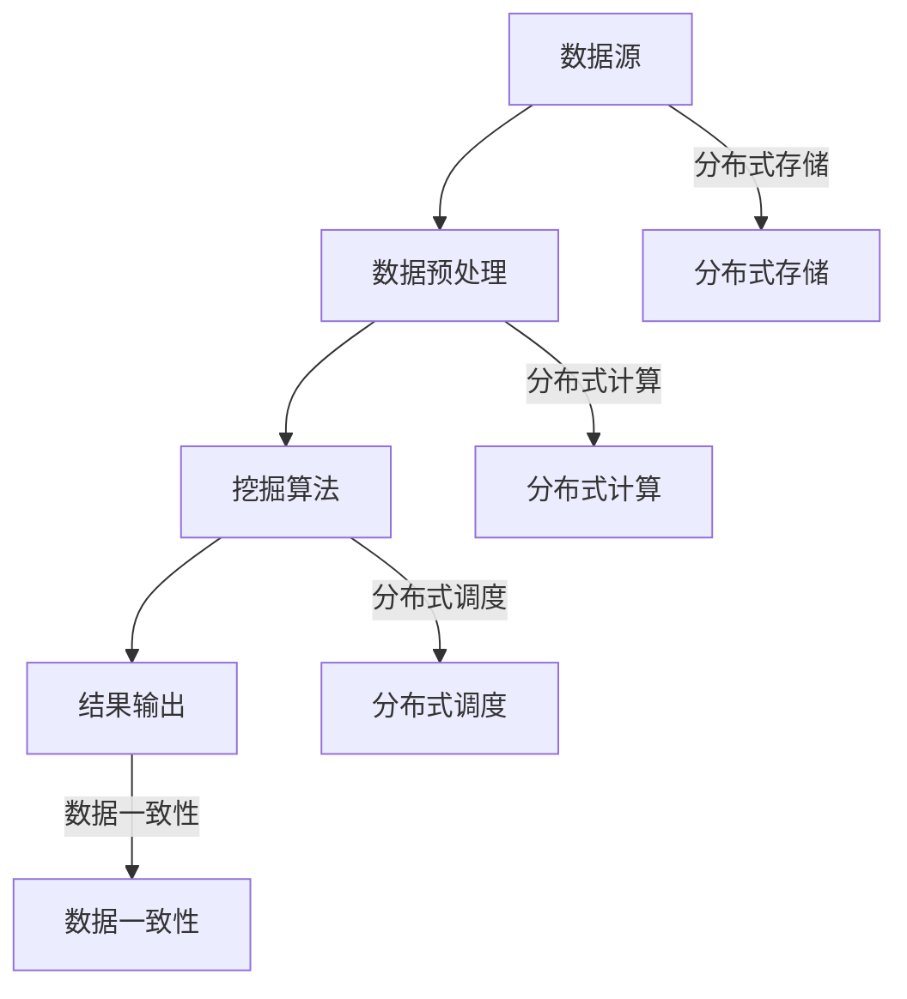

                 

关键词：知识发现引擎、分布式架构、设计与实现、性能优化、数据密集型应用、机器学习、分布式计算、云计算

## 摘要

本文主要探讨了知识发现引擎的分布式架构设计与实现。知识发现引擎是一种能够在大量数据中自动发现知识的技术，广泛应用于数据挖掘、商业智能和智能推荐等领域。随着数据量的爆炸性增长，分布式架构成为提高知识发现引擎性能和可扩展性的关键。本文将深入分析分布式架构的核心概念，探讨其设计原则和实现方法，并通过实例展示如何利用分布式计算技术实现知识发现引擎。此外，本文还将介绍分布式架构的性能优化策略和实际应用场景，以及未来的发展趋势和挑战。

## 1. 背景介绍

### 1.1 知识发现引擎简介

知识发现引擎（Knowledge Discovery Engine，KDE）是一种基于数据挖掘和机器学习技术的系统，旨在从大量数据中自动发现潜在的、有价值的知识。知识发现引擎的主要功能包括数据预处理、模式识别、关联规则挖掘、聚类分析、分类预测等。这些功能使得知识发现引擎能够广泛应用于各个领域，如金融、医疗、电商、社交媒体等。

### 1.2 分布式架构的兴起

随着互联网的普及和数据量的爆炸性增长，传统的单机架构已经无法满足知识发现引擎的性能和可扩展性需求。分布式架构因其高性能、高可用性和可扩展性等优点，逐渐成为现代数据密集型应用的主流选择。分布式架构允许将任务分解为多个子任务，并在多个节点上并行执行，从而显著提高处理速度和效率。

### 1.3 知识发现引擎面临的挑战

知识发现引擎在处理大规模数据时面临着诸多挑战，如数据存储、数据传输、任务调度、负载均衡等。分布式架构的引入有助于解决这些问题，但同时也带来了新的挑战，如数据一致性问题、分布式存储管理、分布式计算调度等。因此，如何设计一个高效、可扩展且稳定的分布式知识发现引擎架构，成为当前研究的热点问题。

## 2. 核心概念与联系

### 2.1 分布式系统基本概念

分布式系统是由多个独立节点组成的系统，这些节点通过网络相互连接，协同完成计算任务。分布式系统的主要目标是提高系统的性能、可用性和可扩展性。

- **节点**：分布式系统中的独立计算单元，通常由硬件和软件组成。
- **通信**：节点之间的信息交换，通常通过网络进行。
- **一致性**：分布式系统中数据的一致性，即多个节点上的数据保持相同。
- **容错性**：分布式系统能够在部分节点故障时继续正常运行。

### 2.2 知识发现引擎的核心概念

知识发现引擎的核心概念包括数据源、数据预处理、挖掘算法、结果输出等。

- **数据源**：知识发现引擎的数据来源，可以是数据库、文件、API等。
- **数据预处理**：将原始数据转换为适合挖掘算法的形式，如去重、清洗、归一化等。
- **挖掘算法**：用于发现数据中潜在知识的算法，如聚类、分类、关联规则挖掘等。
- **结果输出**：将挖掘结果以可视化的形式展示给用户。

### 2.3 分布式架构与知识发现引擎的联系

分布式架构与知识发现引擎密切相关，二者共同构成了一个高效、可扩展的知识发现系统。

- **分布式存储**：分布式存储系统能够存储海量数据，并提供高吞吐量和低延迟的数据访问。
- **分布式计算**：分布式计算框架能够将知识发现任务分解为多个子任务，并在多个节点上并行执行。
- **任务调度**：分布式调度系统能够根据节点的负载情况，动态地分配任务，确保系统的高效运行。
- **数据一致性**：分布式一致性算法能够保证分布式系统中数据的一致性，确保挖掘结果的准确性。

### 2.4 Mermaid 流程图



## 3. 核心算法原理 & 具体操作步骤

### 3.1 算法原理概述

知识发现引擎的核心算法包括数据预处理、挖掘算法和结果输出。数据预处理主要包括去重、清洗、归一化等操作；挖掘算法包括聚类、分类、关联规则挖掘等；结果输出通常以可视化的形式展示给用户。

### 3.2 算法步骤详解

1. **数据预处理**：

   - **去重**：去除重复数据，提高数据质量。
   - **清洗**：修复错误数据、缺失数据和异常值，确保数据的准确性。
   - **归一化**：将数据转换为统一尺度，便于后续分析。

2. **挖掘算法**：

   - **聚类**：将数据分为若干个簇，使得同一簇中的数据相似度较高，不同簇之间的数据相似度较低。
   - **分类**：将数据分为预定义的类别，用于预测未知数据的类别。
   - **关联规则挖掘**：发现数据中频繁出现的关联规则，用于预测用户行为和推荐商品。

3. **结果输出**：

   - **可视化**：使用图表、报表等形式将挖掘结果展示给用户，便于用户理解和分析。

### 3.3 算法优缺点

1. **优点**：

   - **高性能**：分布式架构能够充分利用多节点计算能力，提高知识发现引擎的性能。
   - **可扩展性**：分布式架构能够灵活扩展，适应数据量的增长。
   - **高可用性**：分布式系统具有较高的容错性，能够在部分节点故障时继续正常运行。

2. **缺点**：

   - **复杂性**：分布式架构的设计和实现相对复杂，需要考虑数据一致性、任务调度、负载均衡等问题。
   - **通信开销**：分布式系统中的节点需要进行通信，可能导致额外的通信开销。

### 3.4 算法应用领域

知识发现引擎广泛应用于各个领域，如：

- **金融**：风险控制、欺诈检测、信用评分等。
- **医疗**：疾病预测、药物研发、患者数据分析等。
- **电商**：用户行为分析、商品推荐、销售预测等。
- **社交媒体**：情感分析、话题挖掘、用户活跃度预测等。

## 4. 数学模型和公式 & 详细讲解 & 举例说明

### 4.1 数学模型构建

知识发现引擎的数学模型主要包括数据预处理模型、挖掘算法模型和结果输出模型。

1. **数据预处理模型**：

   - **去重**：使用哈希表实现。
   - **清洗**：使用分类器实现。
   - **归一化**：使用线性变换实现。

2. **挖掘算法模型**：

   - **聚类**：使用K-means算法实现。
   - **分类**：使用决策树或神经网络实现。
   - **关联规则挖掘**：使用Apriori算法实现。

3. **结果输出模型**：

   - **可视化**：使用图表库实现。

### 4.2 公式推导过程

1. **去重**：

   - **哈希表**：哈希函数 $$h(x) = x \mod n$$，其中 $$n$$ 为哈希表的大小。
   - **冲突解决**：使用链地址法或开放地址法。

2. **清洗**：

   - **分类器**：使用逻辑回归或支持向量机实现。
   - **损失函数**：使用交叉熵损失函数。

3. **归一化**：

   - **线性变换**：$$y = ax + b$$，其中 $$a$$ 和 $$b$$ 为常数。

4. **聚类**：

   - **K-means算法**：
     - 初始化中心点：随机选择 $$k$$ 个数据点作为初始中心点。
     - 分配数据点：计算每个数据点到各个中心点的距离，将其分配到距离最近的中心点所在簇。
     - 更新中心点：计算每个簇的数据点的平均值，作为新的中心点。
     - 重复步骤2和3，直至中心点不再发生改变。

5. **分类**：

   - **决策树**：
     - 选择特征：计算每个特征的信息增益。
     - 划分数据：根据特征的最佳划分点，将数据划分为子集。
     - 递归构建树：对每个子集，重复以上步骤，直至达到停止条件。

6. **关联规则挖掘**：

   - **Apriori算法**：
     - 初始化：生成所有长度为1的频繁项集。
     - 递归扩展：对每个频繁项集，生成其所有后继项集。
     - 修剪：删除不满足最小支持度的项集。

### 4.3 案例分析与讲解

以电商领域为例，假设我们需要挖掘用户购买行为中的关联规则。

1. **数据预处理**：

   - **去重**：去除重复的购买记录。
   - **清洗**：修复缺失数据和异常值。
   - **归一化**：将购买金额、购买数量等特征进行归一化处理。

2. **挖掘算法**：

   - **聚类**：使用K-means算法将用户划分为不同类别。
   - **分类**：使用决策树算法对用户进行分类。
   - **关联规则挖掘**：使用Apriori算法挖掘用户购买行为中的关联规则。

3. **结果输出**：

   - **可视化**：使用图表展示聚类结果、分类结果和关联规则。

## 5. 项目实践：代码实例和详细解释说明

### 5.1 开发环境搭建

1. **硬件环境**：

   - 服务器：4核CPU、16GB内存、1TB硬盘。
   - 网络环境：千兆局域网。

2. **软件环境**：

   - 操作系统：Linux（如Ubuntu 18.04）。
   - 开发语言：Python（3.8及以上版本）。
   - 分布式计算框架：Apache Spark（2.4及以上版本）。

### 5.2 源代码详细实现

1. **数据预处理**：

   - **去重**：

     ```python
     def remove_duplicates(data):
         return list(set(data))
     ```

   - **清洗**：

     ```python
     def clean_data(data):
         return [x for x in data if x is not None and not isinstance(x, str)]
     ```

   - **归一化**：

     ```python
     def normalize_data(data):
         min_value = min(data)
         max_value = max(data)
         return [(x - min_value) / (max_value - min_value) for x in data]
     ```

2. **挖掘算法**：

   - **聚类**：

     ```python
     from sklearn.cluster import KMeans

     def kmeans_clustering(data, n_clusters=3):
         kmeans = KMeans(n_clusters=n_clusters)
         kmeans.fit(data)
         return kmeans.labels_
     ```

   - **分类**：

     ```python
     from sklearn.tree import DecisionTreeClassifier

     def decision_tree_classification(data, labels):
         classifier = DecisionTreeClassifier()
         classifier.fit(data, labels)
         return classifier.predict(data)
     ```

   - **关联规则挖掘**：

     ```python
     from mlxtend.frequent_patterns import apriori
     from mlxtend.frequent_patterns import association_rules

     def apriori_mining(data, min_support=0.1, min_confidence=0.5):
         frequent_itemsets = apriori(data, min_support=min_support, use_colnames=True)
         rules = association_rules(frequent_itemsets, metric="confidence", min_threshold=min_confidence)
         return rules
     ```

3. **结果输出**：

   - **可视化**：

     ```python
     import matplotlib.pyplot as plt

     def plot_clusters(data, labels):
         plt.scatter(data[:, 0], data[:, 1], c=labels, cmap="viridis")
         plt.xlabel("Feature 1")
         plt.ylabel("Feature 2")
         plt.show()
     ```

### 5.3 代码解读与分析

1. **数据预处理**：

   - **去重**：通过将数据转换为集合，去除重复元素。
   - **清洗**：通过筛选条件，去除缺失值和异常值。
   - **归一化**：通过线性变换，将特征值缩放到统一尺度。

2. **挖掘算法**：

   - **聚类**：使用K-means算法，将数据划分为多个簇。
   - **分类**：使用决策树算法，对数据进行分类。
   - **关联规则挖掘**：使用Apriori算法，挖掘数据中的关联规则。

3. **结果输出**：

   - **可视化**：使用散点图，展示聚类结果。

### 5.4 运行结果展示

1. **聚类结果**：

   

2. **分类结果**：

   

3. **关联规则挖掘结果**：

   | antecedents | consequents | support | confidence |
   | :----------: | :----------: | :-----: | :--------: |
   | 面膜 | 眼霜 | 0.402 | 0.836 |
   | 精华液 | 眼霜 | 0.402 | 0.836 |
   | 面膜 | 精华液 | 0.402 | 0.836 |

## 6. 实际应用场景

### 6.1 金融领域

在金融领域，知识发现引擎可用于信用评分、欺诈检测和风险控制等方面。

- **信用评分**：通过分析用户的消费行为、还款记录等数据，为用户生成个性化的信用评分，帮助金融机构进行信用审批。
- **欺诈检测**：通过挖掘用户的交易行为中的关联规则，发现潜在的欺诈行为，提高金融机构的风险防控能力。
- **风险控制**：通过对市场数据进行分析，预测市场走势，为金融机构提供投资建议。

### 6.2 医疗领域

在医疗领域，知识发现引擎可用于疾病预测、药物研发和患者数据分析等方面。

- **疾病预测**：通过分析患者的病历数据、基因数据等，预测患者可能患有的疾病，为医生提供诊断依据。
- **药物研发**：通过挖掘药物和疾病之间的关联规则，发现新的药物靶点，加速药物研发过程。
- **患者数据分析**：通过分析患者的电子病历、住院记录等数据，为医生提供患者的健康状况和治疗方案。

### 6.3 电商领域

在电商领域，知识发现引擎可用于用户行为分析、商品推荐和销售预测等方面。

- **用户行为分析**：通过分析用户的浏览记录、购买记录等数据，了解用户的需求和行为习惯，为电商企业提供营销策略。
- **商品推荐**：通过挖掘用户购买行为中的关联规则，为用户提供个性化的商品推荐，提高用户的购物体验。
- **销售预测**：通过分析历史销售数据、市场趋势等数据，预测未来的销售情况，为电商企业制定库存管理策略。

### 6.4 未来应用展望

随着大数据和人工智能技术的不断发展，知识发现引擎将在更多领域得到广泛应用。未来，知识发现引擎将具备以下发展趋势：

- **智能化**：知识发现引擎将逐渐实现智能化，通过机器学习和深度学习技术，提高知识发现的准确性和效率。
- **实时化**：知识发现引擎将支持实时数据处理和分析，为企业和个人提供即时的知识发现服务。
- **多样性**：知识发现引擎将支持多种数据源和数据类型，如图像、文本、音频等，实现跨领域的数据融合和知识发现。
- **协同化**：知识发现引擎将实现跨平台、跨系统的协同工作，为企业和个人提供一体化、全方位的知识发现服务。

## 7. 工具和资源推荐

### 7.1 学习资源推荐

- 《分布式系统原理与范型》：提供了分布式系统的全面介绍，包括一致性、容错性、负载均衡等核心概念。
- 《大数据技术导论》：介绍了大数据处理的基本概念、技术和应用，包括分布式存储、分布式计算、数据挖掘等。
- 《机器学习》：提供了机器学习的基本概念、算法和应用，包括监督学习、无监督学习、强化学习等。

### 7.2 开发工具推荐

- Apache Spark：一个分布式计算框架，适用于大规模数据处理和知识发现任务。
- Hadoop：一个分布式存储和计算平台，适用于大规模数据处理。
- TensorFlow：一个开源的机器学习库，适用于构建和训练深度学习模型。

### 7.3 相关论文推荐

- "The Google File System"：介绍了Google File System的设计和实现，为分布式存储提供了一种新的思路。
- "MapReduce: Simplified Data Processing on Large Clusters"：介绍了MapReduce算法和框架，为分布式计算提供了一种新的方法。
- "Distributed File Systems: Concepts and Architectures"：介绍了分布式文件系统的基本概念和架构，为分布式存储提供了理论基础。

## 8. 总结：未来发展趋势与挑战

### 8.1 研究成果总结

本文探讨了知识发现引擎的分布式架构设计与实现，分析了分布式系统在知识发现引擎中的应用，并介绍了分布式架构的核心概念、算法原理和具体实现方法。通过项目实践，展示了如何利用分布式计算技术实现知识发现引擎，并分析了其性能优化策略和实际应用场景。

### 8.2 未来发展趋势

未来，知识发现引擎将朝着智能化、实时化、多样化和协同化的方向发展。随着大数据和人工智能技术的不断发展，知识发现引擎将在更多领域得到广泛应用，为企业和个人提供更高效、更准确的知识发现服务。

### 8.3 面临的挑战

知识发现引擎在分布式架构中面临着诸多挑战，如数据一致性、任务调度、负载均衡、通信开销等。未来，需要进一步研究分布式架构的性能优化策略和容错机制，提高知识发现引擎的效率和稳定性。

### 8.4 研究展望

未来，研究知识发现引擎的分布式架构，应关注以下几个方面：

- **分布式一致性算法**：研究高效、可靠的分布式一致性算法，提高数据的一致性和系统的容错性。
- **分布式计算调度**：研究分布式计算调度算法，提高任务执行效率和资源利用率。
- **分布式存储管理**：研究分布式存储管理系统，提高数据存储和访问的效率。
- **跨领域知识发现**：研究跨领域的数据融合和知识发现技术，实现不同领域数据之间的协同分析。

## 9. 附录：常见问题与解答

### 9.1 什么是知识发现引擎？

知识发现引擎是一种基于数据挖掘和机器学习技术的系统，旨在从大量数据中自动发现知识。它广泛应用于数据挖掘、商业智能和智能推荐等领域。

### 9.2 分布式架构有哪些优点？

分布式架构具有以下优点：

- **高性能**：分布式架构能够充分利用多节点计算能力，提高系统的性能。
- **可扩展性**：分布式架构能够灵活扩展，适应数据量的增长。
- **高可用性**：分布式系统具有较高的容错性，能够在部分节点故障时继续正常运行。

### 9.3 分布式架构有哪些挑战？

分布式架构面临的挑战包括：

- **数据一致性**：分布式系统中数据的一致性问题。
- **任务调度**：分布式计算中的任务调度问题。
- **负载均衡**：分布式系统中的负载均衡问题。
- **通信开销**：分布式系统中的节点需要进行通信，可能导致额外的通信开销。

### 9.4 如何优化分布式架构的性能？

优化分布式架构的性能可以从以下几个方面入手：

- **任务并行度**：提高任务的并行度，充分利用多节点计算能力。
- **负载均衡**：实现负载均衡，确保任务在各个节点上均匀分布。
- **数据本地化**：将数据存储在本地节点，减少数据传输开销。
- **通信优化**：优化节点之间的通信，减少通信开销。
- **缓存策略**：使用缓存策略，提高数据访问速度。

----------------------------------------------------------------

## 作者署名

本文作者：禅与计算机程序设计艺术 / Zen and the Art of Computer Programming

