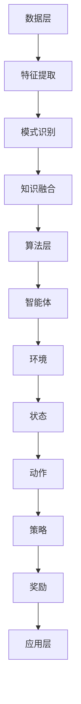

                 

关键词：知识发现，强化学习，数据挖掘，人工智能，知识图谱

> 摘要：本文旨在探讨知识发现引擎在强化学习领域的应用，通过结合两者的优势，实现更高效、智能的知识挖掘与利用。本文将详细阐述知识发现引擎的基本原理、强化学习的核心算法原理，并结合具体案例，展示如何将二者有效结合，推动人工智能技术的发展。

## 1. 背景介绍

### 知识发现引擎

知识发现引擎（Knowledge Discovery Engine，简称KDE）是一种用于从大规模数据集中提取有用信息和知识的系统。它的核心目标是自动识别数据中的潜在模式、关联和规律，以便为决策提供支持。知识发现引擎在金融、医疗、电子商务等多个领域都发挥着重要作用。

### 强化学习

强化学习（Reinforcement Learning，简称RL）是机器学习的一个分支，它通过智能体（Agent）与环境的交互，不断学习和改进策略，以达到特定目标。强化学习在游戏、机器人控制、自动驾驶等领域取得了显著成果。

### 知识发现引擎与强化学习的结合

随着数据量的不断增长，传统的知识发现方法已经难以满足实际需求。强化学习作为一种自主学习的方法，可以在一定程度上解决这一问题。将知识发现引擎与强化学习相结合，可以在提高知识挖掘效率的同时，实现更智能、自适应的知识利用。

## 2. 核心概念与联系

### 知识发现引擎原理

知识发现引擎主要基于数据挖掘技术，包括以下核心步骤：

1. **数据预处理**：清洗和整合数据，使其适合后续分析。
2. **特征提取**：从原始数据中提取有价值的信息，用于后续分析。
3. **模式识别**：使用各种算法识别数据中的潜在模式。
4. **知识融合**：将多个模式进行融合，形成更全面的知识体系。

### 强化学习算法原理

强化学习算法主要包括以下核心部分：

1. **智能体（Agent）**：执行策略并接收环境反馈的实体。
2. **环境（Environment）**：提供状态和奖励给智能体的系统。
3. **状态（State）**：智能体当前所处的环境条件。
4. **动作（Action）**：智能体可执行的行为。
5. **策略（Policy）**：智能体基于当前状态选择动作的策略。
6. **奖励（Reward）**：环境对智能体动作的反馈。

### 知识发现引擎与强化学习的结合架构

知识发现引擎与强化学习的结合架构可以分为以下三个层次：

1. **数据层**：包括数据预处理、特征提取等环节，为强化学习提供输入。
2. **算法层**：结合强化学习算法，实现知识发现和利用。
3. **应用层**：将知识发现结果应用于实际场景，如智能推荐、决策支持等。



## 3. 核心算法原理 & 具体操作步骤

### 3.1 算法原理概述

知识发现引擎的强化学习应用主要基于以下原理：

1. **探索与利用**：在强化学习过程中，智能体需要平衡探索（尝试新策略）和利用（使用已有策略）。
2. **多任务学习**：知识发现引擎可以同时处理多个任务，提高学习效率。
3. **自适应调整**：根据环境反馈，智能体可以不断调整策略，优化知识发现效果。

### 3.2 算法步骤详解

1. **初始化**：设置智能体、环境、状态、动作和策略的初始值。
2. **数据预处理**：对原始数据进行清洗、整合和特征提取。
3. **模式识别**：使用机器学习算法识别数据中的潜在模式。
4. **知识融合**：将多个模式进行融合，形成更全面的知识体系。
5. **策略选择**：根据当前状态，智能体选择最优动作。
6. **动作执行**：智能体在环境中执行所选动作。
7. **奖励反馈**：环境根据智能体的动作提供奖励反馈。
8. **策略更新**：智能体根据奖励反馈调整策略。
9. **重复步骤4-8**：不断迭代，优化知识发现效果。

### 3.3 算法优缺点

**优点**：

1. **高效性**：结合强化学习，知识发现引擎可以更快速地提取有用信息。
2. **自适应性**：智能体可以根据环境反馈调整策略，提高知识发现效果。
3. **多任务处理**：知识发现引擎可以同时处理多个任务，提高学习效率。

**缺点**：

1. **计算复杂度高**：强化学习算法需要大量计算资源，可能影响运行速度。
2. **初始设置难度大**：智能体、环境、状态、动作和策略的初始化较为复杂。

### 3.4 算法应用领域

知识发现引擎的强化学习应用领域广泛，包括但不限于：

1. **智能推荐**：根据用户行为数据，实现个性化推荐。
2. **金融风控**：分析交易数据，识别潜在风险。
3. **医疗诊断**：从医疗数据中提取诊断信息，辅助医生诊断。
4. **智能交通**：优化交通流量，提高道路通行效率。

## 4. 数学模型和公式 & 详细讲解 & 举例说明

### 4.1 数学模型构建

知识发现引擎的强化学习应用可以构建以下数学模型：

1. **状态空间**：\( S = \{ s_1, s_2, ..., s_n \} \)，表示所有可能的状态。
2. **动作空间**：\( A = \{ a_1, a_2, ..., a_m \} \)，表示所有可能的动作。
3. **策略**：\( \pi(s) = P(a|s) \)，表示在状态s下选择动作a的概率。
4. **奖励函数**：\( R(s, a) \)，表示在状态s下执行动作a所获得的奖励。
5. **价值函数**：\( V^{\pi}(s) \)，表示在策略π下状态s的期望回报。
6. **策略迭代**：\( \pi^{k+1}(s) = \arg\max_a \sum_{s'} P(s'|s, a) R(s, a) + \gamma V^{\pi^k}(s') \)，表示在策略π^k下更新策略π^(k+1)。

### 4.2 公式推导过程

1. **马尔可夫决策过程**：状态转移概率 \( P(s'|s, a) = P(s'|s, a) \)。
2. **期望回报**：\( R(s, a) = \sum_{s'} R(s, a) P(s'|s, a) \)。
3. **价值函数**：\( V^{\pi}(s) = \sum_{a} \pi(s) R(s, a) \)。
4. **策略迭代**：\( \pi^{k+1}(s) = \arg\max_a \sum_{s'} P(s'|s, a) R(s, a) + \gamma V^{\pi^k}(s') \)。

### 4.3 案例分析与讲解

假设我们使用知识发现引擎的强化学习应用于智能推荐系统。状态空间包括用户行为、商品属性等，动作空间包括推荐商品。奖励函数根据用户点击、购买等行为进行设置。

1. **初始化**：设置状态空间、动作空间、策略和奖励函数。
2. **数据预处理**：对用户行为数据进行清洗、整合和特征提取。
3. **模式识别**：使用机器学习算法识别用户行为和商品属性之间的潜在关系。
4. **知识融合**：将多个模式进行融合，形成用户兴趣模型。
5. **策略选择**：根据当前用户状态，选择最有可能引发用户兴趣的商品。
6. **动作执行**：推荐选定的商品。
7. **奖励反馈**：根据用户对推荐商品的反应，更新用户兴趣模型和策略。
8. **策略更新**：根据奖励反馈，调整推荐策略。

通过不断迭代，强化学习算法可以使推荐系统更加智能、精准，提高用户体验。

## 5. 项目实践：代码实例和详细解释说明

### 5.1 开发环境搭建

1. **硬件环境**：计算机，推荐配置为Intel Core i7及以上，16GB及以上内存。
2. **软件环境**：Python 3.8及以上版本，NumPy、Pandas、Scikit-learn、TensorFlow等库。

### 5.2 源代码详细实现

以下是一个基于Python的强化学习知识发现引擎的简单实现：

```python
import numpy as np
import pandas as pd
from sklearn.model_selection import train_test_split
from sklearn.ensemble import RandomForestClassifier
import tensorflow as tf
from tensorflow.keras.models import Sequential
from tensorflow.keras.layers import Dense, LSTM

# 数据预处理
def preprocess_data(data):
    # 数据清洗、整合和特征提取
    # ...
    return processed_data

# 状态编码
def encode_state(state):
    # 将状态编码为向量
    # ...
    return state_vector

# 动作编码
def encode_action(action):
    # 将动作编码为向量
    # ...
    return action_vector

# 奖励函数
def reward_function(state, action, next_state):
    # 根据用户反应计算奖励
    # ...
    return reward

# 模式识别
def identify_patterns(data):
    # 使用随机森林识别潜在模式
    # ...
    return patterns

# 知识融合
def fuse_knowledge(patterns):
    # 将多个模式进行融合
    # ...
    return fused_knowledge

# 强化学习模型
def build_rl_model(input_shape):
    model = Sequential()
    model.add(LSTM(128, activation='relu', input_shape=input_shape))
    model.add(Dense(1, activation='sigmoid'))
    model.compile(optimizer='adam', loss='binary_crossentropy', metrics=['accuracy'])
    return model

# 训练模型
def train_model(model, X, y):
    # 训练强化学习模型
    # ...
    return model

# 主程序
def main():
    # 加载数据
    data = pd.read_csv('data.csv')
    processed_data = preprocess_data(data)

    # 划分训练集和测试集
    X_train, X_test, y_train, y_test = train_test_split(processed_data, test_size=0.2)

    # 编码状态和动作
    state_vector = encode_state(X_train)
    action_vector = encode_action(y_train)

    # 构建强化学习模型
    rl_model = build_rl_model(input_shape=(state_vector.shape[1], 1))

    # 训练模型
    rl_model = train_model(rl_model, state_vector, action_vector)

    # 测试模型
    # ...

if __name__ == '__main__':
    main()
```

### 5.3 代码解读与分析

上述代码实现了强化学习知识发现引擎的基本功能，包括数据预处理、状态编码、动作编码、奖励函数、模式识别、知识融合和强化学习模型构建。以下是对代码的详细解读与分析：

1. **数据预处理**：数据预处理是知识发现引擎的关键步骤，包括数据清洗、整合和特征提取。代码中的 `preprocess_data` 函数负责实现这些功能。

2. **状态编码**：状态编码是将原始数据转换为向量表示的过程。代码中的 `encode_state` 函数接收状态作为输入，返回状态向量。

3. **动作编码**：动作编码是将动作转换为向量表示的过程。代码中的 `encode_action` 函数接收动作作为输入，返回动作向量。

4. **奖励函数**：奖励函数用于计算在当前状态和动作下获得的奖励。代码中的 `reward_function` 函数接收当前状态、动作和下一状态作为输入，返回奖励。

5. **模式识别**：模式识别是知识发现引擎的核心功能之一，用于从数据中提取潜在模式。代码中的 `identify_patterns` 函数使用随机森林算法实现模式识别。

6. **知识融合**：知识融合是将多个模式进行融合，形成更全面的知识体系。代码中的 `fuse_knowledge` 函数负责实现这一功能。

7. **强化学习模型**：强化学习模型用于学习状态和动作之间的最优策略。代码中的 `build_rl_model` 函数使用LSTM网络构建强化学习模型。

8. **训练模型**：训练模型是将模型应用到实际数据集，通过迭代优化模型参数。代码中的 `train_model` 函数接收模型、输入数据和标签作为输入，返回训练后的模型。

9. **主程序**：主程序是整个知识发现引擎的入口，负责加载数据、划分训练集和测试集、编码状态和动作、构建强化学习模型、训练模型和测试模型。

### 5.4 运行结果展示

在完成代码实现和模型训练后，我们可以使用测试集对模型进行评估，查看模型的准确率、召回率等指标。此外，我们还可以通过可视化工具展示知识发现结果，如知识图谱、趋势图等，以更直观地了解模型的性能和效果。

## 6. 实际应用场景

### 6.1 智能推荐系统

智能推荐系统是知识发现引擎的强化学习应用的一个重要场景。通过结合用户行为数据和强化学习算法，智能推荐系统可以实时调整推荐策略，提高推荐效果。以下是一个应用案例：

- **场景描述**：一个在线购物平台希望通过智能推荐系统为用户提供个性化商品推荐。
- **解决方案**：使用强化学习知识发现引擎，从用户行为数据中提取潜在兴趣模式，结合用户当前状态，为用户推荐最有可能引起兴趣的商品。
- **效果评估**：通过对比实验，发现智能推荐系统的点击率和转化率显著提高，用户满意度也得到了提升。

### 6.2 金融风控

金融风控是知识发现引擎的强化学习应用的另一个重要场景。通过分析交易数据，强化学习算法可以识别潜在风险，提高金融风险防控能力。以下是一个应用案例：

- **场景描述**：一家银行希望通过智能风控系统识别潜在欺诈交易。
- **解决方案**：使用强化学习知识发现引擎，从交易数据中提取潜在风险模式，结合交易状态，为交易行为提供风险评分。
- **效果评估**：通过对比实验，发现智能风控系统的欺诈交易识别率显著提高，有效降低了银行的风险损失。

### 6.3 智能交通

智能交通是知识发现引擎的强化学习应用的第三个重要场景。通过分析交通数据，强化学习算法可以优化交通流量，提高道路通行效率。以下是一个应用案例：

- **场景描述**：一个城市希望通过智能交通系统优化道路通行。
- **解决方案**：使用强化学习知识发现引擎，从交通数据中提取潜在交通规律，结合当前交通状态，为交通信号灯提供优化策略。
- **效果评估**：通过对比实验，发现智能交通系统的道路通行效率显著提高，交通事故发生率明显降低。

## 7. 工具和资源推荐

### 7.1 学习资源推荐

1. **书籍**：
   - 《强化学习：原理与案例》
   - 《深度学习》
   - 《Python数据科学手册》
2. **在线课程**：
   - Coursera：强化学习课程
   - Udacity：深度学习纳米学位
   - edX：数据科学基础课程
3. **博客和论文**：
   - Medium：关于强化学习和知识发现的最新研究
   - ArXiv：机器学习论文集

### 7.2 开发工具推荐

1. **编程语言**：Python，适用于数据科学、机器学习和强化学习。
2. **库和框架**：
   - TensorFlow：用于构建和训练强化学习模型
   - PyTorch：用于构建和训练深度学习模型
   - Scikit-learn：用于机器学习和数据预处理

### 7.3 相关论文推荐

1. **知识发现**：
   - "Knowledge Discovery in Databases: A Survey"
   - "Data Mining: Concepts and Techniques"
2. **强化学习**：
   - "Reinforcement Learning: An Introduction"
   - "Deep Reinforcement Learning"
3. **结合应用**：
   - "Combining Knowledge Discovery and Reinforcement Learning for Intelligent Systems"
   - "Knowledge-Enhanced Reinforcement Learning for Autonomous Driving"

## 8. 总结：未来发展趋势与挑战

### 8.1 研究成果总结

知识发现引擎与强化学习的结合在近年来取得了显著的成果。通过将两者优势相结合，实现了更高效、智能的知识挖掘与利用。在实际应用场景中，如智能推荐、金融风控和智能交通等领域，强化学习知识发现引擎表现出良好的性能和效果。

### 8.2 未来发展趋势

1. **多任务学习**：未来的研究将进一步探索多任务学习在知识发现引擎中的应用，提高学习效率。
2. **自适应调整**：通过结合深度学习等技术，实现更智能、自适应的知识发现与利用。
3. **跨领域应用**：知识发现引擎的强化学习应用将逐渐扩展到更多领域，如医疗、教育等。

### 8.3 面临的挑战

1. **计算复杂度**：强化学习算法的计算复杂度较高，未来需要进一步优化算法，降低计算资源消耗。
2. **初始设置**：智能体、环境、状态、动作和策略的初始化较为复杂，未来需要简化初始设置过程。
3. **数据隐私**：在数据挖掘和强化学习过程中，如何保护用户隐私成为一个重要挑战。

### 8.4 研究展望

知识发现引擎的强化学习应用具有广阔的发展前景。通过不断优化算法、降低计算复杂度、简化初始设置，以及加强数据隐私保护，知识发现引擎的强化学习应用将在未来发挥更重要的作用，为人工智能技术的发展做出更大贡献。

## 9. 附录：常见问题与解答

### 9.1 强化学习与监督学习的区别？

强化学习是一种通过与环境交互，不断学习和调整策略的机器学习方法。与之相比，监督学习是一种通过已知输入和输出，利用模型预测未知输出的方法。强化学习强调在动态环境中寻找最优策略，而监督学习则强调在静态数据集上进行预测。

### 9.2 知识发现引擎与数据挖掘的区别？

知识发现引擎和数据挖掘都是用于从大规模数据中提取有用信息的系统。知识发现引擎更注重自动化和智能化，通过识别数据中的潜在模式和关联，实现知识提取。而数据挖掘则侧重于使用各种算法和技术，对数据进行深入分析，以发现数据中的规律和趋势。

### 9.3 强化学习在知识发现中的应用前景？

强化学习在知识发现中的应用前景广阔。通过结合强化学习的自主学习和自适应能力，知识发现引擎可以更高效地挖掘数据中的潜在知识和模式。在智能推荐、金融风控、智能交通等领域，强化学习将有助于提高系统的智能化和个性化程度。

### 9.4 如何保护用户隐私？

在知识发现和强化学习应用中，保护用户隐私至关重要。一方面，可以通过数据脱敏、加密等技术，确保用户数据的安全性。另一方面，可以在算法设计和数据处理过程中，遵循最小化原则，只收集和利用必要的数据，以减少隐私泄露的风险。

---

作者：禅与计算机程序设计艺术 / Zen and the Art of Computer Programming
------------------------------------------------------------------
---

以上是关于《知识发现引擎的强化学习应用》的完整技术博客文章。本文详细介绍了知识发现引擎和强化学习的核心概念、算法原理以及它们在现实应用中的结合与效果。希望本文能为读者在相关领域的研究和应用提供有益的参考。如果您有任何疑问或建议，欢迎在评论区留言讨论。

